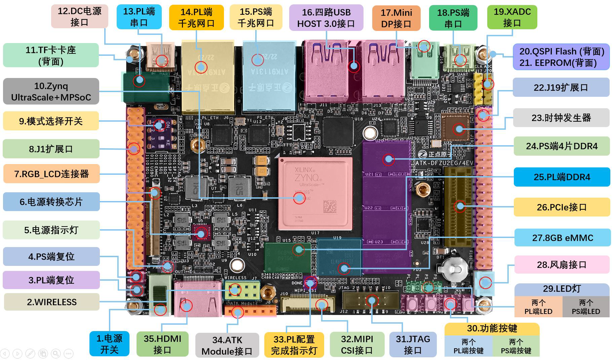
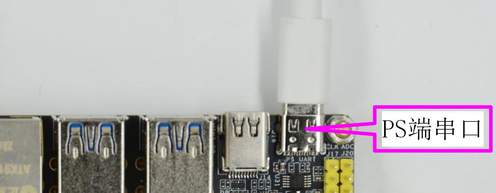

# DFZU2EG MPSoC 板级支持包说明

## 1. 简介

正点原子 DFZU2EG MPSoC 开发板采用Xilinx的Zynq UltraScale+ MPSoC芯片作为主控芯片。它主要分为PS和PL两部分，在PS部分中主要由Arm Cortex A53（APU 共4个核）、Arm Cortex R5F（RPU 共两个核）以及Arm Mali 400 MP2（GPU）三种内核处理器构成，并且还包括DDR 控制单元、平台管理单元、高速外设控制器以及普通外设控制器等外设组成。

该板级支持包主要是针对APU做的一份移植，支持RT-Thread标准版和Smart版内核。

DFZU2EG MPSoC 开发板的详细资源信息可以查阅正点原子此开发板的相关手册，也可以参考下图：



## 2. 编译说明

推荐使用ubuntu20的[env环境](https://github.com/RT-Thread/env)，当然也可以使用windows上的[env工具](https://www.rt-thread.org/download.html#download-rt-thread-env-tool)进行编译。下面介绍**标准版**和**Smart版本**的编译流程。

### 2.1 RT-Thread编译

**1.menuconfig配置工程：**

该BSP默认menuconfig支持的就是RT-Thread标准版，无需配置工程。

**2.配置工具链相关环境：**

依次执行下面命令进行环境变量的相关配置：

```shell
export RTT_CC=gcc
export RTT_EXEC_PATH="/opt/tools/gnu_gcc/arm-gnu-toolchain-13.2.Rel1-x86_64-aarch64-none-elf/bin"
export RTT_CC_PREFIX=aarch64-none-elf-
export PATH=$PATH:$RTT_EXEC_PATH
```

**3.编译：**

```shell
scons -j12
```

### 2.2 RT-Smart编译

**1.menuconfig配置工程：**

```shell
RT-Thread Kernel --->
    [*] Enable RT-Thread Smart (microkernel on kernel/userland)
```

**2.配置工具链相关环境：**

依次执行下面命令进行环境变量的相关配置：

```shell
export RTT_CC=gcc
export RTT_EXEC_PATH="/opt/tools/gnu_gcc/aarch64-linux-musleabi_for_x86_64-pc-linux-gnu/bin"
export RTT_CC_PREFIX=aarch64-linux-musleabi-
export PATH=$PATH:$RTT_EXEC_PATH
```

**3.编译：**

```shell
scons -j12
```

如果编译正确无误，会产生 `rtthread.elf`, `rtthread.bin` 文件。

## 3. 环境搭建

### 3.1 准备好串口线

连线情况如下图所示：



串口参数： 115200 8N1 ，硬件和软件流控为关。

### 3.2 RTT固件放在SD卡运行

暂时不支持，需要使用 u-boot 加载。

### 3.3 RTT程序用uboot加载

需要注意的以下问题：

- 保证开发板和保存固件的PC机处于同一网段，互相可以ping通。
- 保证PC机已经成功配置TFTP的相关服务。

可以使用开发板出厂自带的uboot(EMMC)来加载RTT程序，将网线连接到开发板的PS网口，然后在uboot控制台输入下列命令：

```shell
setenv ipaddr 192.168.1.50
setenv ethaddr b8:ae:1d:01:00:00
setenv gatewayip 192.168.1.1
setenv netmask 255.255.255.0
setenv serverip 192.168.1.3
tftpboot 0x00200000 rtthread.bin
go 0x00200000
```

其中`192.168.1.3`为TFTP服务器的PC机的IP地址，大家可以根据自己的实际情况进行修改。

执行完上述命令后，uboot就可以自动从tftp服务器上获取固件，然后开始执行了。

完成后可以看到串口的输出信息：

**标准版log信息：**

```shell
heap: [0x00299540 - 0x04000000]

 \ | /
- RT -     Thread Operating System
 / | \     5.1.0 build Apr 11 2024 11:43:19
 2006 - 2024 Copyright by RT-Thread team
hello rt-thread
msh />
```

**Smart版log信息：**

```shell
heap: [0x002fd030 - 0x04000000]

 \ | /
- RT -     Thread Smart Operating System
 / | \     5.1.0 build Apr 11 2024 11:47:02
 2006 - 2024 Copyright by RT-Thread team
Press any key to stop init process startup ... 3
Press any key to stop init process startup ... 2
Press any key to stop init process startup ... 1
Starting init ...
[E/lwp] lwp_startup: init program not found
Switching to legacy mode...
hello rt-thread
msh />
```

## 4. 支持情况

| 驱动 | 支持情况  |  备注  |
| ------ | ----  | :------:  |
| UART | 支持 | UART0 |
| GPIO | 暂不支持 | - |
| SPI | 暂不支持 | - |
| SDIO | 暂不支持 | - |
| ETH | 暂不支持 | - |

目前BSP仅保证成功运行，驱动后续会慢慢支持！

## 5. 注意事项

对于ZYNQ的开发，需要使用Vivado软件对开发板的硬件进行一些配置，来生产相应的fsbl.elf文件，比如串口引脚的初始化等等，所以如果大家需要修改串口的输出引脚信息，需要更新fsbl.elf，而这些知识是需要具备一定的ZYNQ开发基础的。

## 6. 联系人信息

维护人：[liYony](https://github.com/liYony)
