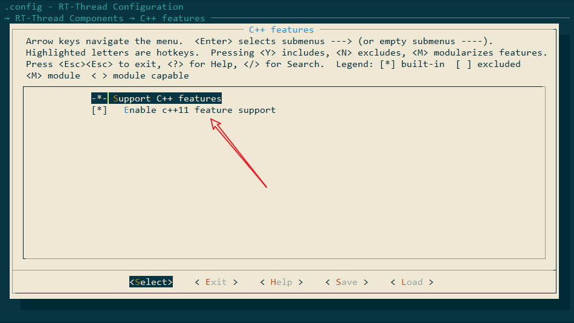

# cpp 11 support for rt-thread

这是 RT-Thread 中的 c++ 11 组件。 为了支持c++语言，此组件实现一个基本的环境，比如 new/delete 操作符。

## 如何使用

请注意，在 RT-Thread 中使用 C++ 11，需要修改工具链中的部分文件。请在修改之前，备份好工具链。

1. 使能 c++11
   

2. 下载 GCC 工具链

   ```shell
   gcc version 10.2.1 20201103 (release) (GNU Arm Embedded Toolchain 10-2020-q4-major)
   ```

3. 删除下面的文件

   ```shell
   rm -f toolchain/arm-none-eabi/include/c++/10.2.1/thread
   rm -f toolchain/arm-none-eabi/include/c++/10.2.1/mutex
   rm -f toolchain/arm-none-eabi/include/c++/10.2.1/condition_variable
   rm -f toolchain/arm-none-eabi/include/c++/10.2.1/future
   rm -f toolchain/arm-none-eabi/include/pthread.h
   ```

4. 请清除下面文件的内容，保留文件避免编译失败

   ```shell
   toolchain/arm-none-eabi/include/sys/_pthreadtypes.h
   ```

5. 更新 `rtconfig.py` 文件，添加 c++ 编译参数:

   ```shell
   CXXFLAGS = CFLAGS  + ' -std=c++14 -fabi-version=0 -MMD -MP -MF'
   ```
