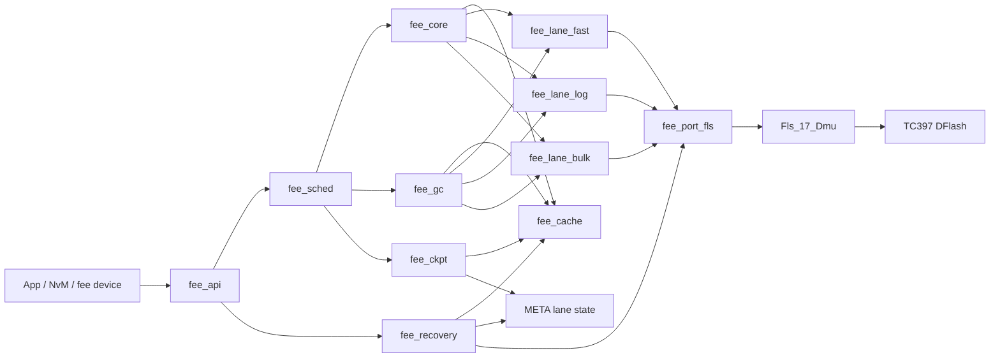
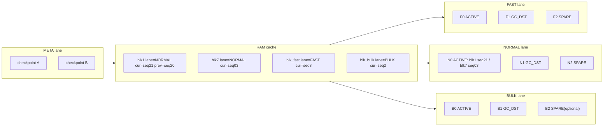
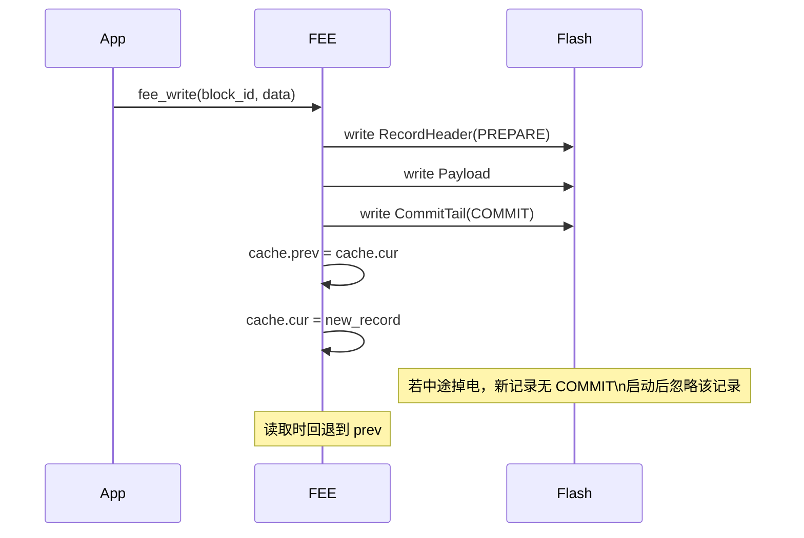

# TC397 DFlash FEE 重构设计方案

## 1. 目的

本文档用于指导在 TC397 DFlash 上重新实现一套面向固定逻辑块的 FEE 机制，目标是替代通用 KV 模型在 GC 阶段带来的长尾延迟问题，并保留掉电恢复、块级回滚和异步后台整理能力。

本文档基于以下现状：

- 当前项目使用 Infineon MCAL `Fee/Fls_17_Dmu/NvM` 组合完成持久化。
- 参考对比对象为 `FlashDB` 的 `KVDB` 代码路径。
- 底层介质为 TC397 DFlash，当前配置为 8 B page、512 B wordline、单个 NVM sector 56 KiB。

说明：

- 文档前半部分会使用当前工程和 AUTOSAR 规范做对比，目的是解释问题来源。
- 文档后半部分的“最终方案”按 greenfield 前提设计，可以推翻当前的 immediate block、QS、双 sector 划分和现有地址布局。

配套子文档：

- `fee_onflash_format.md`: 约束 on-flash 数据结构、字段编码和提交规则
- `fee_boot_recovery.md`: 约束启动恢复、checkpoint 恢复和首个可读时刻
- `fee_port_adapter.md`: 约束底层 flash 驱动适配接口和能力参数
- `fee_scheduler_gc.md`: 约束调度、排队、抢占和 GC 步进
- `fee_cache_checkpoint.md`: 约束 RAM cache、checkpoint 刷写和 tail 上界
- `fee_cfg_rules.md`: 约束 block 配置表、lane 映射和编译期校验

## 2. 背景与问题

### 2.1 当前工程中的 FEE 机制

当前工程的持久化调用链为：

```text
App
  -> NvM
    -> MemIf
      -> Fee
        -> Fls_17_Dmu
          -> DFlash
```

当前 MCAL FEE 的关键特征：

- 逻辑单元是固定 `block_id`，不是通用 KV。
- 写入采用追加写，不对旧数据原地覆盖。
- Cache 中保留当前副本与前一副本状态。
- 上电初始化通过扫描 sector 重建块缓存。
- GC 由 `Fee_MainFunction()` 驱动，以状态机方式异步推进。

当前代码里可以看到的回滚相关状态包括：

- `Valid`
- `Consistent`
- `PrevCopyValid`
- `PrevCopyConsistent`
- `PrevCopyAddress`

这说明当前工程里的“数据回滚”本质上已经不是业务层版本回退，而是“回退到最近一次写成功的完整块副本”。

### 2.2 FlashDB GC 慢的根因

以 `FlashDB` 的 `KVDB` 为例，GC 的典型路径是：

```text
alloc/new kv 失败
  -> gc_collect_by_free_size()
    -> sector_iterator()
      -> do_gc()
        -> read_kv()
        -> 检查 crc/status
        -> move_kv()
        -> format_sector()
```

这类机制的问题是：

- GC 常在空间不够时被动触发，容易卡在业务写路径上。
- GC 需要枚举 sector 内所有物理记录，复杂度与脏扇区内容直接相关。
- 每条记录都要校验和搬运，尾时延不稳定。
- 通用 KV 模型对固定块场景有额外元数据和查找成本。

因此，如果目标是实现一个更稳的 automotive 风格 FEE，就不应继续按通用 KVDB 的思路设计。

## 3. 重构目标

### 3.1 目标

- 面向固定逻辑块 `block_id`，而不是任意字符串 key。
- 写入路径保持追加写，避免原地修改。
- 读路径在初始化后保持 O(1)。
- 支持掉电恢复。
- 支持块级回滚到上一份完整数据。
- GC 改为提前触发、增量执行、每周期工作量可控。
-  DFlash 的写入粒度需要配置可选。

### 3.2 非目标

- 不实现通用 KV 数据库。
- 第一阶段不实现复杂查询、范围遍历和字符串 key。
- 第一阶段不复刻 AUTOSAR Fee 的所有扩展能力，例如 QS、uncfg block、完整诊断钩子。

## 4. 底层约束

当前配置可从现有工程抽取出以下约束：

| 项目 | 当前值 |
| --- | --- |
| DFlash base | `0xAF000000` |
| DFlash total size | `0x80000` |
| NVM Sector0 | `0xAF000000 ~ 0xAF00DFFF` |
| NVM Sector1 | `0xAF00E000 ~ 0xAF01BFFF` |
| 单个 NVM sector 大小 | `0xE000` = 56 KiB |
| QS area | `0xAF01C000 ~ 0xAF01FFFF` |
| page size | `8 B` |
| wordline size | `512 B` |
| erase suspend | `OFF` |

这些约束直接影响设计：

- 所有头部、尾部和状态位必须按 8 B 对齐，需保留配置项可变。
- 大块写入应尽量按 512 B 切片，需保留配置项可变，降低底层驱动适配复杂度。
- 擦除无法安全抢占时，GC 必须更早开始。
- 推荐优先考虑 3-sector ring，而不是极限压缩到 2-sector。

### 4.1 AUTOSAR 4.4 约束抽取

结合 `AUTOSAR_SWS_FlashEEPROMEmulation.pdf`，对性能最有影响的规范约束主要有以下几条：

| 规范项 | 含义 | 对新设计的影响 |
| --- | --- | --- |
| `SWS_Fee_00022` | `Fee_Read` 在 `MEMIF_IDLE` 或 `MEMIF_BUSY_INTERNAL` 时应接受请求 | 内部 GC 进行中时，读请求不能一律拒绝 |
| `SWS_Fee_00025` | `Fee_Write` 在 `MEMIF_IDLE` 或 `MEMIF_BUSY_INTERNAL` 时应接受请求 | 内部整理进行中时，写请求应支持排队或抢占策略 |
| `SWS_Fee_00192` | `Fee_InvalidateBlock` 在 `MEMIF_BUSY_INTERNAL` 时也应接受 | 失效操作不能因 GC 一刀切拒绝 |
| `SWS_Fee_00009` | immediate block 必须可立即写，不能等待内部管理操作，也不能等待先擦除目标区 | 必须存在预擦除保留区或独立 immediate lane |
| `SWS_Fee_00067` | `Fee_EraseImmediateBlock` 的职责是保证 immediate 可写 | 设计中必须明确 immediate 容量保证机制 |
| `SWS_Fee_00153/00154` | 写开始时块应标记为 corrupted，写成功后恢复为 not corrupted | 必须有明确的提交点，不能靠 RAM 状态判断一致性 |
| `SWS_Fee_00102/00103` | 每个块应可配置期望擦写次数，FEE 应分散写入 | 应按热度或擦写寿命等级分层布局，而不是所有块同等待遇 |

由此可以得到一个重要结论：

- AUTOSAR 并没有要求 FEE 必须做成“复杂通用数据库”。
- AUTOSAR 真正要求的是：异步接口语义、内部状态可恢复、immediate 可快速完成、块一致性可判定、擦写寿命可配置。
- 因此，针对固定块场景完全可以用更强的布局约束换取更快的实现。

### 4.2 当前工程实现中的性能相关事实

结合当前 `Fee.c` 和配置，已经能看到几个直接影响读写时延的点：

| 项目 | 当前实现 | 对性能的影响 |
| --- | --- | --- |
| 数据类型 | `FEE_DOUBLE_SECTOR_AND_QUASI_STATIC_DATA` | 同一套状态机同时处理 normal data 和 QS，代码路径更重 |
| immediate block | Block 16，大小 `4096 B` | immediate 语义和低尾时延之间存在明显冲突 |
| GC 阈值 | `2048 B` | 若把该阈值当 immediate 预留区，则小于当前 `4096 B` immediate block 大小 |
| 单次写/比较长度 | `FEE_MAX_BYTES_PER_CYCLE = 64` | 在 512 B wordline 上会放大状态切换次数和同步 compare 成本 |
| 每轮缓存扫描页数 | `FEE_PAGES_PER_FEEMAIN = 65535` | 初始化和 GC 扫描粒度几乎不受控 |
| 擦除挂起 | `OFF` | 擦除期间的读写插队能力受限 |
| unconfigured block | `FEE_UNCONFIG_BLOCK_IGNORE` | 配置上已偏向简化，这一点可以继续强化 |
| previous copy API | `STD_OFF` | 业务侧没有公开的“读旧版本”接口，但内部仍维护 previous copy |

除此之外，当前实现还有三个很重的成本来源：

1. 写入粒度偏小  
   当前 `Fee.c` 将写和比较的单次长度都限制为 `64 B`。对于 `4096 B` 这类大块，请求完成需要跨很多状态机周期推进。

2. wordline 共享处理复杂  
   当前实现包含大量“最后写入 wordline 受影响”的处理逻辑，例如：
   - 同一 wordline 内多块共享
   - 跨 wordline 尾块修复
   - 写后整 wordline compare

   这说明现有布局为了容量利用率，接受了较复杂的恢复路径。

3. 4.2.2 分支对 `BUSY_INTERNAL` 更保守  
   AUTOSAR 4.4 允许 `Read/Write/Invalidate` 在 `MEMIF_BUSY_INTERNAL` 时接受请求并异步执行；而当前实现里至少 `Invalidate` 在 4.2.2 分支下仍倾向于拒绝内部忙状态下的请求。

### 4.3 为快速读写收紧的设计约束

如果目标明确是“更快的读写”和“更短的 GC 长尾”，建议把 FEE 的支持范围主动收紧为下列约束。

#### 4.3.1 接口和功能约束

| 约束 | 目的 | 代价 |
| --- | --- | --- |
| 只支持 `native` block，不在 FEE 层实现 dataset/redundant | 降低地址换算和状态管理复杂度 | dataset/redundant 交给 NvM 或上层处理 |
| 不在 fast path 中支持 QS block | 拆掉额外状态机和分支 | QS 需单独模块或单独区域实现 |
| 不支持 unconfigured block copy | 避免 GC 复制未知对象 | 迁移数据需显式版本管理 |
| `Read/Write/Invalidate` 在 `BUSY_INTERNAL` 时允许排队 | 符合 AUTOSAR 4.4，并减少 GC 期间业务抖动 | 需要 1 级或小队列 pending buffer |
| 公开接口只保留 current copy 读 | 保持业务接口简单 | previous copy 仅内部用于回滚 |

#### 4.3.2 immediate 数据约束

immediate 数据不应只靠“块类型”命名，而应配套容量约束。

建议新增如下条件：

1. `max_immediate_record_span <= immediate_reserve_bytes`
2. `gc_start_threshold >= immediate_reserve_bytes + gc_switch_guard`
3. `immediate_reserve_bytes` 只允许 immediate block 使用，normal block 不得侵占
4. immediate block 的推荐上限为 `<= 1 wordline`，即优先控制在 `<= 512 B`
5. 若业务块大于该上限，不允许定义为 immediate，而应拆成：
   - 小 immediate 索引/标志块
   - 大 normal 数据块

推荐公式：

```text
record_span(block) = align8(record_header + payload + commit_tail)
immediate_reserve_bytes >= max(record_span(all_immediate_blocks)) * burst_factor
gc_start_threshold >= immediate_reserve_bytes + one_record_guard + sector_switch_guard
```

其中：

- `burst_factor = 1` 适用于“任一时刻只保证一次 immediate 写入”
- `burst_factor = N` 适用于“连续 N 次 immediate 写入不等待 GC”

对当前工程，`4096 B` immediate block 是最值得先调整的点。若保留该定义，则：

- immediate reserve 会被迫做得很大
- 单次请求本身也会很长
- 与“内部管理操作不应延迟 immediate 写入”的目标相冲突

#### 4.3.3 记录布局约束

为了降低恢复和 compare 成本，建议增加以下布局规则：

1. 一个 logical record 不能与其他 block 共享同一个 wordline。
2. record 起始地址必须按 `wordline` 对齐，或者至少 header 按 `wordline` 对齐。
3. 若 `record_span(block) > 1 wordline`，该块自动归类为 `large block`。
4. `large block` 不与小块混写在同一条追加日志内。

这会损失一部分容量利用率，但可以显著减少：

- WL 共享恢复
- 最后写入 WL 污染判定
- WL 全量 compare
- 中断恢复状态数

#### 4.3.4 块大小分类约束

建议在配置阶段按大小把块分成三类：

| 类型 | 推荐大小 | 策略 |
| --- | --- | --- |
| `small` | `<= 448 B` | 单条 record 尽量控制在一个 wordline 内完成 |
| `medium` | `449 B ~ 2048 B` | 允许多 wordline，仍走普通 append log |
| `large` | `> 2048 B` | 单独放入 large-block lane，避免拖慢小块 |

这里将 `448 B` 作为 small 上限，是为了给 header/tail 留出空间，尽量保持“单 wordline 提交”。

对 large block，建议至少满足以下约束之一：

- 不允许定义为 immediate
- 单独使用一组 sector
- 独立 GC，不与小块混搬

#### 4.3.5 写入粒度约束

当前实现的 `64 B` 单次写/比较粒度偏保守。若目标是更快完成一次业务写，应优先改成与底层介质更一致的粒度：

| 方案 | 特点 |
| --- | --- |
| `64 B` | 状态切换多，吞吐偏低，但单步工作量小 |
| `256 B` | 折中 |
| `512 B = 1 wordline` | 吞吐最高，最利于简化恢复和 compare 路径 |

建议新实现按下述规则：

1. 小块优先单 wordline 提交
2. 大块按 wordline 切片写入
3. 不再做“任意 64 B 软件 compare”作为主路径
4. 一致性判定优先依赖：
   - `commit tail`
   - `CRC`
   - 底层 FLS/ECC 错误反馈

如果项目安全要求必须做 compare，也建议按完整 wordline 或完整 record 做，而不是 64 B 小片比较。

#### 4.3.6 热冷分离约束

AUTOSAR 要求可配置擦写次数，因此配置里应明确块热度，而不是默认所有块同策略。

建议为每个块新增：

- `write_cycle_class`
- `temperature_class`
- `lane_type`

例如：

| 类别 | 说明 | 存放策略 |
| --- | --- | --- |
| `HOT_IMM` | 高频且 immediate | 独立 immediate reserve / hot lane |
| `HOT_NORM` | 高频普通块 | 独立 hot sector ring |
| `COLD_NORM` | 低频普通块 | 冷数据 sector |
| `LARGE_COLD` | 低频大块 | large-block lane |

这样做的收益是：

- hot block 不会拖累 cold block 的 GC
- hot block 可单独做更高磨损均衡
- cold block 的有效空间利用率更高

#### 4.3.7 启动时间约束

如果后续也关心“上电后尽快可读”，建议增加：

1. `checkpoint` 或 `mini index page`
2. 限定一次初始化扫描的最大页数
3. 上电先恢复索引，再后台补全深度校验

否则当前“全量顺序扫 sector 重建 cache”的路径，在块数和历史记录增多后会逐步变慢。

### 4.4 推倒重来的完整设计基线

从这一节开始，后续章节默认采用完整重构方案，而不是在当前配置上打补丁。

#### 4.4.1 总体思想

完整方案不再把所有块混在一条追加日志里，而是按业务特性拆成多个 lane：

- `META lane`: 保存 checkpoint / superblock / 全局代数
- `FAST lane`: 只放高优先级小块，保证最短写入时延
- `NORMAL lane`: 放绝大多数普通块
- `BULK lane`: 放大块或低频大块，避免拖慢小块

每个 lane 独立维护：

- active sector
- gc destination sector
- spare sector
- lane 级 free pointer
- lane 级 GC 状态机

这样做的核心收益是：

- FAST 写不会被 NORMAL/BULK GC 拖住
- 大块搬迁不会影响小块尾时延
- 不同热度块可以独立做磨损均衡
- 启动恢复和容量规划都更清晰

#### 4.4.2 逻辑块分类

建议 block 配置不再只区分 `normal/immediate`，而是至少包含以下四类：

| 类别 | 适用场景 | 设计规则 |
| --- | --- | --- |
| `FAST` | 故障标志、状态字、短配置项 | 必须单次快速写入，优先限制到单 record/单 wordline |
| `NORMAL` | 常规配置和状态块 | 走主日志和增量 GC |
| `BULK` | 大块、镜像、长报文、trace | 独立 lane，独立 GC |
| `META` | checkpoint、superblock | 双副本或双页轮换 |

其中：

- 对 AUTOSAR 语义，`FAST` 可视为 `immediate block` 的实现映射。
- 对外接口仍可保留 `immediate` 配置项，但内部统一落到 `FAST lane`。
- 不再推荐单独设计“immediate reserve 区”；保留能力由 `FAST lane` 的独立 `SPARE` 和 headroom 保证。

建议配置阶段做强校验：

1. `FAST` 块的 `record_span` 必须小于等于配置上限。
2. `BULK` 块不得标记为 `FAST`。
3. `FAST/NORMAL/BULK` 的 lane 不允许混用。
4. 同一 lane 内不得混入不同一致性策略的块。

#### 4.4.2.1 block 配置模型

建议把 block 配置做成强约束描述，而不是只保留 `block_id + size`。

| 字段 | 说明 | 约束建议 |
| --- | --- | --- |
| `block_id` | 逻辑块号 | 全局唯一 |
| `block_class` | `FAST/NORMAL/BULK/META` | 决定 lane 和调度优先级 |
| `max_len` | 最大有效载荷长度 | 编译期固定 |
| `lane_type` | 目标 lane | 必须与 `block_class` 一致 |
| `endurance_class` | 擦写寿命等级 | `HOT/WARM/COLD` 等 |
| `keep_prev_copy` | 是否保留上一份完整副本 | 推荐 `FAST/NORMAL` 打开 |
| `allow_rollback` | 是否允许显式回滚 | 安全关键块可关闭 |
| `crc_mode` | `NONE/CRC16/CRC32` | 建议按块大小选择 |
| `record_align` | `8B` 或 `1 wordline` | `FAST` 建议固定为 `1 wordline` |
| `boot_critical` | 是否要求启动后优先可读 | 可影响 checkpoint 粒度 |

推荐配置结构示例：

```c
typedef struct
{
    uint16 block_id;
    uint16 max_len;
    uint8 block_class;
    uint8 lane_type;
    uint8 endurance_class;
    uint8 keep_prev_copy;
    uint8 allow_rollback;
    uint8 crc_mode;
    uint16 record_align;
} fee_block_cfg_t;
```

建议补充编译期检查：

1. `FAST` 块必须满足 `max_len + header + tail <= fast_single_record_limit`
2. `BULK` 块必须满足 `record_align == wordline`
3. `keep_prev_copy = 1` 的块要计入 lane live 空间预算
4. `allow_rollback = 1` 但 `keep_prev_copy = 0` 时直接报配置错误

#### 4.4.3 推荐物理拓扑

完整方案建议至少具备以下物理拓扑：

| 区域 | 推荐扇区数 | 说明 |
| --- | --- | --- |
| `META lane` | 2 个最小管理单元 | checkpoint A/B 轮换 |
| `FAST lane` | 3 个 erase sector | `ACTIVE + GC_DST + SPARE` |
| `NORMAL lane` | 3 个 erase sector | `ACTIVE + GC_DST + SPARE` |
| `BULK lane` | 2 或 3 个 erase sector | 视容量和业务需求决定 |

其中：

- `FAST lane` 即使空间利用率偏低，也要优先保证可写性。
- `NORMAL lane` 是容量主力。
- `BULK lane` 的目标不是最低时延，而是避免污染小块路径。

如果总容量有限，最先不能省掉的是：

1. `META lane`
2. `FAST lane` 的独立性
3. `NORMAL lane` 的 `ACTIVE + GC_DST + SPARE`

#### 4.4.3.1 容量规划公式

完整方案建议先按 lane 做容量预算，再决定 sector 数量。

定义：

```text
record_span(i) = align(record_header + max_len(i) + commit_tail, record_align(i))
live_span(i)   = record_span(i) * (keep_prev_copy(i) ? 2 : 1)
lane_live      = Σ live_span(i), i ∈ lane
lane_payload   = sector_count(lane) * sector_usable_bytes - lane_mgmt_bytes
lane_headroom  = max_burst_records(lane) * max(record_span(i), i ∈ lane) + switch_guard(lane)
```

建议满足：

```text
lane_payload >= lane_live + lane_headroom + gc_fragment_guard
gc_force_threshold[lane] >= max(record_span(i), i ∈ lane) + switch_guard(lane)
gc_start_threshold[lane] >= gc_force_threshold[lane] + gc_step_slack(lane)
```

其中：

- `lane_live` 反映“当前副本 + 保留上一副本”的最坏常驻空间
- `lane_headroom` 反映 lane 在开始 GC 后仍需接纳的突发写入
- `gc_fragment_guard` 用于吸收对齐和 tombstone 带来的碎片损耗

建议经验值：

- `FAST lane`: `max_burst_records = 2 ~ 4`
- `NORMAL lane`: `max_burst_records = 1 ~ 2`
- `BULK lane`: `max_burst_records = 1`
- `gc_fragment_guard`: 至少 `2 * max_record_span(lane)`

#### 4.4.4 Checkpoint 基线

完整方案建议引入显式 checkpoint，而不是每次上电都全量扫全区域。

checkpoint 至少包含：

- `global_generation`
- 每个 lane 的 `active/dst/spare`
- 每个 lane 的 `free_offset`
- 每个 block 的最新地址
- 每个 block 的 `seq`
- checkpoint 自身 CRC

建议使用：

- 双 checkpoint 副本
- 代数递增
- 最后提交标记

推荐 checkpoint 结构：

```text
+-----------------------------+
| CkptHeader                  |
+-----------------------------+
| LaneState[LANE_COUNT]       |
+-----------------------------+
| BlockMapEntry[BLOCK_COUNT]  |
+-----------------------------+
| CkptTail(COMMIT)            |
+-----------------------------+
```

其中 `BlockMapEntry` 建议至少包含：

- `block_id`
- `lane`
- `cur_addr`
- `prev_addr`
- `cur_seq`
- `flags`

如果 `BLOCK_COUNT` 较大，可把 `BlockMapEntry[]` 拆成多个 checkpoint page 分步写入，但仍必须以统一的 `CkptTail(COMMIT)` 作为唯一提交点。

checkpoint 刷写原则建议为：

1. 不在每次 block 写成功后立即刷 checkpoint
2. 在以下事件后触发 checkpoint：
   - lane GC 完成
   - active sector 切换
   - 连续 `N` 次业务写成功
   - 关键 `boot_critical` 块更新
3. checkpoint 自身也遵循 `header -> payload -> tail commit` 提交规则

启动时流程变为：

1. 读取双 checkpoint，选最新有效副本
2. 按 checkpoint 恢复 RAM cache
3. 只扫描 checkpoint 之后的 tail 区域
4. 如发现中断 GC，则进入 lane 级修复

这样启动时间从“与所有历史记录数量相关”收敛为“与 checkpoint 间隔和尾部脏区相关”。

#### 4.4.5 编译期约束

建议在配置工具或静态检查里直接校验以下规则：

1. `FAST` 块必须满足 `record_span <= fast_record_limit`
2. `FAST` 块禁止跨 wordline 提交
3. `BULK` 块必须映射到 `BULK lane`
4. `lane_reserved_bytes >= max_burst_bytes`
5. `gc_start_threshold[lane] > gc_force_threshold[lane]`
6. `checkpoint_size <= meta_lane_capacity`
7. `sum(block_reserved_bytes) <= lane_usable_capacity`

推荐公式：

```text
record_span = align8(header + payload + tail)
lane_usable_capacity = sector_count * sector_payload - reserved_management_bytes
gc_force_threshold[lane] = max_record_span[lane] + switch_guard[lane]
gc_start_threshold[lane] = gc_force_threshold[lane] + gc_step_budget[lane]
checkpoint_period = f(block_count, write_rate, boot_time_target)
```

#### 4.4.6 一致性策略

完整方案建议把一致性策略定成以下固定规则：

1. `header` 先写
2. `payload` 后写
3. `tail` 最后写
4. `tail.commit_marker` 是唯一提交点
5. cache 只在 `tail` 成功后更新
6. old copy 在 new copy 提交前必须保持可读

因此：

- 业务回滚永远通过 old copy/new copy 关系实现
- 不允许依赖“中间 RAM 状态”判断块有效性
- 不允许在 record 中途原地修正状态

#### 4.4.7 调度策略

完整方案建议区分两级请求队列：

- `urgent queue`: 仅给 `FAST` 请求使用
- `normal queue`: 给 `NORMAL/BULK/read/invalidate` 使用

调度原则：

1. 正在执行的硬件页写不可打断
2. 未开始的普通请求可被 `FAST` 请求抢占
3. `BUSY_INTERNAL` 时允许受理用户请求，进入队列
4. lane 级 GC 只在没有更高优先级用户请求时推进

这比“只要 GC 在跑就拒绝请求”的策略更符合 AUTOSAR 4.4 语义，也更利于系统实时性。

推荐主调度伪代码：

```c
void fee_mainfunction(void)
{
    fee_hw_poll();

    if (fee_hw_is_busy())
    {
        return;
    }

    if (urgent_queue_not_empty())
    {
        dispatch_fast_request();
        return;
    }

    if (checkpoint_due() && !normal_queue_overloaded())
    {
        dispatch_checkpoint();
        return;
    }

    if (normal_queue_not_empty())
    {
        dispatch_normal_request();
        return;
    }

    if (any_lane_force_gc())
    {
        dispatch_force_gc_lane();
        return;
    }

    if (any_lane_requested_gc())
    {
        dispatch_gc_round_robin();
        return;
    }
}
```

建议补充两条公平性规则：

1. `NORMAL/BULK` 用户请求连续等待超过阈值时，禁止 `FAST` 之外的后台任务继续插队
2. 多个 lane 都请求 GC 时，按 round-robin 推进，避免某个 lane 长期饿死

## 5. 总体架构

建议重写为专用 FEE，而不是“另一个 FlashDB”。

```text
App / NvM adapter / fee device
  -> fee_api.c
    -> fee_sched.c
    -> fee_core.c
    -> fee_gc.c
    -> fee_recovery.c
    -> fee_cache.c
    -> fee_ckpt.c
    -> fee_lane_fast.c
    -> fee_lane_log.c
    -> fee_lane_bulk.c
    -> fee_port_fls.c
      -> Fls_17_Dmu
        -> DFlash
```

模块职责建议如下：

- `fee_api.c`: 对外 API，参数检查，请求排队。
- `fee_sched.c`: 请求分级、队列管理、lane 调度。
- `fee_core.c`: 读写/失效主流程。
- `fee_gc.c`: GC 状态机和 sector 切换。
- `fee_recovery.c`: 上电扫描和中断恢复。
- `fee_cache.c`: RAM 索引维护。
- `fee_ckpt.c`: checkpoint 刷写和恢复。
- `fee_lane_fast.c`: FAST lane 分配、提交和回滚。
- `fee_lane_log.c`: NORMAL lane 追加日志和 GC。
- `fee_lane_bulk.c`: BULK lane 大块写入和 GC。
- `fee_port_fls.c`: 与 `Fls_17_Dmu` 适配，封装 page/wordline 读写。
- `fee_cfg.h`: block 表、sector 数量、阈值等静态配置。

### 5.1 驱动适配约束

`fee_port_fls.c` 建议作为唯一的底层驱动适配层，FEE 核心逻辑不直接依赖具体 flash 驱动实现。

设计约束建议如下：

1. FEE 不应假设底层支持任意软件切片粒度，实际写入对齐和单次编程长度必须受驱动能力约束。
2. 底层驱动应显式暴露以下能力参数：
   - `read_unit`
   - `program_unit`
   - `erase_unit`
   - `preferred_chunk`
3. record header、payload 切片、commit tail 的对齐规则都必须满足 `program_unit`。
4. 大块搬运和 GC 单步长度优先参考 `preferred_chunk`，但不得破坏上层定义的单周期工作量上界。
5. 若底层驱动切换到其他器件或仿真后端，FEE 核心不需要修改，只调整 `fee_port_fls.c` 和能力参数。

建议适配层至少提供以下统一接口：

```c
typedef struct
{
    uint16 read_unit;
    uint16 program_unit;
    uint32 erase_unit;
    uint16 preferred_chunk;
} fee_flash_caps_t;

Std_ReturnType fee_port_init(void);
Std_ReturnType fee_port_get_caps(fee_flash_caps_t *caps);
Std_ReturnType fee_port_read(uint32 addr, uint8 *dst, uint32 len);
Std_ReturnType fee_port_write(uint32 addr, const uint8 *src, uint32 len);
Std_ReturnType fee_port_erase(uint32 addr, uint32 len);
MemIf_StatusType fee_port_get_status(void);
MemIf_JobResultType fee_port_get_job_result(void);
```

如果底层驱动是异步 job 模型，还应补充：

- `fee_port_mainfunction()` 或等价轮询接口
- 可选的 job end / job error 回调桥接

## 6. 存储布局设计

### 6.1 扇区角色

完整设计按 lane 维护扇区角色，而不是全局只维护一对 sector。

每个 lane 推荐至少包含以下角色：

- `ACTIVE`: 当前追加写扇区
- `GC_DST`: 本 lane 的 GC 复制目标扇区
- `SPARE`: 本 lane 的预擦除备用扇区

推荐部署方式：

1. `FAST lane`: 3-sector ring
2. `NORMAL lane`: 3-sector ring
3. `BULK lane`: 2 或 3-sector ring
4. `META lane`: 双 checkpoint 副本

如果容量极端受限，也可以把 `BULK lane` 退化成双扇区，但 `FAST/NORMAL` 的 3-sector 独立性不建议省掉。

### 6.2 sector 布局

```text
+-----------------------------+
| SectorHeader                |
+-----------------------------+
| Record 0                    |
| Record 1                    |
| Record 2                    |
| ...                         |
| free area                   |
+-----------------------------+
```

#### SectorHeader 建议字段

| 字段 | 说明 |
| --- | --- |
| `magic` | 扇区签名 |
| `format_version` | 布局版本 |
| `generation` | 扇区代数，切换时递增 |
| `state` | `ERASED/ACTIVE/GC_DST/FULL` |
| `hdr_crc` | sector header 校验 |

### 6.3 record 布局

建议按“头 + 数据 + 提交尾”设计：

```text
+-----------------------------+
| RecordHeader                |
+-----------------------------+
| Payload                     |
+-----------------------------+
| CommitTail                  |
+-----------------------------+
```

#### RecordHeader 建议字段

| 字段 | 说明 |
| --- | --- |
| `magic` | 记录签名 |
| `block_id` | 逻辑块号 |
| `record_type` | `DATA` 或 `TOMBSTONE` |
| `data_len` | 数据长度 |
| `seq` | 单块递增序号 |
| `flags` | `PREPARE/COPIED/ROLLBACK` 等 |
| `hdr_crc` | 头部校验 |

#### CommitTail 建议字段

| 字段 | 说明 |
| --- | --- |
| `data_crc` | 数据区 CRC |
| `commit_marker` | 最终提交标记 |
| `tail_crc` | 尾部校验 |

关键要求：

- `commit_marker` 必须最后写入。
- 没有 `commit_marker` 的记录一律视为未提交。
- 启动恢复时只接受 “头合法 + 尾合法 + 提交完成” 的记录。

建议把 `flags` 收紧为极少数状态，避免运行期状态爆炸：

- `PREPARE`: 已开始写但未提交
- `COPIED`: 该记录由 GC 迁移生成
- `ROLLBACK`: 该记录由显式回滚生成

不建议再保留与旧实现强绑定的 `IMMEDIATE` 标记，lane 已经承担优先级语义。

### 6.4 推荐分区布局

如果按完整方案重构，建议使用 lane 级分区，而不是只在单个 active sector 内预留 immediate 区。

```text
DFlash
  |- META lane
  |    |- checkpoint A
  |    |- checkpoint B
  |
  |- FAST lane
  |    |- sector F0 ACTIVE
  |    |- sector F1 GC_DST
  |    |- sector F2 SPARE
  |
  |- NORMAL lane
  |    |- sector N0 ACTIVE
  |    |- sector N1 GC_DST
  |    |- sector N2 SPARE
  |
  |- BULK lane
       |- sector B0 ACTIVE
       |- sector B1 GC_DST
       |- sector B2 SPARE(optional)
```

推荐规则：

1. `FAST` 块只写入 `FAST lane`。
2. `NORMAL` 块只写入 `NORMAL lane`。
3. `BULK` 块只写入 `BULK lane`。
4. `META lane` 不承载业务数据，只用于恢复加速和全局角色持久化。

如果后续还需要更强的热冷隔离，可以在 `NORMAL lane` 内继续细分为：

- `HOT_NORM lane`
- `COLD_NORM lane`

但这属于第二阶段增强，不是完整方案的必要前提。

## 7. RAM 索引设计

每个逻辑块只保留当前副本和前一副本索引：

```c
typedef struct
{
    uint8 lane;
    uint32 cur_addr;
    uint32 prev_addr;
    uint32 seq;
    uint16 len;
    uint8 cur_valid;
    uint8 prev_valid;
    uint8 cur_sector;
    uint8 prev_sector;
} fee_cache_entry_t;
```

单个 lane 的上下文建议如下：

```c
typedef struct
{
    uint8 active_sector;
    uint8 dst_sector;
    uint8 spare_sector;
    uint16 gc_cursor;
    uint8 gc_state;
    uint8 gc_requested;
    uint32 free_offset;
    uint32 gc_start_threshold;
    uint32 gc_force_threshold;
} fee_lane_ctx_t;
```

全局上下文建议如下：

```c
typedef struct
{
    fee_lane_ctx_t fast;
    fee_lane_ctx_t normal;
    fee_lane_ctx_t bulk;
    uint32 checkpoint_generation;
    uint8 urgent_req_pending;
    uint8 normal_req_pending;
} fee_super_ctx_t;
```

这个设计与 FlashDB 的关键区别是：

- FlashDB 按物理记录遍历。
- 新 FEE 按逻辑块 cache 遍历。

因此 GC 复制复杂度从“sector 内全部记录数”收缩为“当前 live block 数”。

## 8. 关键流程设计

### 8.1 初始化恢复

启动流程建议如下：

1. 先读取 `META lane` 的双 checkpoint。
2. 若 checkpoint 有效，则恢复各 lane 的角色和 free pointer。
3. 只扫描各 lane checkpoint 之后的 tail 区域。
4. 对每个已提交记录按 `block_id + seq` 更新 cache。
5. 如果 checkpoint 无效，再回退到全量 sector 扫描。
6. 如果发现某个 lane 上次 GC 中断，则只修复该 lane。

初始化扫描只做一次，后续读路径全部走 RAM cache。

### 8.2 写流程

写流程建议如下：

1. 查询 block 配置，检查长度是否合法，并确定所属 lane。
2. 若 lane 处于 `BUSY_INTERNAL`，请求进入相应队列。
3. 若 lane 剩余空间低于 `gc_start_threshold[lane]`，提前置该 lane 的 `gc_requested`。
4. 若 lane 当前空间不足以放下完整记录，等待本 lane GC 或返回 `BUSY`。
5. 生成新记录 header，状态视为 `PREPARE`。
6. 按 lane 策略写入 payload：
   - `FAST`: 尽量单 record/单 wordline 完成
   - `NORMAL`: 普通分段写入
   - `BULK`: 按 wordline 连续切片
7. 最后写 `CommitTail`。
8. 写成功后更新 RAM cache：
   - `prev = cur`
   - `cur = new_record`

写路径的核心原则是：

- 新副本提交前不破坏旧副本。
- cache 只在新副本提交后更新。

建议补充一条请求调度规则：

- 当模块处于 `BUSY_INTERNAL` 时，允许接受新的 `Read/Write/Invalidate` 请求，但仅进入 pending queue，不立即抢占正在执行的硬件写操作。

这条规则与 AUTOSAR 4.4 的语义一致，也能避免“GC 期间业务接口大量返回 `E_NOT_OK`”。

建议再补充一条 lane 级 admission 规则：

- `FAST lane` 空间不足时，不允许借用 `NORMAL/BULK lane`；必须通过本 lane 的 `SPARE` 和 `GC_DST` 自给自足。

### 8.3 读流程

读流程建议如下：

1. 根据 `block_id` 直接命中 cache。
2. 若 `cur_valid = 1`，读取当前副本。
3. 如当前副本校验失败且 `prev_valid = 1`，回退读取前一副本。
4. 若两者都不可用，返回 `INVALID/INCONSISTENT`。

### 8.4 失效流程

块失效不要原地写标记，直接在所属 lane 追加一条 `TOMBSTONE` 记录：

- `record_type = TOMBSTONE`
- `data_len = 0`
- `seq = old_seq + 1`

cache 在提交后更新为：

- `cur_valid = 0`
- `prev_valid` 仍可按策略保留

如果上层需要“逻辑删除后仍可人工恢复”，则可以保留 `prev_valid = 1`；如果上层要求强失效，则可以在 GC 后彻底清除 previous copy。

### 8.5 数据回滚

本文档里的“回滚”定义为：

- 新写入未提交或提交校验失败时，自动回到上一次完整副本。
- 业务层显式请求回滚时，可把 `prev` 重新复制为新 `cur`。

建议支持两种回滚模式：

1. 隐式回滚
   - 用于掉电恢复和写失败恢复。
   - 读路径自动使用 `prev`。

2. 显式回滚
   - 提供 `fee_rollback(block_id)`。
   - 将 `prev` 追加复制成一条新的当前记录。
   - 不建议直接把 cache 指针回拨到旧地址，避免状态不可追踪。

建议增加显式回滚的准入约束：

1. 仅 `keep_prev_copy = 1` 的块允许显式回滚
2. `BULK` 块默认关闭显式回滚，除非业务强需求
3. 同一块在 `rollback` 未完成前，新的 `write` 请求进入串行队列

## 9. GC 设计

### 9.1 GC 触发条件

不要等写失败再启动 GC，建议至少有两个阈值：

- `gc_start_threshold`
- `gc_force_threshold`

建议定义：

- 当 `free_bytes < gc_start_threshold` 时，后台进入 `GC_REQUESTED`
- 当 `free_bytes < gc_force_threshold` 时，该 lane 只允许已经入队的更高优先级请求继续推进，低优先级请求返回 `BUSY`

也就是说：

- 每个 lane 维护自己的阈值
- `FAST` lane 的阈值最保守，优先保证接纳能力
- `NORMAL/BULK` lane 的阈值可按吞吐和容量折中
- `FAST` 的“立即可写”由独立 lane headroom 保证，而不是由共享 reserve 区保证

### 9.2 GC 核心策略

GC 在每个 lane 内独立运行，不扫描所有物理记录，而是扫描 RAM cache：

1. 选择该 lane 的 `ACTIVE` 为源扇区，`GC_DST` 为目标扇区。
2. 从该 lane 的 `gc_cursor = 0` 开始遍历属于该 lane 的配置块。
3. 如果某块当前有效副本位于源扇区，则复制其当前副本到目标扇区。
4. 每次 `MainFunction()` 每个 lane 最多搬 1 个块，或者最多写 1 个 wordline。
5. 所有 live block 搬完后，更新该 lane 的 sector state。
6. 把旧 `ACTIVE` 擦除并转为该 lane 的 `SPARE`。

### 9.3 GC 状态机

建议状态如下：

```text
GC_IDLE
  -> GC_REQUESTED
  -> GC_PREPARE_DST
  -> GC_COPY_ONE
  -> GC_SWITCH_HEADER
  -> GC_ERASE_OLD
  -> GC_FINISH
  -> GC_IDLE
```

建议说明：

- `GC_PREPARE_DST`: 擦除并写好目标扇区 header
- `GC_COPY_ONE`: 每周期搬一块
- `GC_SWITCH_HEADER`: 先标记新扇区为 ACTIVE，再把旧扇区标记 FULL/OLD
- `GC_ERASE_OLD`: 擦旧扇区，可后台延后

### 9.4 为什么这种 GC 会更快

相对 FlashDB，新的 GC 长尾更短，原因有四点：

- 不在分配失败时整扇区扫描。
- 不遍历无效物理记录，只遍历 live block。
- 每个周期工作量固定，可配置。
- 复制路径是“按逻辑块”而不是“按所有历史记录”。

### 9.5 有界工作量与实时性声明

为了把“快速读写”从经验判断变成设计承诺，建议在实现中显式固定每个周期的最大工作量。

建议约束如下：

1. `fee_mainfunction()` 每次最多启动 1 个底层 flash job
2. 单次 GC 步进最多复制 1 个 block，或者最多推进 1 个 wordline
3. `FAST` 写入必须满足单条 record 在有限步数内提交完成
4. `NORMAL/BULK` 大块写入必须切片，禁止一次性长时间占用调度器
5. checkpoint 写入必须可分步推进，不得阻塞 `FAST` 请求接纳

可以把可验证的上界写成：

```text
T_read(block)    <= T_cache_lookup + T_flash_read(record_span(block))
T_fast_write     <= T_hdr + T_payload_fast + T_tail
T_gc_step(lane)  <= max(T_copy_one_record, T_prepare_one_sector_poll)
T_mainfunction   <= T_dispatch + one_flash_job_start_or_poll
```

其中最关键的是：

- `T_fast_write` 必须通过 `FAST` 块大小上限来保证
- `T_gc_step` 必须通过“每周期只搬 1 块或 1 wordline”来保证
- `T_mainfunction` 必须与 lane 中累计脏数据量解耦

## 10. 掉电安全设计

掉电保护是该设计的核心要求。

### 10.1 单块写入中断

如果掉电发生在：

- 头部写完之前：记录无效。
- 数据写到一半：记录无效。
- 尾部未写 `commit_marker`：记录无效。
- `commit_marker` 写完但 cache 未更新：启动扫描仍能识别新记录，cache 可重建。

因此单块写入恢复不依赖 RAM。

### 10.2 GC 中断

GC 中断可能出现在：

- 新 sector 擦除完成前
- 已搬迁部分 block 后
- 切换 header 过程中
- 旧 sector 擦除前

恢复策略：

- 通过 `generation + sector_state` 判断新旧扇区关系。
- 两个扇区都存在有效记录时，以“提交完整记录 + 最新 generation”重建 cache。
- 若检测到未完成 GC，则继续完成，而不是回退到初始状态。

## 11. 存储管理图

### 11.1 逻辑结构图



### 11.2 Flash 布局图



### 11.3 写入与回滚时序图



## 12. 对外接口建议

建议最小接口集如下：

```c
Std_ReturnType fee_init(void);
Std_ReturnType fee_read(uint16 block_id, uint16 offset, uint8 *dst, uint16 len);
Std_ReturnType fee_write(uint16 block_id, const uint8 *src, uint16 len);
Std_ReturnType fee_invalidate(uint16 block_id);
Std_ReturnType fee_get_status(uint16 block_id, fee_block_status_t *status);
Std_ReturnType fee_rollback(uint16 block_id);
void fee_mainfunction(void);
```

如果需要兼容 AUTOSAR immediate 语义，建议做下面这层映射：

- `FeeImmediateData = TRUE` 的块在配置阶段自动映射为 `FAST`
- `Fee_EraseImmediateBlock()` 不必再针对单块做特殊擦除，而是转化为一次 `FAST lane` 可写性检查或预擦除触发

建议同时定义内部配置接口：

```c
const fee_block_cfg_t *fee_get_block_cfg(uint16 block_id);
fee_lane_t fee_block_to_lane(uint16 block_id);
bool fee_block_supports_rollback(uint16 block_id);
```

如果需要与 NvM 对接，可再提供：

```c
Std_ReturnType fee_job_queue_push(...);
MemIf_StatusType fee_get_memif_status(void);
MemIf_JobResultType fee_get_job_result(void);
```

对内部端口层，建议明确：

- 外部 `fee_read/fee_write` 是 FEE 语义接口
- `fee_port_read/fee_port_write/fee_port_erase` 是底层驱动语义接口
- 两层之间通过 `fee_flash_caps_t` 解耦，而不是把具体器件粒度散落到各个 lane 模块里

## 13. 代码组织建议

建议新实现放在独立目录，避免直接侵入现有 MCAL Fee：

```text
software/rt-thread/components/custom_fee/
  fee_api.c
  fee_sched.c
  fee_core.c
  fee_gc.c
  fee_recovery.c
  fee_cache.c
  fee_ckpt.c
  fee_lane_fast.c
  fee_lane_log.c
  fee_lane_bulk.c
  fee_onflash.c
  fee_port_fls.c
  fee_port_mock_ram.c
  fee_api.h
  fee_internal.h
  fee_cfg.h
  fee_onflash.h
  fee_port.h
  Kconfig
  SConscript
  README.md
```

这样做的好处：

- 便于和现有 MCAL Fee 并行验证。
- 便于做 A/B 测试和启动切换。
- 便于后续只替换 `MemIf/Fee` 接口层。

## 14. 实现阶段建议

### 阶段 1：最小可运行版本

- 支持 `init/read/write/invalidate/mainfunction`
- 只支持固定 block 表
- 只实现 `META + FAST + NORMAL`
- 每个 lane 独立 3-sector
- 支持掉电恢复
- 支持 checkpoint
- GC 每次每个 lane 搬 1 个 block

### 阶段 2：增强版本

- 增加 `fee_rollback(block_id)`
- 增加 `BULK lane`
- 增加 hot/cold normal lane
- 增加 lane 级寿命均衡策略

### 阶段 3：产品化版本

- 对接 NvM/MemIf
- 增加统计信息和诊断钩子
- 增加擦写寿命监控
- 增加异常注入测试

## 15. 测试建议

必须覆盖以下场景：

- 空白 flash 初始化
- 单块重复写入
- 多块交叉写入
- 写 header 后掉电
- 写 payload 中途掉电
- 写 commit tail 前掉电
- GC 复制一半掉电
- sector 切换时掉电
- 旧 sector 擦除前掉电
- 当前副本 CRC 错误，自动回退到上一副本
- `FAST` 写入与 `NORMAL` lane GC 并发
- `FAST` 连续突发写入直到触发 lane 内部 GC
- `BULK` 写入过程中插入 `FAST` 请求
- checkpoint A 损坏、checkpoint B 有效
- checkpoint A/B 都损坏，回退全量扫描
- 某一 lane 的 `GC_DST` header 损坏后恢复
- 显式 `rollback` 与后续 `write` 串行化
- `BUSY_INTERNAL` 状态下接受 `Read/Write/Invalidate` 并排队
- 每次 `MainFunction()` 的工作量不超过配置上限

建议至少记录以下指标：

- 写平均时延
- 写尾时延
- GC 单步时延
- GC 完成总周期数
- 启动扫描时长
- 有效空间利用率
- 擦写放大系数
- lane 间请求抢占延迟
- checkpoint 周期对启动时间的影响

## 16. 结论

如果目标是解决 FlashDB 在 GC 上的长尾问题，正确方向不是继续优化通用 KV 的 sector 扫描，而是实现一套面向固定逻辑块的专用 FEE：

- 写路径使用追加写和提交尾标记。
- 读路径依赖 RAM cache，实现 O(1) 访问。
- 回滚依赖 `current + previous` 双副本索引。
- immediate 语义内部映射为 `FAST lane`，不再依赖共享预留区。
- GC 依赖 cache 驱动的 lane 级增量搬迁，而不是全扇区物理记录扫描。


## 17. 检验

- 修改代码后，在 `C:\Work\Code\weride\tc397_release\software\bsp\app_kit_tc397` 目录执行：

```powershell
cmd /c "call C:\Work\InstallTools\env-windows\tools\bin\env-init.bat && scons -j8"
```

- 验证阶段可先用 RAM mock 替代真实 flash 驱动，例如：

```c
static uint8 fee_mock_flash[0x10000];
```
