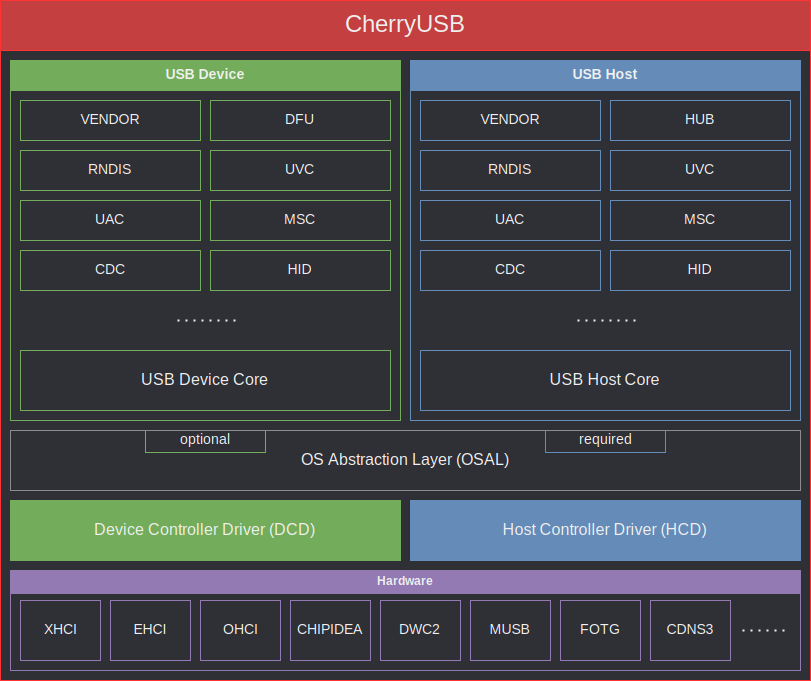

# CherryUSB

[中文版](./README_zh.md)

CherryUSB is a tiny, beautiful and portable USB host and device stack for embedded system with USB IP.



## Why choose

### Easy to study USB

In order to make it easier for users to learn USB basics, enumeration, driver loading and IP drivers, the code has been written with the following advantages:

- Lean code, simple logic, no complex C syntax
- Tree-based programming with cascading code
- Class-drivers and porting-drivers are templating and simplification
- Clear API classification (slave: initialisation, registration api, command callback api, data sending and receiving api; host: initialisation, lookup api, data sending and receiving api)

### Easy to use  USB

In order to facilitate the use of the USB interface and to take into account the fact that users have learned about uart and dma, the following advantages have been designed for the data sending and receiving class of interface:

- Equivalent to using uart tx dma/uart rx dma
- There is no limit to the length of send and receive, the user does not need to care about the USB packetization process (the porting driver does the packetization process)

### Easy to bring out USB performance

Taking into account USB performance issues and trying to achieve the theoretical bandwidth of the USB hardware, the design of the data transceiver class interface has the following advantages:

- Porting drivers directly to registers, no abstraction layer encapsulation
- Memory zero copy
- If IP has DMA then uses DMA mode (DMA with hardware packetization)
- Unlimited length make it easier to interface with hardware DMA and take advantage of DMA
- Subcontracting function is handled in interrupt

## Directoy Structure

```
.
├── class
├── common
├── core
├── demo
├── docs
├── osal
├── packet capture
└── port
└── tools

```

|   Directory       |  Description            |
|:-------------:|:---------------------------:|
|class          |  usb class driver           |
|common         |  usb spec macros and utils  |
|core           |  usb core implementation    |
|demo           |  different chips demo       |
|osal           |  os wrapper                 |
|docs           |  doc for guiding            |
|port           |  usb dcd and hcd porting    |
|tools          |  tool url                   |

## Device Stack Overview

CherryUSB Device Stack provides a unified framework of functions for standard device requests, CLASS requests, VENDOR requests and custom special requests. The object-oriented and chained approach allows the user to quickly get started with composite devices without having to worry about the underlying logic. At the same time, a standard dcd porting interface has been standardised for adapting different USB IPs to achieve ip-oriented programming.

CherryUSB Device Stack has the following functions：

- Support USB2.0 full and high speed, USB3.0 super speed
- Support endpoint irq callback register by users, let users do whatever they wants in endpoint irq callback.
- Support Composite Device
- Support Communication Device Class (CDC_ACM, CDC_ECM)
- Support Human Interface Device (HID)
- Support Mass Storage Class (MSC)
- Support USB VIDEO CLASS (UVC1.0、UVC1.5)
- Support USB AUDIO CLASS (UAC1.0、UAC2.0)
- Support Device Firmware Upgrade CLASS (DFU)
- Support USB MIDI CLASS (MIDI)
- Support Remote NDIS (RNDIS)
- Support WINUSB1.0、WINUSB2.0(with BOS)
- Support Vendor class
- Support multi device with the same USB IP

CherryUSB Device Stack resource usage (GCC 10.2 with -O2):

|   file        |  FLASH (Byte)  |  No Cache RAM (Byte)      |  RAM (Byte)   |  Heap (Byte)     |
|:-------------:|:--------------:|:-------------------------:|:-------------:|:----------------:|
|usbd_core.c    |  3516          | 256(default) + 320        | 0             | 0                |
|usbd_cdc.c     |  392           | 0                         | 0             | 0                |
|usbd_msc.c     |  2839          | 128 + 512(default)        | 16            | 0                |
|usbd_hid.c     |  364           | 0                         | 0             | 0                |
|usbd_audio.c   |  1455          | 0                         | 0             | 0                |
|usbd_video.c   |  2494          | 0                         | 84            | 0                |
|usbd_rndis.c   |  2109          | 3340                      | 76            | 0                |

## Host Stack Overview

The CherryUSB Host Stack has a standard enumeration implementation for devices mounted on roothubs and external hubs, and a standard interface for different Classes to indicate what the Class driver needs to do after enumeration and after disconnection. A standard hcd porting interface has also been standardised for adapting different USB IPs for IP-oriented programming. Finally, the host stack is managed using os, and provides osal to make a adaptation for different os.

CherryUSB Host Stack has the following functions：

- Automatic loading of supported Class drivers
- Support blocking transfers and asynchronous transfers
- Support Composite Device
- Multi-level HUB support, expandable up to 7 levels(Testing hub with 10 ports works well,only support dwc2 and ehci now)
- Support Communication Device Class (CDC_ACM, CDC_ECM)
- Support Human Interface Device (HID)
- Support Mass Storage Class (MSC)
- Support USB Video CLASS (commercial charge)
- Support USB Audio CLASS (commercial charge)
- Support Remote NDIS (RNDIS)
- Support USB Bluetooth class (support nimble and zephyr bluetooth stack, support **CLASS:0xE0** or vendor class like cdc acm)
- Support Vendor class
- Support USB modeswitch
- Support multi host with the same USB IP

The CherryUSB Host stack also provides the lsusb function, which allows you to view information about all mounted devices, including those on external hubs, with the help of a shell plugin.

CherryUSB Host Stack resource usage (GCC 10.2 with -O2):

|   file        |  FLASH (Byte)  |  No Cache RAM (Byte)            |  RAM (Byte)                 |  Heap (Byte) |
|:-------------:|:--------------:|:-------------------------------:|:---------------------------:|:------------:|
|usbh_core.c    |  ~7700          | 512 + 8 * (1+x) *n              | 28                          | 0            |
|usbh_hub.c     |  ~5600          | 32 + 4* (1+x) | 12 + sizeof(struct usbh_hub) * (1+x)          | 0            |
|usbh_cdc_acm.c |  ~1200          | 7             | 4  + sizeof(struct usbh_cdc_acm) * x          | 0            |
|usbh_msc.c     |  ~2500          | 32            | 4  + sizeof(struct usbh_msc) * x              | 0            |
|usbh_hid.c     |  ~1000          | 128           | 4  + sizeof(struct usbh_hid) * x              | 0            |
|usbh_video.c   |  ~3700          | 128           | 4  + sizeof(struct usbh_video) * x            | 0            |
|usbh_audio.c   |  ~3100          | 128           | 4  + sizeof(struct usbh_audio) * x            | 0            |
|usbh_rndis.c   |  ~3900          | 4096 + 2 * 2048         | sizeof(struct usbh_rndis) * 1       | 0            |
|usbh_cdc_ecm.c |  ~2500          | 2 * 1514              | sizeof(struct usbh_cdc_ecm) * 1       | 0            |
|usbh_bluetooth.c |  ~2300        | 2 * 2048(default)   | sizeof(struct usbh_bluetooth) * 1       | 0            |

Among them, `sizeof(struct usbh_hub)` and `sizeof(struct usbh_hubport)` are affected by the following macros：

```
#define CONFIG_USBHOST_MAX_EXTHUBS          1
#define CONFIG_USBHOST_MAX_EHPORTS          4
#define CONFIG_USBHOST_MAX_INTERFACES       8
#define CONFIG_USBHOST_MAX_INTF_ALTSETTINGS 8
#define CONFIG_USBHOST_MAX_ENDPOINTS        4
```

x is affected by the following macros：

```
#define CONFIG_USBHOST_MAX_CDC_ACM_CLASS 4
#define CONFIG_USBHOST_MAX_HID_CLASS     4
#define CONFIG_USBHOST_MAX_MSC_CLASS     2
#define CONFIG_USBHOST_MAX_AUDIO_CLASS   1
#define CONFIG_USBHOST_MAX_VIDEO_CLASS   1
```

## USB IP Support

Only standard and commercial USB IP are listed.

|   IP             |  device    | host     | Support status |
|:----------------:|:----------:|:--------:|:--------------:|
|  OHCI(intel)     |  none      | OHCI     |  ×   |
|  EHCI(intel)     |  none      | EHCI     |  √   |
|  XHCI(intel)     |  none      | XHCI     |  √   |
|  UHCI(intel)     |  none      | UHCI     |  ×  |
|  DWC2(synopsys)  |  DWC2      | DWC2     |  √   |
|  MUSB(mentor)    |  MUSB      | MUSB     |  √   |
|  FOTG210(faraday)|  FOTG210   | EHCI     |  √   |
|  CDNS2(cadence)  |  CDNS2     | CDNS2    |  √   |
|  CDNS3(cadence)  |  CDNS3     | XHCI     |  ×   |
|  DWC3(synopsys)  |  DWC3      | XHCI     |  ×   |

## Documentation Tutorial

Quickly start, USB basic concepts, API manual, Class basic concepts and examples, see [CherryUSB Documentation Tutorial](https://cherryusb.readthedocs.io/)

## Video Tutorial

USB basic concepts and how the CherryUSB Device stack is implemented, see [CherryUSB Device Stack Tutorial](https://www.bilibili.com/video/BV1Ef4y1t73d).

## Graphical Config Tool

[chryusb_configurator](https://github.com/Egahp/chryusb_configurator) is written in **electron + vite2 + ts** framework，currently used to automate the generation of descriptor arrays, with additional functionality to be added later.

## Demo Repo

|   Manufacturer       |  CHIP or Series    | USB IP| Repo Url | Support version     | Support status |
|:--------------------:|:------------------:|:-----:|:--------:|:------------------:|:-------------:|
|Bouffalolab    |  BL702/BL616/BL808 | bouffalolab/ehci|[bouffalo_sdk](https://github.com/CherryUSB/bouffalo_sdk)|<= latest | Long-term |
|ST    |  STM32F1x | fsdev |[stm32_repo](https://github.com/CherryUSB/cherryusb_stm32)|<= latest | Long-term |
|ST    |  STM32F4/STM32H7 | dwc2 |[stm32_repo](https://github.com/CherryUSB/cherryusb_stm32)|<= latest | Long-term |
|HPMicro    |  HPM6750 | hpm/ehci |[hpm_sdk](https://github.com/CherryUSB/hpm_sdk)|<= latest | Long-term |
|Essemi    |  ES32F36xx | musb |[es32f369_repo](https://github.com/CherryUSB/cherryusb_es32)|<= latest | Long-term |
|Phytium |  e2000 | pusb2/xhci |[phytium_repo](https://gitee.com/phytium_embedded/phytium-free-rtos-sdk)|v0.10.2  | Long-term |
|artinchip |  d12x/d13x/d21x | dwc2/ehci/ohci |[luban-lite](https://gitee.com/artinchip/luban-lite)|<= latest  | Long-term |
|Espressif    |  esp32s2/esp32s3 | dwc2 |[esp32_repo](https://github.com/CherryUSB/cherryusb_esp32)|<= latest | the same with ST |
|AllwinnerTech    |  F1C100S/F1C200S | musb |[cherryusb_rtt_f1c100s](https://github.com/CherryUSB/cherryusb_rtt_f1c100s)|<= latest | the same with Essemi |
|WCH    |  CH32V307/ch58x | ch32_usbfs/ch32_usbhs/ch58x |[wch_repo](https://github.com/CherryUSB/cherryusb_wch)|<= v0.10.2 | TBD |
|Nordicsemi |  Nrf52840 | nrf5x |[nrf5x_repo](https://github.com/CherryUSB/cherryusb_nrf5x)|<= v0.10.2 | No more updated |
|Raspberry pi |  rp2040 | rp2040 |[pico-examples](https://github.com/CherryUSB/pico-examples)|<= v0.10.2 | No more updated |

## Contact

CherryUSB discord: https://discord.com/invite/wFfvrSAey8.