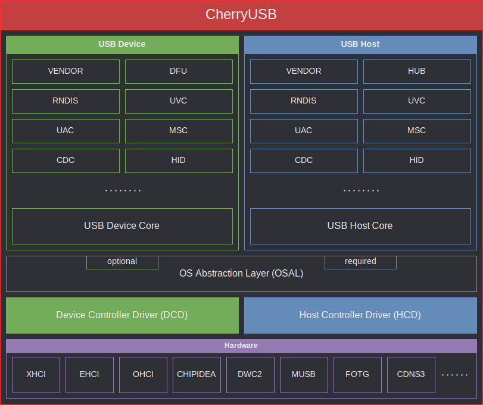

# CherryUSB

[English](./README.md)

CherryUSB 是一个小而美的、可移植性高的、用于嵌入式系统(带 USB IP)的 USB 主从协议栈。



## 为什么选择

### 易于学习 USB

为了方便用户学习 USB 基本知识、枚举、驱动加载、IP 驱动，因此，编写的代码具备以下优点：

- 代码精简，逻辑简单，无复杂 C 语言语法
- 树状化编程，代码层层递进
- Class 驱动和 porting 驱动模板化、精简化
- API 分类清晰（从机：初始化、注册类、命令回调类、数据收发类；主机：初始化、查找类、数据收发类）

### 易于使用 USB

为了方便用户使用 USB 接口，考虑到用户学习过 uart 和 dma，因此，设计的数据收发类接口具备以下优点：

- 等价于使用 uart tx dma/uart rx dma
- 收发长度没有限制，用户不需要关心 USB 分包过程（porting 驱动做分包过程）

### 易于发挥 USB 性能

考虑到 USB 性能问题，尽量达到 USB 硬件理论带宽，因此，设计的数据收发类接口具备以下优点：

- Porting 驱动直接对接寄存器，无抽象层封装
- Memory zero copy
- IP 如果带 DMA 则使用 DMA 模式（DMA 带硬件分包功能）
- 长度无限制，方便对接硬件 DMA 并且发挥 DMA 的优势
- 分包功能在中断中处理

## 目录结构

```
.
├── class
├── common
├── core
├── demo
├── docs
├── osal
└── port
└── tools
```

|   目录名       |  描述                          |
|:-------------:|:-------------------------------:|
|class          |  usb class 类主从驱动           |
|common         |  usb spec 定义、常用宏、标准接口定义 |
|core           |  usb 主从协议栈核心实现          |
|demo           |  示例                            |
|docs           |  文档                            |
|osal           |  os 封装层                       |
|port           |  usb 主从需要实现的 porting 接口 |
|tools          |  工具链接                        |

## Device 协议栈简介

CherryUSB Device 协议栈对标准设备请求、CLASS 请求、VENDOR 请求以及 custom 特殊请求规范了一套统一的函数框架，采用面向对象和链表的方式，能够使得用户快速上手复合设备，不用管底层的逻辑。同时，规范了一套标准的 dcd porting 接口，用于适配不同的 USB IP，达到面向 ip 编程。

CherryUSB Device 协议栈当前实现以下功能：

- 支持 USB2.0 全速和高速设备，USB3.0 超速设备
- 支持端点中断注册功能，porting 给用户自己处理中断里的数据
- 支持复合设备
- 支持 Communication Device Class (CDC_ACM, CDC_ECM)
- 支持 Human Interface Device (HID)
- 支持 Mass Storage Class (MSC)
- 支持 USB VIDEO CLASS (UVC1.0、UVC1.5)
- 支持 USB AUDIO CLASS (UAC1.0、UAC2.0)
- 支持 Device Firmware Upgrade CLASS (DFU)
- 支持 USB MIDI CLASS (MIDI)
- 支持 Remote NDIS (RNDIS)
- 支持 WINUSB1.0、WINUSB2.0(带 BOS )
- 支持 Vendor 类 class
- 支持相同 USB IP 的多从机

CherryUSB Device 协议栈资源占用说明（GCC 10.2 with -O2）：

|   file        |  FLASH (Byte)  |  No Cache RAM (Byte)      |  RAM (Byte)   |  Heap (Byte)     |
|:-------------:|:--------------:|:-------------------------:|:-------------:|:----------------:|
|usbd_core.c    |  3516          | 256(default) + 320        | 0             | 0                |
|usbd_cdc.c     |  392           | 0                         | 0             | 0                |
|usbd_msc.c     |  2839          | 128 + 512(default)        | 16            | 0                |
|usbd_hid.c     |  364           | 0                         | 0             | 0                |
|usbd_audio.c   |  1455          | 0                         | 0             | 0                |
|usbd_video.c   |  2494          | 0                         | 84            | 0                |
|usbd_rndis.c   |  2109          | 3340                      | 76            | 0                |

## Host 协议栈简介

CherryUSB Host 协议栈对挂载在 roothub、外部 hub 上的设备规范了一套标准的枚举实现，对不同的 Class 类也规范了一套标准接口，用来指示在枚举后和断开连接后该 Class 驱动需要做的事情。同时，规范了一套标准的 hcd porting 接口，用于适配不同的 USB IP，达到面向 IP 编程。最后，协议栈使用 OS 管理，并提供了 osal 用来适配不同的 os。

CherryUSB Host 协议栈当前实现以下功能：

- 自动加载支持的Class 驱动
- 支持阻塞式传输和异步传输
- 支持复合设备
- 支持多级 HUB,最高可拓展到 7 级(目前测试 1拖 10 没有问题，当前仅支持 dwc2 和 ehci)
- 支持 Communication Device Class (CDC_ACM, CDC_ECM)
- 支持 Human Interface Device (HID)
- 支持 Mass Storage Class (MSC)
- Support USB Video CLASS（商业收费）
- Support USB Audio CLASS（商业收费）
- 支持 Remote NDIS (RNDIS)
- 支持 USB Bluetooth (支持 nimble and zephyr bluetooth 协议栈，支持 **CLASS: 0xE0** 或者厂家自定义类，类似于 cdc acm 功能)
- 支持 Vendor 类 class
- 支持 USB modeswitch
- 支持相同 USB IP 的多主机

同时，CherryUSB Host 协议栈还提供了 lsusb 的功能，借助 shell 插件可以查看所有挂载设备的信息，包括外部 hub 上的设备的信息。

CherryUSB Host 协议栈资源占用说明（GCC 10.2 with -O2）：

|   file        |  FLASH (Byte)  |  No Cache RAM (Byte)            |  RAM (Byte)                 |  Heap (Byte) |
|:-------------:|:--------------:|:-------------------------------:|:---------------------------:|:------------:|
|usbh_core.c    |  ~7700          | 512 + 8 * (1+x) *n              | 28                          | 0            |
|usbh_hub.c     |  ~5600          | 32 + 4* (1+x) | 12 + sizeof(struct usbh_hub) * (1+x)          | 0            |
|usbh_cdc_acm.c |  ~1200          | 7             | 4  + sizeof(struct usbh_cdc_acm) * x          | 0            |
|usbh_msc.c     |  ~2500          | 32            | 4  + sizeof(struct usbh_msc) * x              | 0            |
|usbh_hid.c     |  ~1000          | 128           | 4  + sizeof(struct usbh_hid) * x              | 0            |
|usbh_video.c   |  ~3700          | 128           | 4  + sizeof(struct usbh_video) * x            | 0            |
|usbh_audio.c   |  ~3100          | 128           | 4  + sizeof(struct usbh_audio) * x            | 0            |
|usbh_rndis.c   |  ~3900          | 4096 + 2 * 2048         | sizeof(struct usbh_rndis) * 1       | 0            |
|usbh_cdc_ecm.c |  ~2500          | 2 * 1514              | sizeof(struct usbh_cdc_ecm) * 1       | 0            |
|usbh_bluetooth.c |  ~2300        | 2 * 2048(default)   | sizeof(struct usbh_bluetooth) * 1       | 0            |

其中，`sizeof(struct usbh_hub)` 和 `sizeof(struct usbh_hubport)` 受以下宏影响：

```
#define CONFIG_USBHOST_MAX_EXTHUBS          1
#define CONFIG_USBHOST_MAX_EHPORTS          4
#define CONFIG_USBHOST_MAX_INTERFACES       8
#define CONFIG_USBHOST_MAX_INTF_ALTSETTINGS 8
#define CONFIG_USBHOST_MAX_ENDPOINTS        4
```

x 受以下宏影响：

```
#define CONFIG_USBHOST_MAX_CDC_ACM_CLASS 4
#define CONFIG_USBHOST_MAX_HID_CLASS     4
#define CONFIG_USBHOST_MAX_MSC_CLASS     2
#define CONFIG_USBHOST_MAX_AUDIO_CLASS   1
#define CONFIG_USBHOST_MAX_VIDEO_CLASS   1
```

## USB IP 支持情况

仅列举标准 USB IP 和商业性 USB IP

|   IP             |  device    | host     | Support status |
|:----------------:|:----------:|:--------:|:--------------:|
|  OHCI(intel)     |  none      | OHCI     |  ×   |
|  EHCI(intel)     |  none      | EHCI     |  √   |
|  XHCI(intel)     |  none      | XHCI     |  √   |
|  UHCI(intel)     |  none      | UHCI     |  ×  |
|  DWC2(synopsys)  |  DWC2      | DWC2     |  √   |
|  MUSB(mentor)    |  MUSB      | MUSB     |  √   |
|  FOTG210(faraday)|  FOTG210   | EHCI     |  √   |
|  CDNS2(cadence)  |  CDNS2     | CDNS2    |  √   |
|  CDNS3(cadence)  |  CDNS3     | XHCI     |  ×   |
|  DWC3(synopsys)  |  DWC3      | XHCI     |  ×   |

## 文档教程

CherryUSB 快速入门、USB 基本概念，API 手册，Class 基本概念和例程，参考 [CherryUSB Documentation Tutorial](https://cherryusb.readthedocs.io/)

## 视频教程

- USB 基本知识点与 CherryUSB Device 协议栈是如何编写的（使用v0.4.1 版本），参考 https://www.bilibili.com/video/BV1Ef4y1t73d.
- CherryUSB 腾讯会议（使用v1.1.0 版本），参考 https://www.bilibili.com/video/BV16x421y7mM.

## 图形化界面配置工具

[chryusb_configurator](https://github.com/Egahp/chryusb_configurator) 采用 **electron + vite2 + ts** 框架编写，当前用于自动化生成描述符数组，后续会增加其他功能。

## 示例仓库

|   Manufacturer       |  CHIP or Series    | USB IP| Repo Url | Support version     | Support status |
|:--------------------:|:------------------:|:-----:|:--------:|:------------------:|:-------------:|
|Bouffalolab    |  BL702/BL616/BL808 | bouffalolab/ehci|[bouffalo_sdk](https://github.com/CherryUSB/bouffalo_sdk)|<= latest | Long-term |
|ST    |  STM32F1x | fsdev |[stm32_repo](https://github.com/CherryUSB/cherryusb_stm32)|<= latest | Long-term |
|ST    |  STM32F4/STM32H7 | dwc2 |[stm32_repo](https://github.com/CherryUSB/cherryusb_stm32)|<= latest | Long-term |
|HPMicro    |  HPM6750 | hpm/ehci |[hpm_sdk](https://github.com/CherryUSB/hpm_sdk)|<= latest | Long-term |
|Essemi    |  ES32F36xx | musb |[es32f369_repo](https://github.com/CherryUSB/cherryusb_es32)|<= latest | Long-term |
|Phytium |  e2000 | pusb2/xhci |[phytium_repo](https://gitee.com/phytium_embedded/phytium-free-rtos-sdk)|v0.10.2  | Long-term |
|artinchip |  d12x/d13x/d21x | dwc2/ehci/ohci |[luban-lite](https://gitee.com/artinchip/luban-lite)|<= latest  | Long-term |
|Espressif    |  esp32s2/esp32s3 | dwc2 |[esp32_repo](https://github.com/CherryUSB/cherryusb_esp32)|<= latest | the same with ST |
|AllwinnerTech    |  F1C100S/F1C200S | musb |[cherryusb_rtt_f1c100s](https://github.com/CherryUSB/cherryusb_rtt_f1c100s)|<= latest | the same with Essemi |
|WCH    |  CH32V307/ch58x | ch32_usbfs/ch32_usbhs/ch58x |[wch_repo](https://github.com/CherryUSB/cherryusb_wch)|<= v0.10.2 | TBD |
|Nordicsemi |  Nrf52840 | nrf5x |[nrf5x_repo](https://github.com/CherryUSB/cherryusb_nrf5x)|<= v0.10.2 | No more updated |
|Raspberry pi |  rp2040 | rp2040 |[pico-examples](https://github.com/CherryUSB/pico-examples)|<= v0.10.2 | No more updated |

## Contact

CherryUSB QQ 群:642693751
CherryUSB 微信群：与我联系后邀请加入