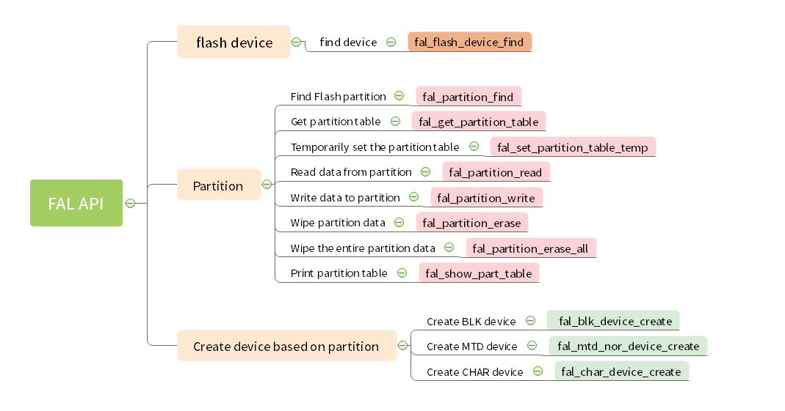

# FAL：Flash Abstraction Layer

[Chinese](./README_ZH.md) | English

## 1. Introduction to FAL

The Flash abstraction layer is an abstraction layer for the management and operation of Flash and Flash-based partitions. The upper layer unifies the Flash and partition operation API (the framework diagram is shown below), and has the following characteristics:

- Supports static and configurable partition table and can associate multiple Flash devices;
- The partition table supports **automatic loading**. Avoid the problem that the partition table is defined multiple times in multiple firmware projects;
- The code is streamlined, **no dependency** on the operating system, and can run on bare metal platforms, such as Bootloader that has certain requirements for resources;
- Unified operation interface. Ensure the file system, OTA, NVM (for example: [EasyFlash](https://github.com/armink-rtt-pkgs/EasyFlash)) and other components that have certain dependencies on Flash, and the reusability of the underlying Flash driver;
- Comes with Finsh/MSH-based test commands, which can be operated in byte addressing mode (read, write, and erase) Flash or partition through Shell, which is convenient for developers to debug and test;


### 1.1,Open FAL

To use fal package, you need to select it in the RT-Thread package manager. The specific path is as follows:

```
RT-Thread online packages
    system packages --->
        --- fal: Flash Abstraction Layer implement. Manage flash device and partition.
        [*] Enable debug log output
        [*] FAL partition table config has defined on'fal_cfg.h'
        (onchip) The flash device which saving partition table
        (65536) The patition table end address relative to flash device offset.
        [ ] FAL uses SFUD drivers
        (norflash0) The name of the device used by FAL (NEW)
                version (latest) --->
```

The configuration instructions for each function are as follows:

- Enable debug log output (enabled by default);
- Whether the partition table is defined in `fal_cfg.h` (enabled by default). If you turn off this option, fal will automatically go to the specified location of the designated Flash to retrieve and load the partition table. For the specific configuration, see the following two options;

    - Flash device storing the partition table;
    - The **end address** of the partition table is located at the offset on the Flash device. fal will retrieve the partition table from this address and read it directly to the top of the Flash. If you are not sure about the specific location of the partition table, you can also configure it as the end address of the Flash, fal will retrieve the entire Flash, and the retrieval time may increase.
- Enable FAL migration files for SFUD (closed by default);
    - The name of the FLASH device passed in when calling the `rt_sfud_flash_probe` function should be entered (you can also check the name of the Block Device through the list_device command). This name corresponds to the Flash name in the partition table. Only when the device name is set correctly can the read and write operations on FLASH be completed.

Then let the RT-Thread package manager automatically update, or use the `pkgs --update` command to update the package to the BSP.

### 1.2, FAL directory

| Name | Description |
| ------- | ---------- |
| inc | Header file directory |
| src | Source Code Directory |
| samples | Sample catalog |

### 1.3, FAL API

The FAL-related API is shown in the figure, [click here to view the detailed API parameters](docs/fal_api_en.md).



### 1.4, License

The fal package complies with the Apache-2.0 license, see the `LICENSE` file for details.

### 1.5, Dependency

It has no dependence on RT-Thread and can also be used on bare metal.

> Test command function needs to rely on RT-Thread FinSH/MSH

## 2. Use FAL

The basic steps for using FAL are as follows:

1. Open FAL: Open the fal software package from Env and download it to the project.
2. FAL migration: define flash device, define flash device table, define flash partition table. Step 2 is mainly explained below.
3. Call fal_init() to initialize the library: After the migration is completed, it can be called in the application layer, such as in the main function.


### 2.1, Define flash device

Before defining the Flash device table, you need to define the Flash device first. It can be on-chip flash or off-chip spi flash based on SFUD:

- Refer to [`fal_flash_stm32f2_port.c`](https://github.com/RT-Thread-packages/fal/blob/master/samples/porting/fal_flash_stm32f2_port.c) to define the on-chip flash device.
- Refer to [`fal_flash_sfud_port.c`](https://github.com/RT-Thread-packages/fal/blob/master/samples/porting/fal_flash_sfud_port.c) to define off-chip spi flash device.

To define specific Flash device objects, users need to implement the operation functions of `init`, `read`, `write`, and `erase` according to their own Flash conditions:

- `static int init(void)`: **Optional** initialization operation.
- `static int read(long offset, rt_uint8_t *buf, rt_size_t size)`: read operation.

| Parameters | Description |
| ------ | ------------------------- |
| offset | Flash offset address for reading data |
| buf | Buffer to store the data to be read |
| size | The size of the data to be read |
| return | Return the actual read data size |

- `static int write(long offset, const rt_uint8_t *buf, rt_size_t size)`: write operation.

| Parameters | Description |
| ------ | ------------------------- |
| offset | Flash offset address for writing data |
| buf | Buffer to store data to be written |
| size | The size of the data to be written |
| return | Return the actual written data size |

- `static int erase(long offset, rt_size_t size)`: erase operation.

| Parameters | Description |
| ------ | ------------------------- |
| offset | Flash offset address of erase area |
| size | The size of the erased area |
| return | Return the actual erased area size |

Users need to implement these operation functions according to their own Flash conditions. A specific Flash device object is defined at the bottom of the file. The following example defines stm32f2 on-chip flash: stm32f2_onchip_flash

```c
const struct fal_flash_dev stm32f2_onchip_flash =
{
    .name = "stm32_onchip",
    .addr = 0x08000000,
    .len = 1024*1024,
    .blk_size = 128*1024,
    .ops = {init, read, write, erase},
    .write_gran = 8
};
```

- `"stm32_onchip"`: the name of the flash device.
- `0x08000000`: Start address for flash operation.
- `1024*1024`: Total size of Flash (1MB).
- `128*1024`: Flash block/sector size (because the STM32F2 blocks have uneven sizes, the erase granularity is the largest block size: 128K).
- `{init, read, write, erase}`: Flash operation functions. If there is no init initialization process, the first operation function position can be left blank.
- `8`: Set the write granularity, the unit is bit, 0 means not effective (the default value is 0), this member is a new member whose fal version is greater than 0.4.0. Each flash write granularity is not the same, it can be set through this member, the following are several common Flash write granularities:
    - nor flash: 1 bit
    - stm32f2/f4: 8 bit
    - stm32f1: 32 bit
    - stm32l4: 64 bit

### 2.2, Define the flash device table

The Flash device table is defined in the header file `fal_cfg.h`, you need to **create a new `fal_cfg.h` file** before defining the partition table. Please place this file in the port folder of the corresponding BSP or project directory, and Add the header file path to the project. fal_cfg.h can refer to [Sample file fal/samples/porting/fal_cfg.h](https://github.com/RT-Thread-packages/fal/blob/master/samples/porting/fal_cfg.h) to complete.

Flash device table example:


```c
/* ===================== Flash device Configuration ========================= */
extern const struct fal_flash_dev stm32f2_onchip_flash;
extern struct fal_flash_dev nor_flash0;

/* flash device table */
#define FAL_FLASH_DEV_TABLE                                          \
{                                                                    \
    &stm32f2_onchip_flash,                                           \
    &nor_flash0,                                                     \
}
```

In the Flash device table, there are two Flash objects, one is the STM32F2 on-chip Flash, and the other is the off-chip Nor Flash.

### 2.3, Define flash partition table

The partition table is also defined in the `fal_cfg.h` header file. Flash partitions are based on Flash devices. Each Flash device can have N partitions. The collection of these partitions is the partition table. Before configuring the partition table, make sure that the **Flash device** and **device table** have been defined. fal_cfg.h can refer to [Sample file fal/samples/porting/fal_cfg.h](https://github.com/RT-Thread-packages/fal/blob/master/samples/porting/fal_cfg.h) to complete.

Example of partition table:

```c
#define NOR_FLASH_DEV_NAME             "norflash0"
/* ====================== Partition Configuration ========================== */
#ifdef FAL_PART_HAS_TABLE_CFG
/* partition table */
#define FAL_PART_TABLE                                                               \
{                                                                                    \
    {FAL_PART_MAGIC_WORD,        "bl",     "stm32_onchip",         0,   64*1024, 0}, \
    {FAL_PART_MAGIC_WORD,       "app",     "stm32_onchip",   64*1024,  704*1024, 0}, \
    {FAL_PART_MAGIC_WORD, "easyflash", NOR_FLASH_DEV_NAME,         0, 1024*1024, 0}, \
    {FAL_PART_MAGIC_WORD,  "download", NOR_FLASH_DEV_NAME, 1024*1024, 1024*1024, 0}, \
}
#endif /* FAL_PART_HAS_TABLE_CFG */
```

The detailed description of the above partition table is as follows:

| Partition name | Flash device name | Offset address | Size | Description |
| ----------- | -------------- | --------- | ----- | ------------------ |
| "bl" | "stm32_onchip" | 0 | 64KB | Bootloader |
| "app" | "stm32_onchip" | 64*1024 | 704KB | Application |
| "easyflash" | "norflash0" | 0 | 1MB | EasyFlash parameter storage |
| "download" | "norflash0" | 1024*1024 | 1MB | OTA download area |

The partition parameters that users need to modify include: partition name, associated Flash device name, offset address (relative to the internal Flash device), and size. Pay attention to the following points:

- Partition name guarantee **cannot be repeated**;
- The associated Flash device **must have been defined in the Flash device table**, and the **name is the same**, otherwise there will be an error that the Flash device cannot be found;
- The starting address and size of the partition **cannot exceed the address range of the Flash device**, otherwise it will cause packet initialization errors;

> Note: When defining each partition, in addition to filling in the parameter attributes described above, you need to add the attribute `FAL_PART_MAGIC_WORD` at the front and add `0` at the end (currently used for reserved functions)

## 3. FinSH/MSH test command

FAL provides a wealth of test commands, and the project only needs to enable the Finsh/MSH function on RT-Thread. These commands will be very useful when doing some Flash-based application development and debugging. It can accurately write or read the original Flash data at the specified location, quickly verify the integrity of the Flash driver, and even perform performance tests on the Flash.

The specific functions are as follows: enter `fal` to see the complete command list

```
msh />fal
Usage:
fal probe [dev_name|part_name]   - probe flash device or partition by given name
fal read addr size               - read 'size' bytes starting at 'addr'
fal write addr data1 ... dataN   - write some bytes 'data' starting at 'addr'
fal erase addr size              - erase 'size' bytes starting at 'addr'
fal bench <blk_size>             - benchmark test with per block size

msh />
```

### 3.1, Specify the Flash device or Flash partition to be operated

When using the fal command for the first time, directly inputting `fal probe` will display the partition table information. You can specify the object to be operated as a partition in the partition table or a flash device.

After the partition or Flash is successfully selected, some of its attributes will be displayed. The general effect is as follows:

```
msh />fal probe    
No flash device or partition was probed.
Usage: fal probe [dev_name|part_name]   - probe flash device or partition by given name.
[I/FAL] ==================== FAL partition table ====================
[I/FAL] | name      | flash_dev    |   offset   |    length  |
[I/FAL] -------------------------------------------------------------
[I/FAL] | bl        | stm32_onchip | 0x00000000 | 0x00010000 |
[I/FAL] | app       | stm32_onchip | 0x00010000 | 0x000b0000 |
[I/FAL] | ef        | norflash0    | 0x00000000 | 0x00100000 |
[I/FAL] | download  | norflash0    | 0x00100000 | 0x00100000 |
[I/FAL] =============================================================
msh />
msh />fal probe download
Probed a flash partition | download | flash_dev: norflash0 | offset: 1048576 | len: 1048576 |.
msh />
```

### 3.2, Erase data

Enter `fal erase` first, followed by the starting address and length of the data to be erased. The following command is: erase 4096 bytes of data from address 0 (relative to Flash or partition)

> Note: According to the Flash characteristics, the erase action will be processed according to sector alignment. Therefore, if the erase operation address or length is not aligned with the flash sector, the entire sector data associated with it will be erased.

```
msh />fal erase 0 4096
Erase data success. Start from 0x00000000, size is 4096.
msh />
```

### 3.3, Write data

Enter `fal write` first, followed by N pieces of data to be written, separated by spaces. The following command is: Write 1, 2, 3, 4, 5, 5 bytes of data from address 8

```
msh />fal write 8 1 2 3 4 5
Write data success. Start from 0x00000008, size is 5.
Write data: 1 2 3 4 5.
msh />
```

### 3.4, Read data

Enter `fal read` first, followed by the starting address and length of the data to be read. The following command is: read 64 bytes of data from address 0

```
msh />fal read 0 64
Read data success. Start from 0x00000000, size is 64. The data is:
Offset (h) 00 01 02 03 04 05 06 07 08 09 0A 0B 0C 0D 0E 0F
[00000000] FF FF FF FF FF FF FF FF 01 02 03 04 05 FF FF FF
[00000010] FF FF FF FF FF FF FF FF FF FF FF FF FF FF FF FF
[00000020] FF FF FF FF FF FF FF FF FF FF FF FF FF FF FF FF
[00000030] FF FF FF FF FF FF FF FF FF FF FF FF FF FF FF FF

msh />
```

### 3.5, Performance test

The performance test will test the erasing, writing and reading speed of the Flash. At the same time, the accuracy of writing and reading data will be tested to ensure the consistency of the writing and reading data of the entire Flash or the entire partition.

Enter `fal bench` first, followed by the sector size of the Flash to be tested (please check the corresponding Flash manual, SPI Nor Flash is generally 4096). Since the performance test will lose the data of the entire Flash or the entire partition, the command must be followed by `yes` at the end.

```
msh />fal bench 4096 yes
Erasing 1048576 bytes data, waiting...
Erase benchmark success, total time: 2.674S.
Writing 1048576 bytes data, waiting...
Write benchmark success, total time: 7.107S.
Reading 1048576 bytes data, waiting...
Read benchmark success, total time: 2.716S.
msh />
```

## 4. Common applications

- [Example of fatfs file system based on FAL partition](https://github.com/RT-Thread/IoT_Board/tree/master/examples/15_component_fs_flash)
- [Application note of littlefs file system based on FAL partition](https://www.rt-thread.org/document/site/application-note/components/dfs/an0027-littlefs/)
- [EasyFlash porting instructions based on FAL partition](https://github.com/armink-rtt-pkgs/EasyFlash/tree/master/ports)

## 5. Common problems

**1. When using FAL, the header file `fal_cfg.h` cannot be found**

`fal_cfg.h` is the configuration file of the fal software package, which needs to be created manually by the user and defines the relevant partition table information. Please place the file in the port folder of the BSP or the port folder of the project directory (if not, create a new port folder), and add the path of the header file to the project, see "`2.2. Define the Flash Device Table `" section.
