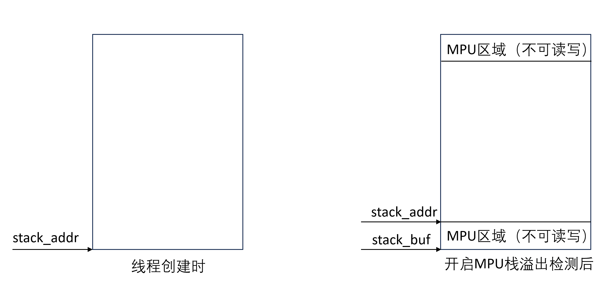

# RT-Thread MPU抽象层
Mprotect（Memory Protection）组件是为不同处理器架构的内存保护单元提供的一套通用框架，让用户能使用这套框架解决一些常见的内存问题。

# 内存保护单元
内存保护单元是一个可编程的设备，用来指定一块特定内存区域的访问权限，比如读，写，和从该区域执行代码的权限。内存保护单元可以增加系统的健壮性，预防一些黑客的攻击。ARMV7-M和ARMV8-M都提供了内存保护单元，简称MPU（Memory Protection Unit）。[论坛里的这篇文章](https://club.rt-thread.org/ask/article/610305c1379b9e5e.html)提供了ARM MPU更详细的介绍。RISC-V也提供了相似的功能，简称PMP（Physical Memory Protection），具体可参考[RISC-V架构手册](https://riscv.org/wp-content/uploads/2017/05/riscv-privileged-v1.10.pdf)。

# 硬件支持
目前支持ARMV7-M和ARMV8-M架构。本目录下存放框架的通用代码和两个简单的例程。硬件相关的代码存放在`libcpu`目录。

# 功能简介
RT-Thread操作系统的任务和内核使用同一个地址空间，全部运行在特权级。所有代码默认对任何内存都有读，写，和执行的权限。使用MPU框架可以给特定的内存区域设置更低的权限，如只读权限。MPU框架可以被用来实现以下的功能：

- 把关键数据或代码设置成只读，防止它们被破坏
- 任务隔离，设定特定地址只能由特定的任务访问
- 检测栈溢出
- 把数据区域设置为不可执行，防止栈溢出攻击

# 使用方法
## Menuconfig配置
通过`menuconfig`进入`RT-Thread Components->Memory Protection`配置相关选项

- `RT_USING_MEM_PROTECTION`：开启MPU抽象层
- `RT_USING_HW_STACK_GUARD`：使用MPU检测栈溢出。具体实现原理是在任务栈顶和栈底各设置一个MPU区域，权限设置为不可访问。如果发生栈溢出，代码访问了MPU保护的地址，会触发异常
- `NUM_MEM_REGIONS`：硬件支持的MPU区域数量
- `NUM_EXCLUSIVE_REGIONS`：使用`rt_mprotect_add_exclusive_region`函数配置的内存区域数量
- `NUM_CONFIGURABLE_REGIONS`：各任务可以通过`rt_mprotect_add_region`函数配置的内存区域数量

## 内存区域配置
MPU抽象层提供了以下的API来配置任务对内存区域的权限：

- `rt_err_t rt_mprotect_add_region(rt_thread_t thread, rt_mem_region_t *region)`：添加内存区域
- `rt_err_t rt_mprotect_delete_region(rt_thread_t thread, rt_mem_region_t *region)`：删除内存区域
- `rt_err_t rt_mprotect_update_region(rt_thread_t thread, rt_mem_region_t *region)`：更新内存区域配置

内存区域的特性由`rt_mem_region_t`结构体定义：
```
typedef struct {
    void *start;        /* 起始地址 */
    rt_size_t size;     /* 区域大小 */
    rt_mem_attr_t attr; /* 区域特性 */
} rt_mem_region_t;
```
其中`attr`可通过以下宏来定义，使用这样定义的代码在任何处理器架构下都是通用的：

- `RT_MEM_REGION_P_RW_U_RW`：可读写
- `RT_MEM_REGION_P_RO_U_RO`: 只读
- `RT_MEM_REGION_P_NA_U_NA`：不可访问
- `RT_MEM_REGION_P_RWX_U_RWX`：可读写，执行
- `RT_MEM_REGION_P_RX_U_RX`：只读，可执行

通常程序需要定义一块内存区域只能由一个特定的任务访问。允许访问该内存区域的任务可以调用以下函数实现这个功能：

- `rt_err_t rt_mprotect_add_exclusive_region(void *start, rt_size_t size)`：添加内存区域
- `rt_err_t rt_mprotect_delete_exclusive_region(void *start, rt_size_t size)`：删除内存区域

调用了`rt_mprotect_add_exclusive_region`的任务在退出前必须调用`rt_mprotect_delete_exclusive_region`删除内存区域。

## 初始化
使用MPU抽象层之前需要在`board.h`文件定义固定的MPU区域数量：
```
#define NUM_STATIC_REGIONS 2
```
在`board.c`文件定义固定的MPU区域特性：
```
rt_mem_region_t static_regions[NUM_STATIC_REGIONS] = {
  /* Flash region, read only */
  {
    .start = (void *)STM32_FLASH_START_ADRESS,
    .size = (rt_size_t)STM32_FLASH_SIZE,
    .attr = RT_MEM_REGION_P_RX_U_RX,
  },
  /* SRAM regin, no execute */
  {
    .start = (void *)STM32_SRAM_START_ADDRESS,
    .size = (rt_size_t)STM32_SRAM_SIZE,
    .attr = RT_MEM_REGION_P_RW_U_RW,
  },
};
```
任何代码进行内存访问，都要遵守这些区域的配置。可以用固定的MPU区域，把代码段配置为只读，可执行，把数据段配置成可读写，不可执行。

另外必须确保配置的MPU区域数量满足以下的关系：
- 如果开启了`RT_USING_HW_STACK_GUARD`：`NUM_STATIC_REGIONS` + `NUM_CONFIGURABLE_REGIONS` + `NUM_EXCLUSIVE_REGIONS` + 2 <= `NUM_MEM_REGIONS`
- 如果没有开启`RT_USING_HW_STACK_GUARD`：`NUM_STATIC_REGIONS` + `NUM_CONFIGURABLE_REGIONS` + `NUM_EXCLUSIVE_REGIONS` <= `NUM_MEM_REGIONS`

## 异常检测
程序可以注册钩子函数，用来检测内存异常：
```
rt_err_t rt_hw_mpu_exception_set_hook(rt_hw_mpu_exception_hook_t hook)
```
`hook`函数会在发生内存异常时被调用。函数声明如下：
```
typedef void (*rt_hw_mpu_exception_hook_t)(rt_mem_exception_info_t *)
```
`rt_mem_exception_info_t`结构体根据处理器机构定义，对于ARM架构，提供以下用来诊断内存异常的信息：
```
typedef struct {
	rt_thread_t thread;		/* 触发异常的线程 */
	void *addr;				/* 发生异常的地址 */
	rt_mem_region_t region;	/* 地址对应的内存区域 */
	rt_uint8_t mmfsr;		/* MemManage Status寄存器的值 */
} rt_mem_exception_info_t;
```

# 对RT-Thread内核的影响
## 线程内存区域的保存
Mprotect组件在`rt_thread_t`结构体添加了`mem_regions`成员变量，用于保存线程内存区域的配置。
```
struct rt_thread
{
  ......
#ifdef RT_USING_MEM_PROTECTION
    void *mem_regions;
#endif
  ......
}
```
`mem_regions`的内存采用动态分配，并在删除线程时释放。
在切换线程时调用`rt_hw_mpu_table_switch`，切换线程的内存区域配置。
```
#if defined (RT_USING_MEM_PROTECTION)
    PUSH    {r0-r3, r12, lr}
    LDR     r1, =rt_current_thread
    LDR     r0, [r1]
    BL      rt_hw_mpu_table_switch
    POP     {r0-r3, r12, lr}
#endif
```

## 栈溢出检测的实现原理
线程创建时内核会根据用户指定的参数为栈分配内存，之后调用`rt_hw_stack_guard_init`配置栈溢出检测。栈溢出检测的实现原理是在线程栈底和栈顶分配两块不可读写的内存区域，如果代码访问这块内存，就会触发异常。

这种方法会改变内核代码可以操作的栈的起始地址和大小。因此`rt_hw_stack_guard_init`会调整`rt_thread_t->stack_addr`，指向允许访问的栈内存的起始地址，调整`rt_thread_t->stack_size`反映允许操作的内存大小，并在`rt_thread_t`添加成员变量`stack_buf`，指向原本为栈分配的内存的起始地址。这样，内核代码可以对栈进行正常操作，无需改动。

应用程序需要注意，如果开启了栈溢出检测，线程实际可以使用的栈空间会比分配的内存更小。因此在创建线程时，需要考虑增加`stack_size`参数。

在删除线程时要使用`stack_buf`变量，正确释放为栈分配的内存。
```
static void rt_defunct_execute(void)
{
  ......
  if (object_is_systemobject == RT_FALSE)
    {
        /* release thread's stack */
#ifdef RT_USING_HW_STACK_GUARD
        RT_KERNEL_FREE(thread->stack_buf);
#else
        RT_KERNEL_FREE(thread->stack_addr);
#endif
        /* delete thread object */
        rt_object_delete((rt_object_t)thread);
    }
  ......
}
```