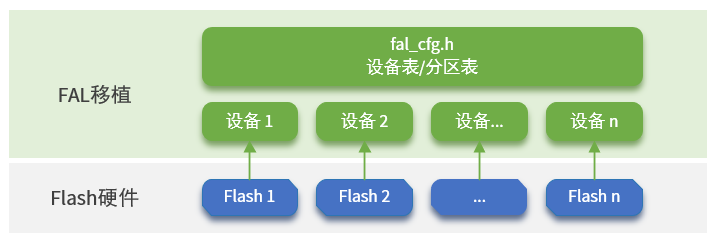

# FAL：Flash 抽象层

中文页 | [英文页](./README.md)

## 1、FAL介绍

FAL (Flash Abstraction Layer) Flash 抽象层，是对 Flash 及基于 Flash 的分区进行管理、操作的抽象层，对上层统一了 Flash 及 分区操作的 API (框架图如下所示)，并具有以下特性：

- 支持静态可配置的分区表，并可关联多个 Flash 设备；
- 分区表支持 **自动装载** 。避免在多固件项目，分区表被多次定义的问题；
- 代码精简，对操作系统 **无依赖** ，可运行于裸机平台，比如对资源有一定要求的 Bootloader；
- 统一的操作接口。保证了文件系统、OTA、NVM（例如：[EasyFlash](https://github.com/armink-rtt-pkgs/EasyFlash)） 等对 Flash 有一定依赖的组件，底层 Flash 驱动的可重用性；
- 自带基于 Finsh/MSH 的测试命令，可以通过 Shell 按字节寻址的方式操作（读写擦） Flash 或分区，方便开发者进行调试、测试；


### 1.1、打开 FAL

使用 fal package 需要在 RT-Thread 的包管理器中选择它，具体路径如下：

```
RT-Thread online packages
    system packages --->
        --- fal: Flash Abstraction Layer implement. Manage flash device and partition.
        [*]   Enable debug log output
        [*]   FAL partition table config has defined on 'fal_cfg.h'
        (onchip) The flash device which saving partition table
        (65536) The patition table end address relative to flash device offset.
        [ ]   FAL uses SFUD drivers
        (norflash0) The name of the device used by FAL (NEW)
                version (latest)  --->
```

每个功能的配置说明如下：

- 开启调试日志输出（默认开启）；
- 分区表是否在 `fal_cfg.h` 中定义（默认开启）。如果关闭此选项，fal 将会自动去指定 Flash 的指定位置去检索并装载分区表，具体配置详见下面两个选项；
  - 存放分区表的 Flash 设备；
  - 分区表的 **结束地址** 位于 Flash 设备上的偏移。fal 将从此地址开始往回进行检索分区表，直接读取到 Flash 顶部。如果不确定分区表具体位置，这里也可以配置为 Flash 的结束地址，fal 将会检索整个 Flash，检索时间可能会增加。
- 启用 FAL 针对 SFUD 的移植文件（默认关闭）；
  - 应输入调用 `rt_sfud_flash_probe` 函数时传入的 FLASH 设备名称（也可以通过 list_device 命令查看 Block Device 的名字获取）。该名称与分区表中的 Flash 名称对应，只有正确设置设备名字，才能完成对 FLASH 的读写操作。

然后让 RT-Thread 的包管理器自动更新，或者使用 `pkgs --update` 命令更新包到 BSP 中。

### 1.2、FAL 目录

| 名称    | 说明       |
| ------- | ---------- |
| inc     | 头文件目录 |
| src     | 源代码目录 |
| samples | 例程目录   |

### 1.3、FAL API

FAL 相关的 API 如图所示，[点击此处查看 API 参数详解](docs/fal_api.md)。


### 1.4、许可证

fal package 遵循 Apache-2.0 许可，详见 `LICENSE` 文件。

### 1.5、依赖

对 RT-Thread 无依赖，也可用于裸机。

> 测试命令功能需要依赖 RT-Thread FinSH/MSH

## 2、使用 FAL

使用 FAL 的基本步骤如下所示：

1. 打开 FAL：从 Env 中打开 fal 软件包并下载到工程。
2. FAL 移植：定义 flash 设备、定义 flash 设备表、定义 flash 分区表。以下主要对步骤 2 展开讲解。
3. 调用 fal_init() 初始化该库：移植完成后，可在应用层调用，如在 main 函数中调用。



### 2.1、定义 flash 设备

在定义 Flash 设备表前，需要先定义 Flash 设备。可以是片内 flash,  也可以是片外基于 SFUD 的 spi flash：

- 定义片内 flash 设备可以参考 [`fal_flash_stm32f2_port.c`](https://github.com/RT-Thread-packages/fal/blob/master/samples/porting/fal_flash_stm32f2_port.c) 。
- 定义片外 spi flash 设备可以参考 [`fal_flash_sfud_port.c`](https://github.com/RT-Thread-packages/fal/blob/master/samples/porting/fal_flash_sfud_port.c) 。

定义具体的 Flash 设备对象，用户需要根据自己的 Flash 情况分别实现 `init`、 `read`、 `write`、 `erase` 这些操作函数：

- `static int init(void)`：**可选** 的初始化操作。
- `static int read(long offset, rt_uint8_t *buf, rt_size_t size)`：读取操作。

| 参数   | 描述                      |
| ------ | ------------------------- |
| offset | 读取数据的 Flash 偏移地址 |
| buf    | 存放待读取数据的缓冲区    |
| size   | 待读取数据的大小          |
| return | 返回实际读取的数据大小    |

- `static int write(long offset, const rt_uint8_t *buf, rt_size_t size)` ：写入操作。

| 参数   | 描述                      |
| ------ | ------------------------- |
| offset | 写入数据的 Flash 偏移地址 |
| buf    | 存放待写入数据的缓冲区    |
| size   | 待写入数据的大小          |
| return | 返回实际写入的数据大小    |

- `static int erase(long offset, rt_size_t size)` ：擦除操作。

| 参数   | 描述                      |
| ------ | ------------------------- |
| offset | 擦除区域的 Flash 偏移地址 |
| size   | 擦除区域的大小            |
| return | 返回实际擦除的区域大小    |

用户需要根据自己的 Flash 情况分别实现这些操作函数。在文件最底部定义了具体的 Flash 设备对象 ，如下示例定义了 stm32f2 片上 flash：stm32f2_onchip_flash

```c
const struct fal_flash_dev stm32f2_onchip_flash =
{
    .name       = "stm32_onchip",
    .addr       = 0x08000000,
    .len        = 1024*1024,
    .blk_size   = 128*1024,
    .ops        = {init, read, write, erase},
    .write_gran = 8
};
```

- `"stm32_onchip"` : Flash 设备的名字。
- `0x08000000`: 对 Flash 操作的起始地址。
- `1024*1024`：Flash 的总大小（1MB）。
- `128*1024`：Flash 块/扇区大小（因为 STM32F2 各块大小不均匀，所以擦除粒度为最大块的大小：128K）。
- `{init, read, write, erase}` ：Flash 的操作函数。 如果没有 init 初始化过程，第一个操作函数位置可以置空。
- `8` : 设置写粒度，单位 bit， 0 表示未生效（默认值为 0 ），该成员是 fal 版本大于 0.4.0 的新增成员。各个 flash 写入粒度不尽相同，可通过该成员进行设置，以下列举几种常见 Flash 写粒度：
  - nor flash: 1 bit
  - stm32f2/f4:  8 bit
  - stm32f1:  32 bit
  - stm32l4:  64 bit

### 2.2、定义 flash 设备表

Flash 设备表定义在 `fal_cfg.h` 头文件中，定义分区表前需 **新建 `fal_cfg.h` 文件** ，请将该文件统一放在对应 BSP 或工程目录的 port 文件夹下，并将该头文件路径加入到工程。fal_cfg.h 可以参考 [示例文件 fal/samples/porting/fal_cfg.h](https://github.com/RT-Thread-packages/fal/blob/master/samples/porting/fal_cfg.h) 完成。

设备表示例：

```c
/* ===================== Flash device Configuration ========================= */
extern const struct fal_flash_dev stm32f2_onchip_flash;
extern struct fal_flash_dev nor_flash0;

/* flash device table */
#define FAL_FLASH_DEV_TABLE                                          \
{                                                                    \
    &stm32f2_onchip_flash,                                           \
    &nor_flash0,                                                     \
}
```

Flash 设备表中，有两个 Flash 对象，一个为 STM32F2 的片内 Flash ，一个为片外的 Nor Flash。

### 2.3、定义 flash 分区表

分区表也定义在 `fal_cfg.h` 头文件中。Flash 分区基于 Flash 设备，每个 Flash 设备又可以有 N 个分区，这些分区的集合就是分区表。在配置分区表前，务必保证已定义好 **Flash 设备** 及 **设备表**。fal_cfg.h 可以参考 [示例文件 fal/samples/porting/fal_cfg.h](https://github.com/RT-Thread-packages/fal/blob/master/samples/porting/fal_cfg.h) 完成。

分区表示例：

```c
#define NOR_FLASH_DEV_NAME             "norflash0"
/* ====================== Partition Configuration ========================== */
#ifdef FAL_PART_HAS_TABLE_CFG
/* partition table */
#define FAL_PART_TABLE                                                               \
{                                                                                    \
    {FAL_PART_MAGIC_WORD,        "bl",     "stm32_onchip",         0,   64*1024, 0}, \
    {FAL_PART_MAGIC_WORD,       "app",     "stm32_onchip",   64*1024,  704*1024, 0}, \
    {FAL_PART_MAGIC_WORD, "easyflash", NOR_FLASH_DEV_NAME,         0, 1024*1024, 0}, \
    {FAL_PART_MAGIC_WORD,  "download", NOR_FLASH_DEV_NAME, 1024*1024, 1024*1024, 0}, \
}
#endif /* FAL_PART_HAS_TABLE_CFG */
```

上面这个分区表详细描述信息如下：

| 分区名      | Flash 设备名   | 偏移地址  | 大小  | 说明               |
| ----------- | -------------- | --------- | ----- | ------------------ |
| "bl"        | "stm32_onchip" | 0         | 64KB  | 引导程序           |
| "app"       | "stm32_onchip" | 64*1024   | 704KB | 应用程序           |
| "easyflash" | "norflash0"    | 0         | 1MB   | EasyFlash 参数存储 |
| "download"  | "norflash0"    | 1024*1024 | 1MB   | OTA 下载区         |

用户需要修改的分区参数包括：分区名称、关联的 Flash 设备名、偏移地址（相对 Flash 设备内部）、大小，需要注意以下几点：

- 分区名保证 **不能重复**；
- 关联的 Flash 设备 **务必已经在 Flash 设备表中定义好** ，并且 **名称一致** ，否则会出现无法找到 Flash 设备的错误；
- 分区的起始地址和大小 **不能超过 Flash 设备的地址范围** ，否则会导致包初始化错误；

> 注意：每个分区定义时，除了填写上面介绍的参数属性外，需在前面增加 `FAL_PART_MAGIC_WORD` 属性，末尾增加 `0` （目前用于保留功能）

## 3、Finsh/MSH 测试命令

fal 提供了丰富的测试命令，项目只要在 RT-Thread 上开启 Finsh/MSH 功能即可。在做一些基于 Flash 的应用开发、调试时，这些命令会非常实用。它可以准确的写入或者读取指定位置的原始 Flash 数据，快速的验证 Flash 驱动的完整性，甚至可以对 Flash 进行性能测试。

具体功能如下：输入 fal 可以看到完整的命令列表

```
msh />fal
Usage:
fal probe [dev_name|part_name]   - probe flash device or partition by given name
fal read addr size               - read 'size' bytes starting at 'addr'
fal write addr data1 ... dataN   - write some bytes 'data' starting at 'addr'
fal erase addr size              - erase 'size' bytes starting at 'addr'
fal bench <blk_size>             - benchmark test with per block size

msh />
```

### 3.1、指定待操作的 Flash 设备或 Flash 分区

当第一次使用 fal 命令时，直接输入 `fal probe`  将会显示分区表信息。可以指定待操作的对象为分区表里的某个分区，或者某个 Flash 设备。

分区或者 Flash 被成功选中后，还将会显示它的一些属性情况。大致效果如下：

```
msh />fal probe    
No flash device or partition was probed.
Usage: fal probe [dev_name|part_name]   - probe flash device or partition by given name.
[I/FAL] ==================== FAL partition table ====================
[I/FAL] | name      | flash_dev    |   offset   |    length  |
[I/FAL] -------------------------------------------------------------
[I/FAL] | bl        | stm32_onchip | 0x00000000 | 0x00010000 |
[I/FAL] | app       | stm32_onchip | 0x00010000 | 0x000b0000 |
[I/FAL] | ef        | norflash0    | 0x00000000 | 0x00100000 |
[I/FAL] | download  | norflash0    | 0x00100000 | 0x00100000 |
[I/FAL] =============================================================
msh />
msh />fal probe download
Probed a flash partition | download | flash_dev: norflash0 | offset: 1048576 | len: 1048576 |.
msh />
```

### 3.2、擦除数据

先输入 `fal erase` ，后面跟着待擦除数据的起始地址以及长度。以下命令为：从 0 地址（相对 Flash 或分区）开始擦除 4096 字节数据

> 注意：根据 Flash 特性，擦除动作将按扇区对齐进行处理。所以，如果擦除操作地址或长度未按照 Flash 的扇区对齐，将会擦除掉与其关联的整个扇区数据。

```
msh />fal erase 0 4096
Erase data success. Start from 0x00000000, size is 4096.
msh />
```

### 3.3、写入数据

先输入 `fal write` ，后面跟着 N 个待写入的数据，并以空格隔开。以下命令为：从地址 8 的位置依次开始写入 1、2、3、4 、 5 这 5 个字节数据

```
msh />fal write 8 1 2 3 4 5
Write data success. Start from 0x00000008, size is 5.
Write data: 1 2 3 4 5 .
msh />
```

### 3.4、读取数据

先输入 `fal read` ，后面跟着待读取数据的起始地址以及长度。以下命令为：从 0 地址开始读取 64 字节数据

```
msh />fal read 0 64
Read data success. Start from 0x00000000, size is 64. The data is:
Offset (h) 00 01 02 03 04 05 06 07 08 09 0A 0B 0C 0D 0E 0F
[00000000] FF FF FF FF FF FF FF FF 01 02 03 04 05 FF FF FF 
[00000010] FF FF FF FF FF FF FF FF FF FF FF FF FF FF FF FF 
[00000020] FF FF FF FF FF FF FF FF FF FF FF FF FF FF FF FF 
[00000030] FF FF FF FF FF FF FF FF FF FF FF FF FF FF FF FF 

msh />
```

### 3.5、性能测试

性能测试将会测试 Flash 的擦除、写入及读取速度，同时将会测试写入及读取数据的准确性，保证整个 Flash 或整个分区的 写入与读取 数据的一致性。

先输入 `fal bench` ，后面跟着待测试 Flash 的扇区大小（请查看对应的 Flash 手册，SPI Nor Flash 一般为 4096）。由于性能测试将会让整个 Flash 或者整个分区的数据丢失，所以命令最后必须跟 `yes` 。

```
msh />fal bench 4096 yes
Erasing 1048576 bytes data, waiting...
Erase benchmark success, total time: 2.674S.
Writing 1048576 bytes data, waiting...
Write benchmark success, total time: 7.107S.
Reading 1048576 bytes data, waiting...
Read benchmark success, total time: 2.716S.
msh />
```

## 4、常见应用

- [基于 FAL 分区的 fatfs 文件系统例程](https://github.com/RT-Thread/IoT_Board/tree/master/examples/15_component_fs_flash)
- [基于 FAL 分区的 littlefs 文件系统应用笔记](https://www.rt-thread.org/document/site/application-note/components/dfs/an0027-littlefs/)
- [基于 FAL 分区的 EasyFlash 移植说明](https://github.com/armink-rtt-pkgs/EasyFlash/tree/master/ports)

## 5、常见问题

**1、使用 FAL 时，无法找到 `fal_cfg.h` 头文件**

`fal_cfg.h` 为 fal 软件包的配置文件，需要用户手动新建，并定义相关的分区表信息。请将该文件统一放在 BSP 的 port 文件夹下或工程目录的 port 文件夹下（若没有则新建 port 文件夹），并将该头文件路径加入到工程，详见 "`2.2、定义 flash 设备表`" 小节。
