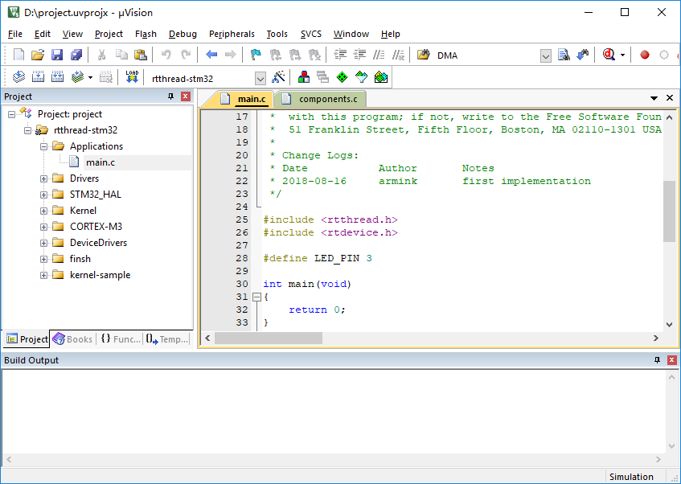
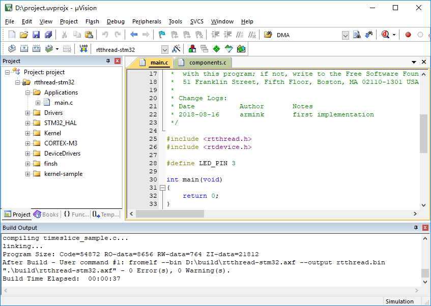
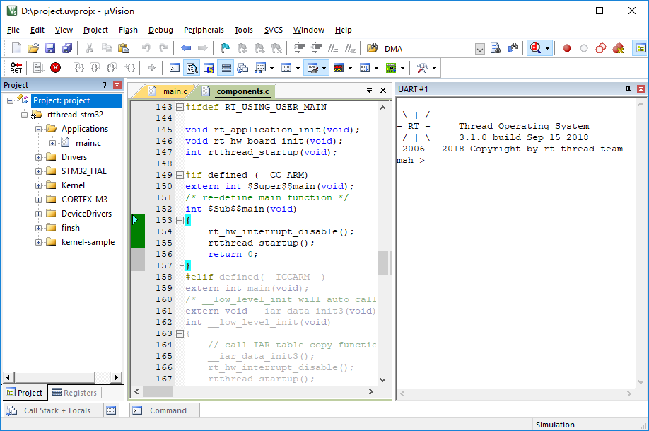
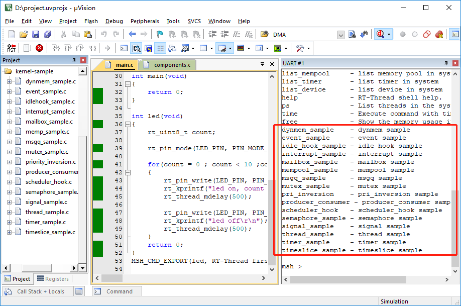

# Start Guide: Simulate STM32F103 on Keil Simulator

Because of its particularity, the embedded operating system is often closely related to the hardware platform, and specific embedded operating systems can only run on specific hardware. For those who might not have an RT-Thread compatible hardware module, or want to test out their ideas, a complete RT-Thread system can be developed in the simulation environment MDK-ARM.

MDK-ARM (Microcontroller Development Kit - ARM) is a complete integrated development environment (IDE) from ARM. It includes an efficient C/C++ compiler for ARM chips (ARM7, ARM9, Cortex-M series, Cortex-R series, etc.), a project wizard and project management for various ARM devices and evaluation boards and a simulator for simulating hardware platforms in software. It supports debuggers connected to simulators debugging the target board, such as the commonly available ST-Link, J-Link, etc. The simulator software in MDK-ARM uses a complete software simulation to interpret and execute machine instructions from ARM and implement some peripheral logic to form a complete virtual hardware environment, enabling users to execute the corresponding target program on the computer without using a real hardware platform.

Because of its full STM32F103 software simulation environment, the MDK-ARM integrated development environment gives us the opportunity to run object code directly on the computer without using a real hardware environment. This simulator platform can completely virtualize the various operating modes and peripherals of the ARM Cortex-M3, such as exceptions, interrupts, clock timers, serial ports, etc., which is almost identical to the real hardware environment. RT-Thread can run on both the simulated environment and on real hardware.

What will follow is a demonstration of RT-Thread running on a simulated STM32F103 microcontroller through MDK-ARM.

## Preparation

MDK development environment: MDK-ARM 5.24 (official or evaluation version, version 5.14 and above) needs to be installed. This version is a relatively new version, which can provide relatively complete debugging functions. An installation guide can be found here: [Keil MDK Installation](./keil-installation/keil-installation.md).

## First acquaintance with RT-Thread

To see the code size of RT-Thread we first need to get an example of RT-Thread that is suited for this environment, which can be obtained from the following link:

[RT-Thread Simulator Sample](./rtthread_simulator_v0.1.0.zip)

This example is a zip file, unzip it. The directory structure after decompression is as shown below:


Descriptions of the file types contained in each directory are shown in the following table:

Directory Name      | Description
---         |   ---
applications| RT-Thread application.
rt-thread   | Source file for RT-Thread.
- components| Respective component directories of RT-Thread.
- include   | Header file for RT-Thread kernel.
- libcpu    | Porting code for various types of chips, including porting files of STM32.
- src       | Source file for RT-Thread kernel.
- tools     | Script file of RT-Thread commanding building tool.
drivers     | Driver of RT-Thread, implementations of bottom driver of different platforms.
Libraries   | ST's STM32 firmware library file.
kernel-sample-0.1.0    | Kernel sample for RT-Thread.

In the directory, there is a file with the name "project.uvprojx", which is an MDK5 project file in the sample referenced in this manual. Double-click "project.uvprojx" icon to open the project file:



Under the "Project" column on the left side of the main window of the project, you can see the file list of the project. These files are stored in the following groups, respectively:

| Directory Group | Description                                                  |
| :-------------- | ------------------------------------------------------------ |
| Applications    | The corresponding directory is rtthread_simulator_v0.1.0/applications, used to store user application code. |
| Drivers         | The corresponding directory is rtthread_simulator_v0.1.0/drivers, used to store the bottom driver code for RT-Thread. |
| STM32_HAL       | The corresponding directory is rtthread_simulator_v0.1.0/Libraries/CMSIS/Device/ST/STM32F1xx, used to store the firmware library files of STM32. |
| kernel-sample   | The corresponding directory is rtthread_simulator_v0.1.0/kernel-sample-0.1.0, used to store kernel samples of RT-Thread. |
| Kernel          | The corresponding directory is rtthread_simulator_v0.1.0/src, used to store RT-Thread kernel core code. |
| CORTEX-M3       | The corresponding directory is rtthread_simulator_v0.1.0/rt-thread/libcpu, used to store ARM Cortex-M3 porting code. |
| DeviceDrivers   | The corresponding directory is rtthread_simulator_v0.1.0/rt-thread/components/drivers, used to store driver framework source code of RT-Thread. |
| finsh           | The corresponding directory is rtthread_simulator_v0.1.0/rt-thread/components/finsh, used to store command line of RT-Thread finsh command line component. |

Now click the button from the toolbar on the top the window, , to compile the project as shown:



The result of the compilation is displayed in the "Build Output" bar at the bottom of the window. If nothing else, it will say "0 Error(s), * Warning(s)." on the last line, that is, there are no errors or warnings.

After compiling RT-Thread/STM32, we can simulate running RT-Thread through the MDK-ARM simulator. Click  at the top right of the window or directly hit Ctrl+F5 to enter the simulation interface and hit F5 to start, then click the button in the toolbar shown in the screen shot or select “View→Serial Windows→UART#1” in the menu bar to open the serial port 1 window. You can see that the output of the serial port only shows the logo of RT-Thread. This is because the user code is empty and the result of its simulation is as shown:



>We can output all the commands supported by the current system by inputting the Tab key or `help + enter` , as shown in the following figure.


## User Entry Code

The above startup code is related to the RT-Thread system, so how do users add initialization code for their own applications? RT-Thread uses main function as the user code entry, all you need to do is just add your own code to the main function.

```c
int main(void)
{
  /* user app entry */
  return 0;
}
```

>Note: In order to complete the initialization for the system functions before entering the main program, you can use the `$sub$$` and `$super$$` function identifiers to call another sample before entering the main program, this was, users can ignore the initialization operations before the main() function. See [ARM® Compiler v5.06 for µVision® armlink User Guide](http://infocenter.arm.com/help/index.jsp?topic=/com.arm.doc.dui0377g/pge1362065967698.html) for details.

## Example of a Marquee

For technical engineers working on electronics, marquee is probably the simplest example, the equivalent of Hello World in every programming language programmers learn. So we will start with a marquee in the following example, to make it periodically update (turn on or off) the LED.

Under UART#1, input msh command: led and then click Enter to run it, as shown:


**Example of a Marquee**

```c
/*
 * Manifest of programs: Marquee sample
 *
 * marquee is probably the simplest example, it is like the first program
 * Hello World in every programming language that programmers learned. So we will start with a marquee in the following example, start a thread to make it periodically
 * update (turn on or off) the LED.
 */

int led(void)
{
    rt_uint8_t count;

    rt_pin_mode(LED_PIN, PIN_MODE_OUTPUT);

    for(count = 0 ; count < 10 ;count++)
    {
        rt_pin_write(LED_PIN, PIN_HIGH);
        rt_kprintf("led on, count : %d\r\n", count);
        rt_thread_mdelay(500);

        rt_pin_write(LED_PIN, PIN_LOW);
        rt_kprintf("led off\r\n");
        rt_thread_mdelay(500);
    }
    return 0;
}
MSH_CMD_EXPORT(led, RT-Thread first led sample);
```

## Other Examples

Additional kernel examples can be found in the kernel-sample-0.1.0 directory.



## Frequently Asked Question

* Compilation error occurred as following:

```
rt-thread\src\kservice.c(823): error: #929: incorrect use of vaarg fieldwidth = aarg(args, int);
rt-thread\src\kservice.c(842): error: #929: incorrect use of vaarg precision = aarg(args, int);
………
```

Cause: This type of problem is usually caused by installation of ADS, when ADS and keil coexist, the header file of va_start points to the ADS folder.

Solution:

- Delete ADS environment variables
- Uninstall ADS and Keil, restart the computer, reload Keil


