# Getting Started of QEMU (Ubuntu)

The development of embedded software is inseparable from the development board. Without physical development boards, similar virtual machines like QEMU can be used to simulate the development board. QEMU is a virtual machine that supports cross-platform virtualization. It can virtualize many development boards. To facilitate the experience of RT-Thread without a development board, RT-Thread provides a board-level support package (BSP) for QEMU-simulated **ARM vexpress A9** development board.

## 1 Install dependency libraries

We need to type commands as following in the terminal:

```shell
sudo apt install gcc
sudo apt install python3
sudo apt install python3-pip
sudo apt install gcc-arm-none-eabi
sudo apt install gdb-arm-none-eabi
sudo apt install binutils-arm-none-eabi
sudo apt install scons
sudo apt install libncurses5-dev
sudo apt install qemu
sudo apt install qemu-system-arm
sudo apt install git
```

## 2 Get RT-Thread source code

Download RT-Thread Source Code : `git clone https://github.com/RT-Thread/rt-thread.git`

You can directly ignore the following steps, this is used for setting GCC compiler manually. Usually, you don't need to set this.

> - Install the compiler. If the compiler version installed with `apt-get` command is too old, it will cause compilation errors. You can download and install the new version using the following command in turn. The download link and the decompression folder name will vary according to the download version. The following Compression Packet will unzip to the `/opt` folder.
>
>   - `wget https://armkeil.blob.core.windows.net/developer/Files/downloads/gnu-rm/6-2016q4/gcc-arm-none-eabi-6_2-2016q4-20161216-linux.tar.bz2`
>   - `cd /opt`
>   - `sudo tar xf ~/gcc-arm-none-eabi-6_2-2016q4-20161216-linux.tar.bz2`
>
>
> - After the compiler is installed, it is necessary to modify the `rtconfig.py` file under `rt-thread/bsp/qemu-vexpress-a9` BSP, modify the corresponding path to the bin directory corresponding to the compiler decompressed into the opt directory. Referring to the following figure, the directory name varies according to the downloaded version of the compiler:
>
> 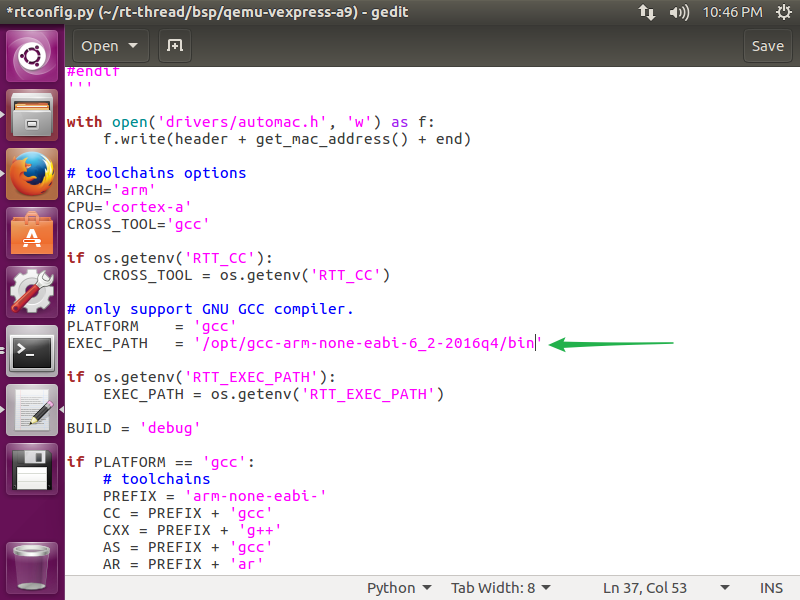
>


## 3 Build QEMU Project

### 3.1 Move into QEMU folder

```
cd rt-thread/bsp/qemu-vexpress-a9/
```

### 3.2 Configure the environment of Env tool

#### 3.2.1 Remap python command

We need to remap `python` command as python3 by default.

Using `whereis` command to identify your python3's version:

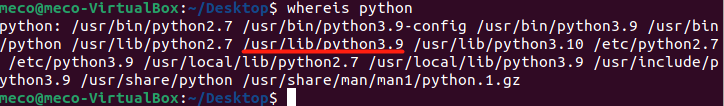

For instance, as you can see, in my computer, the python3's version is python 3.9. You need to identify python3's version in your computer. Then, we remap the `python` command as python3 by default:

```shell
sudo rm -rf /usr/bin/python3
sudo rm -rf /usr/bin/python
sudo ln -s /usr/bin/python3.9 /usr/bin/python3
sudo ln -s /usr/bin/python3.9 /usr/bin/python
```

### 3.3 Install Env and Configure BSP

Type following the command under  `bsp/qemu-vexpress-a9` folder:

```
scons --menuconfig
```

The Env tool will be installed and initialized after using the `scons --menuconfig` command. Then it will enter the configuration interface, and you could configure the BSP:


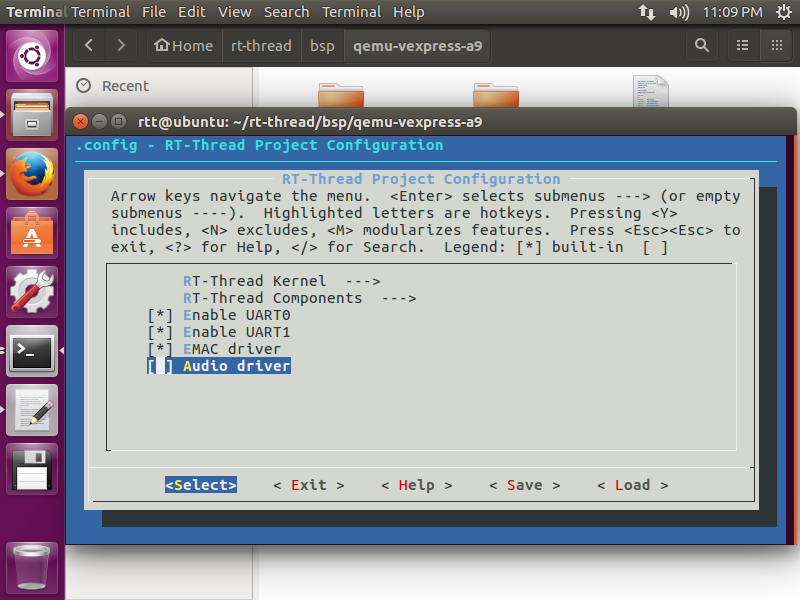

You can use the keyboard `↑` key and `↓` key to look up and down menu items, use the `Enter` key to enter the selected directory, use the `Space` key to select or cancel bool variables, and press `Esc Esc` to exit the current directory.

> Notice: Please make sure that the terminal size is larger than 80x24 character size.

### 3.4 Configure the QEMU BSP and acquisition of software packages

```
source ~/.env/env.sh
scons --menuconfig
pkgs --update
```

The `env.sh` file is a file that needs to be executed. It configures the environment variables so that we can update the package with the pkgs command and execute it with the `source ~/.env/env.sh` command.

Then use `scons --menuconfig` command to enter menuconfig, and you could select the online packages by this time.

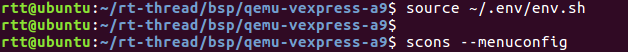

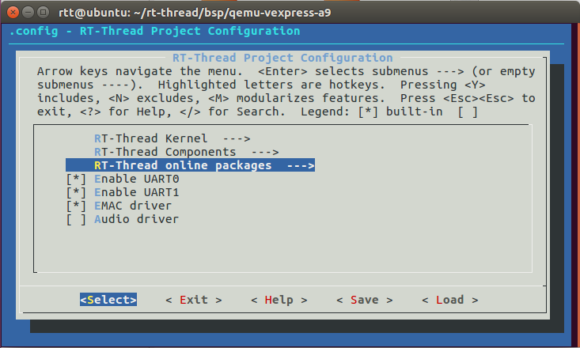

For example, select the kernel sample package: semphore sample.

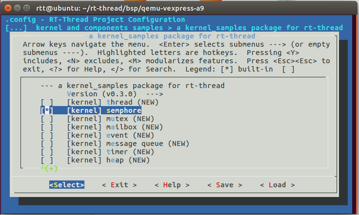

Exit and save the configuration.

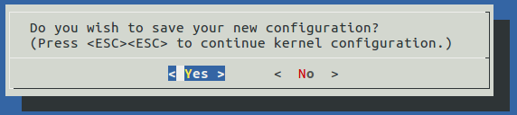

If you have selected an online package, you can download the package to the packages folder in the BSP directory using the `pkgs --update` command (Git needs to be installed):

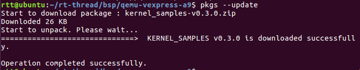

#### 4.1 Tips

Before you use the `pkgs` command, you need to type command `source ~/.env/env.sh`. This is a annoying work. We can attach this command as a new line at the end of `~/.bashrc`, which can let you to to use `pkgs` command directly.

### 3.5 Compile the QEMU project

```
scons
```

Using the `scons` command to compile the BSP.

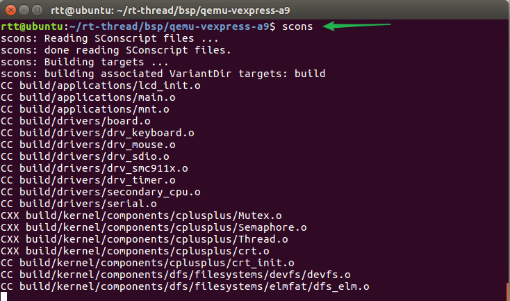

## 4 Introduction of QEMU BSP Catalogue

The board-level support package (BSP) provided by RT-Thread simulates ARM vexpress A9 development board is located in the `qemu-vexpress-a9` folder under the `bsp` directory of RT-Thread source code. This BSP implements LCD, keyboard, mouse, SD card, Ethernet card, serial port and other related drivers. The contents of the folder are shown in the following figure.

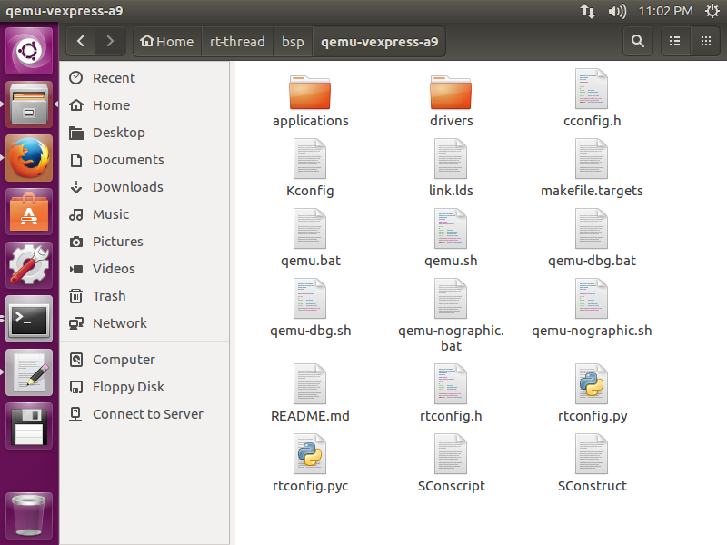

The main files and directories of `qemu-vexpress-a9` BSP are described as follows:

| Fles/Directories | Description                                 |
| ---------------- | ------------------------------------------- |
| applications     | User application code directory             |
| drivers          | The underlying driver provided by RT-Thread |
| qemu.bat         | Script files running on Windows platform    |
| qemu.sh          | Script files running on Linux platform      |
| qemu-dbg.bat     | Debugging script files on Windows platform  |
| qemu-dbg.sh      | Debugging script files on Linux platform    |
| README.md        | Description document of BSP                 |
| rtconfig.h       | A header file of BSP                        |

## 5 Compile and Run

### 5.1 Use the *scons* Command to Compile the Project

Switch to the QEMU BSP directory and enter the `scons` command to compile the project. If the compilation is correct, the `rtthread.elf`  file will be generated in the BSP directory, which is a target file required for QEMU to run.


### 5.2 Use the *./qemu.sh* Command to Run the Project 

After compiling, type `./qemu.sh` to start the virtual machine and BSP project. `qemu.sh` is a Linux batch file. This file is located in the BSP folder, mainly including the execution instructions of QEMU. The first run of the project will create a blank `sd.bin` file under the BSP folder, which is a virtual SD card with a size of 64M. The Env command interface displays the initialization information and version number information printed during the start-up of RT-Thread system, and the QEMU virtual machine is also running. As shown in the following picture:

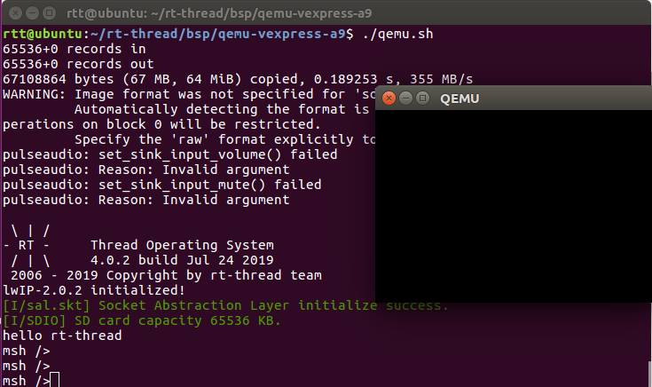

### 5.3 Run the Finsh Console

RT-Thread supports Finsh, and users can use command operations in command line mode.

Type `help` or press `Tab` to view all supported commands. As shown in the figure below, commands are on the left and command descriptions are on the right.

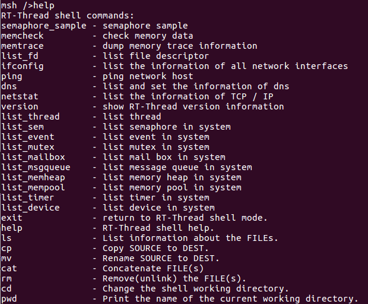

For example, by entering the `list_thread` command, you can see the currently running threads, thread status and stack size; by entering the `list_timer`, you can see the status of the timers.

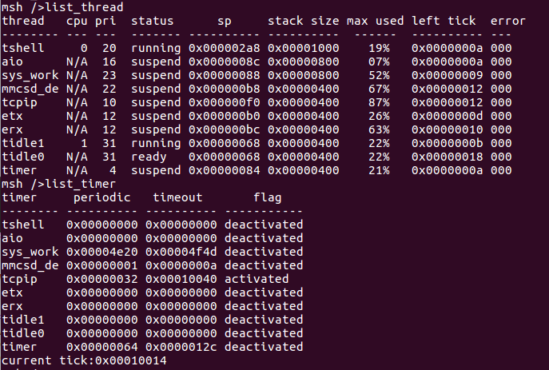

### 5.4 Run the File System

Type `list_device` to view all devices registered in the system. You can see the virtual SD card "sd0" device as shown in the following picture. Next, we can format the SD card using the `mkfs sd0` command, which will format the SD card into a FatFS file system. FatFs is a Microsoft fat-compatible file system developed for small embedded devices. It is written in ANSI C, uses abstract hardware I/O layer and provides continuous maintenance, so it has good portability.

> For more information on FatFS, click on the link: [http://elm-chan.org/fsw/ff/00index_e.html](http://elm-chan.org/fsw/ff/00index_e.html)

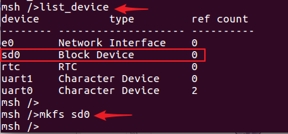

The file system will not be loaded immediately after the first formatting of the SD card, and the file system will be loaded correctly only after the second boot. So exit the virtual machine, and then restart the virtual machine and project by entering `./qemu.sh` on the command line interface. Entering `ls` command, you can see that the `Directory` directory has been added, the file system has been loaded, and then you can experience the file system with other commands provided by RT-Thread:

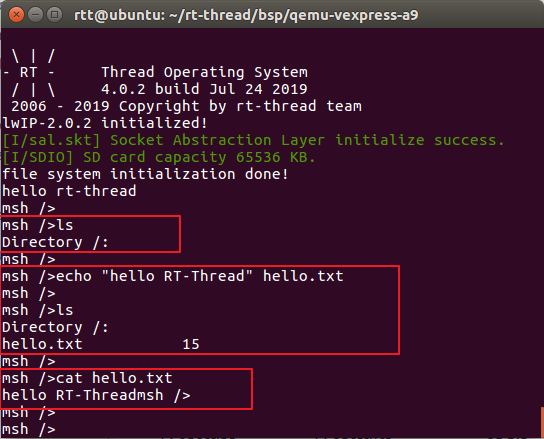

- ls: Display the file and directory information
- cd: Switch to the specified directory
- rm: Delete files or directories
- echo: Writes the specified content to the target file
- cat: Displays the details of a file
- mkdir: Create folders

Please enter `help` to see more commands.

## 6 More Functions

You can configure more functions in the menuconfig's configuration interface. use `scons --menuconfig` to config the BSP. After the configuration is completed, save the configuration first, and then exit the configuration interface, then:

1. If you choose a package, you need to use the command `pkgs --update` to download the package.
2. Compile with `scons`.
3. Then enter `./qemu.sh` to run QEMU.
4. Use `help` to view all commands of the BSP. And then use the commands.
