# Getting Started of QEMU (macOS)

The development of embedded software is inseparable from the development board. Without physical development boards, similar virtual machines like QEMU can be used to simulate the development board. QEMU is a virtual machine that supports cross-platform virtualization. It can virtualize many development boards. To facilitate the experience of RT-Thread without a development board, RT-Thread provides a board-level support package (BSP) for QEMU-simulated **ARM vexpress A9** development board. This document details the steps to run RT-Thread with QEMU on a macOS machine with an Intel processor.

## 1 Install dependency libraries

### 1.1 Install Python and SCons

Download the latest Python installer from the [official Python website](https://www.python.org/downloads/). Click on the installer and follow the steps to install.

Then install SCons with

```shell
python3 -m pip install scons
```

### 1.2 Use Homebrew to install QEMU

First install Homebrew with

```shell
/bin/bash -c "$(curl -fsSL https://raw.githubusercontent.com/Homebrew/install/HEAD/install.sh)"
```

Then use Homebrew to install QEMU

```shell
brew install qemu
```

### 1.3 Install compiler toolchain

Download the latest ARM GNU toolchain from [armDeveloper website](https://developer.arm.com/tools-and-software/open-source-software/developer-tools/gnu-toolchain/downloads). Download the `.tar.xz` file under macOS (x86_64) hosted cross toolchains, AArch32 bare-metal target (arm-none-eabi)

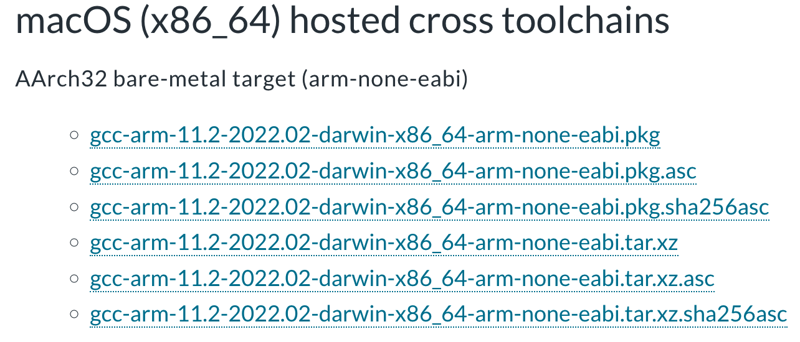

Move the file to an appropriate location. The following steps assume the file is moved to the home directory

Decompress the file

```shell
tar xf ~/gcc-arm-11.2-2022.02-darwin-x86_64-arm-none-eabi.tar.xz
```

Add the following line to `~/.bash_profile`

```shell
export PATH="$PATH:~/gcc-arm-11.2-2022.02-darwin-x86_64-arm-none-eabi/bin"
```

Run the following command. This is only needed once after `~/.bash_profile` is modified

```shell
source ~/.bash_profile
```

Check the installed tools can be detected

```
$ arm-none-eabi-gcc --version
arm-none-eabi-gcc (GNU Toolchain for the Arm Architecture 11.2-2022.02 (arm-11.14)) 11.2.1 20220111
Copyright (C) 2021 Free Software Foundation, Inc.
This is free software; see the source for copying conditions.  There is NO
warranty; not even for MERCHANTABILITY or FITNESS FOR A PARTICULAR PURPOSE.
```

## 2 Get RT-Thread source code

Download RT-Thread Source Code : `git clone https://github.com/RT-Thread/rt-thread.git`

## 3 Build QEMU Project

### 3.1 Move into QEMU folder

```
cd rt-thread/bsp/qemu-vexpress-a9/
```

### 3.2 Install Env and Configure BSP

Type following the command under  `bsp/qemu-vexpress-a9` folder:

```
scons --menuconfig
```

The Env tool will be installed and initialized after using the `scons --menuconfig` command. Then it will enter the configuration interface, and you could configure the BSP:

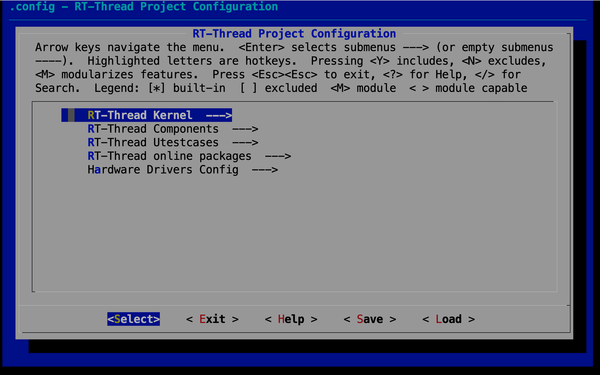

You can use the keyboard `↑` key and `↓` key to look up and down menu items, use the `Enter` key to enter the selected directory, use the `Space` key to select or cancel bool variables, and press `Esc Esc` to exit the current directory.

### 3.3 Acquire software packages

```
source ~/.env/env.sh
scons --menuconfig
pkgs --update
```

The `env.sh` file  configures the environment variables so that you can update the package with the `pkgs` command. You need to run `source ~/.env/env.sh` every time before you use the `pkgs` command in a new terminal. To avoid doing this you can add this command to the end of `~/.bash_profile`, which can let you to use `pkgs` command directly.

Then use `scons --menuconfig` command to enter menuconfig, and you could select the online packages at this time.

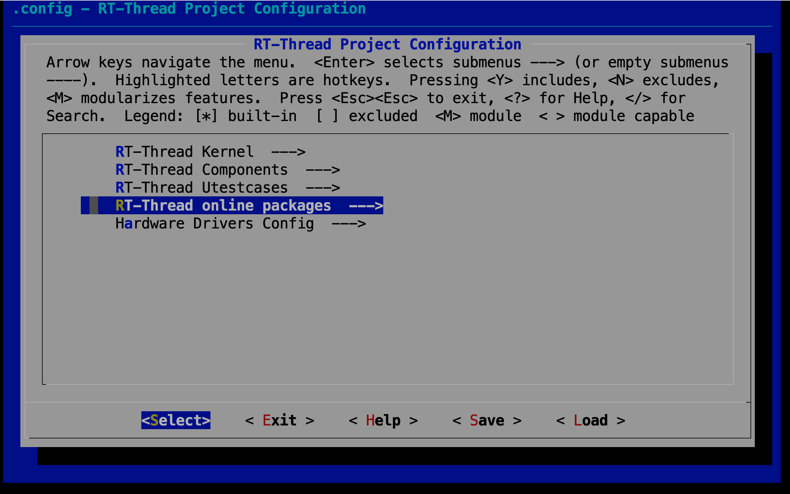

For example, select the system packages, POSIX extension functions, xxtension string functions `<strings.h>`

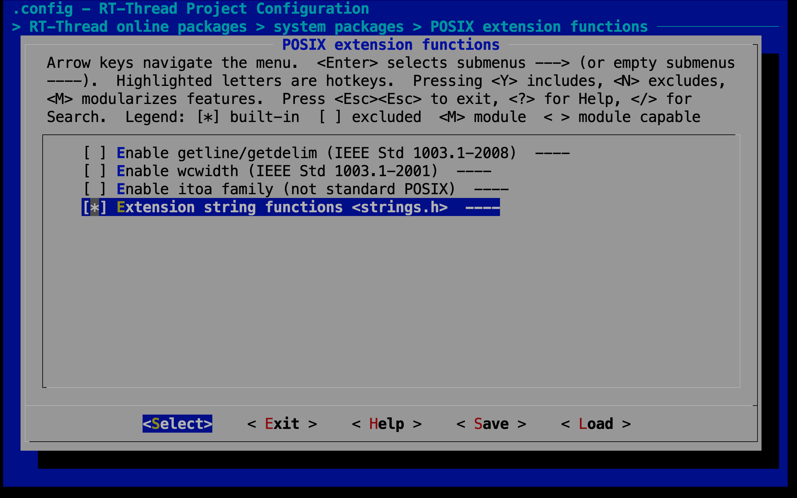

Exit and save the configuration.

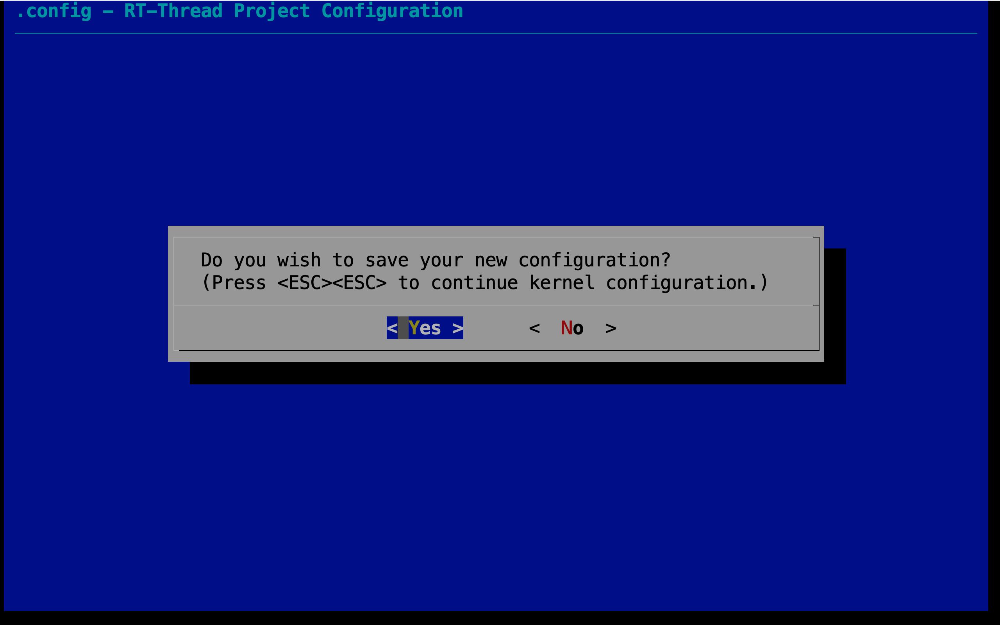

If you have selected an online package, you can download the package to the packages folder in the BSP directory using the `pkgs --update` command (Git needs to be installed):

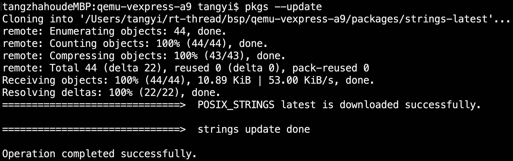

### 3.4 Compile the QEMU project

Run the `scons` command to compile the BSP. If the compilation is successful, the `rtthread.elf` file will be generated in the BSP directory, which is a target file required for QEMU to run.

## 4 Introduction of QEMU BSP Catalogue

The board-level support package (BSP) provided by RT-Thread simulates ARM vexpress A9 development board is located in the `qemu-vexpress-a9` folder under the `bsp` directory of RT-Thread source code. This BSP implements LCD, keyboard, mouse, SD card, Ethernet card, serial port and other related drivers. The contents of the folder are shown in the following figure.

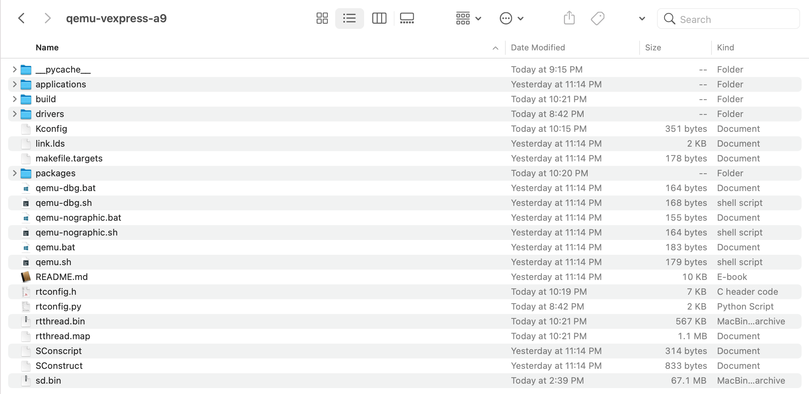

The main files and directories of `qemu-vexpress-a9` BSP are described as follows:

| Fles/Directories | Description                                 |
| ---------------- | ------------------------------------------- |
| applications     | User application code directory             |
| drivers          | The underlying driver provided by RT-Thread |
| qemu.bat         | Script files running on Windows platform    |
| qemu.sh          | Script files running on Linux platform      |
| qemu-dbg.bat     | Debugging script files on Windows platform  |
| qemu-dbg.sh      | Debugging script files on Linux platform    |
| README.md        | Description document of BSP                 |
| rtconfig.h       | A header file of BSP                        |

## 5 Run the QEMU project

### 5.1 Use the *./qemu.sh* Command to Run the Project 

After compiling, type `./qemu.sh` to start the virtual machine and BSP project. This file is located in the BSP folder, mainly including the execution instructions of QEMU. The first run of the project will create a blank `sd.bin` file under the BSP folder, which is a virtual SD card with a size of 64M. The Env command interface displays the initialization information and version number information printed during the start-up of RT-Thread system, and the QEMU virtual machine is also running. As shown in the following picture:

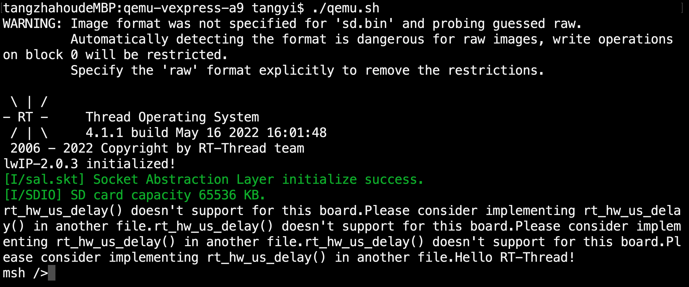

### 5.2 Run the Finsh Console

RT-Thread supports Finsh, and users can use command operations in command line mode.

Type `help` or press `Tab` to view all supported commands. As shown in the figure below, commands are on the left and command descriptions are on the right.

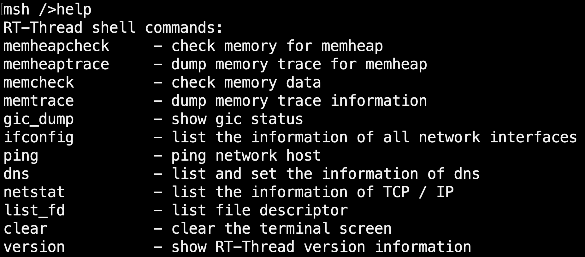

For example, by entering the `list_thread` command, you can see the currently running threads, thread status and stack size; by entering the `list_timer`, you can see the status of the timers.

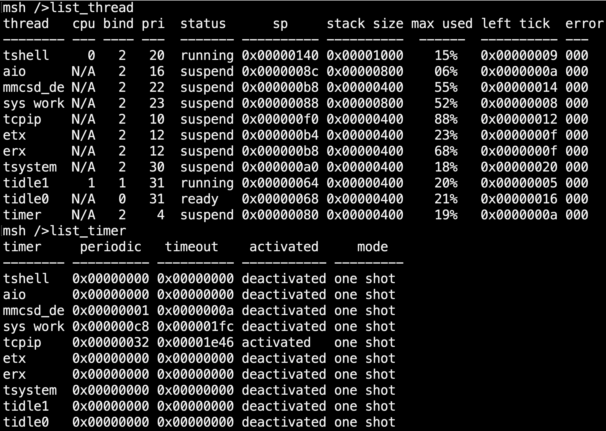

### 5.3 Run the File System

Type `list_device` to view all devices registered in the system. You can see the virtual SD card "sd0" device as shown in the following picture. Next, we can format the SD card using the `mkfs sd0` command, which will format the SD card into a FatFS file system. FatFs is a Microsoft fat-compatible file system developed for small embedded devices. It is written in ANSI C, uses abstract hardware I/O layer and provides continuous maintenance, so it has good portability.

> For more information on FatFS, click on the link: [http://elm-chan.org/fsw/ff/00index_e.html](http://elm-chan.org/fsw/ff/00index_e.html)

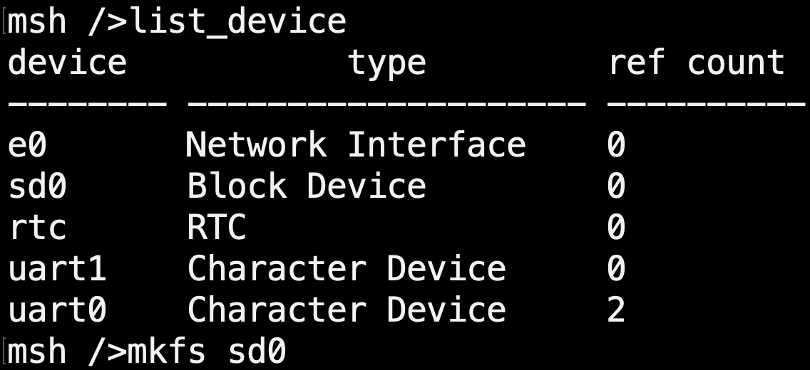

The file system will not be loaded immediately after the first formatting of the SD card, and the file system will be loaded correctly only after the second boot. So exit the virtual machine, and then restart the virtual machine and project by entering `./qemu_nographic.sh` on the command line interface. Entering `ls` command, you can see that the `Directory` directory has been added, the file system has been loaded, and then you can experience the file system with other commands provided by RT-Thread:

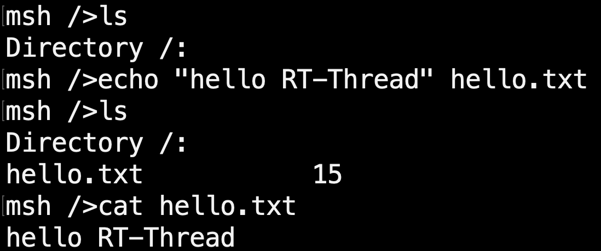

- ls: Display the file and directory information
- cd: Switch to the specified directory
- rm: Delete files or directories
- echo: Writes the specified content to the target file
- cat: Displays the details of a file
- mkdir: Create folders

Please enter `help` to see more commands.
