# Getting Started of QEMU (Windows)

The development of embedded software is inseparable from the development board. Without physical development boards, similar virtual machines like QEMU can be used to simulate the development board. QEMU is a virtual machine that supports cross-platform virtualization. It can virtualize many development boards. To facilitate the experience of RT-Thread without a development board, RT-Thread provides a board-level support package (BSP) for QEMU-simulated **ARM vexpress A9** development board.

## Preparations

- [Download RT-Thread source code](https://github.com/RT-Thread/rt-thread)
- [Download annd install Env tool](../../env/env.md)

## Introduction of QEMU BSP Catalogue

The board-level support package (BSP) provided by RT-Thread simulates ARM vexpress A9 development board is located in the `bsp/qemu-vexpress-a9` folder under the BSP directory of RT-Thread source code. This BSP implements LCD, keyboard, mouse, SD card, Ethernet card, serial port and other related drivers. The contents of the folder are shown in the following figure.

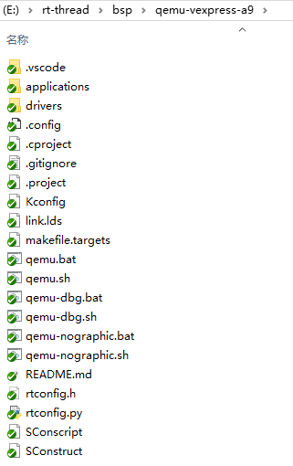

The main files and directories of `qemu-vexpress-a9` BSP are described as follows:

| Fles/Directories | Description                                 |
| ---------------- | ------------------------------------------- |
| .vscode          | configuration file of vscode                |
| applications     | User application code directory             |
| drivers          | The underlying driver provided by RT-Thread |
| qemu.bat         | Script files running on Windows platform    |
| qemu.sh          | Script files running on Linux platform      |
| qemu-dbg.bat     | Debugging script files on Windows platform  |
| qemu-dbg.sh      | Debugging script files on Linux platform    |
| README.md        | Description document of BSP                 |
| rtconfig.h       | A header file of BSP                        |

## Compile and Run

### Configuration

Type the `menuconfig` command in the Env terminal to enter the configuration interface, and then configure the BSP:

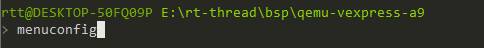

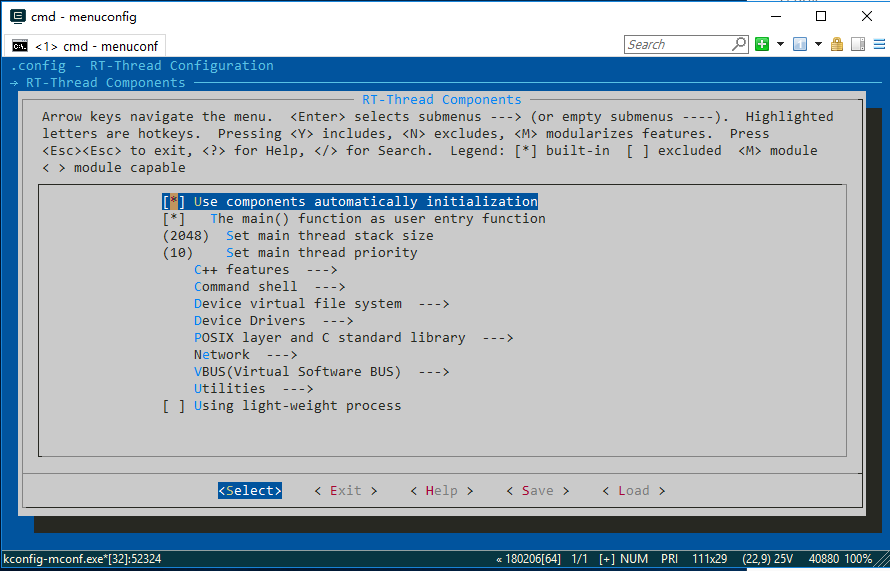

You can use the keyboard `↑` key and `↓` key to look up and down menu items, use the `Enter` key to enter the selected directory, use the `Space` key to select or cancel bool variables, and use the `Esc` key to exit the current directory.

### Acquisition of software packages

If a package is selected in menuconfig, download the package using the `pkgs --update` command. 

The alternative and recommended way is by using `menuconfig -s` to select the `Auto update pkgs config` feature, so that when users exit the menuconfig, Env will automatically download and update software packages.

### Compile

Compile using the `scons` command, or `scons -j12` means 12 CPU cores compiling.

#### Step 1. Use the *scons* Command to Compile the Project

Open the Env folder and double-click the `env.exe` file to open the Env console:

Switch to the QEMU BSP directory and enter the `scons` or `scons -j12` command to compile the project. If the compilation is correct, the `rtthread.elf`  file will be generated in the BSP directory, which is a target file required for QEMU to run.

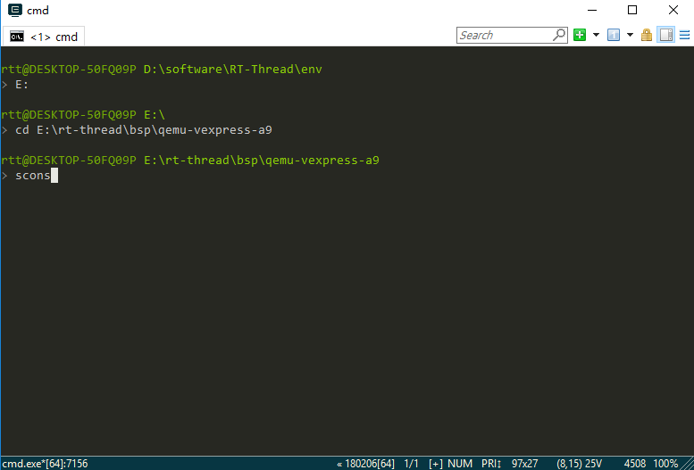

#### Step 2. Use the *qemu.bat* Command to Run the Project

After compiling, type `qemu.bat` to start the virtual machine and BSP project. `qemu.bat` is a Windows batch file. This file is located in the BSP folder, mainly including the execution instructions of QEMU. The first run of the project will create a blank `sd.bin` file under the BSP folder, which is a virtual SD card with a size of 64M. The Env command interface displays the initialization information and version number information printed during the start-up of RT-Thread system, and the QEMU virtual machine is also running. As shown in the following picture:

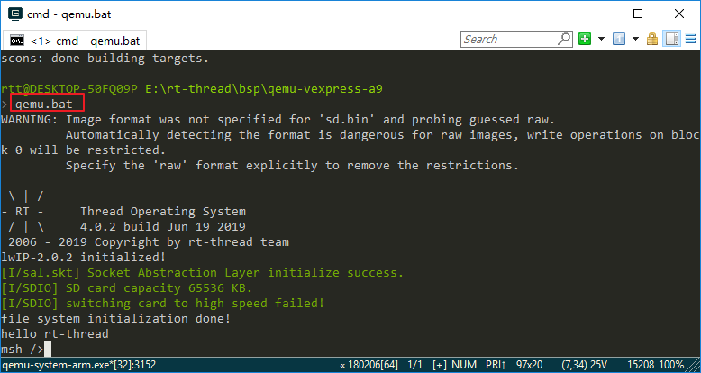

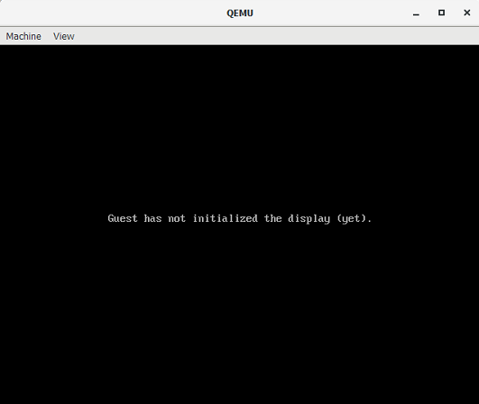

### Run the Finsh Console

RT-Thread supports Finsh, and users can use command operations in command line mode.

Type `help` or press `Tab` to view all supported commands. As shown in the figure below, commands are on the left and command descriptions are on the right.

For example, by entering the `list_thread` command, you can see the currently running threads, thread status and stack size; by entering the `list_timer`, you can see the status of the timers.

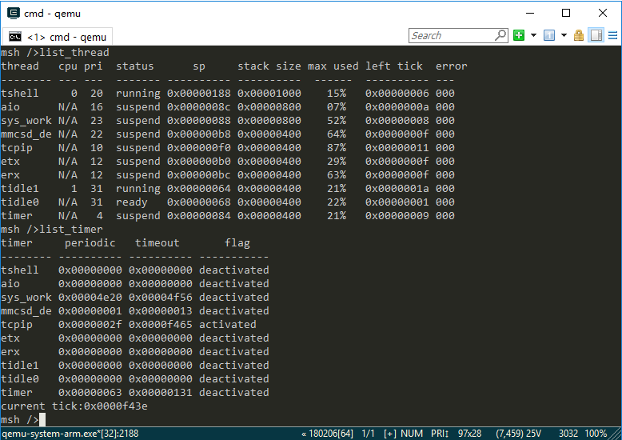

### Run the File System

Type `list_device` to view all devices registered in the system. You can see the virtual SD card "sd0" device as shown in the following picture. Next, we can format the SD card using the `mkfs sd0` command, which will format the SD card into a FatFS file system. FatFs is a Microsoft fat-compatible file system developed for small embedded devices. It is written in ANSI C, uses abstract hardware I/O layer and provides continuous maintenance, so it has good portability.

For more information on FatFS, click on the link: [http://elm-chan.org/fsw/ff/00index_e.html](http://elm-chan.org/fsw/ff/00index_e.html)

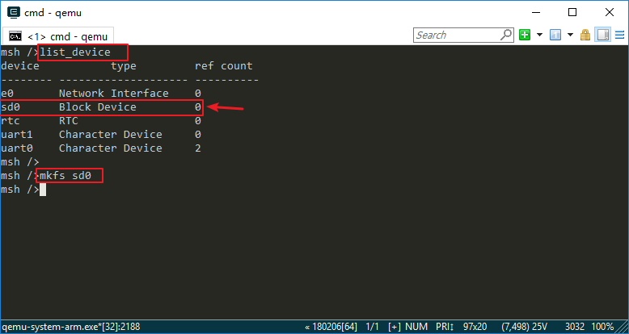

The file system will not be loaded immediately after the first formatting of the SD card, and the file system will be loaded correctly only after the second boot. So exit the virtual machine, and then restart the virtual machine and project by entering `qemu.bat` on the Env command line interface. Entering `ls` command, you can see that the `Directory` directory has been added, the file system has been loaded, and then you can experience the file system with other commands provided by RT-Thread:

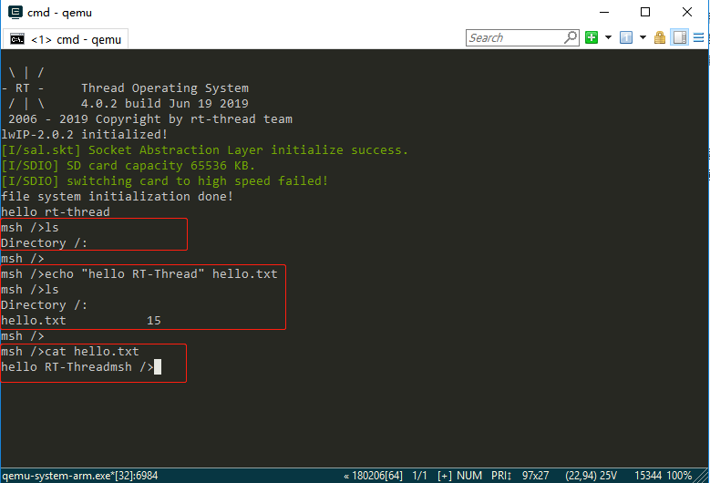

- ls: Display file and directory information
- cd: Switch to the specified directory
- rm: Delete files or directories
- echo: Writes the specified content to the target file
- cat: Displays the details of a file
- mkdir: Create folders

Please enter `help` to see more commands.

## More Functions

Open the Env tool in the BSP directory and enter the `menuconfig` command:

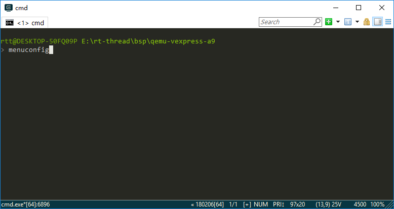

You can configure more functions in the configuration interface. After the configuration is completed, save the configuration first, and then exit the configuration interface:

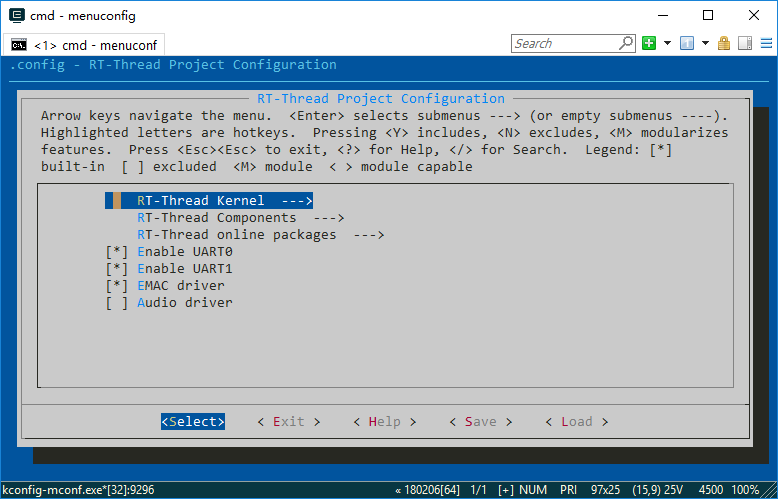

1. If you choose a package, you need to use the command `pkgs --update` to download the package.
2. Compile with `scons` or `scons -j12`.
3. Then enter `qemu.bat` to run.
4. Use `help` to view all commands of the BSP. And then use the commands.
