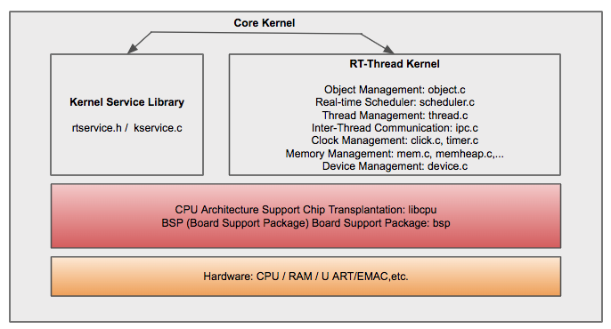
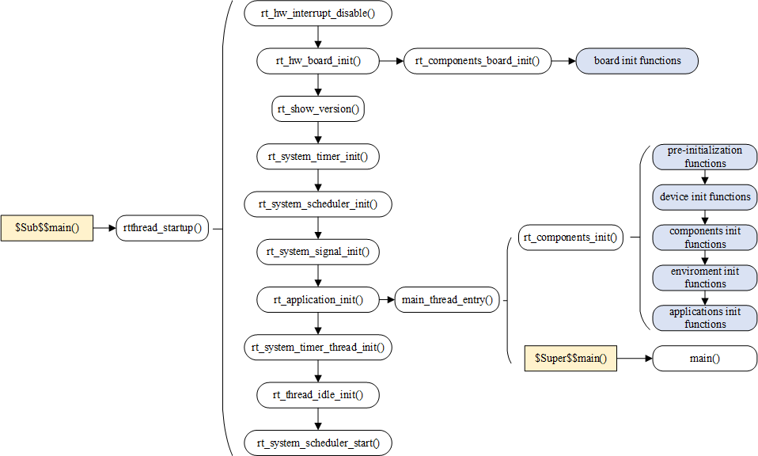
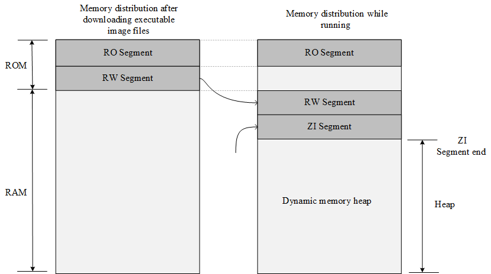

@page page_kernel_basics Kernel Basics

This chapter gives a brief introduction to the software architecture of the RT-Thread kernel, beginning with its composition and implementation.  While also introducing RT-Thread kernel-related concepts for beginners.

After understanding this chapter, readers will have an elementary understanding of the RT Thread kernel and will be able to answer questions such as:

- What are the constituents of the kernel?
- How does the system startup?
- How is the memory distributed?
- What are the methods of kernel configuration?

In the nutshell, this is only a brief introduction to software architecture decomposition and implementation of the real-time kernel. This will give understanding and concepts of how RT-Thread kernel works togther. After learning from this chapter, readers will have basic knowledge of each kernel components, system booting up proccesses, memory allocation and distrubtion, and methods of kernel configuration.

# Introduction to RT-Thread Kernel

Kernel is the most basic and fundenmental part of an Operating System. Kernel service library and RT-Thread kernel libraries are interfacing between hardware and components/service layer. This includes the implementation of real-time kernel service library (`rtservice.h/kservice.c`) and other RT-Thread kernel libraries such as object management, thread management and scheduler, inter-thread communication management, clock management and memory management respectively. Below diagram is the core architecture diagram of the core kernel.



Implementation of core kernel libraries are similar to a small set of standard C runtime library and it can run independently. For example, Standard C library (C runtime library) provides "strcpy", "memcpy", "printf", "scanf" and other function implementations. RT-Thread kernel libraries also provide the function implementations which are mainly used by Core Kernel. However, to avoid name conflicts, specifically functions' names are preceded with rt_.

The built of the Kernel will be vary depending on the complier. For example, using GNU GCC compiler, it will use more implementation from the standard C library. Last but not least, the minimum resource requirements of the Kernel is 3KB ROM and 1.2KB RAM.

## Object Management

The Kernel object system can access and manage all of the kernel objects, such as:

- thread
- semaphore and mutex
- event/fast event, mailbox, messagequeue
- memory pool
- timer
- ......

Object management will be covered in detail in the chapter @ref page_object_management.

## Thread Scheduling

Thread is the smallest scheduling unit in the RT-Thread operating system. The thread scheduling algorithm is a **Priority-based Full Preemptive Multi-Thread** scheduling algorithm.

The system can support up to 256(0 - 255) thread priorities. For systems with tight resources, configurations with 8 or 32 thread priorities can be chosen(For example, STM32 has 32 thread priorities as per the default configuration). Lower numbers have a higher priority where 0 represents the highest priority furthermore the lowest priority(highest number) is reserved for idle threads.

RT-Thread supports the creation of multiple threads with the same priority. Threads having the same priority are scheduled with a Time Slice Rotation Scheduling algorithm so that each thread runs for the same amount of time.

The number of threads is bounded by the memory of the hardware platform and not the system.

Thread management will be covered in detail in the chapter @ref page_thread_management.

## Clock & Timer Management

RT-Thread's Clock management is based upon a **clock beat**, which is the smallest clock unit in the RT-Thread operating system.

The RT-Thread timer provides two types of timer mechanisms:

- **One-Shot Timer** - Triggers only one timer event after startup and then stops automatically.
- **Periodic Trigger Timer** - Periodically triggers timer events until the user manually stops the timer or it will continue to operate.

The RT-Thread timer can be set to the `HARD_TIMER` or the `SOFT_TIMER` mode depending on the context in which the timeout function is executed.

The timer service is concluded using a timer timing callback i.e. a timeout function. The user can select the appropriate type of timer according to their real-time requirements for timing processing.

Timer will be explained further in the chapter @ref page_clock_management.

## Synchronization between Threads

RT-Thread uses thread semaphores, mutexes, and event sets to achieve inter-thread synchronization.

Thread synchronizations happen through the acquisition and release of semaphore and mutexes.

The mutex uses priority inheritance to solve the common priority inversion problem in the real-time system. The thread synchronization mechanism allows threads to wait according to priorities or to acquire semaphores/mutexes following the First In First Out(FIFO) method.

Event sets are primarily used for synchronization between threads, they can achieve one-to-many and many-to-many synchronization. It allows **OR trigger** (*independent synchronization*) and **AND trigger**(*associative synchronization*) suitable for situations where threads are waiting for multiple events.

The concepts of semaphores, mutexes, and event sets are detailed in the chapter @ref page_thread_sync.

## Inter-Thread Communication

RT-Thread supports communication mechanisms such as mailbox, message queue, etc. The mailbox's message length is fixed to 4 bytes. Whereas, message queue can receive messages in variable size and cache the messages in its own memory space.  

Compared to a message queue, a mailbox is more efficient. The sending action of the mailbox and message queue can be safely used in an ISR (Interrupt Service Routine). The communication mechanism allows threads to wait by priority or to acquire by the First In First Out (FIFO) method.  

The concept of mailbox and message queue will be explained in detail in the chapter @ref page_thread_comm.

## Memory Management

RT-Thread allows:

1. Static Memory Pool
2. Dynamic Memory Pool  

When the static memory pool has available memory, the time allocated to the memory block will be constant. 

When the static memory pool is empty, the system will then request for suspending or blocking the thread of the memory block. The thread will abandon the request and return if the memory block is not obtained after waiting for a while, or the thread will abandon and return immediately. The waiting time depends on the waiting time parameter set when the memory block is applied. When other threads release the memory block to the memory pool, the system will wake up the thread if there are suspended threads waiting to be allocated of memory blocks.

Under circumstances of different system resources, the dynamic memory heap management module respectively provides memory management algorithms for small memory systems and SLAB memory management algorithms for large memory systems.

There is also a dynamic memory heap management called memheap, suitable for memory heaps in systems with multiple addresses that can be discontinuous. Using memheap, the user can "paste" multiple memory heaps together, letting them operate as if operating a memory heap.

The concept of memory management will be explained in the chapter @ref page_memory_management.

## I/O Device Management

RT-Thread uses I2C, SPI, USB, UART, etc., as peripheral devices and is uniformly registered through the device. It realized a device management subsystem accessed by the name, and it can access hardware devices according to a unified API interface. On the device driver interface, depending on the characteristics of the embedded system, corresponding events can be attached to different devices. The driver notifies the upper application program when the device event is triggered.

The concept of I/O device management will be explained in the chapter @ref page_device_framework.

# RT-Thread Startup Process

The understanding of most codes usually starts from learning the startup process. We will firstly look for the source of the startup. Taking MDK-ARM as an example, the user program entry for MDK-ARM is the `main()` function located in the `main.c` file. The launching of the system starts from the assembly code `startup_stm32f103xe.s`, jumps to the C code, initializes the RT-Thread system function, and finally enters the user program entry `main()`.

To complete the RT-Thread system function initialization before entering `main()`, we used the MDK extensions  `$Sub$$` and  `$Super$$`. Users can add the prefix of `$Sub$$` to main to make it a new function `$Sub$$main`.

`$Sub$$main` can call some functions to be added before main (here, RT-Thread system initialization function is added). Then, call `$Super$$main` to the `main()` function so that the user does not have to manage the system initialization before main().

For more information on the use of the `$Sub$$` and `$Super$$` extensions, see the ARM® Compiler v5.06 for μVision®armlink User Guide.

Let's take a look at this code defined in components.c:

```c
/* $Sub$$main Function */
int $Sub$$main(void)
{
  rtthread_startup();
  return 0;
}
```

Here, the `$Sub$$main` function simply calls the `rtthread_startup()` function. RT-Thread allows multiple platforms and multiple compilers, and the `rtthread_startup()` function is a uniform entry point specified by RT-Thread, so the `$Sub$$main` function only needs to call the `rtthread_startup()` function (RT-Thread compiled using compiler GNU GCC is an example where it jumps directly from the assembly startup code section to the `rtthread_startup()` function and starts the execution of the first C code).

The `rtthread_startup()` function can be found in the code of `components.c`, the startup process of RT-Thread is as shown below:



Code for the `rtthread_startup()` function is as follows:

```c
int rtthread_startup(void)
{
    rt_hw_interrupt_disable();

    /* Board level initialization: system heap initialization is required inside the function */
    rt_hw_board_init();

    /* Print RT-Thread version information */
    rt_show_version();

    /* Timer initialization */
    rt_system_timer_init();

    /* Scheduler initialization */
    rt_system_scheduler_init();

#ifdef RT_USING_SIGNALS
    /* Signal initialization */
    rt_system_signal_init();
#endif

    /* Create a user main() thread here */
    rt_application_init();

    /* Timer thread initialization */
    rt_system_timer_thread_init();

    /* Idle thread initialization */
    rt_thread_idle_init();

    /* Start scheduler */
    rt_system_scheduler_start();

    /* Will not execute till here */
    return 0;
}
```

This part of the startup code can be roughly divided into four parts:

1. Initialize hardware related to the system.
2. Initialize system kernel objects, such as timers, schedulers, and signals.
3. Create the main thread initialize various modules in the main thread one by one.
4. Initialize the timer thread, idle thread, and start the scheduler.

Set the system clock in `rt_hw_board_init()` to provide heartbeat and serial port initialization for the system, bound to the system's input and output terminals to this serial port. Subsequent system operation information will be printed out from the serial port later.

The `main()` function is the user code entry for RT-Thread, and users can add their own applications to the `main()` function.

```c
int main(void)
{
  /* user app entry */
  return 0;
}
```

# RT-Thread Program Memory Distribution

The general MCU contains storage space that includes the on-chip Flash and the on-chip RAM. RAM is equivalent to memory, and Flash is comparable to a hard disk. The compiler classifies a program into several parts stored in different memory areas of the MCU.

After the Keil project is compiled, there will be a prompt stating the occupied space by the corresponding program, for example:

```
linking...
Program Size: Code=48008 RO-data=5660 RW-data=604 ZI-data=2124
After Build - User command \#1: fromelf --bin.\\build\\rtthread-stm32.axf--output rtthread.bin
".\\build\\rtthread-stm32.axf" - 0 Error(s), 0 Warning(s).
Build Time Elapsed: 00:00:07
```

The Program Size mentioned above contains the following sections:

1. **Code**: Code Segment, section of code that stores the program
2. **RO-data**: Read-Only data segment, stores the constants defined in the program
3. **RW-data**: Read and Write data segment, stores global variables initialized to non-zero values
4. **ZI-data**: 0 data segment, stores uninitialized global variables and initialized-to-0 variables

After compiling the project, there will be a generated .map file that describes the size and address of each function. The last few lines of the file also illustrate the relationship between the above fields:

```
Total RO Size (Code + RO Data) 53668 ( 52.41kB)
Total RW Size (RW Data + ZI Data) 2728 ( 2.66kB)
Total ROM Size (Code + RO Data + RW Data) 53780 ( 52.52kB)
```

1. RO Size contains Code and RO-data, indicating the size of the Flash occupied by the program
2. RW Size contains RW-data and ZI-data, indicating the size of the RAM occupied when operating
3. ROM Size contains Code, RO Data, and RW Data. Indicating the size of the Flash occupied by the programming system;

Before the program runs, the file entity needs to be flashed into the STM32 Flash, usually a bin or hex file. The burned file is called an executable image file. The left part in the figure below shows the memory distribution after the executable image file is flashed into STM32 which includes the RO and RW segments. The RO segment stores data of Code and RO-data, and the RW segment holds the data of RW-data. Since ZI-data is 0, it is not included in the image file.

STM32 is launched from Flash by default after power-on. After launching, RW-data (initialized global variable) the RW segment is transferred to RAM, but the RO segment is not transferred. Meaning the execution code of the CPU is read from the Flash. The ZI segment is allocated according to the ZI address and size is given by the compiler, and the RAM area is cleared.



The dynamic memory heap is unused RAM space, and the memory blocks requested and released by the application come from this space.

Like the following example:

```c
rt_uint8_t* msg_ptr;
msg_ptr = (rt_uint8_t*) rt_malloc (128);
rt_memset(msg_ptr, 0, 128);
```

The 128-byte memory space pointed by the `msg_ptr` pointer in the code is in the dynamic memory heap space.

Some global variables are stored in the RW segment and the ZI segment. The RW segment holds the global variable with the initial value (the global variable in the constant form is placed in the RO segment, which is a read-only property), and uninitialized global variable is stored in the ZI segment, as in the following example:

```c
#include <rtthread.h>

const static rt_uint32_t sensor_enable = 0x000000FE;
rt_uint32_t sensor_value;
rt_bool_t sensor_inited = RT_FALSE;

void sensor_init()
{
     /* ... */
}
```

The `sensor_value` is stored in the ZI segment and is automatically initialized to zero after system startup (some library functions provided by the user program or compiler are initialized to zero). The sensor_inited variable is stored in the RW segment, and the sensor_enable is stored in the RO segment.

# RT-Thread Automatic Initialization Mechanism

The automatic initialization mechanism means that the initialization function does not need to be called by explicit function. It only needs to be declared by macro definition at the function definition, and it will be executed during system startup.

For example, calling a macro definition in the serial port driver to inform the function that needs to be called to initialize the system. The code is as follows:

```c
int rt_hw_usart_init(void)  /* Serial port initialization function */
{
     ... ...
     /* Register serial port 1 device */
     rt_hw_serial_register(&serial1, "uart1",
                        RT_DEVICE_FLAG_RDWR | RT_DEVICE_FLAG_INT_RX,
                        uart);
     return 0;
}
INIT_BOARD_EXPORT(rt_hw_usart_init);    /* Use component auto-initialization mechanism */
```

The last part of the sample code `INIT_BOARD_EXPORT(rt_hw_usart_init)` indicates that the automatic initialization function is used. In this way, `rt_hw_usart_init()` function is automatically called by the system, so where is it called?

In the system startup flowchart, there are two functions: `rt_components_board_init()` and `rt_components_init()`, subsequent functions inside the box with the underlying color represent functions that are automatically initialized, where:

1.  “board init functions” are all initialization functions declared by `INIT_BOARD_EXPORT(fn)`.
2.  “pre-initialization functions” are all initialization functions declared by `INIT_PREV_EXPORT(fn)`.
3.  “device init functions” are all initialization functions declared by `INIT_DEVICE_EXPORT(fn)`.
4.  “components init functions” are all initialization functions declared by `INIT_COMPONENT_EXPORT(fn)`.
5.  “enviroment init functions” are all initialization functions declared by `INIT_ENV_EXPORT(fn)`.
6.  “application init functions” are all initialization functions declared by `INIT_APP_EXPORT(fn)`.

The `rt_components_board_init()` function executes earlier, mainly to initialize the relevant hardware environment. When this function is executed, it will traverse the initialization function table declared by `INIT_BOARD_EXPORT(fn)` and call each function.

The `rt_components_init()` function is called and executed in the main thread created after the operating system is running. At this time, the hardware environment and the operating system have been initialized and the application-related code can be executed. The `rt_components_init()` function will transverse through the remaining few initialization function tables declared by macros.

RT-Thread's automatic initialization mechanism uses a custom RTI symbol segment, it puts the function pointer that needs to be initialized at startup into this segment and forms an initialization function table which will be traversed during system startup. It calls the functions in the table to achieve the purpose of automatic initialization.

The macro interface definitions used to implement the automatic initialization function are described in the following table:

|Initialization sequence|Macro Interface            |Description                                   |
|-----------------------|---------------------------|----------------------------------------------|
| 1                     | INIT_BOARD_EXPORT(fn)     | Very early initialization, the scheduler has not started yet. |
| 2                     | INIT_PREV_EXPORT(fn)      | Mainly used for pure software initialization, functions without too many dependencies |
| 3                     | INIT_DEVICE_EXPORT(fn)    | Peripheral driver initialization related, such as network card devices |
| 4                     | INIT_COMPONENT_EXPORT(fn) | Component initialization, such as file system or LWIP |
| 5                     | INIT_ENV_EXPORT(fn)       | System environment initialization, such as mounting file systems |
| 6                     | INIT_APP_EXPORT(fn)       | Application initialization, such as application GUI |

Initialization function actively declares through these macro interfaces, such as `INIT_BOARD_EXPORT(rt_hw_usart_init)`, the linker will automatically collect all the declared initialization functions, placed in the RTI symbol segment, the symbol segment is located in the RO segment of the memory distribution. All functions in this RTI symbol segment are automatically called when the system is initialized.

# RT-Thread Kernel Configuration Example

An important feature of RT-Thread is its high degree of tailorability, which allows for fine-tuning of the kernel and flexible removal of components.

Configuration is mainly done by modifying the file under project directory - `rtconfig.h`. User can conditionally compile the code by opening/closing the macro definition in the file, and finally achieve the purpose of system configuration and cropping, as follows:

（1）RT-Thread Kernel part

```c
/* Indicates the maximum length of the name of the kernel object. If the maximum length of the name of the object in the code is greater than the length of the macro definition,
 * the extra part will be cut off. */
#define RT_NAME_MAX 8

/* Set the number of aligned bytes when bytes are aligned. Usually use ALIGN(RT_ALIGN_SIZE) for byte alignment.*/
#define RT_ALIGN_SIZE 8

/* Define the number of system thread priorities; usually define the priority of idle threads with RT_THREAD_PRIORITY_MAX-1 */
#define RT_THREAD_PRIORITY_MAX 32

/* Define the clock beat. When it is 100, it means 100 tick per second, and a tick is 10ms. */
#define RT_TICK_PER_SECOND 100

/* Check if the stack overflows, if not defined, close. */
#define RT_USING_OVERFLOW_CHECK

/* Define this macro to enable debug mode, if not defined, close.  */
#define RT_USING_DEBUG
/* When debug mode is enabled: Define this macro to enable the print component initialization information, if not defined, close.  */
#define RT_DEBUGING_AUTO_INIT

/* Defining this macro means the use of the hook function is started, if not defined, close. */
#define RT_USING_HOOK

/* Defines the stack size of idle threads. */
#define IDLE_THREAD_STACK_SIZE 256
```

（2）Inter-thread synchronization and communication part, the objects that will be used in this part are semaphores, mutexes, events, mailboxes, message queues, signals, and so on.

```c
/* Define this macro to enable the use of semaphores, if not defined, close. */
#define RT_USING_SEMAPHORE

/* Define this macro to enable the use of mutexes, if not defined, close. */
#define RT_USING_MUTEX

/* Define this macro to enable the use of events, if not defined, close. */
#define RT_USING_EVENT

/* Define this macro to enable the use of mailboxes, if not defined, close. */
#define RT_USING_MAILBOX

/* Define this macro to enable the use of message queues, if not defined, close. */
#define RT_USING_MESSAGEQUEUE

/* Define this macro to enable the use of signals, if not defined, close. */
#define RT_USING_SIGNALS
```

（3）Memory Management Part

```c
/* Start the use of static memory pool */
#define RT_USING_MEMPOOL

/* Define this macro to start the concatenation of two or more memory heap , if not defined, close. */
#define RT_USING_MEMHEAP

/* Start algorithm for small memory management */
#define RT_USING_SMALL_MEM

/* Turn off SLAB memory management algorithm */
/* #define RT_USING_SLAB */

/* Start the use of heap */
#define RT_USING_HEAP
```

（4）Kernel Device Object

```c
/* Indicates the start of useing system devices */
#define RT_USING_DEVICE

/* Define this macro to start the use of system console devices, if not defined, close. */
#define RT_USING_CONSOLE
/* Define the buffer size of the console device. */
#define RT_CONSOLEBUF_SIZE 128
/* Name of the console device. */
#define RT_CONSOLE_DEVICE_NAME "uart1"
```

（5）Automatic Initialization Method

```c
/* Define this macro to enable automatic initialization mechanism, if not defined, close. */
#define RT_USING_COMPONENTS_INIT

/* Define this macro to set application entry as main function */
#define RT_USING_USER_MAIN
/* Define the stack size of the main thread */
#define RT_MAIN_THREAD_STACK_SIZE 2048
```

（6）FinSH

```c
/* Define this macro to start the use of the system FinSH debugging tool, if not defined, close. */
#define RT_USING_FINSH

/* While starting the system FinSH: the thread name is defined as tshell */
#define FINSH_THREAD_NAME "tshell"

/* While turning the system FinSH: use history commands. */
#define FINSH_USING_HISTORY
/* While turning the system FinSH: define the number of historical command lines. */
#define FINSH_HISTORY_LINES 5

/* While turning the system FinSH: define this macro to use symbol table in Finsh, if not defined, close. */
#define FINSH_USING_SYMTAB

/* While turning the system FinSH: define the priority of the thread. */
#define FINSH_THREAD_PRIORITY 20
/* While turning the system FinSH：define the stack size of the thread. */
#define FINSH_THREAD_STACK_SIZE 4096
/* While turning the system FinSH：define the length of command character. */
#define FINSH_CMD_SIZE 80

/* While turning the system FinSH: define this macro to enable the MSH function. */
#define FINSH_USING_MSH
/* While turning the system FinSH：when MSH function is enabled, macro is defined to use the MSH function by default. */
#define FINSH_USING_MSH_DEFAULT
/* While turning the system FinSH：define this macro to use only the MSH function. */
#define FINSH_USING_MSH_ONLY
```

（7）About MCU

```c
/* Define the MCU used in this project is STM32F103ZE; the system defines the chip pins by defining the chip type. */
#define STM32F103ZE

/* Define the clock source frequency. */
#define RT_HSE_VALUE 8000000

/* Define this macro to enable the use of UART1. */
#define RT_USING_UART1
```

In practice, the system configuration file `rtconfig.h` is automatically generated by configuration tools and does not need to be changed manually.

# Common Macro Definition Description

Macro definitions are often used in RT-Thread. For example, some common macro definitions in the Keil compilation environment:

1）`rt_inline`, definition is as follows, static keyword is to make the function only available for use in the current file; inline means inline, after modification using static, the compiler is recommended to perform inline expansion when calling the function.

```c
#define rt_inline                   static __inline
```

2）`rt_used`，definition is as follows, the purpose of this macro is to explain to the compiler that this code is useful, compilation needs to be saved even if it is not called in the function. For example, RT-Thread auto-initialization uses custom segments, using `rt_used` will retain custom code snippets.

```c
#define rt_used                     __attribute__((used))
```

3）`RT_UNUSED`，definition is as follows, indicates that a function or variable may not be used. This attribute prevents the compiler from generating warnings.

```c
#define RT_UNUSED                   __attribute__((unused))
```

4）`rt_weak`，definition is as follows, often used to define functions, when linking the function, the compiler will link the function without the keyword prefix first and link the function modified by weak if it can't find those functions.

```c
#define rt_weak                     __weak
```

5）`ALIGN(n)`，definition is as follows, is used to align its stored address with n bytes when allocating an address space to an object. Here, `n` can be the power of 2. Byte alignment not only facilitates quick CPU access, but also save memory space if byte alignment is properly used.

```c
#define ALIGN(n)                    __attribute__((aligned(n)))
```

6）`RT_ALIGN(size,align)`，definition is as follows, to increase size to a multiple of an integer defined by align. For example, `RT_ALIGN(13,4)` will return to 16.

```c
#define RT_ALIGN(size, align)      (((size) + (align) - 1) & ~((align) - 1))
```

