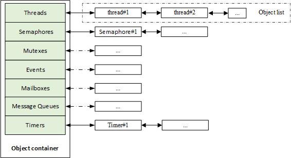

@page page_object_management Object Management

# Static and Dynamic Objects

The RT-Thread kernel is designed with object-oriented method. The system-level infrastructures are all kernel objects such as threads, semaphores, mutexes, timers, and more. Kernel objects fall into two categories: static kernel objects and dynamic kernel objects. Static kernel objects are usually placed in RW and ZI segments, initialized in the program after system startup; dynamic kernel objects are created from the memory heap and then manually initialized.

The following code is an example of static threads and dynamic threads:


```c
/* Thread 1 object and stack used while running */
static struct rt_thread thread1;
static rt_uint8_t thread1_stack[512];

/* Thread 1 entry */
void thread1_entry(void* parameter)
{
     int i;

    while (1)
    {
	for (i = 0; i < 10; i ++)
	{
	    rt_kprintf("%d\n", i);

	    /* Delay 100ms */
	    rt_thread_mdelay(100);
	}
    }
}

/* Thread 2 entry */
void thread2_entry(void* parameter)
{
     int count = 0;
     while (1)
     {
	 rt_kprintf("Thread2 count:%d\n", ++count);

	/* Delay 50ms */
	rt_thread_mdelay(50);
    }
}

/* Thread routine initialization */
int thread_sample_init()
{
     rt_thread_t thread2_ptr;
     rt_err_t result;

    /* Initialize thread 1 */
    /* The thread entry is thread1_entry and the parameter is RT_NULL
     * Thread stack is thread1_stack
     * Priority is 200 and time slice is 10 OS Tick
     */
    result = rt_thread_init(&thread1,
			    "thread1",
			    thread1_entry, RT_NULL,
			    &thread1_stack[0], sizeof(thread1_stack),
			    200, 10);

    /* Start thread */
    if (result == RT_EOK) rt_thread_startup(&thread1);

    /* Create thread 2 */
    /* The thread entry is thread2_entry and the parameter is RT_NULL
     *  Stack space is 512, priority is 250, and time slice is 25 OS Tick
     */
    thread2_ptr = rt_thread_create("thread2",
				thread2_entry, RT_NULL,
				512, 250, 25);

    /* Start thread */
    if (thread2_ptr != RT_NULL) rt_thread_startup(thread2_ptr);

    return 0;
}
```

In this example, `thread1` is a static thread object and `thread2` is a dynamic thread object. The memory space of the `thread1` object, including the thread control block `thread1` and the stack space `thread1_stack` are all determined while compiling, because there is no initial value in the code and they are uniformly placed in the uninitialized data segment. The space used by `thread2` is dynamically allocated includes the thread control block (the content pointed to by `thread2_ptr`) and the stack space.

Static objects take up RAM space and is not depend on the memory heap manager. When allocating static objects, the time needed is determined. Dynamic objects depend on the memory heap manager. It requests RAM space while running. When the object is deleted, the occupied RAM space is released. These two methods have their own advantages and disadvantages, and can be selected according to actual needs.

# Object Management Structure

RT-Thread uses the kernel object management system to access/manage all kernel objects. Kernel objects contain most of the facilities in the kernel. These kernel objects can be statically allocated static objects and dynamic objects allocated from the system memory heap. .

Because of this design for kernel object, RT-Thread is able to not depend on the specific memory allocation method, and the flexibility of the system is greatly improved.

RT-Thread kernel objects include: threads, semaphores, mutexes, events, mailboxes, message queues and timers, memory pools, device drivers, and more. The object container contains information about each type of kernel object, including object type, size, and so on. The object container assigns a linked list to each type of kernel object. All kernel objects are linked to the linked list. The kernel object container and linked list of RT-Thread are shown in the following figure:



The following figure shows the derivation and inheritance relationships of various kernel objects in RT-Thread. For each specific kernel object and object control block, in addition to the basic structure, they have  their own extended attributes (private attributes). Take thread control block for an example, the base object is extended, attributes like thread state, precedence and so on are added. These attributes are not used in the operation of the base class object and are only used in operations related to a specific thread. Therefore, from the object-oriented point of view, each concrete object can be considered as a derivative of an abstract object, inheriting the attributes of the base object and extending the attributes related to itself.


In the object management module, a common data structure is defined to store the common attributes of various objects. Each specific object only needs to add some special attributes of its own and its own feature will be clearly expressed.

The advantages of this design approach are:

(1) Improve the reusability and scalability of the system. It is easy to add new object categories. It only needs to inherit the attributes of the general object and add a small amount of extension.

(2) Provide a unified object operation mode, simplify the operation of various specific objects, and improve the reliability of the system.

Derivations from object control block rt_object in the above figure includes: thread object, memory pool object, timer object, device object and IPC object (IPC: Inter-Process Communication. In RT-Thread real-time operating system, IPC objects is used for synchronization and communicate between threads); derivations from IPC objects includes: semaphores, mutexes, events, mailboxes, message queues, signals, etc.

# Object Control Block

A simple code example snippet for data structure of kernel object control block:

```c
struct rt_object
{
     /* Kernel object name     */
     char      name[RT_NAME_MAX];
     /* Kernel object type     */
     rt_uint8_t  type;
     /* Parameters to the kernel object   */
     rt_uint8_t  flag;
     /* Kernel object management linked list */
     rt_list_t   list;
};
```

More details about this structure, see `struct rt_object`.

Regarding types currently supported by kernel objects, see:

```c
enum rt_object_class_type
```

From the above type specification, we can see that if it is a static object, the highest bit of the object type will be 1 (which is the OR operation of `RT_Object_Class_Static` and other object types and operations).  Otherwise it will be dynamic object, and the maximum number of object classes that the system can accommodate is 127.

# Object Management APIs

Data structure of kernel object container:

```c
struct rt_object_information
{
     /* Object type */
     enum rt_object_class_type type;
     /* Object linked list */
     rt_list_t object_list;
     /* Object size */
     rt_size_t object_size;
};
```

A class of objects is managed by an `rt_object_information` structure, and each practical instance of such type of object is mounted to the `object_list` in the form of a linked list. The memory block size of this type of object is identified by `object_size` (the memory block each practical instance of each type of object is the same size).

## Initialization Object

An uninitialized static object must be initialized before it can be used. The initialization object uses the following interfaces:

```c
void rt_object_init(struct  rt_object*  object ,
		    enum rt_object_class_type  type ,
		    const char* name)
```

When this function is called to initialize the object, the system will place the object into the object container for management, that is, initialize some parameters of the object, and then insert the object node into the object linked list of the object container.

More details about this function, see `rt_object_init()`.

## Detach Object

Detach an object from the kernel object manager. The following interfaces are used to detach objects:

```c
void rt_object_detach(rt_object_t object);
```

Calling this interface makes a static kernel object to be detached from the kernel object container, meaning the corresponding object node is deleted from the kernel object container linked list. After the object is detached, the memory occupied by the object will not be released.

More details about this function, see `rt_object_detach()`.

## Allocate object

The above descriptions are interfaces of objects initialization and detachment, both of which are under circumstances that object-oriented memory blocks already exist. But dynamic objects can be requested when needed. The memory space is freed for other applications when not needed. To request assigning new objects, you can use the following interfaces:

```c
rt_object_t rt_object_allocate(enum rt_object_class_type type, const char* name)
```

When calling the above interface, the system first needs to obtain object information according to the object type (especially the size information of the object type for the system to allocate the correct size of the memory data block), and then allocate memory space corresponding to the size of the object from the memory heap. Next, to start necessary initialization for the object, and finally insert it into the object container linked list in which it is located.

More details about this function, see `rt_object_allocate()`.

## Delete Object

For a dynamic object, when it is no longer used, you can call the following interface to delete the object and release the corresponding system resources:

```c
void rt_object_delete(rt_object_t object);
```

When the above interface is called, the object is first detached from the object container linked list, and then the memory occupied by the object is released.

More details about this function, see `rt_object_delete()`.

## Identify objects

Identify whether the specified object is a system object (static kernel object). The following interface is used to identify the object:

```c
rt_err_t rt_object_is_systemobject(rt_object_t object);
```

Calling the `rt_object_is_systemobject` interface can help to identify whether an object is a system object. In RT-Thread operating system, a system object is also a static object, `RT_Object_Class_Static` bit is set to 1 on the object type identifier. Usually, objects that are initialized using the `rt_object_init()` method are system objects. 

More details about this function, see `rt_object_is_systemobject()`.