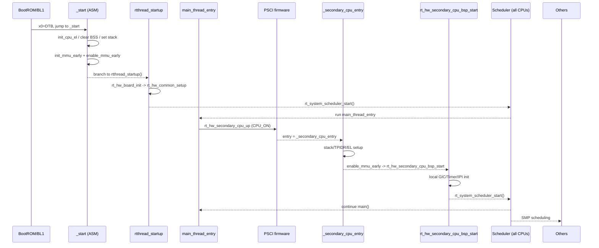

@page page_kernel_smp_boot QEMU virt64 AArch64 SMP Boot Flow

# QEMU virt64 AArch64 SMP Boot Flow

This guide walks through the multi-core boot path of RT-Thread on AArch64 using `bsp/qemu-virt64-aarch64` as the concrete reference. It is written to be beginner-friendly and mirrors the current BSP implementation: from `_start` assembly, early MMU bring-up, `rtthread_startup()`, PSCI wakeup of secondary cores, to all CPUs entering the scheduler. The original PlantUML diagram is replaced by Mermaid so it renders directly on GitHub.

- Target setup: QEMU `-machine virt`, `-cpu cortex-a57`, `-smp >=2`, `RT_USING_SMP` enabled, device tree contains `enable-method = "psci"`.
- Goal: Know who does what, where the code lives, and what to check when SMP does not come up.

## Big Picture First

```mermaid
flowchart TD
    ROM[BootROM/BL1<br/>QEMU firmware] --> START["_start<br/>(entry_point.S)"]
    START --> MMU["init_mmu_early<br/>enable_mmu_early"]
    MMU --> CBOOT[rtthread_startup()]
    CBOOT --> BOARD["rt_hw_board_init<br/>-> rt_hw_common_setup"]
    BOARD --> MAIN[main_thread_entry]
    MAIN --> PSCI["rt_hw_secondary_cpu_up<br/>(PSCI CPU_ON)"]
    PSCI --> SECASM["_secondary_cpu_entry<br/>(ASM)"]
    SECASM --> SECC[rt_hw_secondary_cpu_bsp_start]
    SECC --> SCHED[rt_system_scheduler_start]
    SCHED --> RUN[SMP scheduling]
```

## Boot CPU: from `_start` to MMU on

**Input registers**: QEMU firmware loads the image and jumps to `_start` at `libcpu/aarch64/cortex-a/entry_point.S`, passing the DTB physical address in `x0` (with `x1~x3` reserved).

**What `_start` does (short version)**

1. Clear thread pointers: zero `tpidr_el1/tpidrro_el0` to avoid stale per-cpu state.
2. Unify exception level: `init_cpu_el` drops to EL1h, enables timer access, masks unwanted traps.
3. Clear BSS: `init_kernel_bss` fills `__bss` with zeros so globals start clean.
4. Prepare stack: `init_cpu_stack_early` switches to SP_EL1 and uses `.boot_cpu_stack_top` as the early stack.
5. Remember the FDT: `rt_hw_fdt_install_early(x0)` stores DTB address/size before MMU is enabled.
6. Early MMU mapping: `init_mmu_early`/`enable_mmu_early` build a 0~1G identity map, set TTBR0/TTBR1 and SCTLR_EL1, flush I/D cache and TLB, then branch to `rtthread_startup()` (address in x8).

> Tip: the early page table only covers minimal kernel space; the C phase will remap a fuller layout.

## C-side startup backbone

`rtthread_startup()` (in `src/components.c`) is the spine of the sequence:

- **Interrupts off + spinlock ready**: `rt_hw_local_irq_disable()` followed by `_cpus_lock` init to keep early steps non-preemptible.
- **Board init**: `rt_hw_board_init()` directly calls the BSP hook `rt_hw_common_setup()` (`libcpu/aarch64/common/setup.c`) to:
  - set VBAR, build kernel address space, copy DTB to a safe region and pre-parse it;
  - configure MMU mappings; init memblock/page allocator/system heap;
  - parse DT for console, memory, initrd;
  - init GIC (and GICv3 Redistributor if enabled), UART, global GTIMER;
  - install SMP IPIs (`RT_SCHEDULE_IPI`, `RT_STOP_IPI`, `RT_SMP_CALL_IPI`) and unmask them;
  - set idle hook `rt_hw_idle_wfi` so idle CPUs enter low-power wait.
- **Kernel subsystems**: init system timer, scheduler, signals, and create main/timer/idle threads.
- **Start scheduling**: `rt_system_scheduler_start()` runs `main_thread_entry()` first.

## How secondary cores are brought up

`main_thread_entry()` calls `rt_hw_secondary_cpu_up()` before invoking user `main()`, so all CPUs join scheduling.

### What `rt_hw_secondary_cpu_up()` does

1. Convert `_secondary_cpu_entry` to a physical address via `rt_kmem_v2p()`—the real entry the firmware jumps to.
2. Walk CPU nodes recorded at boot (`cpu_info_init()` stored DTB info in `cpu_np[]` and `rt_cpu_mpidr_table[]`).
3. Read `enable-method`:
   - QEMU virt64: `"psci"` → use `cpu_psci_ops.cpu_boot()` to issue `CPU_ON(target, entry)` to firmware.
   - Legacy compatibility: `"spin-table"` → write `cpu-release-addr` and `sev` to wake.
4. Any failure prints a warning but does not halt the boot flow, making diagnosis easier.

### What happens on a secondary core

- **Assembly entry `_secondary_cpu_entry`**:
  - Read `mpidr_el1`, compare with `rt_cpu_mpidr_table` to find the logical CPU id, store it back, and write it into `TPIDR` for per-cpu access.
  - Allocate its own stack by offsetting `ARCH_SECONDARY_CPU_STACK_SIZE` per core.
  - Re-run `init_cpu_el`/`init_cpu_stack_early`, reuse the same early MMU path, then branch to `rt_hw_secondary_cpu_bsp_start()`.

- **C-side handoff `rt_hw_secondary_cpu_bsp_start()`** (`libcpu/aarch64/common/setup.c`):
  - Reset VBAR and synchronize with the boot CPU via `_cpus_lock`.
  - Update this core's MPIDR entry and bind the shared `MMUTable`.
  - Init local vector table, GIC CPU interface (and GICv3 Redistributor if present), enable the local GTIMER.
  - Unmask the three SMP IPIs; re-calibrate `loops_per_tick` for microsecond delay if needed.
  - Call `rt_dm_secondary_cpu_init()` to register the CPU device, then enter the scheduler via `rt_system_scheduler_start()`.

### Timeline (Mermaid)



## Source map (where to read the code)

| Stage | File | Role |
| --- | --- | --- |
| Boot assembly | `libcpu/aarch64/cortex-a/entry_point.S` | `_start`, `_secondary_cpu_entry`, early MMU enable |
| BSP hook | `bsp/qemu-virt64-aarch64/drivers/board.c` | Wires `rt_hw_board_init()` to `rt_hw_common_setup()` |
| Memory/GIC/IPI init | `libcpu/aarch64/common/setup.c` | `rt_hw_common_setup()`, `rt_hw_secondary_cpu_up()`, `rt_hw_secondary_cpu_bsp_start()` |
| C entry skeleton | `src/components.c` | `rtthread_startup()`, `main_thread_entry()` |

## Quick checks when SMP fails to come up

- Device tree: contains `enable-method = "psci"` and QEMU is started with `-machine virt` (PSCI firmware included).
- `_secondary_cpu_entry` physical address: `rt_kmem_v2p()` must not return 0, otherwise a check fails.
- Init order: GIC/Timer must be ready before calling `rt_hw_secondary_cpu_up()`; if you fork a custom BSP, do these first.
- UART logs: look for `Call cpu X on success/failed`; add extra prints in `_secondary_cpu_entry` if needed, and use QEMU `-d cpu_reset -smp N` to debug.

## AArch64 pocket notes (just enough)

- **Exception levels**: startup may be at EL3/EL2; `init_cpu_el` descends to EL1h where the kernel runs.
- **Two stack pointers**: `spsel #1` selects `SP_EL1` so user mode cannot touch the kernel stack.
- **MMU bring-up order**: build page tables → configure TCR/TTBR → flush cache/TLB → set `SCTLR_EL1.M/C/I` → `isb`.
- **MPIDR**: unique core affinity; stored in `rt_cpu_mpidr_table[]` to map logical CPU ids and IPI targets.

With these in place, the QEMU virt64 AArch64 BSP SMP path is clear: the boot CPU prepares memory and shared peripherals, `main_thread_entry()` issues PSCI wakeups, secondary cores land with the same MMU/EL setup, and all CPUs join the scheduler.
