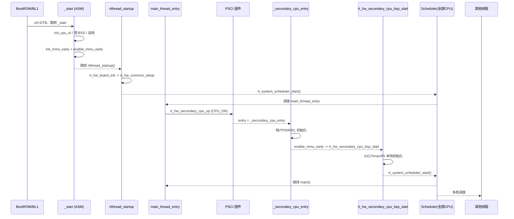

@page page_kernel_smp_boot_zh QEMU virt64 AArch64 多核启动流程（中文）

# QEMU virt64 AArch64 多核启动流程

本文以 `bsp/qemu-virt64-aarch64` 为例，对 RT-Thread 在 AArch64 平台上的多核启动做一份“初学者友好”的拆解，覆盖从 `_start` 汇编、MMU 打开、`rtthread_startup()`，到 PSCI 唤醒次级核并全部进入调度器的完整链路。全文基于当前 BSP 的真实实现，顺手补全一些容易忽略的细节，并把原有 PlantUML 图改成可在 GitHub 直接渲染的 Mermaid。

- 适用环境：QEMU `-machine virt`、`-cpu cortex-a57`、`-smp >=2`，`RT_USING_SMP` 已开启，设备树包含 `enable-method = "psci"`。
- 读完你将能：看懂每一步是谁做的、代码在哪、如果多核没起来要检查什么。

## 全局先看一眼

```mermaid
flowchart TD
    ROM[BootROM/BL1<br/>QEMU 固件] --> START["_start<br/>(entry_point.S)"]
    START --> MMU["init_mmu_early<br/>enable_mmu_early"]
    MMU --> CBOOT[rtthread_startup()]
    CBOOT --> BOARD["rt_hw_board_init<br/>-> rt_hw_common_setup"]
    BOARD --> MAIN[main_thread_entry]
    MAIN --> PSCI["rt_hw_secondary_cpu_up<br/>(PSCI CPU_ON)"]
    PSCI --> SECASM["_secondary_cpu_entry<br/>(ASM)"]
    SECASM --> SECC[rt_hw_secondary_cpu_bsp_start]
    SECC --> SCHED[rt_system_scheduler_start]
    SCHED --> RUN[多核调度运行态]
```

## Boot CPU：从 `_start` 到 MMU 打开

**输入参数**：QEMU 固件把镜像装入内存，跳到 `libcpu/aarch64/cortex-a/entry_point.S` 的 `_start`，同时 `x0` 带上 DTB 物理地址，`x1~x3` 预留。

**`_start` 做的事（精简版）**

1. 清理线程指针：`tpidr_el1/tpidrro_el0` 置零，避免继承旧状态。
2. 异常级统一：`init_cpu_el` 把 CPU 拉到 EL1h，打开计时器访问，关掉不必要的陷入。
3. BSS 清零：`init_kernel_bss` 循环写 0，保证全局变量干净。
4. 栈准备：`init_cpu_stack_early` 切换到 SP_EL1，并使用链接脚本里的 `.boot_cpu_stack_top` 作为启动栈。
5. 保存 FDT：`rt_hw_fdt_install_early(x0)` 在 MMU 开启前记录 DTB 起始地址和大小。
6. MMU 早期映射：`init_mmu_early`/`enable_mmu_early` 建立 0~1G 恒等映射，设置 TTBR0/TTBR1、SCTLR_EL1，清理 I/D Cache 与 TLB，完成后跳转到 `rtthread_startup()`（寄存器 x8）。

> 小贴士：早期页表只够最小内核布局，后面会在 C 里重新映射更完整的空间。

## 进入 C 语言后的启动骨架

`rtthread_startup()`（`src/components.c`）是整条链路的骨干，关键点如下：

- **禁中断 + 自旋锁**：先 `rt_hw_local_irq_disable()`，再初始化 `_cpus_lock`，避免启动阶段被抢占。
- **板级初始化**：`rt_hw_board_init()` 直接调用 BSP 的 `rt_hw_common_setup()`（`libcpu/aarch64/common/setup.c`），完成：
  - 设置 VBAR（异常向量）、建立内核地址空间、拷贝 DTB 到安全内存并预解析；
  - 配置 MMU 映射、初始化 memblock/页分配器/系统堆；
  - 解析设备树：控制台、内存、initrd；
  - 初始化 GIC（或 GICv3 Redistributor）、UART、全局 GTIMER；
  - 安装 SMP IPI：`RT_SCHEDULE_IPI`、`RT_STOP_IPI`、`RT_SMP_CALL_IPI` 并解除屏蔽；
  - 设置空闲钩子 `rt_hw_idle_wfi`，保证空闲时进入低功耗等待。
- **内核子系统**：初始化系统定时器、调度器、信号机制，创建 main/定时/空闲线程。
- **调度器启动**：`rt_system_scheduler_start()` 让 `main_thread_entry()` 首先运行。

## 次级核如何被拉起

`main_thread_entry()` 在调用用户 `main()` 前会执行 `rt_hw_secondary_cpu_up()`，确保所有 CPU 都进调度器。

### `rt_hw_secondary_cpu_up()` 做什么

1. 把 `_secondary_cpu_entry` 转成物理地址（`rt_kmem_v2p()`），这是固件要跳转的真实入口。
2. 遍历启动时记录的 CPU 节点（`cpu_info_init()` 已把 DTB 信息存进 `cpu_np[]` 和 `rt_cpu_mpidr_table[]`）。
3. 读取 `enable-method`：
   - QEMU virt64：`"psci"` → 走 `cpu_psci_ops.cpu_boot()`，向固件发 `CPU_ON(target, entry)`；
   - 兼容老平台：`"spin-table"` → 写 `cpu-release-addr`，再 `sev` 唤醒。
4. 任一核失败会打印 Warning，但主核流程不会被中断，便于后续排查。

### 发生在次级核的事

- **汇编入口 `_secondary_cpu_entry`**：
  - 读取 `mpidr_el1`，和 `rt_cpu_mpidr_table` 比对确认逻辑核号并写回表项，随后将逻辑核号写入 `TPIDR`，便于 per-cpu 访问。
  - 按 `ARCH_SECONDARY_CPU_STACK_SIZE` 为每个核分配独立栈。
  - 重复 `init_cpu_el`、`init_cpu_stack_early`，共用同一套早期 MMU 建表逻辑，最后跳到 `rt_hw_secondary_cpu_bsp_start()`。

- **C 侧收尾 `rt_hw_secondary_cpu_bsp_start()`**（`libcpu/aarch64/common/setup.c`）：
  - 重新设置 VBAR，并持有 `_cpus_lock` 与主核同步。
  - 更新本核的 MPIDR 表项，绑定全局 `MMUTable`。
  - 初始化本地向量表、GIC CPU 接口（和 GICv3 Redistributor，如果开启）、开启本地 GTIMER。
  - 解除三种 IPI 屏蔽，必要时重新校准 `loops_per_tick`（us 延时）。
  - 调用 `rt_dm_secondary_cpu_init()` 注册 CPU 设备，最后 `rt_system_scheduler_start()` 让该核进入调度。

### 时序图（Mermaid）



## 关键代码位置对照表

| 阶段 | 主要文件 | 作用 |
| --- | --- | --- |
| 启动汇编 | `libcpu/aarch64/cortex-a/entry_point.S` | `_start`、`_secondary_cpu_entry`、MMU 早期开启 |
| BSP 汇聚 | `bsp/qemu-virt64-aarch64/drivers/board.c` | 把 `rt_hw_board_init()` 对接到 `rt_hw_common_setup()` |
| 内存/GIC/IPI 初始化 | `libcpu/aarch64/common/setup.c` | `rt_hw_common_setup()`、`rt_hw_secondary_cpu_up()`、`rt_hw_secondary_cpu_bsp_start()` |
| C 入口骨架 | `src/components.c` | `rtthread_startup()`、`main_thread_entry()` |

## 常见检查项（多核没起来时）

- 设备树是否有 `enable-method = "psci"`，且 QEMU 启动带了 `-machine virt`（自带 PSCI 固件）。
- `_secondary_cpu_entry` 能否正确转成物理地址：`rt_kmem_v2p()` 返回 0 会触发断言。
- GIC/Timer 是否在主核初始化完成后才去唤核；若自定义 BSP，务必在调用 `rt_hw_secondary_cpu_up()` 前完成中断与定时器初始化。
- 观察串口日志中的 `Call cpu X on success/failed`，必要时在 `_secondary_cpu_entry` 里加额外打印，结合 `-d cpu_reset -smp N` 排查。

## AArch64 小抄（够用版）

- **异常级**：启动时可能在 EL3/EL2，`init_cpu_el` 会层层降到内核跑的 EL1h。
- **双栈指针**：`spsel #1` 选用 `SP_EL1`，保证内核栈不被 EL0 访问。
- **MMU 开启顺序**：写页表 → 配置 TCR/TTBR → 刷 Cache/TLB → 置位 `SCTLR_EL1.M/C/I` → `isb` 生效。
- **MPIDR**：多核唯一标识，`rt_cpu_mpidr_table[]` 保存 Boot CPU 和各次级核的 affinity，便于逻辑核编号和 IPI 目标匹配。

做到这里，QEMU virt64 AArch64 BSP 的多核启动主线基本就清楚了：Boot CPU 负责把内核和公共外设准备好，`main_thread_entry()` 发起 PSCI 唤核，次级核按同样的 MMU/EL 设置落地，再一起进入调度器。
