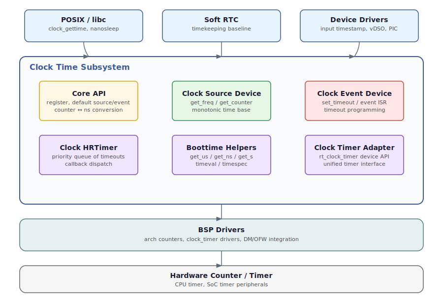

# Clock Time 子系统概述

clock_time 子系统为 RT-Thread 提供统一的高精度时间基准与事件调度能力。
它将单调计数（时钟源）与超时事件（时钟事件）解耦，使平台可以组合不同的
硬件计数器与定时器，同时为内核与 libc 提供一致的时间行为。

# 软件架构



## 分层关系与职责

- 上层：
  - POSIX/libc 时间接口（clock_gettime、nanosleep）使用 boottime 和 hrtimer API。
  - 软 RTC 使用 boottime 作为单调时间基准进行计时。
  - 设备驱动（输入事件时间戳、vDSO、中断控制器统计）使用 boottime 获取时间戳。
- clock_time 子系统：核心 API、时钟源/事件设备、高精度定时器调度器、
  boottime 辅助函数、clock_timer 适配层。
- 下层：BSP 驱动提供硬件计数器与定时器，并封装为 clock_time 设备或
  clock_timer 设备。

## 内部组成

- Core API（clock_time_core.c）
  - 负责设备注册、默认源/事件选择，以及计数 <-> 纳秒的缩放换算。
- 时钟源设备（rt_clock_time_device + RT_CLOCK_TIME_CAP_SOURCE）
  - 提供自由运行计数器与频率，作为单调时间基准。
- 时钟事件设备（rt_clock_time_device + RT_CLOCK_TIME_CAP_EVENT）
  - 负责下一次超时编程，并在到期时调用 rt_clock_time_event_isr()。
- 高精度定时器（clock_hrtimer.c）
  - 维护超时队列、设置下一次事件并分发回调。没有硬件事件时退化为软件定时器。
- Boottime 辅助（clock_boottime.c）
  - 将单调计数转换为 timeval/timespec/秒，供上层使用。
- Clock timer 适配层（clock_timer.c）
  - 提供统一的硬件定时器设备（rt_clock_timer），并可注册为事件设备。
- 架构源（arch/* 与 clock_time_arm_arch.c）
  - 提供 CPU 计数器或架构定时器，并在可用时设置为默认时钟源。

## 数据流

- 读取路径
  - 时钟源计数 -> 缩放分辨率 -> 纳秒 -> boottime 或 clock_gettime。
- 超时路径
  - hrtimer 队列 -> 下一到期 -> 事件设备 set_timeout -> 事件中断 ->
    hrtimer 处理 -> 回调分发。

# 配置选项

在 menuconfig 中启用：

```
RT-Thread Components ->
    Device Drivers ->
        [*] Clock time subsystem (RT_USING_CLOCK_TIME)
```

可选配置：

- CLOCK_TIMER_FREQ（RISC-V）：时钟源使用的基础计数频率。
- RT_CLOCK_TIME_ARM_ARCH：启用 ARM 架构定时器集成（DM/OFW）。

# BSP 集成要点

- 提供时钟源：
  - 注册带 CAP_SOURCE 的 rt_clock_time_device，或使用
    rt_clock_time_source_init() 提供的架构源。
- 提供时钟事件：
  - 注册带 CAP_EVENT 的 rt_clock_time_device，并在中断中调用
    rt_clock_time_event_isr()。
  - 或直接注册 rt_clock_timer 设备，自动成为默认事件设备。
- 事件中断应保持简短，复杂处理建议转到线程上下文。

# 详细文档

- clock_time_core.md
- clock_hrtimer.md
- clock_boottime.md
- clock_timer.md
