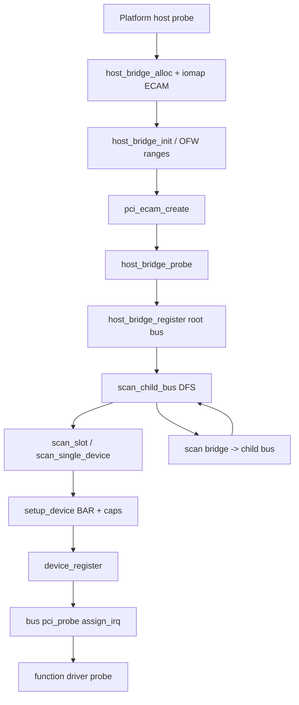

@page page_device_pci_probe PCI enumeration and drivers

# Enumeration and device setup (`probe.c`, `pci.c`)

End-to-end **host bring-up → bus scan → BAR assignment → driver probe**. Sources: **`probe.c`** (scan/host), **`pci.c`** (regions, register, bus), **`ofw.c`** (DT windows).

---

## Full initialization flow

### Phase A — Host controller (platform driver)

Typical ECAM host (**`pci_host_common_probe`** in `host/pci-host-common.c`):

```
  platform probe (e.g. pci-host-ecam-generic)
       |
       v
  rt_pci_host_bridge_alloc()
       |
       v
  rt_dm_dev_iomap(dev, 0)          /* ECAM config window */
       |
       v
  rt_pci_host_bridge_init()
       +-- rt_pci_ofw_host_bridge_init()   [RT_USING_OFW]
       |       bus-range, pci-domain
       |       rt_pci_ofw_parse_ranges() -> bus_regions[], dma_regions[]
       |       rt_pci_region_setup()       /* allocator pools ready */
       |       irq_slot = rt_pci_irq_slot
       |       irq_map  = rt_pci_ofw_irq_parse_and_map
       |
       v
  pci_ecam_create(host, ops)       /* host_bridge->ops = ECAM read/write */
  conf_win->win = ECAM base
       |
       v
  rt_pci_host_bridge_probe()       /* starts enumeration — Phase B */
```

DesignWare and other hosts follow the same pattern after link/DBI setup (@ref page_device_pci_host).

### Phase B — Root bus and enumeration

**`rt_pci_host_bridge_probe`** → **`rt_pci_scan_root_bus_bridge`**:

```
  rt_pci_host_bridge_register(host)
       |  pci_alloc_bus(NULL) -> root_bus
       |  root_bus->number = bus_range[0]
       |  root_bus->ops = host_bridge->ops
       |
       v
  rt_pci_scan_child_bus(root_bus)
       |
       v
  rt_pci_scan_child_buses(bus, buses=0)
       |
       +-- for slot 0..30 (step 8 devfn):
       |       rt_pci_scan_slot(bus, devfn)
       |           for func 0..7 (ARI / multifunction):
       |               rt_pci_scan_single_device()   /* Phase C */
       |
       +-- for each bridge on bus (rt_pci_foreach_bridge):
               pci_scan_bridge_extend()
                   pcie_fixup_link() [if PCIe cap]
                   pci_alloc_bus(parent) -> child bus
                   pci_child_bus_init(bus_no, bridge pdev)
                   program PCIR_PRIBUS_1 (primary/secondary/subordinate)
                   rt_pci_scan_child_buses(child, ...)   /* recurse */
                   update subordinate bus number
```

**Depth-first**: all devices on bus N are scanned, then each bridge opens bus N+1 and recurses.

### Phase C — Single function (`rt_pci_scan_single_device`)

```
  read config PCIR_VENDOR / PCIR_DEVICE
       |  (0xffff / 0x0000 -> empty slot, skip)
       v
  rt_pci_alloc_device(bus)         /* link into bus->devices_nodes */
       |
       v
  rt_pci_setup_device(pdev)        /* Phase D — must succeed */
       |
       v
  pci_procfs_attach(pdev)          [optional debug]
       |
       v
  rt_pci_device_register(pdev)
       -> rt_bus_add_device(pci_bus, &pdev->parent)
       -> pci bus match + pci_probe()   /* Phase E */
```

If **`rt_pci_setup_device`** fails, the **`rt_pci_device`** is freed and the slot is skipped.

### Phase D — Per-device setup (`rt_pci_setup_device`)

Order inside **`probe.c`** / **`pci.c`**:

| Step | Action |
| --- | --- |
| 1 | **`rt_pci_ofw_device_init`** — bind OFW node if any |
| 2 | Read **class**, **hdr_type**, clear **STATUS** errors |
| 3 | **`pci_read_irq`** — read **INTPIN** / **INTLINE** from config only (not mapped yet) |
| 4 | **`rt_pci_device_alloc_resource`** — size BARs, **`rt_pci_region_alloc`**, write BAR registers, enable bridge windows |
| 5 | **`pci_init_capabilities`** — **`rt_pci_pme_init`**, **`rt_pci_msi_init`/`msix_init`** (disabled), PCIe cap, **cfg_size**, ARI |

Device name set to **`domain:bus:slot.func`**.

### Phase E — Bus driver probe (`pci.c`)

When **`rt_pci_device_register`** adds the device to the PCI bus:

```
  pci_match(pdrv, pdev)            /* vendor/device or class table */
       |
       v
  pci_probe(dev)
       +-- rt_pci_assign_irq(pdev)       /* host irq_map or OFW INTx */
       +-- rt_pci_enable_wake(pdev, D0)
       +-- pdrv->probe(pdev)             /* NVMe, NIC, ... */
```

**Important**: function driver **`probe`** runs **after** BARs are assigned and **after** **`rt_pci_assign_irq`**. Use **`rt_pci_iomap`** / **`rt_pci_alloc_vector`** here, not during scan.

### IRQ timing summary

| When | What |
| --- | --- |
| **`rt_pci_setup_device`** | **`pci_read_irq`** — raw config pin/line |
| **`pci_probe` (bus)** | **`rt_pci_assign_irq`** — **`irq_map`** / OFW → **`pdev->irq`**, **`intx_pic`** |
| Function **`pdrv->probe`** | MSI/MSI-X enable, **`rt_pic_*`** register |

---

## Flow diagram



---

## Host bridge lifecycle (API)

| API | Role |
| --- | --- |
| **`rt_pci_host_bridge_alloc(priv_size)`** | Allocate host bridge + private tail |
| **`rt_pci_host_bridge_init`** | OFW: **`rt_pci_ofw_host_bridge_init`** |
| **`rt_pci_host_bridge_probe`** | **`rt_pci_scan_root_bus_bridge`** |
| **`rt_pci_host_bridge_register`** | Create root **`rt_pci_bus`** |
| **`rt_pci_host_bridge_remove`** | Enum remove all devices |

---

## Scan API

| API | Role |
| --- | --- |
| **`rt_pci_scan_child_bus(bus)`** | Entry: scan one bus + bridges |
| **`rt_pci_scan_child_buses`** | Slots 0–30, then bridge extend |
| **`rt_pci_scan_slot`** | All functions on one devfn (MF/ARI) |
| **`rt_pci_scan_single_device`** | One function if vendor valid |
| **`rt_pci_scan_bridge`** | Bridge secondary bus setup |
| **`rt_pci_alloc_device`** | Allocate **`rt_pci_device`**, link to bus |

Bridges: **`pdev->subbus`** after **`pci_scan_bridge_extend`**. Endpoints: **`subbus == NULL`**.

---

## `rt_pci_setup_device` detail

See **Phase D** above. Invalid header/class → error, device discarded.

---

## Resources (`pci.c`)

| API | Role |
| --- | --- |
| **`rt_pci_region_setup`** | After OFW **`ranges`**: log pools, **`bus_start` ≥ 0x1000** |
| **`rt_pci_region_alloc`** | Carve BAR/bus address from **`bus_regions`** |
| **`rt_pci_device_alloc_resource`** | Probe BAR sizes, assign, write config |
| **`rt_pci_find_bar`** | Lookup assigned BAR by flags/index |

---

## Driver model

```c
static const struct rt_pci_device_id my_ids[] = {
    { RT_PCI_DEVICE_ID(0x1234, 0xabcd) },
    { RT_PCI_DEVICE_CLASS(0x01080200, 0xffffff00) },
    { /* sentinel */ },
};

static struct rt_pci_driver my_driver = {
    .name = "my_pci",
    .ids = my_ids,
    .probe = my_probe,
    .remove = my_remove,
};
RT_PCI_DRIVER_EXPORT(my_driver);
```

| API | Role |
| --- | --- |
| **`rt_pci_match_ids`** | Match during **`pci_match`** |
| **`rt_pci_driver_register`** | Register on PCI bus (export macro at init) |
| **`rt_pci_device_register`** | After scan — triggers bus **`probe`** |
| **`rt_pci_enum_device`** | Walk tree callback |

---

## Helpers

| API | Role |
| --- | --- |
| **`rt_pci_domain`**, **`rt_pci_find_host_bridge`** | Domain / host lookup |
| **`rt_pci_is_bridge`**, **`rt_pci_is_pcie`** | Type checks |
| **`rt_pci_find_capability`** | Capability walk |

---

## Pitfalls

| Issue | Mitigation |
| --- | --- |
| MMIO in scan before **`device_register`** | Wait for function **`probe`** |
| BARs empty | Fix DT **`ranges`** + **`rt_pci_region_setup`** |
| **`irq == 0`** after probe | Check **`interrupt-map`** / use MSI |
| Bridge bus exhausted | **`bus-range`** too small in DTS |
| Scan order vs driver | **`RT_PCI_DRIVER_EXPORT`** drivers already registered before host probe |

## See also

- @ref page_device_pci
- @ref page_device_pci_host
- @ref page_device_pci_access
- @ref page_device_pci_ofw
- @ref page_device_pci_irq
