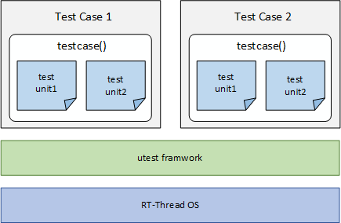

@page page_component_utest utest Framework

# utest Introduction

utest (unit test) is a unit testing framework developed by RT-Thread. The original intention of designing utest is to make it easier for RT-Thread developers to write test programs using a unified framework interface for unit testing, coverage testing, and integration testing.

## Test Case Definition

A test case (tc) is a single test performed to achieve a specific test objective. It is a specification that includes test input, execution conditions, test procedures, and expected results. It is a infinite loop with clear end conditions and test results.

The utest (unit test) framework defines user-written test programs as **test cases**, and a test case contains only one *testcase* function (similar to the main function), which can contain multiple *test unit* functions.

The test code for a function, specifically through the API provided by the utest framework, is a test case.

## Test Unit Definition

The test unit is a test point subdivided by the function to be tested. Each test point can be the smallest measurable unit of the function to be tested. Of course, different classification methods will subdivide different test units.

## utest Application Block Diagram



As shown in the figure above, the test case is designed based on the service interface provided by the test framework utest, which supports compiling multiple test cases together for testing. In addition, as you can see from the figure, a test case corresponds to a unique *testcase* function, and multiple test units are included in *testcase*.

# utest API

To enable uniform test case code, the test framework utest provides a common API interface for test case writing.

## Macros of assertion

> NOTE:
> Here assert only records the number of passes and failures, it does not generate assertions or terminates program execution. Its function is not equivalent to RT_ASSERT.


| assert Macro | Description |
| :------   | :------ |
| uassert_true(value)    | If the value is true then the test passes, otherwise the test fails. |
| uassert_false(value)   | If the value is false then the test passes, otherwise the test fails. |
| uassert_null(value)    | If the Value is null then the test passes, otherwise the test fails |
| uassert_not_null(value)| If the value is a non-null value, the test passes, otherwise the test fails. |
| uassert_int_equal(a, b)| If the values of a and b are equal, the test passes, otherwise the test fails. |
| uassert_int_not_equal(a, b)| If the values of a and b are not equal, the test passes, otherwise the test fails. |
| uassert_str_equal(a, b)    | If the string a and the string b are the same, the test passes, otherwise the test fails. |
| uassert_str_not_equal(a, b)| If the string a and the string b are not the same, the test passes, otherwise the test fails. |
| uassert_in_range(value, min, max)    | If the value is in the range of min and max, the test passes, otherwise the test fails. |
| uassert_not_in_range(value, min, max)| If the value is not in the range of min and max, the test passes, otherwise the test fails. |

## Macros for Running Test Units

```c
UTEST_UNIT_RUN(test_unit_func)
```

In the test case, the specified test unit function `test_unit_func` is executed using the `UTEST_UNIT_RUN` macro. The test unit must be executed using the `UTEST_UNIT_RUN` macro.

## Macros for Exporting Test Cases

```c
UTEST_TC_EXPORT(testcase, name, init, cleanup, timeout)
```

| Parameters | Description |
| :-----   | :------ |
| testcase | Test case main-bearing function (**specifies** using a function called *static void testcase(void)* |
| name     | Test case name (uniqueness). Detailed requirements see below **Test case naming requirements:** |
| init     | the initialization function before Test case startup |
| cleanup  | Cleanup function after the end of the test case |
| timeout  | Test case expected test time (in seconds) |

**Test case naming requirements:**

To ensure unique unit-testcase names throughout the RT-Thread source code repository, the full name consists of two parts:

**Module-Prefix.Test-Function**

- **Module-Prefix**: Use the path of the *module's utest directory* relative to the source code repository root (excluding utest), connected by a dot ("."). For more information on *module's utest directory*, see section **How-to add utest cases into RT-Thread for your module**.

- **Test-Function**: Define your own name, ensuring it's unique within the same **Module-Prefix** (it doesn't have to match the test case file name).

**Test case naming example:**

Assuming that there is a *module's utest directory*: `components/dfs/utest`, which contains utest source files for module "DFS". We can define the testcase in file `components/dfs/utest/tc_dfs_api.c` as below:

```c
static void testcase(void)
{
    /* Skip filesystem mount test for now due to mutex issues */
    UTEST_UNIT_RUN(test_mkfs);
    // ......
}

UTEST_TC_EXPORT(testcase, "components.dfs.fs_dfs_api_tc", utest_tc_init, utest_tc_cleanup, 10);
```

Here, the global unique unit-testcase name is "components.dfs.fs_dfs_api_tc". Of this name, **Module-Prefix** is "components.dfs", which corresponds to the path name `components/dfs`; **Test-Function** is `fs_dfs_api_tc`, which uniquely identifies a suite of cases which will be run in the function `testcase()`, and note that the `fs_dfs_api_tc` need not be the same as the file name of `tc_dfs_api.c`.

Particularly, for modules in the `src` directory, since the name `src` is ambiguous, it is recommended to replace it with `core` to contrast it with `components`. This indicates that the code in `src` is the kernel's *core* code module relative to `components`.

For example: The utest case in `src/klibc/utest/TC_rt_memcmp.c` can be written as:

```c
UTEST_TC_EXPORT(utest_do_tc, "core.klibc.rt_memcmp", RT_NULL, RT_NULL, 1000);
```

## Test Case LOG Output Interface

The utest framework relies on the *ulog log module* for log output and the log output level in the utest framework. So just add `#include "utest.h"` to the test case to use all level interfaces (LOG_D/LOG_I/LOG_E) of the ulog log module.

In addition, the utest framework adds an additional log control interface as follows:

```c
#define UTEST_LOG_ALL    (1u)
#define UTEST_LOG_ASSERT (2u)

void utest_log_lv_set(rt_uint8_t lv);
```

Users can use the `utest_log_lv_set` interface to control the log output level in test cases. The `UTEST_LOG_ALL` configuration outputs all logs, and the `UTEST_LOG_ASSERT` configuration only outputs logs after the failure of uassert.

# Configuration Enable

Using the utest framework requires the following configuration in the ENV tool using menuconfig:

```c
RT-Thread Kernel  --->
    Kernel Device Object  --->
        (256) the buffer size for console log printf /* The minimum buffer required by the utest log */
RT-Thread Components  --->
    Utilities  --->
        -*- Enable utest (RT-Thread test framework) /* Enable utest framework */
        (4096) The utest thread stack size          /* Set the utest thread stack (required for -thread mode) */
        (20)   The utest thread priority            /* Set utest thread priority (required for -thread mode) */
```

# Application Paradigm

The utest framework and related APIs were introduced earlier. The basic test case code structure is described here.

The code blocks necessary for the test case file are as follows:

```c
/*
 * Copyright (c) 2006-2019, RT-Thread Development Team
 *
 * SPDX-License-Identifier: Apache-2.0
 *
 * Change Logs:
 * Date           Author       Notes
 * 2019-01-16     MurphyZhao   the first version
 */

#include <rtthread.h>
#include "utest.h"

static void test_xxx(void)
{
    uassert_true(1);
}

static rt_err_t utest_tc_init(void)
{
    return RT_EOK;
}

static rt_err_t utest_tc_cleanup(void)
{
    return RT_EOK;
}

static void testcase(void)
{
    UTEST_UNIT_RUN(test_xxx);
}
UTEST_TC_EXPORT(testcase, "components.utilities.utest.sample.sample_tc", utest_tc_init, utest_tc_cleanup, 10);
```

A basic test case must contain the following:

- File comment header (Copyright)

    The test case file must contain a file comment header containing `Copyright`, time, author, and description information.

- utest_tc_init(void)

    The initialization function before the test run is generally used to initialize the environment required for the test.

- utest_tc_cleanup(void)

    The cleanup function after the test is used to clean up the resources (such as memory, threads, semaphores, etc.) applied during the test.

- testcase(void)

    The mainly function of testcase, a test case implementation can only contain one testcase function (similar to the main function). Usually this function is only used to run the test unit execution function `UTEST_UNIT_RUN`.

    A testcase can contain multiple test units, each of which is executed by `UTEST_UNIT_RUN`.

- UTEST_UNIT_RUN

    Test unit execution function.

- test_xxx(void)

    Test implementation of each functional unit. The user determines the function name and function implementation based on the requirements.

- uassert_true

    The assertion macro used to determine the test result (this assertion macro does not terminate the program run). Test cases must use the `uassert_xxx` macro to determine the test results, otherwise the test framework does not know if the test passed.

    After all the `uassert_xxx` macros have been passed, the entire test case is passed.

- UTEST_TC_EXPORT

    Export the test case testcase function to the test framework.

# Requirements for running test cases

The test framework utest exports all test cases to the `UtestTcTab` code segment. The `UtestTcTab` section is not required to be defined in the link script in the IAR and MDK compilers, but it needs to be explicitly set in the link script when GCC is compiled.

Therefore, in order for test cases to be compiled and run under GCC, the `UtestTcTab` code segment must be defined in the *link script* of GCC.

In the `.text` of the GCC link script, add the definition of the `UtestTcTab` section in the following format:

```c
/* section information for utest */
. = ALIGN(4);
__rt_utest_tc_tab_start = .;
KEEP(*(UtestTcTab))
__rt_utest_tc_tab_end = .;
```

# Running Test Cases

The test framework provides the following commands to make it easy for users to run test cases on the RT-Thread MSH command line. The commands are as follows:

***utest_list* command**

Lists the test cases supported by the current system, including the name of the test case and the time required for the test. This command has no parameters.

***utest_run* command**

Test case execution command, the format of the command is as follows:

```c
utest_run [-thread or -help] [testcase name] [loop num]
```

| utest_run Command Parameters | Description |
| :----   | :----- |
| -thread | Run the test framework in threaded mode |
| -help    | Print help information |
| testcase name | Specify the test case name. Using the wildcard `*` is supported, specifying front byte of the test case name is supported. |
| loop num | the number of iterations of test cases |

**Example of test command usage:**

```c
msh />utest_list
[14875] I/utest: Commands list :
[14879] I/utest: [testcase name]:components.filesystem.dfs.dfs_api_tc; [run timeout]:30
[14889] I/utest: [testcase name]:components.filesystem.posix.posix_api_tc; [run timeout]:30
[14899] I/utest: [testcase name]:packages.iot.netutils.iperf.iperf_tc; [run timeout]:30
msh />
msh />utest_run components.filesystem.dfs.dfs_api_tc
[83706] I/utest: [==========] [ utest    ] started
[83712] I/utest: [----------] [ testcase ] (components.filesystem.dfs.dfs_api_tc) started
[83721] I/testcase: in testcase func...
[84615] D/utest: [    OK    ] [ unit     ] (test_mkfs:26) is passed
[84624] D/testcase: dfs mount rst: 0
[84628] D/utest: [    OK    ] [ unit     ] (test_dfs_mount:35) is passed
[84639] D/utest: [    OK    ] [ unit     ] (test_dfs_open:40) is passed
[84762] D/utest: [    OK    ] [ unit     ] (test_dfs_write:74) is passed
[84770] D/utest: [    OK    ] [ unit     ] (test_dfs_read:113) is passed
[85116] D/utest: [    OK    ] [ unit     ] (test_dfs_close:118) is passed
[85123] I/utest: [  PASSED  ] [ result   ] testcase (components.filesystem.dfs.dfs_api_tc)
[85133] I/utest: [----------] [ testcase ] (components.filesystem.dfs.dfs_api_tc) finished
[85143] I/utest: [==========] [ utest    ] finished
msh />
```

## Test result analysis


As shown in the figure above, the log of the test case run is divided into four columns from left to right, which are `(1) log header information`, `(2) result bar`, `(3) property bar`, and `(4) detail information display bar`. The test case test result (PASSED or FAILED) is identified in the log using the `result` attribute.

# Test Case Run Process


From the above flow chart you can get the following:

* The utest framework is a sequential execution of all **test units** in the *testcase* function
* Assert of the previous UTEST_UNIT_RUN macro has occurred, and all subsequent UTEST_UNIT_RUN will skip executio

## utest_run auto-completion Function

The utest_run tool now supports dynamic auto-completion for test case names. After entering the utest_run command in the terminal, users can press the TAB key to activate the auto-completion feature. The system will then dynamically match and suggest available test case names in real time.


# NOTE

- Determine whether the link script has the `UtestTcTab` section added before compiling with GCC.
- Make sure `RT-Thread Kernel -> Kernel Device Object -> (256) the buffer size for console log printf` is at least 256 bytes before compiling.
- The resources (threads, semaphores, timers, memory, etc.) created in the test case need to be released before the test ends.
- A test case implementation can only export a test body function (testcase function) using `UTEST_TC_EXPORT`
- Write a `README.md` document for the your test case to guide the user through configuring the test environment.

# How-to add utest cases into RT-Thread for your module

The source code of utest cases is recommended to be placed in each module for maintenance, but the entry of Kconfig should all be placed(rsourced) in `Kconfig.utestcases` for unified maintenance. In this way, when executing menuconfig, people can enter and configure from one place, avoiding searching for utest configuration switches scattering in the menuconfig interface.
    
For each module, you can maintain unit testcases in a unified manner in the following way:

- Create a subdirectory named 'utest' in the directory where your module is located.

- Store the following files in the 'utest' subdirectory:

  - Unit-testcase program source code files for this module.

  - `Kconfig` file, which defining configuration options for the unit test cases of this module, the recommended option is named `RT_UTEST_XXXX`, XXXX is the global unique module name of this module.

  - `SConscript` file, when adding src files, you need to rely on `RT_UTEST_XXXX`.
    
After completing the above steps, rsource the path of the Kconfig file of utest of this module to the file `Kconfig.utestcases`.

You can find a good example in <a href="https://github.com/RT-Thread/rt-thread/blob/master/src/klibc/utest/">"klibc"</a>.

