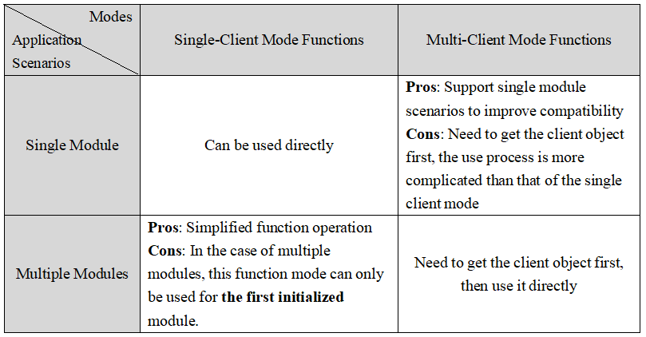

# AT Commands #

## Introduction to AT Commands

AT Commands was originally a control protocol invented by Hayes, which invented MODEM, to control MODEM. Later, with the upgrade of network bandwidth, the dial-up MODEM with very low speed basically exited the general market, but the AT command was retained. At that time, the major mobile phone manufacturers jointly developed a set of AT commands for GSM to control the GSM module of the mobile phone. The AT command evolved on this basis and added the GSM 07.05 standard and the later GSM 07.07 standard to achieve a more robust standardization.

In the subsequent GPRS control, 3G module, etc., all use AT commands to control, AT commands gradually become the actual standard in product development. Nowadays, AT commands are also widely used in embedded development. AT commands are the protocol interfaces of the main chip and communication module. The hardware interface is usually the serial port, so the main control device can complete various operations through simple commands and hardware design.

**The AT commands is a way of applying device connections and data communication between the AT Server and the AT Client.** The basic structure is shown below:


1. The AT command consists of three parts: prefix, body, and terminator. The prefix consists of the character AT; the body consists of commands, parameters, and possibly used data; the terminator typically is `<CR><LF>` (`"\r\n"`).

2. The implementation of the AT function requires the AT Server and the AT Client to work together.

3. The AT server is mainly used to receive commands sent by the AT client, determine the received commands and parameter formats, and deliver corresponding response data or actively send data.

4. The AT client is mainly used to send commands, wait for the AT Server to respond, and parse the AT Server response data or the actively sent data to obtain related information.

5. A variety of data communication methods (UART, SPI, etc.) are supported between AT Server and AT Client. Currently, the most commonly used serial port UART communication method.

6. The data that the AT Server sends to the AT Client is divided into two types: response data and URC data.

- Response Data: The AT Server response status and information received by the AT Client after sending the command.

- URC Data: The data that the AT Server actively sends to the AT client generally appears in some special cases, such as disconnected WIFI connection, TCP receiving data, etc. These situations often require the user to perform corresponding operations.

With the popularization of AT commands, more and more embedded products use AT commands. The AT commands are used as the protocol interfaces of the main chip and the communication module. The hardware interface is generally a serial port, so that the master device can performs a variety of operations using simple commands and hardware design.

Although the AT command has standardization to a certain degree, the AT commands supported by different chips are not completely unified, which directly increases the complexity to use. There is no uniform way to handle the sending and receiving of AT commands and the parsing of data. Moreover, when the AT device is used to connect to the network, the simple device connection and data transceiving functions can only be completed by commands, and it is difficult to adapt the upper layer network application interface, which is not conducive to the development of the product device.

In order to facilitate the user to use AT commands to easily adapt to different AT modules, RT-Thread provides AT components for AT device connectivity and data communication. The implementation of the AT component consists of both client and server.

## Introduction to AT Components

The AT component is based on the implementation of the `AT Server` and `AT Client` of the RT-Thread system. The component completes the AT command transmission, command format and parameter judgment, command response, response data reception, response data parsing, URC data processing, etc.. Command data interaction process.

Through the AT component, the device can use the serial port to connect to other devices to send and receive parsed data. It can be used as an AT Server to allow other devices or even the computer to connect to complete the response of sending data. It can also start the CLI mode in the local shell to enable the device to support  AT Server and AT Client at the same time. Server and AT Client features, this mode is mostly used for device development and debugging.

**AT component resource usage:**

-  AT Client: 4.6K ROM and 2.0K RAM；

- AT Server: 4.0K ROM and 2.5K RAM；

- AT CLI: 1.5K ROM and almost no RAM is used.

Overall, the AT component resources are extremely small, making them ideal for use in embedded devices with limited resources. The AT component code is primarily located in `rt-thread/components/net/at/`. The main functions includes :

**Main Functions of AT Server:**

- Basic commands: Implement a variety of common basic commands (ATE, ATZ, etc.);
- Command compatibility: The command supports ignoring case and improving command compatibility;
- Command detection: The command supports custom parameter expressions and implements self-detection of received command parameters.
- Command registration: Provides a simple way to add user-defined commands, similar to the way the  `finsh/msh`  command is added;
- Debug mode: Provides AT Server CLI command line interaction mode, mainly used for device debugging.

**Main Functions of AT Client:**

- URC data processing: The complete URC data processing method;
- Data analysis: Supports the analysis of custom response data, and facilitates the acquisition of relevant information in the response data;
- Debug mode: Provides AT Client CLI command line interaction mode, mainly used for device debugging.
- AT Socket: As an extension of AT Client function, it uses AT command to send and receive as the basis, implements the standard BSD Socket API, completes the data sending and receiving function, and enables users to complete device networking and data communication through AT commands.
- Multi-client support: The AT component currently supports multiple clients running simultaneously.

## AT Server ##

### AT Server Configuration ###

When we use the AT Server feature in the AT component, we need to define the following configuration in rtconfig.h:

| **Macro Definition** | **Description** |
| ----  | ---- |
|RT_USING_AT| Enable AT component |
|AT_USING_SERVER  |Enable AT Server function|
|AT_SERVER_DEVICE |Define the serial communication device name used by AT Server on the device to ensure that it is not used and the device name is unique, such as `uart3` device.|
|AT_SERVER_RECV_BUFF_LEN|The maximum length of data received by the AT Server device|
|AT_CMD_END_MARK_CRLF|Determine the line terminator of the received command |
|AT_USING_CLI | Enable server-command-line interaction mode |
|AT_DEBUG|Enable AT component DEBUG mode to display more debug log information |
|AT_PRINT_RAW_CMD | Enable real-time display AT command communication data mode for easy debugging |

For different AT devices, there are several formats of the line terminator of the sending commands:  `"\r\n"`、`"\r"`、`"\n"`, the user needs to select the corresponding line terminator according to the device type connected to the AT Server. And then determine the end of the send command line, defined as follows:

| **Macro Definition** | **Terminator** |
| ----  | ---- |
| AT_CMD_END_MARK_CRLF | `"\r\n"` |
| AT_CMD_END_MARK_CR   | `"\r"`    |
| AT_CMD_END_MARK_LF   | `"\n"`    |

The above configuration options can be added by Env tool. The specific path in Env is as follows:

```c
RT-Thread Components  --->
    Network  --->
        AT commands  --->
            [*] Enable AT commands
            [*]   Enable debug log output
            [*] Enable AT commands server
            (uart3) Server device name
            (256)   The maximum length of server data accepted
                    The commands new line sign (\r\n)  --->
            [ ]   Enable AT commands client
            [*]   Enable command-line interface for AT commands
            [ ]   Enable print RAW format AT command communication data
```

After the add configuration is complete, you can use the command line to rebuild the project, or use `scons` to compile.

### AT Server Initialization ###

After enabling the AT Server in Env, you need to initialize it at startup aims to enable the AT Server function. If the component has been initialized automatically, no additional initialization is required. Otherwise, you need to call the following function in the initialization task. :

```c
int at_server_init(void);
```
The AT Server initialization function, which belongs to the application layer function, needs to be called before using the AT Server function or using the AT Server CLI function. `at_server_init()` function completes initialization of resources stored by AT commands ,such as data segment initialization, AT Server device initialization, and semaphore usage by the AT Server, and creates an at_server thread for parsing the receipt data in the AT Server.

After the AT Server is successfully initialized, the device can be used as an AT server to connect to the AT client's serial device for data communication, or use a serial port conversion tool to connect to the PC, so that the PC-side serial debugging assistant can communicate with the AT client as data communication.

### Add custom AT commands ###

At present, the format of the AT command set used by AT devices of different manufacturers does not have a completely uniform standard, so the AT Server in the AT component only supports some basic general AT commands, such as ATE, AT+RST, etc. These commands can only be used to meet the basic operation of the device. If users want to use more functions, they need to implement custom AT Server commands for different AT devices.AT component provides AT command addition method similar to finsh/msh command addition method, which is convenient for users to implement the required commands.

The basic commands currently supported by AT Server are as follows:

- AT: AT test command;
- ATZ: The device is restored to factory settings;
- AT+RST: Reboot device ;
- ATE: ATE1 turns on echo, ATE0 turns off echo;
- AT&L: List all commands;
- AT+UART: Set the serial port information.

AT commands can implement different functions depending on the format of the incoming parameters. For each AT command, there are up to four functions, as described below:

- Test Function: `AT+<x>=?` , used to query the command's parameter, format and value range;
- Query Function: `AT+<x>?`, used to return the current value of the command parameter;
- Setting Function: `AT+<x>=...` , used for user-defined parameter values;
- Execution Function: `AT+<x>`, used to perform related operations.

The four functions of each command do not need to be fully implemented. When you add the AT Server command, you can implement one or several of the above functions according to your needs. Unimplemented functions can be represented by `NULL` . And then through custom commands, the add function is added to the list of basic commands. The addition method is similar to the way the `finsh/msh` command is added. The function for adding commands is as follows:

```c
AT_CMD_EXPORT(_name_, _args_expr_, _test_, _query_, _setup_, _exec_);
```

|**Parameter**  |**Description**                        |
| ---------- | ------------------------------- |
| `_name_ `        | AT command name            |
| `_args_expr_`    | AT command parameter expression; (NULL means no parameter, `<>` means mandatory parameter and `[]` means optional parameter） |
| `_test_`     | AT test function name; (NULL means no parameter) |
| `_query_` | AT query function name; (ibid.) |
| `_setup_` | AT setup function name; (ibid.) |
| `_exec_` | AT performs the function name; (ibid.) |

The AT command registration example is as follows. The `AT+TEST` command has two parameters. The first parameter is a mandatory parameter, and the second parameter is an optional parameter. The command implements the query function and the execution function:

```c
static at_result_t at_test_exec(void)
{
    at_server_printfln("AT test commands execute!");

    return 0;
}
static at_result_t at_test_query(void)
{
    at_server_printfln("AT+TEST=1,2");

    return 0;
}

AT_CMD_EXPORT("AT+TEST", =<value1>[,<value2>], NULL, at_test_query, NULL, at_test_exec);
```

### AT Server APIs

#### Send Data to the Client (no newline)

```c
void at_server_printf(const char *format, ...);
```

This function is used by the AT Server to send fixed-format data to the corresponding AT Client serial device through the serial device. The data ends without a line break. Used to customize the function functions of AT commands in AT Server.

|  **Parameter**  | **D**escription           |
|------|-------------------------|
| format | Customize the expression of the input data |
|   ...  | Input data list, variable parameters |

#### Send Data to the Client (newline)

```c
void at_server_printfln(const char *format, ...);
```

This function is used by the AT Server to send fixed-format data to the corresponding AT Client serial device through the serial device, with a newline at the end of the data. Used to customize the function functions of AT commands in AT Server.

|  **Parameter**  | **Description**           |
|------|-------------------------|
| format | Customize the expression of the input data |
|   ...  | Input data list, variable parameters |

#### Send Command Execution Results to the Client

```c
void at_server_print_result(at_result_t result);
```

This function is used by the AT Server to send command execution results to the corresponding AT Client serial device through the serial device. The AT component provides a variety of fixed command execution result types. When you customize a command, you can use the function to return the result directly;

|  **Parameter**  | **Description**   |
|------|-----------------|
| result | Command execution result type |

The command execution result type in the AT component is given in the enumerated type, as shown in the following table:

|     Types of Command Execution Result     |        Description        |
|------------------------|------------------|
|      AT_RESULT_OK      |    Command Execution Succeeded    |
|     AT_RESULT_FAILE    |    Command Execution Failed    |
|     AT_RESULT_NULL     | Command No Result |
|   AT_RESULT_CMD_ERR   |    Command Input Error    |
| AT_RESULT_CHECK_FAILE | Parameter Expression Matching Error |
| AT_RESULT_PARSE_FAILE |    Parameter Parsing Error    |

See the following code to learn how to use the `at_server_print_result` function:

```c
static at_result_t at_test_setup(const char *args)
{
    if(!args)
    {
        /* If the parameter error after incoming orders, returns expression match error results */
        at_server_print_result(AT_RESULT_CHECK_FAILE);
    }

    /* Return to successful execution under normal conditions */
    at_server_print_result(AT_RESULT_OK);
    return 0;
}
static at_result_t at_test_exec(void)
{
    // execute some functions of the AT command.

    /* This command does not need to return results */
    at_server_print_result(AT_RESULT_NULL);
    return 0;
}
AT_CMD_EXPORT("AT+TEST", =<value1>,<value2>, NULL, NULL, at_test_setup, at_test_exec);
```

#### Parsing Input Command Parameters

```c
int at_req_parse_args(const char *req_args, const char *req_expr, ...);
```

Parsing input command parameters Among the four function functions of an AT command, only the setting function has an input parameter, and the input parameter is to remove the rest of the AT command, for example, a command input is  `"AT+TEST=1,2,3,4"`, Then set the input parameter of the function to the parameter string `"=1,2,3,4"` .

The command parsing function is mainly used in the AT function setting function, which is used to parse the incoming string parameter and obtain corresponding multiple input parameters for performing the following operations. The standard `sscanf` parsing grammar used in parsing grammar here will also be described in detail later in the AT Client parameter parsing function.

|   **Parameter**   | **Description**                                 |
|---------|-----------------------------------------------|
| req_args | The incoming parameter string of the request command |
| req_expr | Custom parameter parsing expression for parsing the above incoming parameter data |
|    ...    | Output parsing parameter list, which is a variable parameter |
|   **Return**   | --                                           |
|    >0    | Successful, returns the number of variable parameters matching the parameter expression |
|     =0    | Failed, no parameters matching the parameter expression |
|     -1    | Failed, parameter parsing error |

See the following code to learn how to use the at_server_print_result function:

```c
static at_result_t at_test_setup(const char *args)
{
    int value1,value2;

    /* The input standard format of args should be "=1, 2", "=%d, %d" is a custom parameter parsing expression, and the result is parsed and stored in the value1 and value2 variables. */
    if (at_req_parse_args(args, "=%d,%d", &value1, &value2) > 0)
    {
        /* Data analysis succeeds, echoing data to AT Server serial device */
        at_server_printfln("value1 : %d, value2 : %d", value1, value2);

        /* The data is parsed successfully. The number of parsing parameters is greater than zero. The execution is successful. */
        at_server_print_result(AT_RESULT_OK);
    }
    else
    {
        /* Data parsing failed, the number of parsing parameters is not greater than zero, and the parsing failure result type is returned. */
        at_server_print_result(AT_RESULT_PARSE_FAILE);
    }
    return 0;
}
/* Add the "AT+TEST" command to the AT command list. The command parameters are formatted as two mandatory parameters <value1> and <value2>. */
AT_CMD_EXPORT("AT+TEST", =<value1>,<value2>, NULL, NULL, at_test_setup, NULL);
```

#### Portation-related interfaces

AT Server supports a variety of basic commands (ATE, ATZ, etc.) by default. The function implementation of some commands is related to hardware or platform and requires user-defined implementation. The AT component source code  `src/at_server.c` file gives the weak function definition of the migration file. The user can create a new migration file in the project to implement the following function to complete the migration interface, or modify the weak function to complete the migration interface directly in the file.

1. Device restart function: `void at_port_reset(void);`. This function completes the device soft restart function and is used to implement the basic command AT+RST in AT Server.

2. The device restores the factory settings function: `void at_port_factory_reset(void);`. This function completes the device factory reset function and is used to implement the basic command ATZ in AT Server.

3. Add a command table in the link script (add only in gcc, no need to add in keil and iar)

If you use the gcc toolchain in your project, you need to add the *section* corresponding to the AT server command table in the link script. Refer to the following link script:

```c
/* Constant data goes into FLASH */
.rodata :
{
    ...

    /* section information for RT-thread AT package */
    . = ALIGN(4);
    __rtatcmdtab_start = .;
    KEEP(*(RtAtCmdTab))
    __rtatcmdtab_end = .;
    . = ALIGN(4);
} > CODE
```

## AT Client

### AT Client Configuration

When we use the AT Client feature in the AT component, we need to define the following configuration in rtconfig.h:

```c
#define RT_USING_AT
#define AT_USING_CLIENT
#define AT_CLIENT_NUM_MAX 1
#define AT_USING_SOCKET
#define AT_USING_CLI
#define AT_PRINT_RAW_CMD
```

- `RT_USING_AT`: Used to enable or disable the AT component;

- `AT_USING_CLIENT`: Used to enable the AT Client function;

- `AT_CLIENT_NUM_MAX`: Maximum number of AT clients supported at the same time.

- `AT_USING_SOCKET`: Used by the AT client to support the standard BSD Socket API and enable the AT Socket function.

- `AT_USING_CLI`: Used to enable or disable the client command line interaction mode.

- `AT_PRINT_RAW_CMD`: Used to enable the real-time display mode of AT command communication data for easy debugging.

The above configuration options can be added directly to the `rtconfig.h` file or added by the Env. The specific path in Env is as follows:

```c
RT-Thread Components  --->
    Network  --->
        AT commands  --->
            [*] Enable AT commands
            [ ]   Enable debug log output
            [ ]   Enable AT commands server
            [*]   Enable AT commands client
            (1)   The maximum number of supported clients
            [*]   Enable BSD Socket API support by AT commnads
            [*]   Enable command-line interface for AT commands
            [ ]   Enable print RAW format AT command communication data
```

After the configuration is complete, you can use the command line to rebuild the project, or use `scons` to compile.

### AT Client Initialization ###

After configuring the AT Client, you need to initialize it at startup aims to enable the AT client function. If the component has been initialized automatically, no additional initialization is required. Otherwise, you need to call the following function in the initialization task:

```c
int at_client_init(const char *dev_name,  rt_size_t recv_bufsz);
```

The AT Client initialization function, which belongs to the application layer function, needs to be called before using the AT Client function or using the AT Client CLI function. The `at_client_init()` function completes the initialization of the AT Client device, the initialization of the AT Client porting function, the semaphore and mutex used by the AT Client, and other resources, and creates the  `at_client` thread for parsing the data received in the AT Client and for processing the URC data.

### AT Client data receiving and sending ###

The main function of the AT Client is to send AT commands, receive data, and parse data. The following is an introduction to the processes and APIs related to AT Client data reception and transmission.

Related structure definition:

```c
struct at_response
{
    /* response buffer */
    char *buf;
    /* the maximum response buffer size */
    rt_size_t buf_size;
    /* the number of setting response lines
     * == 0: the response data will auto return when received 'OK' or 'ERROR'
     * != 0: the response data will return when received setting lines number data */
    rt_size_t line_num;
    /* the count of received response lines */
    rt_size_t line_counts;
    /* the maximum response time */
    rt_int32_t timeout;
};
typedef struct at_response *at_response_t;
```

In the AT component, this structure is used to define a control block for AT command response data, which is used to store or limit the data format of the AT command response data.

-  `buf` is used to store the received response data. Note that the data stored in the buf is not the original response data, but the data of the original response data removal terminator (`"\r\n"`). Each row of data in the buf is split by '\0' to make it easy to get data by row.
- `buf_size`  is a user-defined length of the received data that is most supported by this response. The length of the return value is defined by the user according to his own command.
- `line_num` is the number of rows that the user-defined response data needs to receive. **If there is no response line limit requirement, it can be set to 0.**
- `line_counts` is used to record the total number of rows of this response data.
- `timeout` is the user-defined maximum response time for this response data.

`buf_size`、`line_num`、`timeout` parameters in the structure are restricted conditions, which are set when the structure is created, and other parameters are used to store data parameters for later data analysis.

Introduction to related API interfaces:

#### Create a Response Structure

```c
at_response_t at_create_resp(rt_size_t buf_size, rt_size_t line_num, rt_int32_t timeout);
```

| **Parameter**   | **Description**                             |
|---------|-----------------------------------------|
| buf_size | Maximum length of received data supported by this response |
| line_num | This response requires the number of rows of data to be returned. The number of rows is divided by a standard terminator (such as "\r\n"). If it is 0, it will end the response reception after receiving the "OK" or "ERROR" data; if it is greater than 0, it will return successfully after receiving the data of the current set line number. |
|  timeout  | The maximum response time of the response data, receiving data timeout will return an error |
| **Return**   | --                              |
|  != NULL  | Successful, return a pointer to the response structure |
|   = NULL  | Failed, insufficient memory |

This function is used to create a custom response data receiving structure for later receiving and parsing the send command response data.

#### Delete a Response Structure

```c
void at_delete_resp(at_response_t resp);
```

| **Parameter** | **Description**           |
|----|-------------------------|
| resp | The response structure pointer to be deleted |

This function is used to delete the created response structure object, which is generally paired with the **at_create_resp** creation function.

#### Set the Parameters of Response Structure

```c
at_response_t at_resp_set_info(at_response_t resp, rt_size_t buf_size, rt_size_t line_num, rt_int32_t timeout);
```

|   **Parameter**   | **Description**                  |
|---------|----------------------------------|
|    resp   | Response structure pointer that has been created |
| buf_size | Maximum length of received data supported by this response |
| line_num | This response requires the number of rows of data to be returned. The number of lines is divided by the standard terminator. If it is 0, the response is received after receiving the "OK" or "ERROR" data. If it is greater than 0, the data is successfully returned after receiving the data of the currently set line number. |
|  timeout  | The maximum response time of the response data, receiving data timeout will return an error. |
|   **Return**   | --                          |
|  != NULL  | Successful, return a pointer to the response structure |
|   = NULL  | Failed, insufficient memory |

This function is used to set the response structure information that has been created. It mainly sets the restriction information on the response data. It is generally used after creating the structure and before sending the AT command. This function is mainly used to send commands when the device is initialized, which can reduce the number of times the response structure is created and reduce the code resource occupation.

#### Send a Command and Receive a Response

```c
rt_err_t at_exec_cmd(at_response_t resp, const char *cmd_expr, ...);
```

|   **Parameter**   | **Description**            |
|---------|-----------------------------|
|    resp   | Response structure body pointer created |
| cmd_expr | Customize the expression of the input command |
|    ...    | Enter the command data list, a variable parameter |
|   **Return**   | --                         |
|    >=0   | Successful               |
|     -1    | Failed                    |
|     -2    | Failed, receive response timed out |

This function is used by the AT Client to send commands to the AT Server and wait for a response. `resp`  is a pointer to the response structure that has been created. The AT command uses the variable argument input of the match expression. **You do not need to add a command terminator at the end of the input command.**

Refer to the following code to learn how to use the above AT commands to send and receive related functions:

```c
/*
 * Program listing: AT Client sends commands and receives response routines
 */

#include <rtthread.h>
#include <at.h>   /* AT component header file */

int at_client_send(int argc, char**argv)
{
    at_response_t resp = RT_NULL;

    if (argc != 2)
    {
        LOG_E("at_cli_send [command]  - AT client send commands to AT server.");
        return -RT_ERROR;
    }

    /* Create a response structure, set the maximum support response data length to 512 bytes, the number of response data lines is unlimited, and the timeout period is 5 seconds. */
    resp = at_create_resp(512, 0, rt_tick_from_millisecond(5000));
    if (!resp)
    {
        LOG_E("No memory for response structure!");
        return -RT_ENOMEM;
    }

    /* Send AT commands and receive AT Server response data, data and information stored in the resp structure */
    if (at_exec_cmd(resp, argv[1]) != RT_EOK)
    {
        LOG_E("AT client send commands failed, response error or timeout !");
        return -ET_ERROR;
    }

    /* Command sent successful */
    LOG_D("AT Client send commands to AT Server success!");

    /* Delete response structure */
    at_delete_resp(resp);

    return RT_EOK;
}
#ifdef FINSH_USING_MSH
#include <finsh.h>
/* Output at_Client_send to msh */
MSH_CMD_EXPORT(at_Client_send, AT Client send commands to AT Server and get response data);
#endif
```

The implementation principle of sending and receiving data is relatively simple. It mainly reads and writes the serial port device bound by the AT client, and sets the relevant number of rows and timeout to limit the response data. It is worth noting that the `res` response needs to be created first. The structure passed `in_exec_cmd` function for data reception. When the `at_exec_cmd` function's parameter `resp` is NULL, it means that the data sent this time **does not consider processing the response data and directly returns the result**.

### AT Client Data Parsing Method ###

After the data is normally acquired, the response data needs to be parsed, which is one of the important functions of the AT Client. Parsing of data in the AT Client provides a parsed form of a custom parsing expression whose parsing syntax uses the standard `sscanf` parsing syntax. Developers can use the custom data parsing expression to respond to useful information in the data, provided that the developer needs to review the relevant manual in advance to understand the basic format of the AT Server device response data that the AT Client connects to. The following is a simple AT Client data parsing method through several functions and routines.

#### Get Response Data for the Specified Line Number

```c
const char *at_resp_get_line(at_response_t resp, rt_size_t resp_line);
```

|    **Parameter**    | **Description**               |
|----------|-----------------------------|
|    resp    |Response structure pointer               |
| resp_line | Required line number for obtaining data |
|    **Return**    | --                         |
|   != NULL  | Successful, return a pointer to the corresponding line number data |
|   = NULL   | Failed, input line number error |

This function is used to get a row of data with the specified line number in the AT Server response data. The line number is judged by the standard data terminator. The above send and receive functions `at_exec_cmd` have recorded and processed the data and line numbers of the response data in the `resp` response structure, where the data information of the corresponding line number can be directly obtained.

#### Get Response Data by the Specified Keyword

```c
const char *at_resp_get_line_by_kw(at_response_t resp, const char *keyword);
```

|  **Parameter**  | **Description**              |
|-------|-----------------------------|
|   resp  |Response structure pointer               |
| keyword | Keyword information |
|  **Return**  | --                         |
| != NULL | Successful, return a pointer to the corresponding line number data |
|  = NULL | Failed, no keyword information found |

This function is used to get a corresponding row of data by keyword in the AT Server response data.

#### Parse Response Data for the Specified Line Number

```c
int at_resp_parse_line_args(at_response_t resp, rt_size_t resp_line, const char *resp_expr, ...);
```

|    **Parameter**    | **Description**                  |
|----------|---------------------------------|
|    resp    |Response structure pointer                   |
| resp_line | Parsed data line number required, **from the start line number count 1** |
| resp_expr | Custom parameter parsing expression |
|     ...    | Parsing the parameter list as a variable parameter |
|    **Return**    | --                             |
|     >0    | Successful, return the number of parameters successfully parsed |
|     =0     | Failed, no parameters matching the parsing expression |
|     -1     | Failed, parameter parsing error |

This function is used to get a row of data with the specified line number in the AT Server response data, and parse the parameters in the row data.

#### Parse Response Data for a Row with Specified Keyword

```c
int at_resp_parse_line_args_by_kw(at_response_t resp, const char *keyword, const char *resp_expr, ...);
```

|    **Parameter**    | **Description**                   |
|----------|---------------------------------|
|    resp    |Response structure pointer                   |
|   keyword  | Keyword information    |
| resp_expr | Custom parameter parsing expression |
|     ...    | Parsing the parameter list as a variable parameter |
|    **Return**    | --                             |
|     >0    | Successful, return the number of parameters successfully parsed |
|     =0     | Failed, no parameters matching the parsing expression |
|     -1     | Failed, parameter parsing error |

This function is used to get a row of data containing a keyword in the AT Server response data and parse the parameters in the row data.

The data parsing syntax uses the standard  `sscanf` syntax, the content of the syntax is more, developers can search their parsing syntax, here two procedures are used to introduce the simple use method.

#### Serial Port Configuration Information Analysis Example

The data sent by the client:

```c
AT+UART?
```

The response data obtained by the client:

```c
UART=115200,8,1,0,0\r\n
OK\r\n
```

The pseudo code is parsed as follows:

```c
/* Create a server response structure, the maximum length of user-defined receive data is 64 */
resp = at_create_resp(64, 0, rt_tick_from_millisecond(5000));

/* Send data to the server and receive response data in the resp structure */
at_exec_cmd(resp, "AT+UART?");

/* Analyze the serial port configuration information, 1 means parsing the first line of response data, '%*[^=]' means ignoring the data before the equal sign */
at_resp_parse_line_args(resp, 1,"%*[^=]=%d,%d,%d,%d,%d", &baudrate, &databits, &stopbits, &parity, &control);
printf("baudrate=%d, databits=%d, stopbits=%d, parity=%d, control=%d\n",
        baudrate, databits, stopbits, parity, control);

/* Delete server response structure */
at_delete_resp(resp);
```

#### IP and MAC Address Resolution Example ####

The data sent by the client:

```c
AT+IPMAC?
```

The response data obtained by the server:

```c
IP=192.168.1.10\r\n
MAC=12:34:56:78:9a:bc\r\n
OK\r\n
```

The pseudo code is parsed as follows:

```c
/* Create a server response structure, the maximum length of user-defined receive data is 128 */
resp = at_create_resp(128, 0, rt_tick_from_millisecond(5000));

at_exec_cmd(resp, "AT+IPMAC?");

/* Customize the parsing expression to parse the information in the current line number data */
at_resp_parse_line_args(resp, 1,"IP=%s", ip);
at_resp_parse_line_args(resp, 2,"MAC=%s", mac);
printf("IP=%s, MAC=%s\n", ip, mac);

at_delete_resp(resp);
```

The key to parsing data is to correctly define the expression. Because the response data of the different device manufacturers is not unique to the response data of the AT device, only the form of the custom parsing expression can be obtained to obtain the required information. The design of the `at_resp_parse_line_args` parsing parameter function is based on the  `sscanf`  data parsing method. Before using, the developer needs to understand the basic parsing syntax and then design the appropriate parsing syntax in combination with the response data. If the developer does not need to parse the specific parameters, you can use the `at_resp_get_line` function to get the specific data of a row.

### AT Client URC Data Processing ###

The processing of URC data is another important feature of AT Client. URC data is the data that is actively sent by the server. It cannot be received by the above data sending and receiving functions. The URC data format and function are different for different devices. Therefore, the URC data processing mode needs to be customized. The AT component provides a list management method for the processing of URC data. Users can customize the addition of URC data and its execution functions to the management list, so the processing of URC data is also the main porting work of AT Client.

Related structure:

```c
struct at_urc
{
    const char *cmd_prefix;             // URC data prefix
    const char *cmd_suffix;             // URC data suffix
    void (*func)(const char *data, rt_size_t size);     // URC data execution function
};
typedef struct at_urc *at_urc_t;
```

Each URC data has a structure control block that defines and determines the prefix and suffix of the URC data, as well as the execution function of the URC data. A piece of data can be defined as URC data only if it matches the prefix and suffix of the URC exactly. The URC data execution function is executed immediately after the matching URC data is obtained. So developers adding a URC data requires a custom matching prefix, suffix, and execution function.


#### URC Data List Initialization

```c
void at_set_urc_table(const struct at_urc *table, rt_size_t size);
```

| **Parameter** | **Description**         |
|-----|-----------------------|
| table | URC data structure array pointer |
|  size | Number of URC data |

This function is used to initialize the developer-defined URC data list, mainly used in the AT Client porting function.

The example of AT Client migration is given below. This example mainly shows the specific processing of URC data in the `at_client_port_init()` porting function. The developer can directly apply it to his own porting file, or customize the implementation function to complete the AT Client porting.

```c
static void urc_conn_func(const char *data, rt_size_t size)
{
    /* WIFI connection success information */
    LOG_D("AT Server device WIFI connect success!");
}

static void urc_recv_func(const char *data, rt_size_t size)
{
    /* Received data from the server */
    LOG_D("AT Client receive AT Server data!");
}

static void urc_func(const char *data, rt_size_t size)
{
    /* Device startup information */
    LOG_D("AT Server device startup!");
}

static struct at_urc urc_table[] = {
    {"WIFI CONNECTED",   "\r\n",     urc_conn_func},
    {"+RECV",            ":",          urc_recv_func},
    {"RDY",              "\r\n",     urc_func},
};

int at_client_port_init(void)
{
    /* Add multiple URC data to the URC list and execute the URC function when receiving data that matches both the URC prefix and the suffix */
    at_set_urc_table(urc_table, sizeof(urc_table) / sizeof(urc_table[0]));
    return RT_EOK;
}
```

### AT Client Other APIs Introduction

#### Send Specified Length Data

```c
rt_size_t at_client_send(const char *buf, rt_size_t size);
```

| **Parameter** | **Description**               |
|----|-----------------------------|
|  buf | Pointer to send data |
| size | Length of data sent |
| **Return** | --                         |
|  >0 | Successful, return the length of the data sent |
| <=0 | Failed                    |

This function is used to send the specified length data to the AT Server device through the AT Client device, which is mostly used for the AT Socket function.

#### Receive Specified Length Data

```c
rt_size_t at_client_recv(char *buf, rt_size_t size,rt_int32_t timeout);
```

| **Parameter** | **Description**               |
|----|-----------------------------|
|  buf | Pointer to receive data |
| size | Maximum length for receiving data |
| timeout | Receive data timeout (tick) |
| **Return** | --                         |
|  >0 | Successful, return the length of the data received successfully |
| <=0 | Failed, receiving data error or timeout |

This function is used to receive data of a specified length through the AT Client device, and is mostly used for the AT Socket function. This function can only be used in URC callback handlers.

#### Set the line terminator for receiving data ####

```c
void at_set_end_sign(char ch);
```

| Parameter | 描述                      |
| -----   | -----                   |
|ch        | Line terminator   |
| **Return** | **描述**                  |
|-        | -                       |

This function is used to set the line terminator, which is used to judge the end of a row of data received by the client, and is mostly used for the AT Socket function.

#### Waiting for module initialization to complete ####

```c
int at_client_wait_connect(rt_uint32_t timeout);
```

| Parameter | Description            |
| -----   | -----                   |
|timeout   | Waiting timeout |
| **Return** | **Description**     |
|0         | Successful          |
|<0        | Failed, no data returned during the timeout period |

This function is used to cyclically send AT commands when the AT module starts, until the module responds to the data, indicating that the module is successfully started.

### AT Client Multi-Client Support ###

In general, the device as the AT Client only connects to one AT module (the AT module acts as the AT Server) and can directly use the above functions of data transmission and reception and command parsing. In a few cases, the device needs to connect multiple AT modules as the AT Client. In this case, the multi-client support function of the device is required.

The AT component provides support for multi-client connections and provides two different sets of function interfaces: **Single-Client Mode Functions** and **Multi-Client Mode Functions**.

- Single-Client Mode Function: This type of function interface is mainly used when the device is connected to only one AT module, or when the device is connected to multiple AT modules, it is used in the **first AT client**.

- Multi-Client Mode Function: This type of function interface mainly uses devices to connect multiple AT modules.

The advantages and disadvantages of the two different mode functions and in different application scenarios are as follows:



The single client mode function definition is mainly different from the single connection mode function. The definition of the incoming client object is different. The single client mode function uses the first initialized AT client object by default, and the multi-client mode function can Pass in the user-defined custom client object. The function to get the client object is as follows:

```c
at_client_t at_client_get(const char *dev_name);
```

This function obtains the AT client object created by the device through the incoming device name, which is used to distinguish different clients when connecting multiple clients.

The single client mode and multi-client mode function interface definitions differ from the following functions:：

| Single-Client Mode Functions | Multi-Client Mode Functions |
| ----------------------------| ---------------------------------------|
| at_exec_cmd(...)             | at_obj_exec_cmd(client, ...)            |
| at_set_end_sign(...)         | at_obj_set_end_sign(client, ...)        |
| at_set_urc_table(...)        | at_obj_set_urc_table(client, ...)       |
| at_client_wait_connect(...)  | at_client_obj_wait_connect(client, ...) |
| at_client_send(...)          | at_client_obj_send(client, ...)         |
| at_client_recv(...)          | at_client_obj_recv(client, ...)         |

The two modes of client data transmission and parsing are basically the same, and the function usage process is different, as shown below:

```c
/* Single client mode function usage */

at_response_t resp = RT_NULL;

at_client_init("uart2", 512);

resp = at_create_resp(256, 0, 5000);

/* Send commands using a single client mode function */
at_exec_cmd(resp, "AT+CIFSR");

at_delete_resp(resp);
```

```c
/* Multi-client mode functions usage */

at_response_t resp = RT_NULL;
at_client_t client = RT_NULL;

/* Initialize two AT clients */
at_client_init("uart2", 512);
at_client_init("uart3", 512);

/* Get the corresponding AT client object by name */
client = at_client_get("uart3");

resp = at_create_resp(256, 0, 5000);

/* Send commands using multi-client mode functions */
at_obj_exec_cmd(client, resp, "AT+CIFSR");

at_delete_resp(resp);
```

The process differences used by other functions are similar to the above `at_obj_exec_cmd()` function. The main function is to obtain the client object through the `at_client_get() ` function, and then determine which client is the client through the incoming object to achieve multi-client support.

## FAQs

### Q: What should I do if the log on the shell shows an error when enabling the AT command to send and receive data real-time printing function. ?

**A:** Increase the baudrate of the serial port device corresponding to the shell to 921600, improve the serial port printing speed, and prevent the printing error when the data is too large.

### Q: When the AT Socket function is started, the compile prompt "The AT socket device is not selected, please select it through the env menuconfig".

**A:** After the AT Socket function is enabled, the corresponding device model is enabled in the at device package by default. Enter the at device package, configure the device as an ESP8266 device, configure WIFI information,  re-generate the project, compile and download.

### Q: AT Socket function data reception timeout or data reception is not complete.

**A:** The error may be that the receive data buffer in the serial device used by the AT is too small (RT_SERIAL_RB_BUFSZ default is 64 bytes), and the data is overwritten after the data is not received in time. The buffer size of the serial port receiving data (such as 256 bytes) is appropriately increased.
