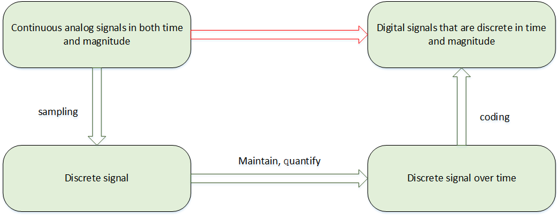

# ADC Device

## An Introduction to ADC

An ADC (analog-to-digital converter) is a hardware device that converts continuously changing analog signals to discrete digital signals. Usually, these analog signals include temperature, pressure, sound, video and many other types of signals. Converting them is important, as digital signals are easier to store, process, and transmit. This conversion can be achieved by using an ADC device which is commonly integrated in various platforms. Historically, ADCs were first used to convert received wireless signals to digital signals, for example, television signals, or signals from long-short broadcast stations.

### Conversion Process

As shown in the figure below, the analog-to-digital conversion generally involves steps of sampling, holding, quantifying, and encoding. In actual circuits, some processes are combined, such as sampling and holding, while quantization and encoding are implemented simultaneously in the conversion process.



Sampling is the conversion of analog signals that changes continuously over time into time-discrete analog signals. It takes a certain amount of time for the analog signals obtained by sampling to be converted into digital signals. In order to provide a stable value for the subsequent quantization coding process, it is required to keep the sampling analog signals for a period of time after the sampling circuit.

The process of converting a numerically continuous analog quantity into a digital quantity is called quantization. Digital signals are discrete numerically. The output voltage of the sample-and-hold circuit also needs to be naturalized to a corresponding discrete level in a similar way, and any digital quantity can only be an integer multiple of a certain minimum quantity unit. The quantized value also requires the encoding process, which is the digital output of the A/D converter.

### Resolution

Resolution is represented as binary (or decimal) numbers. Generally, it comes in 8 bits, 10 bits, 12 bits, 16 bits, etc. A larger resolution, in bits,  means more accuracy in the conversion of analog to digital signals.

### Precision

Precision is the maximum error value between analog signals and real ADC device numerical points’ values.An ADC with a high resolution might have a low precision, meaning that factors like noise can affect the numerical ADC reading more than small changes in the input signal.

### Conversion Rate

The conversion rate is the reciprocal of time taken for an ADC device to complete conversion from an analog to a digital signal. For example, an ADC device with a conversion rate of 1MHz means that the ADC conversion time is 1 microsecond.

## Access ADC Device

The application accesses the ADC hardware through the ADC device management interface provided by RT-Thread. The relevant interfaces are as follows:

| **Function** | Description |
| --------------- | ------------------ |
| rt_device_find()  | Find device handles based on ADC device name |
| rt_adc_enable()     | Enable ADC devices |
| rt_adc_read()   | Read ADC device data |
| rt_adc_disable()  | Close the ADC device |

### Find ADC Devices

The application gets the device handler based on the ADC device name to operate the ADC device. Following is the interface function to find the devices: 

```c
rt_device_t rt_device_find(const char* name);
```

| **Parameter** | Description                |
| -------- | ---------------------------------- |
| name     | The name of the ADC device |
| **Return** | ——                                 |
| Device handle | Finding the corresponding device will return to the corresponding device handle |
| RT_NULL | No device found 
                                             |

In a nutshell, the names of the ADC devices are registered as adc0, adc1, and so on. What follows is an example on how to use it

```c
#define ADC_DEV_NAME        "adc1"  /* ADC device name */
rt_adc_device_t adc_dev;            /* ADC device handle */
/* find the device */
adc_dev = (rt_adc_device_t)rt_device_find(ADC_DEV_NAME);
```

### Enable ADC Channel

It is required to enable the ADC device with the following interface function before reading and operating the ADC device.

```c
rt_err_t rt_adc_enable(rt_adc_device_t dev, rt_uint32_t channel);
```

| Parameter | Description              |
| ---------- | ------------------------------- |
| dev        | ADC device handle            |
| channel | ADC channel         |
| **Return** | ——                             |
| RT_EOK     | Succeed          |
| -RT_ENOSYS | Failed, the device operation method is empty |
| Other error code | Failed          |

 An usage example is as follows:

```c
#define ADC_DEV_NAME        "adc1"  /* ADC device name */
#define ADC_DEV_CHANNEL     5       /* ADC channel */
rt_adc_device_t adc_dev;            /* ADC device handle */
/* find the device */
adc_dev = (rt_adc_device_t)rt_device_find(ADC_DEV_NAME);
/* enable the device */
rt_adc_enable(adc_dev, ADC_DEV_CHANNEL);
```

### Read ADC Channel Sample Values

Reading the ADC channel sample values can be done by the following function:

```c
rt_uint32_t rt_adc_read(rt_adc_device_t dev, rt_uint32_t channel);
```

| Parameter | Description |
| ---------- | ----------------- |
| dev        | ADC device handle |
| channel    | ADC channel   |
| **Return** | ——                |
| Read values |       |

An example of using the ADC sampled voltage value is as follows:

```c
#define ADC_DEV_NAME        "adc1"      /* ADC device name */
#define ADC_DEV_CHANNEL     5           /* ADC channel */
#define REFER_VOLTAGE       330         /* Reference voltage 3.3V, data accuracy multiplied by 100 and reserve 2 decimal places*/
#define CONVERT_BITS        (1 << 12)   /* The number of conversion bits is 12  */

rt_adc_device_t adc_dev;                /* ADC device handle */
rt_uint32_t value；
/* find the device */
adc_dev = (rt_adc_device_t)rt_device_find(ADC_DEV_NAME);
/*  enable the device  */
rt_adc_enable(adc_dev, ADC_DEV_CHANNEL);
/* Read sampling values */
value = rt_adc_read(adc_dev, ADC_DEV_CHANNEL);
/*  Convert to the corresponding voltage value  */
vol = value * REFER_VOLTAGE / CONVERT_BITS;
rt_kprintf("the voltage is :%d.%02d \n", vol / 100, vol % 100);
```

The calculation formula of the actual voltage value is: `sampling value * reference voltage/(1 << resolution digit)`.  In the above example,  variable *vol* was enlarged 100 times, so finally the integer part of voltage is obtained through *vol / 100*, and the decimal part of voltage is obtained through *vol % 100*.

### Disabling the ADC Channel

An ADC channel can be disabled through the following function:

```c
rt_err_t rt_adc_disable(rt_adc_device_t dev, rt_uint32_t channel);
```

| **Parameter** | **Description**              |
| ---------- | ------------------------------- |
| dev        | ADC device handle            |
| channel    | ADC channel         |
| **Return** | ——                             |
| RT_EOK | Succeed                                      |
| -RT_ENOSYS | Failed, the device operation method is empty |
| Other error code | Failed         |

An example:

```c
#define ADC_DEV_NAME        "adc1"  /* ADC device name */
#define ADC_DEV_CHANNEL     5       /* ADC channel */
rt_adc_device_t adc_dev;            /* ADC device handle */
rt_uint32_t value；
/* find the device */
adc_dev = (rt_adc_device_t)rt_device_find(ADC_DEV_NAME);
/* enable the device */
rt_adc_enable(adc_dev, ADC_DEV_CHANNEL);
/* read sampling values */
value = rt_adc_read(adc_dev, ADC_DEV_CHANNEL);
/*  convert to the corresponding voltage value */
vol = value * REFER_VOLTAGE / CONVERT_BITS;
rt_kprintf("the voltage is :%d.%02d \n", vol / 100, vol % 100);
/* close the channel */
rt_adc_disable(adc_dev, ADC_DEV_CHANNEL);
```

### FinSH Command

To find out the registered device, you can use the command adc probe followed by the registered ADC device name as following,

```c
msh >adc probe adc1
probe adc1 success
```

A channel of the enabled device can use the command `adc enable` followed by the channel number.

```c
msh >adc enable 5
adc1 channel 5 enables success
```

To read data from a channel of an ADC device, you can use the command `adc read` followed by the channel number.

```c
msh >adc read 5
adc1 channel 5  read value is 0x00000FFF
msh >
```

To close a channel of an ADC device, you can use the command `adc disable` followed by the channel number.

```c
msh >adc disable 5
adc1 channel 5 disable success
msh >
```

## ADC Device Usage Example

The specific usage of the ADC device can refer to the following sample code. The main steps of the sample code are as follows:

1. First find the device handle based on the ADC device name “adc1”.
2. After the device is enabled, read the sample value of the corresponding channel 5 of the adc1 device, and then calculate the actual voltage value with the resolution of 12 bits and the reference voltage of 3.3V.
3. Finally close the corresponding channel of the ADC device.

Running result: Print the raw and converted data which actually read , and print the calculated actual voltage value.

```c
/*
 * Program Listing： ADC Device Usage Routines
 * The routine exports the adc_sample command to the control terminal
 * adc_sample Command call format: adc_sample
 * Program function: The voltage value is sampled by the ADC device and converted to a numerical value.
 *                   The sample code reference voltage is 3.3V and the number of conversion bits is 12 bits.
*/

#include <rtthread.h>
#include <rtdevice.h>

#define ADC_DEV_NAME        "adc1"      /* ADC device name */
#define ADC_DEV_CHANNEL     5           /* ADC channel */
#define REFER_VOLTAGE       330         /* Reference voltage 3.3V, data accuracy multiplied by 100 and reserve 2 decimal places*/
#define CONVERT_BITS        (1 << 12)   /* The number of conversion bits is 12 */

static int adc_vol_sample(int argc, char *argv[])
{
    rt_adc_device_t adc_dev;
    rt_uint32_t value, vol;
    rt_err_t ret = RT_EOK;

    /* find the device */
    adc_dev = (rt_adc_device_t)rt_device_find(ADC_DEV_NAME);
    if (adc_dev == RT_NULL)
    {
        rt_kprintf("adc sample run failed! can't find %s device!\n", ADC_DEV_NAME);
        return RT_ERROR;
    }

    /* enable the device */
    ret = rt_adc_enable(adc_dev, ADC_DEV_CHANNEL);

    /* read sampling values */
    value = rt_adc_read(adc_dev, ADC_DEV_CHANNEL);
    rt_kprintf("the value is :%d \n", value);

    /* convert to the corresponding voltage value */
    vol = value * REFER_VOLTAGE / CONVERT_BITS;
    rt_kprintf("the voltage is :%d.%02d \n", vol / 100, vol % 100);

    /* close the channel */
    ret = rt_adc_disable(adc_dev, ADC_DEV_CHANNEL);

    return ret;
}
/* export to the msh command list */
MSH_CMD_EXPORT(adc_vol_sample, adc voltage convert sample);
```


