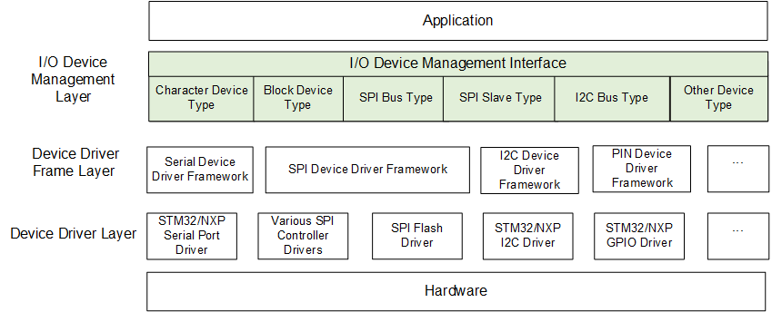
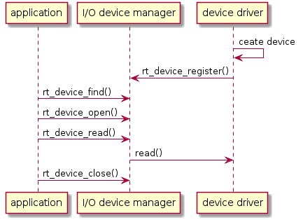
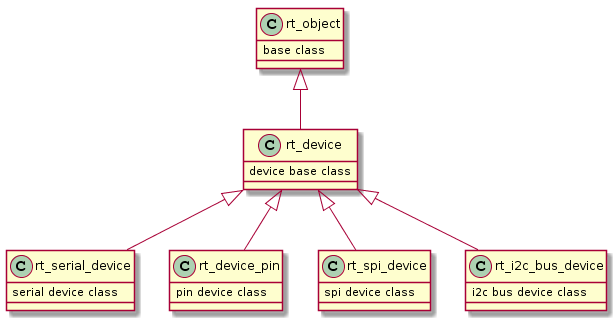
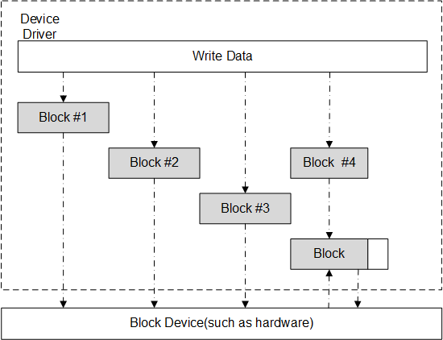

# I/O Device Framework

Most embedded systems include some I/O (Input/Output) devices, data displays on instruments, serial communication on industrial devices, Flash or SD cards for saving data on data acquisition devices,as well as Ethernet interfaces for network devices, are examples of I/O devices that are commonly seen in embedded systems.

This chapter describes how RT-Thread manages different I/O devices.

## I/O Device Introduction

### I/O Device Framework

RT-Thread provides a set of I/O device framework, as shown in the following figure. It is located between the hardware and the application. It is divided into three layers. From top to bottom, they are I/O device management layer, device driver framework layer, and device driver layer.



The application obtains the correct device driver through the I/O device management interface, and then uses this device driver to perform data (or control) interaction with the bottom I/O hardware device.

The I/O device management layer implements the encapsulation of device drivers. The application accesses the bottom devices through the standard interface provided by the I/O device layer. The upgrade and replacement of the device driver will not affect the upper layer application. In this way, the hardware-related code of the device can exist independently of the application, and both parties only need to pay attention to the respective function implementation, thereby reducing the coupling and complexity of the code and improving the reliability of the system.

The device driver framework layer is an abstraction of the same kind of hardware device driver. The same part of the same hardware device driver of different manufacturers is extracted, and the different parts are left out of interface, implemented by the driver.

The device driver layer is a set of programs that drive the hardware devices to work, enabling access to hardware devices. It is responsible for creating and registering I/O devices. For devices with simple operation logic, you can register devices directly into the I/O Device Manager without going through the device driver framework layer. The sequence diagram is as shown below. There are mainly two points:

* The device driver creates a device instance with hardware access capabilities based on the device model definition and registers the device with the  `rt_device_register()` interface in the I/O Device Manager.
* The application finds the device through the`rt_device_find()` interface and then uses the I/O device management interface to access the hardware.



For other devices, such as watchdog, the created device instance will be registered to the corresponding device driver framework, and then the device driver framework will register with the I/O device manager. The main points are as follows:

* The watchdog device driver creates a watchdog device instance with hardware access capability based on the watchdog device model definition and registers the watchdog device through the  `rt_hw_watchdog_register()` interface into the watchdog device driver framework.
* The watchdog device driver framework registers the watchdog device to the I/O Device Manager via the `rt_device_register()`  interface.
* The application accesses the watchdog device hardware through the I/O device management interface.

Usage of Watchdog device:


### I/O Device Model

The device model of RT-Thread is based on the kernel object model, which is considered a kind of objects and is included in the scope of the object manager. Each device object is derived from the base object. Each concrete device can inherit the properties of its parent class object and derive its own properties. The following figure is a schematic diagram of the inheritance and derivation relationship of device object.



The specific definitions of device objects are as follows:

```c
struct rt_device
{
    struct rt_object          parent;        /* kernel object base class */
    enum rt_device_class_type type;          /* device type */
    rt_uint16_t               flag;          /* device parameter */
    rt_uint16_t               open_flag;     /* device open flag */
    rt_uint8_t                ref_count;     /* number of times the device was cited */
    rt_uint8_t                device_id;     /* device ID,0 - 255 */

    /* data transceiving callback function */
    rt_err_t (*rx_indicate)(rt_device_t dev, rt_size_t size);
    rt_err_t (*tx_complete)(rt_device_t dev, void *buffer);

    const struct rt_device_ops *ops;    /* device operate methods */

    /* device's private data */
    void *user_data;
};
typedef struct rt_device *rt_device_t;

```

### I/O Device Type

RT-Thread supports multiple I/O device types, the main device types are as follows:

```c
RT_Device_Class_Char             /* character device       */
RT_Device_Class_Block            /* block device         */
RT_Device_Class_NetIf            /* network interface device    */
RT_Device_Class_MTD              /* memory device       */
RT_Device_Class_RTC              /* RTC device        */
RT_Device_Class_Sound            /* sound device        */
RT_Device_Class_Graphic          /* graphic device        */
RT_Device_Class_I2CBUS           /* I2C bus device     */
RT_Device_Class_USBDevice        /* USB device */
RT_Device_Class_USBHost          /* USB host device   */
RT_Device_Class_SPIBUS           /* SPI bus device     */
RT_Device_Class_SPIDevice        /* SPI device        */
RT_Device_Class_SDIO             /* SDIO device       */
RT_Device_Class_Miscellaneous    /* miscellaneous devices       */
```

Character devices and block devices are commonly used device types, and their classification is based on the transmission processing between device data and the system. Character mode devices allow for unstructured data transfers, that is, data usually transfers in the form of serial, one byte at a time. Character devices are usually simple devices such as serial ports and buttons.

A block device transfers one data block at a time, for example 512 bytes data at a time. This data block is enforced by the hardware. Data blocks may use some type of data interface or some mandatory transport protocol, otherwise an error may occur. Therefore, sometimes the block device driver must perform additional work on read or write operations, as shown in the following figure:



When the system serves a write operation with a large amount of data, the device driver must first divide the data into multiple packets, each with the data size specified by the device. In the actual process, the last part of the data size may be smaller than the normal device block size. Each block in the above figure is written to the device using a separate write request, and the first three are directly written. However, the last data block size is smaller than the device block size, and the device driver must process the last data block differently than the first 3 blocks. Normally, the device driver needs to first perform a read operation of the corresponding device block, then overwrite the write data onto the read data, and then write the "composited" data block back to the device as a whole block. . For example, for block 4 in the above figure, the driver needs to read out the device block corresponding to block 4, and then overwrite the data to be written to the data read from the device block, and merge them into a new block. Finally write back to the block device.

## Create and Register I/O Device

The driver layer is responsible for creating device instances and registering them in the I/O Device Manager. You can create device instances in a statically declared manner or dynamically create them with the following interfaces:

```c
rt_device_t rt_device_create(int type, int attach_size);
```

|**Parameters**  |**Description**                          |
|-------------|-------------------------------------|
| type        | device type, the device type values listed in "I/O Device Type" section can be used here |
| attach_size | user data size         |
|**Return**  | --                         |
| Device Handle | Create successfully        |
| RT_NULL     | Creation failed, dynamic memory allocation failed |

When this interface is called, the system allocates a device control block from the dynamic heap memory, the size of which is the sum of `struct rt_device` and `attach_size`, and the type of the device is set by the parameter type. After the device is created, implementing its access to the hardware is needed.

```c
struct rt_device_ops
{
    /* common device interface */
    rt_err_t  (*init)   (rt_device_t dev);
    rt_err_t  (*open)   (rt_device_t dev, rt_uint16_t oflag);
    rt_err_t  (*close)  (rt_device_t dev);
    rt_ssize_t (*read)  (rt_device_t dev, rt_off_t pos, void *buffer, rt_size_t size);
    rt_ssize_t (*write) (rt_device_t dev, rt_off_t pos, const void *buffer, rt_size_t size);
    rt_err_t  (*control)(rt_device_t dev, int cmd, void *args);
};

```

A description of each method of operation is shown in the following table:

|**Method Name**|**Method Description**       |
|----|-----------------------|
| init   | Initialize the device. After the device is initialized, the flag of the device control block is set to the active state(RT_DEVICE_FLAG_ACTIVATED). If the flag in the device control block has been set to the active state, then the initialization interface will be returned immediately when running again, and will not be re-initialized. |
| open   | Open the device. Some devices are not started when the system is started, or the device needs to send and receive data. However, if the upper application is not ready, the device should not be enabled by default and start receiving data. Therefore, it is recommended to enable the device when calling the open interface when writing the bottom driver. |
| close  | Close the device. When the device is open, the device control block maintains an open count, the count will add 1 when the device is opended, and the count will  subtract 1 when the device is closed, and a real shutdown operation is operated when the counter turns to 0. |
| read    | Read data from the device. The parameter pos is the offset of the read data, but some devices do not necessarily need to specify the offset, such as serial devices, the device driver should ignore this parameter. But for block devices, pos and size are measured in the block size of the block device. For example, the block size of the block device is 512 byte, and in the parameter pos = 10, size = 2, then the driver should return the 10th block in the device (starting from the 0th block) for a total of 2 blocks of data. The type returned by this interface is rt_size_t, which is the number of bytes read or the number of blocks. Normally, the value of size in the parameter should be returned. If it returns zero, set the corresponding errno value. |
| write   | Write data to the device. The parameter pos is the offset of the write data. Similar to read operations, for block devices, pos and size are measured in the block size of the block device. The type returned by this interface is rt_size_t, which is the number of bytes or blocks of data actually written. Normally, the value of size in the parameter should be returned. If it returns zero, set the corresponding errno value. |
| control | Control the device according to the cmd command. Commands are often implemented by the bottom device drivers. For example, the parameter RT_DEVICE_CTRL_BLK_GETGEOME means to get the size information of the block device. |

When a dynamically created device is no longer needed, it can be destroyed using the following function:

```c
void rt_device_destroy(rt_device_t device);
```

|**Parameters**|**Description**|
|----------|----------|
| device   | device handle |

After the device is created, it needs to be registered to the I/O Device Manager for the application to access. The functions for registering the device are as follows:

```c
rt_err_t rt_device_register(rt_device_t dev, const char* name, rt_uint8_t flags);
```

|**Parameters** |**Description**   |
|------------|-----------------------|
| dev        | device handle |
| name       | device name, the maximum length of the device name is specified by the macro RT_NAME_MAX defined in rtconfig.h, and the extra part is automatically truncated |
| flags      | device mode flag |
|**Return** | --                           |
| RT_EOK     | registration success |
| -RT_ERROR | registration failed, dev is empty or name already exists |

>It should be avoided to repeatedly register registered devices and to register devices with the same name.

flags parameters support the following parameters (multiple parameters can be supported in OR logic):

```c
#define RT_DEVICE_FLAG_RDONLY       0x001 /* read only */
#define RT_DEVICE_FLAG_WRONLY       0x002 /* write only  */
#define RT_DEVICE_FLAG_RDWR         0x003 /* read and write  */
#define RT_DEVICE_FLAG_REMOVABLE    0x004 /* can be removed  */
#define RT_DEVICE_FLAG_STANDALONE   0x008 /* stand alone   */
#define RT_DEVICE_FLAG_SUSPENDED    0x020 /* suspended  */
#define RT_DEVICE_FLAG_STREAM       0x040 /* stream mode  */
#define RT_DEVICE_FLAG_INT_RX       0x100 /* interrupt reception */
#define RT_DEVICE_FLAG_DMA_RX       0x200 /* DMA reception */
#define RT_DEVICE_FLAG_INT_TX       0x400 /* interrupt sending */
#define RT_DEVICE_FLAG_DMA_TX       0x800 /* DMA sending */
```

Device Stream Mode The RT_DEVICE_FLAG_STREAM parameter is used to output a character string to the serial terminal: when the output character is `\n` , it automatically fills in a `\r` to make a branch.

Successfully registered devices can use the `list_device`  command on the FinSH command line to view all device information in the system, including the device name, device type, and number of times the device is opened:

```c
msh />list_device
device           type         ref count
-------- -------------------- ----------
e0       Network Interface    0
sd0      Block Device         1
rtc      RTC                  0
uart1    Character Device     0
uart0    Character Device     2
msh />
```

When the device is logged off, the device will be removed from the device manager and the device will no longer be found through the device. Logging out of the device does not release the memory occupied by the device control block. The function to log off of the device is as follows:

```c
rt_err_t rt_device_unregister(rt_device_t dev);
```

|**Parameters**|**Description**|
|----------|----------|
| dev      | device handle |
|**Return**| --   |
| RT_EOK   | successful |

The following code is an example of registering a watchdog device. After calling the  `rt_hw_watchdog_register()` interface, the device is registered to the I/O Device Manager via the `rt_device_register()` interface.

```c
const static struct rt_device_ops wdt_ops =
{
    rt_watchdog_init,
    rt_watchdog_open,
    rt_watchdog_close,
    RT_NULL,
    RT_NULL,
    rt_watchdog_control,
};

rt_err_t rt_hw_watchdog_register(struct rt_watchdog_device *wtd,
                                 const char                *name,
                                 rt_uint32_t                flag,
                                 void                      *data)
{
    struct rt_device *device;
    RT_ASSERT(wtd != RT_NULL);

    device = &(wtd->parent);

    device->type        = RT_Device_Class_Miscellaneous;
    device->rx_indicate = RT_NULL;
    device->tx_complete = RT_NULL;

    device->ops         = &wdt_ops;
    device->user_data   = data;

    /* register a character device */
    return rt_device_register(device, name, flag);
}

```

## Access I/O Devices

The application accesses the hardware device through the I/O device management interface, which is accessible to the application when the device driver is implemented. The mapping relationship between the I/O device management interface and the operations on the I/O device is as follows:


### Find Device

The application obtains the device handle based on the device name, which in turn allows the device to operate. To find device, use function below:

```c
rt_device_t rt_device_find(const char* name);
```

|**Parameters**|**Description**                         |
|----------|------------------------------------|
| name     | device name                |
|**Return**| --                             |
| device handle | finding the corresponding device will return the corresponding device handle |
| RT_NULL  | no corresponding device object found |

### Initialize Device

Once the device handle is obtained, the application can initialize the device using the following functions:

```c
rt_err_t rt_device_init(rt_device_t dev);
```

|**Parameters**|**Description**     |
|----------|----------------|
| dev      | device handle |
|**Return**| --         |
| RT_EOK   | device initialization succeeded |
| Error Code | device initialization failed |

>When a device has been successfully initialized, calling this interface will not repeat initialization.

### Open and Close Device

Through the device handle, the application can open and close the device. When the device is opened, it will detect whether the device has been initialized. If it is not initialized, it will call the initialization interface to initialize the device by default. Open the device with the following function:

```c
rt_err_t rt_device_open(rt_device_t dev, rt_uint16_t oflags);
```

|**Parameters** |**Description**                          |
|------------|-----------------------------|
| dev        | device handle             |
| oflags     | open device in oflag mode |
|**Return** | --                       |
| RT_EOK     | device successfully turned on |
|-RT_EBUSY | device will not allow being repeated opened if the RT_DEVICE_FLAG_STANDALONE parameter is included in the parameters specified when the device is registered. |
| Other Error Code | device failed to be turned on |

oflags supports the following parameters:

```c
#define RT_DEVICE_OFLAG_CLOSE 0x000   /* device was already closed(internal use)*/
#define RT_DEVICE_OFLAG_RDONLY 0x001  /* open the device in read-only mode */
#define RT_DEVICE_OFLAG_WRONLY 0x002  /* open the device in write-only mode */
#define RT_DEVICE_OFLAG_RDWR 0x003    /* open the device in read-and_write mode */
#define RT_DEVICE_OFLAG_OPEN 0x008    /* device was already closed(internal use) */
#define RT_DEVICE_FLAG_STREAM 0x040   /* open the device in stream mode */
#define RT_DEVICE_FLAG_INT_RX 0x100   /* open the device in interrupt reception mode */
#define RT_DEVICE_FLAG_DMA_RX 0x200   /* open the device in DMA mode */
#define RT_DEVICE_FLAG_INT_TX 0x400   /* open the device in interrupt sending mode */
#define RT_DEVICE_FLAG_DMA_TX 0x800   /* open the device in DMA mode */
```

>If the upper application needs to set the device's receive callback function, it must open the device as RT_DEVICE_FLAG_INT_RX or RT_DEVICE_FLAG_DMA_RX, otherwise the callback function will not be called.

After the application opens the device to complete reading and writing, if no further operations are needed, you can close the device using the following functions:

```c
rt_err_t rt_device_close(rt_device_t dev);
```

|**Parameters** |**Description**                         |
|------------|------------------------------------|
| dev        | device handle              |
|**Return** | --                             |
| RT_EOK     | device successfully closed |
| \-RT_ERROR | device has been completely closed and cannot be closed repeatedly |
| Other Error Code | failed to close device |

>Device interfaces `rt_device_open()` and  `rt_device_close()` need to used in pairs. Open a device requires close the device, so that the device will be completely closed, otherwise the device will remain on.

### Control Device

By commanding the control word, the application can also control the device with the following function:

```c
rt_err_t rt_device_control(rt_device_t dev, rt_uint8_t cmd, void* arg);
```

|**Parameters**  |**Description**                                 |
|-------------|--------------------------------------------|
| dev         | device handle                     |
| cmd         | command control word, this parameter is usually related to the device driver |
| arg         | controlled parameter            |
|**Return**  | --                                     |
| RT_EOK      | function executed successfully |
| -RT_ENOSYS | execution failed, dev is empty |
| Other Error Code | execution failed                   |

The generic device command for the parameter `cmd` can be defined as follows:

```c
#define RT_DEVICE_CTRL_RESUME           0x01   /* resume device */
#define RT_DEVICE_CTRL_SUSPEND          0x02   /* suspend device */
#define RT_DEVICE_CTRL_CONFIG           0x03   /* configure device */
#define RT_DEVICE_CTRL_SET_INT          0x10   /* set interrupt */
#define RT_DEVICE_CTRL_CLR_INT          0x11   /* clear interrupt */
#define RT_DEVICE_CTRL_GET_INT          0x12   /* obtain interrupt status */
```

### Read and Write Device

Application can read data from the device by the following function:

```c
rt_size_t rt_device_read(rt_device_t dev, rt_off_t pos,void* buffer, rt_size_t size);
```

|**Parameters**         |**Description**                      |
|--------------------|--------------------------------|
| dev             | device handle         |
| pos                | read data offset    |
| buffer             | memory buffer pointer, the data read will be saved in the buffer |
| size               | size of the data read |
|**Return**         | --                      |
| Actual Size of the Data Read | If it is a character device, the return size is in bytes. If it is a block device, the returned size is in block units. |
| 0       | need to read the current thread's errno to determine the error status |

Calling this function will read the data from the dev device and store it in the buffer. The maximum length of this buffer is *size*, and *pos* has different meanings depending on the device class.

Writing data to the device can be done by the following function:

```c
rt_size_t rt_device_write(rt_device_t dev, rt_off_t pos,const void* buffer, rt_size_t size);
```

|**Parameters**         |**Description**                      |
|--------------------|--------------------------------|
| dev                | device handle         |
| pos                | write data offset     |
| buffer             | memory buffer pointer, placing the data to be written in |
| size               | size of the written data |
|**Return**         | --                    |
| Actual Size of the Data Written | If it is a character device, the return size is in bytes. If it is a block device, the returned size is in block units. |
| 0       | need to read the current thread's errno to determine the error status |

Calling this function will write the data in the buffer to the *dev* device . The maximum length of the written data is *size*, and *pos* has different meanings depending on the device class.

### Data Transceiving and Call-back

When the hardware device receives the data, the following function can be used to call back another function to set the data receiving indication to notify the upper application thread that the data arrives:

```c
rt_err_t rt_device_set_rx_indicate(rt_device_t dev, rt_err_t (*rx_ind)(rt_device_t dev,rt_size_t size));
```

|**Parameters**|**Description**   |
|----------|--------------|
| dev      | device handle |
| rx_ind   | callback function pointer |
|**Return**| --      |
| RT_EOK   | set successfully |

The callback of this function will be provided by the user. When the hardware device receives the data, it will perform the callback function and pass the received data length to the upper layer application in the *size* parameter. The upper application thread should read the data from the device as soon as it receives the indication.

When the application calls `rt_device_write()` to write data, if the bottom hardware can support automatic sending, the upper application can set a callback function. This callback function is called after the bottom hardware data has been sent (for example, when the DMA transfer is complete or the FIFO has been written to complete, triggered interrupt). Use the following function to set the device with a send completion indication. The function parameters and return values are as follows:

```c
rt_err_t rt_device_set_tx_complete(rt_device_t dev, rt_err_t (*tx_done)(rt_device_t dev,void *buffer));
```

|**Parameters**|**Description**   |
|----------|--------------|
| dev      | device handle |
| tx_done  | callback function pointer |
|**Return**| --       |
| RT_EOK   | set successfully |

When this function is called, the callback function is provided by the user. When the hardware device sends the data, the driver calls back the function and passes the sent data block address buffer as a parameter to the upper application. When the upper layer application (thread) receives the indication, it will release the buffer memory block or use it as the buffer for the next write data according to the condition of sending the buffer.

### Access Device Sample

The following code is an example of accessing a device. First, find the watchdog device through the  `rt_device_find()` port, obtain the device handle, then initialize the device through the `rt_device_init()`  port, and set the watchdog device timeout through the `rt_device_control()`port.

```c
#include <rtthread.h>
#include <rtdevice.h>

#define IWDG_DEVICE_NAME    "iwg"

static rt_device_t wdg_dev;

static void idle_hook(void)
{
    /* feed the dog in the callback function of the idle thread */
    rt_device_control(wdg_dev, RT_DEVICE_CTRL_WDT_KEEPALIVE, NULL);
    rt_kprintf("feed the dog!\n ");
}

int main(void)
{
    rt_err_t res = RT_EOK;
    rt_uint32_t timeout = 1000;    /* timeout */

    /* find the watchdog device based on the device name, and obtain the device handle */
    wdg_dev = rt_device_find(IWDG_DEVICE_NAME);
    if (!wdg_dev)
    {
        rt_kprintf("find %s failed!\n", IWDG_DEVICE_NAME);
        return RT_ERROR;
    }
    /* initialize device */
    res = rt_device_init(wdg_dev);
    if (res != RT_EOK)
    {
        rt_kprintf("initialize %s failed!\n", IWDG_DEVICE_NAME);
        return res;
    }
    /* set watchdog timeout */
    res = rt_device_control(wdg_dev, RT_DEVICE_CTRL_WDT_SET_TIMEOUT, &timeout);
    if (res != RT_EOK)
    {
        rt_kprintf("set %s timeout failed!\n", IWDG_DEVICE_NAME);
        return res;
    }
    /* set idle thread callback function */
    rt_thread_idle_sethook(idle_hook);

    return res;
}
```

