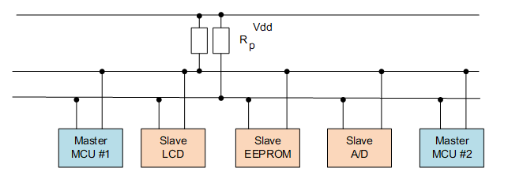
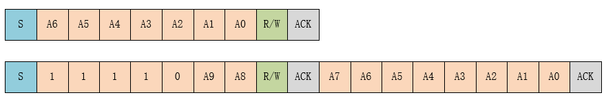

# I2C Bus Device

## Introduction of I2C

The I2C (Inter Integrated Circuit) bus is a half-duplex, bidirectional two-wire synchronous serial bus developed by PHILIPS. The I2C bus has only two signal lines, one is the bidirectional data line SDA (serial data), and the other is the bidirectional clock line SCL (serial clock). The SPI bus has two lines for receiving data and transmitting data between the master and slave devices, while the I2C bus uses only one line for data transmission and reception.

Like SPI, I2C works in a master-slave manner. Unlike SPI-master-multi-slave architecture, it allows multiple master devices to exist at the same time. Each device connected to the bus has a unique address, and the master device initiates data transfer, and generates a clock signal. The slave device is addressed by the master device, and only one master device is allowed at a time. As shown below:



The main data transmission format of the I2C bus is shown in the following figure:


When the bus is idle, both SDA and SCL are in a high state. When the host wants to communicate with a slave, it will send a start condition first, then send the slave address and read and write control bits, and then transfer the data (host send or receive data). The host will send a stop condition when the data transfer ends. Each byte transmitted is 8 bits, with the high bit first and the low bit last. The different terms in the data transmission process are as follows:

* **Starting Condition：** When SCL is high, the host pulls SDA low, indicating that data transfer is about to begin.

* **Slave Address：** The first byte sent by the master is the slave address, the upper 7 bits are the address, the lowest bit is the R/W read/write control bit, R/W bit equals to 1 means the read operation, and 0 means the write operation. The general slave address has 7-bit address mode and 10-bit address mode. In the 10-bit address mode, the first 7 bits of the first byte are a combination of 11110XX, where the last two bits (XX) are two highest 10-bit addresses. The second byte is the remaining 8 bits of the 10-bit slave address, as shown in the following figure:



* **Answer Signal：** Each time a byte of data is transmitted, the receiver needs to reply with an ACK (acknowledge). The slave sends an ACK when writing data and the ACK by the host when reading data. When the host reads the last byte of data, it can send NACK (Not acknowledge) and then stop the condition.

* **Data：** After the slave address is sent, some commands may be sent, depending on the slave, and then the data transmission starts, and is sent by the master or the slave. Each data is 8 bits, and the number of bytes of data is not limited.

* **Repeat Start Condition：** In a communication process, when the host may need to transfer data with different slaves or need to switch read and write operations, the host can send another start condition.

* **Stop Condition：** When SDA is low, the master pulls SCL high and stays high, then pulls SDA high to indicate the end of the transfer.

## Access to I2C Bus Devices

In general, the MCU's I2C device communicates as a master and slave. In the RT-Thread, the I2C master is virtualized as an I2C bus device. The I2C slave communicates with the I2C bus through the I2C device interface. The related interfaces are as follows:

| **Function** | **Description**                |
| --------------- | ---------------------------------- |
| rt_device_find()  | Find device handles based on I2C bus device name |
| rt_i2c_transfer() | transfer data |

### Finding I2C Bus Device

Before using the I2C bus device, you need to obtain the device handle according to the I2C bus device name, so that you can operate the I2C bus device. The device function is as follows.

```c
rt_device_t rt_device_find(const char* name);
```

| Parameter | Description                |
| -------- | ---------------------------------- |
| name     | I2C bus device name      |
| **Return Value** | ——                                 |
| device handle | Finding the corresponding device will return the corresponding device handle |
| RT_NULL  | No corresponding device object found |

In general, the name of the I2C device registered to the system is i2c0, i2c1, etc. The usage examples are as follows:

```c
#define AHT10_I2C_BUS_NAME      "i2c1"  /* Sensor connected I2C bus device name */
struct rt_i2c_bus_device *i2c_bus;      /* I2C bus device handle */

/* Find the I2C bus device and get the I2C bus device handle */
i2c_bus = (struct rt_i2c_bus_device *)rt_device_find(name);
```

### Data Transmission

You can use `rt_i2c_transfer()` for data transfer by getting the I2C bus device handle. The function prototype is as follows:

```c
rt_size_t rt_i2c_transfer(struct rt_i2c_bus_device *bus,
                          struct rt_i2c_msg         msgs[],
                          rt_uint32_t               num);
```

| Parameter | Description  |
|--------------------|----------------------|
| bus                | I2C bus device handle |
| msgs[]             | Message array pointer to be transmitted |
| num                | The number of elements in the message array |
| **Return Value** | ——                   |
| the number of elements in the message array | succeeded         |
| error code    | failed           |

Like the custom transport interface of the SPI bus, the data transmitted by the custom transport interface of the I2C bus is also in units of one message. The parameter msgs[] points to the array of messages to be transmitted. The user can customize the content of each message to implement two different data transmission modes supported by the I2C bus. If the master needs to send a repeat start condition, it will need to send 2 messages.

>This function will call rt_mutex_take(), which cannot be called inside the interrupt service routine, which will cause assertion to report an error.

The prototypes of the I2C message data structure are as follows:

```c
struct rt_i2c_msg
{
    rt_uint16_t addr;    /* Slave address */
    rt_uint16_t flags;   /* Reading, writing signs, etc. */
    rt_uint16_t len;     /* Read and write data bytes */
    rt_uint8_t  *buf;    /* Read and write data buffer pointer　*/
}
```

Slave address (addr): Supports 7-bit and 10-bit binary addresses. You need to view the data sheets of different devices.

>The slave address used by the RT-Thread I2C device interface does not contain read/write bits. The read/write bit control needs to modify the flag `flags`.

The flags `flags` can be defined as macros that can be combined with other macros using the bitwise operation "|" as needed.

```c
#define RT_I2C_WR              0x0000        /* Write flag */
#define RT_I2C_RD              (1u << 0)     /* Read flag */
#define RT_I2C_ADDR_10BIT      (1u << 2)     /* 10-bit address mode */
#define RT_I2C_NO_START        (1u << 4)     /* No start condition */
#define RT_I2C_IGNORE_NACK     (1u << 5)     /* Ignore NACK */
#define RT_I2C_NO_READ_ACK     (1u << 6)     /* Do not send ACK when reading */
```

Examples of use are as follows:

```c
#define AHT10_I2C_BUS_NAME      "i2c1"  /* Sensor connected I2C bus device name */
#define AHT10_ADDR               0x38   /* Slave address */
struct rt_i2c_bus_device *i2c_bus;      /* I2C bus device handle */

/* Find the I2C bus device and get the I2C bus device handle */
i2c_bus = (struct rt_i2c_bus_device *)rt_device_find(name);

/* Read sensor register data */
static rt_err_t read_regs(struct rt_i2c_bus_device *bus, rt_uint8_t len, rt_uint8_t *buf)
{
    struct rt_i2c_msg msgs;

    msgs.addr = AHT10_ADDR;     /* Slave address */
    msgs.flags = RT_I2C_RD;     /* Read flag */
    msgs.buf = buf;             /* Read and write data buffer pointer　*/
    msgs.len = len;             /* Read and write data bytes */

    /* Call the I2C device interface to transfer data */
    if (rt_i2c_transfer(bus, &msgs, 1) == 1)
    {
        return RT_EOK;
    }
    else
    {
        return -RT_ERROR;
    }
}
```

## I2C Bus Device Usage Example

The specific usage of the I2C device can be referred to the following sample code. The main steps of the sample code are as follows:

1. First find the I2C name based on the I2C device name, get the device handle, and then initialize the aht10 sensor.
2. The two functions that control the sensor are the write sensor register `write_reg()` and the read sensor register `read_regs()`, both called `rt_i2c_transfer()` to transfer the data. The function `read_temp_humi()` calls the above two functions to read the temperature and humidity information.

```c
/*
 * Program listing: This is an I2C device usage routine
 * The routine exports the i2c_aht10_sample command to the control terminal
 * Command call format: i2c_aht10_sample i2c1
 * Command explanation: The second parameter of the command is the name of the I2C bus device to be used. If it is empty, the default I2C bus device is used.
 * Program function: read the temperature and humidity data of the aht10 sensor and print.
*/

#include <rtthread.h>
#include <rtdevice.h>

#define AHT10_I2C_BUS_NAME          "i2c1"  /* Sensor connected I2C bus device name */
#define AHT10_ADDR                  0x38    /* Slave address */
#define AHT10_CALIBRATION_CMD       0xE1    /* Calibration command */
#define AHT10_NORMAL_CMD            0xA8    /* General command */
#define AHT10_GET_DATA              0xAC    /* Get data command */

static struct rt_i2c_bus_device *i2c_bus = RT_NULL;     /* I2C bus device handle */
static rt_bool_t initialized = RT_FALSE;                /* Sensor initialization status */

/* Write sensor register */
static rt_err_t write_reg(struct rt_i2c_bus_device *bus, rt_uint8_t reg, rt_uint8_t *data)
{
    rt_uint8_t buf[3];
    struct rt_i2c_msg msgs;

    buf[0] = reg; //cmd
    buf[1] = data[0];
    buf[2] = data[1];

    msgs.addr = AHT10_ADDR;
    msgs.flags = RT_I2C_WR;
    msgs.buf = buf;
    msgs.len = 3;

    /* Call the I2C device interface to transfer data */
    if (rt_i2c_transfer(bus, &msgs, 1) == 1)
    {
        return RT_EOK;
    }
    else
    {
        return -RT_ERROR;
    }
}

/* Read sensor register data */
static rt_err_t read_regs(struct rt_i2c_bus_device *bus, rt_uint8_t len, rt_uint8_t *buf)
{
    struct rt_i2c_msg msgs;

    msgs.addr = AHT10_ADDR;
    msgs.flags = RT_I2C_RD;
    msgs.buf = buf;
    msgs.len = len;

    /* Call the I2C device interface to transfer data */
    if (rt_i2c_transfer(bus, &msgs, 1) == 1)
    {
        return RT_EOK;
    }
    else
    {
        return -RT_ERROR;
    }
}

static void read_temp_humi(float *cur_temp, float *cur_humi)
{
    rt_uint8_t temp[6];

    write_reg(i2c_bus, AHT10_GET_DATA, 0);      /* send command */
    rt_thread_mdelay(400);
    read_regs(i2c_bus, 6, temp);                /* obtian sensor data */

    /* Humidity data conversion */
    *cur_humi = (temp[1] << 12 | temp[2] << 4 | (temp[3] & 0xf0) >> 4) * 100.0 / (1 << 20);
    /* Temperature data conversion */
    *cur_temp = ((temp[3] & 0xf) << 16 | temp[4] << 8 | temp[5]) * 200.0 / (1 << 20) - 50;
}

static void aht10_init(const char *name)
{
    rt_uint8_t temp[2] = {0, 0};

    /* Find the I2C bus device and get the I2C bus device handle */
    i2c_bus = (struct rt_i2c_bus_device *)rt_device_find(name);

    if (i2c_bus == RT_NULL)
    {
        rt_kprintf("can't find %s device!\n", name);
    }
    else
    {
        write_reg(i2c_bus, AHT10_NORMAL_CMD, temp);
        rt_thread_mdelay(400);

        temp[0] = 0x08;
        temp[1] = 0x00;
        write_reg(i2c_bus, AHT10_CALIBRATION_CMD, temp);
        rt_thread_mdelay(400);
        initialized = RT_TRUE;
    }
}

static void i2c_aht10_sample(int argc, char *argv[])
{
    float humidity, temperature;
    char name[RT_NAME_MAX];

    humidity = 0.0;
    temperature = 0.0;

    if (argc == 2)
    {
        rt_strncpy(name, argv[1], RT_NAME_MAX);
    }
    else
    {
        rt_strncpy(name, AHT10_I2C_BUS_NAME, RT_NAME_MAX);
    }

    if (!initialized)
    {
        /* Sensor initialization */
        aht10_init(name);
    }
    if (initialized)
    {
        /* Read temperature and humidity data */
        read_temp_humi(&temperature, &humidity);

        rt_kprintf("read aht10 sensor humidity   : %d.%d %%\n", (int)humidity, (int)(humidity * 10) % 10);
        rt_kprintf("read aht10 sensor temperature: %d.%d \n", (int)temperature, (int)(temperature * 10) % 10);
    }
    else
    {
        rt_kprintf("initialize sensor failed!\n");
    }
}
/* Export to the msh command list */
MSH_CMD_EXPORT(i2c_aht10_sample, i2c aht10 sample);
```

