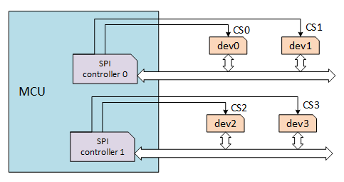

# SPI Device

## Introduction to SPI

SPI (Serial Peripheral Interface) is a high-speed, full-duplex, synchronous communication bus commonly used for short-range communication. It is mainly used in EEPROM, FLASH, real-time clock, AD converter, and digital signal processing and between the device and the digital signal decoder. SPI generally uses 4 lines of communication, as shown in the following figure:


* MOSI :SPI Bus Master Output/Slave Input.

* MISO :SPI Bus Master Input/Slave Output.

* SCLK :Serial Clock, Master device outputs clock signal to slave device.

* CS : select the slave device, also called SS, CSB, CSN, EN, etc., the master device outputs a chip select signal to the slave device.

The SPI works in master-slave mode and usually has one master and one or more slaves. The communication is initiated by the master device. The master device selects the slave device to communicate through CS, and then provides a clock signal to the slave device through SCLK. The data is output to the slave device through the MOSI, and the data sent by the slave device is received through the MISO.

As shown in the figure below, the chip has two SPI controllers. The SPI controller corresponds to the SPI master. Each SPI controller can connect multiple SPI slaves. The slave devices mounted on the same SPI controller share three signal pins: SCK, MISO, MOSI, but the CS pins of each slave device are independent.



The master device selects the slave device by controlling the CS pin, typically active low. Only one CS pin is active on an SPI master, and the slave connected to the active CS pin can now communicate with the master.

The slave's clock is provided by the master through SCLK, and MOSI and MISO complete the data transfer based on SCLK. The working timing mode of the SPI is determined by the phase relationship between CPOL (Clock Polarity) and CPHA (Clock Phase). CPOL represents the state of the initial level of the clock signal. A value of 0 indicates that the initial state of the clock signal is low, and a value of 1 indicates that the initial level of the clock signal is high. CPHA indicates on which clock edge the data is sampled. A value of 0 indicates that the data is sampled on the first clock change edge, and a value of 1 indicates that the data is sampled on the second clock change edge. There are 4 working timing modes according to different combinations of CPOL and CPHA: ①CPOL=0, CPHA=0; ②CPOL=0, CPHA=1; ③CPOL=1, CPHA=0; ④CPOL=1, CPHA=1. As shown below:


**QSPI:** QSPI is short for Queued SPI and is an extension of the SPI interface from Motorola, which is more extensive than SPI applications. Based on the SPI protocol, Motorola has enhanced its functionality, added a queue transfer mechanism, and introduced a queue serial peripheral interface protocol (QSPI protocol). Using this interface, users can transfer transmission queues containing up to 16 8-bit or 16-bit data at one time. Once the transfer is initiated, CPU is not required until the end of the transfer, greatly improving the transfer efficiency. Compared to SPI, the biggest structural feature of QSPI is the replacement of the transmit and receive data registers of the SPI with 80 bytes of RAM.

**Dual SPI Flash:** For SPI Flash, full-duplex is not commonly used. You can send a command byte into Dual mode and let it work in half-duplex mode to double data transfer. Thus, MOSI becomes SIO0 (serial io 0), and MISO becomes SIO1 (serial io 1), so that 2 bit data can be transmitted in one clock cycle, which doubles the data transmission.

**Quad SPI Flash:** Similar to the Dual SPI, Quad SPI Flash adds two I/O lines (SIO2, SIO3) to transfer 4 bits of data in one clock.

So for SPI Flash, there are three types of standard SPI Flash, Dual SPI Flash, Quad SPI Flash. At the same clock, the higher the number of lines, the higher the transmission rate.

## Mount SPI Device

The SPI driver registers the SPI bus and the SPI device needs to be mounted to the SPI bus that has already been registered.

```C
rt_err_t rt_spi_bus_attach_device(struct rt_spi_device *device,
                                  const char           *name,
                                  const char           *bus_name,
                                  void                 *user_data)
```

| **Parameter** | Description                |
| -------- | ---------------------------------- |
| device     | SPI device handle                  |
| name     |  SPI device name                  |
| bus_name     | SPI bus name                  |
| user_data     | user data pointer                |
| **Return** | ——                                 |
| RT_EOK     | Success     |
| Other Errors | Failure |

This function is used to mount an SPI device to the specified SPI bus, register the SPI device with the kernel, and save user_data to the control block of the SPI device.

The general SPI bus naming principle is spix, and the SPI device naming principle is spixy. For example, spi10 means device 0 mounted on the spi1 bus. User_data is generally the CS pin pointer of the SPI device. When data is transferred, the SPI controller will operate this pin for chip select.

If you use the BSP in the `rt-thread/bsp/stm32` directory, you can use the following function to mount the SPI device to the bus:

```c
rt_err_t rt_hw_spi_device_attach(const char *bus_name, const char *device_name, GPIO_TypeDef* cs_gpiox, uint16_t cs_gpio_pin);
```

The following sample code mounts the SPI FLASH W25Q128 to the SPI bus:

```c
static int rt_hw_spi_flash_init(void)
{
    __HAL_RCC_GPIOB_CLK_ENABLE();
    rt_hw_spi_device_attach("spi1", "spi10", GPIOB, GPIO_PIN_14);

    if (RT_NULL == rt_sfud_flash_probe("W25Q128", "spi10"))
    {
        return -RT_ERROR;
    };

    return RT_EOK;
}
/* Export to automatic initialization */
INIT_COMPONENT_EXPORT(rt_hw_spi_flash_init);
```

## Configuring SPI Device

The SPI device's transmission parameters need to be configured after the SPI device is mounted to the SPI bus.

```c
rt_err_t rt_spi_configure(struct rt_spi_device *device,
                          struct rt_spi_configuration *cfg)
```

| **Parameter** | **Description**              |
| -------- | ---------------------------------- |
| device   | SPI device handle               |
| cfg      | SPI configuration parameter pointer |
| **Return** | ——                                 |
| RT_EOK     | Success       |

This function saves the configuration parameters pointed to by `cfg` to the control block of the SPI device device, which is used when transferring data.

The `struct rt_spi_configuration` prototype is as follows:

```c
struct rt_spi_configuration
{
    rt_uint8_t mode;        /* mode */
    rt_uint8_t data_width;  /* data width, 8 bits, 16 bits, 32 bits */
    rt_uint16_t reserved;   /* reserved */
    rt_uint32_t max_hz;     /* maximum frequency */
};
```

**Mode: **Contains MSB/LSB, master-slave mode, timing mode, etc. The available macro combinations are as follows:

```c
/* Set the data transmission order whether the MSB bit is first or the LSB bit is before */
#define RT_SPI_LSB      (0<<2)                        /* bit[2]: 0-LSB */
#define RT_SPI_MSB      (1<<2)                        /* bit[2]: 1-MSB */

/* Set the master-slave mode of the SPI */
#define RT_SPI_MASTER   (0<<3)                        /* SPI master device */
#define RT_SPI_SLAVE    (1<<3)                        /* SPI slave device */

/* Set clock polarity and clock phase */
#define RT_SPI_MODE_0   (0 | 0)                       /* CPOL = 0, CPHA = 0 */
#define RT_SPI_MODE_1   (0 | RT_SPI_CPHA)             /* CPOL = 0, CPHA = 1 */
#define RT_SPI_MODE_2   (RT_SPI_CPOL | 0)             /* CPOL = 1, CPHA = 0 */
#define RT_SPI_MODE_3   (RT_SPI_CPOL | RT_SPI_CPHA)   /* CPOL = 1, CPHA = 1 */

#define RT_SPI_CS_HIGH  (1<<4)                        /* Chipselect active high */
#define RT_SPI_NO_CS    (1<<5)                        /* No chipselect */
#define RT_SPI_3WIRE    (1<<6)                        /* SI/SO pin shared */
#define RT_SPI_READY    (1<<7)                        /* Slave pulls low to pause */
```

**Data width:** The data width format that can be sent and received by the SPI master and SPI slaves is set to 8-bit, 16-bit or 32-bit.

**Maximum Frequency：** Set the baud rate for data transfer, also based on the baud rate range at which the SPI master and SPI slaves operate.

The example for configuration is as follows:

```c
    struct rt_spi_configuration cfg;
    cfg.data_width = 8;
    cfg.mode = RT_SPI_MASTER | RT_SPI_MODE_0 | RT_SPI_MSB;
    cfg.max_hz = 20 * 1000 *1000;                           /* 20M */

    rt_spi_configure(spi_dev, &cfg);
```

## QSPI Configuration

To configure the transmission parameters of a QSPI device, use the following function:

```c
rt_err_t rt_qspi_configure(struct rt_qspi_device *device, struct rt_qspi_configuration *cfg);
```

| **Parameter** | **Description**                 |
| -------- | ---------------------------------- |
| device   | QSPI device handle           |
| cfg      | QSPI configuration parameter pointer |
| **Return** | ——                                 |
| RT_EOK     | Success       |

This function saves the configuration parameters pointed to by `cfg` to the control block of the QSPI device, which is used when transferring data.

The `struct rt_qspi_configuration` prototype is as follows:

```c
struct rt_qspi_configuration
{
    struct rt_spi_configuration parent;    /* SPI device configuration parent */
    rt_uint32_t medium_size;               /* medium size */
    rt_uint8_t ddr_mode;                   /* double rate mode */
    rt_uint8_t qspi_dl_width ;             /* QSPI bus width, single line mode 1 bit, 2 line mode 2 bits, 4 line mode 4 bits */
};
```

## Access SPI Device

In general, the MCU's SPI device communicates as a master and slave. In the RT-Thread, the SPI master is virtualized as an SPI bus device. The application uses the SPI device management interface to access the SPI slave device. The main interfaces are as follows:

| **Function** | **Description**                |
| -------------------- | ---------------------------------- |
| rt_device_find()  | Find device handles based on SPI device name |
| rt_spi_transfer_message()     | Custom transfer data |
| rt_spi_transfer()     | Transfer data once |
| rt_spi_send()     | Send data once |
| rt_spi_recv()     | Receive data one |
| rt_spi_send_then_send()  | Send data twice |
| rt_spi_send_then_recv()  | Send then Receive |

>The SPI data transfer related interface will call rt_mutex_take(). This function cannot be called in the interrupt service routine, which will cause the assertion to report an error.

### Find SPI Device

Before using the SPI device, you need to find and obtain the device handle according to the SPI device name, so that you can operate the SPI device. The device function is as follows.

```c
rt_device_t rt_device_find(const char* name);
```

| **Parameter** | **Description**                                              |
| ------------- | ------------------------------------------------------------ |
| name          | Device name                                                  |
| **Return**    | ——                                                           |
| device handle | Finding the corresponding device will return the corresponding device handle |
| RT_NULL       | Corresponding device object unfound                          |

In general, the name of the SPI device registered to the system is spi10, qspi10, etc. The usage examples are as follows:

```c
#define W25Q_SPI_DEVICE_NAME     "qspi10"   /* SPI device name */
struct rt_spi_device *spi_dev_w25q;     /* SPI device handle */

/* Find the spi device to get the device handle */
spi_dev_w25q = (struct rt_spi_device *)rt_device_find(W25Q_SPI_DEVICE_NAME);
```

### Transfer Custom Data

By obtaining the SPI device handle, the SPI device management interface can be used to access the SPI device device for data transmission and reception. You can transfer messages by the following function:

```c
struct rt_spi_message *rt_spi_transfer_message(struct rt_spi_device  *device,struct rt_spi_message *message)；
```

| **Parameter**    | **Description**                                              |
| ---------------- | ------------------------------------------------------------ |
| device           | SPI device handle                                            |
| message          | message pointer                                              |
| **Return**       | ——                                                           |
| RT_NULL          | Send successful                                              |
| Non-null pointer | Send failed, return a pointer to the remaining unsent message |

This function can transmit a series of messages, the user can customize the value of each parameter of the message structure to be transmitted, so that the data transmission mode can be conveniently controlled. The `struct rt_spi_message` prototype is as follows:

```c
struct rt_spi_message
{
    const void *send_buf;           /* Send buffer pointer */
    void *recv_buf;                 /* Receive buffer pointer */
    rt_size_t length;               /* Send/receive data bytes */
    struct rt_spi_message *next;    /* Pointer to the next message to continue sending */
    unsigned cs_take    : 1;        /* Take chip selection*/
    unsigned cs_release : 1;        /* Release chip selection */
};
```
send_buf :sendbuf is the send buffer pointer. When the value is RT_NULL, it means that the current transmission is only receiving state, and no data needs to be sent.

recv_buf :recvbuf is the receive buffer pointer. When the value is RT_NULL, it means that the current transmission is in the transmit-only state. It does not need to save the received data, so the received data is directly discarded.

length :The unit of length is word, that is, when the data length is 8 bits, each length occupies 1 byte; when the data length is 16 bits, each length occupies 2 bytes.

next :The parameter next is a pointer to the next message to continue to send. If only one message is sent, the value of this pointer is RT_NULL. Multiple messages to be transmitted are connected together in a singly linked list by the next pointer.

cs_take :A cs_take value of 1 means that the corresponding CS is set to a valid state before data is transferred.

cs_release :A cs_release value of 1 indicates that the corresponding CS is released after the data transfer ends.

>When send_buf or recv_buf is not empty, the available size for both cannot be less than length.
If you use this function to transfer messages, the first message sent by cs_take needs to be set to 1. Set the chip to be valid, and the cs_release of the last message needs to be set to 1. Release the chip select.

An example of use is as follows:

```c
#define W25Q_SPI_DEVICE_NAME     "qspi10"   /* SPI device name */
struct rt_spi_device *spi_dev_w25q;         /* SPI device handle */
struct rt_spi_message msg1, msg2;
rt_uint8_t w25x_read_id = 0x90;             /* command */
rt_uint8_t id[5] = {0};

/* Find the spi device to get the device handle */
spi_dev_w25q = (struct rt_spi_device *)rt_device_find(W25Q_SPI_DEVICE_NAME);
/* Send command to read ID */
struct rt_spi_message msg1, msg2;

msg1.send_buf   = &w25x_read_id;
msg1.recv_buf   = RT_NULL;
msg1.length     = 1;
msg1.cs_take    = 1;
msg1.cs_release = 0;
msg1.next       = &msg2;

msg2.send_buf   = RT_NULL;
msg2.recv_buf   = id;
msg2.length     = 5;
msg2.cs_take    = 0;
msg2.cs_release = 1;
msg2.next       = RT_NULL;

rt_spi_transfer_message(spi_dev_w25q, &msg1);
rt_kprintf("use rt_spi_transfer_message() read w25q ID is:%x%x\n", id[3], id[4]);
```

### Transfer Data Once

If only transfer data for once, use the following function:

```c
rt_size_t rt_spi_transfer(struct rt_spi_device *device,
                          const void           *send_buf,
                          void                  *recv_buf,
                          rt_size_t             length);
```

| **Parameter** | **Description**  |
|----------|----------------------|
| device   | SPI device handle |
| send_buf | Send data buffer pointer |
| recv_buf | Receive data buffer pointer |
| length   | Length of data send/received |
| **Return** | ——                   |
| 0   | Transmission failed |
| Non-0 Value | Length of data successfully transferred |

This function is equivalent to calling `rt_spi_transfer_message()` to transfer a message. When starting to send data, the chip is selected. When the function returns, the chip is released. The message parameter is configured as follows:

```c
struct rt_spi_message msg；

msg.send_buf   = send_buf;
msg.recv_buf   = recv_buf;
msg.length     = length;
msg.cs_take    = 1;
msg.cs_release = 1;
msg.next        = RT_NULL;
```

### Send Data Once

If only send data once and ignore the received data, use the following function:

```c
rt_size_t rt_spi_send(struct rt_spi_device *device,
                      const void           *send_buf,
                      rt_size_t             length)
```

| **Parameter** | **Description** |
|----------|--------------------|
| device   | SPI device handle |
| send_buf | Send data buffer pointer |
| length   | Length of data sent |
| **Return** | ——                 |
| 0    | Transmission failed |
| Non-0 Value | Length of data successfully transferred |

Call this function to send the data of the buffer pointed to by send_buf, ignoring the received data. This function is a wrapper of the `rt_spi_transfer()` function.

This function is equivalent to calling  `rt_spi_transfer_message()` to transfer a message. When the data starts to be sent, the chip is selected. When the function returns, the chip is released. The message parameter is configured as follows:

```c
struct rt_spi_message msg；

msg.send_buf   = send_buf;
msg.recv_buf   = RT_NULL;
msg.length     = length;
msg.cs_take    = 1;
msg.cs_release = 1;
msg.next       = RT_NULL;
```

### Receive Data Once

If only receive data once,  use the following function:

```c
rt_size_t rt_spi_recv(struct rt_spi_device *device,
                      void                 *recv_buf,
                      rt_size_t             length);
```

| **Parameter** | **Description** |
|----------|--------------------|
| device   | SPI device handle |
| recv_buf | Send data buffer pointer |
| length   | Length of data sent |
| **Return** | ——                 |
| 0    | Transmission failed |
| Non-0 Value | Length of data successfully transferred |

Call this function to receive the data and save it to the buffer pointed to by recv_buf. This function is a wrapper of the `rt_spi_transfer()` function. The SPI bus protocol stipulates that the master can only generate a clock, so when receiving data, the master will send the data 0XFF.

This function is equivalent to calling  `rt_spi_transfer_message()` to transfer a message. When receiving data, the chip is selected. When the function returns, the chip is released. The message parameter is configured as follows:

```c
struct rt_spi_message msg；

msg.send_buf   = RT_NULL;
msg.recv_buf   = recv_buf;
msg.length     = length;
msg.cs_take    = 1;
msg.cs_release = 1;
msg.next       = RT_NULL;
```

### Send Data Twice in Succession

If need to send data of 2 buffers in succession and the CS is not released within the process, you can call the following function:

```c
rt_err_t rt_spi_send_then_send(struct rt_spi_device *device,
                               const void           *send_buf1,
                               rt_size_t             send_length1,
                               const void           *send_buf2,
                               rt_size_t             send_length2);
```

| **Parameter** | **Description**        |
|--------------|---------------------------|
| device       | SPI device handle |
| send_buf1    | Send data buffer pointer 1 |
| send_length1 | Send data buffer length 1 |
| send_buf2    | Send data buffer pointer 2 |
| send_length2 | Send data buffer length 2 |
| **Return** | ——                        |
| RT_EOK       | Send Successful |
| -RT_EIO     | Send Failed        |

This function can continuously send data of 2 buffers, ignore the received data, select the CS when send_buf1 is sent, and release the CS after sending send_buf2.

This function is suitable for writing a piece of data to the SPI device, sending data such as commands and addresses for the first time, and sending data of the specified length for the second time. The reason is that it is sent twice instead of being merged into one data block, or `rt_spi_send()`is called twice, because in most data write operations, commands and addresses need to be sent first, and the length is usually only a few bytes. If send it in conjunction with the data that follows, it will need a memory space request and a lot of data handling. If `rt_spi_send()`is called twice, the chip select will be released after the command and address are sent. Most SPI devices rely on setting the chip select once to be the start of the command, so the chip selects the command or address after sending. After the data is released, the operation is discarded.

This function is equivalent to calling  `rt_spi_transfer_message()` to transfer 2 messages. The message parameter is configured as follows:

```c
struct rt_spi_message msg1,msg2；

msg1.send_buf   = send_buf1;
msg1.recv_buf   = RT_NULL;
msg1.length     = send_length1;
msg1.cs_take    = 1;
msg1.cs_release = 0;
msg1.next       = &msg2;

msg2.send_buf   = send_buf2;
msg2.recv_buf   = RT_NULL;
msg2.length     = send_length2;
msg2.cs_take    = 0;
msg2.cs_release = 1;
msg2.next       = RT_NULL;
```

### Receive Data After Sending Data

If need to send data to the slave device first, then receive the data sent from the slave device, and the CS is not released within the process, call the following function to implement:

```c
rt_err_t rt_spi_send_then_recv(struct rt_spi_device *device,
                               const void           *send_buf,
                               rt_size_t             send_length,
                               void                 *recv_buf,
                               rt_size_t             recv_length);
```

| **Parameter** | **Description**       |
|-------------|--------------------------|
| device      | SPI slave device handle |
| send_buf    | Send data buffer pointer |
| send_length | Send data buffer length |
| recv_buf | Receive data buffer pointer |
| recv_length | Receive data buffer length |
| **Return** | ——                       |
| RT_EOK      | Successful            |
| -RT_EIO    | Failed                |

This function select CS when sending the first data send_buf when the received data is ignored, and the second data is sent. At this time, the master device will send the data 0XFF, and the received data will be saved in recv_buf, and CS will be released when the function returns.

This function is suitable for reading a piece of data from the SPI slave device. The first time it will send some command and address data, and then receive the data of the specified length.

This function is equivalent to calling  `rt_spi_transfer_message()` to transfer 2 messages. The message parameter is configured as follows:

```c
struct rt_spi_message msg1,msg2；

msg1.send_buf   = send_buf;
msg1.recv_buf   = RT_NULL;
msg1.length     = send_length;
msg1.cs_take    = 1;
msg1.cs_release = 0;
msg1.next       = &msg2;

msg2.send_buf   = RT_NULL;
msg2.recv_buf   = recv_buf;
msg2.length     = recv_length;
msg2.cs_take    = 0;
msg2.cs_release = 1;
msg2.next       = RT_NULL;
```

The SPI device management module also provides  `rt_spi_sendrecv8()` and `rt_spi_sendrecv16()` functions, both are wrapper of the `rt_spi_send_then_recv()`. `rt_spi_sendrecv8()` sends a byte data and receives one byte data, and`rt_spi_sendrecv16()` sends 2 bytes. The section data receives 2 bytes of data at the same time.

## Access QSPI Device

The data transfer interface of QSPI is as follows:

| **P**arameter | **Description**                 |
| -------------------- | ----------------------------|
| rt_qspi_transfer_message()     | Transfer message |
| rt_qspi_send_then_recv()     | Send then receive |
| rt_qspi_send()               | Send data once |

>The QSPI data transfer related interface will call rt_mutex_take(). This function cannot be called in the interrupt service routine, which will cause the assertion to report an error.

### Transfer Data

Transfer messages by the following function:

```c
rt_size_t rt_qspi_transfer_message(struct rt_qspi_device  *device, struct rt_qspi_message *message);
```

| **Parameter** | **Description**                          |
|----------|--------------------------------------------|
| device   | QSPI device handle             |
| message  | Message pointer                     |
| **Return** | ——                                          |
| Actual transmitted message size |                      |

The message `structure struct rt_qspi_message` prototype is as follows:

```c
struct rt_qspi_message
{
    struct rt_spi_message parent;   /* inhert from struct rt_spi_message */

    struct
    {
        rt_uint8_t content;         /* Instruction content */
        rt_uint8_t qspi_lines;      /* Instruction mode, single line mode 1 bit, 2 line mode 2 bits, 4 line mode 4 bits */
    } instruction;                  /* Instruction phase */

     struct
    {
        rt_uint32_t content;        /* Address/alternate byte content */
        rt_uint8_t size;            /* Address/alternate byte size */
        rt_uint8_t qspi_lines;      /* Address/alternate byte mode, single line mode 1 bit, 2 line mode 2 bits, 4 line mode 4 bits */
    } address, alternate_bytes;     /* Address/alternate byte stage */

    rt_uint32_t dummy_cycles;       /* Dummy cycle */
    rt_uint8_t qspi_data_lines;     /* QSPI data line */
};
```

### Receive Data

Use the following function to receive data:

```c
rt_err_t rt_qspi_send_then_recv(struct rt_qspi_device *device,
                                const void *send_buf,
                                rt_size_t send_length,
                                void *recv_buf,
                                rt_size_t recv_length);
```

| **Parameter** | **Description**       |
|-------------|--------------------------|
| device      | QSPI device handle |
| send_buf    | Send data buffer pointer |
| send_length | Send data length |
| recv_buf    | Receive data buffer pointer |
| recv_length | Receive data length |
| **Return** | ——                       |
| RT_EOK      | Successful            |
| Other Errors | Failed             |

The send_buf parameter contains the sequence of commands that will be sent.

### Send Data

```c
rt_err_t rt_qspi_send(struct rt_qspi_device *device, const void *send_buf, rt_size_t length)
```

| **Parameter** | **Description**       |
|-------------|--------------------------|
| device      | QSPI device handle |
| send_buf    | Send data buffer pointer |
| length      | Send data length |
| **Return** | ——                       |
| RT_EOK      | Successful            |
| Other Errors | Failed                |

The send_buf parameter contains the sequence of commands and data to be sent.

## Special Usage Scenarios

In some special usage scenarios, a device wants to monopolize the bus for a period of time, and the CS is always valid during the period, during which the data transmission may be intermittent, then the relevant interface can be used as shown. The transfer data function must use `rt_spi_transfer_message()`, and this function must set the cs_take and cs_release of the message to be transmitted to 0 value, because the CS has already used other interface control, and does not need to control during data transmission.

### Acquire the SPI bus

In the case of multi-threading, the same SPI bus may be used in different threads. In order to prevent the data being transmitted by the SPI bus from being lost, the slave device needs to acquire the right to use the SPI bus before starting to transfer data. To transfer data using the bus, use the following function to acquire the SPI bus:

```c
rt_err_t rt_spi_take_bus(struct rt_spi_device *device);
```

| **Parameter** | **Description** |
|----------|---------------|
| device   | SPI device handle |
| **Return** | ——            |
| RT_EOK   | Successful |
| Other Errors | Failed     |

### Select CS

After obtaining the usage right of the bus from the device, you need to set the corresponding chip selection signal to be valid. You can use the following function to select the CS:

```c
rt_err_t rt_spi_take(struct rt_spi_device *device)；
```

| **Parameter** | **Description** |
|----------|---------------|
| device   | SPI device handle |
| **Return** | ——            |
| 0        | Successful |
| Other Errors | Failed     |

### Add a New Message

When using `rt_spi_transfer_message()` to transfer messages, all messages to be transmitted are connected in the form of a singly linked list. Use the following function to add a new message to be sent to the message list:

```c
void rt_spi_message_append(struct rt_spi_message *list,
                           struct rt_spi_message *message);
```

| **Parameter** | **Description**                     |
| ------------- | ----------------------------------- |
| list          | Message link node to be transmitted |
| message       | New message pointer                 |

### Release CS

After the device data transfer is completed, CS need to be released. Use the following function to release the CS:

```c
rt_err_t rt_spi_release(struct rt_spi_device *device)；
```

| **Parameter** | **D**escription |
|----------|---------------|
| device   | SPI device handle |
| Return | ——            |
| 0        | Successful |
| Other Errors | Failed     |

### Release Data Bus

The slave device does not use the SPI bus to transfer data. The bus must be released as soon as possible so that other slave devices can use the SPI bus to transfer data. The following function can be used to release the bus:

```c
rt_err_t rt_spi_release_bus(struct rt_spi_device *device);
```

| **Parameter** | **Description** |
|----------|---------------|
| device   | SPI device handle |
| **Return** | ——            |
| RT_EOK   | Successful |

## SPI Device Usage Example

The specific use of the SPI device can be referred to the following sample code. The sample code first finds the SPI device to get the device handle, and then uses the rt_spi_transfer_message() send command to read the ID information.

```c
/*
 * Program listing: This is a SPI device usage routine
 * The routine exports the spi_w25q_sample command to the control terminal
 * Command call format: spi_w25q_sample spi10
 * Command explanation: The second parameter of the command is the name of the SPI device to be used. If it is empty, the default SPI device is used.
 * Program function: read w25q ID data through SPI device
*/

#include <rtthread.h>
#include <rtdevice.h>

#define W25Q_SPI_DEVICE_NAME     "qspi10"

static void spi_w25q_sample(int argc, char *argv[])
{
    struct rt_spi_device *spi_dev_w25q;
    char name[RT_NAME_MAX];
    rt_uint8_t w25x_read_id = 0x90;
    rt_uint8_t id[5] = {0};

    if (argc == 2)
    {
        rt_strncpy(name, argv[1], RT_NAME_MAX);
    }
    else
    {
        rt_strncpy(name, W25Q_SPI_DEVICE_NAME, RT_NAME_MAX);
    }

    /* Find the spi device to get the device handle */
    spi_dev_w25q = (struct rt_spi_device *)rt_device_find(name);
    if (!spi_dev_w25q)
    {
        rt_kprintf("spi sample run failed! can't find %s device!\n", name);
    }
    else
    {
        /* Method 1: Send the command to read the ID using rt_spi_send_then_recv() */
        rt_spi_send_then_recv(spi_dev_w25q, &w25x_read_id, 1, id, 5);
        rt_kprintf("use rt_spi_send_then_recv() read w25q ID is:%x%x\n", id[3], id[4]);

        /* Method 2: Send the command to read the ID using rt_spi_transfer_message() */
        struct rt_spi_message msg1, msg2;

        msg1.send_buf   = &w25x_read_id;
        msg1.recv_buf   = RT_NULL;
        msg1.length     = 1;
        msg1.cs_take    = 1;
        msg1.cs_release = 0;
        msg1.next       = &msg2;

        msg2.send_buf   = RT_NULL;
        msg2.recv_buf   = id;
        msg2.length     = 5;
        msg2.cs_take    = 0;
        msg2.cs_release = 1;
        msg2.next       = RT_NULL;

        rt_spi_transfer_message(spi_dev_w25q, &msg1);
        rt_kprintf("use rt_spi_transfer_message() read w25q ID is:%x%x\n", id[3], id[4]);

    }
}
/* Export to the msh command list */
MSH_CMD_EXPORT(spi_w25q_sample, spi w25q sample);
```

