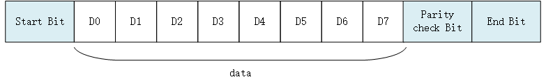
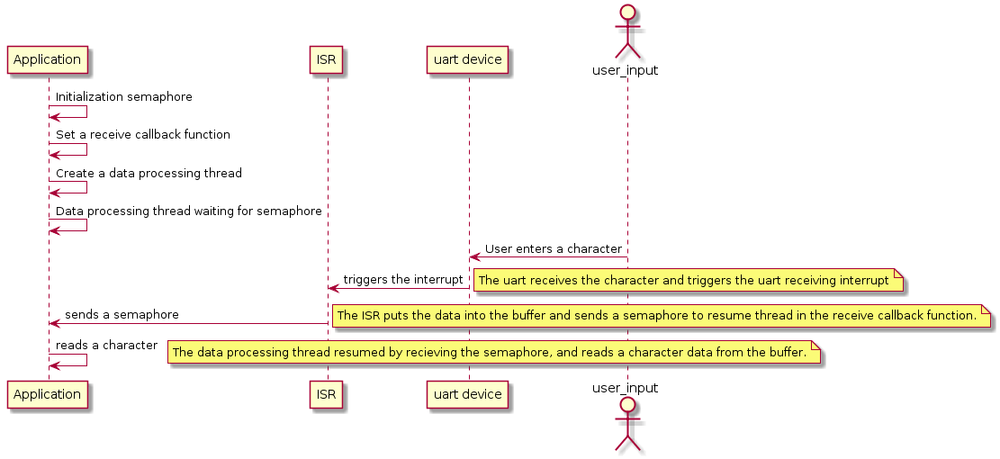
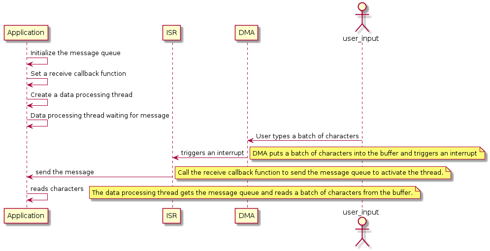

# UART Device

## UART Introduction

UART (Universal Asynchronous Receiver/Transmitter), as a kind of asynchronous serial communication protocol, the working principle is to transmit each character of the transmitted data one by one. It is the most frequently used data bus during application development.

The UART serial port is characterized by sequentially transmitting data one bit at a time. As long as  two transmission lines can realize two-way communication, one line transmits data while the other receives data . There are several important functions for UART serial communication, namely baud rate, start bit, data bit, stop bit and parity bit. For two ports that use UART serial port communication, these functions must be matched, otherwise the communication can't be carried out normally. The data format of the UART serial port transmission is as shown below:



* Start bit: Indicates the start of data transfer and the level logic is "0".
- Data bits: Possible values are 5, 6, 7, 8, and 9, indicating that these bits are transmitted. The value is generally 8, because an ASCII character value is 8 bits.
- Parity check bit: It it used by the receiver to verify the received data. The number of bits is used in the check of "1" is even (even parity) or odd (odd parity) ,in order to verify the data transmission. It is also fine by not using this bit .
- Stop Bit: Indicates the end of one frame of data. The level logic is "1".
- Baudrate: It is the rate at which a serial port communicates, which expressed in bits per second (bps) of the binary code transmitted in unit time. The common baud rate values are 4800, 9600, 14400, 38400, 115200, etc. The higher the value is, the faster the data transmission will be.

## Access UART Device

The application accesses the serial port hardware through the I/O device management interface provided by RT-Thread. The related interfaces are as follows:

| **Funtion** | **Description**                |
| --------------------------- | -------------------------- |
| rt_device_find()  | find device |
| rt_device_open()     | open device |
| rt_device_read()   | read device |
| rt_device_write()  |write device|
| rt_device_control()  | control device |
| rt_device_set_rx_indicate()   | set receive callback function |
| rt_device_set_tx_complete()  | set send complete callback function |
| rt_device_close()     | close device |

### Find UART Device

The application obtains the device handle according to the uart device name, and then can operate the uart device.The device find function is shown below

```c
rt_device_t rt_device_find(const char* name);
```

| **Parameter** | **Description**                                              |
| ------------- | ------------------------------------------------------------ |
| name          | device's name                                                |
| **back**      | ——                                                           |
| device handle | finding the corresponding device will return to the corresponding device handle |
| RT_NULL       | corresponding device object was not found                    |

Generally, the name of the uart device registered to the system is uart0, uart1, etc. samples are as follows:

```c
#define SAMPLE_UART_NAME       "uart2"  /* uart device name */
static rt_device_t serial;              /* uart device handle */
/* Find uart device*/
serial = rt_device_find(SAMPLE_UART_NAME);
```

### Open UART Device

Through the device handle, the application can open and close the device. When the device is opened, it will detect whether the device has been initialized. If it is not initialized, it will call the initialization interface to initialize the device by default. Open the device through the following functions:

```c
rt_err_t rt_device_open(rt_device_t dev, rt_uint16_t oflags);
```

| **Parameter** | **Description**               |
| ---------- | ------------------------------- |
| dev        | device handle            |
| oflags     | device mode flags   |
| **back** | ——                             |
| RT_EOK     | device opened successfully |
| -RT_EBUSY  | If the standalone parameter RT_DEVICE_FLAG_STANDALONE is included in the functions specified when the device is registered, the device will not be allowed to be opened repeatedly |
| Other error codes | device failed to open |

oflags parameters support the following values (Use OR logic to support multiple values):

```c
#define RT_DEVICE_FLAG_STREAM       0x040     /* Stream mode      */
/* Receive mode function */
#define RT_DEVICE_FLAG_INT_RX       0x100     /* Interrupt receive mode */
#define RT_DEVICE_FLAG_DMA_RX       0x200     /* DMA receiving mode */
/* Receive mode function */
#define RT_DEVICE_FLAG_INT_TX       0x400     /* Interrupt receive mode*/
#define RT_DEVICE_FLAG_DMA_TX       0x800     /* DMA receive mode    */
```

There are three modes of uart data receiving and sending: interrupt mode, polling mode and DMA mode. When used, only one of the three modes can be selected. If the open parameter oflag of the serial port does not specify the use of interrupt mode or DMA mode, the polling mode is used by default.

The DMA (Direct Memory Access) transfer mode does not require the CPU to directly control the transfer, and does not have the process of reserving the scene and restoring the scene as they have in the interrupt processing mode. The DMA controller opens a path for directly transferring data to the RAM and the I/O device, which saves CPU resources to do other things. Using DMA transfer can continuously acquire or send a piece of information without taking up interrupts or delays, which is useful when communication is frequent or when large pieces of information are to be transmitted.

>RT_DEVICE_FLAG_STREAM: Stream mode is used to output a string to the serial terminal: when the output character is `"\n"` (corresponding to the hexadecimal value 0x0A), a ``\r"` is automatically output in front (corresponding to hexadecimal value is 0x0D).

The stream mode `RT_DEVICE_FLAG_STREAM` can be used with the receive and send mode parameter with the "|" logic.

An example of using  a uart device in **interrupt receive mode and polling mode** as follows:

```c
#define SAMPLE_UART_NAME       "uart2"  /* uart device name */
static rt_device_t serial;              /* uart device handle */
/* find uart device */
serial = rt_device_find(SAMPLE_UART_NAME);

/* Open the uart device in interrupt receive mode and polling mode*/
rt_device_open(serial, RT_DEVICE_FLAG_INT_RX);
```

If the uart is to use the DMA receive mode, the oflags takes the value RT_DEVICE_FLAG_DMA_RX.  An example of using a uart device in the **DMA receive and polling send mode** is as follows:

```c
#define SAMPLE_UART_NAME       "uart2"  /* uart device's name */
static rt_device_t serial;              /* uart device handle */
/* find uart device */
serial = rt_device_find(SAMPLE_UART_NAME);

/* Open the uart device in DMA receive and polling send mode*/
rt_device_open(serial, RT_DEVICE_FLAG_DMA_RX);
```

### Control UART  Device

Through command  control word, the application can configure the uart device by the following function:

```c
rt_err_t rt_device_control(rt_device_t dev, rt_uint8_t cmd, void* arg);
```

| **Parameter**     | **Description**                                              |
| ----------------- | ------------------------------------------------------------ |
| dev               | device handle                                                |
| cmd               | command  control word can be valued as：RT_DEVICE_CTRL_CONFIG |
| arg               | controlled parameter： struct serial_configure               |
| **Back**          | ——                                                           |
| RT_EOK            | function executed successfully                               |
| -RT_ENOSYS        | execution failed, dev is empty                               |
| Other error codes | execution failed                                             |

* The prototype of control parameter structure: struct serial_configure is as follows：

```c
struct serial_configure
{
    rt_uint32_t baud_rate;          /* Baudrate */
    rt_uint32_t data_bits    :4;    /* Data bit */
    rt_uint32_t stop_bits    :2;    /* Stop bit */
    rt_uint32_t parity       :2;    /* Parity bit */
    rt_uint32_t bit_order    :1;    /* Prioritized by order */
    rt_uint32_t invert       :1;    /* Mode */
    rt_uint32_t bufsz        :16;   /* Receive data buffer size */
    rt_uint32_t reserved     :4;    /* Reserved bit */
};
```

* The default macro configuration provided by RT-Thread is as follows：

```c
#define RT_SERIAL_CONFIG_DEFAULT           \
{                                          \
    BAUD_RATE_115200, /* 115200 bps */     \
    DATA_BITS_8,      /* 8 databits */     \
    STOP_BITS_1,      /* 1 stopbit */      \
    PARITY_NONE,      /* No parity  */     \
    BIT_ORDER_LSB,    /* LSB first sent */ \
    NRZ_NORMAL,       /* Normal mode */    \
    RT_SERIAL_RB_BUFSZ, /* Buffer size */  \
    0                                      \
}
```

The configuration parameters provided by RT-Thread can be defined as the following macro definitions:：

```c
/* The baudrate can be defined as*/
#define BAUD_RATE_2400                  2400
#define BAUD_RATE_4800                  4800
#define BAUD_RATE_9600                  9600
#define BAUD_RATE_19200                 19200
#define BAUD_RATE_38400                 38400
#define BAUD_RATE_57600                 57600
#define BAUD_RATE_115200                115200
#define BAUD_RATE_230400                230400
#define BAUD_RATE_460800                460800
#define BAUD_RATE_921600                921600
#define BAUD_RATE_2000000               2000000
#define BAUD_RATE_3000000               3000000
/* Data bits can be defined as*/
#define DATA_BITS_5                     5
#define DATA_BITS_6                     6
#define DATA_BITS_7                     7
#define DATA_BITS_8                     8
#define DATA_BITS_9                     9
/* Stop bits can be defined as */
#define STOP_BITS_1                     0
#define STOP_BITS_2                     1
#define STOP_BITS_3                     2
#define STOP_BITS_4                     3
/* Parity bits can be defined as */
#define PARITY_NONE                     0
#define PARITY_ODD                      1
#define PARITY_EVEN                     2
/* Bit order can be defined as */
#define BIT_ORDER_LSB                   0
#define BIT_ORDER_MSB                   1
/* Mode canbe defined as */
#define NRZ_NORMAL                      0   /* normal mode */
#define NRZ_INVERTED                    1   /* inverted mode */
/* Default size of the receive data buffer */
#define RT_SERIAL_RB_BUFSZ              64
```

**Receive Buffer**

When the uart device is opened using interrupt receive mode, the uart driver framework will open a buffer according to the size of RT_SERIAL_RB_BUFSZ to save the received data. When the underlying driver receives a data, it will put the data into the buffer in the interrupt service program.

>The default size of the receive data buffer is 64 bytes.  If the number of received data in one-time is too large and the data is not read in time, the data of the buffer will be overwritten by the newly received data, resulting in data loss. It is recommended to increase the buffer.

A sample for configuring uart hardware parameters such as data bits, check bits, stop bits, and so on are shown below：

```c
#define SAMPLE_UART_NAME       "uart2"  /* uart device's name */
static rt_device_t serial;              /* uart device handle */
struct serial_configure config = RT_SERIAL_CONFIG_DEFAULT; /* Configuration parameters */
/* Find uart devices */
serial = rt_device_find(SAMPLE_UART_NAME);

/* Open the uart device in interrupt receive and polling send mode */
rt_device_open(serial, RT_DEVICE_FLAG_INT_RX);

config.baud_rate = BAUD_RATE_115200;
config.data_bits = DATA_BITS_8;
config.stop_bits = STOP_BITS_2;
config.parity = PARITY_NONE;
/* The serial port configuration parameters can only be modified after opening the device */
rt_device_control(serial, RT_DEVICE_CTRL_CONFIG, &config);
```

### Send Data

To write data to the serial port, the following functions can be used:

```c
rt_size_t rt_device_write(rt_device_t dev, rt_off_t pos, const void* buffer, rt_size_t size);
```

| **Parameter** | **Description**                         |
| ---------- | ------------------------------------------ |
| dev                | device handle                 |
| pos                | Write data offset, this parameter is not used in uart device |
| buffer             | Memory buffer pointer, place the data to be written |
| size               | The size of the written data |
| **back**       | ——                                     |
| The actual size of the written data | If it is a character device, the return size is in bytes; |
| 0                  | It needs to read the current thread's errno to determine the error status |

Calling this function will write the data in the `buffer` to the `dev` device, the size of the write data is: size.

The sample program for writing data to the serial port is as follows:

```c
#define SAMPLE_UART_NAME       "uart2"  /* uart device's name */
static rt_device_t serial;              /* uart device handle */
char str[] = "hello RT-Thread!\r\n";
struct serial_configure config = RT_SERIAL_CONFIG_DEFAULT; /* Configuration parameter */
/*find uart device */
serial = rt_device_find(SAMPLE_UART_NAME);

/* Open the uart device in interrupt reception and polling mode */
rt_device_open(serial, RT_DEVICE_FLAG_INT_RX);
/* Send string */
rt_device_write(serial, 0, str, (sizeof(str) - 1));
```

### Set The Send completion Callback Function

When the application calls `rt_device_write()` to write data, if the underlying hardware can support automatic transmission, the upper application can set a callback function. This callback function is called after the underlying hardware data has been sent (for example, when the DMA transfer is complete or the FIFO has been written to complete the completion interrupt). You can set the device to send completion instructions by the following function:

```c
rt_err_t rt_device_set_tx_complete(rt_device_t dev, rt_err_t (*tx_done)(rt_device_t dev,void *buffer));
```

| **Parameter** | **Description**           |
| ------------- | ------------------------- |
| dev           | device handle             |
| tx_done       | callback function pointer |
| **back**      | ——                        |
| RT_EOK        | set up successfully       |

When this function is called, the callback function is provided by the user. When the hardware device sends the data, the device driver calls back this function and passes the sent data block address buffer as a parameter to the upper application. When the application (thread) receives the indication, it will release the buffer memory block or use it as the buffer for the next write data according to the condition of sending the buffer.

### Set The Receive Callback Function

The data receiving instruction can be set by the following function. When the serial port receives the data, it will inform the upper application thread that the data has arrived:

```c
rt_err_t rt_device_set_rx_indicate(rt_device_t dev, rt_err_t (*rx_ind)(rt_device_t dev,rt_size_t size));
```

| **Parameter** | **Description** |
| -------- | ------------ |
| dev      | device handle |
| rx_ind   | callback function pointer |
| dev      | device handle (callback function parameter) |
| size     | buffer data size (callback function parameter) |
| **back** | ——           |
| RT_EOK   | set up successfully |

The callback function for this function is provided by the user. If the uart device is opened in interrupt receive mode, the callback function will be called when the serial port receives a data, and the data size of the buffer will be placed in the `size` parameter, and the uart device handle will be placed in the `dev` parameter.

If the uart is opened in DMA receive mode, the callback function is called when the DMA completes receiving a batch of data.

Normally the receiving callback function can send a semaphore or event to notify the serial port data processing thread that data has arrived. The example is as follows:

```c
#define SAMPLE_UART_NAME       "uart2"  /* uart device name */
static rt_device_t serial;              /* uart device handle */
static struct rt_semaphore rx_sem;      /* The semaphore used to receive the message */

/* Receive data callback function */
static rt_err_t uart_input(rt_device_t dev, rt_size_t size)
{
    /* When the serial port receives the data, it triggers interrupts, calls this callback function, and sends the received semaphore */
    rt_sem_release(&rx_sem);

    return RT_EOK;
}

static int uart_sample(int argc, char *argv[])
{
    serial = rt_device_find(SAMPLE_UART_NAME);

    /* Open the uart device in interrupting receive mode */
    rt_device_open(serial, RT_DEVICE_FLAG_INT_RX);

    /* Initialization semaphore */
    rt_sem_init(&rx_sem, "rx_sem", 0, RT_IPC_FLAG_FIFO);

    /* Set the receive callback function */
    rt_device_set_rx_indicate(serial, uart_input);
}

```

### Receive Data

You can call the following function to read the data received by the uart:

```c
rt_size_t rt_device_read(rt_device_t dev, rt_off_t pos, void* buffer, rt_size_t size);
```

| **Parameter**                    | **Description**                                              |
| -------------------------------- | ------------------------------------------------------------ |
| dev                              | device handle                                                |
| pos                              | Read data offset, uart device dose not use this parameter    |
| buffer                           | Buffer pointer, the data read will be saved in the buffer    |
| size                             | Read the size of the data                                    |
| **back**                         | ——                                                           |
| Read the actual size of the data | If it is a character device, the return size is in bytes.    |
| 0                                | It needs to read the current thread's errno to determine the error status |

Read data offset: pos is not valid for character devices. This parameter is mainly used for block devices.

An example of using the interrupt receive mode with the receive callback function is as follows:

```c
static rt_device_t serial;            /* uart device handle */
static struct rt_semaphore rx_sem;    /* Semaphore used to receive messages */

/* Thread receiving data */
static void serial_thread_entry(void *parameter)
{
    char ch;

    while (1)
    {
        /* Reads a byte of data from the serial port and waits for the receiving semaphore if it is not read */
        while (rt_device_read(serial, -1, &ch, 1) != 1)
        {
            /* Blocking waiting to receive semaphore, waiting for the semaphore to read the data again*/
            rt_sem_take(&rx_sem, RT_WAITING_FOREVER);
        }
        /* Read the data through the serial port dislocation output*/
        ch = ch + 1;
        rt_device_write(serial, 0, &ch, 1);
    }
}
```

### Close The UART Device

After the application completes the serial port operation, the uart device can be closed by the following functions:

```c
rt_err_t rt_device_close(rt_device_t dev);
```

| **Parameter**     | **Description**                                              |
| ----------------- | ------------------------------------------------------------ |
| dev               | device handle                                                |
| **back**          | ——                                                           |
| RT_EOK            | device closed successfully                                   |
| -RT_ERROR         | The device has been completely shut down and cannot be shut down repeatedly |
| other error codes | fail to close the device                                     |

Use the `rt_device_close()` interface and `rt_device_open()` interface in pair. When you open the device, you need to close the device once, so that the device will be completely shut down, otherwise the device will remain open.

## Examples Of Using UART Device

### Interrupt Receiving And Polling Send

The main steps of the sample code are as follows:

1. First find the uart device to get the device handle.
2. Initialize the semaphore that the callback function sends, and then open the uart device in read/write and interrupt receive mode.
3. Set the receive callback function of the uart device, then send the string and create a read data thread.
4. The read data thread will try to read a character data. If there is no data, it will hang and wait for the semaphore. When the uart device receives a data, it will trigger an interrupt and call the receive callback function. This function will send a semaphore to wake up the thread. At this point, the thread will immediately read the received data.
5. This sample code is not limited to a specific BSP. According to the uart device registered by BSP, modify the uart device's name corresponding to the sample code's macro definition  SAMPLE_UART_NAME  to run.

The running sequence diagram is shown as follows:




```c
/*
 * Program list: This is a uart device usage routine
 * The routine exports the uart_sample command to the control terminal
 * Format of command: uart_sample uart2
 * Command explanation: the second parameter of the command is the name of the uart device. If it is null, the default uart device wil be used
 * Program function: output the string "hello RT-Thread!" through the serial port, and then malposition the input character
*/

#include <rtthread.h>

#define SAMPLE_UART_NAME       "uart2"

/* Semaphore used to receive messages */
static struct rt_semaphore rx_sem;
static rt_device_t serial;

/* Receive data callback function */
static rt_err_t uart_input(rt_device_t dev, rt_size_t size)
{
    /* After the uart device receives the data, it generates an interrupt, calls this callback function, and then sends the received semaphore. */
    rt_sem_release(&rx_sem);

    return RT_EOK;
}

static void serial_thread_entry(void *parameter)
{
    char ch;

    while (1)
    {
        /* Read a byte of data from the serial port and wait for the receiving semaphore if it is not read */
        while (rt_device_read(serial, -1, &ch, 1) != 1)
        {
            /* Being Suspended and waiting for the semaphore */
            rt_sem_take(&rx_sem, RT_WAITING_FOREVER);
        }
        /* Read the data from the serial port and output through dislocation */
        ch = ch + 1;
        rt_device_write(serial, 0, &ch, 1);
    }
}

static int uart_sample(int argc, char *argv[])
{
    rt_err_t ret = RT_EOK;
    char uart_name[RT_NAME_MAX];
    char str[] = "hello RT-Thread!\r\n";

    if (argc == 2)
    {
        rt_strncpy(uart_name, argv[1], RT_NAME_MAX);
    }
    else
    {
        rt_strncpy(uart_name, SAMPLE_UART_NAME, RT_NAME_MAX);
    }

    /* Find uart devices in the system */
    serial = rt_device_find(uart_name);
    if (!serial)
    {
        rt_kprintf("find %s failed!\n", uart_name);
        return -RT_ERROR;
    }

    /* Initialize the semaphore */
    rt_sem_init(&rx_sem, "rx_sem", 0, RT_IPC_FLAG_FIFO);
    /* Open the uart device in interrupt receive and polling send mode */
    rt_device_open(serial, RT_DEVICE_FLAG_INT_RX);
    /* Set the receive callback function */
    rt_device_set_rx_indicate(serial, uart_input);
    /* Send string */
    rt_device_write(serial, 0, str, (sizeof(str) - 1));

    /* Create a serial thread */
    rt_thread_t thread = rt_thread_create("serial", serial_thread_entry, RT_NULL, 1024, 25, 10);
    /* Start the thread successfully */
    if (thread != RT_NULL)
    {
        rt_thread_startup(thread);
    }
    else
    {
        ret = -RT_ERROR;
    }

    return ret;
}
/* Export to the msh command list */
MSH_CMD_EXPORT(uart_sample, uart device sample);
```

### DMA Reception And Polling Transmission

When the serial port receives a batch of data, it will call the receive callback function. The receive callback function will send the data size of the buffer at this time to the waiting data processing thread through the message queue. After the thread gets the message, it is activated and reads the data. In general, the DMA receive mode completes data reception in conjunction with the DMA receive completion interrupt and the serial port idle interrupt.

* This sample code is not limited to a specific BSP. According to the uart device registered by BSP, modify the sample code macro to define the uart device name corresponding to SAMPLE_UART_NAME to run.

The running sequence diagram is shown below:



```c
/*
 * Program list: This is a uart device DMA receive usage routine
 * The routine exports the uart_dma_sample command to the control terminal
 * Command format: uart_dma_sample uart3
 * Command explanation: The second parameter of the command is the name of the uart device to be used. If it is empty, the default uart device will be used.
 * Program function: output the string "hello RT-Thread!" through the serial port, and output the received data through the serial port, and then print the received data.
*/

#include <rtthread.h>

#define SAMPLE_UART_NAME       "uart3"      /* uart device name */

/* Serial port receiving message structure*/
struct rx_msg
{
    rt_device_t dev;
    rt_size_t size;
};
/* uart device handle */
static rt_device_t serial;
/* Message queue control block*/
static struct rt_messagequeue rx_mq;

/* Receive data callback function */
static rt_err_t uart_input(rt_device_t dev, rt_size_t size)
{
    struct rx_msg msg;
    rt_err_t result;
    msg.dev = dev;
    msg.size = size;

    result = rt_mq_send(&rx_mq, &msg, sizeof(msg));
    if ( result == -RT_EFULL)
    {
        /* message queue full */
        rt_kprintf("message queue full！\n");
    }
    return result;
}

static void serial_thread_entry(void *parameter)
{
    struct rx_msg msg;
    rt_err_t result;
    rt_uint32_t rx_length;
    static char rx_buffer[RT_SERIAL_RB_BUFSZ + 1];

    while (1)
    {
        rt_memset(&msg, 0, sizeof(msg));
        /* Read messages from the message queue*/
        result = rt_mq_recv(&rx_mq, &msg, sizeof(msg), RT_WAITING_FOREVER);
        if (result >= 0)
        {
            /*Read data from the serial port*/
            rx_length = rt_device_read(msg.dev, 0, rx_buffer, msg.size);
            rx_buffer[rx_length] = '\0';
            /* Output the read message through the uart device: serial */
            rt_device_write(serial, 0, rx_buffer, rx_length);
            /* Print data */
            rt_kprintf("%s\n",rx_buffer);
        }
    }
}

static int uart_dma_sample(int argc, char *argv[])
{
    rt_err_t ret = RT_EOK;
    char uart_name[RT_NAME_MAX];
    static char msg_pool[256];
    char str[] = "hello RT-Thread!\r\n";

    if (argc == 2)
    {
        rt_strncpy(uart_name, argv[1], RT_NAME_MAX);
    }
    else
    {
        rt_strncpy(uart_name, SAMPLE_UART_NAME, RT_NAME_MAX);
    }

    /* find uart device */
    serial = rt_device_find(uart_name);
    if (!serial)
    {
        rt_kprintf("find %s failed!\n", uart_name);
        return -RT_ERROR;
    }

    /* Initialize message queue */
    rt_mq_init(&rx_mq, "rx_mq",
               msg_pool,                 /* a pool for storing messages */
               sizeof(struct rx_msg),    /* The maximum length of a message*/
               sizeof(msg_pool),         /* The size of the message pool */
               RT_IPC_FLAG_FIFO);        /* If there are multiple threads waiting, assign messages according to the order. */

    /* Open the uart device in DMA receive and polling send mode */
    rt_device_open(serial, RT_DEVICE_FLAG_DMA_RX);
    /* Set the receive callback function */
    rt_device_set_rx_indicate(serial, uart_input);
    /* Send string */
    rt_device_write(serial, 0, str, (sizeof(str) - 1));

    /* Create a thread */
    rt_thread_t thread = rt_thread_create("serial", serial_thread_entry, RT_NULL, 1024, 25, 10);
    /* Start the thread if it is created successfully*/
    if (thread != RT_NULL)
    {
        rt_thread_startup(thread);
    }
    else
    {
        ret = -RT_ERROR;
    }

    return ret;
}
/* Export to the msh command list */
MSH_CMD_EXPORT(uart_dma_sample, uart device dma sample);
```

