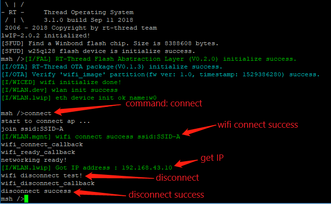
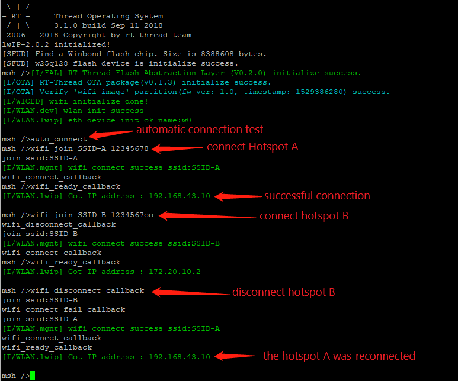

# WLAN Device

With the rapid development of the Internet of Things, more and more embedded devices are equipped with WIFI wireless network devices. In order to be able to manage WIFI network devices, RT-Thread introduces a WLAN device management framework. This framework has many features to control and manage WIFI, providing developers with many conveniences for using WIFI devices.

## Introduction to the WLAN Framework

The WLAN framework is a set of middleware developed by RT-Thread for managing WIFI. Connect to the specific WIFI driver, control the WIFI connection disconnection, scan and other operations. Support different applications, provide WIFI control, events, data diversion and other operations for the application, and provide a unified WIFI control interface for the upper application. The WLAN framework consists of three main parts. The DEV driver interface layer provides a unified API for the WLAN framework. Manage layer provides users with specific functions such as WIFI scanning, connection, and disconnection. Protocol is responsible for processing the data stream generated on the WIFI. Different protocols such as LWIP can be mounted according to different usage scenarios. It has the characteristics of simple use, complete functions, convenient docking and strong compatibility.

The following figure is a hierarchical diagram of the WIFI framework:


The First Part: `APP`, the application layer. It is a specific application based on the WLAN framework, such as WiFi-related shell commands.

The Second Part:  `Airkiss and Voice`, the network configuration layer. Provide functions such as using wireless or sound waves to configure the network.

The Third Part: `WLAN Manager`, the WLAN management layer. Ability to control and manage WLAN devices. It has functions related to WLAN control, such as setting mode, connecting hotspots, disconnecting hotspots, enabling hotspots, scanning hotspots, etc. It also provides management functions such as reconnection after disconnection and automatic hotspot switching.

The Fourth Part: `WLAN Protocol`, the protocol layer. The data stream is submitted to a specific protocol for resolution, and the user can specify to communicate using different protocols.

The Fifth Part: `WLAN Config`, the parameter management layer. Manage hotspot information and passwords for successful connections and write them to non-volatile storage media.

The Sixth Part: `WLAN Device`, the driver interface layer. Connect to specific WLAN hardware and provide unified APIs for management.

### Functions

* Automatic Connection: After using automatic connection function, as long as the WIFI is disconnected, the hotspot information of the previous successful connection will be automatically read, and the hotspot will be connected. If a hotspot connection fails, switch to the next hotspot to connect until the connection is successful. The hotspot information used by the automatic connection is sequentially tried in the order of the success of the connection, and the hotspot information of the latest connection success is preferentially used. After the connection is successful, the hotspot information is cached first, and use it first when reconnecting after the next disconnection.
* Parameter storage: Stores the WIFI parameters for successful connection. The WIFI parameter will be cached in the memory. If the external non-volatile storage interface is configured, it will be stored in the external storage medium. Users can implement the `struct rt_wlan_cfg_ops` structure according to his actual situation and save the parameters anywhere. The cached parameters mainly provide hotspot information for automatic connections. When WIFI is unconnected, it will read the cached parameters and try to connect.
* WIFI control: Provide complete WIFI control APIs, scanning, connection, hotspot, etc. Provide WIFI related status callback events, disconnect, connection, connection failure, etc. Provide users with an easy to use WIFI management APIs.
* Shell command: You can enter the command in Msh to control WIFI to perform scanning, connecting, disconnecting and other actions. Print debugging information such as WIFI status.

### Configuration

Use `menuconfig` command in ENV to enter the WLAN configuration interface by following the menu:

```c
RT-Thread Components ->  Device Drivers -> Using WiFi ->
```

Configuration options are described in detail as follows:

```c
[*] Using Wi-Fi framework                /* Using Wi-Fi framework */
(wlan0) The WiFi device name for station /* The default name for station */
(wlan1) The WiFi device name for ap      /* The default name for ap */
(lwip) Default transport protocol        /* Default protocol */
(10000) Set scan timeout time(ms)        /* Scan timeout time */
(10000) Set connect timeout time(ms)     /* Connect timeout time */
(32)  SSID name maximum length           /* Maximum length of SSID name */
(32)  Maximum password length            /* Maximum length of password */
[*]   Automatic sorting of scan results  /* Automatic sorting of scan results */
(3)   Maximum number of WiFi information automatically saved /* Maximum number of WiFi information automatically saved */
(wlan_job) WiFi work queue thread name   /* WiFi work queue thread name */
(2048) wifi work queue thread size       /* wifi work queue thread size */
(22)  WiFi work queue thread priority    /* WiFi work queue thread priority */
(2)   Maximum number of driver events    /* Maximum number of driver events in dev layer */
[ ]   Forced use of PBUF transmission    /* Forced use of PBUF transmission */
[ ]   Enable WLAN Debugging Options      /* Enable WLAN Debugging Options */
```

## Access Wi-Fi Devices

The application accesses the WLAN device hardware through the WLAN device management interface, and the relevant interfaces are as follows:

| Fuctions | **Description**                 |
| -------------------- | ---------------------------- |
| rt_wlan_prot_attach()           | Specify the WLAN protocol attached |
| rt_wlan_scan_sync()             | Synchronized WLAN Scan |
| rt_wlan_connect()               | Synchronized Hotspot Connection |
| rt_wlan_disconnect()            | Synchronized Hotspot Disconnection |
| rt_wlan_config_autoreconnect()  | Configuration automatic reconnection mode |

### Specify Protocol

```c
rt_err_t rt_wlan_prot_attach(const char *dev_name, const char *prot_name);
```

| **Parameter**                  | **D**escription                     |
| ----------------------------- | ---------------------------------- |
| dev_name                       | WLAN device name            |
| prot_name                     | Protocol name, possible values: RT_WLAN_PROT_LWIP, indicates the protocol type LWIP |
| Return                 | **--**                               |
| -RT_ERROR                     | Execution failed            |
| RT_EOK                        | Execution succeed           |

### Synchronized WLAN Scan

```c
struct rt_wlan_scan_result *rt_wlan_scan_sync(void);
```

| **Return**                   | **Description** |
| ---------- | ------------------------------- |
| rt_wlan_scan_result           | Scan Result              |

The scan result is a structure as follows:

```c
struct rt_wlan_scan_result
{
    rt_int32_t num;             /* info number */
    struct rt_wlan_info *info;  /* info pointer */
};
```

### Synchronized Hotspot Connection

```c
rt_err_t rt_wlan_connect(const char *ssid, const char *password);
```

| **Parameter**               | **Description**                     |
| ----------------------------- | ---------------------------------- |
| ssid                          | WIFI name                       |
| password                      | WIFI password                     |
| Return                    | **--**                               |
| -RT_EINVAL                    | Parameter error             |
| -RT_EIO                       | Unregistered device       |
| -RT_ERROR                     | Connection failed           |
| RT_EOK                        | Connection successful  |

### Synchronized Hotspot Disconnection

```c
rt_err_t rt_wlan_disconnect(void);
```

| Return                    | **Description**                     |
| ----------------------------- | ---------------------------------- |
| -RT_EIO                       | Unregistered device        |
| -RT_ENOMEM                    | Not enough memory     |
| -RT_ERROR                     | Disconnection failed      |
| RT_EOK                        | Disconnection successful    |

### Automatic Reconnection Mode Configuration

```c
void rt_wlan_config_autoreconnect(rt_bool_t enable);
```

| **P**arameter                  | **Description**                     |
| ----------------------------- | ---------------------------------- |
| enable                        | enable or disable automatic reconnection |

## FinSH Command

Using shell commands can help us quickly debug WiFi-related features. The wifi related shell commands are as follows:

```c
wifi                           /* Print help */
wifi help                      /* View help */
wifi join SSID [PASSWORD]      /* Connect wifi.if SSDI is empty, use configuration to connect automatically */
wifi ap   SSID [PASSWORD]      /* Create hotspot */
wifi scan                      /* Scan all hotspots */
wifi disc                      /* Disconnnect */
wifi ap_stop                   /* Stop hotspot */
wifi status                    /* Print wifi status sta + ap */
wifi smartconfig               /* Start to configure network function */
```

### WiFi Scan

The wifi scan command is `wifi scan`. After the wifi scan command is executed, the surrounding hotspot information will be printed on the terminal. Through the printed hotspot information, you can see multiple attributes such as SSID and MAC address.

Enter the command in msh and the scan results are as follows:

```c
wifi scan
SSID                                   MAC            security    rssi chn Mbps
------------------------------- -----------------  -------------- ---- --- ----
rtt_test_ssid_1                 c0:3d:46:00:3e:aa  OPEN           -14    8  300
test_ssid                       3c:f5:91:8e:4c:79  WPA2_AES_PSK   -18    6   72
rtt_test_ssid_2                 ec:88:8f:88:aa:9a  WPA2_MIXED_PSK -47    6  144
rtt_test_ssid_3                 c0:3d:46:00:41:ca  WPA2_MIXED_PSK -48    3  300
```

### WiFi Connection

The wifi scan command is `wifi join`. The command needs to be followed by the hotspot name and hotspot password. If the hotspot does not have a password, you may not enter this item. After the WiFi connection command is executed, if the hotspot exists and the password is correct, the board will connect to the hotspot and obtain the IP address. After the network connection is successful, you can use `socket` sockets for network communication.

An example of using the wifi connection command is as follows. After the connection is successful, the obtained IP address will be printed on the terminal as follows:

```c
wifi join ssid_test 12345678
[I/WLAN.mgnt] wifi connect success ssid:ssid_test
[I/WLAN.lwip] Got IP address : 192.168.1.110
```

### WiFi Disconnection

The command to disconnect WiFi is  `wifi disc`. After the WiFi disconnect command is executed, the development board will disconnect from the hotspot.

The WiFi disconnect command usage example is as follows. After the disconnection is successful, the following information will be printed on the terminal as shown below.

```c
wifi disc
[I/WLAN.mgnt] disconnect success!
```

## Example for WLAN Device Usage

### WiFi Scan

The following code will show a WiFi sync scan, and then print the results on the terminal. First perform WIFI initialization, and then execute the WIFI scan function `rt_wlan_scan_sync`, this function is synchronous, the number of scans and results returned by the function. In this example, the scanned hotspot name will be printed.

```c
#include <rthw.h>
#include <rtthread.h>

#include <dev_wlan_mgnt.h>
#include <dev_wlan_prot.h>
#include <dev_wlan_cfg.h>

void wifi_scan(void)
{
    struct rt_wlan_scan_result *result;
    int i = 0;

    /* Configuring WLAN device working mode */
    rt_wlan_set_mode(RT_WLAN_DEVICE_STA_NAME, RT_WLAN_STATION);
    /* WiFi scan */
    result = rt_wlan_scan_sync();
    /* Print scan results */
    rt_kprintf("scan num:%d\n", result->num);
    for (i = 0; i < result->num; i++)
    {
        rt_kprintf("ssid:%s\n", result->info[i].ssid.val);
    }
}

int scan(int argc, char *argv[])
{
    wifi_scan();
    return 0;
}
MSH_CMD_EXPORT(scan, scan test.);
```

The results are as follows:


### WiFi Connection and Disconnection

The code below will show a WiFi sync connection. Initialize WIFI first, and then create a semaphore for waiting for the `RT_WLAN_EVT_READY` event. Register the callback function of the event that needs attention, execute the  `rt_wlan_connect` wifi connection function, and return value will indicate whether the connection has been successful. If the WiFi connection succeeds, it needs to wait for the network to get the IP address before communication. Use the semaphore created in advance to wait for the network to be ready. Once the network is ready, it will be able to communicate.

After connecting to WIFI, wait for a while and then execute `rt_wlan_disconnect` to disconnect. The disconnect operation is blocked, and the return value indicates whether the disconnection was successful.

```c
#include <rthw.h>
#include <rtthread.h>

#include <dev_wlan_mgnt.h>
#include <dev_wlan_prot.h>
#include <dev_wlan_cfg.h>

#define WLAN_SSID               "SSID-A"
#define WLAN_PASSWORD           "12345678"
#define NET_READY_TIME_OUT       (rt_tick_from_millisecond(15 * 1000))

static rt_sem_t net_ready = RT_NULL;

static void
wifi_ready_callback(int event, struct rt_wlan_buff *buff, void *parameter)
{
    rt_kprintf("%s\n", __FUNCTION__);
    rt_sem_release(net_ready);
}

static void
wifi_connect_callback(int event, struct rt_wlan_buff *buff, void *parameter)
{
    rt_kprintf("%s\n", __FUNCTION__);
    if ((buff != RT_NULL) && (buff->len == sizeof(struct rt_wlan_info)))
    {
        rt_kprintf("ssid : %s \n", ((struct rt_wlan_info *)buff->data)->ssid.val);
    }
}

static void
wifi_disconnect_callback(int event, struct rt_wlan_buff *buff, void *parameter)
{
    rt_kprintf("%s\n", __FUNCTION__);
    if ((buff != RT_NULL) && (buff->len == sizeof(struct rt_wlan_info)))
    {
        rt_kprintf("ssid : %s \n", ((struct rt_wlan_info *)buff->data)->ssid.val);
    }
}

static void
wifi_connect_fail_callback(int event, struct rt_wlan_buff *buff, void *parameter)
{
    rt_kprintf("%s\n", __FUNCTION__);
    if ((buff != RT_NULL) && (buff->len == sizeof(struct rt_wlan_info)))
    {
        rt_kprintf("ssid : %s \n", ((struct rt_wlan_info *)buff->data)->ssid.val);
    }
}

rt_err_t wifi_connect(void)
{
    rt_err_t result = RT_EOK;

    /* Configuring WLAN device working mode */
    rt_wlan_set_mode(RT_WLAN_DEVICE_STA_NAME, RT_WLAN_STATION);
    /* station connect */
    rt_kprintf("start to connect ap ...\n");
    net_ready = rt_sem_create("net_ready", 0, RT_IPC_FLAG_FIFO);
    rt_wlan_register_event_handler(RT_WLAN_EVT_READY,
            wifi_ready_callback, RT_NULL);
    rt_wlan_register_event_handler(RT_WLAN_EVT_STA_CONNECTED,
            wifi_connect_callback, RT_NULL);
    rt_wlan_register_event_handler(RT_WLAN_EVT_STA_DISCONNECTED,
            wifi_disconnect_callback, RT_NULL);
    rt_wlan_register_event_handler(RT_WLAN_EVT_STA_CONNECTED_FAIL,
            wifi_connect_fail_callback, RT_NULL);

    /* connect wifi */
    result = rt_wlan_connect(WLAN_SSID, WLAN_PASSWORD);

    if (result == RT_EOK)
    {
        /* waiting for IP to be got successfully  */
        result = rt_sem_take(net_ready, NET_READY_TIME_OUT);
        if (result == RT_EOK)
        {
            rt_kprintf("networking ready!\n");
        }
        else
        {
            rt_kprintf("wait ip got timeout!\n");
        }
        rt_wlan_unregister_event_handler(RT_WLAN_EVT_READY);
        rt_sem_delete(net_ready);

        rt_thread_delay(rt_tick_from_millisecond(5 * 1000));
        rt_kprintf("wifi disconnect test!\n");
        /* disconnect */
        result = rt_wlan_disconnect();
        if (result != RT_EOK)
        {
            rt_kprintf("disconnect failed\n");
            return result;
        }
        rt_kprintf("disconnect success\n");
    }
    else
    {
        rt_kprintf("connect failed!\n");
    }
    return result;
}

int connect(int argc, char *argv[])
{
    wifi_connect();
    return 0;
}
MSH_CMD_EXPORT(connect, connect test.);
```

The results are as follows:



### WiFi Auto Reconnection when Turn On

First enable the automatic reconnection function, use the command line to connect to the hotspot A, and connect another hotspot B. After waiting for a few seconds, power off hotspot B, the system will automatically retry connecting B hotspot. At this time, B hotspot connection can not be connected, and the system automatically switches hotspot A to connect. After the connection is successful, the system stops connecting.

```c
#include <rthw.h>
#include <rtthread.h>

#include <dev_wlan_mgnt.h>
#include <dev_wlan_prot.h>
#include <dev_wlan_cfg.h>

static void
wifi_ready_callback(int event, struct rt_wlan_buff *buff, void *parameter)
{
    rt_kprintf("%s\n", __FUNCTION__);
}

static void
wifi_connect_callback(int event, struct rt_wlan_buff *buff, void *parameter)
{
    rt_kprintf("%s\n", __FUNCTION__);
    if ((buff != RT_NULL) && (buff->len == sizeof(struct rt_wlan_info)))
    {
        rt_kprintf("ssid : %s \n", ((struct rt_wlan_info *)buff->data)->ssid.val);
    }
}

static void
wifi_disconnect_callback(int event, struct rt_wlan_buff *buff, void *parameter)
{
    rt_kprintf("%s\n", __FUNCTION__);
    if ((buff != RT_NULL) && (buff->len == sizeof(struct rt_wlan_info)))
    {
        rt_kprintf("ssid : %s \n", ((struct rt_wlan_info *)buff->data)->ssid.val);
    }
}

static void
wifi_connect_fail_callback(int event, struct rt_wlan_buff *buff, void *parameter)
{
    rt_kprintf("%s\n", __FUNCTION__);
    if ((buff != RT_NULL) && (buff->len == sizeof(struct rt_wlan_info)))
    {
        rt_kprintf("ssid : %s \n", ((struct rt_wlan_info *)buff->data)->ssid.val);
    }
}

int wifi_autoconnect(void)
{
    /* Configuring WLAN device working mode */
    rt_wlan_set_mode(RT_WLAN_DEVICE_STA_NAME, RT_WLAN_STATION);
    /* Start automatic connection */
    rt_wlan_config_autoreconnect(RT_TRUE);
    /* register event */
    rt_wlan_register_event_handler(RT_WLAN_EVT_READY,
            wifi_ready_callback, RT_NULL);
    rt_wlan_register_event_handler(RT_WLAN_EVT_STA_CONNECTED,
            wifi_connect_callback, RT_NULL);
    rt_wlan_register_event_handler(RT_WLAN_EVT_STA_DISCONNECTED,
            wifi_disconnect_callback, RT_NULL);
    rt_wlan_register_event_handler(RT_WLAN_EVT_STA_CONNECTED_FAIL,
            wifi_connect_fail_callback, RT_NULL);
    return 0;
}

int auto_connect(int argc, char *argv[])
{
    wifi_autoconnect();
    return 0;
}
MSH_CMD_EXPORT(auto_connect, auto connect test.);
```

The results are as follows:


