# User Manual of Env

Env is a handy utility tool developed by RT-Thread team to build enviornment, graphical system configuration, and packages management for software projects that intend to run on RT-Thread operating system.

It is a wrapper tool for build-in menuconfig; an open source GUI tool which is designed to tailor for ease of use for developers. It can also be used to configure the kernel configuraiton parameters, components and software packages so that developers can construct the system like lego blocks.

## Main Features

- Menuconfig provides graphical interface to interact with operational logic and congfiguration parameters
- Each configuration option come with help session by default.
- It automates dependencies installation process.
- Automatically generate rtconfig.h without manual modification.
- It uses scons tool to streamline build project and compliation enviornment.
- Modular software packages and decoupling design make it easier to maintain.
- It also featured with point and click to download additional software packages and dependencies directly from Internet.

## Preparation

  Env tool come with source code builder, compilation enviornment and package management system.

- [Download the Env tool]().
- Install Git (download link - https://git-scm.com/downloads). Follow git installation instructions and configure environment variable to add git.
- Take a note for working environment, all paths are not allowed to have Chinese characters or Spaces.

## User Guide of Env

### Open the control Console

The rt-thread software package environment is mainly based on the command line console so that the rt-thread development environment can be set up by minimizing the modification of configuration files.

There are two ways to open the console:

#### 1. click the Env directory executable file

To enter the Env directory, you can run  `env.exe` in this directory. If it fails to open, you can try to use  `env.bat`.

#### 2. open the Env console from the right-click menu in the folder

Add Env to the right-click menu:

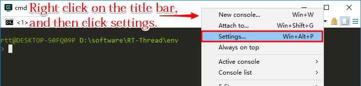

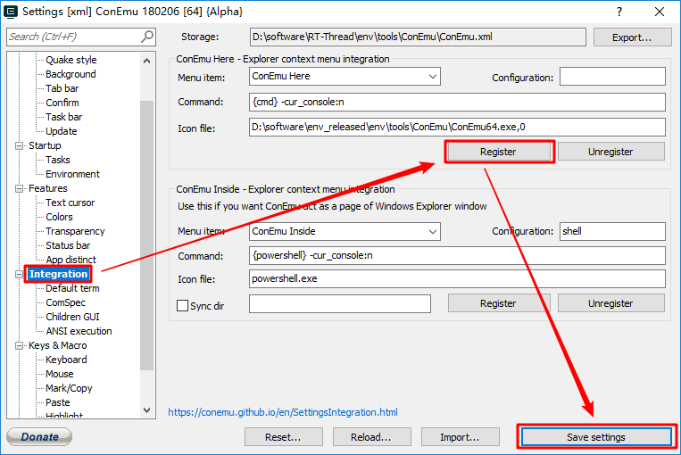

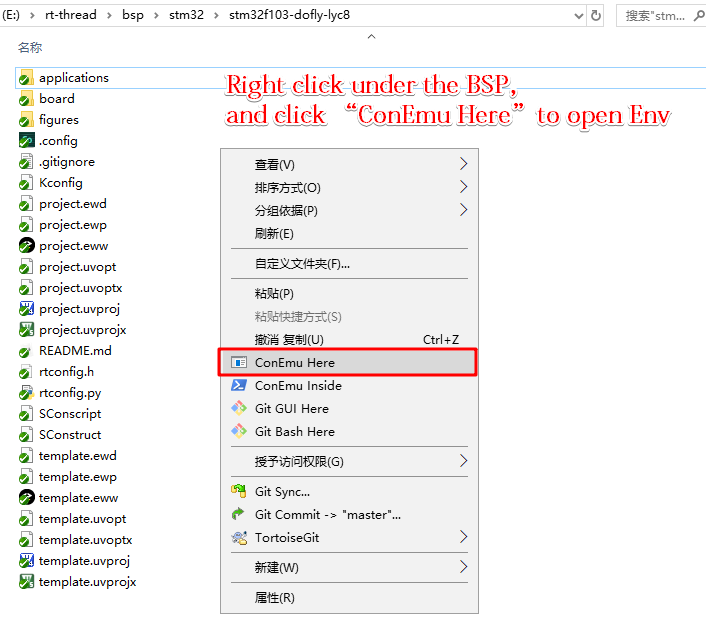

Follow the steps from the image to launch the Env console from the right-click menu in any folder. Result are as follows:

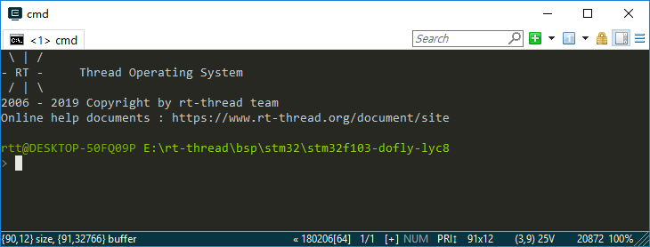

> Due to the need for the environment variables of the Env process to be set, the anti-virus software may misreport at the first startup. If the anti-virus software misreport is encountered, allow Env related programs to run, and then add related programs to the white list.

### Compile

Scons is a compile building tool used by RT-Thread to compile RT-Threads using the scons related commands.

#### Step One: Switch to the BSP root directory

If you use Method 1 to open Env console, you need to switch to the target BSP using the `cd` command.

For example, the target BSP is `rt-thread\bsp\stm32\stm32f103-dofly-lyc8`:

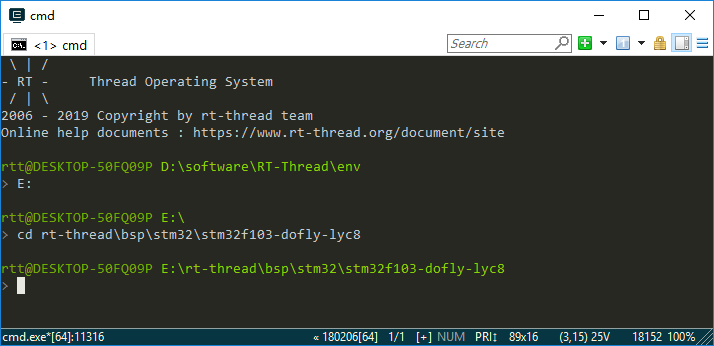

#### Step Two: Compile the BSP

- Env carries `Python & scons` . To compile BSP, just use the default ARM_GCC toolchain by running `scons` command in the target BSP directory.

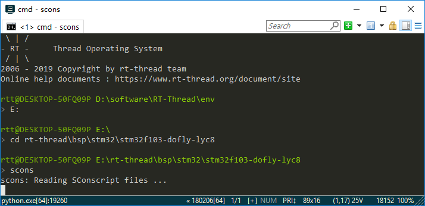

Compiled successfully:

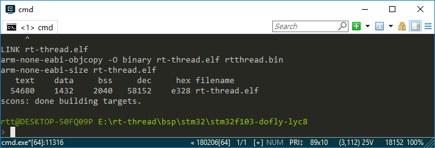

If you use mdk/iar for project development, you can use the project file in the BSP directly or use one of the following commands to regenerate the project and compile and download it.

```
scons --target=iar
scons --target=mdk4
scons --target=mdk5
```

For more scons tutorials, please refer to  [*Scons*](../scons/scons.md).

### BSP configuration: menuconfig

Menuconfig is a graphical configuration tool that RT-Thread uses to configure and tailor the entire system.

#### Instruction for Shortcuts

Go to the BSP root directory and open the interface by entering `menuconfig`. The menuconfig common shortcuts are as shown:

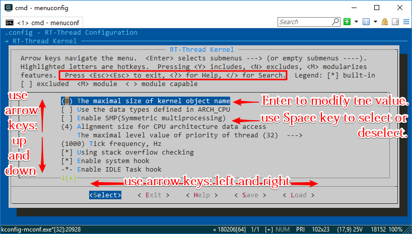

#### Modify Settings

There are many types of configuration items in menuconfig, and the modification methods are different. The common types are:

- On/Off Type: Use the space bar to select or close
- Value, string type: After pressing the Enter key, a dialog box will appear, and the configuration items will be modified in the dialog box.

#### Save Settings

After selecting the configuration item, press `ESC` to exit, and select `Save` to automatically generate the `rtconfig.h` file. At this point, using the `scons` command again will recompile the project according to the new rtconfig.h file.

### Package Management

RT-Thread provides a package management platform where the officially available or developer-supplied packages are stored. The platform provides developers with a choice of reusable software packages that are an important part of RT-Thread.

[Click here](https://github.com/RT-Thread-packages) to view the official RT-Thread package, most of which have detailed documentation and usage examples.

As a part of Env, the `package` tool provides developers with management functions such as downloading, updating, and deleting packages.

Enter the `pkgs` command on the Env command line to see an introduction to the command:

```
> pkgs
usage: env.py package [-h] [--update] [--list] [--wizard] [--upgrade]
                      [--printenv]

optional arguments:
  -h, --help  show this help message and exit
  --update    update packages, install or remove the packages as you set in
              menuconfig
  --list      list target packages
  --wizard    create a package with wizard
  --upgrade   update local packages list from git repo
  --printenv  print environmental variables to check
```

#### Download, update, and delete packages

Before downloading and updating the software package, you need to **open** the target package in  `menuconfig`.

These packages locates in `RT-Thread online packages` , Once you enter the menu, you can see the following package categories:

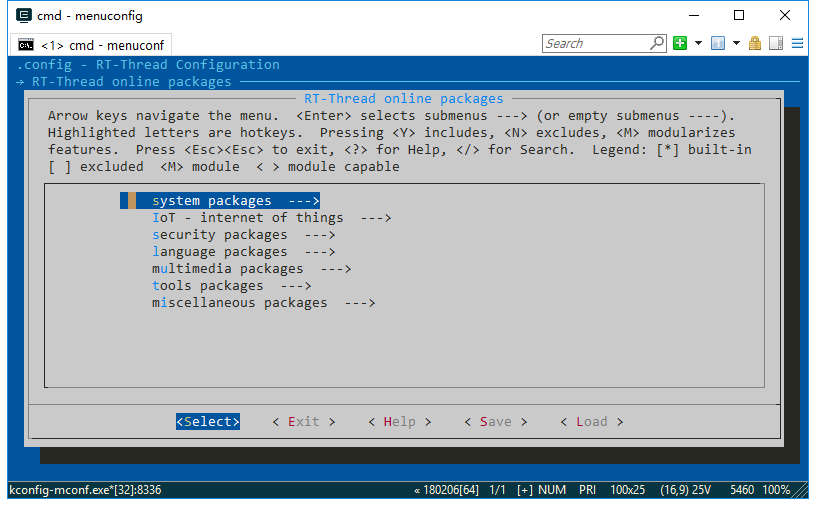

Find the package you need and open, then save and exit menuconfig. The package will be marked, but has not been downloaded locally, so it is still unavailable.

- **download**: if the software package is selected but not downloaded, enter: `pkgs --update`, then the software package will be downloaded automatically;
- **update**: if the selected package has a latest update on the server and the version is selected **latest**, then enter `pkgs --update` , the package will be updated in local;
- **delete**: if a software package is not needed, deselect it in menuconfig and then use  `pkgs --update` command.  Then locally downloaded but unselected packages will be deleted.

#### Update local package information

As the package system grows, more and more packages will be added, so the list of packages in menuconfig may be **unsynchronized**  with the server.  This can be fixed by using `pkgs --upgrade` command, which not only synchronizes updates to local package information, but also upgrades to Env's functional scripts, which are recommended for regular use.

### Env Tool Configuration

- The new version of the Env tool includes an automatic update package and an option to automatically generate mdk/iar projects. The default is not enabled. It can be configured using `menuconfig -s/--setting` .

- Use `menuconfig -s` command to enter the Env configuration interface

  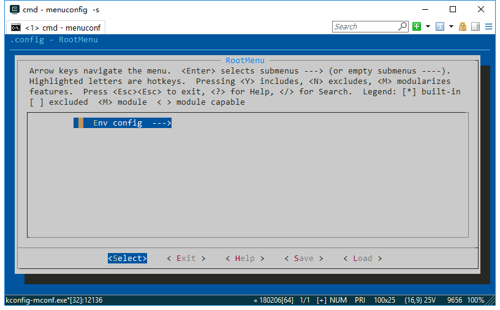

  Press Enter to enter the configuration menu with 3 configuration options:

  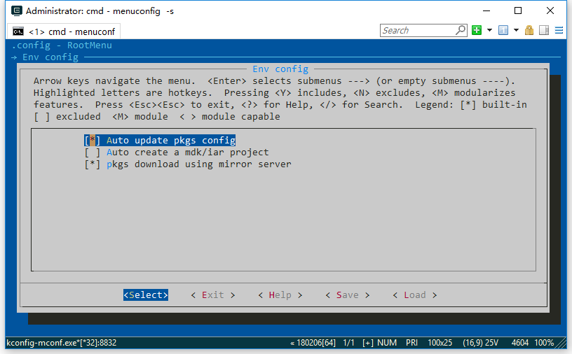

The three options are:

- **Auto update pkgs config**：Automatic package update function: After exiting the menuconfig function, `pkgs --update` command is automatically used to download and install the package and delete the old package. This feature is used when downloading online packages.
- **Auto create a MDK/IAR project**: After modifying the menuconfig configuration, you must re-generate the project by typing  `scons --target=xxx` . Turning on this feature will automatically regenerate the project when you exit menuconfig, without having to manually enter the scons command to regenerate the project.

## Use Env in Your Project

### Requirements for Using Env

- Menuconfig is a feature of RT-Thread over version 3.0. It is recommended to update RT-Thread over version 3.0.
- Currently RT-Thread does not support `menuconfig` for all BSPs, which means that some BSPs can't be configured with menuconfig for the time being, but the commonly used BSPs are already supported.

### How to Modify Options in Menuconfig

If you want to add a macro definition in the configuration item of menuconfig, you can modify the `Kconfig` file under BSP. The modification method can search Kconfig syntax on the Internet for detailed documentation, or refer to the Kconfig file in RT-Thread or The Kconfig file in the BSP that supports menuconfig.

### To Add menuconfig function to New Project

New project here refers to a newly developed project that has not yet generated `.config` and `rtconfig.h`. Because these two files are only created when menuconfig is first saved. The specific process is as follows:

1. Copy the kconfig file from the BSP that already supports the menuconfig function to the new project root directory.
2. Note that modifying the RTT_ROOT value in Kconfig is the directory where RT-Thread is located, otherwise RTT_ROOT may be not found.
3. Start the configuration with the menuconfig command.

### To Add menuconfig function to Old Project

Old project here refers to the development that has been going on for a while, and there is a modified `rtconfig.h` file in the project, but there is no project configured with menuconfig. The specific process is as follows:

1. First back up the rtconfig.h file in the old project.
2. Use `scons --genconfig` command to generate a `.config` file from the existing `rtconfig.h` file. The `.config` file generated here saves the configuration parameters of the `rtconfig.h` file in the old project.
3. Copy the `kconfig` file from the BSP that already supports the menuconfig function to the root directory of the project you want to modify.
4. Note that modifying the RTT_ROOT value in Kconfig is the directory where RT-Thread is located, otherwise RTT_ROOT may be not found.
5. Use the menuconfig command to configure the old project we want to modify. Menuconfig will read the `.config` file generated in the second step and generate a new `.config` file and rtconfig.h file based on the configuration parameters of the old project.
6. Check the old and new rtconfig.h files. If there are any inconsistencies, you can use the menuconfig command to adjust the configuration items.

## Explore More with pip

In the Env environment, you can't directly use the pip tool provided by Python to install more modules. If you need to use the pip function in Env environment, you can reinstall the pip tool as follows:

1. Download the get-pip.py file from https://bootstrap.pypa.io/get-pip.py and save it on disk.
2. Run `python get-pip.py` command in the Env environment to reinstall the pip tool.
3. After the pip tool is reinstalled successfully, you can use `pip install module-name` command to install the required modules.

## Notes for Using Env

- For the first time, Env is recommended to go to the official website to download the latest version of the Env tool. The new version of Env will have better compatibility and also support automatic update commands.
- You can use the Env built-in command `pkgs --upgrade` to update the package list and Env's function code to minimize the problems you have fixed.
- Do not have Chinese or spaces in the routes of Env.
- Do not have Chinese or spaces in the routes where the BSP project is located.

## FAQs

### Q: There's unintelligible texts appear in Env.

**A:** First check if there is a Chinese route.

Check if the `chcp` command has been added to the system environment variable and try to change the character format to English using the `chcp 437` command. If the prompt does not have a `chcp` command, it is considered not to be added to the environment variable.

The directory where the `chcp` command is located may be added to the environment variable in the `system32` directory.

### Q: It prompts that the git command cannot be found.

  'git' is not recognized as an internal or external command, possible program or batch file.

**A:** Git is not installed. You need to install git and add environment variables.

### Q: It prompts that the CMD command cannot be found.

**A:** Right-click–>> Property—>> Advanced System Settings—>> Environment Variable,  Add `C:\Windows\System32` to system environment variables.

### Q: Prompt "no module named site" when running python.

**A:** Computer right button –>> Properties—>> Advanced System Settings—>> Environment Variable, in the user variable of the administrator, create a new variable named PYTHONHOME, and the variable value is: `F:\git_repositories\env\tools\Python27` （the installation route of Python in Env）, do not add ";" afterwards, otherwise it will be invalid. If add PYTHONHOME can not solve theproblem, try to add PYTHONPATH in the same way.

### Q: What types of projects can I generate under Env?

 **A:**

1. Currently, you can use the scons tool to generate mdk/iar projects under Env. There is no automatic generation of eclipse projects.
2. Generally, using gcc's toolchain, using an editor such as source insight or VS Code to edit the code and compile with `scons` command.

### Q:How can my own BSP support menuconfig?

**A:** You can refer to this chapter **Use Env in Your Project**.

### Q: What is the difference between the pkgs --upgrade command and the pkgs --update command?

 **A:**

1. The `pkgs --upgrade` command is used to upgrade the Env script itself and the list of packages. You cannot select a recently updated package without the latest package list.
2. The `pkgs --update` command is used to update the package itself. For example, if you selected json and mqtt packages in menuconfig, you did not download them when you exit menuconfig. You need to use the `pkgs --update` command, at which point Env will download the package you selected and add it to your project.
3. The new version of Env supports the `menuconfig -s/--setting` command. If you don't want to use the `pkgs --update` command after replacing the package, configure Env after using the `menuconfig -s/--setting` command. Select each time you use menuconfig. After the package is automatically updated.

### Q: Prompt “can't find file Kconfig” while using menuconfig.

**A:** The Kconfig file is missing from the current working BSP directory. Please refer *To Add menuconfig function to New Project* and *To Add menuconfig function to Old Project*.
