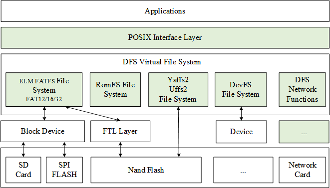
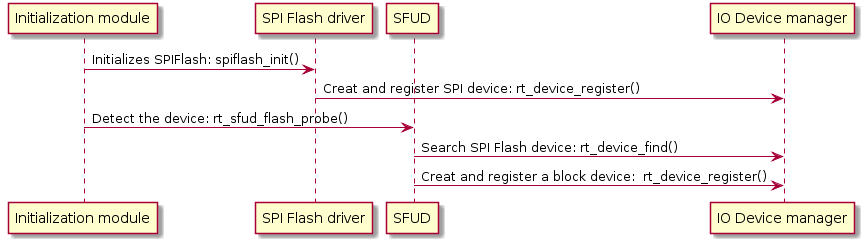
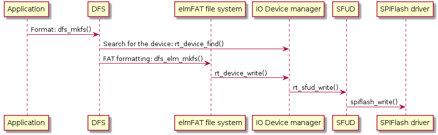
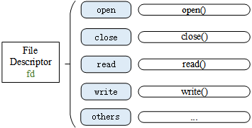

# Virtual File System

In early days, the amount of data to be stored in embedded systems was relatively small and data types were relatively simple.
The data were stored by directly writing to a specific address in storage devices. However, with today modern technology, embedded device's functions are getting complicated and required more data storage. Therefore, we need new data management methods to simplify and organize the data storage.

A file system is made up of abstract data types and also a mechanism for providing data access, retrieve, implements, and store them in hierarchical structure. A folder contains multiple files and a file contains multiple organized data on the file system. This chapter explains about the RT-Thread file system, architecture, features and usage of virtual file system in RT-Thread OS.

## An Introduction to DFS

Device File System (DFS) is a virtual file system component and name structure is similar to UNIX files and folders. Following is the files and folders structure:

The root directory is represented by "/". For example, if users want to access to f1.bin file under root directory, it can be accessed by "/f1.bin". If users want to access to f1.bin file under /2019 folder, it can be accessed by "/data/2019/f1.bin" according to their folder paths as in UNIX/Linux unlike Windows System.

### The Architecture of DFS

The main features of the RT-Thread DFS component are:

- Provides a unified POSIX file and directory operations interface for applications: read, write, poll/select, and more.
- Supports multiple types of file systems, such as FatFS, RomFS, DevFS, etc., and provides management of common files, device files, and network file descriptors.
- Supports multiple types of storage devices such as SD Card, SPI Flash, Nand Flash, etc.

The hierarchical structure of DFS is shown in the following figure, which is mainly divided into POSIX interface layer, virtual file system layer and device abstraction layer.



### POSIX Interface Layer

POSIX stands for Portable Operating System Interface of UNIX (POSIX). The POSIX standard defines the interface standard that the operating system should provide for applications. It is a general term for a series of API standards defined by IEEE for software to run on various UNIX operating systems.

The POSIX standard is intended to achieve software portability at the source code level. In other words, a program written for a POSIX-compatible operating system should be able to compile and execute on any other POSIX operating system (even from another vendor). RT-Thread supports the POSIX standard interface, so it is easy to port Linux/Unix programs to the RT-Thread operating system.

On UNIX-like systems, normal files, device files, and network file descriptors are the same. In the RT-Thread operating system, DFS is used to achieve this uniformity. With the uniformity of such file descriptors, we can use the `poll/select` interface to uniformly poll these descriptors and bring convenience to the implement of the  program functions.

Using the `poll/select` interface to block and simultaneously detect whether a group of  I/O devices which support non-blocking have events (such as readable, writable, high-priority error output, errors, etc.) until a device trigger the event was or exceed the specified wait time. This mechanism can help callers find devices that are currently ready, reducing the complexity of programming.

### Virtual File System Layer

Users can register specific file systems to DFS, such as FatFS, RomFS, DevFS, etc. Here are some common file system types:

* FatFS is a Microsoft FAT format compatible file system developed for small embedded devices. It is written in ANSI C and has good hardware independence and portability. It is the most commonly used file system type in RT-Thread.
* The traditional RomFS file system is a simple, compact, read-only file system that does not support dynamic erasing and saving or storing data in order, thus it supports applications to run in XIP (execute In Place) method and save RAM space while the system is running.
* The Jffs2 file system is a log flash file system. It is mainly used for NOR flash memory, based on MTD driver layer, featuring: readable and writable, supporting data compression, Hash table based log file system, and providing crash/power failure security protection, write balance support, etc..
* DevFS is the device file system. After the function is enabled in the RT-Thread operating system, the devices in the system can be virtualized into files in the `/dev` folder, so that the device can use the interfaces such as `read` and `write` according to the operation mode of the file to operate.
* NFS (Network File System) is a technology for sharing files over a network between different machines and different operating systems. In the development and debugging phase of the operating system, this technology can be used to build an NFS-based root file system on the host and mount it on the embedded device, which can easily modify the contents of the root file system.
* UFFS is short for Ultra-low-cost Flash File System. It is an open source file system developed by Chinese people and used for running Nand Flash in small memory environments such as embedded devices. Compared with the Yaffs file system which often used in embedded devices, it has the advantages of less resource consumption, faster startup speed and free.

### Device Abstraction Layer

The device abstraction layer abstracts physical devices such as SD Card, SPI Flash, and Nand Flash into devices that are accessible to the file system. For example, the FAT file system requires that the storage device be a block device type.

Different file system types are implemented independently of the storage device driver, so the file system function can be correctly used after the drive interface of the underlying storage device is docked with the file system.

## Mount Management

The initialization process of the file system is generally divided into the following steps:

1. Initialize the DFS component.
2. Initialize a specific type of file system.
3. Create a block device on the memory.
4. Format the block device.
5. Mount the block device to the DFS directory.
6. When the file system is no longer in use, you can unmount it.

### Initialize the DFS Component

The initialization of the DFS component is done by the dfs_init() function. The dfs_init() function initializes the relevant resources required by DFS and creates key data structures that allow DFS to find a specific file system in the system and get a way to manipulate files within a particular storage device. This function will be called automatically if auto-initialization is turned on (enabled by default).

### Registered File System

After the DFS component is initialized, you also need to initialize the specific type of file system used, that is, register a specific type of file system into DFS. The interface to register the file system is as follows:

```c
int dfs_register(const struct dfs_filesystem_ops *ops);
```

|**Parameter**|**Description**                          |
|----------|------------------------------------|
| ops      | a collection of operation functions of the file system |
|**return**|**——**                            |
| 0        | file registered successfully |
| -1      | file fail to register |

This function does not require user calls, it will be called by the initialization function of different file systems, such as the elm-FAT file system's initialization function `elm_init()`. After the corresponding file system is enabled, if automatic initialization is enabled (enabled by default), the file system initialization function will also be called automatically.

The `elm_init()` function initializes the elm-FAT file system, which calls the `dfs_register(`) function to register the elm-FAT file system with DFS. The file system registration process is shown below:


### Register a Storage Device as a Block Device

Only block devices can be mounted to the file system,  so you need to create the required block devices on the storage device. If the storage device is SPI Flash, you can use the "Serial Flash Universal Driver Library SFUD" component, which provides various SPI Flash drivers, and abstracts the SPI Flash into a block device for mounting. The  process of registering block device is shown as follows:



### Format the file system

After registering a block device, you also need to create a file system of the specified type on the block device, that is, format the file system. You can use the `dfs_mkfs()` function to format the specified storage device and create a file system. The interface to format the file system is as follows：

```c
int dfs_mkfs(const char * fs_name, const char * device_name);
```

|**Parameter**   |**Description**                  |
|-------------|----------------------------|
| fs_name     | type of the file system |
| device_name | name of the block device |
|**return**   |**——**                    |
| 0           | file system formatted successfully |
| -1         | fail to format the file system |

The file system type (fs_name) possible values and the corresponding file system is shown in the following table:

|**Value**   |**File System Type**                  |
|-------------|----------------------------|
| elm         | elm-FAT file system |
| jffs2       | jffs2 journaling flash file system |
| nfs         | NFS network file system |
| ram         | RamFS file system |
| rom         | RomFS read-only file system |
| uffs        | uffs file system |

Take the elm-FAT file system format block device as an example. The formatting process is as follows:



You can also format the file system using the `mkfs` command. The result of formatting the block device sd0 is as follows:

```shell
msh />mkfs sd0                    # Sd0 is the name of the block device, the command will format by default
sd0 is elm-FAT file system
msh />
msh />mkfs -t elm sd0             # Use the -t parameter to specify the file system type as elm-FAT file system
```

### Mount file system

In RT-Thread, mounting refers to attaching a storage device to an existing path. To access a file on a storage device, we must mount the partition where the file is located to an existing path and then access the storage device through this path. The interface to mount the file system is as follows:

```c
int dfs_mount(const char   *device_name,
              const char   *path,
              const char   *filesystemtype,
              unsigned long rwflag,
              const void   *data);
```

|**Parameter**      |**Description**                    |
|----------------|------------------------------|
| device_name    | the name of the block device that has been formatted |
| path           | the mount path |
| filesystemtype | The type of the mounted file system. Possible values can refer to the dfs_mkfs() function description. |
| rwflag         | read and write flag bit |
| data           | private data for a specific file system |
|**return**      | **——**                     |
| 0              | file system mounted successfully |
| -1            | file system mount fail to be mounted |

If there is only one storage device, it can be mounted directly to the root directory `/`.

### Unmount a file system

When a file system does not need to be used anymore, it can be unmounted. The interface to unmount the file system is as follows:

```c
int dfs_unmount(const char *specialfile);
```

|**Parameter**   |**Description**                |
|-------------|--------------------------|
| specialfile | mount path |
|**return**   |**——**                  |
| 0           | unmount the file system successfully |
| -1         | fail to unmount the file system |

## Document Management

This section introduces the functions that are related to the operation of the file. The operation of the file is generally based on the file descriptor fd, as shown in the following figure:



### Open and Close Files

To open or create a file, you can call the following open() function:

```c
int open(const char *file, int flags, ...);
```

|**Parameter**  |**Description**                            |
|------------|--------------------------------------|
| file       | file names that are opened or created |
| flags      | Specify the way to open the file, and values can refer to the following table. |
|**return**  |**——**                                 |
| file descriptor | file opened successfully |
| -1        | fail to open the file    |

A file can be opened in a variety of ways, and multiple open methods can be specified at the same time. For example, if a file is opened by O_WRONLY and O_CREAT, then when the specified file which need to be open does not exist, it will create the file first and then open it as write-only. The file opening method is as follows:

|**Parameter**|**Description**                     |
|----------|-----------------------|
| O_RDONLY | open file in read-only mode |
| O_WRONLY | open file in write-only mode |
| O_RDWR   | open file in read-write mode |
| O_CREAT  | if the file to be open does not exist, then you can create the file |
| O_APPEND | When the file is read or written, it will start from the end of the file, that is, the data written will be added to the end of the file in an additional way. |
| O_TRUNC  | empty the contents of the file if it already exists |

If you no longer need to use the file, you can use the `close()` function to close the file, and `close()` will write the data back to disk and release the resources occupied by the file.

```
int close(int fd);
```

|**Parameter**|**Description**    |
|----------|--------------|
| fd       | file descriptor |
|**return**|**——**      |
| 0        | file closed successfully |
| -1      | fail to close the file |

### Read and Write Data

To read the contents of a file, use the `read()` function:

```c
int read(int fd, void *buf, size_t len);
```

|**Parameter**|**Description**                                |
|----------|------------------------------------------|
| fd       | file descriptor                |
| buf      | buffer pointer                |
| len      | read number of bytes of the files |
|**return**|**——**                                  |
| int      | the number of bytes actually read |
| 0        | read data has reached the end of the file or there is no readable data |
| -1      | read error, error code to view the current thread's errno |

This function reads the `len` bytes of the file pointed to by the parameter `fd` into the memory pointed to by the `buf pointer`. In addition, the read/write position pointer of the file moves with the byte read.

To write data into a file, use the `write()` function:

```c
int write(int fd, const void *buf, size_t len);
```

|**Parameter**|**Description**                             |
|----------|---------------------------------------|
| fd      | file descriptor             |
| buf      | buffer pointer              |
| len      | the number of bytes written to the file |
|**return**|**——**                               |
| int      | the number of bytes actually written |
| -1      | write error, error code to view the current thread's errno |

This function writes `len` bytes in the memory pointed out by the `buf pointer` into the file pointed out by the parameter `fd`. In addition, the read and write location pointer of the file moves with the bytes written.

### Rename

To rename a file, use the `rename()` function:

```
int rename(const char *old, const char *new);
```

|**Parameter**|**Description**    |
|----------|--------------|
| old      | file's old name |
| new      | new name |
|**return**|**——**      |
| 0        | change the name successfully |
| -1      | fail to change the name |

This function changes the file name specified by the parameter `old` to the file name pointed to by the parameter `new`. If the file specified by `new` already exists, the file will be overwritten.

### Get Status

To get the file status, use the following `stat()` function:

```c
int stat(const char *file, struct stat *buf);
```

|**Parameter**|**Description**                                  |
|----------|--------------------------------------------|
| file | file name                                                    |
| buf      | structure pointer to a structure that stores file status information |
|**return**|**——**                                    |
| 0        | access status successfully    |
| -1      | fail to access to status       |

### Delete Files

Delete a file in the specified directory using the `unlink()` function:

```
int unlink(const char *pathname);
```

|**Parameter**|**Description**              |
|----------|------------------------|
| pathname | specify the absolute path to delete the file |
|**return**|**——**                |
| 0        | deleted the file successfully |
| -1      | fail to deleted the file |

### Synchronize File Data to Storage Devices

Synchronize all modified file data in memory to the storage device using the `fsync()` function:

```c
int fsync(int fildes);
```

|**Parameter**|**Description**    |
|----------|--------------|
| fildes   | file descriptor |
|**Return**|**——**      |
| 0        | synchronize files successfully |
| -1      | fail to synchronize files |

### Query file system related information

Use the `statfs()` function to query file system related information.

```c
int statfs(const char *path, struct statfs *buf);
```

|**Parameter**|**Description**                        |
|----------|----------------------------------|
| path     | file system mount path |
| buf      | structure pointer for storing file system information |
|**Return**|**——**                          |
| 0        | query file system information successfully |
| -1      | fail to query file system information |

### Monitor I/O device status

To monitor the I/O device for events, use the `select()` function:

```c
int select( int nfds,
            fd_set *readfds,
            fd_set *writefds,
            fd_set *exceptfds,
            struct timeval *timeout);
```

|**Parameter** |**Description**                                               |
|-----------|---------------------------------------------------------|
| nfds      | The range of all file descriptors in the collection, that is, the maximum value of all file descriptors plus 1 |
| readfds   | Collection of file descriptors that need to monitor read changes |
| writefds  | Collection of file descriptors that need to monitor write changes |
| exceptfds | Collection of file descriptors that need to be monitored for exceptions |
| timeout   | timeout of **select**           |
|**return** |**——**                                                 |
| positive value | a read/write event or error occurred in the monitored file collection |
| 0         | waiting timeout, no readable or writable or erroneous files |
| negative value | error                                               |

Use the `select()` interface to block and simultaneously detect whether a group of non-blocking I/O devices have events (such as readable, writable, high-priority error output, errors, etc.) until a device triggered an event or exceeded a specified wait time.

## Directory management

This section describes functions that directory management often uses, and operations on directories are generally based on directory addresses, as shown in the following image:


### Create and Delete Directories

To create a directory, you can use the mkdir() function:

```c
int mkdir(const char *path, mode_t mode);
```

|**Parameter**|**Description**      |
|----------|----------------|
| path     | the absolute address of the directory |
| mode     | create a pattern |
|**Return**|**——**        |
| 0        | create directory successfully |
| -1      | fail to create directory |

This function is used to create a directory as a folder, the parameter path is the absolute path of the directory, the parameter mode is not enabled in the current version, so just fill in the default parameter 0x777.

Delete a directory using the rmdir() function:

```c
int rmdir(const char *pathname);
```

|**Parameter**|**Description**              |
|----------|------------------------|
| pathname | absolute path to delete the directory |
|**Return**|**——**                |
| 0        | delete the directory successfully |
| -1      | fail to delete the directory |

### Open and Close the Directory

Open the directory to use the `opendir()` function:

```c
DIR* opendir(const char* name);
```

|**Parameter**|**Description**                               |
|----------|-----------------------------------------|
| name     | absolute address of the directory |
|**Return**|**——**                                 |
| DIR      | open the directory successfully, and return to a pointer to the directory stream |
| NULL     | fail to open                    |

To close the directory, use the `closedir()` function:

```c
int closedir(DIR* d);
```

|**Parameter**|**Description**    |
|----------|--------------|
| d        | directory stream pointer |
|**Return**|**——**      |
| 0        | directory closed successfully |
| -1     | directory closing error       |

This function is used to close a directory and must be used with the `opendir()` function.

### Read Directory

To read the directory, use the `readdir()` function:

```c
struct dirent* readdir(DIR *d);
```

|**Parameter**|**Description**                             |
|----------|---------------------------------------|
| d        | directory stream pointer    |
|**Return**|**——**                               |
| dirent   | read successfully and return to a structure pointer to a directory entry |
| NULL     | read to the end of the directory |

This function is used to read the directory, and the parameter d is the directory stream pointer. In addition, each time a directory is read, the pointer position of the directory stream is automatically recursed by 1 position backward.

### Get the Read Position of the Directory Stream

To get the read location of the directory stream, use the `telldir()` function:

```
long telldir(DIR *d);
```

|**Parameter**|**Description**        |
|----------|------------------|
| d        | directory stream pointer |
|**Return**|**——**          |
| long     | read the offset of the position |

The return value of this function records the current position of a directory stream. This return value represents the offset from the beginning of the directory file. You can use this value in the following  `seekdir()` to reset the directory to the current position. In other words, the `telldir()` function can be used with the `seekdir()` function to reset the read position of the directory stream to the specified offset.

### Set the Location to Read the Directory Next Time

Set the location to read the directory next time using the `seekdir()` function:

```
void seekdir(DIR *d, off_t offset);
```

|**Parameter**|**Description**                  |
|----------|----------------------------|
| d        | directory stream pointer |
| offset   | the offset value, displacement from this directory |

This is used to set the read position of the parameter d directory stream, and starts reading from this new position when readdir() is called.

### Reset the Position of Reading Directory to the Beginning

To reset the directory stream's read position to the beginning, use the `rewinddir()` function:

```
void rewinddir(DIR *d);
```

|**Parameter**|**Description**  |
|----------|------------|
| d        | directory stream pointer |

This function can be used to set the current read position of the `d` directory stream to the initial position of the directory stream.

## DFS Configuration Options

The specific configuration path of the file system in menuconfig is as follows:

```c
RT-Thread Components  --->
    Device virtual file system  --->
```

The configuration menu description and corresponding macro definitions are shown in the following table:

|**Configuration Options** |**Corresponding Macro Definition**|**Description** |
|-------------------------------|-------------------------------|----------------------|
|[*] Using device virtual file system |RT_USING_DFS |Open DFS virtual file system |
|[*]   Using working directory |DFS_USING_WORKDIR |open a relative path |
|(2)   The maximal number of mounted file system |DFS_FILESYSTEMS_MAX |maximum number of mounted file systems |
|(2)   The maximal number of file system type |DFS_FILESYSTEM_TYPES_MAX |maximum number of supported file systems |
|(4)   The maximal number of opened files | DFS_FD_MAX|maximum number of open files |
|[ ]   Using mount table for file system|RT_USING_DFS_MNTTABLE |open the automatic mount table |
|[*]   Enable elm-chan fatfs |RT_USING_DFS_ELMFAT |open the elm-FatFs file system |
|[*]   Using devfs for device objects |RT_USING_DFS_DEVFS | open the DevFS device file system |
|[ ]   Enable ReadOnly file system on flash |RT_USING_DFS_ROMFS |open the RomFS file system |
|[ ]   Enable RAM file system |RT_USING_DFS_RAMFS |open the RamFS file system |
|[ ]   Enable UFFS file system: Ultra-low-cost Flash File System |RT_USING_DFS_UFFS |open the UFFS file system |
|[ ]   Enable JFFS2 file system |RT_USING_DFS_JFFS2 |open the JFFS2 file system |
|[ ]   Using NFS v3 client file system |RT_USING_DFS_NFS |open the NFS file system |

By default, the RT-Thread operating system does not turn on the relative path function in order to obtain a small memory footprint. When the Support Relative Paths option is not turned on, you should use an absolute directory when working with files and directory interfaces (because there is no currently working directory in the system). If you need to use the current working directory and the relative directory, you can enable the relative path function in the configuration item of the file system.

When the option `[*] Use mount table for file system` is selected, the corresponding macro `RT_USING_DFS_MNTTABLE` will be enabled to turn on the automatic mount table function. The automatic `mount_table[]` is provided by the user in the application code. The user needs to specify the device name, mount path, file system type, read and write flag and private data in the table. After that, the system will traverse the mount table to execute the mount. It should be noted that the mount table must end with `{0}` to judge the end of the table.

The automatic mount table `mount_table []` is shown below, where the five members of `mount_table [0]` are the five parameters of function `dfs_mount ()`. This means that the elm file system is mounted `/` path on the flash 0 device, rwflag is 0, data is 0, `mount_table [1]` is `{0}` as the end to judge the end of the table.

```c
const struct dfs_mount_tbl mount_table[] =
{
    {"flash0", "/", "elm", 0, 0},
    {0}
};
```

### elm-FatFs File System Configuration Option

Elm-FatFs can be further configured after opening the elm-FatFs file system in menuconfig. The configuration menu description and corresponding macro definitions are as follows:

|**Configuration Options** |**Corresponding Macro Definition**|**Description** |
|---------------------------------|-----------------------------------|-------------------|
|(437) OEM code page |RT_DFS_ELM_CODE_PAGE |encoding mode |
|[*] Using RT_DFS_ELM_WORD_ACCESS |RT_DFS_ELM_WORD_ACCESS | |
|Support long file name (0: LFN disable)  ---> |RT_DFS_ELM_USE_LFN |open long file name submenu |
|(255) Maximal size of file name length |RT_DFS_ELM_MAX_LFN |maximum file name length |
|(2) Number of volumes (logical drives) to be used. |RT_DFS_ELM_DRIVES |number of devices mounting FatFs  |
|(4096) Maximum sector size to be handled. |RT_DFS_ELM_MAX_SECTOR_SIZE |the sector size of the file system|
|[ ] Enable sector erase feature |RT_DFS_ELM_USE_ERASE | |
|[*] Enable the reentrancy (thread safe) of the FatFs module |RT_DFS_ELM_REENTRANT |open reentrant|

#### Long File Name

By default, FatFs file naming has the following disadvantages:

- The file name (without suffix) can be up to 8 characters long and the suffix can be up to 3 characters long. The file name and suffix will be truncated when the limit is exceeded.
- File name does not support case sensitivity (displayed in uppercase).

If you need to support long filenames, you need to turn on the option to support long filenames. The  submenu of the long file name is described as follows:

|**Configuration Options** |**Corresponding Macro Definition**|**Description** |
|----------------------------------|-------------------------|---------------------|
|( ) 0: LFN disable |RT_DFS_ELM_USE_LFN_0 |close the long file name |
|( ) 1: LFN with static LFN working buffer|RT_DFS_ELM_USE_LFN_1 |use static buffers to support long file names, and multi-threaded operation of file names will bring re-entry problems |
|( ) 2: LFN with dynamic LFN working buffer on the stack |RT_DFS_ELM_USE_LFN_2 |long file names are supported by temporary buffers in the stack. Larger demand for stack space. |
|(X) 3: LFN with dynamic LFN working buffer on the heap |RT_DFS_ELM_USE_LFN_3 |use the heap (malloc request) buffer to store long filenames, it is the safest (default) |

#### Encoding Mode

When long file name support is turned on, you can set the encoding mode for the file name. RT-Thread/FatFs uses 437 encoding (American English) by default. If you need to store the Chinese file name, you can use 936 encoding (GBK encoding). The 936 encoding requires a font library of approximately 180KB. If you only use English characters as a file, we recommend using 437 encoding (American English), this will save this 180KB of Flash space.

The file encodings supported by FatFs are as follows:

```c
/* This option specifies the OEM code page to be used on the target system.
/  Incorrect setting of the code page can cause a file open failure.
/
/   1   - ASCII (No extended character. Non-LFN cfg. only)
/   437 - U.S.
/   720 - Arabic
/   737 - Greek
/   771 - KBL
/   775 - Baltic
/   850 - Latin 1
/   852 - Latin 2
/   855 - Cyrillic
/   857 - Turkish
/   860 - Portuguese
/   861 - Icelandic
/   862 - Hebrew
/   863 - Canadian French
/   864 - Arabic
/   865 - Nordic
/   866 - Russian
/   869 - Greek 2
/   932 - Japanese (DBCS)
/   936 - Simplified Chinese (DBCS)
/   949 - Korean (DBCS)
/   950 - Traditional Chinese (DBCS)
*/
```

#### File System Sector Size

Specify the internal sector size of FatFs, which needs to be greater than or equal to the sector size of the actual hardware driver. For example, if a spi flash chip sector is 4096 bytes, the above macro needs to be changed to 4096. Otherwise, when the FatFs reads data from the driver, the array will be out of bounds and the system will crash (the new version gives a warning message when the system is executed) .

Usually Flash device can be set to 4096, and the common TF card and SD card have a sector size of 512.

#### Reentrant

FatFs fully considers the situation of multi-threaded safe read and write security. When reading and writing FafFs in multi-threading, in order to avoid the problems caused by re-entry, you need to open the macro above. If the system has only one thread to operate the file system and there is no reentrancy problem, you can turn it off to save resources.

#### More Configuration

FatFs itself supports a lot of configuration options and the configuration is very flexible. The following file is a FatFs configuration file that can be modified to customize FatFs.

```c
components/dfs/filesystems/elmfat/ffconf.h
```

## DFS Application Example

### FinSH Command

After the file system is successfully mounted, the files and directories can be operated. The commonly used FinSH commands for file system operations are shown in the following table:

|**FinSH Command**   |**Description**                      |
|--------|----------------------------------|
| ls            | display information about files and directories |
| cd            | enter the specified directory   |
| cp            | copy file                         |
| rm            | delete the file or the directory  |
| mv            | move the file or rename it     |
| echo          | write the specified content to the specified file, write the file when it exists, and create a new file and write when the file does not exist. |
| cat           | display the contents of the file |
| pwd           | print out the current directory address |
| mkdir         | create a folder                   |
| mkfs         | formatted the file system       |

Use the `ls` command to view the current directory information, and the results are as follows:

```c
msh />ls                          # use the `ls` command to view the current directory information
Directory /:                      # you can see that the root directory already exists /
```

Use the `mkdir` command to create a folder, and the results are as follows:

```c
msh />mkdir rt-thread             # create an rt-thread folder
msh />ls                          # view directory information as follows
Directory /:
rt-thread           <DIR>
```

Use the `echo` command to output the input string to the specified output location. The result is as follows:

```c
msh />echo "hello rt-thread!!!"                # outputs the string to standard output
hello rt-thread!!!
msh />echo "hello rt-thread!!!" hello.txt      # output the string output to the hello.txt file
msh />ls
Directory /:
rt-thread           <DIR>
hello.txt           18
msh />
```

Use the `cat` command to view the contents of the file. The result is as follows:

```c
msh />cat hello.txt                     # view the contents of the hello.txt file and output
hello rt-thread!!!
```

Use the `rm` command to delete a folder or file. The result is as follows:

```c
msh />ls                                # view the information of current directory
Directory /:
rt-thread           <DIR>
hello.txt           18
msh />rm rt-thread                      # delete the rt-thread folder
msh />ls
Directory /:
hello.txt           18
msh />rm hello.txt                      # delete the hello.txt file
msh />ls
Directory /:
msh />
```

### Read and Write File Examples

Once the file system is working, you can run the application example. In the sample code, you first create a file `text.txt` using the `open()` function and write the string `"RT -Thread Programmer!\n"` in the file using the `write()` function, and then close the file. Use the ` open()` function again to open the `text.txt` file, read the contents and print it out, and close the file finally.

The sample code is as follows:

```c
#include <rtthread.h>
#include <dfs_posix.h> /* this header file need to be included when you need to operate the file */

static void readwrite_sample(void)
{
    int fd, size;
    char s[] = "RT-Thread Programmer!", buffer[80];

    rt_kprintf("Write string %s to test.txt.\n", s);

    /* open the ‘/text.txt’ file in create and read-write mode and create the file if it does not exist*/
    fd = open("/text.txt", O_WRONLY | O_CREAT);
    if (fd>= 0)
    {
        write(fd, s, sizeof(s));
        close(fd);
        rt_kprintf("Write done.\n");
    }

      /* open the ‘/text.txt’ file in read-only mode */
    fd = open("/text.txt", O_RDONLY);
    if (fd>= 0)
    {
        size = read(fd, buffer, sizeof(buffer));
        close(fd);
        rt_kprintf("Read from file test.txt : %s \n", buffer);
        if (size < 0)
            return ;
    }
  }
/* export to the msh command list */
MSH_CMD_EXPORT(readwrite_sample, readwrite sample);

```

### An Example of Changing the File Name

The sample code in this section shows how to modify the file name. The program creates a function `rename_sample()` that manipulates the file and exports it to the msh command list. This function calls the `rename()` function to rename the file named `text.txt` to `text1.txt`. The sample code is as follows:

```c
#include <rtthread.h>
#include <dfs_posix.h> /* this header file need to be included when you need to operate the file */

static void rename_sample(void)
{
    rt_kprintf("%s => %s", "/text.txt", "/text1.txt");

    if (rename("/text.txt", "/text1.txt") < 0)
        rt_kprintf("[error!]\n");
    else
        rt_kprintf("[ok!]\n");
}
/* export to the msh command list */
MSH_CMD_EXPORT(rename_sample, rename sample);
```

Run the example in the FinSH console and the results are as follows:

```shell
msh />echo "hello" text.txt
msh />ls
Directory /:
text.txt           5
msh />rename_sample
/text.txt => /text1.txt [ok!]
msh />ls
Directory /:
text1.txt           5
```

In the example demonstration, we first create a file named `text.txt` using the echo command, and then run the sample code to change the file name of the file `text.txt` to `text1.txt`.

### Get File Status Example

The sample code shows how to get the file status. The program creates a function `stat_sample()` that manipulates the file and exports it to the msh command list. This function calls the `stat()` function to get the file size information of the text.txt file. The sample code is as follows:

```c
#include <rtthread.h>
#include <dfs_posix.h> /* this header file need to be included when you need to operate the file */

static void stat_sample(void)
{
    int ret;
     struct stat buf;
     ret = stat("/text.txt", &buf);
    if(ret == 0)
    rt_kprintf("text.txt file size = %d\n", buf.st_size);
    else
    rt_kprintf("text.txt file not fonud\n");
}
/* export to the msh command list */
MSH_CMD_EXPORT(stat_sample, show text.txt stat sample);
```

Run the example in the FinSH console and the results are as follows:

```c
msh />echo "hello" text.txt
msh />stat_sample
text.txt file size = 5
```

During the example run, the file `text.txt` is first created with the `echo` command, then the sample code is run, and the file size information for the file `text.txt` is printed.

### Create a Directory Example

The sample code in this section shows how to create a directory. The program creates a function file `mkdir_sample()` that manipulates the file and exports it to the msh command list, which calls the `mkdir()` function to create a folder called `dir_test`. The sample code is as follows:

```c
#include <rtthread.h>
#include <dfs_posix.h> /* this header file need to be included when you need to operate the file */

static void mkdir_sample(void)
{
    int ret;

    /* create a directory */
    ret = mkdir("/dir_test", 0x777);
    if (ret < 0)
    {
        /* fail to create a directory */
        rt_kprintf("dir error!\n");
    }
    else
    {
        /* create a directory successfully */
        rt_kprintf("mkdir ok!\n");
    }
}
/* export to the msh command list */
MSH_CMD_EXPORT(mkdir_sample, mkdir sample);
```

Run the example in the FinSH console and the result is as follows:

```shell
msh />mkdir_sample
mkdir ok!
msh />ls
Directory /:
dir_test                 <DIR>    # <DIR> it indicates that the type of the directory is a folder
```

This example demonstrates creating a folder named `dir_test` in the root directory.

### Read directory Example

The sample code shows how to read the directory. The program creates a function `readdir_sample()` that manipulates the file and exports it to the msh command list. This function calls the `readdir()` function to get the contents of the `dir_test` folder and print it out. The sample code is as follows:

```c
#include <rtthread.h>
#include <dfs_posix.h> /* this header file need to be included when you need to operate the file */

static void readdir_sample(void)
{
    DIR *dirp;
    struct dirent *d;

    /* open the / dir_test directory */
    dirp = opendir("/dir_test");
    if (dirp == RT_NULL)
    {
        rt_kprintf("open directory error!\n");
    }
    else
    {
        /* read the directory */
        while ((d = readdir(dirp)) != RT_NULL)
        {
            rt_kprintf("found %s\n", d->d_name);
        }

        /* close the directory */
        closedir(dirp);
    }
}
/* exports to the msh command list */
MSH_CMD_EXPORT(readdir_sample, readdir sample);
```

Run the example in the FinSH console and the result is as follows:

```shell
msh />ls
Directory /:
dir_test                 <DIR>
msh />cd dir_test
msh /dir_test>echo "hello" hello.txt       # create a hello.txt file
msh /dir_test>cd ..                        # switch to the parent folder
msh />readdir_sample
found hello.txt
```

In this example, first create a hello.txt file under the dir_test folder and exit the dir_test folder. At this point, run the sample program to print out the contents of the dir_test folder.

### An Example of Setting the location of the read directory

The sample code in this section shows how to set the location to read the directory next time. The program creates a function `telldir_sample()` that manipulates the file and exports it to the msh command list. This function first opens the root directory, then reads all the directory information in the root directory and prints the directory information. Meanwhile, use the `telldir()` function to record the location information of the third directory entry. Before reading the directory information in the root directory for the second time, use the `seekdir()` function to set the read location to the address of the third directory entry previously recorded. At this point, read the information in the root directory again, and the directory information is printed out. The sample code is as follows:

```c
#include <rtthread.h>
#include <dfs_posix.h> /* this header file need to be included when you need to operate the file */

/* assume that the file operation is done in one thread */
static void telldir_sample(void)
{
    DIR *dirp;
    int save3 = 0;
    int cur;
    int i = 0;
    struct dirent *dp;

    /* open the root directory */
    rt_kprintf("the directory is:\n");
    dirp = opendir("/");

    for (dp = readdir(dirp); dp != RT_NULL; dp = readdir(dirp))
    {
        /* save the directory pointer for the third directory entry */
        i++;
        if (i == 3)
            save3 = telldir(dirp);

        rt_kprintf("%s\n", dp->d_name);
    }

    /* go back to the directory pointer of the third directory entry you just saved */
    seekdir(dirp, save3);

    /* Check if the current directory pointer is equal to the pointer to the third directory entry that was saved. */
    cur = telldir(dirp);
    if (cur != save3)
    {
        rt_kprintf("seekdir (d, %ld); telldir (d) == %ld\n", save3, cur);
    }

    /* start printing from the third directory entry */
    rt_kprintf("the result of tell_seek_dir is:\n");
    for (dp = readdir(dirp); dp != NULL; dp = readdir(dirp))
    {
         rt_kprintf("%s\n", dp->d_name);
    }

    /* close the directory */
    closedir(dirp);
}
/* exports to the msh command list */
MSH_CMD_EXPORT(telldir_sample, telldir sample);
```

In this demo example, you need to manually create the five folders from `hello_1` to `hello_5` in the root directory with the `mkdir` command, making sure that there is a folder directory under the root directory for running the sample.

Run the example in the FinSH console and the results are as follows:

```shell
msh />ls
Directory /:
hello_1             <DIR>
hello_2             <DIR>
hello_3             <DIR>
hello_4             <DIR>
hello_5             <DIR>
msh />telldir_sample
the directory is:
hello_1
hello_2
hello_3
hello_4
hello_5
the result of tell_seek_dir is:
hello_3
hello_4
hello_5
```

After running the sample, you can see that the first time you read the root directory information, it starts from the first folder and prints out all the directory information in the root directory. When the directory information is printed for the second time, since the starting position of the reading is set to the position of the third folder by using the `seekdir()` function, the second time when reading the root directory is from the third folder. Start reading until the last folder, only the directory information from `hello_3` to `hello_5` is printed.

## FAQ

### Q: What should I do if I find that the file name or folder name is not displayed properly?

  **A:** Check if long file name support is enabled, DFS feature configuration section.

### Q: What should I do if the file system fails to initialize?

  **A:** Check if the type and number of file systems allowed to be mounted in the file system configuration project are sufficient.

### Q: What should I do if the file system *mkfs* command fails?

  **A:** Check if the storage device exists. If it exists, check to see if the device driver can pass the function test, if it fails, check the driver error. Check if the libc function is enabled.

### Q: What should I do if the file system fails to mount?

**A:**

- Check if the specified mount path exists. The file system can be mounted directly to the root directory ("/"), but if you want to mount it on another path, such as ("/sdcard"). You need to make sure that the ("/sdcard") path exists. Otherwise, you need to create the `sdcard` folder in the root directory before the mount is successful.
- Check if the file system is created on the storage device. If there is no file system on the storage device, you need to create a file system on the storage using the `mkfs` command.

### Q: What should I do if SFUD cannot detect the Flash specific model?

  **A:**

- Check if the hardware pin settings are wrong.
- Whether the SPI device is already registered.
- Whether the SPI device is mounted to the bus.
- Check the `Using auto probe flash JEDEC SFDP parameter` and the `Using defined supported flash chip information table' under the 'RT-Thread Components → Device Drivers -> Using SPI Bus/Device device drivers -> Using Serial Flash Universal Driver` menu, to see whether the configuration item is selected, if it is not selected then you need to enable these two options.
- If the storage device is still not recognized with the above option turned on, then issues can be raised in the [SFUD](https://github.com/armink/SFUD) project.

 ### Q: Why does the benchmark test of the storage device take too long?

**A:**

  - Compare the [benchmark test data](https://github.com/armink/SFUD/blob/master/docs/zh/benchmark.txt) when the `system tick` is 1000 and the length of time required for this test. If the time lag is too large, you can think that the test work is not working properly.
  - Check the settings of the system tick, because some delay operations will be determined according to the tick time, so you need to set the appropriate `system tick` value according to the system conditions. If the system's `system tick` value is no less than 1000, you will need to use a logic analyzer to check the waveform to determine that the communication rate is normal.

### Q: SPI Flash implements elmfat file system, and how to keep some sectors not used by file system?

  **A:** You can create multiple block devices for the entire storage device using the [partition](https://github.com/RT-Thread-packages/partition) tool package provided by RT-Thread. And block devices can be assigned different functions.

### Q: What should I do if the program gets stuck during the test file system?

  **A:** Try using the debugger or print some necessary debugging information to determine where the program is stuck and ask questions.

### Q: How can I check the problem of the file system step by step?

  **A:** You can step through the problem from the bottom to the top.

- First check if the storage device is successfully registered and the function is normal.
- Check if a file system is created in the storage device.
- Check if the specified file system type is registered to the DFS framework, and often check if the allowed file system types and quantities are sufficient.
- Check if DFS is successfully initialized. The initialization of this step is pure software, so the possibility of error is not high. It should be noted that if component auto-initialization is turned on, there is no need to manually initialize it again.
