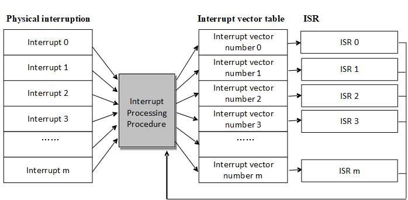
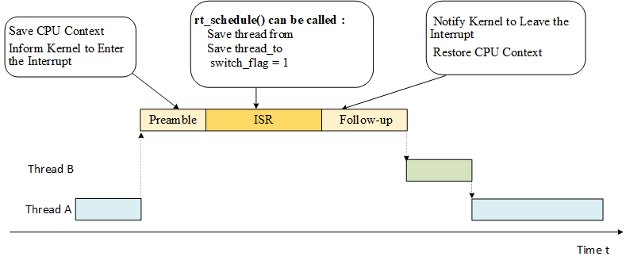
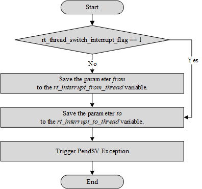
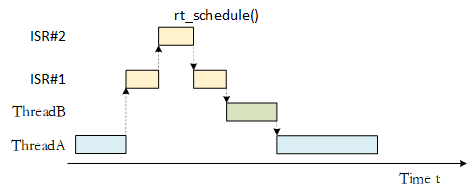
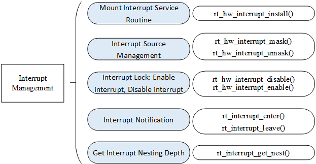

Interrupt Management
==============

Interrupts often occur in embedded operating systems. When the CPU is processing a normal task, an external urgent event has occurred, requiring the CPU to suspend the current task to handle the asynchronous event. After the external event has been handled, CPU then returns to the interrupted address to continue working on the previous task. The system that implements this function is called the interrupt system, and the source of the request requesting for the CPU interrupt is called the interrupt source. An interrupt is an exception. An exception is any event that causes the processor to move away from normal operation and execute special code. If it is not processed in time, the system will either encounter an error or face a complete breakdown. So appropriately handling exceptions to avoid errors is a very important part of improving software robustness (stability). The following picture is a simple interrupt diagram.


Interrupt processing is closely related to the CPU architecture. Therefore, this chapter first introduces the ARM Cortex-M CPU architecture, and then introduces the RT-Thread interrupt management mechanism in conjunction with the Cortex-M CPU architecture. After reading this chapter, you will learn more about the interrupt handling process of RT-Thread, how to add an interrupt service routine (ISR) and other matters related.

Cortex-M CPU Architecture Foundation
--------------------

Unlike older classic ARM processors (like ARM7, ARM9), the ARM Cortex-M processor has a very different architecture. Cortex-M is serious which Cortex M0/M3/M4/M7 models. There will be some differences between each model. For example, the Cortex-M4 has more floating point calculation functions than the Cortex-M3, but their programming models are basically the same, so the parts of the book that describe interrupt management and porting are not going to be too finely differentiated for the Cortex M0/M3/M4/M7. This section focuses on the architectural aspects related to RT-Thread interrupt management.

### Introduction to Register

The register set of Cortex-M series CPU has 16 general register sets and several special function registers from R0~R15, as shown in the figure below.

R13 in the general register set is used as the stack pointer register (SP); R14 is used as the link register (LR), which is used to store the return address when the subroutine is called; R15 is used as the program counter (PC) , where the stack pointer register can be either the main stack pointer (MSP) or the process stack pointer (PSP).


Special function registers include program status word register bank (PSRs), interrupt mask register banks (PRIMASK, FAULTMASK, BASEPRI), and control registers (CONTROL). Special function registers can be accessed through MSR/MRS instructions, such as:

```
MRS R0, CONTROL ; Read CONTROL to R0
MSR CONTROL, R0 ; Write R0 to the CONTROL register
```

The program status word registers stores arithmetic and logic flags, such as negative flags, null result flags, overflow flags, and so on. The interrupt mask register bank controls the Cortex-M interrupt disable. The control registers are used to define the privilege level and decide which stack pointer is to be used.

In the case of a Cortex-M4 or Cortex-M7 with a floating point unit, the control register is also used to indicate whether the floating point unit is currently in use. The floating point unit contains 32 floating point general-purpose registers S0~S31 and a special FPSCR register (Floating point status and control register).

### Operating  Scheme  and Privilege Level

Cortex-M introduces the concept of operation scheme and privilege level, which are thread mode and processing mode respectively. If it enters exception or interrupt processing, it enters processing mode, otherwise it is thread mode.


Cortex-M has two running levels, privilege-level and user-level. Thread mode can work at both privilege-level and user-level, while processing mode always works at the privilege-level and can be controlled by the CONTROL special register. The switching of different working modes is as shown in the figure above.

Cortex-M's stack register SP corresponds to two physical registers MSP and PSP, MSP is the main stack, PSP is the process stack. Processing mode always uses MSP as the stack; thread mode can choose to use MSP or PSP as the stack, also controlled through special register CONTROL.  After reset, Cortex-M enters thread mode, privilege-level, and uses the MSP stack by default.

### Nested Vector Interrupt Controller

The Cortex-M interrupt controller is called NVIC (nested vectored interrupt controller) and supports interrupt nesting. When an interrupt is triggered and the system responds, the processor hardware automatically pushes the context register of the current location of running into the interrupt stack. The registers in this section include the PSR, PC, LR, R12, and R3-R0 registers.


When the system is servicing an interrupt, if a higher priority interrupt is triggered, then the processor will also interrupt the currently running interrupt service routine, and then save the context of the interrupt service program register PSR, PC, LR, R12, R3-R0 to the interrupt stack.

### PendSV System Call

PendSV, also known as a suspendable system call, is an exception that can be suspended like a normal interrupt. It is specifically designed to assist the operating system in context switching. PendSV exceptions are initialized as lowest priority exceptions. Each time a context switch is required, the PendSV exception is triggered manually, and the context switch is performed in the PendSV exception handler. The detailed process of operating system context switching using the PendSV mechanism will be illustrated in the next chapter, *Kernel Porting*.

RT-Thread Interruption Mechanism
---------------------

### Interrupt Vector Table

The interrupt vector table is the entry point for all interrupt handlers. The following figure shows the Cortex-M serious of interrupt handlers: linking a function (user interrupt service routine) to the interrupt vector in a virtual interrupt vector table. When the interrupt vector corresponds to an interrupt, the hooked user interrupt service routine is called.



On the Cortex-M core, all interrupts are processed using the interrupt vector table which means when an interrupt is triggered, the processor will directly determine which interrupt source it is, and then jump directly to the corresponding fixed location for processing. The interrupt service routines must be placed together at a uniform address (this address must be set to the NVIC interrupt vector offset register). The interrupt vector table is generally defined by an array or given in the start code. Given by the start code is applied by default:

```c
  __Vectors     DCD     __initial_sp             ; Top of Stack
                DCD     Reset_Handler            ; Reset processing function
                DCD     NMI_Handler              ; NMI processing function
                DCD     HardFault_Handler        ; Hard Fault processing function
                DCD     MemManage_Handler        ; MPU Fault processing function
                DCD     BusFault_Handler         ; Bus Fault processing function
                DCD     UsageFault_Handler       ; Usage Fault processing function
                DCD     0                        ; reserve
                DCD     0                        ; reserve
                DCD     0                        ; reserve
                DCD     0                        ; reserved
                DCD     SVC_Handler              ; SVCall processing function
                DCD     DebugMon_Handler         ; Debug Monitor processing function
                DCD     0                        ; reserve
                DCD     PendSV_Handler           ; PendSV processing function
                DCD     SysTick_Handler          ; SysTick processing function

… …

NMI_Handler             PROC
                EXPORT NMI_Handler              [WEAK]
                B       .
                ENDP
HardFault_Handler       PROC
                EXPORT HardFault_Handler        [WEAK]
                B       .
                ENDP
… …
```

Note the [WEAK] after the code, which is the symbol weakening identifier. The symbols before [WEAK] (such as NMI_Handler, HardFault_Handler) will be weakened if the entire code encounters symbols with the same names (for example, NMI_Handler function with the same name), then the code will use symbols that are not weakened (functions with the same name as NMI_Handler), and the code associated with the weakened symbols will be automatically discarded.

Take the SysTick interrupt as an example. In the system startup code, you need to fill in the SysTick_Handler interrupt entry function, and then implement the function to respond to the SysTick interrupt. The interrupt handler function sample program is as follows:

```c
void SysTick_Handler(void)
{
    /* enter interrupt */
    rt_interrupt_enter();

    rt_tick_increase();

    /* leave interrupt */
    rt_interrupt_leave();
}
```

### Interrupt Processing

In RT-Thread interrupt management, interrupt handler is divided into three parts: interrupt preamble, user interrupt service routine, and interrupt follow-up procedure, as shown in the following figure:



#### Interrupt Preamble

The main job of interrupt preamble is as follows:

1) Save the CPU interrupt context. This part is related to the CPU architecture. Different CPU architectures are implemented differently.

For Cortex-M, this part of work is done automatically by hardware. When an interrupt is triggered and the system responds, the processor hardware automatically pushes the context register of the currently running portion into the interrupt stack. The registers in this section include the PSR, PC, LR, R12, and R3-R0 registers.

2) Inform the kernel to enter the interrupt state, call the rt_interrupt_enter() function, and add 1 to the global variable rt_interrupt_nest to record the number of levels of interrupt nesting. The code is as follows.

```c
void rt_interrupt_enter(void)
{
    rt_base_t level;

    level = rt_hw_interrupt_disable();
    rt_interrupt_nest ++;
    rt_hw_interrupt_enable(level);
}
```

#### User Interrupt Service Routine

In the user interrupt service routine (ISR), there are two cases. The first case is that no thread switching is performed. In this case, after user interrupt service routine and interrupt subsequent program finished running, it exits and return to the interrupted thread. .

In another case, thread switching is required during interrupt processing. In this case, the rt_hw_context_switch_interrupt() function is called for context switching. This function is related to the CPU architecture, and different CPU architectures are implemented differently.

In Cortex-M architecture, the function implementation of rt_hw_context_switch_interrupt() is shown in the following figure. It sets the thread rt_interrupt_to_thread variable that needs to be switched, and then triggers the PendSV exception (PendSV exception is specifically used to assist context switching and is initialized to the lowest level). After the PendSV exception is triggered, the PendSV exception interrupt handler will not be executed immediately as the interrupt processing is still in progress, the PendSV exception interrupt handler will be entered only after the interrupt subsequent program finishes running and exited the interrupt processing.



#### Interrupt Follow-up Procedure

The main work done by interrupt follow-up procedure is:

1） Inform the kernel to leave the interrupt state and reduce the global variable rt_interrupt_nest by 1 through calling the rt_interrupt_leave() function. The code is as follows.

```c
void rt_interrupt_leave(void)
{
    rt_base_t level;

    level = rt_hw_interrupt_disable();
    rt_interrupt_nest --;
    rt_hw_interrupt_enable(level);
}
```

2） Restore the CPU context before the interrupt. If thread is not switched during the interrupt processing, the CPU context of the *from* thread is restored. If the thread is switched during the interrupt, the CPU context of the *to* thread is restored. This part of the implementation is related to the CPU architecture. Different CPU architectures are implemented differently. The implementation process in the Cortex-M architecture is shown in the following figure.


### Interrupt Nesting

In the case of interrupt nesting, in the process of executing the interrupt service routine, if a high priority interrupt occurs, the execution of the current interrupt service routine will be interrupted to execute the interrupt service routine of the high priority interrupt. After the processing of the high priority interrupt is completed, the interrupted interrupt service routine is resumed. If thread scheduling is required, the thread context switch will occur when all interrupt handlers finish running, as shown in the following figure.



### Interrupt Stack

During the interrupt processing, before the system responds to the interrupt, the software code (or processor) needs to save the context of the current thread (usually stored in the thread stack of the current thread), and then call the interrupt service routine for interrupt response and processing. During interrupt processing (essentially calling the user's interrupt service routine function), the interrupt handler function is likely to have its own local variables, which require the corresponding stack space to save, so the interrupt response still needs a stack space as the context to run the interrupt handler. The interrupt stack can be saved in the stack of the interrupted thread. When exiting from the interrupt, the corresponding thread is resumed to be executed.

The interrupt stack can also be completely separated from the thread stack, that is, when entering the interrupt each time, after the interrupt thread context is saved, it switches to the new interrupt stack and runs independently. When the interrupt exits, the corresponding context is resumed. Using an independent interrupt stack is relatively easy to implement, and it is easier to understand and grasp the thread stack usage (otherwise it must reserve space for the interrupt stack. If the system supports interrupt nesting, you should also consider how much space should be reserved for nested interrupt?).

RT-Thread adopts interrupt stack that provides independence. When an interrupt occurs, the preprocessor of the interrupt will replace the user's stack pointer into the interrupt stack space reserved by the system in advance, and then restore the user's stack when the interrupt exits. This way, the interrupt does not occupy the stack space of the thread, thereby improving the utilization of the memory space, and as the number of threads increases, the effect of reducing the memory footprint is more obvious.

There are two stack pointers in the Cortex-M processor core. One is the main stack pointer (MSP) which is the stack pointer by default. It is used before the first thread and in the interrupt and exception handlers. The other is the thread stack pointer (PSP), used in threads. When the interrupt and exception service routine exits, modify the value of the second bit of LR register as 1, and the SP of the thread is switched from MSP to PSP.

### Processing of the Bottom Half of the Interruption

RT-Thread does not make any assumptions or restrictions on the processing time required by the interrupt service routine, but like other real-time operating systems or non-real-time operating systems, users need to ensure that all interrupt service routines are completed in the shortest possible time (the interrupt service routine is equivalent to having the highest priority in the system and will preempt all threads to execute first). In the process of interrupt nesting or masking the corresponding interrupt source, the other nested interrupt processing and the next interrupt signal of its own interrupt source will not delayed.

When an interrupt occurs, the interrupt service routine needs to obtain the corresponding hardware state or data. If the interrupt service routine is to perform simple processing on the state or data, such as a CPU clock interrupt, the interrupt service routine only needs to add one to the system clock variable and then terminate the interrupt service routine. Such interrupts often require relatively short running time. However, for other interrupts, the interrupt service routine needs to perform a series of more time-consuming processing after obtaining the hardware state or data. Usually, the interrupt is divided into two parts, the **top half** and the **bottom half**. In the top half, after getting the hardware state and data, open the blocked interrupt, send a notification to the relevant thread (which can be the semaphore, event, mailbox or message queue provided by RT-Thread), and then end the interrupt service program. Then, the relevant thread, after receiving the notification, further processes the state or data, this part of the processing is called bottom half processing.

In order to illustrate the implementation of the bottom half processing in RT-Thread, we take a virtual network device receiving network data packets as an example, as shown in the following code. Assume that after receiving the data message, the system analyzes and processes the message is a relatively time consuming process that is much less important than an external interrupt source signal. It can also be processed without masking the interrupt source signal.

The program in this example creates an nwt thread that will block on the nw_bh_sem signal after it starts to run. Once this semaphore is released, the next nw_packet_parser process will be executed to begin the *Bottom Half* event processing.

```c
/*
 * program list: interrupt bottom half processing example
 */

/* semaphore used to wake up threads */
rt_sem_t nw_bh_sem;

/* thread for data reading and analysis */
void demo_nw_thread(void *param)
{
    /*First, perform the necessary initialization work on the device. */
    device_init_setting();

    /*.. other operations..*/

    /* create a semaphore to respond to Bottom Half events */
    nw_bh_sem = rt_sem_create("bh_sem", 0, RT_IPC_FLAG_FIFO);

    while(1)
    {
        /* Finally, let demo_nw_thread wait on nw_bh_sem. */
        rt_sem_take(nw_bh_sem, RT_WAITING_FOREVER);

        /* After receiving the semaphore signal, start the real Bottom Half processing. */
        nw_packet_parser (packet_buffer);
        nw_packet_process(packet_buffer);
    }
}

int main(void)
{
    rt_thread_t thread;

    /* create processing thread */
    thread = rt_thread_create("nwt",demo_nw_thread, RT_NULL, 1024, 20, 5);

    if (thread != RT_NULL)
        rt_thread_startup(thread);
}
```

Let's take a look at how Top Half is handled in demo_nw_isr and how Bottom Half is opened, as in the following example.

```c
void demo_nw_isr(int vector, void *param)
{
    /* When the network device receives the data, it is met with an interrupt exception and starts executing this ISR. */
    /* Start the processing of the Top Half, such as reading the status of the hardware device to determine what kind of interruption occurred. */
    nw_device_status_read();

    /*.. Some other data operations, etc. ..*/

    /* Release nw_bh_sem, send a signal to demo_nw_thread, ready to start Bottom Half */
    rt_sem_release(nw_bh_sem);

    /* Then exit the interrupted Top Half section and end the device's ISR */
}
```

As can be seen from the two code snippets of the above example, the interrupt service routine completes the start and end of the interrupt Bottom Half by waiting and releasing a semaphore object. Since the interrupt processing is divided into two parts, Top and Bottom, the interrupt processing becomes an asynchronous process. This part of the system overhead requires the user to seriously consider whether the interrupt service processing time is greater than the time to send notifications to Bottom Half and process when using RT-Thread.

RT-Thread Interrupt Management Interface
---------------------

In order to isolate the operating system from the underlying exceptions and interrupt hardware, RT-Thread encapsulates interrupts and exceptions into a set of abstract interfaces, as shown in the following figure:



### Mount Interrupt Service Routine

The system associates the user's interrupt handler with the specified interrupt number. You can call the following interface to mount a new interrupt service routine:

```c
rt_isr_handler_t rt_hw_interrupt_install(int vector,
                                        rt_isr_handler_t  handler,
                                        void *param,
                                        char *name);
```

After calling rt_hw_interrupt_install(), when the interrupt source generates an interrupt, the system will automatically call the mounted interrupt service routine. The following table describes the input parameters and return values for this function:

Input parameters and return values of rt_hw_interrupt_install()

|**Parameters **|**Description**                                        |
|----------|--------------------------------------------------|
| vector   | vector is the mounted interrupt number |
| handler  | newly mounted interrupt service routine |
| param    | param is passed as a parameter to the interrupt service routine |
| name     | name of the interrupt  |
|**Return**| ——                                               |
| return   | the handle of the interrupt service routine mounted before the interrupt service routine was mounted |

>This API does not appear in every migration branch. For example, there is usually no such API in the migration branch of Cortex-M0/M3/M4.

The interrupt service routine is a kind of runtime environment that requires special attention. It runs in a non-threaded execution environment (generally a special operating mode of the chip (privileged mode)). In this runtime environment, the current thread cannot be  suspended because the current thread does not exist. During the execution of related operations, information similar to print prompt information will appear, "Function [abc_func] shall not used in ISR", meaning a function that should not be called in the interrupt service routine.

### Interrupt Source Management

Usually before the ISR is ready to process an interrupt signal, we need to mask the interrupt source and open the previously blocked interrupt source in time after the ISR finishes processing the status or data.

Masking the interrupt source ensures that the hardware state or data will not be disturbed during the following processing. The following function interface can be called:

```c
void rt_hw_interrupt_mask(int vector);
```

After the rt_hw_interrupt_mask function interface is called, the corresponding interrupt will be masked (usually when this interrupt is triggered, the interrupt status register will change accordingly, but will not be sent to the processor for processing). The following table describes the input parameters for this function:

Input parameters of rt_hw_interrupt_mask()

|**Parameters**|**Description**      |
|----------|----------------|
| vector   | interrupt number to be masked |

>This API does not appear in every migration branch. For example, there is usually no such API in the migration branch of Cortex-M0/M3/M4.

In order to avoid losing the hardware interrupt signal as much as possible, the following function interface can be called to enable the blocked interrupt source:

```c
void rt_hw_interrupt_umask(int vector);
```

After the rt_hw_interrupt_umask function interface is called, if the interrupt (and corresponding peripheral) is configured correctly, after the interrupt is triggered, it will be sent to the processor for processing. The following table describes the input parameters for this function:

Input parameters of rt_hw_interrupt_umask()

|**Parameters**|**Description**          |
|----------|--------------------|
| vector   | enable the blocked interrupt number |

>This API does not appear in every migration branch. For example, there is usually no such API in the migration branch of Cortex-M0/M3/M4.

### Global Interrupt Switch

The global interrupt switch, also known as the interrupt lock, is the easiest way to disable multi-threaded access to critical sections by shutting down the interrupts to ensure that the current thread is not interrupted by other events (because the entire system no longer responds to those external events that could trigger a thread rescheduling), that is, the current thread will not be preempted unless the thread voluntarily gives up control of the processor. When you need to shut off the interrupt of the entire system , you can call the following function interface:

```c
rt_base_t rt_hw_interrupt_disable(void);
```

The following table describes the return values for this function:

 Return value of rt_hw_interrupt_disable()

|**Return**|**Description**                                   |
|----------|---------------------------------------------|
| Interrupt Status | interrupt status before the function rt_hw_interrupt_disable runs |

To resume interrupt can also be understood as turn on an interrupt. The rt_hw_interrupt_enable() function is used to "enable" interrupts, which resumes the interrupt state before the rt_hw_interrupt_disable() function is called. If the interrupt state is turned off before the rt_hw_interrupt_disable() function is called, then the interrupt state is still turned off after calling this function. Resuming interrupts are often used in pairs with turning off interrupts. The function interface called is as follows:

```c
void rt_hw_interrupt_enable(rt_base_t level);
```

The following table describes the input parameters for this function:

 Input parameters for rt_hw_interrupt_enable()

|**Parameters**|**Description**                                   |
|----------|---------------------------------------------|
| level    | the interrupt status returned by the previous rt_hw_interrupt_disable |

1) The method of using the interrupt lock to operate the critical section can be applied to any occasion, and other types of synchronization methods are implemented relying on the interrupt lock. It can be said that the interrupt lock is the most powerful and efficient synchronization method. The main problem with using interrupt locks is that the system will no longer respond to any interrupts during the interrupt shutdown and will not be able to respond to external events. Therefore, the impact of the interrupt lock on the real-time system is very large. When used improperly, the system will be completely non-real-time (may cause the system to completely deviate from the required time requirement); when used properly, it will become a fast, efficient synchronization.

For example, to ensure that a line of code (such as assignments) is running mutually exclusively , the quickest way is to use interrupt locks instead of semaphores or mutexes:

```c
    /* turn off the interrupt */
    level = rt_hw_interrupt_disable();
    a = a + value;
    /* resume interrupt */
    rt_hw_interrupt_enable(level);
```

When using an interrupt lock, you need to ensure that the interrupt is turned off for a very short time, such as a = a + value in the above code; you can also switch to another method, such as using semaphores:

```c
    /* get semaphore lock */
    rt_sem_take(sem_lock, RT_WAITING_FOREVER);
    a = a + value;
    /* release the semaphore lock */
    rt_sem_release(sem_lock);
```

In the implementation of rt_sem_take and rt_sem_release, this code already has the behavior of using interrupt locks to protect semaphore internal variables, so for operations such as a = a + value;, it is more concise and fast to use interrupt locks.

2) The function rt_base_t rt_hw_interrupt_disable(void) and the function void rt_hw_interrupt_enable(rt_base_t level) generally need to be used in pairs to ensure correct interrupt status.

In RT-Thread, the API for switching global interrupts supports multi-level nesting. The code for simple nested interrupts is shown in the following code:

Simple nested interrupt use

```c
#include <rthw.h>

void global_interrupt_demo(void)
{
    rt_base_t level0;
    rt_base_t level1;

    /* The global interrupt is turned off for the first time. The global interrupt status before being turned off may be turned on or off. */
    level0 = rt_hw_interrupt_disable();
    /* The global interrupt is turned off for the second time. The global interrupt status before being turned off may be turned on or off. */
    level1 = rt_hw_interrupt_disable();

    do_something();

    /* Resume the global interrupt to the state before the second turn-off, so the global interrupt is still turned off after this enable. */
    rt_hw_interrupt_enable(level1);
    /* Resume the global interrupt to the state before the first turn-off, so the global interrupt status can be on or off. */
    rt_hw_interrupt_enable(level0);
}
```

This feature can bring great convenience to the development of the code. For example, if interrupt is turned off in a function, call some sub-functions and then turn on the interrupt. There may also be code for interrupt switch in these subfunctions. Since the API for global interrupts allows the use of nest, users do not need to do special processing for this code.

### Interrupt Notification

When the entire system is interrupted by an interrupt and enters the interrupt handler function, it needs to inform the kernel that it has entered the interrupt state. In this case, the following interfaces can be used:

```c
void rt_interrupt_enter(void);
void rt_interrupt_leave(void);
```

These two interfaces are used respectively in the interrupt preamble and interrupt follow-up procedures, and will both modify the values of rt_interrupt_nest (interrupt nesting depth):

Whenever an interrupt is entered, the rt_interrupt_enter() function can be called to notify the kernel that it has entered the interrupt state and increased the interrupt nesting depth (execute rt_interrupt_nest++);

Whenever an interrupt is exited, the rt_interrupt_leave() function can be called to notify the kernel that it has exited the interrupt state and reduced the interrupt nesting depth (execute rt_interrupt_nest--). Be careful not to call these two interface functions in applications.

The role of using rt_interrupt_enter/leave() is that in the interrupt service routine, if a kernel-related function (such as releasing a semaphore) is called, the kernel can be adjusted in time according to the current interrupt status. For example, if a semaphore is released in the interrupt and a thread is awakened, but the current system is found to be in the interrupt context, then Interrupt during thread switching should be implemented during the thread switching, instead of switching immediately .

However, if the interrupt service routine does not call kernel-related functions (release semaphores, etc.), you may not call the rt_interrupt_enter/leave() function at this time.

In the upper application, the rt_interrupt_get_nest() interface is called when the kernel needs to know that it has entered the interrupt state or the currently nested interrupt depth. It will return rt_interrupt_nest. as follows:

```c
rt_uint8_t rt_interrupt_get_nest(void);
```

The following table describes the return value of rt_interrupt_get_nest()

|**Return**|**Description**                      |
|----------|--------------------------------|
| 0        | the current system is not in an interrupt context |
| 1        | the current system is in an interrupt context |
| Bigger Than 1 | current interrupt nesting level |

Interrupt and Polling
----------

When the drive peripheral is working, whether the programming mode is triggered by interrupt mode or polling mode is often the first problem to be considered by the driver developer, and there is a difference between the real-time operating system and the time-sharing operating system when it comes to this problem.  Because the polling mode itself adopts the sequential execution mode:  corresponding processing is done after finding corresponding event.   Therefore, the polling mode is relatively simple and clear in terms of implementation. For example, to write data to the serial port, the program code writes the next data only when the serial controller finishes writing a data (otherwise the data is discarded). The corresponding code can look like this:

```c
/* polling mode writes data to the serial port */
    while (size)
    {
        /* Determine if the data in the UART peripheral is sent. */
        while (!(uart->uart_device->SR & USART_FLAG_TXE));
        /* Send the next data when all data has been sent. */
        uart->uart_device->DR = (*ptr & 0x1FF);

        ++ptr; --size;
    }
```

In the real-time system, the polling mode may be very problematic, because in a real-time operating system, when a program is continuously executed (when polling), the thread it is running will always run, and the thread with lower priority will not be running. In a time-sharing system, it will be the opposite. There is almost no difference in priority. You can run this program in one time slice and then run another program on another slice.

So generally, in real-time systems, interrupt mode is mostly used to drive peripherals. When the data has arrived, the relevant processing threads are awoken by the interrupt, and then the subsequent actions are executed . For example, some serial peripherals that carry FIFO (FIFO queue with a certain amount of data) can be written as shown below:


The thread first writes data to the serial port's FIFO. When the FIFO is full, the thread actively suspends. The serial controller continuously fetches data from the FIFO and sends it out at a configured baud rate (for example, 115200 bps). When all data in the FIFO is sent, an interrupt is triggered to the processor; when the interrupt service routine is executed, the thread can be awaken. Here is an example of a FIFO type device. In reality, there are also DMA type devices with similar principles.

For low-speed devices, this mode is very good because the processor can run other threads before the serial peripheral sends the data in the FIFO which improves the overall operating efficiency of the system. (Even for time-sharing systems, such a mode is very necessary.)  But for some high-speed devices, such as when the transmission speed reaches 10Mbps, assuming that the amount of data sent at one time is 32 bytes, we can calculate the time required to send such a piece of data: (32 X 8) X 1/10Mbps = 25us. When data needs to be transmitted continuously, the system will trigger an interrupt after 25us to wake up the upper thread to continue the next transmission. Suppose the system's thread switching time is 8us,  (usually the real-time operating system's thread context switching only takes a few us) then when the entire system is running, the data bandwidth utilization will be only 25/(25+8) = 75.8%. However, with polling mode, the data bandwidth utilization rate may reach 100%. This is also why people generally think that the data throughput in the real-time system is insufficient. The system overhead is consumed in the thread switching. (some real-time systems may even use the bottom half processing and hierarchical interrupt processing as described earlier in this chapter which means the time overhead of interrupting to the sending thread is lengthened and the efficiency will be further reduced).

Through the above calculation process, we can see some of the key factors: the smaller the amount of transmitted data, the faster the transmission speed, and the greater the impact on data throughput. Ultimately, it depends on how often the system generates interrupts. When a real-time system wants to increase data throughput, there are several ways that can be considered:

1) Increase the length of each data volume for each transmission, and try to let the peripherals send as much data as possible every time;

2) Change the interrupt mode to polling mode if necessary. At the same time, in order to solve the problem that the processor is always preempted with polling mode and other low-priority threads cannot be operated, the priority of the polling thread can be lowered accordingly.

Global Interrupt Switch Usage Example
--------------------

This is an interrupted application routine: when multiple threads access the same variable, use the switch global interrupt to protect the variable, as shown in the following code:

Use switch interrupts to access global variables

```c
#include <rthw.h>
#include <rtthread.h>

#define THREAD_PRIORITY      20
#define THREAD_STACK_SIZE    512
#define THREAD_TIMESLICE     5

/* global variables accessed simultaneously */
static rt_uint32_t cnt;
void thread_entry(void *parameter)
{
    rt_uint32_t no;
    rt_uint32_t level;

    no = (rt_uint32_t) parameter;
    while (1)
    {
        /* turn off glocal interrupt */
        level = rt_hw_interrupt_disable();
        cnt += no;
        /* resume glocal interrupt */
        rt_hw_interrupt_enable(level);

        rt_kprintf("protect thread[%d]'s counter is %d\n", no, cnt);
        rt_thread_mdelay(no * 10);
    }
}

/* user application entry */
int interrupt_sample(void)
{
    rt_thread_t thread;

    /* create t1 thread */
    thread = rt_thread_create("thread1", thread_entry, (void *)10,
                              THREAD_STACK_SIZE,
                              THREAD_PRIORITY, THREAD_TIMESLICE);
    if (thread != RT_NULL)
        rt_thread_startup(thread);


    /* create t2 thread */
    thread = rt_thread_create("thread2", thread_entry, (void *)20,
                              THREAD_STACK_SIZE,
                              THREAD_PRIORITY, THREAD_TIMESLICE);
    if (thread != RT_NULL)
        rt_thread_startup(thread);

    return 0;
}

/* export to the msh command list */
MSH_CMD_EXPORT(interrupt_sample, interrupt sample);
```

The simulation results are as follows:

```
 \ | /
- RT -     Thread Operating System
 / | \     3.1.0 build Aug 27 2018
 2006 - 2018 Copyright by rt-thread team
msh >interrupt_sample
msh >protect thread[10]'s counter is 10
protect thread[20]'s counter is 30
protect thread[10]'s counter is 40
protect thread[20]'s counter is 60
protect thread[10]'s counter is 70
protect thread[10]'s counter is 80
protect thread[20]'s counter is 100
protect thread[10]'s counter is 110
protect thread[10]'s counter is 120
protect thread[20]'s counter is 140
…
```

>Since shutting down the global interrupt will cause the entire system to fail to respond to the interrupt, when using the global interrupt as a means of exclusive access to the critical section, it is necessary to ensure that the global interrupt is very short, such as the time to run several machine instructions.

