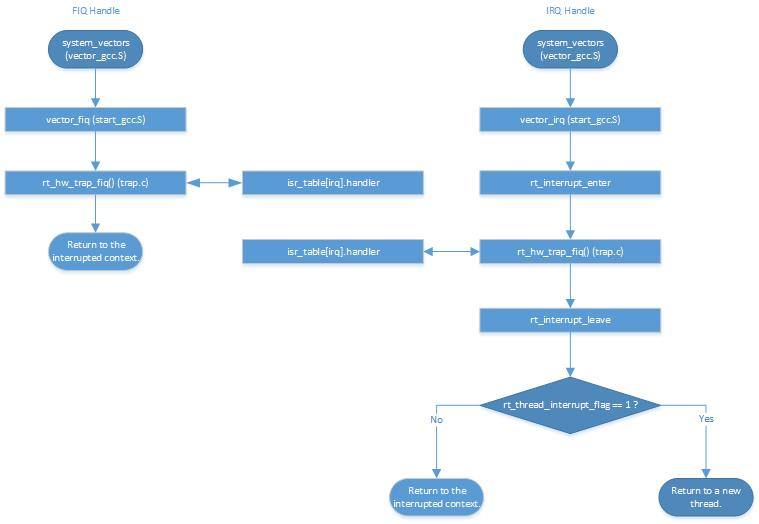

# RT-Thread在Cortex-A上的中断执行流程
Cortex-A CPU支持八种异常，分别为复位异常、未定义指令异常、SWI异常、程序异常、数据异常、保留异常、中断和快速中断。除最后两种异常外，其它异常不应该在正常运行的系统中出现。一旦这些异常被触发，系统打印相关信息并陷入死循环。包含所有这些异常的处理函数存放在异常向量表`system_vectors`中（定义在`libcpu/arm/cortex-a/vector_gcc.S`中）。
## 快速中断（FIQ）处理
快速中断入口`vector_fiq`调用`rt_hw_trap_fiq`函数（定义在`libcpu/arm/cortex-a/trap.c`中）。该函数获取中断号，从中断表`isr_table`中查找相应的处理句柄和参数，对相应的快速中断进行处理。
## 中断（IRQ）处理
中断处理与快速中断类似，中断入口`vector_irq`调用`rt_hw_trap_irq`函数（定义在`libcpu/arm/cortex-a/trap.c`中），并在调用该函数前后分别调用函数`rt_interrupt_enter`和`rt_interrupt_leave`。该函数同样获取中断号，从中断表`isr_table`中查找相应的处理句柄和参数，对相应的中断进行处理。不同的是，`vector_irq`在处理完中断后并不立即返回，而是读取变量`rt_thread_switch_interrupt_flag`，若值为1，则进行任务切换操作，任务切换细节参见文件`task_switch_cn.md`。
快速中断和中断的处理流程如下图所示。
