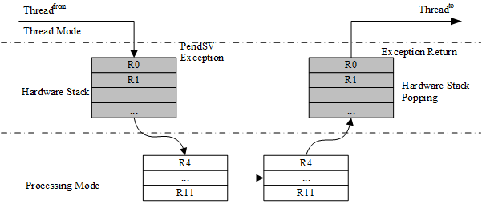
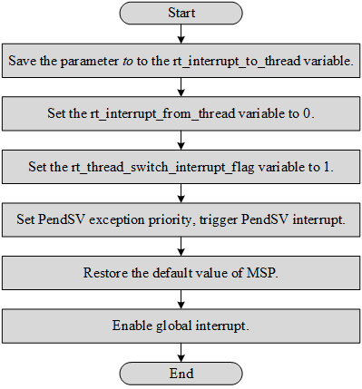
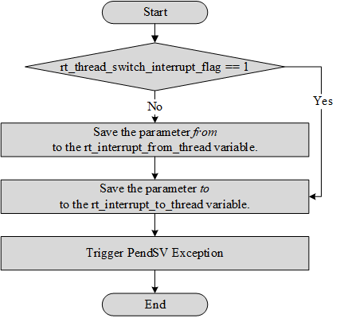

Kernel Porting
===============

After learning the previous chapters, everyone has a better understanding of RT-Thread, but many people are not familiar with how to port the RT-Thread kernel to different hardware platforms. Kernel porting refers to the RT-Thread kernel running on different chip architectures and different boards. It can have functions such as thread management and scheduling, memory management, inter-thread synchronization and communication, and timer management. Porting can be divided into two parts: CPU architecture porting and BSP (Board support package) porting .

This chapter will introduce CPU architecture porting and BSP porting. The CPU architecture porting part will be introduced in conjunction with the Cortex-M CPU architecture. Therefore, it is necessary to review "Cortex-M CPU Architecture Foundation" in the previous chapter ["Interrupt Management"](../interrupt/interrupt.md).  After reading this chapter, how to complete the RT-Thread kernel porting will be learned.

CPU Architecture Porting
-----------

There are many different CPU architectures in the embedded world, for example, Cortex-M, ARM920T, MIPS32, RISC-V, etc. In order to enable RT-Thread to run on different CPU architecture chips, RT-Thread provides a libcpu abstraction layer to adapt to different CPU architectures. The libcpu layer provides unified interfaces to the kernel, including global interrupt switches, thread stack initialization, context switching, and more.

RT-Thread's libcpu abstraction layer provides a unified set of CPU architecture porting interfaces downwards. This part of the interface includes global interrupt switch functions, thread context switch functions, clock beat configuration and interrupt functions, Cache, and so on. The following table shows the interfaces and variables that the CPU architecture migration needs to implement.

libcpu porting related API

| **Functions and Variables**                                  | **Description**                                              |
| ------------------------------------------------------------ | ------------------------------------------------------------ |
| rt_base_t rt_hw_interrupt_disable(void);                     | disable global interrupt                                     |
| void rt_hw_interrupt_enable(rt_base_t level);                | enable global interrupt                                      |
| rt_uint8_t \*rt_hw_stack_init(void \*tentry, void \*parameter, rt_uint8_t \*stack_addr, void \*texit); | The initialization of the thread stack, the kernel will call this function during thread creation and thread initialization. |
| void rt_hw_context_switch_to(rt_uint32 to);                  | Context switch without source thread, which is called when the scheduler starts the first thread, and is called in the signal. |
| void rt_hw_context_switch(rt_uint32 from, rt_uint32 to);     | Switch from *from* thread to *to* thread, used for switch between threads. |
| void rt_hw_context_switch_interrupt(rt_uint32 from, rt_uint32 to); | Switch from *from* thread to *to* thread, used for switch in interrupt. |
| rt_uint32_t rt_thread_switch_interrupt_flag;                 | A flag indicating that a switch is needed in the interrupt.  |
| rt_uint32_t rt_interrupt_from_thread, rt_interrupt_to_thread; | Used to save *from* and *to* threads when the thread is context switching. |

### Implement Global Interrupt Enable/Disable

Regardless of kernel code or user code, there may be some variables that need to be used in multiple threads or interrupts. If there is no corresponding protection mechanism, it may lead to critical section problems. In order to solve this problem, RT-Thread provides a series of inter-thread synchronization and communication mechanism. But these mechanisms require the global interrupt enable/disable function provided in libcpu. They are, respectively:

```c
/* disable global interrupt */
rt_base_t rt_hw_interrupt_disable(void);

/* enable global interrupt */
void rt_hw_interrupt_enable(rt_base_t level);
```

The following describes how to implement these two functions on the Cortex-M architecture. As mentioned earlier, the Cortex-M implements the CPS instruction in order to achieve fast switch interrupts, which can be used here.

```c
CPSID I ;PRIMASK=1， ; disable global interrupt
CPSIE I ;PRIMASK=0， ; enable global interrupt
```

#### Disable Global Interrupt

The functions that need to be done in order in the rt_hw_interrupt_disable() function are:

1). Save the current global interrupt status and use the status as the return value of the function.

2). Disable the global interrupt.

Based on MDK, the global interrupt disabled function on the Cortex-M core, is shown in the following code:

Disable global interrupt

```c
;/*
; * rt_base_t rt_hw_interrupt_disable(void);
; */
rt_hw_interrupt_disable    PROC      ;PROC pseudoinstruction definition function
    EXPORT  rt_hw_interrupt_disable  ;EXPORT output defined function, similar to C language extern
    MRS     r0, PRIMASK              ;read the value of the PRIMASK register to the r0 register
    CPSID   I                        ;disable global interrupt
    BX      LR                       ;function renturn
    ENDP                             ;ENDP end of function
```

The above code first uses the MRS instruction to save the value of the PRIMASK register to the r0 register, then disable the global interrupt with the "CPSID I" instruction, and finally returns with the BX instruction. The data stored by r0 is the return value of the function. Interrupts can occur between the “MRS r0, PRIMASK” instruction and “CPSID I”, which does not cause a global interrupt status disorder.

There are different conventions for different CPU architectures regarding how registers are managed during function calls and in interrupt handlers. A more detailed introduction to the use of registers for Cortex-M can be found in the official ARM manual, "*Procedure Call Standard for the ARM ® Architecture*."

#### Enable Global Interrupt

In `rt_hw_interrupt_enable(rt_base_t level)`, the variable *level* is used as the state to be restored, overriding the global interrupt status of the chip.

Based on MDK,  implementation on the Cortex-M core enables a global interrupt, as shown in the following code:

Enable global interrupt

```c
;/*
; * void rt_hw_interrupt_enable(rt_base_t level);
; */
rt_hw_interrupt_enable    PROC      ; PROC pseudoinstruction definition function
    EXPORT  rt_hw_interrupt_enable  ; EXPORT output defined function, similar to "extern" in C language
    MSR     PRIMASK, r0             ; write the value of the r0 register to the PRIMASK register
    BX      LR                      ; function renturn
    ENDP                            ; ENDP end of function
```

The above code first uses the MSR instruction to write the value register of r0 to the PRIMASK register, thus restoring the previous interrupt status.

### Implement Thread Stack Initialization

When dynamically creating threads and initializing threads, the internal thread initialization function *_rt_thread_init()* is used. The _rt_thread_init() function calls the stack initialization function *rt_hw_stack_init()*, which manually constructs a context in the stack initialization function. The context will be used as the initial value for each thread's first execution. The layout of the context on the stack is shown below:


The following code is the stack initialization code:

Build a context on the stack

```c
rt_uint8_t *rt_hw_stack_init(void       *tentry,
                             void       *parameter,
                             rt_uint8_t *stack_addr,
                             void       *texit)
{
    struct stack_frame *stack_frame;
    rt_uint8_t         *stk;
    unsigned long       i;

    /* align the incoming stack pointer */
    stk  = stack_addr + sizeof(rt_uint32_t);
    stk  = (rt_uint8_t *)RT_ALIGN_DOWN((rt_uint32_t)stk, 8);
    stk -= sizeof(struct stack_frame);

    /* obtain the pointer to the stack frame of the context */
    stack_frame = (struct stack_frame *)stk;

    /* set the default value of all registers to 0xdeadbeef */
    for (i = 0; i < sizeof(struct stack_frame) / sizeof(rt_uint32_t); i ++)
    {
        ((rt_uint32_t *)stack_frame)[i] = 0xdeadbeef;
    }

    /* save the first parameter in the r0 register according to the ARM APCS calling standard */
    stack_frame->exception_stack_frame.r0  = (unsigned long)parameter;
    /* set the remaining parameter registers to 0 */
    stack_frame->exception_stack_frame.r1  = 0;                 /* r1 register */
    stack_frame->exception_stack_frame.r2  = 0;                 /* r2 register */
    stack_frame->exception_stack_frame.r3  = 0;                 /* r3 register */
    /* set IP (Intra-Procedure-call scratch register.) to 0 */
    stack_frame->exception_stack_frame.r12 = 0;                 /* r12 register */
    /* save the address of the thread exit function in the lr register */
    stack_frame->exception_stack_frame.lr  = (unsigned long)texit;
    /* save the address of the thread entry function in the pc register */
    stack_frame->exception_stack_frame.pc  = (unsigned long)tentry;
    /* Set the value of psr to 0x01000000L, which means that the default switch is Thumb mode. */
    stack_frame->exception_stack_frame.psr = 0x01000000L;

    /* return the stack address of the current thread       */
    return stk;
}
```

### Implement Context Switching

In different CPU architectures, context switches between threads and context switches from interrupts to context, the register portion of the context may be different or the same. In Cortex-M, context switching is done uniformly using PendSV exceptions, and there is no difference in the switching parts. However, in order to adapt to different CPU architectures, RT-Thread's libcpu abstraction layer still needs to implement three thread switching related functions:

1）  rt_hw_context_switch_to(): no source thread, switching to the target thread, which is called when the scheduler starts the first thread.

2）  rt_hw_context_switch()：In a threaded environment, switch from the current thread to the target thread.

3）  rt_hw_context_switch_interrupt ()：In the interrupt environment, switch from the current thread to the target thread.

There are differences between switching in a threaded environment and switching in an interrupt environment. In the threaded environment, if the rt_hw_context_switch() function is called, the context switch can be performed immediately; in the interrupt environment, it needs to wait for the interrupt handler to complete processing the functions before switching.

Due to this difference, the implementation of rt_hw_context_switch() and rt_hw_context_switch_interrupt() is not the same on platforms such as ARM9. If the thread's schedule is triggered in the interrupt handler, rt_hw_context_switch_interrupt() is called in the dispatch function to trigger the context switch. After the interrupt handler has processed the interrupt, check the rt_thread_switch_interrupt_flag variable before the schedule exits. If the value of the variable is 1, the context switch of the thread is completed according to the rt_interrupt_from_thread variable and the rt_interrupt_to_thread variable.

In the Cortex-M processor architecture, context switching can be made more compact based on the features of automatic partial push and PendSV.

Context switching between threads, as shown in the following figure:



The hardware automatically saves the PSR, PC, LR, R12, R3-R0 registers of the *from* thread before entering the PendSV interrupt, then saves the R11\~R4 registers of the *from* thread in PendSV, and restores the R4\~R11 registers of the *to* thread, and finally the hardware automatically restores the R0\~R3, R12, LR, PC, PSR registers of the *to* thread after exiting the PendSV interrupt.

The context switch from interrupt to thread can be represented by the following figure:


The hardware automatically saves the PSR, PC, LR, R12, R3-R0 registers of the *from* thread before entering the interrupt, and then triggers a PendSV exception. R11~R4 registers of the *from* thread are saved and R4~R11 registers of the *to* thread are restored in the PendSV exception handler. Finally, the hardware automatically restores the R0~R3, R12, PSR, PC, LR registers of the *to* thread after exiting the PendSV interrupt.

Obviously, in the Cortex-M kernel, the rt_hw_context_switch() and rt_hw_context_switch_interrupt() have same functions, which is finishing saving and replying the remaining contexts in PendSV. So we just need to implement a piece of code to simplify the porting.

#### Implement rt_hw_context_switch_to()

rt_hw_context_switch_to() has only the target thread and no source thread. This function implements the function of switching to the specified thread. The following figure is a flowchart:



The rt_hw_context_switch_to() implementation on the Cortex-M3 kernel (based on MDK), as shown in the following code:

MDK version rt_hw_context_switch_to() implementation

```c
;/*
; * void rt_hw_context_switch_to(rt_uint32 to);
; * r0 --> to
; * this fucntion is used to perform the first thread switch
; */
rt_hw_context_switch_to    PROC
    EXPORT rt_hw_context_switch_to
    ; r0 is a pointer pointing to the SP member of the thread control block of the to thread
    ; save the value of the r0 register to the rt_interrupt_to_thread variable
    LDR     r1, =rt_interrupt_to_thread
    STR     r0, [r1]

    ; set the from thread to empty, indicating that no context is needed to save from
    LDR     r1, =rt_interrupt_from_thread
    MOV     r0, #0x0
    STR     r0, [r1]

    ; set the flag to 1, indicating that switching is required, this variable will be cleared when switching in the PendSV exception handler
    LDR     r1, =rt_thread_switch_interrupt_flag
    MOV     r0, #1
    STR     r0, [r1]

    ; set PendSV exception priority to lowest priority
    LDR     r0, =NVIC_SYSPRI2
    LDR     r1, =NVIC_PENDSV_PRI
    LDR.W   r2, [r0,#0x00]       ; read
    ORR     r1,r1,r2             ; modify
    STR     r1, [r0]             ; write-back

    ; trigger PendSV exception (PendSV exception handler will be executed)
    LDR     r0, =NVIC_INT_CTRL
    LDR     r1, =NVIC_PENDSVSET
    STR     r1, [r0]

    ; abandon the stack from chip startup to before the first context switch, set the value of the MSP as when it is started
    LDR     r0, =SCB_VTOR
    LDR     r0, [r0]
    LDR     r0, [r0]
    MSR     msp, r0

    ; enable global interrupts and global exceptions. After enabling, the PendSV exception handler will be entered.
    CPSIE   F
    CPSIE   I

    ; will not execute to here
    ENDP
```

#### Implement rt_hw_context_switch()/ rt_hw_context_switch_interrupt()

The function rt_hw_context_switch() and the function rt_hw_context_switch_interrupt() have two parameters, the *from* thread and the *to* thread. They implement the function to switch from the *from* thread to the *to* thread. The following figure is a specific flow chart:




The rt_hw_context_switch() and rt_hw_context_switch_interrupt() implementations on the Cortex-M3 kernel (based on MDK) are shown in the following code:

Implement rt_hw_context_switch()/rt_hw_context_switch_interrupt()

```c
;/*
; * void rt_hw_context_switch(rt_uint32 from, rt_uint32 to);
; * r0 --> from
; * r1 --> to
; */
rt_hw_context_switch_interrupt
    EXPORT rt_hw_context_switch_interrupt
rt_hw_context_switch    PROC
    EXPORT rt_hw_context_switch

    ; check if the rt_thread_switch_interrupt_flag variable is 1
    ; skip updating the contents of the thread from if the variable is 1
    LDR     r2, =rt_thread_switch_interrupt_flag
    LDR     r3, [r2]
    CMP     r3, #1
    BEQ     _reswitch
    ; set the rt_thread_switch_interrupt_flag variable to 1
    MOV     r3, #1
    STR     r3, [r2]

    ; update the rt_interrupt_from_thread variable from parameter r0
    LDR     r2, =rt_interrupt_from_thread
    STR     r0, [r2]

_reswitch
    ; update the rt_interrupt_to_thread variable from parameter r1
    LDR     r2, =rt_interrupt_to_thread
    STR     r1, [r2]

    ; trigger PendSV exception, will enter the PendSV exception handler to complete the context switch
    LDR     r0, =NVIC_INT_CTRL
    LDR     r1, =NVIC_PENDSVSET
    STR     r1, [r0]
    BX      LR
```

#### Implement PendSV Interrupt

In Cortex-M3, the PendSV interrupt handler is PendSV_Handler(). The actual thread switching is done in PendSV_Handler(). The following figure is a specific flow chart:


The following code is a PendSV_Handler implementation:

```c
; r0 --> switch from thread stack
; r1 --> switch to thread stack
; psr, pc, lr, r12, r3, r2, r1, r0 are pushed into [from] stack
PendSV_Handler   PROC
    EXPORT PendSV_Handler

    ; disable global interrupt
    MRS     r2, PRIMASK
    CPSID   I

    ; check if the rt_thread_switch_interrupt_flag variable is 0
    ; if it is zero, jump to pendsv_exit
    LDR     r0, =rt_thread_switch_interrupt_flag
    LDR     r1, [r0]
    CBZ     r1, pendsv_exit         ; pendsv already handled

    ; clear the rt_thread_switch_interrupt_flag variable
    MOV     r1, #0x00
    STR     r1, [r0]

    ; check the rt_thread_switch_interrupt_flag variable
    ; if it is 0, the context save of the from thread is not performed.
    LDR     r0, =rt_interrupt_from_thread
    LDR     r1, [r0]
    CBZ     r1, switch_to_thread

    ; save the context of the from thread
    MRS     r1, psp                 ; obtain the stack pointer of the thread from
    STMFD   r1!, {r4 - r11}       ; save r4~r11 to the thread's stack
    LDR     r0, [r0]
    STR     r1, [r0]                ; update the SP pointer of the thread's control block

switch_to_thread
    LDR     r1, =rt_interrupt_to_thread
    LDR     r1, [r1]
    LDR     r1, [r1]                ; obtain the stack pointer of the thread to

    LDMFD   r1!, {r4 - r11}       ; restore the register value of the thread to in the stack of the thread
    MSR     psp, r1                 ; update the value of r1 to psp

pendsv_exit
    ; restore global interrupt status
    MSR     PRIMASK, r2

    ; modify bit 2 of the lr register to ensure that the process uses the PSP stack pointer
    ORR     lr, lr, #0x04
    ; exit interrupt function
    BX      lr
    ENDP
```

### Impalement OS Tick

With the basics of switching global interrupts and context switching, RTOS can perform functions such as creating, running, and scheduling threads. With OS Tick, RT-Thread can schedule time-to-roll rotations for threads of the same priority, implementing timer functions, implementing rt_thread_delay() delay functions, and so on.

In oder to finish the porting of libcpu, we need to ensure that the rt_tick_increase() function is called periodically during the clock tick interrupt. The call cycle depends on the value of the RT_TICK_PER_SECOND macro of rtconfig.h.

In Cortex M, the OS tick can be implemented by SysTick's interrupt handler.

```c
void SysTick_Handler(void)
{
    /* enter interrupt */
    rt_interrupt_enter();

    rt_tick_increase();

    /* leave interrupt */
    rt_interrupt_leave();
}
```

BSP Porting
-------

In a practical project, for the same CPU architecture, different boards may use the same CPU architecture, carry different peripheral resources, and complete different products, so we also need to adapt to the board. RT-Thread provides a BSP abstraction layer to fit boards commonly seen. If you want to use the RT-Thread kernel on a board, in addition to the need to have the corresponding chip architecture porting, you need to port the corresponding board, that is, implement a basic BSP. The job is to establish a basic environment for the operating system to run. The main tasks that need to be completed are:

1) Initialize the CPU internal registers and set the RAM operation timing.

2) Implement clock driver and interrupt controller driver and interrupt management.

3) Implement UART and GPIO driver.

4) Initialize the dynamic memory heap to implement dynamic heap memory management.


