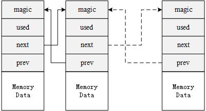
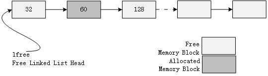
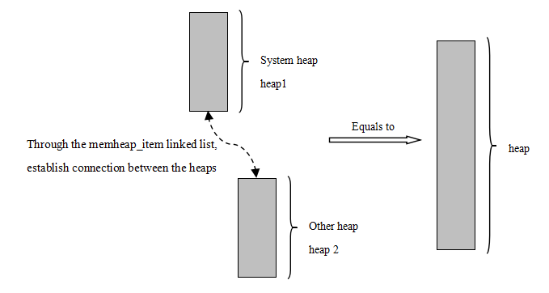
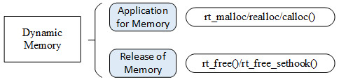
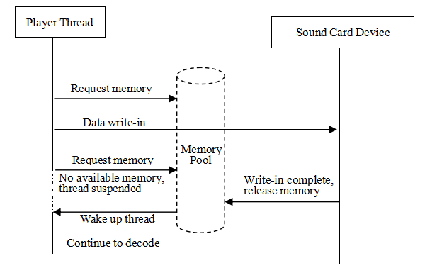
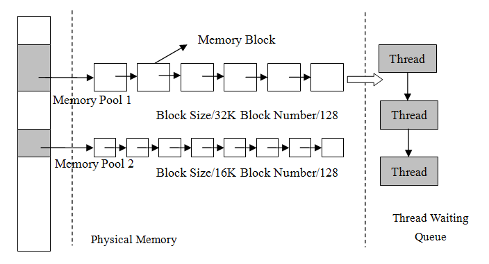
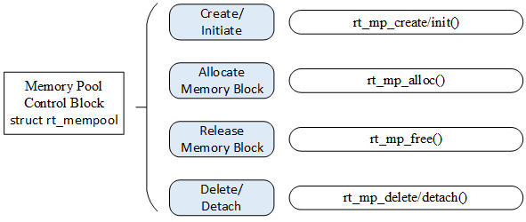

Memory Management
==============

In a computing system, there are usually two types of memory space: internal memory space and external memory space. The internal memory is quick to access and can be accessed randomly according to the variable address. It is what we usually call RAM (Random-Access Memory) and can be understood as the computer's memory. In the external memory, the content stored is relatively fixed, and the data will not be lost even after the power is turned off. It is what we usually call ROM (Read Only Memory) and can be understood as the hard disk of the computer.

In a computer system, variables and intermediate data are generally stored in RAM, and they are only transferred from RAM to CPU for calculation when actually used. The memory size required by some data needs to be determined according to the actual situation during the running of the program, which requires the system to have the ability to dynamically manage the memory space. User applies to the system when he needs a block of memory space, then the system selects a suitable memory space to allocate to the user. After the user finishes using it, the memory space is released back to the system which enables the system to recycle the memory space.

This chapter introduces two kinds of memory management methods in RT-Thread, namely dynamic memory heap management and static memory pool management. After learning this chapter, readers will understand the memory management principle and usage of RT-Thread.

Memory Management Functional Features
------------------

Because time requirements are very strict in real-time systems, memory management is often much more demanding than in general-purpose operating systems:

1) Time for allocating memory must be deterministic. The general memory management algorithm is to find a free memory block that is compatible with the data according to the length of the data to be stored, and then store the data therein. The time it takes to find such a free block of memory is uncertain, but for real-time systems, this is unacceptable. Because real-time system requires that the allocation process of the memory block is completed within a predictable certain time, otherwise the response of the real-time task to the external event will become undeterminable.

2) As memory is constantly being allocated and released, the entire memory area will produce more and more fragments (while using memory, some memory is applied, some of which are released, resulting in some small memory blocks in the memory space,  these small memory blocks have inconsecutive addresses and cannot be allocated as a whole large block of memory.) There is enough free memory in the system, but because their addresses are  inconsecutive, they cannot form a continuous block of complete memory, which will make the program unable to apply for large memory. For general-purpose systems, this inappropriate memory allocation algorithm can be solved by rebooting the system (once every month or once a few months). But it is unacceptable for embedded systems that need to work continuously in the field work all the year round.

3) The resource environment of embedded system is also different. Some systems have relatively tight resources, only tens of kilobytes of memory are available for allocation, while some systems have several megabytes of memory. This makes choosing efficient memory allocation algorithm for these different systems more complicated.

RT-Thread operating system provides different memory allocation management algorithms for memory management according to different upper layer applications and system resources. Generally, it can be divided into two categories: memory heap management and memory pool management. Memory heap management is divided into three cases according to specific memory devices:

The first is allocation management for small memory blocks (small memory management algorithm);

The second is allocation management for large memory blocks (slab management algorithm);

The third is allocation management for multiple memory heaps (memheap management algorithm)

Memory Heap Management
----------

Memory heap management is used to manage a contiguous memory space. We introduced the memory distribution of RT-Thread in chapter "Kernel Basics". As shown in the following figure, RT-Thread uses the space at "the end of the ZI segment" to the end of the memory as the memory heap.


If current resource allows, memory heap can allocate memory blocks of any size according to the needs of users.  When user does not need to use these memory blocks, they can be released back to the heap for other applications to allocate and use. In order to meet different needs, RT-Thread system provides different memory management algorithms, namely small memory management algorithm, slab management algorithm and memheap management algorithm.

The small memory management algorithm is mainly for system with less resources and with less than 2MB of memory. The slab memory management algorithm mainly provides a fast algorithm similar to multiple memory pool management algorithms when the system resources are rich. In addition to the above, RT-Thread also has a management algorithm for multi-memory heap, namely the memheap management algorithm. The memheap management algorithm is suitable for where there are multiple memory heaps in the system. It can “paste” multiple memories together to form a large memory heap, which is very easy to use for users.

Either one or none of these memory heap management algorithms can be chosen when the system is running. These memory heap management algorithms provide the same API interface to the application.

>Because the memory heap manager needs to meet the security allocation in multi-threaded conditions, which means mutual exclusion between multiple threads needs to be taken into consideration, so please do not allocate or release dynamic memory blocks in interrupt service routine, which may result in the current context being suspended.

### Small Memory Management Algorithm

The small memory management algorithm is a simple memory allocation algorithm. Initially, it is a large piece of memory. When a memory block needs to be allocated, the matching memory block is segmented from the large memory block, and then this matching free memory block is returned to the heap management system. Each memory block contains data head for management use through which the used block and the free block are linked by a doubly linked list, as shown in the following figure:



Each memory block (whether it is an allocated memory block or a free memory block) contains a data head, including:

**1) magic**: Variable (also called magic number). It will be initialized to 0x1ea0 (that is, the English word heap) which is used to mark this memory block as a memory data block for memory management. The variable is not only used to identify that the data block is a memory data block for memory management. It is also a memory protection word: if this area is overridden, it means that the memory block is illegally overridden (normally only the memory manager will operate on this memory).

**2)used**: Indicates whether the current memory block has been allocated.

The performance of memory management is mainly reflected in the allocation and release of memory. The small memory management algorithm can be embodied by the following examples.

As shown in the following figure, the free list pointer lfree initially points to a 32-byte block of memory. When the user thread wants to allocate a 64-byte memory block, since the memory block pointed to by this lfree pointer is only 32 bytes and does not meet the requirements, the memory manager will continue to search for the next memory block.  When the next memory block with 128 bytes is found, it meets the requirements of the allocation. Because this memory block is large, the allocator will split the memory block, and the remaining memory block(52 bytes) will remain in the lfree linked list, as shown in the following table which is after 64 bytes is allocated.




In addition, a 12-byte data head is reserved for `magic, used` information, and linked list nodes before each memory block is allocated. The address returned to the application is actually the address after 12 bytes of this memory block. The 12-byte data head is the part that the user should never use. (Note: The length of the 12-byte data head will be different as it aligns with the system).

As for releasing, it is the reversed process, but the allocator will check if the adjacent memory blocks are free, and if they are free, the allocator will merge them into one large free memory block.

### Slab Management Algorithm

RT-Thread's slab allocator is an optimized memory allocation algorithm for embedded systems based on the slab allocator implemented by DragonFly BSD founder Matthew Dillon. The most primitive slab algorithm is Jeff Bonwick's efficient kernel memory allocation algorithm introduced for the Solaris operating system.

RT-Thread's slab allocator implementation mainly removes the object construction and destruction process, and only retains the pure buffered memory pool algorithm. The slab allocator is divided into multiple zones according to the size of the object which can also be seen as having a memory pool for each type of object, as shown in the following figure:


A zone is between 32K and 128K bytes in size, and the allocator will automatically adjust based on the heap size when the heap is initialized. The zone in the system includes up to 72 objects, which can allocate up to 16K of memory at a time. It will directly allocate from the page allocator if it exceeds 16K. The size of the memory block allocated on each zone is fixed. Zones that can allocate blocks of the same size are linked in a linked list. The zone linked lists of the 72 objects are managed in an array. (zone_array[]).

Here are the two main operations for the memory allocator:

**(1) Memory Allocation**

Assuming a 32-byte memory is allocated, the slab memory allocator first finds the corresponding zone linked list from the linked list head of zone array in accordance with the 32-byte value. If the linked list is empty, assign a new zone to the page allocator and return the first free block of memory from the zone. If the linked list is not empty, a free block must exist in the first zone node in the zone linked list, (otherwise it would not have been placed in the linked list), then take the corresponding free block. If all free memory blocks in the zone are used after the allocation, the allocator needs to remove this zone node from the linked list.

**(2)Memory Release**

The allocator needs to find the zone node where the memory block is located, and then link the memory block to the zone's free memory block linked list. If the free linked list of the zone indicates that all the memory blocks of the zone have been released, it means that the zone is completely free. The system will release the fully free zone to the page allocator when the number of free zones in the zone linked list reaches a certain number.

### memheap Management Algorithm

memheap management algorithm is suitable for systems with multiple memory heaps that are not contiguous. Using memheap memory management can simplify the use of multiple memory heaps in the system: when there are multiple memory heaps in the system, the user only needs to initialize multiple needed memheaps during system initialization and turn on the memheap function to glue multiple memheaps (addresses can be discontinuous) for the system's heap allocation.

>The original heap function will be turned off after memheap is turned on. Both can only be selected by turning RT_USING_MEMHEAP_AS_HEAP on or off.

Working mechanism of memheap is shown in the figure below. First, add multiple blocks of memory to the memheap_item linked list to glue. The allocation of a memory block starts with allocating memory from default memory heap. When it can not be allocated, memheap_item linked list is looked up, and an attempt is made to allocate a memory block from another memory heap. The application doesn't care which memory heap the currently allocated memory block is on, as if it were operating a memory heap.



### Memory Heap Configuration and Initialization

When using the memory heap, heap initialization must be done at system initialization, which can be done through the following function interface:

```c
void rt_system_heap_init(void* begin_addr, void* end_addr);
```

This function will use the memory space of the parameters begin_addr, end_addr as a memory heap. The following table describes the input parameters for this function:

Input parameter for rt_system_heap_init()

|**Parameters**  |**Description**          |
|------------|--------------------|
| begin_addr | Start address for heap memory area |
| end_addr   | End address for heap memory area |

When using memheap heap memory, you must initialize the heap memory at system initialization, which can be done through the following function interface:

```c
rt_err_t rt_memheap_init(struct rt_memheap  *memheap,
                        const char  *name,
                        void        *start_addr,
                        rt_uint32_t size)
```

If there are multiple non-contiguous memheaps, the function can be called multiple times to initialize it and join the memheap_item linked list. The following table describes the input parameters and return values for this function:

Input parameters and return values of rt_memheap_init()

|**Parameters**  |**Description**          |
|------------|--------------------|
| memheap    | memheap control block |
| name       | The name of the memory heap |
| start_addr | Heap memory area start address |
| size       | Heap memory size |
|**Return**  | ——                 |
| RT_EOK     | Successful       |

### Memory Heap Management

Operations of the memory heap are as shown in the following figure, including: initialization, application for memory blocks, release of memory. After use, all dynamic memory should be released for future use by other programs.



#### Allocate and Release Memory Block

Allocate a memory block of user-specified size from the memory heap. The function interface is as follows:

```c
void *rt_malloc(rt_size_t nbytes);
```

rt_malloc function finds a memory block of the appropriate size from the system heap space and returns the available address of the memory block to the user. The following table describes the input parameters and return values for this function:

Input parameters and return values of rt_malloc()

|**Parameters**        |**Description**                          |
|------------------|------------------------------------|
| nbytes           | The size of the memory block to be allocated, in bytes |
|**Return**        | ——                                 |
| Allocated memory block address | Successful                       |
| RT_NULL          | Fail                             |

After the application uses the memory applied from the memory allocator, it must be released in time, otherwise it will cause a memory leak. The function interface for releasing the memory block is as follows:

```c
void rt_free (void *ptr);
```

The rt_free function will return the to-be-released memory back to the heap manager. When calling this function, user needs to pass the to-be-released pointer of the memory block. If it is a null pointer, it returns directly. The following table describes the input parameters for this function:

Input parameters of rt_free()

|**Parameters**|**Description**          |
|----------|--------------------|
| ptr      | to-be-released memory block pointer |

#### Re-allocate Memory Block

Re-allocating the size of the memory block (increase or decrease) based on the allocated memory block can be done through the following function interface:

```c
void *rt_realloc(void *rmem, rt_size_t newsize);
```

When the memory block is re-allocated, the original memory block data remains the same (in the case of reduction, the subsequent data is automatically truncated). The following table describes the input parameters and return values for this function:

Input parameters and return values of rt_realloc()

|**Parameters**            |**Description**          |
|----------------------|--------------------|
| rmem                 | Point to the allocated memory block |
| newsize              | Re-allocated memory size |
|**Return**            | ——                 |
| Re-allocated memory block address | Successful    |

#### Allocate Multiple Memory Blocks

Allocating multiple memory blocks with contiguous memory addresses from the memory heap can be done through the following function interface:

```c
  void *rt_calloc(rt_size_t count, rt_size_t size);
```

The following table describes the input parameters and return values for this function:

Input parameters and return values of rt_calloc()

|**Parameters**                  |**Description**                                   |
|----------------------------|---------------------------------------------|
| count                      | Number of memory block           |
| size                       | Size of memory block           |
|**Return**                  | ——                                          |
| Pointer pointing to the first memory block address | Successful, all allocated memory blocks are initialized to zero. |
| RT_NULL                    | Allocation failed                |

#### Set Memory Hook Function

When allocating memory blocks, user can set a hook function. The function interface called is as follows:

```c
void rt_malloc_sethook(void (*hook)(void *ptr, rt_size_t size));
```

The hook function set will callback after the memory allocation. During the callback, the allocated memory block address and size are passed as input parameters. The following table describes the input parameters for this function:

Input parameters for rt_malloc_sethook()

|**Parameters**|**Description**    |
|----------|--------------|
| hook     | Hook function pointer |

The hook function interface is as follows:

```c
void hook(void *ptr, rt_size_t size)；
```

The following table describes the input parameters for the hook function:

Allocate hook function interface parameters

|**Parameters**|**Description**            |
|----------|----------------------|
| ptr      | The allocated memory block pointer |
| size     | The size of the allocated memory block |

When releasing memory, user can set a hook function, the function interface called is as follows:

```c
void rt_free_sethook(void (*hook)(void *ptr));
```

The hook function set will callback before the memory release is completed. During the callback, the released memory block address is passed in as the entry parameter (the memory block is not released at this time). The following table describes the input parameters for this function:

Input parameters for rt_free_sethook()

|**Parameters**|**Description**    |
|----------|--------------|
| hook     | Hook function pointer |

The hook function interface is as follows:

```c
void hook(void *ptr);
```

The following table describes the input parameters for the hook function:

Input parameters of the hook function

|**Parameters**|**Description**          |
|----------|--------------------|
| ptr      | Memory block pointer to be released |

### Memory Heap Management Application Example

This is an example of a memory heap application. This program creates a dynamic thread that dynamically requests memory and releases it. Each time it apples for more memory, it ends when it can't apply for it, as shown in the following code:

Memory heap management

```c
#include <rtthread.h>

#define THREAD_PRIORITY      25
#define THREAD_STACK_SIZE    512
#define THREAD_TIMESLICE     5

/* thread entry */
void thread1_entry(void *parameter)
{
    int i;
    char *ptr = RT_NULL; /* memory block pointer */

    for (i = 0; ; i++)
    {
        /* memory space for allocating (1 << i) bytes each time */
        ptr = rt_malloc(1 << i);

        /* if allocated successfully */
        if (ptr != RT_NULL)
        {
            rt_kprintf("get memory :%d byte\n", (1 << i));
            /* release memory block */
            rt_free(ptr);
            rt_kprintf("free memory :%d byte\n", (1 << i));
            ptr = RT_NULL;
        }
        else
        {
            rt_kprintf("try to get %d byte memory failed!\n", (1 << i));
            return;
        }
    }
}

int dynmem_sample(void)
{
    rt_thread_t tid = RT_NULL;

    /* create thread 1 */
    tid = rt_thread_create("thread1",
                           thread1_entry, RT_NULL,
                           THREAD_STACK_SIZE,
                           THREAD_PRIORITY,
                           THREAD_TIMESLICE);
    if (tid != RT_NULL)
        rt_thread_startup(tid);

    return 0;
}
/* Export to the msh command list */
MSH_CMD_EXPORT(dynmem_sample, dynmem sample);
```

The simulation results are as follows:

```
\ | /
- RT -     Thread Operating System
 / | \     3.1.0 build Aug 24 2018
 2006 - 2018 Copyright by rt-thread team
msh >dynmem_sample
msh >get memory :1 byte
free memory :1 byte
get memory :2 byte
free memory :2 byte
…
get memory :16384 byte
free memory :16384 byte
get memory :32768 byte
free memory :32768 byte
try to get 65536 byte memory failed!
```

The memory is successfully allocated in the routine and the information is printed; when trying to apply 65536 byte, 64KB, of memory, the allocation fails because the total RAM size is only 64K and the available RAM is less than 64K.

Memory Pool
------

The memory heap manager can allocate blocks of any size, which is very flexible and convenient. But it also has obvious shortcomings. Firstly, the allocation efficiency is not high because free memory block needs to be looked up for each allocation. Secondly, it is easy to generate memory fragmentation. In order to improve the memory allocation efficiency and avoid memory fragmentation, RT-Thread provides another method of memory management: Memory Pool.

Memory pool is a memory allocation method for allocating a large number of small memory blocks of the same size. It can greatly speed up memory allocation and release, and can avoid memory fragmentation as much as possible. In addition, RT-Thread's memory pool allows  thread suspend function. When there is no free memory block in the memory pool, the application thread will be suspended until there is a new available memory block in the memory pool, and then the suspended application thread will be awakened.

The thread suspend function of the memory pool is very suitable for scenes that need to be synchronized by memory resources. For example, when playing music, the player thread decodes the music file and then sends it to the sound card driver to drive the hardware to play music.



As shown in the figure above, when the player thread needs to decode the data, it will request the memory block from the memory pool. If there is no memory block available, the thread will be suspended, otherwise it will obtain the memory block to place the decoded data.

The player thread then writes the memory block containing the decoded data to the sound card abstraction device (the thread will return immediately and continue to decode more data);

After the sound card device is written, the callback function set by the player thread is called to release the written memory block. If the player thread is suspended because there is no memory block in the memory pool available, then it will be awakened to continue to decode.

### Memory Pool Working Mechanism

#### Memory Pool Control Block

The memory pool control block is a data structure used by the operating system to manage the memory pool. It stores some information about the memory pool, such as the start address of the data area in memory pool, memory block size and memory block list. It also includes memory blocks, linked list structure used for the connection between memory blocks, event set of the thread suspended due to the memory block being unavailable, and so on.

In the RT-Thread real-time operating system, the memory pool control block is represented by the structure `struct rt_mempool`. Another C expression, `rt_mp_t`, represents the memory block handle. The implementation in C language is a pointer pointing to the memory pool control block. For details, see the following code:

```c
struct rt_mempool
{
    struct rt_object parent;

    void        *start_address;  /* start address of memory pool data area */
    rt_size_t     size;           /* size of memory pool data area */

    rt_size_t     block_size;    /* size of memory block  */
    rt_uint8_t    *block_list;   /* list of memory block  */

    /* maximum number of memory blocks that can be accommodated in the memory pool data area  */
    rt_size_t     block_total_count;
    /* number of free memory blocks in the memory pool  */
    rt_size_t     block_free_count;
    /* list of threads suspended because memory blocks are unavailable */
    rt_list_t     suspend_thread;
    /* number of threads suspended because memory blocks are unavailable */
    rt_size_t     suspend_thread_count;
};
typedef struct rt_mempool* rt_mp_t;
```

#### Memory Block Allocation Mechanism

When the memory pool is created, it first applies a large amount of memory from the system. Then it divides the memory into multiple small memory blocks of the same size. The small memory blocks are directly connected by a linked list (this linked list is also called a free linked list). At each allocation, the first memory block is taken from the head of the free linked list and provided to the applicant. As you can see from the figure below, there are multiple memory pools of different sizes allowed in physical memory. Each memory pool is composed of multiple free memory blocks, which are used by the kernel for memory management. When a memory pool object is created, the memory pool object is assigned to a memory pool control block. The parameters of the memory control block include the memory pool name, memory buffer, memory block size, number of blocks, and a queue of threads waiting.



The kernel is responsible for allocating memory pool control blocks to the memory pool. It also receives the application for allocation of memory blocks from the user thread. When these information are obtained, the kernel can allocate memory for the memory pool from the memory pool. Once the memory pool is initialized, the size of the memory blocks inside will no longer be available for adjustment.

Each memory pool object consists of the above structure, where suspend_thread forms a list for thread waiting for memory blocks, that is, when there is no memory block available in the memory pool, and the request thread allows waiting, the thread applying for the memory block will suspend on the suspend_thread linked list.

### Memory Pool Management

Memory pool control block is a structure that contains important parameters related to the memory pool and acts as a link between various states of the memory pool. The related interfaces of the memory pool are as shown in the following figure. The operation of the memory pool includes: create/initialize memory pool, apply for memory block, release memory block, delete/detach memory pool. It needs to noted hat nut not all memory pools will be deleted. The deletion is related to the needs of the designer, but the used memory blocks should be released.



#### Create and Delete Memory Pool

To create a memory pool, a memory pool object is created first and then a memory heap is allocated from the heap. Creating a memory pool is a prerequisite for allocating and releasing memory blocks from the corresponding memory pool. After the memory pool is created, thread then can perform operations like application, release and so on. To creating a memory pool, use the following function interface. This function returns a memory pool object that has been created.

```c
rt_mp_t rt_mp_create(const char* name,
                     rt_size_t block_count,
                     rt_size_t block_size);
```

Using this function interface can create a memory pool that matches the size and number of memory blocks required. The creation will be successful if system resources allow it (most importantly memory heap memory resources). When you create a memory pool, you need to give the memory pool a name. The kernel then applies for a memory pool object from the system. Next, a memory buffer calculated from the number and sizes of blocks will be allocated from the memory heap. Then memory pool object is initialized. Afterwards, the successfully applied memory block buffer is organized into idle linked list used for allocation. The following table describes the input parameters and return values for this function:

Input parameters and return values for rt_mp_create()

|**Parameters**    |**Description**          |
|--------------|--------------------|
| name         | Name of the memory pool |
| block_count  | Number of memory blocks |
| block_size   | Size of memory block |
|**Return**    | ——                 |
| Handle of memory pool | Creation of memory pool object successful |
| RT_NULL      | Creation of memory pool failed |

Deleting memory pool will delete the memory pool object and release the applied memory. Use the following function interface:

```c
rt_err_t rt_mp_delete(rt_mp_t mp);
```

When a memory pool is deleted, all threads waiting on the memory pool object will be awakened(return -RT_ERROR ). Then the memory pool data storage area allocated from the memory heap is released, and the memory pool object is deleted. The following table describes the input parameters and return values for this function:

Input parameters and return values of rt_mp_delete()

|**Parameters**|**Description**                         |
|----------|-----------------------------------|
| mp       | memory pool object handle |
|**Return**| ——                                |
| RT_EOK   | Deletion successful  |

#### Initialize and Detach Memory Pool

Memory pool Initialization is similar to memory pool creation, except that the memory pool initialization is for static memory management mode, and the memory pool control block is derived from static objects that the user applies in the system. In addition, unlike memory pool creation, the memory space used by the memory pool object here is a buffer space specified by user. User passes the pointer of the buffer to the memory pool control block, the rest of the initialization is the same as the creation of the memory pool. The function interface is as follows:

```c
rt_err_t rt_mp_init(rt_mp_t mp,
                    const char* name,
                    void *start,
                    rt_size_t size,
                    rt_size_t block size);
```

When initializing the memory pool, pass the memory pool object that needs to be initialized to the kernel, and also pass the memory space used by the memory pool, the number and sizes of memory blocks managed by the memory pool and assign a name to the memory pool. This way, the kernel can initialize the memory pool and organize the memory space used by the memory pool into a free block linked list for allocation. The following table describes the input parameters and return values for this function:

Input parameters and return values of rt_mp_init()

|**Parameters**   |**Description**          |
|-------------|--------------------|
| mp          | memory pool object |
| name        | memory pool name |
| start       | starting address of memory pool |
| size        | memory pool data area size |
| block_size  | memory pool size |
|**Return**   | ——                 |
| RT_EOK      | initialization successful |
| \- RT_ERROR | Fail             |

The number of memory pool blocks = size / (block_size + 4-byte, linked list pointer size), the calculation result needs to be rounded (an integer).

For example, the size of the memory pool data area is set to 4096 bytes, and the memory block size block_size is set to 80 bytes; then the number of memory blocks applied is 4096/(80+4)=48.

Detaching the memory pool means the memory pool object will be detached from the kernel object manager. Use the following function interface to detach the memory pool:

```c
rt_err_t rt_mp_detach(rt_mp_t mp);
```

After using this function interface, the kernel wakes up all threads waiting on the memory pool object and then detaches the memory pool object from the kernel object manager. The following table describes the input parameters and return values for this function:

Input parameters and return values for rt_mp_detach()

|**Parameters**|**Description**  |
|----------|------------|
| mp       | memory pool object |
|**Return**| ——         |
| RT_EOK   | Successful |

#### Allocate and Release Memory Block

To allocate a memory block from the specified memory pool, use the following interface:

```c
void *rt_mp_alloc (rt_mp_t mp, rt_int32_t time);
```

The time parameter means the timeout period for applying for allocation of memory blocks. If there is a memory block available in the memory pool, remove a memory block from the free linked list of the memory pool, reduce the number of free blocks and return this memory block; if there is no free memory block in the memory pool, determine the timeout time setting: if the timeout period is set to zero, the empty memory block is immediately returned; if the waiting time is greater than zero, the current thread is suspended on the memory pool object until there is free memory block available in the memory pool, or the waiting time elapses. The following table describes the input parameters and return values for this function:

Input parameters and return values of rt_mp_alloc()

|**Parameters**        |**Description**  |
|------------------|------------|
| mp               | Memory pool object |
| time             | Timeout |
|**Return**        | ——         |
| Allocated memory block address | Successful |
| RT_NULL          | Fail   |

Any memory block must be released after it has been used. Otherwise, memory leaks will occur. The memory block is released using the following interface:

```c
void rt_mp_free (void *block);
```

When using the function interface, firstly, the memory pool object of (or belongs to)  the memory block will be calculated by the pointer of the memory block that needs to be released. Secondly, the number of available memory blocks of the memory pool object will be increased. Thirdly, the released memory block to the linked list of free memory blocks will be added. Then, it will be determined whether there is a suspended thread on the memory pool object, if so, the first thread on the suspended thread linked list will be awakened. The following table describes the input parameters for this function:

Input parameters of rt_mp_free()

|**Parameters**|**Description**  |
|----------|------------|
| block    | memory block pointer |

### Memory Pool Application Example

This is a static internal memory pool application routine that creates a static memory pool object and 2 dynamic threads. One thread will try to get the memory block from the memory pool, and the other thread will release the memory block, as shown in the following code:

   Memory pool usage example

```c
#include <rtthread.h>

static rt_uint8_t *ptr[50];
static rt_uint8_t mempool[4096];
static struct rt_mempool mp;

#define THREAD_PRIORITY      25
#define THREAD_STACK_SIZE    512
#define THREAD_TIMESLICE     5

/* pointer pointing to the thread control block */
static rt_thread_t tid1 = RT_NULL;
static rt_thread_t tid2 = RT_NULL;

/* thread 1 entry */
static void thread1_mp_alloc(void *parameter)
{
    int i;
    for (i = 0 ; i < 50 ; i++)
    {
        if (ptr[i] == RT_NULL)
        {
            /* Trying to apply for a memory block 50 times, when no memory block is available,
                thread 1 suspends, thread 2 runs */
            ptr[i] = rt_mp_alloc(&mp, RT_WAITING_FOREVER);
            if (ptr[i] != RT_NULL)
                rt_kprintf("allocate No.%d\n", i);
        }
    }
}

/* thread 2 entry, thread 2 has a lower priority than Thread 1, so thread 1 should be executed first. */
static void thread2_mp_release(void *parameter)
{
    int i;

    rt_kprintf("thread2 try to release block\n");
    for (i = 0; i < 50 ; i++)
    {
        /* release all successfully allocated memory blocks */
        if (ptr[i] != RT_NULL)
        {
            rt_kprintf("release block %d\n", i);
            rt_mp_free(ptr[i]);
            ptr[i] = RT_NULL;
        }
    }
}

int mempool_sample(void)
{
    int i;
    for (i = 0; i < 50; i ++) ptr[i] = RT_NULL;

    /* initialize the memory pool object */
    rt_mp_init(&mp, "mp1", &mempool[0], sizeof(mempool), 80);

    /* create thread 1: applying for memory pool */
    tid1 = rt_thread_create("thread1", thread1_mp_alloc, RT_NULL,
                            THREAD_STACK_SIZE,
                            THREAD_PRIORITY, THREAD_TIMESLICE);
    if (tid1 != RT_NULL)
        rt_thread_startup(tid1);


    /* create thread 2: release memory pool */
    tid2 = rt_thread_create("thread2", thread2_mp_release, RT_NULL,
                            THREAD_STACK_SIZE,
                            THREAD_PRIORITY + 1, THREAD_TIMESLICE);
    if (tid2 != RT_NULL)
        rt_thread_startup(tid2);

    return 0;
}

/* export to the msh command list */
MSH_CMD_EXPORT(mempool_sample, mempool sample);
```

The simulation results are as follows:

```
 \ | /
- RT -     Thread Operating System
 / | \     3.1.0 build Aug 24 2018
 2006 - 2018 Copyright by rt-thread team
msh >mempool_sample
msh >allocate No.0
allocate No.1
allocate No.2
allocate No.3
allocate No.4
…
allocate No.46
allocate No.47
thread2 try to release block
release block 0
allocate No.48
release block 1
allocate No.49
release block 2
release block 3
release block 4
release block 5
…
release block 47
release block 48
release block 49
```

This routine initializes 4096 /(80+4) = 48 memory blocks when initializing the memory pool object.

①After thread 1 applies for 48 memory blocks, the memory block has been used up and needs to be released elsewhere to be applied again; but at this time, thread 1 has applied for another one in the same way, because it cannot be allocated, so thread 1 suspends;

②Thread 2 starts to execute the operation of releasing the memory. When thread 2 releases a memory block, it means there is a memory block that is free. Wake up thread 1 to apply for memory, and then apply again after the application is successful, thread 1 suspends again, and repeats ②;

③Thread 2 continues to release the remaining memory blocks, release is complete.

