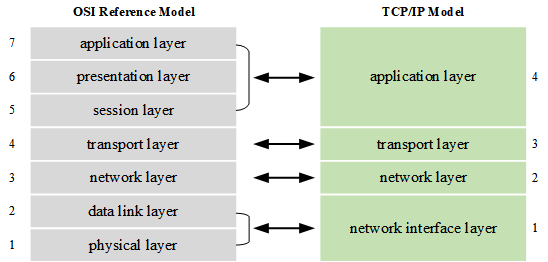
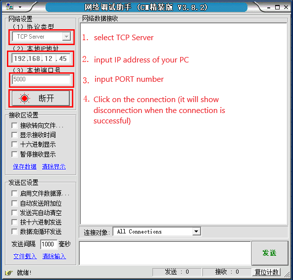
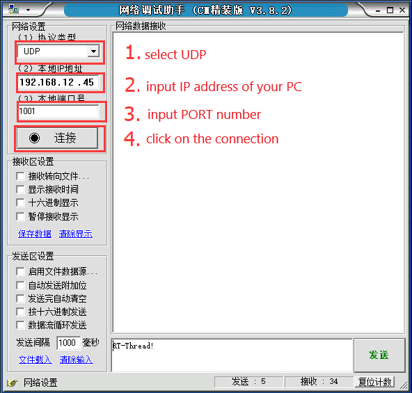

# Network Framework

With the popularity of the Internet, people's lives are increasingly dependent on the application of the network. More and more products need to connect to the Internet, and device networking has become a trend. To achieve the connection between the device and the network, you need to follow the TCP/IP protocol, you can run the network protocol stack on the device to connect to the network, or you can use devices (chips with hardware network protocol stack interfaces) to connect to the Internet.

When the device is connected to the network, it is like plugging in the wings. You can use the network to upload data in real time. The user can see the current running status and collected data of the device in a hundred thousand miles, and remotely control the device to complete specific tasks. You can also play online music, make online calls, and act as a LAN storage server through your device.

This chapter will explain the related content of the RT-Thread network framework, and introduce you to the concept, function and usage of the network framework. After reading this chapter, you will be familiar with the concept and implementation principle of the RT-Thread network framework and familiar with  network programming using Socket API.

## TCP/IP Introduction to Network Protocols

TCP/IP is short for Transmission Control Protocol/Internet Protocol. It is not a single protocol, but a general term for a protocol family. It includes IP protocol, ICMP protocol, TCP protocol, and http and ftp, pop3, https protocol, etc., which define how electronic devices connect to the Internet and the standards by which data is transferred between them.

### OSI Reference Model

OSI (Open System Interconnect), which is an open system interconnection. Generally referred to as the OSI reference model, it is a network interconnection model studied by the ISO (International Organization for Standardization) in 1985.  The architecture standard defines a seven-layer framework for the network interconnection (physical layer, data link layer, network layer, transport layer, session layer, presentation layer, and application layer), that is, the ISO open system interconnection reference model. The first to third layers belong to the lower three layers of the OSI Reference Model and are responsible for creating links for network communication connections; the fourth to seventh layers are the upper four layers of the OSI reference model and is responsible for end-to-end data communication. The capabilities of each layer are further detailed in this framework to achieve interconnectivity, interoperability, and application portability in an open system environment.

### TCP/IP Reference Model

The TCP/IP communication protocol uses a four-layer hierarchical structure, and each layer calls the network provided by its next layer to fulfill its own needs. The four layers are:

* **Application layer**: Different types of network applications have different communication rules, so the application layer protocols are various, such as Simple Mail Transfer Protocol (SMTP), File Transfer Protocol (FTP), and network remote access protocol (Telnet).
* **Transport layer**: In this layer, it provides data transfer services between nodes, such as Transmission Control Protocol (TCP), User Datagram Protocol (UDP), etc. TCP and UDP add data to the data packet and transmit it to the next layer, this layer is responsible for transmitting data and determining that the data has been delivered and received.
* **Network layer**: responsible for providing basic data packet transfer functions, so that each packet can reach the destination host (but not check whether it is received correctly), such as Internet Protocol (IP).
* **Network interface layer**: Management of actual network media, defining how to use actual networks (such as Ethernet, Serial Line, etc.) to transmit data.

### Difference between TCP/IP Reference Model and OSI Reference Model

The following figure shows the TCP/IP reference model and the OSI reference model diagram:



Both the OSI reference model and the TCP/IP reference model are hierarchical, based on the concept of a separate protocol stack. The OSI reference model has 7 layers, while the TCP/IP reference model has only 4 layers, that is, the TCP/IP reference model has no presentation layer and session layer, and the data link layer and physical layer are merged into a network interface layer. However, there is a certain correspondence between the two layers. Due to the complexity of the OSI system and the design prior to implementation, many designs are too ideal and not very convenient for software implementation. Therefore, there are not many systems that fully implement the OSI reference model, and the scope of application is limited. The TCP/IP reference model was first implemented in a computer system. It has a stable implementation on UNIX and Windows platforms, and provides a simple and convenient programming interface (API) on which a wide range of applications are developed. The TCP/IP reference model has become the international standard and industry standard for Internet connectivity.

### IP Address

The IP address refers to the Internet Protocol Address (also translated as the Internet Protocol Address) and is a uniform address format that assigns a logical address to each network and each host on the Internet to mask physical address differences provided by  Internet Protocol. The common LAN IP address is 192.168.X.X.

### Subnet Mask

Subnet mask (also called netmask, address mask), which is used to indicate which bits of an IP address identify the subnet where the host is located, and which bits are identified as the bit mask of the host. The subnet mask cannot exist alone, it must be used in conjunction with an IP address. Subnet mask has only one effect, which is to divide an IP address into two parts: network address and host address. The subnet mask is the bit of 1, the IP address is the network address, the subnet mask is the bit of 0, and the IP address is the host address. Taking the IP address 192.168.1.10 and the subnet mask 255.255.255.0 as an example, the first 24 bits of the subnet mask (converting decimal to binary) is 1, so the first 24 bits of the IP address 192.168.1 represent the network address. The remaining 0 is the host address.

### MAC Address

MAC (figures Access Control or Medium Access Control) address, which is translated as media access control, or physical address, hardware address, used to define the location of  network devices. In OSI model, the third layer network Layer is responsible for IP address, the second layer data link layer is responsible for the MAC address. A host will have at least one MAC address.

## Introduction to the Network Framework of RT-Thread

In order to support various network protocol stacks, RT-Thread has developed a **SAL** component, the full name of the **Socket abstraction layer**. RT-Thread can seamlessly access various protocol stacks, including several commonly used TCP/IP protocol stack, such as the LwIP protocol stack commonly used in embedded development and the AT Socket protocol stack component developed by RT-Thread, which complete the conversion of data from the network layer to the transport layer.

The main features of the RT-Thread network framework are as follows:

* Support for standard network sockets BSD Socket API, support for poll/select
* Abstract, unified multiple network protocol stack interfaces
* Support various physical network cards, network communication module hardware
* The resource occupancy of SAL socket abstraction layer component is small: ROM 2.8K and RAM 0.6K.

RT-Thread's network framework adopts a layered design with four layers, each layer has different responsibilities. The following figure shows the RT-Thread network framework structure:


The network framework provides a standard BSD Socket interface to user applications. Developers use the BSD Socket interface to operate without worrying about how the underlying network is implemented, and no need to care which network protocol stack the network data passes through. The socket abstraction layer provides the upper application layer. The interfaces are: `accept`, `connect`, `send`, `recv`, etc.

Below the SAL layer is the protocol stack layer. The main protocol stacks supported in the current network framework are as follows:

* **LwIP** is an open source TCP/IP protocol stack implementation that reduces RAM usage while maintaining the main functionality of the TCP/IP protocol, making the LwIP protocol stack ideal for use in embedded systems.
* **AT Socket** is a component for modules that support AT instructions. The AT command uses a standard serial port for data transmission and reception, and converts complex device communication methods into simple serial port programming, which greatly simplifies the hardware design and software development costs of the product, which makes almost all network modules such as GPRS, 3G/4G, NB-IoT, Bluetooth, WiFi, GPS and other modules are very convenient to access the RT-Thread network framework, develop network applications through the standard BSD Socket method, greatly simplifying the development of upper-layer applications.
* **Socket CAN** is a way of programming CAN, it is easy to use and easy to program. By accessing the SAL layer, developers can implement Socket CAN programming on RT-Thread.

Below the protocol stack layer is an abstract device layer that is connected to various network protocol stacks by abstracting hardware devices into Ethernet devices or AT devices.

The bottom layer is a variety of network chips or modules (for example: Ethernet chips with built-in protocol stack such as W5500/CH395, WiFi module with AT command, GPRS module, NB-IoT module, etc.). These hardware modules are the carrier that truly performs the network communication function and is responsible for communicating with various physical networks.

In general, the RT-Thread network framework allows developers to only care about and use the standard BSD Socket network interface for network application development, without concern for the underlying specific network protocol stack type and implementation, greatly improving system compatibility and convenience. Developers have completed the development of network-related applications, and have greatly improved the compatibility of RT-Thread in different areas of the Internet of Things.

In addition, based on the network framework, RT-Thread provides a large number of network software packages, which are various network applications based on the SAL layer, such as **Paho MQTT**, **WebClient**, **cJSON**, **netutils**, etc., which can be obtained from the online package management center. These software packages are web application tools. Using them can greatly simplify the development of network applications and shorten the network application development cycle. At present, there are more than a dozen network software packages. The following table lists some of the network software packages currently supported by RT-Thread, and the number of software packages is still increasing.

| **Package Name** | **Description**                                              |
| ---------------- | ------------------------------------------------------------ |
| Paho MQTT        | Based on Eclipse open source Paho MQTT, it has done a lot of functions and performance optimization, such as: increased automatic reconnection after disconnection, pipe model, support for non-blocking API, support for TLS encrypted transmission, etc. |
| WebClient        | Easy-to-use HTTP client with support for HTTP GET/POST and other common request functions, support for HTTPS, breakpoint retransmission, etc. |
| mongoose         | Embedded Web server network library, similar to Nginx in the embedded world. Licensing is not friendly enough, business needs to be charged |
| WebTerminal      | Access Finsh/MSH Shell packages in the browser or on the mobile |
| cJSON            | Ultra-lightweight JSON parsing library                       |
| ljson            | Json to struct parsing, output library                       |
| ezXML            | XML file parsing library, currently does not support parsing XML data |
| nanopb           | Protocol Buffers format data parsing library, Protocol Buffers format takes up less resources than JSON, XML format resources |
| GAgent           | Software package for accessing Gizwits Cloud Platform        |
| Marvell WiFi     | Marvell WiFi driver                                          |
| Wiced WiFi       | WiFi driver for Wiced interface                              |
| CoAP             | Porting libcoap's CoAP communication package                 |
| nopoll           | Ported open source WebSocket communication package           |
| netutils         | A collection of useful network debugging gadgets, including: ping, TFTP, iperf, NetIO, NTP, Telnet, etc. |
| OneNet           | Software for accessing China Mobile OneNet Cloud             |

## Network Framework Workflow

Using the RT-Thread network framework, you first need to initialize the SAL, then register various network protocol clusters to ensure that the application can communicate using the socket network socket interface. This section mainly uses LwIP as an example.

### Register the Network Protocol Cluster

First use the `sal_init()` interface to initialize resources such as mutex locks used in the component. The interface looks like this:

```c
int sal_init(void);
```

After the SAL is initialized, then use the  the `sal_proto_family_register()` interface to register network protocol cluster, for example, the LwIP network protocol cluster is registered to the SAL. The sample code is as follows:

```c
static const struct proto_family LwIP_inet_family_ops = {
    "LwIP",
    AF_INET,
    AF_INET,
    inet_create,
    LwIP_gethostbyname,
    LwIP_gethostbyname_r,
    LwIP_freeaddrinfo,
    LwIP_getaddrinfo,
};

int LwIP_inet_init(void)
{
    sal_proto_family_register(&LwIP_inet_family_ops);

    return 0;
}
```

`AF_INET` stands for IPv4 address, for example 127.0.0.1; `AF` is short for "Address Family" and `INET` is short for "Internet".

The `sal_proto_family_register()` interface is defined as follows:

```
int sal_proto_family_register(const struct proto_family *pf)；
```

|**Parameters**|**Description**       |
|----------|------------------|
| pf       | Protocol cluster structure pointer |
|**Return**|**——**         |
| 0        | registration success |
| -1      | registration failed |

### Network Data Receiving Process

After the LwIP is registered to the SAL, the application can send and receive network data through the network socket interface. In LwIP, several main threads are created, and they are `tcpip` thread, `erx` receiving thread and `etx` sending thread. The network data receiving process is as shown in the following picture. The application receives data by calling the standard socket interface `recv()` with blocking mode. When the Ethernet hardware device receives the network data packet, it stores the packet in the receiving buffer, and then sends an email to notify the `erx` thread that the data arrives through the Ethernet interrupt program. The `erx` thread applies for the `pbuf` memory block according to the received data length and put the data into the pbuf's `payload` data, then send the `pbuf` memory block to the `tcpip` thread via mailbox, and the `tcpip` thread returns the data to the application that is blocking the receiving data.


### Network Data Sending Process

The network data sending process is shown in the figure below. When there is data to send, the application calls the standard network socket interface `send()` to hand the data to the `tcpip` thread. The `tcpip` thread sends a message to wake up the `etx` thread. The `etx` thread first determines if the Ethernet is sending data. If data is not being sent, it will put the data to be sent into the send buffer, and then send the data through the Ethernet device. If data is being sent, the `etx` thread suspends itself until the Ethernet device is idle before sending the data out.


## Network Socket Programming

The application uses Socket (network socket) interface programming to implement network communication functions. Socket is a set of application program interface (API), which shields the communication details of each protocol, so that the application does not need to pay attention to the protocol itself, directly using the interfaces provide by socket to communicate between different hosts interconnected.

### TCP socket Communication Process

TCP(Tranfer Control Protocol) is a connection-oriented protocol to ensure reliable data transmission. Through the TCP protocol transmission, a sequential error-free data stream is obtained. The TCP-based socket programming flow diagram is shown in the following figure. A connection must be established between the sender and the receiver's two sockets in order to communicate on the basis of the TCP protocol. When a socket (usually a server socket) waits for a connection to be established. Another socket can request a connection. Once the two sockets are connected, they can perform two-way data transmission, and both sides can send or receive data. A TCP connection is a reliable connection that guarantees that packets arrive in order, and if a packet loss occurs, the packet is automatically resent.

For example, TCP is equivalent to calling in life. When you call the other party, you must wait for the other party to answer. Only when the other party answers your call  can he/she establish a connection with you. The two parties can talk and pass information to each other. Of course, the information passed at this time is reliable, because the other party can't hear what you said and can ask you to repeat the content again. When either party on the call wants to end the call, they will bid farewell to the other party and wait until the other party bids farewell to them before they hang up and end the call.


### UDP socket Communication Process

UDP is short for User Datagram Protocol. It is a connectionless protocol. Each datagram is a separate information, including the complete source address and destination address. It is transmitted to the destination on the network in any possible path. Therefore, whether the destination can be reached, the time to reach the destination, and the correctness of the content cannot be guaranteed. The UDP-based socket programming flow is shown in the following figure.


For example, UDP is equivalent to the walkie-talkie communication in life. After you set up the channel, you can directly say the information you want to express. The data is sent out by the walkie-talkie, but you don't know if your message has been received by others. By the way, unless someone else responds to you with a walkie-talkie. So this method is not reliable.

### Create a Socket

Before communicating, the communicating parties first use the `socket()` interface to create a socket, assigning a socket descriptor and its resources based on the specified address family, data type, and protocol. The interface is as follows:

```c
int socket(int domain, int type, int protocol);
```

|**Parameters**|**Description**                                       |
|----------|--------------------------------------------------|
| domain   | Protocol family                            |
| type     | Specify the communication type, including values SOCK_STREAM and SOCK_DGRAM. |
| protocol | Protocol allows to specify a protocol for the socket, which is set to 0 by default. |
|**Return**|**——**                                         |
| >=0     | Successful, returns an integer representing the socket descriptor |
| -1      | Fail                                         |

**Communication types** include SOCK_STREAM and SOCK_DGRAM.

**SOCK_STREAM** indicates connection-oriented TCP data transfer. Data can arrive at another computer without any errors. If it is damaged or lost, it can be resent, but it is relatively slow.

**SOCK_DGRAM** indicates the connectionless UDP data transfer method. The computer only transmits data and does not perform data verification. If the data is damaged during transmission or does not reach another computer, there is no way to remedy it. In other words, if the data is wrong, it is wrong and cannot be retransmitted. Because SOCK_DGRAM does less validation work, it is more efficient than SOCK_STREAM.

The sample code for creating a TCP type socket is as follows:

```c
 /* Create a socket, type is SOCKET_STREAM，TCP type */
    if ((sock = socket(AF_INET, SOCK_STREAM, 0)) == -1)
    {
        /* failed to create socket*/
        rt_kprintf("Socket error\n");

        return;
    }
```

### Binding Socket

A binding socket is used to bind a port number and an IP address to a specified socket. When using socket() to create a socket, only the protocol family is given, and no address is assigned. Before the socket receives a connection from another host, it must bind it with an address and port number using bind(). The interface is as follows:

```c
int bind(int s, const struct sockaddr *name, socklen_t namelen);
```

|**Parameters**|**Description**                                 |
|----------|--------------------------------------------|
| S        | Socket descriptor             |
| name     | Pointer to the sockaddr structure representing the address to be bound |
| namelen  | Length of sockaddr structure |
|**Return**|**——**                                   |
| 0        | Successful                      |
| -1      | Fail                                   |

### Establishing a TCP Connection

For server-side programs, after using `bind()` to bind the socket, you also need to use the `listen()` function to make the socket enter the passive listening state, and then call the `accept()` function to respond to the client at any time.

#### Listening Socket

The listening socket is used by the TCP server to listen for the specified socket connection. The interface is as follows:

```c
int listen(int s, int backlog);
```

|**Parameters**|**Description**                     |
|----------|--------------------------------|
| s        | Socket descriptor  |
| backlog  | Indicates the maximum number of connections that can be waited at a time |
|**Return**|**——**                       |
| 0        | Successful                  |
| -1      | Fail                       |

#### Accept the Connection

When the application listens for connections from other clients, the connection must be initialized with the `accept()` function, which creates a new socket for each connection and removes the connection from the listen queue. The interface is as follows:

```c
int accept(int s, struct sockaddr *addr, socklen_t *addrlen);
```

|**Parameters**|**Description**                     |
|----------|--------------------------------|
| s        | Socket descriptor  |
| addr     | Client device address information |
| addrlen  | Client device address structure length |
|**Return**|**——**                       |
| >=0     | Successful, return the newly created socket descriptor |
| -1      | Fail                        |

#### Establish Connection

Used by the client to establish a connection with the specified server. The interface is as follows:

```
int connect(int s, const struct sockaddr *name, socklen_t namelen);
```

|**Parameters**|**Description**             |
|----------|------------------------|
| s        | Socket descriptor |
| name     | Server address information |
| namelen  | Server address structure length |
|**Return**|**——**             |
| 0        | Successful       |
| -1      | Fail               |

When the client connects to the server, first set the server address and then use the `connect()` function to connect. The sample code is as follows:

```c
struct sockaddr_in server_addr;
/* Initialize the pre-connected server address */
server_addr.sin_family = AF_INET;
server_addr.sin_port = htons(port);
server_addr.sin_addr = *((struct in_addr *)host->h_addr);
rt_memset(&(server_addr.sin_zero), 0, sizeof(server_addr.sin_zero));

/* Connect to the server */
if (connect(sock, (struct sockaddr *)&server_addr, sizeof(struct sockaddr)) == -1)
{
    /* Connection failed */
    closesocket(sock);

    return;
}
```

### Data Transmission

TCP and UDP have different data transmission methods. TCP needs to establish a connection before data transmission, use `send()` function for data transmission, use `recv()` function for data reception, and UDP does not need to establish connection. It uses `sendto()` function sends data and receives data using the `recvfrom()` function.

#### TCP Data Transmission

After the TCP connection is established, the data is sent using the `send()` function. The interface is as follows:

```c
int send(int s, const void *dataptr, size_t size, int flags);
```

|**Parameters**|**Description**                 |
|----------|----------------------------|
| s        | Socket descriptor |
| dataptr  | The data pointer to send |
| size     | Length of data sent |
| flags    | Flag, generally 0 |
|**Return**|**——**                   |
| >0      | Successful, return the length of the sent data |
| <=0     | Failed                 |

#### TCP Data Reception

After the TCP connection is established, use `recv()` to receive the data. The interface is as follows:

```c
int recv(int s, void *mem, size_t len, int flags);
```

|**Parameters**|**Description**                 |
|----------|----------------------------|
| s        | Socket descriptor |
| mem      | Received data pointer |
| len      | Received data length |
| flags    | Flag, generally 0 |
|**Return**|**Description**                 |
| >0      | Successful, return the length of the received data |
| =0       | The destination address has been transferred and the connection is closed |
| <0      | Fail                    |

#### UDP Data transmission

In the case where a connection is not established, you can use the `sendto()` function to send UDP data to the specified destination address, as shown below:

```c
int sendto(int s, const void *dataptr, size_t size, int flags,
           const struct sockaddr *to, socklen_t tolen);
```

|**Parameters**|**Description**                 |
|----------|----------------------------|
| s        | Socket descriptor                              |
| dataptr  | Data pointer sent |
| size     | Length of data sent |
| flags    | Flag, generally 0 |
| to       | Target address structure pointer |
| tolen    | Target address structure length |
|**Return**|**——**                   |
| >0      | Successful, return the length of the sent data |
| <=0     | Fail                |

#### UDP Data Reception

To receive UDP data, use the `recvfrom()` function, and the interface is:

```c
int recvfrom(int s, void *mem, size_t len, int flags,
             struct sockaddr *from, socklen_t *fromlen);
```

|**Parameters**|**Description**                 |
|----------|----------------------------|
| s        | Socket descriptor |
| mem      | Received data pointer                                        |
| len      | Received data length |
| flags    | Flag, generally 0 |
| from     | Receive address structure pointer |
| fromlen  | Receive address structure length |
|**Return**|**——**                   |
| >0      | Successful, return the length of the received data |
| 0        | The receiving address has been transferred and the connection is closed |
| <0      | Fail                   |

### Close Network Connection

After the network communication is over, you need to close the network connection. There are two ways to use `closesocket()` and `shutdown()`.

The `closesocket()` interface is used to close an existing socket connection, release the socket resource, clear the socket descriptor from memory, and then the socket could not be used again. The connection and cache associated with the socket are also lost the meaning, the TCP protocol will automatically close the connection. The interface is as follows:

```c
int closesocket(int s);
```

|**Parameters**|**Description**   |
|----------|--------------|
| s        | Socket descriptor |
|**Return**|**——**     |
| 0        | Successful |
| -1      | Fail     |

Network connections can also be turned off using the `shutdown()` function. The TCP connection is full-duplex. You can use the `shutdown()` function to implement a half-close. It can close the read or write operation of the connection, or both ends, but it does not release the socket resource. The interface is as follows:

```c
int shutdown(int s, int how);
```

|**Parameters**|**Description**            |
|----------|-----------------------------|
| s        | Socket descriptor        |
| how      | SHUT_RD closes the receiving end of the connection and no longer receives data. <br />SHUT_WR closes the connected sender and no longer sends data. <br />SHUT_RDWR is closed at both ends. |
|**Return**|**——**                    |
| 0        | Successful           |
| -1      | Fail                    |

## Network Function Configuration

The main functional configuration options of the network framework are shown in the following table, which can be configured according to different functional requirements:

SAL component configuration options:

|**Macro Definition**           |**Value Type**|**Description**         |
|------------------------|--------------|--------------------|
| RT_USING_SAL           | Boolean  | Enable SAL |
| SAL_USING_LWIP         | Boolean | Enable LwIP component |
| SAL_USING_AT           | Boolean  | Enable the AT component |
| SAL_USING_POSIX        | Boolean  | Enable POSIX interface                    |
| SAL_PROTO_FAMILIES_NUM | Integer  | the maximum number of protocol families supported |

LwIP Configuration options:

|**Macro Definition**                |**Value Type**|**Description**           |
|-----------------------------|--------------|----------------------|
| RT_USING_LWIP               | Boolean  | Enable  LwIP protocol |
| RT_USING_LWIP_IPV6          | Boolean  | Enable IPV6 protocol |
| RT_LWIP_IGMP                | Boolean  | Enable the IGMP protocol |
| RT_LWIP_ICMP                | Boolean  | Enable the ICMP protocol |
| RT_LWIP_SNMP                | Boolean  | Enable the SNMP protocol |
| RT_LWIP_DNS                 | Boolean  | Enable DHCP function |
| RT_LWIP_DHCP                | Boolean  | Enable DHCP function |
| IP_SOF_BROADCAST            | Integer  | filtering roadcasting Packets Sended by IP |
| IP_SOF_BROADCAST_RECV       | Integer  | filtering roadcasting Packets received by IP |
| RT_LWIP_IPADDR              | String | IP address     |
| RT_LWIP_GWADDR              | String | Gateway address |
| RT_LWIP_MSKADDR             | String | Subnet mask |
| RT_LWIP_UDP                 | Boolean  | Enable UDP protocol |
| RT_LWIP_TCP                 | Boolean  | Enable TCP protocol |
| RT_LWIP_RAW                 | Boolean  | Enable RAW API                             |
| RT_MEMP_NUM_NETCONN         | Integer  | Support Numbers of network links |
| RT_LWIP_PBUF_NUM            | Integer  | pbuf number of memory blocks |
| RT_LWIP_RAW_PCB_NUM         | Integer  | Maximum number of connections for RAW |
| RT_LWIP_UDP_PCB_NUM         | Integer  | Maximum number of connections for UDP |
| RT_LWIP_TCP_PCB_NUM         | Integer  | Maximum number of connections for TCP |
| RT_LWIP_TCP_SND_BUF         | Integer  | TCP send buffer size |
| RT_LWIP_TCP_WND             | Integer  | TCP sliding window size |
| RT_LWIP_TCPTHREAD_PRIORITY  | Integer  | TCP thread priority |
| RT_LWIP_TCPTHREAD_MBOX_SIZE | Integer  | TCP thread mailbox size |
| RT_LWIP_TCPTHREAD_STACKSIZE | Integer  | TCP thread stack size |
| RT_LWIP_ETHTHREAD_PRIORITY  | Integer  | Receive/send thread's priority |
| RT_LWIP_ETHTHREAD_STACKSIZE | Integer  | Receive/send thread's stack size |
| RT_LwIP_ETHTHREAD_MBOX_SIZE | Integer  | Receive/send thread's mailbox size |

## Network Application Example

### View IP Address

In the console, you can use the ifconfig command to check the network status. The IP address is 192.168.12.26, and the FLAGS status is LINK_UP, indicating that the network is configured:

```c
msh >ifconfig
network interface: e0 (Default)
MTU: 1500
MAC: 00 04 a3 12 34 56
FLAGS: UP LINK_UP ETHARP BROADCAST IGMP
ip address: 192.168.12.26
gw address: 192.168.10.1
net mask  : 255.255.0.0·
dns server #0: 192.168.10.1
dns server #1: 223.5.5.5
```

### Ping Network Test

Use the ping command for network testing:

```c
msh />ping rt-thread.org
60 bytes from 116.62.244.242 icmp_seq=0 ttl=49 time=11 ticks
60 bytes from 116.62.244.242 icmp_seq=1 ttl=49 time=10 ticks
60 bytes from 116.62.244.242 icmp_seq=2 ttl=49 time=12 ticks
60 bytes from 116.62.244.242 icmp_seq=3 ttl=49 time=10 ticks
msh />ping 192.168.10.12
60 bytes from 192.168.10.12 icmp_seq=0 ttl=64 time=5 ticks
60 bytes from 192.168.10.12 icmp_seq=1 ttl=64 time=1 ticks
60 bytes from 192.168.10.12 icmp_seq=2 ttl=64 time=2 ticks
60 bytes from 192.168.10.12 icmp_seq=3 ttl=64 time=3 ticks
msh />
```

Getting the above output indicates that the connection network is successful!

### TCP Client Example

After the network is successfully connected, you can run the network example, first run the TCP client example. This example will open a TCP server on the PC, open a TCP client on the IoT Board, and both parties will communicate on the network.

In the example project, there is already a TCP client program `tcpclient_sample.c`. The function is to implement a TCP client that can receive and display the information sent from the server. If it receives the information starting with 'q' or 'Q', then exit the program directly and close the TCP client. The program exports the tcpclient command to the FinSH console. The command  format is `tcpclient URL PORT`, where URL is the server address and PORT is the port number. The sample code is as follows:

```c
/*
 * Program list: tcp client
 *
 * This is a tcp client routine
 * Export the tcpclient command to MSH
 * Command call format: tcpclient URL PORT
 * URL: server address PORT:: port number
 * Program function: Receive and display the information sent from the server, and receive the information that starts with 'q' or 'Q' to exit the program.
*/

#include <rtthread.h>
#include <sys/socket.h> /* To use BSD socket, you need to include the socket.h header file. */
#include <netdb.h>
#include <string.h>
#include <finsh.h>

#define BUFSZ   1024

static const char send_data[] = "This is TCP Client from RT-Thread."; /* Sending used data */
void tcpclient(int argc, char**argv)
{
    int ret;
    char *recv_data;
    struct hostent *host;
    int sock, bytes_received;
    struct sockaddr_in server_addr;
    const char *url;
    int port;

    /* Received less than 3 parameters */
    if (argc < 3)
    {
        rt_kprintf("Usage: tcpclient URL PORT\n");
        rt_kprintf("Like: tcpclient 192.168.12.44 5000\n");
        return ;
    }

    url = argv[1];
    port = strtoul(argv[2], 0, 10);

    /* Get the host address through the function entry parameter url (if it is a domain name, it will do domain name resolution) */
    host = gethostbyname(url);

    /* Allocate buffers for storing received data */
    recv_data = rt_malloc(BUFSZ);
    if (recv_data == RT_NULL)
    {
        rt_kprintf("No memory\n");
        return;
    }

    /* Create a socket of type SOCKET_STREAM, TCP type */
    if ((sock = socket(AF_INET, SOCK_STREAM, 0)) == -1)
    {
        /* Failed to create socket */
        rt_kprintf("Socket error\n");

        /* Release receive buffer */
        rt_free(recv_data);
        return;
    }

    /* Initialize the pre-connected server address */
    server_addr.sin_family = AF_INET;
    server_addr.sin_port = htons(port);
    server_addr.sin_addr = *((struct in_addr *)host->h_addr);
    rt_memset(&(server_addr.sin_zero), 0, sizeof(server_addr.sin_zero));

    /* Connect to the server */
    if (connect(sock, (struct sockaddr *)&server_addr, sizeof(struct sockaddr)) == -1)
    {
        /* Connection failed */
        rt_kprintf("Connect fail!\n");
        closesocket(sock);

        /* Release receive buffer */
        rt_free(recv_data);
        return;
    }

    while (1)
    {
        /* Receive maximum BUFSZ-1 byte data from a sock connection */
        bytes_received = recv(sock, recv_data, BUFSZ - 1, 0);
        if (bytes_received < 0)
        {
            /* Receive failed, close this connection */
            closesocket(sock);
            rt_kprintf("\nreceived error,close the socket.\r\n");

            /* Release receive buffer */
            rt_free(recv_data);
            break;
        }
        else if (bytes_received == 0)
        {
            /* Print the recv function returns a warning message with a value of 0 */
            rt_kprintf("\nReceived warning,recv function returns 0.\r\n");

            continue;
        }

        /* Received data, clear the end */
        recv_data[bytes_received] = '\0';

        if (strncmp(recv_data, "q", 1) == 0 || strncmp(recv_data, "Q", 1) == 0)
        {
            /* If the initial letter is q or Q, close this connection */
            closesocket(sock);
            rt_kprintf("\n got a'q'or'Q',close the socket.\r\n");

            /* Release receive buffer */
            rt_free(recv_data);
            break;
        }
        else
        {
            /* Display the received data at the control terminal */
            rt_kprintf("\nReceived data = %s", recv_data);
        }

        /* Send data to sock connection */
        ret = send(sock, send_data, strlen(send_data), 0);
        if (ret < 0)
        {
            /* Receive failed, close this connection */
            closesocket(sock);
            rt_kprintf("\nsend error,close the socket.\r\n");

            rt_free(recv_data);
            break;
        }
        else if (ret == 0)
        {
            /* Print the send function returns a warning message with a value of 0 */
            rt_kprintf("\n Send warning,send function returns 0.\r\n");
        }
    }
    return;
}
MSH_CMD_EXPORT(tcpclient, a tcp client sample);
```

When running the example, first open a network debugging assistant on your computer and open a TCP server. Select the protocol type as TCP
Server, fill in the local IP address and port 5000, as shown below.



Then start the TCP client to connect to the TCP server by entering the following command in the FinSH console:

```C
msh />tcpclient 192.168.12.45 5000  // Input according to actual situation
Connect successful
```

When the console outputs the log message "Connect successful", it indicates that the TCP connection was successfully established. Next, you can perform data communication. In the network debugging tool window, send Hello RT-Thread!, which means that a data is sent from the TCP server to the TCP client, as shown in the following figure:


After receiving the data on the FinSH console, the corresponding log information will be output, you can see:

```c
msh >tcpclient 192.168.12.130 5000
Connect successful
Received data = hello world
Received data = hello world
Received data = hello world
Received data = hello world
Received data = hello world
 got a 'q' or 'Q',close the socket.
msh >
```

The above information indicates that the TCP client received 5 "hello world" data sent from the server. Finally, the exit command 'q' was received from the TCP server, and the TCP client program exited the operation and returned to the FinSH console.

### UDP Client Example

This is an example of a UDP client. This example will open a UDP server on the PC and open a UDP client on the IoT Board for network communication. A UDP client program has been implemented in the sample project. The function is to send data to the server. The sample code is as follows:

```c
/*
 * Program list: udp client
 *
 * This is a udp client routine
 * Export the udpclient command to the msh
 * Command call format: udpclient URL PORT [COUNT = 10]
 * URL: Server Address PORT: Port Number COUNT: Optional Parameter Default is 10
 * Program function: send COUNT datas to the remote end of the service
*/

#include <rtthread.h>
#include <sys/socket.h> /* To use BSD socket, you need to include the sockets.h header file. */
#include <netdb.h>
#include <string.h>
#include <finsh.h>

const char send_data[] = "This is UDP Client from RT-Thread.\n"; /* data */

void udpclient(int argc, char**argv)
{
    int sock, port, count;
    struct hostent *host;
    struct sockaddr_in server_addr;
    const char *url;

    /* Received less than 3 parameters */
    if (argc < 3)
    {
        rt_kprintf("Usage: udpclient URL PORT [COUNT = 10]\n");
        rt_kprintf("Like: udpclient 192.168.12.44 5000\n");
        return ;
    }

    url = argv[1];
    port = strtoul(argv[2], 0, 10);

    if (argc> 3)
        count = strtoul(argv[3], 0, 10);
    else
        count = 10;

    /* Get the host address through the function entry parameter url (if it is a domain name, it will do domain name resolution) */
    host = (struct hostent *) gethostbyname(url);

    /* Create a socket of type SOCK_DGRAM, UDP type */
    if ((sock = socket(AF_INET, SOCK_DGRAM, 0)) == -1)
    {
        rt_kprintf("Socket error\n");
        return;
    }

    /* Initialize the pre-connected server address */
    server_addr.sin_family = AF_INET;
    server_addr.sin_port = htons(port);
    server_addr.sin_addr = *((struct in_addr *)host->h_addr);
    rt_memset(&(server_addr.sin_zero), 0, sizeof(server_addr.sin_zero));

    /* Send count data in total */
    while (count)
    {
        /* Send data to the remote end of the service */
        sendto(sock, send_data, strlen(send_data), 0,
               (struct sockaddr *)&server_addr, sizeof(struct sockaddr));

        /* Thread sleep for a while */
        rt_thread_delay(50);

        /* Count value minus one */
        count --;
    }

    /* Turn off this socket */
    closesocket(sock);
}
```

When running the example, first open a network debugging assistant on your computer and open a UDP server. Select the protocol type as UDP and fill in the local IP address and port 5000, as shown in the figure below.



Then you can enter the following command in the FinSH console to send data to the UDP server.

```c
msh />udpclient 192.168.12.45 1001          // Need to enter according to the real situation
```

The server will receive 10 messages from This is UDP Client from RT-Thread., as shown below:


