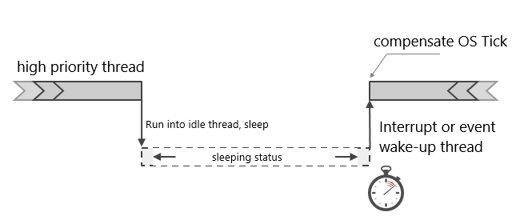
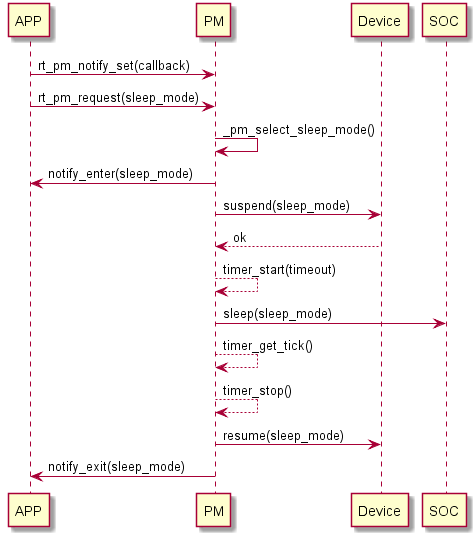

# Power Management: PM

The purpose of low power management of embedded system is to reduce system energy consumption as much as possible to prolong the standby time of equipment on the premise of satisfying users'performance requirements. The contradiction between high performance and limited battery energy is most prominent in embedded systems. The combination of hardware low power design and software low power management has become an effective means to solve the contradiction. Nowadays, all kinds of MCUs provide management interfaces in low power consumption more or less. For example, adjusting the frequency of the main control clock, changing the working voltage, adjusting or even closing the bus frequency, closing the working clock of peripheral equipment, etc. With the support of hardware, reasonable software design becomes the key to energy saving. Generally, low power management can be divided into three categories:

- Processor Power Management

  - The main ways of realization are dynamic management of CPU frequency and adjustment of working mode when the system is idle.

- Power management of equipment

  - The main way to achieve this is to shut down individual idle devices

- Power Management of System Platform

  - The main way to realize it is to specific customization of infrequent devices on specific system platforms.

With the rise of the Internet of Things (IoT), the demand for power consumption of products becomes more and more intense. Sensor nodes as data acquisition usually need to work long-term when the battery is powered, and SOC connected to the network also needs fast response function and low power consumption.

In the initial stage of product development, the first consideration is to complete the development of product functions as soon as possible. After the function of the product is gradually improved, it is necessary to add the power management (PM) function. To meet this need of IoT, RT-Thread provides power management components. The idea of power management components is to be as transparent as possible, making it easier for products to add low power functions.

## Introduction of PM Components

RT-Thread's PM components adopt a layered design idea, separating architecture and chip-related parts, and extracting common parts as the core. While providing a common interface to the upper layer, it also makes it easier for the bottom driver to adapt components.


### Main Features

The main features of RT-Thread PM components are as follows:

- It manages power consumption based on mode, dynamically adjusts working mode in idle time, and supports multiple levels of sleeping.
- Transparent to applications, components automatically complete power management at the bottom layer.
- It supports dynamic frequency conversion in running mode and updates the frequency configuration of equipment automatically according to the mode to ensure normal operation in different running modes.
- Support equipment power management, automatically manage device suspending and resuming according to the mode, ensure correct suspending and resuming in different sleep mode.
- Optional sleep time compensation is supported to make OS Tick dependent applications transparent.
- Provide the device interface to the upper layer. If the devfs component is opened, it can also be accessed through the file system interface.

### Working Principle

The essence of low power consumption is that when the system is idle, the CPU stops working, interrupts or resumes working after the event wakes up. In RTOS, there is usually an IDLE task, which has the lowest priority and remains ready. When the high priority task is not ready, the OS executes the IDLE task. Generally, the CPU executes empty instructions in IDLE tasks without low power processing. The power management component of RT-Thread can effectively reduce the power consumption of the system by managing CPU, clock and equipment in IDLE tasks.



As shown in the figure above, when the high priority thread runs out or is suspended, the system enters the IDLE thread . After the IDLE thread is executed, it will determine whether the system can go to sleep (to save power). If the system goes to sleep, Some hardware modules will be shut down depending on the chip condition, and OS Tick is also very likely to enter a pause state. At this time, the power management framework will calculate the next timeout point according to the system timer situation, and set a low-power timer, so that the device can wake up at that point, and carry out follow-up work. When the system is awakened (low power timer interrupt or other wake-up interrupt source), the system also needs to know how long it sleeps, and compensate for OS Tick, so that the OS tick value of the system is adjusted to a correct value.

## PM Framework

In RT-Thrad PM components, peripherals or applications vote on the required power consumption mode by voting mechanism. When the system is idle, the appropriate power consumption mode is decided according to the voting number, and the abstract interface is called to control the chip to enter a low power consumption state, so as to reduce the power consumption of the system. When no vote is taken, it is entered in the default mode (usually idle mode). Unlike applications, some peripherals may perform specific operations when they enter a low-power state and take measures to recover when they exit a low-power state, which can be achieved by registering PM devices. By registering PM devices, `suspend` callbacks of registered devices will be triggered before entering a low power state. Developers can perform their own operations in the callbacks. Similarly, `resume` callbacks will be triggered when exiting from a low power state.


## Low Power State and Mode

The RT-Thread PM component divides the system into two states: RUN(running state) and Sleep(sleeping state).

Running state controls the frequency of CPU, which is suitable for frequency conversion scenarios. Sleeping state realizes sleeping CPU according to SOC characteristics to reduce power consumption. The two states are controlled independently using different API interfaces.

- **Sleeping state**

Sleeping state is also a low power state in the usual sense. By closing the peripherals and executing the SOC power management interface, the system power consumption is reduced.

The state of sleeping is divided into six patterns, which take the form of pyramids. As the mode increases, the power consumption decreases step by step. The following is the definition of the mode in the sleeping state. Developers can implement the corresponding mode according to the specific SOC, but they need to follow the characteristics of power consumption decreasing step by step.

| Patterns               | Level | Description                                                  |
| ---------------------- | ----- | ------------------------------------------------------------ |
| PM_SLEEP_MODE_NONE     | 0     | The system is active without any power reduction.            |
| PM_SLEEP_MODE_IDLE     | 1     | The idle mode, which stops CPU and part of the clock when the system is idle. Any event or interrupt can wake up system. |
| PM_SLEEP_MODE_LIGHT    | 2     | Light sleep modes, CPU stops, most clocks and peripherals stop, and time compensation is required after wake-up. |
| PM_SLEEP_MODE_DEEP     | 3     | Deep sleep mode, CPU stops, only a few low power peripheral work, can be awakened by special interrupts |
| PM_SLEEP_MODE_STANDBY  | 4     | Standby mode, CPU stops, device context loss (can be saved to special peripherals), usually reset after wake-up |
| PM_SLEEP_MODE_SHUTDOWN | 5     | Shutdown mode, lower power consumption than Standby mode, context is usually irrecoverable, reset after wake-up |

>Note: The implementation of power management varies from chip to chip. The above description only gives some recommended scenarios, not all of which need to be implemented. Developers can choose several of them to implement according to their own situation, but they need to follow the principle of higher level and lower power consumption.

- **Running state**

Running state is usually used to change the running frequency of CPU, independent of sleep mode. Current operation status is divided into four levels: high-speed, normal-speed, medium-speed and low-speed, as follows:

| Patterns                 | Description                                                  |
| ------------------------ | ------------------------------------------------------------ |
| PM_RUN_MODE_HIGH_SPEED   | High-speed mode, suitable for some over-frequency scenarios  |
| PM_RUN_MODE_NORMAL_SPEED | Normal-speed mode, which is the default running state        |
| PM_RUN_MODE_MEDIUM_SPEED | Medium-speed mode, reduce CPU running speed, thereby reducing power consumption |
| PM_RUN_MODE_LOW_SPEED    | Low-speed mode, CPU frequency further reduced                |

### Request and release of patterns

In PM components, upper applications can actively participate in power management by requesting and releasing sleep modes. Applications can request different sleep modes according to scenarios and release them after processing. As long as any application or device requests higher-level power mode, it will not switch to a lower mode. Therefore, the requests and releases of sleep mode usually occur in pairs and can be used to protect a certain stage, such as the peripheral DMA transmission process.

### Device Sensitive to Mode Changes

In PM components, switching to a new mode of operation may lead to changes in CPU frequency. If peripherals and CPUs share a part of the clock, the peripheral clock will be affected. When entering the new sleep mode, most clock sources will be stopped. If the peripheral does not support the freezing function of sleep, then the peripheral clock needs to be reconfigured when waking up from sleep. So PM components support PM mode sensitive PM devices. It enables the device to work normally when switching to a new operation mode or a new sleep mode. This function requires the underlying driver to implement the relevant interface and register as a device sensitive to mode changes.

## The calling process



Firstly, the application layer sets the callback function of entering and exiting the dormancy state, and then calls `rt_pm_request` to request the sleeping mode to trigger the sleeping operation. The PM component checks the number of sleeping modes when the system is idle, and gives the recommended mode according to the number of votes. Then the PM component calls `notfiy` to inform the application that it is going to enter the sleep mode, and then suspends the registered PM device and executes the sleep mode implemented by SOC after returning to OK. The system enters the sleep state (if the enabling time is compensated, the low-power timer will be started before the sleep). At this point, the CPU stops working and waits for an event or interrupt to wake up. When the system is awakened, because the global interruption is closed, the system continues to execute from there, gets the sleep time to compensate the OS tick of the system, wakes up the device in turn, and notifies the application to exit from the sleep mode. Such a cycle is completed, exits, and waits for the system to be idle next time.

## Introduction to APIs

### Request Sleep Mode

```c
void rt_pm_request(uint8_t sleep_mode);
```

| Parameter  | Mode                     |
| ---------- | ------------------------ |
| sleep_mode | Request Sleep mode level |

Sleep_mode takes the following enumeration values:

```c
enum
{
    /* sleep modes */
    PM_SLEEP_MODE_NONE = 0,    /* active state */
    PM_SLEEP_MODE_IDLE,        /* idle mode (default) */
    PM_SLEEP_MODE_LIGHT,       /* Light Sleep Mode */
    PM_SLEEP_MODE_DEEP,        /* Deep Sleep Mode */
    PM_SLEEP_MODE_STANDBY,     /* Standby Mode */
    PM_SLEEP_MODE_SHUTDOWN,    /* Shutdowm Mode */
    PM_SLEEP_MODE_MAX,
};
```

Calling this function adds the corresponding pattern count to 1 and locks the pattern. At this point, if a lower level of power mode is requested, it will not be accessible. Only after releasing (unlocking) the previously requested mode, the system can enter a lower level of power mode; requests to higher power mode are not affected by this. This function needs to be used in conjunction with `rt_pm_release` to protect a certain stage or process.

### Release  Sleep Mode

```c
void rt_pm_release(uint8_t sleep_mode);
```

| Parameter  | Mode             |
| ---------- | ---------------- |
| sleep_mode | Sleep mode level |

Calling this function decreases the corresponding pattern count by 1, and releases the previously requested pattern in conjunction with `rt_pm_request`.

### Setting up Running Mode

```c
int rt_pm_run_enter(uint8_t run_mode);
```

| Parameter | Mode               |
| --------- | ------------------ |
| run_mode  | Running mode level |

`run_mode` can take the following enumeration values:

```c
enum
{
    /* run modes*/
    PM_RUN_MODE_HIGH_SPEED = 0,    /* high speed */
    PM_RUN_MODE_NORMAL_SPEED,      /* Normal speed(default) */
    PM_RUN_MODE_MEDIUM_SPEED,      /* Medium speed */
    PM_RUN_MODE_LOW_SPEED,         /* low speed */
    PM_RUN_MODE_MAX,
};
```

Calling this function changes the CPU's running frequency, thereby reducing the power consumption at runtime. This function only provides levels, and the specific CPU frequency should depend on the actual situation during the migration phase.

### Setting up callback notifications for entering/exiting sleep mode

```c
void rt_pm_notify_set(void (*notify)(uint8_t event, uint8_t mode, void *data), void *data);
```

| Parameter | Mode              |
| --------- | ----------------- |
| notify    | callback function |
| data      | Private data      |

Evet is the following two enumeration values, identifying entry/exit sleep mode respectively.

```c
enum
{
    RT_PM_ENTER_SLEEP = 0,    /* entry sleep mode */
    RT_PM_EXIT_SLEEP,         /* exit sleep mode */
};

```

## Instruction for Use

### Setting Low Power Level

If the system needs to enter a specified level of low power consumption, it can be achieved by calling rt_pm_request. For example, into deep sleep mode:

```c
/* Request for Deep Sleep Mode */
rt_pm_request(PM_SLEEP_MODE_DEEP);
```

> Note: If higher power consumption modes, such as Light Mode or Idle Mode, are requested elsewhere in the program, then the corresponding mode needs to be released before the deep sleep mode can be entered.

### Protect a stage or process

In special cases, for example, the system is not allowed to enter a lower power mode at a certain stage, which can be protected by rt_pm_request and rt_pm_release. For example, deep sleep mode (which may cause peripherals to stop working) is not allowed during I2C reading data, so the following processing can be done:

```c
/* Request light sleep mode (I2C peripheral works normally in this mode) */
rt_pm_request(PM_SLEEP_MODE_LIGHT);

/* Reading Data Procedure */

/* Release this model */
rt_pm_release(PM_SLEEP_MODE_LIGHT);

```

### Changing CPU Running Frequency

Reducing the running frequency can effectively reduce the power consumption of the system, and the running frequency of the CPU can be changed through the `rt_pm_run_enter` interface. Generally speaking, frequency reduction means that CPU performance decreases and processing speed decreases, which may lead to the increase of task execution time and need to be weighed reasonably.

```c
/* Enter Medium Speed Mode */
rt_pm_run_enter(PM_RUN_MODE_MEDIUM_SPEED);
```

## Migration instructions

Low power management is a very meticulous task. Developers need not only to fully understand the power management of the chip itself, but also to be familiar with the peripheral circuit of the board and deal with it one by one when they enter the low power state, so as to avoid leakage of the peripheral circuit and pull up the overall power consumption.

RT-Thread PM components Abstract each part and provide different OPS interfaces for developers to adapt. The following points need to be paid attention to when they migration:

```c
/**
 * low power mode operations
 */
struct rt_pm_ops
{
    /* Sleep interface for adapting chip-related low power characteristics */
    void (*sleep)(struct rt_pm *pm, uint8_t mode);
    /* Run Interface for Frequency Conversion and Voltage Conversion in Running Mode */
    void (*run)(struct rt_pm *pm, uint8_t mode);
    /* The following three interfaces are used to start a low-power timer after cardiac arrest to compensate for the OS tick */
    void (*timer_start)(struct rt_pm *pm, rt_uint32_t timeout);
    void (*timer_stop)(struct rt_pm *pm);
    rt_tick_t (*timer_get_tick)(struct rt_pm *pm);
};

/* The OPS is used to manage the power consumption of peripherals */
struct rt_device_pm_ops
{
    /* Suspending the peripheral before entering sleeping mode and return to non-zero to indicate that the peripheral is not ready and cannot enter */
    int (*suspend)(const struct rt_device *device, uint8_t mode);
    /* Resume peripherals after exiting from sleep mode */
    void (*resume)(const struct rt_device *device, uint8_t mode);
    /* When the mode changes, notify peripheral processing in the running state */
    int (*frequency_change)(const struct rt_device *device, uint8_t mode);
};

/* Register a PM device */
void rt_pm_device_register(struct rt_device *device, const struct rt_device_pm_ops *ops);
```

### Power Consumption Characteristics of Chips

```c
void (*sleep)(struct rt_pm *pm, uint8_t mode);
```

Each chip has different definitions and management of low power mode. PM component abstracts chip-related characteristics into sleep interface. The interface adapts to low power management related to chips. When entering different `sleep` modes, some hardware-related configurations, storage and other related processing are needed.

### Time Compensation for Sleep Mode

```c
void (*timer_start)(struct rt_pm *pm, rt_uint32_t timeout);
void (*timer_stop)(struct rt_pm *pm);
rt_tick_t (*timer_get_tick)(struct rt_pm *pm);
```

In some sleep modes (Light Sleep or Deep Sleep), the OS Tick timer in the kernel may be stopped. At this time, it is necessary to start a timer to measure the time of sleep and compensate for the OS Tick after waking up. Time compensated timer must still be able to work properly in this mode and wake up the system, otherwise it is meaningless!

- **timer_start**: Start a low-power timer, and the input parameter is the latest next task readiness time.
- **timer_get_tick**: Get the sleep time when the system is awakened;
- **timer_stop**: Used to stop low-power timers after system wake-up.

**Note**: Time compensation for sleep mode needs to be turned on at the initialization stage by setting the bit control of the corresponding mode of timer_mask. For example, if time compensation in Deep Sleep mode needs to be turned on, then after implementing the timer-related OPS interface, the corresponding bit is set at initialization:

```c
rt_uint8_t timer_mask = 0;

/* Set the bit corresponding to Deep Sleep mode to enable sleep time compensation */
timer_mask = 1UL << PM_SLEEP_MODE_DEEP;

/* initialize system pm module */
rt_system_pm_init(&_ops, timer_mask, RT_NULL);

```

### Frequency Conversion in Running Mode

```
void (*run)(struct rt_pm *pm, uint8_t mode);
```

The frequency conversion of operation mode is realized by adapting the `run` interface in `rt_pm_ops`, and the appropriate frequency is selected according to the use scenario.

### Power management of peripherals

Power processing of peripherals is an important part of low power management system. When entering some level of sleep mode, it is usually necessary to process some peripherals, such as emptying DMA, closing clock or setting IO to reset state, and recover after quitting sleep.

In this case, PM devices can be registered through rt_pm_device_register interface, suspend and resume callbacks of registered devices will be executed when entering/exiting Sleeping mode, and frequency_change callbacks of devices will also be triggered by frequency changes in Running mode.

A more detailed migration case can be referred to stm32l476-nucleo BSP in the RT-Thread repository.

## MSH Commands

### Request Sleep Mode

The `pm_request` command can be used to request related patterns, using an example as follows:

```c
msh />pm_request 0
msh />
```

The range of parameter values is 0-5, corresponding to the following enumeration values:

```c
enum
{
    /* sleep modes */
    PM_SLEEP_MODE_NONE = 0,    /* active state */
    PM_SLEEP_MODE_IDLE,        /* idle mode (default) */
    PM_SLEEP_MODE_LIGHT,       /* Light Sleep Mode */
    PM_SLEEP_MODE_DEEP,        /* Deep Sleep Mode */
    PM_SLEEP_MODE_STANDBY,     /* Standby Mode */
    PM_SLEEP_MODE_SHUTDOWN,    /* Shutdowm Mode */
    PM_SLEEP_MODE_MAX,
};
```

### Release Sleep Mode

You can use the `pm_release` command to release the sleep mode. The range of parameters is 0-5, and the examples are as follows:

```c
msh />pm_release 0
msh />
```

### Setting up Running Mode

You can use the `pm_run` command to switch the mode of operation with parameters ranging from 0 to 3, as shown in the following example

```c
msh />pm_run 2
msh />
```

The range of parameters is 0 to 3:

```c
enum
{
    /* run modes*/
    PM_RUN_MODE_HIGH_SPEED = 0,
    PM_RUN_MODE_NORMAL_SPEED,
    PM_RUN_MODE_MEDIUM_SPEED,
    PM_RUN_MODE_LOW_SPEED,
    PM_RUN_MODE_MAX,
};
```

### View mode status

You can use the `pm_dump` command to view the mode state of the PM component, as shown in the following example

```c
msh >
msh >pm_dump
| Power Management Mode | Counter | Timer |
+-----------------------+---------+-------+
|             None Mode |       0 |     0 |
|             Idle Mode |       0 |     0 |
|       LightSleep Mode |       1 |     0 |
|        DeepSleep Mode |       0 |     1 |
|          Standby Mode |       0 |     0 |
|         Shutdown Mode |       0 |     0 |
+-----------------------+---------+-------+
pm current sleep mode: LightSleep Mode
pm current run mode:   Normal Speed
msh >
```

In the pattern list of `pm_dump`, the priority of sleep mode is arranged from high to low.

The `Counter` column identifies the count of requests. The graph shows that the Light Sleep mode is requested once, so the current work is in a slight sleep state.

The `Timer` column identifies whether to turn on sleep time compensation. In the figure, only Deep Sleep mode is used for time compensation.

The bottom part identifies the current sleep mode and running mode level respectively.

## Common problems and debugging methods

- When the system enters the low power mode, the power consumption is too high.

According to the peripheral circuit, check whether the equipment is in a reasonable state to avoid leakage of peripheral equipment.

According to the product's own situation, turn off the peripherals and clocks that are not used during the corresponding sleep mode.

- Unable to enter lower levels of power consumption

Check whether the higher-level power consumption mode is not released. RT-Thread's PM component uses `rt_pm_request` to request dormancy mode. If it is not released after requesting high-power consumption mode, the system will not be able to switch to lower-level power consumption.

For example, after requesting Light Sleep mode, then requesting Deep Sleep mode, the system is still in Light Sleep mode. By calling the interface `rt_pm_request` to release the Light Sleep mode, the system will automatically switch to the Deep Sleep mode.


