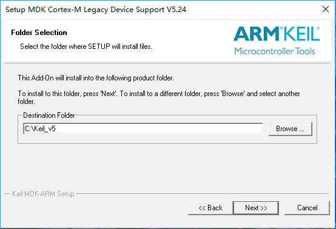

# Keil MDK Installation

Before running the RT-Thread operating system, we need to install MDK-ARM 5.24 (either official or evaluation version, version 5.14 and above), this version is also a relatively new version. This version can provide relatively complete debugging functions. Here, we are using evaluation version 5.24 of 16k compiled code limit. If you want to remove the 16k compiled code limit, please purchase the official MDK-ARM.

Firstly, download the MDK-ARM evaluation version from the official website of www.keil.com:
[http://www.keil.com/download/](http://www.keil.com/download/)

When downloading, you need to fill in some basic information, please fill in the corresponding complete information, and then start downloading. After it is downloaded, double-click the mouse to start the installation, you will see the software installation as shown:

This is the MDK-ARM installation instructions, click “Next>>” to enter the next step, as shown.

Click "√"  in the box next to "I agree to all the terms of the preceding License Agreement" and click "Next >>" to proceed to the next step of installation, as shown:

Click "Browse..." to select the installation directory of MDK-ARM or directly input installation path in the "Destination Folder" box. Here, we default to "C:/Keil_v5", then click "Next>>" to proceed to the next step of installation, as shown:

Input your name after "First Name", input your last name after "Last Name", input your company name after "Company Name", input your email address after "E-mail", and then click "Next>> " for the installation. Wait for a while for the installation to finish and you will see the following:

The default selection does not need to be changed, just click “Next” to enter the next step as shown.

Here, you can click "Finish" to complete the installation of the entire MDK-ARM software.

With a useful took like MDK-ARM, you can start the RT-Thread operating system easily and explore real-time operating systems.

>Note: There is a charge for Official version of MDK-ARM. If you want to be able to compile larger binaries, please purchase the official version of MDK-ARM. RT-Thread operating system also supports GNU GCC compiler by Free Software Foundation which is an open source compiler. For more information on how to use GNU related tools, please refer to the related documentation on RT-Thread website.
