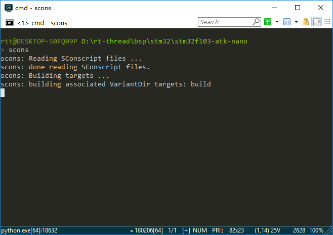
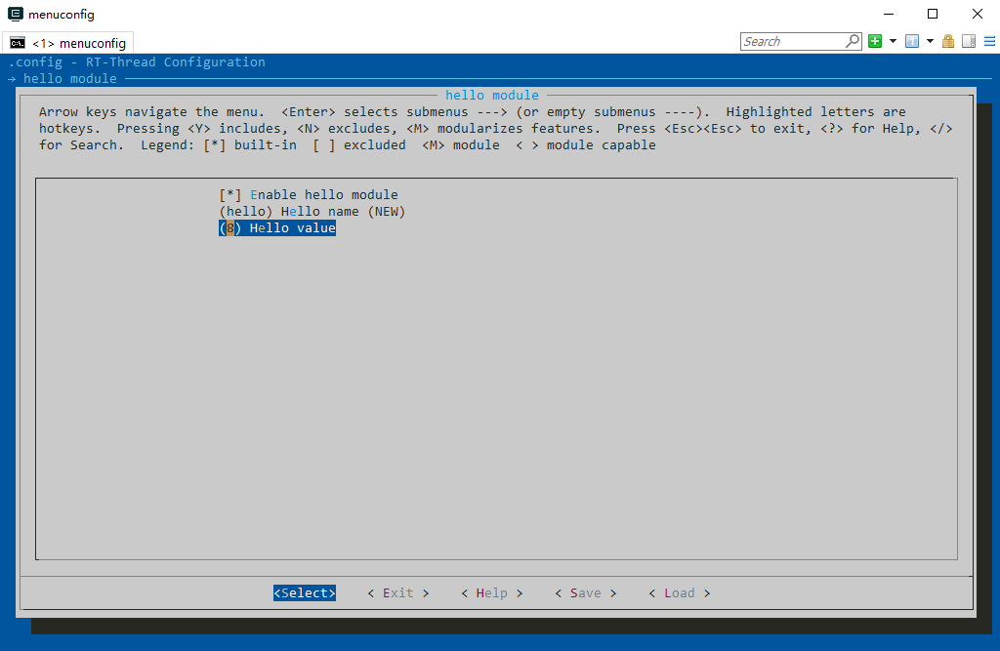

# SCons

## Introduction to SCons

SCons is an open source build system written in the Python language, similar to GNU Make. It uses a different approach than the usual Makefile, but instead uses SConstruct and SConscript files instead. These files are also Python scripts that can be written using standard Python syntax, so the Python standard library can be called in SConstruct, SConscript files for a variety of complex processing, not limited to the rules set by the Makefile.

A detailed [SCons user manual](http://www.scons.org/doc/production/HTML/scons-user/index.html) can be found on the SCons website. This section describes the basic usage of SCons and how to use the SCons tool in RT-Thread.

### What is Construction Tool

A software construction tool is a piece of software that compiles source code into an executable binary program according to certain rules or instructions. This is the most basic and important feature of building tools. In fact, these are not the only functions of construction tools. Usually these rules have a certain syntax and are organized into files. These files are used to control the behavior of the build tool, and you can do other things besides software building.

The most popular build tool today is GNU Make. Many well-known open source software, such as the Linux kernel, are built using Make. Make detects the organization and dependencies of the file by reading the Makefile and completes the commands specified in the Makefile.

Due to historical reasons, the syntax of the Makefile is confusing, which is not conducive to beginners. In addition, it is not convenient to use Make on the Windows platform, you need to install the Cygwin environment. To overcome the shortcomings of Make, other build tools have been developed, such as CMake and SCons.

### RT-Thread Construciton Tool

RT-Thread was built using Make/Makefile in the earlier stage. Starting from 0.3.x, the RT-Thread development team gradually introduced the SCons build system. The only goal of introducing SCons is to get everyone out of the complex Makefile configuration, IDE configuration, and focus on RT-Thread function development.

Some may doubt the difference between the build tools described here and the IDE. The IDE completes the build through the operation of the graphical interface. Most IDEs generate script files like Makefile or SConscript based on the source code added by the user, and call the tools like Make or SCons to build the source code.

### Install SCons

It needs to be installed on the PC host before using the SCons system because it is written in the Python language, so you need to install the Python runtime environment before using SCons.

The Env configuration tool provided by RT-Thread comes with SCons and Python, so using SCons on Windows platforms does not require the installation of these two software.

In Linux and BSD environments, Python should already be installed by default, which is also the Python environment of the 2.x version. At this time, you only need to install SCons. For example, in Ubuntu you can install SCons with the following command:

`sudo apt-get install scons`

## Basic Functions of SCons

The RT-Thread build system supports multiple compilers, including ARM GCC, MDK, IAR, VisualStudio, and Visual DSP. The mainstream ARM Cortex M0, M3, M4 platforms, basically all support ARM GCC, MDK, IAR. Some BSPs may only support one compiler, and readers can read the currently supported compiler by reading the CROSS_TOOL option in rtconfig.py under the BSP directory.

If it is a chip on the ARM platform, you can use the Env tool and enter the scons command to compile the BSP directly. At this time, the ARM GCC compiler is used by default because the Env tool comes with the ARM GCC compiler. Compile a BSP using the scons command as shown below, and the SCons will be based on this BSP.



If the user wants to use another compiler that the BSP already supports to compile the project, or if the BSP is a non-ARM platform chip, then you can't compile the project directly with the scons command. You need to install the corresponding compiler yourself and specify the compiler path to use. Before compiling the project, you can use the following two commands in the Env command line interface to specify the compiler path for the MDK and the compiler path to MDK.

```c
set RTT_CC=keil
set RTT_EXEC_PATH=C:/Keilv5
```

### Commonly Used SCons Commands

This section describes the SCons commands that are commonly used in RT-Thread. SCons not only completes basic compilation, but also generates MDK/IAR/VS projects.

#### scons

Go to the BSP project directory to be compiled in the Env command line window, and then use this command to compile the project directly. If some source files are modified after executing the  `scons` command, and the scons command is executed again, SCons will incrementally compile and compile only the modified source files and link them.


`scons` can also be followed by a `-s` parameter, the command `scons -s`,  which differs from the `scons` command in that it does not print specific internal commands.

#### scons -c

Clear the compilation target. This command clears the temporary and target files generated when `scons` is executed.

#### scons --target=XXX

If you use mdk/iar for project development, when you open or close some components, you need to use one of the following commands to regenerate the corresponding customized project, then compile and download in mdk/iar.

```c
scons --target=iar
scons --target=mdk4
scons --target=mdk5
```

In the Env command line window, enter the BSP project directory to be compiled. After using the `scons --target=mdk5` command, a new MDK project file named project.uvprojx will be generated in the BSP directory. Double-click it to open and you can use MDK to compile and debug. Using the `scons --target=iar` command will generate a new IAR project file named project.eww. Users who are not used to SCons can use this method. If project.uvproj fails to open, please delete project.uvopt and rebuild the project.

Under `bsp/simulator` directory , you can use the following command to generate a project for vs2012 or a project for vs2005.

```c
scons --target=vs2012
Scons --target=vs2005
```

If you provide template files for other IDE projects in the BSP directory, you can also use this command to generate corresponding new projects, such as ua, vs, cb, cdk.

This command can also be followed by a `-s` parameter, such as the command  `scons –target=mdk5 -s`, which does not print specific internal commands when executing this command.

> To generate a MDK or IAR project file, the prerequisite is that there is a project template file in the BSP directory, and then the scons will add relevant source code, header file search path, compilation parameters, link parameters, etc. according to the template file. As for which chip this project is for, it is directly specified by this engineering template file. So in most cases, this template file is an empty project file that is used to assist SCons in generating project.uvprojx or project.eww.

#### scons -jN

Multi-threaded compilation target, you can use this command to speed up compilation on multi-core computers. In general, a cpu core can support 2 threads. Use the `scons -j4`  command on a dual-core machine.

> If you just want to look at compilation errors or warnings, it's best not to use the -j parameter so that the error message won't be mixed with multiple files in parallel.

#### scons --dist

Build a project framework. Using this command will generate the `dist` directory in the BSP directory, this is the directory structure of the development project, including RT-Thread source code and BSP related projects, irrelevant BSP folder and libcpu will be removed, and you can freely copy this work to any directory.

#### scons --verbose

By default, output compiled with the scons command does not display compilation parameters as follows:

```c
D:\repository\rt-thread\bsp\stm32f10x>scons
scons: Reading SConscript files ...
scons: done reading SConscript files.
scons: Building targets ...
scons: building associated VariantDir targets: build
CC build\applications\application.o
CC build\applications\startup.o
CC build\components\drivers\serial\serial.o
...
```

The effect of using the scons –verbose command is as follows:

```c
armcc -o build\src\mempool.o -c --device DARMSTM --apcs=interwork -ID:/Keil/ARM/
RV31/INC -g -O0 -DUSE_STDPERIPH_DRIVER -DSTM32F10X_HD -Iapplications -IF:\Projec
t\git\rt-thread\applications -I. -IF:\Project\git\rt-thread -Idrivers -IF:\Proje
ct\git\rt-thread\drivers -ILibraries\STM32F10x_StdPeriph_Driver\inc -IF:\Project
\git\rt-thread\Libraries\STM32F10x_StdPeriph_Driver\inc -ILibraries\STM32_USB-FS
-Device_Driver\inc -IF:\Project\git\rt-thread\Libraries\STM32_USB-FS-Device_Driv
er\inc -ILibraries\CMSIS\CM3\DeviceSupport\ST\STM32F10x -IF:\Project\git\rt-thre
...
```

## SCons Advanced

SCons uses SConscript and SConstruct files to organize the source structure. Usually a project has only one SConstruct, but there will be multiple SConscripts. In general, an SConscript will be placed in each subdirectory where the source code is stored.

In order to make RT-Thread better support multiple compilers and to easily adjust compilation parameters, RT-Thread creates a separate file for each BSP called `rtconfig.py`. So the following three files exist in every RT-Thread BSP directory: `rtconfig.py`, `SConstruct`, and `SConscript`, which control the compilation of the BSP. There is only one SConstruct file in a BSP, but there are multiple SConscript files. It can be said that the SConscript file is the main force of the organization source code.

RT-Thread SConscript files are also present in most source folders. These files are "found" by the SConscript file in the BSP directory to add the source code corresponding to the macro defined in rtconfig.h to the compiler. The following article will take stm32f10x-HAL BSP as an example to explain how SCons builds the project.

### SCons Build-In Functions

If you want to add some of your own source code to the SCons build environment, you can usually create or modify an existing SConscript file. The SConscript file can control the addition of source files and can specify the group of files (similar to the concept of Groups in IDEs such as MDK/IAR).

SCons provides a lot of built-in functions to help us quickly add source code, and with these simple Python statements we can add or remove source code to our project. The following is a brief introduction to some common functions.

#### GetCurrentDir()

Get current directory.

####  Glob('\*.c')

Get all C files in the current directory. Modify the value of the parameter to match the suffix to match all files of the current directory.

#### GetDepend(macro)

This function is defined in the script file in the `tools` directory. It reads the configuration information from the rtconfig.h file with the macro name in rtconfig.h. This method (function) returns true if rtconfig.h has a macro turned on, otherwise it returns false.

#### Split(str)

Split the string str into a list list.

#### DefineGroup(name， src， depend，**parameters)

This is a method (function) of RT-Thread based on the SCons extension. DefineGroup is used to define a component. A component can be a directory (under a file or subdirectory) and a Group or folder in some subsequent IDE project files.

Parameter description of `DefineGroup() ` :

|**Parameter**|**D**escription                 |
|-------|------------------------------------|
| name       | name of Group      |
| src        | The files contained in the Group generally refer to C/C++ source files. For convenience, you can also use the Glob function to list the matching files in the directory where the SConscript file is located by using a wildcard. |
| depend     | The options that the Group depends on when compiling (for example, the FinSH component depends on the RT_USING_FINSH macro definition). The compile option generally refers to the RT_USING_xxx macro defined in rtconfig.h. When the corresponding macro is defined in the rtconfig.h configuration file, then this group will be added to the build environment for compilation. If the dependent macro is not defined in rtconfig.h, then this Group will not be added to compile. Similarly, when using scons to generate as an IDE project file, if the dependent macros are not defined, the corresponding Group will not appear in the project file. |
| parameters | Configure other parameters, the values can be found in the table below. You do not need to configure all parameters in actual use. |

parameters that could be added：

|**P**arameter|**Description**                                      |
|------------|--------------------------------------------------|
| CCFLAGS    | source file compilation parameters |
| CPPPATH    | head file path                          |
| CPPDEFINES | Link parameter                    |
| LIBRARY    | Include this parameter, the object file generated by the component will be packaged into a library file |

#### SConscript(dirs，variant_dir，duplicate)

Read the new SConscript file, and the parameter description of the SConscript() function is as follows:

|**Parameter** |**Description**                           |
|-------------|---------------------------------------|
| dirs        | SConscript file path |
| variant_dir | Specify the path to store the generated target file |
| duiplicate  | Set whether to copy or link the source file to variant_dir |

## SConscript Examples

Below we will use a few SConscript as an example to explain how to use the scons tool.

### SConscript Example 1

Let's start with the SConcript file in the stm32f10x-HAL BSP directory. This file manages all the other SConscript files under the BSP, as shown below.

```c
import os
cwd = str(Dir('#'))
objs = []
list = os.listdir(cwd)
for d in list:
    path = os.path.join(cwd， d)
       if os.path.isfile(os.path.join(path， 'SConscript')):
        objs = objs + SConscript(os.path.join(d， 'SConscript'))
Return('objs')
```

* `import os:` Importing the Python system programming os module, you can call the functions provided by the os module to process files and directories.

* `cwd = str(Dir('#'))：` Get the top-level directory of the project and assign it to the string variable cwd, which is the directory where the project's SConstruct is located, where it has the same effect as  `cwd = GetCurrentDir()` .

* `objs = []:` An empty list variable objs is defined.

* `list = os.listdir(cwd)：` Get all the subdirectories under the current directory and save them to the variable list.

* This is followed by a python for loop that walks through all the subdirectories of the BSP and runs the SConscript files for those subdirectories. The specific operation is to take a subdirectory of the current directory, use  `os.path.join(cwd，d)` to splicing into a complete path, and then determine whether there is a file named SConscript in this subdirectory. If it exists, execute `objs = objs + SConscript(os.path.join(d，'SConscript'))` . This sentence uses a built-in function `SConscript()` provided by SCons, which can read in a new SConscript file and add the source code specified in the SConscript file to the source compilation list objs.

With this SConscript file, the source code required by the BSP project is added to the compilation list.

### SConscript Example 2

So what about stm32f10x-HAL BSP other SConcript files? Let's take a look at the SConcript file in the drivers directory, which will manage the source code under the drivers directory. The drivers directory is used to store the underlying driver code implemented by the driver framework provided by RT-Thread.

```c
Import('rtconfig')
from building import *

cwd = GetCurrentDir()

# add the general drivers.
src = Split("""
board.c
stm32f1xx_it.c
""")

if GetDepend(['RT_USING_PIN']):
    src += ['drv_gpio.c']
if GetDepend(['RT_USING_SERIAL']):
    src += ['drv_usart.c']
if GetDepend(['RT_USING_SPI']):
    src += ['drv_spi.c']
if GetDepend(['RT_USING_USB_DEVICE']):
    src += ['drv_usb.c']
if GetDepend(['RT_USING_SDCARD']):
    src += ['drv_sdcard.c']

if rtconfig.CROSS_TOOL == 'gcc':
    src += ['gcc_startup.s']

CPPPATH = [cwd]

group = DefineGroup('Drivers', src, depend = [''], CPPPATH = CPPPATH)

Return('group')

```

* `Import('rtconfig')：` Import the rtconfig object, and the rtconfig.CROSS_TOOL used later is defined in this rtconfig module.

* `from building import *：` All the contents of the building module are imported into the current module, and the DefineGroup used later is defined in this module.

* `cwd = GetCurrentDir()：` Get the current path and save it to the string variable cwd.

The next line uses the `Split()`  function to split a file string into a list, the effect of which is equivalent to

`src = ['board.c'，'stm32f1xx_it.c']`

Later, `if` judgement and `GetDepend ()` are used to check whether a macro in `rtconfig.h` is open or not, and if so,  `src += [src_name]`  is used to append the source code file to the list variable src.

* `CPPPATH = [cwd]:`  Save the current path to a list variable CPPPATH.

The last line uses DefineGroup to create a group called Drivers, which corresponds to the grouping in the MDK or IAR. The source code file for this group is the file specified by src, and the dependency is empty to indicate that the group does not depend on any macros of rtconfig.h.

`CPPPATH =CPPPATH` means to add the current path to the system's header file path. The CPPPATH on the left is a built-in parameter in the DefineGroup that represents the header file path. The CPPPATH on the right is defined in the previous line of this document. This way we can reference the header files in the drivers directory in other source code.

### SConscript Example 3

Let's take a look at the SConcript file in the applications directory, which will manage the source code under the applications directory for the user's own application code.

```c
from building import *

cwd = GetCurrentDir()
src = Glob('*.c')
CPPPATH = [cwd, str(Dir('#'))]

group = DefineGroup('Applications', src, depend = [''], CPPPATH = CPPPATH)

Return('group')
```

`src = Glob('*.c')：` Get all the C files in the current directory.

`CPPPATH = [cwd, str(Dir('#'))]：` Save the current path and the path of the project's SConstruct to the list variable CPPPATH.

The last line uses DefineGroup to create a group called `Applications`. The source code file for this group is the file specified by src. If the dependency is empty, the group does not depend on any rtconfig.h macros, and the path saved by CPPPATH is added to the system header search path. Such application directories and header files in the stm32f10x-HAL BSP directory can be referenced elsewhere in the source code.

To sum up, this source program will add all c programs in the current directory to the group `Applications`, so if you add or delete files in this directory, you can add files to the project or delete them from the project. It is suitable for adding source files in batches.

### SConscript Example 4

Below is the contents of the RT-Thread source code `component/finsh/SConscript` file, which will manage the source code under the finsh directory.

```c
Import('rtconfig')
from building import *

cwd     = GetCurrentDir()
src     = Split('''
shell.c
symbol.c
cmd.c
''')

fsh_src = Split('''
finsh_compiler.c
finsh_error.c
finsh_heap.c
finsh_init.c
finsh_node.c
finsh_ops.c
finsh_parser.c
finsh_var.c
finsh_vm.c
finsh_token.c
''')

msh_src = Split('''
msh.c
msh_cmd.c
msh_file.c
''')

CPPPATH = [cwd]
if rtconfig.CROSS_TOOL == 'keil':
    LINKFLAGS = '--keep *.o(FSymTab)'

    if not GetDepend('FINSH_USING_MSH_ONLY'):
        LINKFLAGS = LINKFLAGS + '--keep *.o(VSymTab)'
else:
    LINKFLAGS = ''

if GetDepend('FINSH_USING_MSH'):
    src = src + msh_src
if not GetDepend('FINSH_USING_MSH_ONLY'):
    src = src + fsh_src

group = DefineGroup('finsh', src, depend = ['RT_USING_FINSH'], CPPPATH = CPPPATH, LINKFLAGS = LINKFLAGS)

Return('group')
```

Let's take a look at the contents of the first Python conditional statement in the file. If the compilation tool is keil, the variable `LINKFLAGS = '--keep *.o(FSymTab)'`  left blank.

DefinGroup also creates the file specified by src in the finsh directory as a finsh group. `depend = ['RT_USING_FINSH']` indicates that this group depends on the macro RT_USING_FINSH in `rtconfig.h`. When the macro RT_USING_FINSH is opened in rtconfig.h, the source code in the finsh group will be compiled, otherwise SCons will not compile.

Then add the finsh directory to the system header directory so that we can reference the header files in the finsh directory in other source code.

`LINKFLAGS = LINKFLAGS` has the same meaning as `CPPPATH = CPPPATH` . The LINKFLAGS on the left represents the link parameter, and the LINKFLAGS on the right is the value defined by the previous if else statement. That is, specify the link parameters for the project.

## Manage Projects with SCons

The previous section on the SConscript related to the RT-Thread source code is explained in detail, you should also know some common ways to write SConscript files, this section will guide you how to use SCons to manage your own projects.

### Add App Code

As mentioned earlier, the Applications folder under BSP is used to store the user's own application code. Currently there is only one main.c file. If the user's application code is not a lot, it is recommended that the relevant source files be placed under this folder. Two simple files hello.c and hello.h have been added under the Applications folder, as shown below.

```c
/* file: hello.h */

#ifndef _HELLO_H_
#define _HELLO_H_

int hello_world(void);

#endif /* _HELLO_H_ */

/* file: hello.c */
#include <stdio.h>
#include <finsh.h>
#include <rtthread.h>

int hello_world(void)
{
    rt_kprintf("Hello, world!\n");

    return 0;
}

MSH_CMD_EXPORT(hello_world, Hello world!)
```

The SConcript file in the applications directory will add all source files in the current directory to the project. You need to use the `scons --target=xxx` command to add the 2 new files to your project. Note that the project will be regenerated each time a new file is added.

### Add Module

As mentioned above, in the case that there are not many source code files, it is recommended that all source code files be placed in the applications folder. If the user has a lot of source code and wants to create your own project module, or need to use other modules that you have obtained, what would be appropriate?

Take also hello.c and hello.h mentioned above for example, these two files will be managed in a separate folder, and have their own grouping in the MDK project file, and can be selected through menuconfig whether to use This module. Add a hello folder under BSP.


Noticed that there is an additional SConscript file in the folder. If you want to add some of your own source code to the SCons build environment, you can usually create or modify an existing SConscript file. Refer to the above analysis of the SConscript file for the RT-Thread source code. The contents of this new hello module SConscript file are as follows:

```c
from building import *

cwd          = GetCurrentDir()
include_path = [cwd]
src          = []

if GetDepend(['RT_USING_HELLO']):
    src += ['hello.c']

group = DefineGroup('hello', src, depend = [''], CPPPATH = include_path)

Return('group')
```

Through the above simple lines of code, a new group hello is created, and the source file to be added to the group can be controlled by the macro definition, and the directory where the group is located is added to the system header file path. So how is the custom macro RT_USING_HELLO defined? Here is a new file called Kconfig. Kconfig is used to configure the kernel, and the configuration interface generated by the menuconfig command used when configuring the system with Env relies on the Kconfig file. The menuconfig command generates a configuration interface for the user to configure the kernel by reading the various Kconfig files of the project. Finally, all configuration-related macro definitions are automatically saved to the rtconfig.h file in the BSP directory. Each BSP has an rtconfig.h file. That is the configuration information of this BSP.

There is already a Kconfig file for this BSP in the stm32f10x-HAL BSP directory, and we can add the configuration options we need based on this file. The following configuration options have been added to the hello module. The # sign is followed by a comment.

```shell
menu "hello module"                            # create a "hello module" menu

    config RT_USING_HELLO                      # RT_USING_HELLO configuration options
        bool "Enable hello module"             # RT_USING_HELLO is a bool variable and display as "Enable hello module"
        default y                              # RT_USING_HELLO can take values y and n, default y
        help                                   # If use help, it would display "this hello module only used for test"
        this hello module only used for test

    config RT_HELLO_NAME                       # RT_HELLO_NAME configuration options
        string "hello name"                    # RT_HELLO_NAME is a string variable and the menu show as "hello name"
        default "hello"                        # default name is "hello"

    config RT_HELLO_VALUE                      # RT_HELLO_VALUE configuration options
        int "hello value"                      # RT_HELLO_VALUE is an int variable and the menu show as "hello value"
        default 8                              # the default value is 8

endmenu                                        # the hello menu is end

```

After entering the stm32f10x-HAL BSP directory using the Env tool, you can use the menuconfig command to see the configuration menu of the new hello module at the bottom of the main page. After entering the menu, the following figure is displayed.



You can also modify the value of the hello value.


After saving the configuration, exit the configuration interface and open the rtconfig.h file in the stm32f10x-HAL BSP directory. You can see that the configuration information of the hello module is available.


**Note: Use the scons --target=XXX command to generate a new project each time menuconfig is configured.**

Because the RT_USING_HELLO macro has been defined in rtconfig.h, the source file for hello.c is added to the new project when the project is newly built.

The above simply enumerates the configuration options for adding your own modules to the Kconfig file. Users can also refer to [*User Manual of Env*](../env/env.md), which also explains how to modify and add configuration options. They can also view the Kconfig documentation in your own Baidu to implement other more complex configuration options.

### Add Library

If you want to add an extra library to your project, you need to pay attention to the naming of the binary library by different toolchains. For example, the GCC toolchain, which recognizes library names such as `libabc.a`, specifies `abc` instead of `libabc` when specifying a library. So you need to pay special attention to the SConscript file when linking additional libraries. In addition, when specifying additional libraries, it is also a good idea to specify the corresponding library search path. Here is an example:

```c
Import('rtconfig')
from building import *

cwd = GetCurrentDir()
src = Split('''
''')

LIBPATH = [cwd + '/libs']
LIBS = ['abc']

group = DefineGroup('ABC'， src， depend = ['']， LIBS = LIBS， LIBPATH=LIBPATH)
```

LIBPATH specifies the path to the library, and LIBS specifies the name of the library. If the toolchain is GCC, the name of the library should be libabc.a; if the toolchain is armcc, the name of the library should be abc.lib.`LIBPATH = [cwd + '/libs']` indicates that the search path for the library is the 'libs' directory in the current directory.

### Compiler Options

`rtconfig.py` is a RT-Thread standard compiler configuration file that controls most of the compilation options. It is a script file written in Python and is used to do the following:

* Specify the compiler (choose one of the multiple compilers you support).
- Specify compiler parameters such as compile options, link options, and more.

When we compile the project using the scons command, the project is compiled according to the compiler configuration options of `rtconfig.py`. The following code is part of the rtconfig.py code in the stm32f10x-HAL BSP directory.

```c
import os

# toolchains options
ARCH='arm'
CPU='cortex-m3'
CROSS_TOOL='gcc'

if os.getenv('RTT_CC'):
    CROSS_TOOL = os.getenv('RTT_CC')

# cross_tool provides the cross compiler
# EXEC_PATH is the compiler execute path, for example, CodeSourcery, Keil MDK, IAR

if  CROSS_TOOL == 'gcc':
    PLATFORM    = 'gcc'
    EXEC_PATH   = '/usr/local/gcc-arm-none-eabi-5_4-2016q3/bin/'
elif CROSS_TOOL == 'keil':
    PLATFORM    = 'armcc'
    EXEC_PATH   = 'C:/Keilv5'
elif CROSS_TOOL == 'iar':
    PLATFORM    = 'iar'
    EXEC_PATH   = 'C:/Program Files/IAR Systems/Embedded Workbench 6.0 Evaluation'

if os.getenv('RTT_EXEC_PATH'):
    EXEC_PATH = os.getenv('RTT_EXEC_PATH')

BUILD = 'debug'

if PLATFORM == 'gcc':
    # toolchains
    PREFIX = 'arm-none-eabi-'
    CC = PREFIX + 'gcc'
    AS = PREFIX + 'gcc'
    AR = PREFIX + 'ar'
    LINK = PREFIX + 'gcc'
    TARGET_EXT = 'elf'
    SIZE = PREFIX + 'size'
    OBJDUMP = PREFIX + 'objdump'
    OBJCPY = PREFIX + 'objcopy'

    DEVICE = '-mcpu=cortex-m3 -mthumb -ffunction-sections -fdata-sections'
    CFLAGS = DEVICE
    AFLAGS = '-c' + DEVICE + '-x assembler-with-cpp'
    LFLAGS = DEVICE + '-Wl,--gc-sections,-Map=rtthread-stm32.map,-cref,-u,Reset_Handler -T stm32_rom.ld'
```

Where CFLAGS is the compile option for C files, AFLAGS is the compile option for assembly files, and LFLAGS is the link option. The BUILD variable controls the level of code optimization. The default BUILD variable takes the value 'debug', which is compiled using debug mode, with an optimization level of 0. If you modify this variable to something else, it will compile with optimization level 2. The following are all possible ways to write (in short, no 'debug').

```shell
BUILD = ''
BUILD = 'release'
BUILD = 'hello， world'
```

It is recommended to use the debug mode to compile during the development phase, without optimization, and then consider optimization after the product is stable.

The specific meaning of these options needs to refer to the compiler manual, such as `armcc` used above is the underlying compiler of MDK. The meaning of its compile options is detailed in MDK help.

As mentioned earlier, if the user wants to compile the project with another compiler when executing the scons command, you can use the relevant commands to specify the compiler and compiler paths on the command line side of Env. However, this modification is only valid for the current Env process. When you open it again, you need to re-use the command settings. We can directly modify the `rtconfig.py` file to achieve the purpose of permanently configuring the compiler. In general, we only need to modify the CROSS_TOOL and EXEC_PATH options below.

* CROSS_TOOL：Specify the compiler. The optional values are keil, gcc, iar. Browse `rtconfig.py` to see the compilers supported by the current BSP. If MDK is installed on your machine, you can modify CROSS_TOOL to keil and use MDK to compile the project.

* EXEC_PATH: The installation path of the compiler. There are two points to note here：

(1) When installing the compiler (such as MDK, GNU GCC, IAR, etc.), do not install it in a path with Chinese or spaces. Otherwise, some errors will occur when parsing the path. Some programs are installed by default into the  `C:\Program Files` directory with spaces in between. It is recommended to choose other paths during installation to develop good development habits.

(2) When modifying EXEC_PATH, you need to pay attention to the format of the path. On Windows platforms, the default path splitter is the backslash  `“\”`, which is used for escape characters in both C and Python. So when modifying the path, you can change `“\”` to `“/”`or add r (python-specific syntax for raw data).

Suppose a compiler is installed under `D:\Dir1\Dir2`. The following are the correct ways to write:

* EXEC_PATH = `r'D:\Dir1\Dir2'`  Note that with the string `r` in front of the string, `“\”`can be used normally.

* EXEC_PATH = `'D:/Dir1/Dir2'`   Note that instead of `“/”`, there is no `r` in front.

* EXEC_PATH = `'D:\\Dir1\\Dir2'` Note that the escapement of  `“\”` s used here to escape `“\”` itself.

* This is the wrong way to write: EXEC_PATH = `'D:\Dir1\Dir2'`。

If the rtconfig.py file has the following code, comment out the following code when configuring your own compiler.

```c
if os.getenv('RTT_CC'):
    CROSS_TOOL = os.getenv('RTT_CC')
... ...
if os.getenv('RTT_EXEC_PATH'):
    EXEC_PATH = os.getenv('RTT_EXEC_PATH')
```

The above 2 `if` judgments will set CROSS_TOOL and EXEC_PATH to the default value of Env.

After the compiler is configured, we can use SCons to compile the BSP of RT-Thread. Open a command line window in the BSP directory and execute the  `scons` command to start the compilation process.

### RT-Thread Auxiliary Compilation Script

In the tools directory of the RT-Thread source code, there are some auxiliary compiled scripts defined by RT-Thread, such as the project files for automatically generating RT-Thread for some IDE. The most important of these is the building.py script.

### SCons Further Usage

For a complex, large-scale system, it is obviously more than just a few files in a directory. It is probably a combination of several folders at the first level.

In SCons, you can write SConscript script files to compile files in these relatively independent directories, and you can also use the Export and Import functions in SCons to share data between SConstruct and SConscript files (that is, an object data in Python). For more information on how to use SCons, please refer to the [SCons Official Documentation](https://scons.org/documentation.html).

