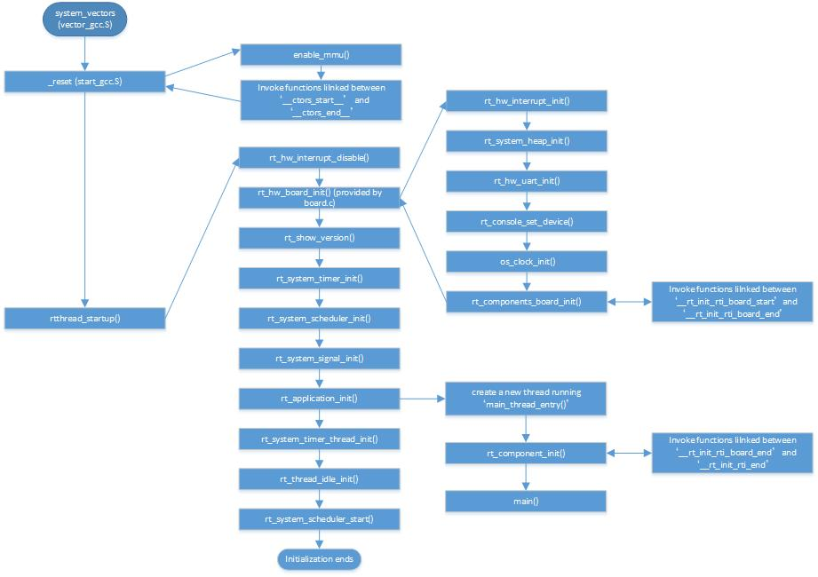

# RT-Thread在Cortex-A上的启动初始化流程
BootLoader初始化硬件并加载RT-Thread后，跳转至system_vectors（定义在libcpu/arm/cortex-a/vector_gcc.S中）位置执行，此处立即跳转至复位中断处理函数_reset（定义在libcpu/arm/cortex-a/start_gcc.S）。复位函数使能MMU并顺序执行链接至__ctors_start__和__ctors_end__之间的初始化函数地址。此后，CPU跳转至函数rtthread_startup（定义在src/components.c）执行。

函数rtthread_startup是RT-Thead的正式入口函数，它依次禁止中断，初始化板卡硬件，初始化系统定时器、调度器、信号处理机制、用户线程、定时器处理线程，创建idle线程并开始系统调度，随后该函数结束执行。

初始化流程图如下图所示。

 
上述大部分初始化操作由RT-Thread实现，部分须由BSP及libcpu中的底层驱动实现。在初始化过程中中，有两个函数需要特别说明，分别是板卡初始化函数rt_hw_board_init（定义在<bsp_direcotry>/drivers/board.c）和用户线程创建函数rt_application_init（定义在src/components.c中）。
## rt_hw_board_init
函数rt_hw_board_init由BSP提供，完成系统关键硬件的初始化。这些硬件是系统正常运行所需的基本部件，包括但不限制于中断、串口以及时钟。最后调用函数rt_components_board_init，它依次调用位于地址空间__rt_init_rti_board_start和__rt_init_rti_board_end之间的函数指针，完成剩余部分初始化。
## rt_application_init
函数rt_application_init由RT-Thread提供，该函数创建main线程，线程入口函数为main_thread_entry。该线程入口函数调用函数rt_component_init初始化系统组件，最后调用用户程序入口函数main。
函数rt_component_init依次调用位于地址空间__rt_init_rti_board_start和__rt_init_rti_board_end之间的函数指针，这些函数须由宏INIT_BOARD_EXPORT、INIT_PREV_EXPORT、INIT_DEVICE_EXPORT、INIT_COMPONENT_EXPORT、INIT_ENV_EXPORT或INIT_APP_EXPORT进行声明。

