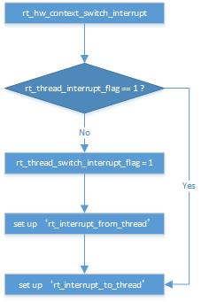

# RT-Thread在Cortex-A上任务切换流程
RT-Thread进行任务切换时分为三种情况进行处理，分别为切换后不返回、用户上下文线程切换和中断上下文线程切换。它们各自的处理函数分别为rt_hw_context_switch_to、rt_hw_context_switch和rt_hw_context_switch_interrupt。切换时将换出线程的上下文保存在栈中，栈顶指针sp保存在全局变量rt_interrupt_from_thread中；然后将全局变量rt_interrupt_to_thread载入到栈顶指针sp中，从栈中恢复换入线程的上下文。线程在栈中保存的上下文如下所示。
| pc |
| lr |
| r12 |
| … |
| r0 |
| cpsr |

线程切换相关的例程如下：
## rt_hw_context_switch_to
该函数将换入线程的栈顶指针载入到sp，然后恢复换入线程的上下文并执行。
## rt_hw_context_siwtch
该函数将当前线程/换出线程的上下文压入栈中，栈顶指针sp保存在线程的控制块中；然后将换入线程的栈顶指针载入到sp，从栈中恢复换入线程的上下文并执行。
## rt_hw_context_switch_interrupt
该线程切换发生在中断上下文中，为了不影响当前中断的执行，该例程将换入和换出线程的栈顶指针分别存放在全局变量rt_interrupt_from_thread和rt_interrupt_to_thread中，并设置rt_thread_switch_interrupt_flag为1；若该变量值已经设为1，说明之前已经准备好线程切换了，此时只需设置新的换入线程即可。等到中断处理完毕后再进行线程切换。流程图如下所示：

 
## rt_hw_context_switch_interrupt_do
中断处理过程中并不执行线程切换，只是通过函数rt_hw_context_switch_interrupt设置相关的全局变量。当中断处理完毕后，检查rt_thread_switch_interrupt_flag变量，若值不为1则正常返回；若值为1，则进行线程切换，实际的切换工作由中断入口函数中rt_hw_context_switch_interrupt_do部分来完成，具体操作分为以下四步：
1. 将中断中压栈的寄存器全部弹出。
2. 切换至SVC 模式。
3. 重新将线程上下文压入SVC栈，并保存栈顶指针到线程控制块。
4. 载入新线程的栈顶指针到sp，弹出线程上下文，切换至新线程执行。

