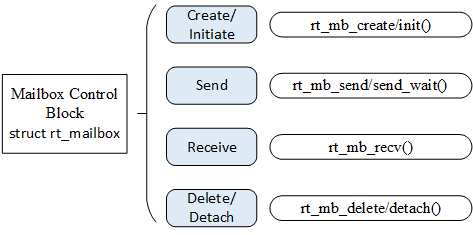
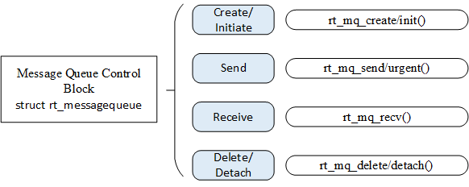
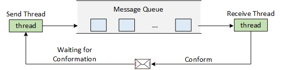
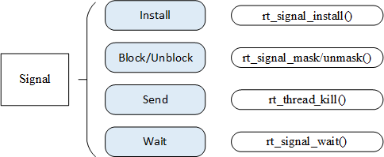

Inter-thread Communication
==========

In the last chapter, we talked about inter-thread synchronization, concepts such as semaphores, mutexes, and event sets were mentioned. Following the last chapter, this chapter is going to explain inter-thread communication. In bare-metal programming, global variables are often used for communication between functions. For example, some functions may change the value of a global variable due to some operations. Another function reads the global variable and will perform corresponding actions to achieve communication and collaboration according to the global variable values it read. More tools are available in RT-Thread to help pass information between different threads. These tools are covered in more detail in this chapter. After reading this chapter, you will learn how to use mailboxes, message queues, and signals for communication between threads.

Mailbox
----

Mailbox service is a typical inter-thread communication method in real-time operating systems.For example, there are two threads, thread 1 detects the state of the button and sends it's state, and thread 2 reads the state of the button and turns on or off the LED according to the state of the button. Here, a mailbox can be used to communicate. Thread 1 sends the status of the button as an email to the mailbox. Thread 2 reads the message in the mailbox to get the button status and turn on or off the LED accordingly.

Thread 1 here can also be extended to multiple threads. For example, there are three threads, thread 1 detects and sends the button state, thread 2 detects and sends the ADC information, and thread 3 performs different operations according to the type of information received.

### Mailbox Working Mechanism

The mailbox of the RT-Thread operating system is used for inter-thread communication, which is characterized by low overhead and high efficiency. Each message in the mailbox can only hold a fixed 4 bytes(for a 32-bit processing system, the pointer is 4 bytes in size, so an email can hold only one pointer). A typical mailbox is also called message exchange. As shown in the following figure, a thread or an interrupt service routine sends a 4-byte message to a mailbox, and one or more threads can receive and process the message from the mailbox.


The sending process of the non-blocking mode mails can be safely used in ISR. It is an effective way for the thread, the interrupt service, and the timer to send a message to the thread. In general, the receiving of the mails  can be a blocked process, depending on whether there is a message in the mailbox and the timeout set when the message was received. When there is no mail in the mailbox and the set timeout is not 0, the receive of the mails will become blocked. In such cases, the mails can only be received by threads.

When a thread sends a message to a mailbox, if the mailbox is not full, the message will be copied to the mailbox. If the mailbox is full, the thread sending the message can set a timeout, and choose to wait and suspend or return directly - RT_EFULL. If the thread sending the message chooses to suspend and wait, then when the mails in the mailbox are received and space is left open again, the thread sending the message will be awaken and will continue to send.

When a thread receives a message from a mailbox, if the mailbox is empty, the thread receiving the message can choose whether to set a timeout or wait and suspend until a new message is received to be awaken. When the set timeout is up and the mailbox still hasn't received the message, the thread that chose to wait till timeout will be awaken and return -RT_ETIMEOUT. If there are messages in the mailbox, then the thread receiving the message will copy the 4-byte message in the mailbox to the receiving cache.

### Mailbox Control Block

In RT-Thread, the mailbox control block is a data structure used by the operating system to manage mailboxes, represented by the structure `struct rt_mailbox`. Another C expression, `rt_mailbox_t`, represents the handle of the mailbox, and the implementation in C language is a pointer to the mailbox control block. See the following code for a detailed definition of the mailbox control block structure:


```c
struct rt_mailbox
{
    struct rt_ipc_object parent;

    rt_uint32_t* msg_pool;            /* the start address of the mailbox buffer */
    rt_uint16_t size;                 /* the size of the mailbox buffer     */

    rt_uint16_t entry;                 /* the number of messages in the mailbox     */
    rt_uint16_t in_offset, out_offset;    /* the entry and exit pointer of the mailbox buffer   */
    rt_list_t suspend_sender_thread;      /* send the suspend and wait queue of the thread */
};
typedef struct rt_mailbox* rt_mailbox_t;
```

The `rt_mailbox` object is derived from `rt_ipc_object` and is managed by the IPC container.

### Management of Mailbox

The mailbox control block is a structure that contains important parameters related to mailbox and it plays an important role in the function implementation of the mailbox. The relevant interfaces of the mailbox are as shown in the following figure. The operation on a mailbox includes: create/initiate a mailbox, send a mail, receive a mail, and delete/detach a mailbox.



#### Create and Delete Mailbox

To dynamically create a mailbox object, call the following function interface:

```c
rt_mailbox_t rt_mb_create (const char* name, rt_size_t size, rt_uint8_t flag);
```

When a mailbox object is created, a mailbox object is first allocated from the object manager, and then a memory space is dynamically allocated to the mailbox for storing the mail. The size of the memory is equal to the product of the message size (4 bytes) and the mailbox capacity. Then initialize the number of incoming messages and the offset of the outgoing message in the mailbox. The following table describes the input parameters and return values for this function:

Input parameters and return values of rt_mb_create()

|**Parameters**      |**Description**                                                        |
|----------------|------------------------------------------------------------------|
| name           | The name of the mailbox                                  |
| size           | Mailbox capacity                                        |
| flag           | The mailbox flag, which can take the following values: RT_IPC_FLAG_FIFO or RT_IPC_FLAG_PRIO |
|**Return**      | ——                                                               |
| RT_NULL        | Creation failed                                          |
| The handle of the mailbox object | Creation successful                                      |

When a mailbox created with rt_mb_create() is no longer used, it should be deleted to release the corresponding system resources. Once the operation is completed, the mailbox will be permanently deleted. The function interface for deleting a mailbox is as follows:

```c
rt_err_t rt_mb_delete (rt_mailbox_t mb);
```

When deleting a mailbox, if a thread is suspended on the mailbox object, the kernel first wakes up all threads suspended on the mailbox (the thread return value is -RT_ERROR), then releases the memory used by the mailbox, and finally deletes the mailbox object. The following table describes the input parameters and return values for this function:

Input parameters and return values of rt_mb_delete()

|**Parameters**|**Description**      |
|----------|----------------|
| mb       | The handle of the mailbox object |
|**Return**| ——             |
| RT_EOK   | Successful |

#### Initialize and Detach Mailbox

Initializing a mailbox is similar to creating a mailbox, except that the mailbox initialized is for static mailbox objects. Different from creating a mailbox, the memory of a static mailbox object is allocated by the compiler during system compilation which is usually placed in a read-write data segment or an uninitialized data segment. The rest of the initialization is the same as the creation of a mailbox. The function interface is as follows:

```c
  rt_err_t rt_mb_init(rt_mailbox_t mb,
                    const char* name,
                    void* msgpool,
                    rt_size_t size,
                    rt_uint8_t flag)
```

When the mailbox is initialized, the function interface needs to obtain the mailbox object control block that the user has applied for, the pointer of the buffer, the mailbox name and mailbox capacity (the number of messages that can be stored). The following table describes the input parameters and return values for this function:

Input parameters and return values of rt_mb_init()

|**Parameters**|**Description**                                                       |
|----------|-----------------------------------------------------------------|
| mb       | The handle of the mailbox object                  |
| name     | Mailbox name                                            |
| msgpool  | Buffer pointer                                        |
| size     | Mailbox capacity                                        |
| flag     | The mailbox flag, which can take the following values: RT_IPC_FLAG_FIFO or RT_IPC_FLAG_PRIO |
|**Return**| ——                                                              |
| RT_EOK   | Successful                                                    |

The size parameter here specifies the capacity of the mailbox, if the number of bytes in the buffer pointed to by msgpool is N, then the mailbox capacity should be N/4.

Detaching the mailbox means to detach the statically initialized mailbox objects from the kernel object manager. Use the following interface to detach the mailbox:

```c
rt_err_t rt_mb_detach(rt_mailbox_t mb);
```

After using this function interface, the kernel wakes up all the threads suspended on the mailbox (the threads return -RT_ERROR), and then detaches the mailbox objects from the kernel object manager. The following table describes the input parameters and return values for this function:

Input parameters and return values for rt_mb_detach()

|**Parameters**|**Description**      |
|----------|----------------|
| mb       | The handle of the mailbox object |
|**Return**| ——             |
| RT_EOK   | Successful |

#### Send Mail

The thread or ISR can send mail to other threads through the mailbox. The function interface of sending mails is as follows:

```c
rt_err_t rt_mb_send (rt_mailbox_t mb, rt_uint32_t value);
```

The message sent can be any data 32-bit formatted, an integer value or a pointer pointing to the buffer. When the mailbox is fully filled with mails, the thread or ISR that sent the mail will receive a return value of -RT_EFULL. The following table describes the input parameters and return values for this function:

Input parameters and return values of rt_mb_send()

|**Parameters**  |**Description**      |
|------------|----------------|
| mb         | The handle of the mailbox object |
| value      | Content of email |
|**Return**  | ——             |
| RT_EOK     | Sent successfully |
| \-RT_EFULL | The mailbox is filled |

#### Send Mails with Waiting

Users can also send mails to specified mailbox through the following function interface:

```c
rt_err_t rt_mb_send_wait (rt_mailbox_t mb,
                      rt_uint32_t value,
                      rt_int32_t timeout);
```

The difference between rt_mb_send_wait() and rt_mb_send() is that there is waiting time. If the mailbox is full, the thread sending the message will wait for the mailbox to release space as mails are received according to the set timeout parameter. If by the set timeout, there is still no available space, then the thread sending the message will wake up and return an error code. The following table describes the input parameters and return values for this function:

Input parameters and return values of rt_mb_send_wait()

|**Parameters**     |**Description**      |
|---------------|----------------|
| mb            | The handle of the mailbox object |
| value         | Mail content |
| timeout       | Timeout    |
|**Return**     | ——             |
| RT_EOK        | Sent successfully |
| \-RT_ETIMEOUT | Timeout |
| \-RT_ERROR    | Failed, return error |

#### Receive Mails

Only when there is a mail in the mailbox, the recipient can receive the mail immediately and return  RT_EOK. Otherwise, the thread receiving the message will suspend on the waiting thread queue of the mailbox or return directly according to the set timeout. The receiving mail function interface is as follows:

```c
rt_err_t rt_mb_recv (rt_mailbox_t mb, rt_uint32_t* value, rt_int32_t timeout);
```

When receiving a mail, the recipient needs to specify the mailbox handle, and specify the location to store the received message and the maximum timeout that it can wait. If a timeout is set at the time of receiving, -RT_ETIMEOUT will be returned when the message has not been received within the specified time. The following table describes the input parameters and return values for this function:

Input parameters and return values of rt_mb_recv()

|**Parameters**     |**Description**      |
|---------------|----------------|
| mb            | The handle of the mailbox object |
| value         | Mail content |
| timeout       | Timeout |
|**Return**     | ——             |
| RT_EOK        | Sent successfully |
| \-RT_ETIMEOUT | Timeout  |
| \-RT_ERROR    | Failed, return error |

### Mail Usage Sample

This is a mailbox application routine that initializes 2 static threads, 1 static mailbox object, one of the threads sends mail to the mailbox, and one thread receives mail from the mailbox. As shown in the following code:

 Mailbox usage routine

```c
#include <rtthread.h>

#define THREAD_PRIORITY      10
#define THREAD_TIMESLICE     5

/* Mailbox control block */
static struct rt_mailbox mb;
/* Memory pool for mails storage */
static char mb_pool[128];

static char mb_str1[] = "I'm a mail!";
static char mb_str2[] = "this is another mail!";
static char mb_str3[] = "over";

ALIGN(RT_ALIGN_SIZE)
static char thread1_stack[1024];
static struct rt_thread thread1;

/* Thread 1 entry */
static void thread1_entry(void *parameter)
{
    char *str;

    while (1)
    {
        rt_kprintf("thread1: try to recv a mail\n");

        /* Receive mail from the mailbox */
        if (rt_mb_recv(&mb, (rt_uint32_t *)&str, RT_WAITING_FOREVER) == RT_EOK)
        {
            rt_kprintf("thread1: get a mail from mailbox, the content:%s\n", str);
            if(!strcmp(str, mb_str3))
                break;

            /* Delay 100ms */
            rt_thread_mdelay(100);
        }
    }
    /* Executing the mailbox object detachment */
    rt_mb_detach(&mb);
}

ALIGN(RT_ALIGN_SIZE)
static char thread2_stack[1024];
static struct rt_thread thread2;

/* Thread 2 entry*/
static void thread2_entry(void *parameter)
{
    rt_uint8_t count;

    count = 0;
    while (count < 10)
    {
        count ++;
        if (count & 0x1)
        {
            /* Send the mb_str1 address to the mailbox */
            rt_mb_send(&mb, (rt_uint32_t)&mb_str1);
        }
        else
        {
            /* Send the mb_str2 address to the mailbox */
            rt_mb_send(&mb, (rt_uint32_t)&mb_str2);
        }

        /* Delay 200ms */
        rt_thread_mdelay(200);
    }

    /* Send mail to inform thread 1 that thread 2 has finished running */
    rt_mb_send(&mb, (rt_uint32_t)&mb_str3);
}

int mailbox_sample(void)
{
    rt_err_t result;

    /* Initialize a mailbox */
    result = rt_mb_init(&mb,
                        "mbt",                      /* Name is mbt */
                        &mb_pool[0],                /* The memory pool used by the mailbox is mb_pool */
                        sizeof(mb_pool) / 4,        /* The number of messages in the mailbox because a message occupies 4 bytes */
                        RT_IPC_FLAG_FIFO);          /* Thread waiting in FIFO approach */
    if (result != RT_EOK)
    {
        rt_kprintf("init mailbox failed.\n");
        return -1;
    }

    rt_thread_init(&thread1,
                   "thread1",
                   thread1_entry,
                   RT_NULL,
                   &thread1_stack[0],
                   sizeof(thread1_stack),
                   THREAD_PRIORITY, THREAD_TIMESLICE);
    rt_thread_startup(&thread1);

    rt_thread_init(&thread2,
                   "thread2",
                   thread2_entry,
                   RT_NULL,
                   &thread2_stack[0],
                   sizeof(thread2_stack),
                   THREAD_PRIORITY, THREAD_TIMESLICE);
    rt_thread_startup(&thread2);
    return 0;
}

/* Export to the msh command list */
MSH_CMD_EXPORT(mailbox_sample, mailbox sample);
```

The simulation results are as follows:

```
 \ | /
- RT -     Thread Operating System
 / | \     3.1.0 build Aug 27 2018
 2006 - 2018 Copyright by rt-thread team
msh >mailbox_sample
thread1: try to recv a mail
thread1: get a mail from mailbox, the content:I'm a mail!
msh >thread1: try to recv a mail
thread1: get a mail from mailbox, the content:this is another mail!
…
thread1: try to recv a mail
thread1: get a mail from mailbox, the content:this is another mail!
thread1: try to recv a mail
thread1: get a mail from mailbox, the content:over
```

The routine demonstrates how to use the mailbox. Thread 2 sends the mails, for  a total of 11 times; thread 1 receives the mails, for a total of 11 mails, prints the contents of the mail, and determines end.

### Occasions to Use Mails

Mailbox is a simple inter-thread messaging method, which is characterized by low overhead and high efficiency. In the implementation of the RT-Thread operating system, a 4-byte message can be delivered at a time, and the mailbox has certain storage capabilities, which can cache a certain number of messages (the number of messages is determined by the capacity specified when creating and initializing the mailbox). The maximum length of a message in a mailbox is 4 bytes, so the mailbox can be used for messages less than 4 bytes. Since on the 32 system, 4 bytes can be placed right on a pointer, when a larger message needs to be transferred between threads, a pointer pointing to a buffer can be sent as an mail to the mailbox, which means the mailbox can also delivery a pointer. For example,

```c
struct msg
{
    rt_uint8_t *data_ptr;
    rt_uint32_t data_size;
};
```

For such a message structure, it contains a pointer pointing to data `data_ptr` and a variable `data_size` of the length of the data block. When a thread needs to send this message to another thread, the following operations can be used:

```c
struct msg* msg_ptr;

msg_ptr = (struct msg*)rt_malloc(sizeof(struct msg));
msg_ptr->data_ptr = ...;  /* Point to the corresponding data block address */
msg_ptr->data_size = len; /* Length of data block */
/* Send this message pointer to the mb mailbox */
rt_mb_send(mb, (rt_uint32_t)msg_ptr);
```

When receiving the thread, because the pointer is what's being received, and msg_ptr is a newly allocated memory block, so after the thread receiving the message finishes processing, the corresponding memory block needs to be released:

```c
struct msg* msg_ptr;
if (rt_mb_recv(mb, (rt_uint32_t*)&msg_ptr) == RT_EOK)
{
    /* After the thread receiving the message finishes processing, the corresponding memory block needs to be released: */
    rt_free(msg_ptr);
}
```

Message Queue
--------

Message Queuing is another commonly used inter-thread communication method, which is an extension of the mailbox. Can be used in a variety of occasions, like message exchange between threads, use the serial port to receive variable length data, etc.

### Message Queue Working Mechanism

Message queue can receive messages with unfixed length from threads or ISR and cache messages in their own memory space. Other threads can also read the corresponding message from the message queue, and when the message queue is empty, the thread reading the messages can be suspended. When a new message arrives, the suspended thread will be awaken to receive and process the message. Message queue is an asynchronous way of communication.

As shown in the following figure, a thread or interrupt service routine can put one or more messages into the message queue. Similarly, one or more threads can also get messages from the message queue. When multiple messages are sent to the message queue, the message that first enters the message queue is first passed to the thread. That is, the thread first gets the message that first enters the message queue, in other words, it follows the first in first out principle (FIFO).


The message queue object of the RT-Thread operating system consists of multiple elements. When a message queue is created, it is assigned a message queue control block: name, memory buffer, message size, and queue length. At the same time, each message queue object contains multiple message boxes, and each message box can store one message. The first and last message boxes in the message queue are respectively called the message linked list header and the message linked list tail, corresponding to `msg_queue_head` and `msg_queue_tail` in the queue control block. Some message boxes may be empty, they form a linked list of idle message boxes via `msg_queue_free`. The total number of message boxes in all message queues is the length of the message queue, which can be specified when creating the message queue.

### Message Queue Control Block

In RT-Thread, a message queue control block is a data structure used by the operating system to manage message queues, represented by the structure `struct rt_messagequeue`. Another C expression, `rt_mq_t`, represents the handle of the message queue. The implementation in C language is a pointer to the message queue control block. See the following code for a detailed definition of the message queue control block structure:

```c
struct rt_messagequeue
{
    struct rt_ipc_object parent;

    void* msg_pool;          /* Pointer pointing to the buffer storing the messages */

    rt_uint16_t msg_size;    /* The length of each message */
    rt_uint16_t max_msgs;    /* Maximum number of messages that can be stored */

    rt_uint16_t entry;        /* Number of messages already in the queue */

    void* msg_queue_head;    /* Message linked list header  */
    void* msg_queue_tail;    /* Message linked list tail  */
    void* msg_queue_free;    /* Idle message linked list */
};
typedef struct rt_messagequeue* rt_mq_t;
```

rt_messagequeue object is derived from rt_ipc_object and is managed by the IPC container.

### Management of Message Queue

The message queue control block is a structure that contains important parameters related to the message queue and plays an important role in the implementation of functions of the message queue. The relevant interfaces of the message queue are shown in the figure below. Operations on a message queue include: create a message queue - send a message - receive a message - delete a message queue.



#### Create and Delete Message Queue

The message queue should be created before it is used, or the existing static message queue objects should be initialized. The function interface for creating the message queue is as follows:

```c
rt_mq_t rt_mq_create(const char* name, rt_size_t msg_size,
                     rt_size_t max_msgs, rt_uint8_t flag);
```

When creating a message queue, first allocate a message queue object from the object manager, then allocate a memory space to the message queue object forming an idle message linked list. The size of this memory = [message size + message header (for linked list connection) Size] X the number of messages in the message queue. Then initialize the message queue, at which point the message queue is empty. The following table describes the input parameters and return values for this function:

  Input parameters and return values for rt_mq_create()

|**Parameters**          |**Description**                                                                     |
|--------------------|-------------------------------------------------------------------------------|
| name               | The name of the message queue                                   |
| msg_size           | The maximum length of a message in the message queue, in bytes |
| max_msgs           | The number of messages in the message queue             |
| flag               | The waiting method took by the message queue, which can take the following values: RT_IPC_FLAG_FIFO or RT_IPC_FLAG_PRIO |
|**Return**          | ——                                                                            |
| RT_EOK             | Sent successfully                                                 |
| The handle of the message queue object | Successful                                                                |
| RT_NULL            | Fail                                                                        |

When the message queue is no longer in use, it should be deleted to free up system resources, and once the operation is complete, the message queue will be permanently deleted. The function interface for deleting the message queue is as follows:

```c
rt_err_t rt_mq_delete(rt_mq_t mq);
```

When deleting a message queue, if a thread is suspended on the message queue's waiting queue, the kernel wakes up all the threads suspended on the message waiting queue (the thread returns the value is -RT_ERROR), and then releases the memory used by the message queue. Finally, delete the message queue object. The following table describes the input parameters and return values for this function:

Input parameters and return values of rt_mq_delete()

|**Parameters**|**Description**          |
|----------|--------------------|
| mq       | The handle of the message queue object |
|**Return**| ——                 |
| RT_EOK   | Successful     |

#### Initialize and Detach Message Queue

Initializing a static message queue object is similar to creating a message queue object, except that the memory of a static message queue object is allocated by the compiler during system compilation and is typically placed in a read data segment or an uninitialized data segment. Initialization is required before using such static message queue objects. The function interface for initializing a message queue object is as follows:

```c
rt_err_t rt_mq_init(rt_mq_t mq, const char* name,
                    void *msgpool, rt_size_t msg_size,
                    rt_size_t pool_size, rt_uint8_t flag);
```

When the message queue is initialized, the interface requires the handle to the message queue object that the user has requested (that is, a pointer pointing to the message queue object control block), the message queue name, the message buffer pointer, the message size, and the message queue buffer size. As shown in the following figure, all messages after the message queue is initialized are suspended on the idle message list, and the message queue is empty. The following table describes the input parameters and return values for this function:

Input parameters and return values of rt_mq_init()

|**Parameters** |**Description**                                                                     |
|-----------|-------------------------------------------------------------------------------|
| mq        | The handle of the message queue object                      |
| name      | The name of the message queue                                   |
| msgpool   | Pointer pointing to the buffer storing the messages |
| msg_size  | The maximum length of a message in the message queue, in bytes |
| pool_size | The buffer size for storing messages                      |
| flag      | The waiting method took by the message queue, which can take the following values: RT_IPC_FLAG_FIFO or RT_IPC_FLAG_PRIO |
|**Return** | ——                                                                            |
| RT_EOK    | Successful                                                                |

Detaching the message queue will cause the message queue object to be detached from the kernel object manager. The following interface is used to detach from the message queue:

```c
rt_err_t rt_mq_detach(rt_mq_t mq);
```

After using this function interface, the kernel wakes up all threads suspended on the message waiting queue object (the thread return value is -RT_ERROR) and then detaches the message queue object from the kernel object manager. The following table describes the input parameters and return values for this function:

Input parameters and return values for rt_mq_detach()

|**Parameters**|**Description**          |
|----------|--------------------|
| mq       | The handle of the message queue object |
|**Return**| ——                 |
| RT_EOK   | Successful       |

#### Send Message

A thread or ISR can send a message to the message queue. When sending a message, the message queue object first takes an idle message block from the idle message list, then copies the content of the message sent by the thread or the interrupt service program to the message block, and then suspends the message block to the end of the message queue. The sender can successfully send a message if and only if there is an idle message block available on the idle message list; when there is no message block available on the idle message list, it means that the message queue is full, at this time, the thread or interrupt program that sent the message will receive an error code (-RT_EFULL). The function interface for sending messages is as follows:

```c
rt_err_t rt_mq_send (rt_mq_t mq, void* buffer, rt_size_t size);
```

When sending a message, the sender specifies the object handle of the sent message queue (that is, a pointer pointing to the message queue control block) and specifies the content of the message being sent and the size of the message. As shown in the figure below, after sending a normal message, the first message on the idle message list is transferred to the end of the message queue. The following table describes the input parameters and return values for this function:

Input parameters and return values of rt_mq_send()

|**Parameter**  |**Description**                                            |
|------------|------------------------------------------------------|
| mq         | The handle of the message queue object |
| buffer     | Message content                        |
| size       | Message size                       |
|**Return**  | ——                                                   |
| RT_EOK     | Successful                                       |
| \-RT_EFULL | Message queue is full                    |
| \-RT_ERROR | Failed, indicating that the length of the sent message is greater than the maximum length of the message in the message queue. |

#### Send an Emergency Message

The process of sending an emergency message is almost the same as sending a message. The only difference is that when an emergency message is sent, the message block taken from the idle message list is not put in the end of the message queue, but the head of the queue. The recipient can receive the emergency message preferentially, so that the message can be processed in time. The function interface for sending an emergency message is as follows:

```c
rt_err_t rt_mq_urgent(rt_mq_t mq, void* buffer, rt_size_t size);
```

The following table describes the input parameters and return values for this function:

Input parameters and return values of rt_mq_urgent()

|**Parameters**  |**Description**          |
|------------|--------------------|
| mq         | The handle of the message queue object |
| buffer     | Message content |
| size       | Message size |
|**Return**  | ——                 |
| RT_EOK     | Successful      |
| \-RT_EFULL | Message queue is full |
| \-RT_ERROR | Fail            |

#### Receive Message

Only when there is a message in the message queue, can the receiver receive message, otherwise the receiver will set according to the timeout, or suspend on the waiting queue of the message queue, or return directly. The function interface to receive message is as follows:

```c
rt_err_t rt_mq_recv (rt_mq_t mq, void* buffer,
                     rt_size_t size, rt_int32_t timeout);
```

When receiving a message, the receiver needs to specify the message queue object handle that stores the message and specify a memory buffer into which the contents of the received message will be copied. In addition, the timeout when the message is not received in time needs to be set. As shown in the figure below, the message on the front of the message queue is transferred to the end of the idle message linked list after receiving a message. The following table describes the input parameters and return values for this function:

Input parameters and return values of rt_mq_recv()

|**Parameters**     |**Description**          |
|---------------|--------------------|
| mq            | The handle of the message queue object |
| buffer        | Message content |
| size          | Message size |
| timeout       | Specified timeout |
|**Return**     | ——                 |
| RT_EOK        | Received successfully |
| \-RT_ETIMEOUT | Timeout       |
| \-RT_ERROR    | Fail, return error |

### Message Queue Application Example

This is a message queue application routine. Two static threads are initialized in the routine, one thread will receive messages from the message queue; and another thread will periodically send regular messages and emergency messages to the message queue, as shown in the following code:

Message queue usage routine

```c
#include <rtthread.h>

/* Message queue control block */
static struct rt_messagequeue mq;
/* The memory pool used to place messages in the message queue */
static rt_uint8_t msg_pool[2048];

ALIGN(RT_ALIGN_SIZE)
static char thread1_stack[1024];
static struct rt_thread thread1;
/* Thread 1 entry function */
static void thread1_entry(void *parameter)
{
    char buf = 0;
    rt_uint8_t cnt = 0;

    while (1)
    {
        /* Receive messages from the message queue */
        if (rt_mq_recv(&mq, &buf, sizeof(buf), RT_WAITING_FOREVER) >= 0)
        {
            rt_kprintf("thread1: recv msg from msg queue, the content:%c\n", buf);
            if (cnt == 19)
            {
                break;
            }
        }
        /* Delay 50ms */
        cnt++;
        rt_thread_mdelay(50);
    }
    rt_kprintf("thread1: detach mq \n");
    rt_mq_detach(&mq);
}

ALIGN(RT_ALIGN_SIZE)
static char thread2_stack[1024];
static struct rt_thread thread2;
/* Thread 2 entry */
static void thread2_entry(void *parameter)
{
    int result;
    char buf = 'A';
    rt_uint8_t cnt = 0;

    while (1)
    {
        if (cnt == 8)
        {
            /* Send emergency message to the message queue */
            result = rt_mq_urgent(&mq, &buf, 1);
            if (result != RT_EOK)
            {
                rt_kprintf("rt_mq_urgent ERR\n");
            }
            else
            {
                rt_kprintf("thread2: send urgent message - %c\n", buf);
            }
        }
        else if (cnt>= 20)/* Exit after sending 20 messages */
        {
            rt_kprintf("message queue stop send, thread2 quit\n");
            break;
        }
        else
        {
            /* Send a message to the message queue */
            result = rt_mq_send(&mq, &buf, 1);
            if (result != RT_EOK)
            {
                rt_kprintf("rt_mq_send ERR\n");
            }

            rt_kprintf("thread2: send message - %c\n", buf);
        }
        buf++;
        cnt++;
        /* Delay 5ms */
        rt_thread_mdelay(5);
    }
}

/* Initialization of the message queue example */
int msgq_sample(void)
{
    rt_err_t result;

    /* Initialize the message queue */
    result = rt_mq_init(&mq,
                        "mqt",
                        &msg_pool[0],          /* Memory pool points to msg_pool */
                        1,                     /* The size of each message is 1 byte */
                        sizeof(msg_pool),      /* The size of the memory pool is the size of msg_pool */
                        RT_IPC_FLAG_FIFO);     /* If there are multiple threads waiting, assign messages in first come first get mode. */

    if (result != RT_EOK)
    {
        rt_kprintf("init message queue failed.\n");
        return -1;
    }

    rt_thread_init(&thread1,
                   "thread1",
                   thread1_entry,
                   RT_NULL,
                   &thread1_stack[0],
                   sizeof(thread1_stack), 25, 5);
    rt_thread_startup(&thread1);

    rt_thread_init(&thread2,
                   "thread2",
                   thread2_entry,
                   RT_NULL,
                   &thread2_stack[0],
                   sizeof(thread2_stack), 25, 5);
    rt_thread_startup(&thread2);

    return 0;
}

/* Export to the msh command list */
MSH_CMD_EXPORT(msgq_sample, msgq sample);
```

The simulation results are as follows:

```
\ | /
- RT -     Thread Operating System
 / | \     3.1.0 build Aug 24 2018
 2006 - 2018 Copyright by rt-thread team
msh > msgq_sample
msh >thread2: send message - A
thread1: recv msg from msg queue, the content:A
thread2: send message - B
thread2: send message - C
thread2: send message - D
thread2: send message - E
thread1: recv msg from msg queue, the content:B
thread2: send message - F
thread2: send message - G
thread2: send message - H
thread2: send urgent message - I
thread2: send message - J
thread1: recv msg from msg queue, the content:I
thread2: send message - K
thread2: send message - L
thread2: send message - M
thread2: send message - N
thread2: send message - O
thread1: recv msg from msg queue, the content:C
thread2: send message - P
thread2: send message - Q
thread2: send message - R
thread2: send message - S
thread2: send message - T
thread1: recv msg from msg queue, the content:D
message queue stop send, thread2 quit
thread1: recv msg from msg queue, the content:E
thread1: recv msg from msg queue, the content:F
thread1: recv msg from msg queue, the content:G
…
thread1: recv msg from msg queue, the content:T
thread1: detach mq
```

The routine demonstrates how to use message queue. Thread 1 receives messages from the message queue; thread 2 periodically sends regular and emergency messages to the message queue. Since the message "I" that thread 2 sent is an emergency message, it will be inserted directly into the front of the message queue. So after receiving the message "B", thread 1 receives the emergency message and then receives the message "C".

### Occasions to Use Message Queue

Message Queue can be used where occasional long messages are sent, including exchanging message between threads and threads and sending message to threads in interrupt service routines (interrupt service routines cannot receive messages). The following sections describe the use of message queues from two perspectives, sending messages and synchronizing messages.

#### Sending Messages

The obvious difference between message queue and mailbox is that the length of the message is not limited to 4 bytes. In addition, message queue also includes a function interface for sending emergency messages. But when you create a message queue with a maximum length of 4 bytes for all messages, the message queue object will be reduced to a mailbox. This unrestricted message is also reflected in the case of code writing which is also a mailbox-like code:

```c
struct msg
{
    rt_uint8_t *data_ptr;    /* Data block starting address */
    rt_uint32_t data_size;   /* Data block size   */
};
```

Similar to the mailbox example is the message structure definition. Now, let's assume that such a message needs to be sent to thread receiving messages. In the mailbox example, this structure can only send pointers pointing to this structure (after the function pointer is sent, the thread receiving messages can  access the content pointing to this address, usually this piece of data needs to be left to the thread receiving the messages to release). How message queues is used is quite different:

```c
void send_op(void *data, rt_size_t length)
{
    struct msg msg_ptr;

    msg_ptr.data_ptr = data;  /* Point to the corresponding data block address */
    msg_ptr.data_size = length; /* Datablock length */

    /* Send this message pointer to the mq message queue */
    rt_mq_send(mq, (void*)&msg_ptr, sizeof(struct msg));
}
```

Note that in the above code, the data content of a local variable is sent to the message queue. In the thread that receives message, the same structure that receives messages using local variables is used:

```c
void message_handler()
{
    struct msg msg_ptr; /* Local variable used to place the message */

    /* Receive messages from the message queue into msg_ptr */
    if (rt_mq_recv(mq, (void*)&msg_ptr, sizeof(struct msg)) >= 0)
    {
        /* Successfully received the message, corresponding data processing is performed */
    }
}
```

Because message queue is a direct copy of data content, so in the above example, local structure is used to save the message structure, which eliminates the trouble of dynamic memory allocation (and no need to worry, because message memory space has already been released when the thread receives the message).

#### Synchronizing Messages

In general system designs, the problem of sending synchronous messages is often encountered. At this time, corresponding implementations can be selected according to the state of the time: two threads can be implemented in the form of [message queue + semaphore or mailbox]. The thread sending messages sends the corresponding message to the message queue in the form of message sending. After the message is sent, it is hoping to receive the confirmation from the threads receiving messages. The working diagram is as shown below:



Depending on the message confirmation, the message structure can be defined as:

```c
struct msg
{
    /* Other members of the message structure */
    struct rt_mailbox ack;
};
/* or */
struct msg
{
    /* Other members of the message structure */
    struct rt_semaphore ack;
};
```

The first type of message uses a mailbox as a confirmation flag, while the second type of message uses a semaphore as a confirmation flag. The mailbox is used as a confirmation flag, which means that the receiving thread can notify some  status values to the thread sending messages; and the semaphore is used as a confirmation flag that can only notify the thread sending messages in a single way, and the message has been confirmed to be received.

Signal
----

A signal (also known as a soft interrupt signal), from a software perspective, is a simulation of interrupt mechanism. When it comes to its principle, thread receiving a signal is similar to processor receiving an interrupt request.

### Signal Working Mechanism

Signals are used for asynchronous communication in RT-Thread. The POSIX standard defines that sigset_t type defines a signal set. However, the sigset_t type may be defined differently in different systems. In RT-Thread, sigset_t is defined as unsigned long and named rt_sigset_t, the signals that the application can use are SIGUSR1(10) and SIGUSR2(12).

The essence of signal is soft interrupt, which is used to notify the thread that an asynchronous event has occurred. It is used to notify abnormality and handle emergency between threads. No operation is needed for a thread to wait for the signal's arrival. In fact, the thread does not know when the signal will arrive. Threads can send soft interrupt signals by calling `rt_thread_kill()` between each other.

The thread that receives the signals has different processing methods for various signals, and these methods can be divided into three categories:

The first one is an interrupt-like processing program. For signals that need to be processed, the thread can specify a function to process.

The second one is to ignore a signal and do nothing about it, as if it had not happened.

The third one is to reserve the default value of the system for processing the signal.

As shown in the following figure, suppose that thread 1 needs to process the signal. First, thread 1 installs a signal and unmasks it. At the same time, it sets the approach of how to process abnormality of signals. Then other threads can send a signal to thread 1, triggering thread 1 to process the signal.


When the signal is passed to thread 1, if it is suspended, it will be switched to ready to process the corresponding signal. If it is running, it will create a new stack frame space on its current thread stack to process the corresponding signal. It should be noted that the thread stack size used will also increase accordingly.

### Management of Signals

Operations on signals include: install signal, block signal, unblock signal, send signal, and wait for signal. The interfaces of the signal are shown in the following figure:



#### Install Signal

If the thread is to process a signal, then the signal needs to be installed in the thread. Signal installation is primarily used to determine the mapping relation between the signal value and the actions of the thread on that signal value, that is what signal is to be processed, what actions will be taken when the signal is passed to the thread. See the following code for a detailed definition:

```c
rt_sighandler_t rt_signal_install(int signo, rt_sighandler_t[] handler);
```

`rt_sighandler_t` is the type of function pointer that defines the signal process function. The following table describes the input parameters and return values for this function:

Input parameters and return values for rt_signal_install()

|**Parameters**             |**Description**                                              |
|-----------------------|--------------------------------------------------------|
| signo                 | Signal value (only SIGUSR1 and SIGUSR2 are open to the user, the same applies below) |
| handler               | Set the approach to process signal values |
|**Return**             | ——                                                     |
| SIG_ERR               | Wrong signal                                 |
| The handler value before the signal is installed | Successful                                         |

Setting the handler parameter during signal installation determines the different processing methods for this signal. Processing methods can be divided into three types:

1) Similar to the interrupt processing method, the parameter points to the user-defined processing function when the signal occurs, and is processed by the function.

2) The parameter is set to SIG_IGN. Ignore a signal, and do nothing on the signal, as if it had not happened.

3) The parameter is set to SIG_DFL, and the system will call the default function _signal_default_handler() to process.

#### Block Signal

Blocking signal can also be understood as shielding signals. If the signal is blocked, the signal will not be delivered to the thread that installed the signal and will not cause soft interrupt processing. Call rt_signal_mask() to block the signal:

```c
void rt_signal_mask(int signo);
```

The following table describes the input parameters for this function:

rt_signal_mask() function parameters

|**Parameters**|**Description**|
|----------|----------|
| signo    | Signal value |

#### Unblock Signal

Several signals can be installed in the thread. Using this function can give some "attention" to some of the signals, then sending these signals will cause a soft interrupt for the thread. Calling rt_signal_unmask() to unblock the signal:

```c
void rt_signal_unmask(int signo);
```

The following table describes the input parameters for this function:

rt_signal_unmask() function parameters

|**Parameters**|**Description**|
|----------|----------|
| signo    | Signal value |

#### Send Signals

When we need to process abnormality, a signal can be sent to the thread that has been set to process abnormality. Call rt_thread_kill() to send a signal to any thread:

```c
int rt_thread_kill(rt_thread_t tid, int sig);
```

The following table describes the input parameters and return values for this function:

Input parameters and return values for rt_thread_kill()

|**Parameters**   |**Description**      |
|-------------|----------------|
| tid         | The thread receiving signal |
| sig         | Signal value |
|**Return**   | ——             |
| RT_EOK      | Sent successfully |
| \-RT_EINVAL | Parameter error |

#### Wait for Signal

Wait for the arrival of the set signal. If this signal did not arrive, suspend the thread until the signal arrival or the wait until time exceeds the specified timeout. If the signal arrived, the pointer pointing to the signal body is stored in si, as follows is the function to wait for signal.

```c
int rt_signal_wait(const rt_sigset_t *set,
                        rt_siginfo_t[] *si, rt_int32_t timeout);
```

rt_siginfo_t is the data type that defines the signal information, and the following table describes the input parameters and return values of the function:

Input parameters and return values for rt_signal_wait()

|**Parameters**     |**Description**                  |
|---------------|----------------------------|
| set           | Specify the signal to wait |
| si            | Pointer pointing to signal information |
| timeout       | Waiting time |
|**Return**     | ——                         |
| RT_EOK        | Signal arrives |
| \-RT_ETIMEOUT | Timeout             |
| \-RT_EINVAL   | Parameter error |

### Signal Application Example

This is a signal application routine, as shown in the following code. This routine creates one thread. When the signal is installed, the signal processing mode is set to custom processing. The processing function of the signal is defined to be thread1_signal_handler(). After the thread is running and the signal is installed, a signal is sent to this thread. This thread will receive the signal and print the message.

Signal usage routine

```c
#include <rtthread.h>

#define THREAD_PRIORITY         25
#define THREAD_STACK_SIZE       512
#define THREAD_TIMESLICE        5

static rt_thread_t tid1 = RT_NULL;

/* Signal process function for thread 1 signal handler */
void thread1_signal_handler(int sig)
{
    rt_kprintf("thread1 received signal %d\n", sig);
}

/* Entry function for thread 1 */
static void thread1_entry(void *parameter)
{
    int cnt = 0;

    /* Install signal */
    rt_signal_install(SIGUSR1, thread1_signal_handler);
    rt_signal_unmask(SIGUSR1);

    /* Run for 10 times */
    while (cnt < 10)
    {
        /* Thread 1 runs with low-priority and prints the count value all through*/
        rt_kprintf("thread1 count : %d\n", cnt);

        cnt++;
        rt_thread_mdelay(100);
    }
}

/* Initialization of the signal example */
int signal_sample(void)
{
    /* Create thread 1 */
    tid1 = rt_thread_create("thread1",
                            thread1_entry, RT_NULL,
                            THREAD_STACK_SIZE,
                            THREAD_PRIORITY, THREAD_TIMESLICE);

    if (tid1 != RT_NULL)
        rt_thread_startup(tid1);

    rt_thread_mdelay(300);

    /* Send signal SIGUSR1 to thread 1 */
    rt_thread_kill(tid1, SIGUSR1);

    return 0;
}

/* Export to the msh command list */
MSH_CMD_EXPORT(signal_sample, signal sample);
```

The simulation results are as follows:

```
 \ | /
- RT -     Thread Operating System
 / | \     3.1.0 build Aug 24 2018
 2006 - 2018 Copyright by rt-thread team
msh >signal_sample
thread1 count : 0
thread1 count : 1
thread1 count : 2
msh >thread1 received signal 10
thread1 count : 3
thread1 count : 4
thread1 count : 5
thread1 count : 6
thread1 count : 7
thread1 count : 8
thread1 count : 9
```

In the routine, the thread first installs the signal and unblocks it, then sends a signal to the thread. The thread receives the signal and prints out the signal received: SIGUSR1 (10).


