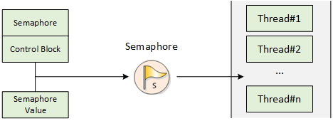
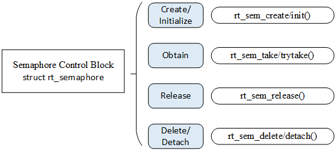
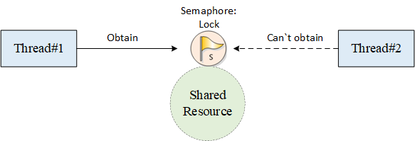
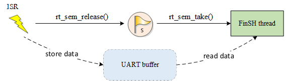
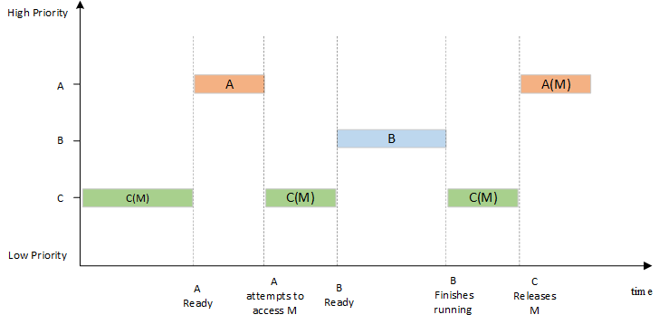
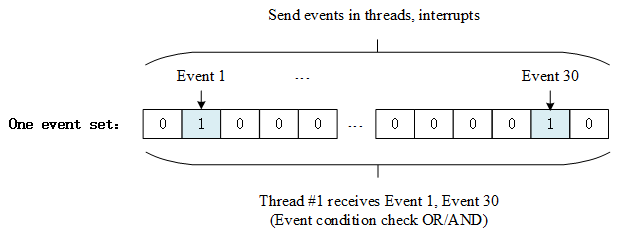

# Inter-thread Synchronization

In a multi-threaded real-time system, the completion of a task can often be accomplished through coordination of multiple threads, so how do these multiple threads collaborate well with each other to perform without errors? Here is an example.

For example, two threads in one task: one thread receives data from the sensor and writes the data to shared memory, while another thread periodically reads data from the shared memory and sends it to display. The following figure depicts data transfer between two threads:


If access to shared memory is not exclusive, then it may be accessed simultaneously by each thread, which causes data consistency issues. For example, before thread #2 (thread that can display data) attempts to display data,  thread #1 (thread that can receive data) has not yet completed the writing in of data, then the display will contain data sampled at different times, causing the display data to be disordered.

Thread #1 that writes the sensor data to the shared memory block and thread #2 that reads the sensor data from the shared memory block access the same memory block. In order to prevent data errors, the actions of the two threads must be mutually exclusive. One of threads should only be allowed after another thread completes its operation on the shared memory block. This way, thread #1 and thread #2 can work properly to execute this task correctly.

Synchronization refers to running in a predetermined order. Thread synchronization refers to multiple threads controlling the execution order between threads through specific mechanisms (such as mutex, event object, critical section). In other words, establish a relationship of execution order by synchronization between threads and if there is no synchronization, the threads will be out-of-order.

Multiple threads operate / access the same area (code), this block of code is called the critical section, the shared memory block in the above example is the critical section. Thread mutual exclusion refers to the exclusiveness of access to critical section resources. When multiple threads use critical section resources, only one thread is allowed each time. Other threads that want to use the resource must wait until the resource occupant releases the resource. Thread mutex can be seen as a special kind of thread synchronization.

There are many ways to synchronize threads. The core idea is that **only one (or one kind of) thread is allowed to run when accessing the critical section.** There are many ways to enter/exit the critical section:

1) Call rt_hw_interrupt_disable() to enter the critical section and call rt_hw_interrupt_enable() to exit the critical section; see the *Global Interrupt Switch* in *Interrupt Management* for details.

2)Call rt_enter_critical() to enter the critical section and call rt_exit_critical() to exit the critical section.

This chapter introduces several synchronization methods: **semaphores,** **mutex**, and **event**. After learning this chapter, you will learn how to use semaphores, mutex, and event to synchronize threads.

Semaphores
------

Take parking lot as an example to understand the concept of semaphore:

①When the parking lot is empty, the administrator of the parking lot finds that there are a lot of empty parking spaces. And then, cars outside will enter the parking lot and get parking spaces.

②When the parking space of the parking lot is full, the administrator finds that there is no empty parking space. As a result, cars outside will be prohibited from entering the parking lot, and they will be waiting in line;

③When cars are leaving the parking lot, the administrator finds that there are empty parking spaces for cars outside to enter the parking lot; after the empty parking spaces are taken, cars outside are prohibited from entering.

In this example, the administrator is equivalent to the semaphore. The number of empty parking spaces that the administrator is in charge of is the value of the semaphore (non-negative, dynamic change); the parking space is equivalent to the common resource (critical section), and the cars are equivalent to the threads.  Cars access the parking spaces by obtaining permission from the administrator, which is similar to thread accessing public resource by obtaining the semaphore.

### Semaphore Working Mechanism

Semaphore is a light-duty kernel object that can solve the problems of synchronization between threads. By obtaining or releasing semaphore, a thread can achieve synchronization or mutual exclusion.

Schematic diagram of semaphore is shown in the figure below. Each semaphore object has a semaphore value and a thread waiting queue. Semaphore value corresponds to the actual number of instances of semaphore object and the number of resources. If the semaphore value is 5, it means that there are 5 semaphore instances (resources) that can be used. If the number of semaphore instances is zero, the thread that is applying for the semaphore will be suspended on the waiting queue of the semaphore, waiting for available semaphore instances (resources).



### Semaphore Control Block

In RT-Thread, semaphore control block is a data structure used by the operating system to manage semaphores, represented by struct rt rt_semaphore. Another C expression is rt_sem_t, which represents the handle of the semaphore, and the implementation in C language is a pointer to the semaphore control block. The detailed definition of semaphore control block structure is as follows:

```c
struct rt_semaphore
{
   struct rt_ipc_object parent;  /* Inherited from the ipc_object class */
   rt_uint16_t value;              /* Semaphore Value */
};
/* rt_sem_t is the type of pointer pointing to semaphore structure */
typedef struct rt_semaphore* rt_sem_t;
```

rt_semaphore object is derived from rt_ipc_object and is managed by the IPC container. The maximum semaphore is 65535.

### Semaphore Management

Semaphore control block contains important parameters related to the semaphore and acts as a link between various states of the semaphore. Interfaces related to semaphore are shown in the figure below. Operations on a semaphore includes: creating/initializing the semaphore, obtaining the semaphore, releasing the semaphore, and deleting/detaching the semaphore.



#### Create and Delete Semaphore

When creating a semaphore, the kernel first creates a semaphore control block, then performs basic initialization on the control block. The following function interface is used to create a semaphore:

```c
 rt_sem_t rt_sem_create(const char *name,
                        rt_uint32_t value,
                        rt_uint8_t flag);
```

When this function is called, the system will first allocate a semaphore object from the object manager and initialize the object, and then initialize the parent class IPC object and semaphore-related parts. Among parameters specified in the creation of semaphore, semaphore flag parameter determines the queuing way of how multiple threads wait when the semaphore is not available. When the RT_IPC_FLAG_FIFO (first in, first out) mode is selected, the waiting thread queue will be queued in a first in first out manner. The first thread that goes in will firstly obtain the waiting semaphore. When the RT_IPC_FLAG_PRIO (priority waiting) mode is selected, the waiting threads will be queued in order of priority.  Threads waiting with the highest priority will get the wait semaphore first. The following table describes the input parameters and return values for this function:

Input parameters and return values of rt_sem_create()

|Parameters          |Description                                                         |
|--------------------|-------------------------------------------------------------------|
| name               | Semaphore Name                                |
| value              | Semaphore Initial Value                 |
| flag               | Semaphore flag, which can be the following values:  RT_IPC_FLAG_FIFO or RT_IPC_FLAG_PRIO |
|**Return**          | ——                                                                |
| RT_NULL            | Creation failed                                          |
| semaphore control block pointer | Creation successful                                         |

For dynamically created semaphores, when the system no longer uses semaphore, they can be removed to release system resources. To delete a semaphore, use the following function interface:

```c
rt_err_t rt_sem_delete(rt_sem_t sem);
```

When this function is called, the system will delete this semaphore. If there is a thread waiting for this semaphore when it is being deleted, the delete operation will first wake up the thread waiting on the semaphore (return value of the waiting thread is - RT_ERROR), then release the semaphore's memory resources. The following table describes the input parameters and return values for this function:

Input parameters and return values of rt_sem_delete()

|Parameters|Description                        |
|----------|----------------------------------|
| sem      | Semaphore object created by rt_sem_create() |
|**Return**| ——                               |
| RT_EOK   | Successfully deleted |

#### Initialize and Detach Semaphore

For a static semaphore object, its memory space is allocated by the compiler during compiling and placed on the read-write data segment or on the uninitialized data segment. In this case,rt_sem_create interface is no longer needed to create the semaphore to use it, just initialize it before using it. To initialize the semaphore object, use the following function interface:

```c
rt_err_t rt_sem_init(rt_sem_t       sem,
                    const char     *name,
                    rt_uint32_t    value,
                    rt_uint8_t     flag)
```

When this function is called, the system will initialize the semaphore object, then initialize the IPC object and parts related to the semaphore. The flag mentioned above in semaphore function creation can be used as the semaphore flag here.  The following table describes the input parameters and return values for this function:

Input parameters and return values of rt_sem_init()

|**Parameters**|**Description**                                                         |
|----------|-------------------------------------------------------------------|
| sem      | Semaphore object handle                           |
| name     | Semaphore name                                          |
| value    | Semaphore initial value                               |
| flag     | Semaphore flag, which can be the following values:  RT_IPC_FLAG_FIFO or RT_IPC_FLAG_PRIO |
|**Return**| ——                                                                |
| RT_EOK   | Initialization successful                               |

For statically initialized semaphore, detaching the semaphore is letting the semaphore object detach from the kernel object manager. To detach the semaphore, use the following function interface:

```c
rt_err_t rt_sem_detach(rt_sem_t sem);
```

After using this function, the kernel wakes up all threads suspended in the semaphore wait queue and then detaches the semaphore from the kernel object manager. The waiting thread that was originally suspended on the semaphore will get the return value of -RT_ERROR. The following table describes the input parameters and return values for this function:

 Input parameters and return values of rt_sem_detach()

|Parameters|**Description**        |
|----------|------------------|
| sem      | Semaphore object handle |
|**Return**| ——               |
| RT_EOK   | Successfully detached |

#### Obtain Semaphore

Thread obtains semaphore resource instances by obtaining semaphores. When the semaphore value is greater than zero, the thread will get the semaphore, and the corresponding semaphore value will be reduced by 1. The semaphore is obtained using the following function interface:

```c
rt_err_t rt_sem_take (rt_sem_t sem, rt_int32_t time);
```

When calling this function, if the value of the semaphore is zero, it means the current semaphore resource instance is not available, and the thread applying for the semaphore will choose according to the time parameters to either return directly, or suspend for a period of time, or wait forever. While waiting, if other threads or ISR released the semaphore, then the thread will stop the waiting. If the semaphore is still not available after parameter specified time, the thread will time out and return, return value is -RT_ETIMEOUT. The following table describes the input parameters and return values for this function:

  Input parameters and return values of rt_sem_take()

|Parameters     |Description                                         |
|---------------|---------------------------------------------------|
| sem           | Semaphore object handle           |
| time          | Specified wait time, unit is operating system clock tick (OS Tick) |
|**Return**     | ——                                                |
| RT_EOK        | Semaphore obtained successfully    |
| \-RT_ETIMEOUT | Did not received semaphore after timeout |
| \-RT_ERROR    | Other errors                                  |

#### Obtain Semaphore without Waiting

When user does not want to suspend thread on the applied semaphore and wait,  the semaphore can be obtained using the wait-free mode , and the following function interface is used for obtaining the semaphore without waiting:

```c
rt_err_t rt_sem_trytake(rt_sem_t sem);
```

This function has the same effect as rt_sem_take(sem, 0),  which means when the semaphore resource instance requested by the thread is not available, it will not wait on the semaphore, instead it returns to -RT_ETIMEOUT directly. The following table describes the input parameters and return values for this function:

  Input parameters and return values for rt_sem_trytake()

|**Parameter**     |Description        |
|---------------|------------------|
| sem           | Semaphore object handle |
|**Return**     | ——               |
| RT_EOK        | Semaphore successfully obtained |
| \-RT_ETIMEOUT | Semaphore obtainment failed |

#### Interrupt Service Routine

Semaphore is released to wake up the thread that suspends on the semaphore. To release the semaphore, use the following function interface:

```c
rt_err_t rt_sem_release(rt_sem_t sem);
```

For example, when semaphore value is zero and a thread is waiting for this semaphore, releasing the semaphore will wake up the first thread waiting in the thread queue of the semaphore, and this thread will obtain the semaphore; otherwise value of the semaphore will plus 1. The following table describes the input parameters and return values of the function:

 Input parameters and return values of rt_sem_release()

|**Parameters**|Description        |
|----------|------------------|
| sem      | Semaphore object handle |
|**Return**| ——               |
| RT_EOK   | Semaphore successfully released |

### Semaphore Application Sample

This is a sample of semaphore usage routine. This routine creates a dynamic semaphore and initializes two threads, one thread sends the semaphore, and one thread receives the semaphore and performs the corresponding operations. As shown in the following code:

Use of semaphore


```c
#include <rtthread.h>

#define THREAD_PRIORITY         25
#define THREAD_TIMESLICE        5

/* pointer to semaphore */
static rt_sem_t dynamic_sem = RT_NULL;

ALIGN(RT_ALIGN_SIZE)
static char thread1_stack[1024];
static struct rt_thread thread1;
static void rt_thread1_entry(void *parameter)
{
    static rt_uint8_t count = 0;

    while(1)
    {
        if(count <= 100)
        {
            count++;
        }
        else
            return;

        /* count release semaphore every 10 counts */
         if(0 == (count % 10))
        {
            rt_kprintf("t1 release a dynamic semaphore.\n");
            rt_sem_release(dynamic_sem);
        }
    }
}

ALIGN(RT_ALIGN_SIZE)
static char thread2_stack[1024];
static struct rt_thread thread2;
static void rt_thread2_entry(void *parameter)
{
    static rt_err_t result;
    static rt_uint8_t number = 0;
    while(1)
    {
        /* permanently wait for the semaphore; once obtain the semaphore, perform the number self-add operation */
        result = rt_sem_take(dynamic_sem, RT_WAITING_FOREVER);
        if (result != RT_EOK)
        {
            rt_kprintf("t2 take a dynamic semaphore, failed.\n");
            rt_sem_delete(dynamic_sem);
            return;
        }
        else
        {
            number++;
            rt_kprintf("t2 take a dynamic semaphore. number = %d\n" ,number);
        }
    }
}

/* initialization of the semaphore sample */
int semaphore_sample(void)
{
    /* create a dynamic semaphore with an initial value of 0 */
    dynamic_sem = rt_sem_create("dsem", 0, RT_IPC_FLAG_FIFO);
    if (dynamic_sem == RT_NULL)
    {
        rt_kprintf("create dynamic semaphore failed.\n");
        return -1;
    }
    else
    {
        rt_kprintf("create done. dynamic semaphore value = 0.\n");
    }

    rt_thread_init(&thread1,
                   "thread1",
                   rt_thread1_entry,
                   RT_NULL,
                   &thread1_stack[0],
                   sizeof(thread1_stack),
                   THREAD_PRIORITY, THREAD_TIMESLICE);
    rt_thread_startup(&thread1);

    rt_thread_init(&thread2,
                   "thread2",
                   rt_thread2_entry,
                   RT_NULL,
                   &thread2_stack[0],
                   sizeof(thread2_stack),
                   THREAD_PRIORITY-1, THREAD_TIMESLICE);
    rt_thread_startup(&thread2);

    return 0;
}
/* export to msh command list */
MSH_CMD_EXPORT(semaphore_sample, semaphore sample);
```

Simulation results:

```
 \ | /
- RT -     Thread Operating System
 / | \     3.1.0 build Aug 27 2018
 2006 - 2018 Copyright by rt-thread team
msh >semaphore_sample
create done. dynamic semaphore value = 0.
msh >t1 release a dynamic semaphore.
t2 take a dynamic semaphore. number = 1
t1 release a dynamic semaphore.
t2 take a dynamic semaphore. number = 2
t1 release a dynamic semaphore.
t2 take a dynamic semaphore. number = 3
t1 release a dynamic semaphore.
t2 take a dynamic semaphore. number = 4
t1 release a dynamic semaphore.
t2 take a dynamic semaphore. number = 5
t1 release a dynamic semaphore.
t2 take a dynamic semaphore. number = 6
t1 release a dynamic semaphore.
t2 take a dynamic semaphore. number = 7
t1 release a dynamic semaphore.
t2 take a dynamic semaphore. number = 8
t1 release a dynamic semaphore.
t2 take a dynamic semaphore. number = 9
t1 release a dynamic semaphore.
t2 take a dynamic semaphore. number = 10
```

As the result of the operation above: Thread 1 sends a semaphore when the count is multiple of 10 (the thread exits after the count reaches 100), and thread 2 adds one on top of the number after receiving the semaphore.

Another semaphore application routine is shown below. This sample will use two threads and three semaphores to implement  an example of producers and consumers. Among them:

Another application routine for semaphores is as follows:

To be more accurate, the producer consumer model is  actually a "producer-consumer-warehouse" model. We call the available spots in the warehouse "empty seats", and once an available spot ("empty seat") is taken, we then call it a "full seat". For this model, the following points should be clarified:
1、The producer only produces when the warehouse is not full; the producer will stop production when the warehouse is full.
2、The consumer can consume only when there are products in the warehouse; consumers will wait if the warehouse is empty.
3、When the consumer consumes, the warehouse is not full anymore, and then the producer will be notified to produce again.
4、The producer should notify the consumer to consumer after it produces consumable products.


This routine will use two threads and three semaphores to implement examples of producers and consumers.   Among them
The three semaphores in the example are:
①sem_lock: This semaphore acts as a lock because both threads operate on the same array array which means this array is a shared resource and sem_lock is used to protect this shared resource.
②sem_empty: Its value is used to indicate the number of "warehouse" available seats , and the value of sem_empty is initialized to 5, indicating that there are 5 "empty seats" .
③sem_full：Its value is used to indicate the number of "full seats" in the "warehouse", and the value of sem_full is initialized to 0, indicating that there are 0 "full seats".

The 2 threads in the example are:
①Producer thread: After obtaining the available seat (sem_empty value minus 1), generate a number, loop into the array, and then release a "full seat"(sem_full value plus 1).
②Consumer thread: After getting the "full seat" (the value of sem_full is decremented by 1), the contents of the array are read and added, and then an "empty seat" is released (the value of sem_empty is increased by 1).

Producer consumer routine

```c
#include <rtthread.h>

#define THREAD_PRIORITY       6
#define THREAD_STACK_SIZE     512
#define THREAD_TIMESLICE      5

/* Define a maximum of 5 elements to be generated */
#define MAXSEM 5

/* An array of integers used to place production */
rt_uint32_t array[MAXSEM];

/* Point to the producer and consumer's read-write position in the array  */
static rt_uint32_t set, get;

/* Pointer to the thread control block */
static rt_thread_t producer_tid = RT_NULL;
static rt_thread_t consumer_tid = RT_NULL;

struct rt_semaphore sem_lock;
struct rt_semaphore sem_empty, sem_full;

/* Pointer to the thread control block */
void producer_thread_entry(void *parameter)
{
    int cnt = 0;

    /* Run for 10 times*/
    while (cnt < 10)
    {
        /* Obtain one vacancy */
        rt_sem_take(&sem_empty, RT_WAITING_FOREVER);

        /* Modify array content, lock */
        rt_sem_take(&sem_lock, RT_WAITING_FOREVER);
        array[set % MAXSEM] = cnt + 1;
        rt_kprintf("the producer generates a number: %d\n", array[set % MAXSEM]);
        set++;
        rt_sem_release(&sem_lock);

        /* 发布一个满位 */
        rt_sem_release(&sem_full);
        cnt++;

        /* Pause for a while */
        rt_thread_mdelay(20);
    }

    rt_kprintf("the producer exit!\n");
}

/* Consumer thread entry */
void consumer_thread_entry(void *parameter)
{
    rt_uint32_t sum = 0;

    while (1)
    {
        /* obtain a "full seat" */
        rt_sem_take(&sem_full, RT_WAITING_FOREVER);

        /* Critical region, locked for operation */
        rt_sem_take(&sem_lock, RT_WAITING_FOREVER);
        sum += array[get % MAXSEM];
        rt_kprintf("the consumer[%d] get a number: %d\n", (get % MAXSEM), array[get % MAXSEM]);
        get++;
        rt_sem_release(&sem_lock);

        /* Release one vacancy */
        rt_sem_release(&sem_empty);

        /* The producer produces up to 10 numbers, stops, and the consumer thread stops accordingly */
        if (get == 10) break;

        /* Pause for a while */
        rt_thread_mdelay(50);
    }

    rt_kprintf("the consumer sum is: %d\n", sum);
    rt_kprintf("the consumer exit!\n");
}

int producer_consumer(void)
{
    set = 0;
    get = 0;

    /* Initialize 3 semaphores */
    rt_sem_init(&sem_lock, "lock",     1,      RT_IPC_FLAG_FIFO);
    rt_sem_init(&sem_empty, "empty",   MAXSEM, RT_IPC_FLAG_FIFO);
    rt_sem_init(&sem_full, "full",     0,      RT_IPC_FLAG_FIFO);

    /* Create producer thread */
    producer_tid = rt_thread_create("producer",
                                    producer_thread_entry, RT_NULL,
                                    THREAD_STACK_SIZE,
                                    THREAD_PRIORITY - 1,
                                    THREAD_TIMESLICE);
    if (producer_tid != RT_NULL)
    {
        rt_thread_startup(producer_tid);
    }
    else
    {
        rt_kprintf("create thread producer failed");
        return -1;
    }

    /* Create consumer thread */
    consumer_tid = rt_thread_create("consumer",
                                    consumer_thread_entry, RT_NULL,
                                    THREAD_STACK_SIZE,
                                    THREAD_PRIORITY + 1,
                                    THREAD_TIMESLICE);
    if (consumer_tid != RT_NULL)
    {
        rt_thread_startup(consumer_tid);
    }
    else
    {
        rt_kprintf("create thread consumer failed");
        return -1;
    }

    return 0;
}

/* Export to msh command list */
MSH_CMD_EXPORT(producer_consumer, producer_consumer sample);
```

The simulation results for this routine are as follows:

```
\ | /
- RT -     Thread Operating System
 / | \     3.1.0 build Aug 27 2018
 2006 - 2018 Copyright by rt-thread team
msh >producer_consumer
the producer generates a number: 1
the consumer[0] get a number: 1
msh >the producer generates a number: 2
the producer generates a number: 3
the consumer[1] get a number: 2
the producer generates a number: 4
the producer generates a number: 5
the producer generates a number: 6
the consumer[2] get a number: 3
the producer generates a number: 7
the producer generates a number: 8
the consumer[3] get a number: 4
the producer generates a number: 9
the consumer[4] get a number: 5
the producer generates a number: 10
the producer exit!
the consumer[0] get a number: 6
the consumer[1] get a number: 7
the consumer[2] get a number: 8
the consumer[3] get a number: 9
the consumer[4] get a number: 10
the consumer sum is: 55
the consumer exit!
```

This routine can be understood as the process of producers producing products and putting them into the warehouse and the consumer taking the products from the warehouse.

(1) Producer thread:

1) Obtain 1 "empty seat" (put product number), now the number of "empty seats" is decremented by 1;

2) Lock protection; the generated number value is cnt+1, and the value is looped into the array; then unlocked;

3) Release 1 "full seat" (put one product into the warehouse, there will be one more "full seat" in the warehouse), add 1 to the number "full seats".

(2) Consumer thread：

1）Obtain 1 "full seat" (take product number), then the the number of "full seats" is decremented by 1;

2）Lock protection; read the number produced by the producer from array and add it to the last number; then unlock it;

3）Release 1 "empty seat" (take one product from the warehouse, then there is one more "empty seat" in the warehouse), add 1 to the number of "empty seats".

The producer generates 10 numbers in turn, and the consumers take them away in turn and sum the values of the 10 numbers. Semaphore lock protects array critical region resources, ensuring the exclusivity of number taking for the consumers each time and achieving inter-thread synchronization.

### Semaphore Usage Occasion

Semaphores is a very flexible way to synchronize and can be used in a variety of situations, like forming locks, synchronization, resource counts, etc. It can also be conveniently used for synchronization between threads and threads, interrupts and threads.

#### Thread Synchronization

Thread synchronization is one of the simplest types of semaphore applications. For example, using semaphores to synchronize between two threads, the value of the semaphore is initialized to 0, indicating that there are 0 semaphore resource instances; and the thread attempting to acquire the semaphore will wait directly on this semaphore.

When the thread holding the semaphore completes the work it is processing, it will release this semaphore. Thread waiting on this semaphore can be awaken, and it can then perform the next part of the work. This occasion can also be seen as using the semaphore for the work completion flag: the thread holding the semaphore completes its own work, and then notifies the thread waiting for the semaphore to continue the next part of the work.

#### Lock

Locks, a single lock is often applied to multiple threads accessing the same shared resource (in other words, critical region). When semaphore is used as a lock, the semaphore resource instance should normally be initialized to 1, indicating that the system has one resource available by default. Because the semaphore value always varies between 1 and 0, so this type of lock is also called binary semaphore. As shown in the following figure, when a thread needs to access shared resource, it needs to obtain the resource lock first. When this thread successfully obtains the resource lock, other threads that intend to access the shared resource will suspend because they cannot obtain the resource. This is because it is already locked (semaphore value is 0) when other threads are trying to obtain the lock. When thread holding the semaphore is processed and exiting the critical region, it will release the semaphore and unlock the lock, and the first waiting thread that is suspending on the lock will be awaken to gain access to the critical region.



#### Interrupt Synchronization between Threads

Semaphore can also be easily applied to interrupting synchronization between threads, such as an interrupt trigger. When interrupting service routine, thread needs to be notifies to perform corresponding data processing. At this time, the initial value of the semaphore can be set to 0. When the thread tries to hold this semaphore, since the initial value of the semaphore is 0, the thread will then suspends on this semaphore until the semaphore is released. When the interrupt is triggered, hardware-related actions are firstly performed, such as reading corresponding data from the hardware I/O port, and confirming the interrupt to clear interrupt source, and then releasing a semaphore to wake up the corresponding thread for subsequent data processing. For example, the processing of FinSH threads is as shown in the following figure.



The value of the semaphore is initially 0. When the FinSH thread attempts to obtain the semaphore, it will be suspended because the semaphore value is 0. When the console device has data input, an interrupt is generated to enter the interrupt service routine. In the interrupt service routine, it reads the data of the console device, puts the read data into the UART buffer for buffering, and then releases the semaphore. The semaphore release will wake up the shell thread. After the interrupt service routine has finished, if there are no ready threads with higher priority than the shell thread in the system, the shell thread will hold the semaphore and run, obtaining the input data from the UART buffer.

>The mutual exclusion between interrupts and threads cannot be done by means of semaphores (locks), but by means of switch interrupts.

#### Resource Count

Semaphore can also be considered as an incrementing or decrementing counter. It should be noted that the semaphore value is non-negative. For example, if the value of a semaphore is initialized to 5, then the semaphore can be reduced by a maximum of 5 consecutive times until the counter is reduced to zero. Resource count is suitable for occasions where the processing speeds between threads do not match. At this time, the semaphore can be counted as the number of completed tasks of the previous thread, and when dispatched to the next thread, it can also be used in a continuous manner handling multiple events each time. For example, in the producer and consumer problem, the producer can release the semaphore multiple times, and then the consumer can process multiple semaphore resources each time when dispatched.

>Generally, resource count is mostly inter-thread synchronization in a hybrid mode, because there are still multiple accesses from threads for a single resource processing, which requires accessing and processing for a single resource, and operate lock mutex operation.

Mutex
------

Mutexes, also known as mutually exclusive semaphores, are a special binary semaphore. Mutex is similar to a parking lot with only one parking space: when one car enters, the parking lot gate is locked and other vehicles are waiting outside. When the car inside comes out, parking lot gate will open and the next car can enter.

### Mutex Working Mechanism

The difference between a mutex and a semaphore is that the thread with a mutex has ownership of the mutex, mutex supports recursive access and prevents thread priority from reversing; and mutex can only be released by the  thread holding it, whereas semaphore can be released by any thread.

There are only two states of mutex, unlocked and locked (two state values). When a thread holds it, then the mutex is locked and its ownership is obtained by this thread. Conversely, when this thread releases it, it unlocks the mutex and loses its ownership. When a thread is holding a mutex, other threads will not be able to unlock this mutex or hold it. The thread holding the mutex can also acquire the lock again without being suspended, as shown in the following figure. This feature is quite different from the general binary semaphore: in semaphore, because there is no instance, the thread will suspend if the thread recursively holds the semaphore (which eventually leads to a deadlock).


Another potential problem with using semaphores is thread priority inversion. The so-called priority inversion is when a high-priority thread attempts to access shared resource through the semaphore mechanism, if the semaphore is already held by a low-priority thread which may happen to be preempted by other medium-priority threads while running, this leads to high-priority threads being blocked by many lower-priority threads which means instantaneity is difficult to guarantee. As shown in the following figure: There are three threads with the priority levels A, B, and C, priority A> B > C. Threads A and B are in suspended state, waiting for an event to trigger; thread C is running, and thread C starts using a shared resource M. While using the resource, the event thread A is waiting for occurs and thread A switches to ready state because it has higher priority than thread C, so it executes immediately. But when thread A wants to use shared resource M, because it is being used by thread C, thread A is suspended and thread C is running. If the event thread B is waiting for occurs, thread B switches to ready state. Since thread B has a higher priority than thread C, thread B starts running,  thread C won't run until thread B finishes. Thread A is only executed when thread C releases the shared resource M. In this case, the priority has been reversed: thread B runs before thread A. This does not guarantee the response time for high priority threads.



In the RT-Thread operating system, mutex can solve the priority inversion problem and implement the priority inheritance algorithm. Priority inheritance solves the problems caused by priority inversion by raising the priority of thread C to the priority of thread A during the period during when thread A is suspended trying to access the shared resource. This prevents C (indirectly preventing A) from being preempted by B, as shown in the following figure. Priority inheritance refers to raising the priority of a low-priority thread that occupies a certain resource, making the priority level of the low-priority thread to be equal to the priority of the thread with the highest priority level among all threads waiting for the resource, and then executes. When this is low-priority releases the resource, the priority level returns to the initial setting. Therefore, threads that inherit priority help to prevent the system resources from being preempted by any intermediate-priority thread.


>After the mutex is obtained, release the mutex as soon as possible. During the time when holding the mutex, you must not change the priority of the thread holding the mutex.

### Mutex Control Block

In RT-Thread, mutex control block is a data structure used by the operating system to manage mutexes, represented by the struct rt rt_mutex. Another C expression, rt_mutex_t, represents the handle of the mutex, and the implementation in C language refers to the pointer of the mutex control block. See the following code for a detailed definition of the mutex control block structure:

```c
struct rt_mutex
    {
        struct rt_ipc_object parent;                /* inherited from the ipc_object class */

        rt_uint16_t          value;                   /* mutex value */
        rt_uint8_t           original_priority;     /* hold the original priority of the thread */
        rt_uint8_t           hold;                     /* number of times holding the threads */
        struct rt_thread    *owner;                 /* thread that currently owns the mutex */
    };
    /* rt_mutext_t pointer type of the one poniter pointing to the mutex structure */
    typedef struct rt_mutex* rt_mutex_t;
```

The rt_mutex object is derived from rt_ipc_object and is managed by the IPC container.

### Mutex Management

The mutex control block contains important parameters related to mutex and it plays an important role in the implementation of the mutex function. The mutex-related interface is as shown in the following figure. The operation of a mutex includes: creating/initiating a mutex, obtaining a mutex, releasing a mutex, and deleting/detaching a mutex.


#### Create and Delete Mutex

When creating a mutex, the kernel first creates a mutex control block and then completes the initialization of the control block. Create a mutex using the following function interface:

```c
rt_mutex_t rt_mutex_create (const char* name, rt_uint8_t flag);
```

You can call the rt_mutex_create function to create a mutex whose name is designated by name. When this function is called, the system will first allocate a mutex object from the object manager, initialize the object, and then initialize the parent class IPC object and the mutex-related part. The flag of the mutex is set to RT_IPC_FLAG_PRIO, which means that when multiple threads are waiting for resources, the resources will be accessed by the thread with higher priority. The flag is set to RT_IPC_FLAG_FIFO, which means that when multiple threads are waiting for resources, resources are being accesses in a first-come-first-served order. The following table describes the input parameters and return values for this function:

Input parameters and return values of rt_mutex_create()

|Parameters  |**Description**                                                         |
|------------|-------------------------------------------------------------------|
| name       | Mutex name                                                 |
| flag      | Mutex flag, which can take the following values: RT_IPC_FLAG_FIFO or RT_IPC_FLAG_PRIO |
|**Return**  | ——                                                                |
| Mutex handle | Created successfully                                      |
| RT_NULL    | Creation failed                                              |

For dynamically created mutex, when the mutex is no longer used, the system resource is released by removing the mutex. To remove a mutex, use the following function interface:

```c
rt_err_t rt_mutex_delete (rt_mutex_t mutex);
```

When a mutex is deleted, all threads waiting for this mutex will be woken up, return value for the waiting threads is - RT_ERROR. The system then removes the mutex from the kernel object manager linked list and releases the memory space occupied by the mutex. The following table describes the input parameters and return values for this function:

Input parameters and return values of rt_mutex_delete()

|Parameters|Description        |
|----------|------------------|
| mutex    | The handle of the mutex object |
|**Return**| ——               |
| RT_EOK   | Deleted successfully |

#### Initialize and Detach Mutex

The memory of a static mutex object is allocated by the compiler during system compilation, and is usually placed in a read-write data segment or an uninitialized data segment. Before using such static mutex objects, you need to initialize them first. To initialize the mutex, use the following function interface:

```c
rt_err_t rt_mutex_init (rt_mutex_t mutex, const char* name, rt_uint8_t flag);
```

When using this function interface, you need to specify the handle of the mutex object (that is, the pointer to the mutex control block), the mutex name, and the mutex flag. The mutex flag can be the flags mentioned in the creation of mutex function above. The following table describes the input parameters and return values for this function:

Input parameters and return values of rt_mutex_init()

|Parameters|Description                                                         |
|----------|-------------------------------------------------------------------|
| mutex    | The handle of the mutex object, which is provided by the user and points to the memory block of the mutex object |
| name     | Mutex name                                           |
| flag     | Mutex flag, which can take the following values: RT_IPC_FLAG_FIFO or RT_IPC_FLAG_PRIO |
|**Return**| ——                                                                |
| RT_EOK   | Initialization successful                               |

For statically initialized muex, detaching mutex means to remove the mutex object from the kernel object manager. To detach the mutex, use the following function interface:

```c
rt_err_t rt_mutex_detach (rt_mutex_t mutex);
```

After using this function interface, the kernel wakes up all threads suspended on the mutex (the return value of the thread is -RT_ERROR), and then the system detaches the mutex from the kernel object manager. The following table describes the input parameters and return values for this function:

Input parameters and return values for rt_mutex_detach()

|Parameters|Description        |
|----------|------------------|
| mutex    | The handle of the mutex object |
|**Return**| ——               |
| RT_EOK   | Successful |

#### Obtain Mutex

Once the thread obtains the mutex, the thread has ownership of the mutex, that is, a mutex can only be held by one thread at a time. To obtain the mutex, use the following function interface:

```c
rt_err_t rt_mutex_take (rt_mutex_t mutex, rt_int32_t time);
```

If the mutex is not controlled by another thread, the thread requesting the mutex will successfully obtain the mutex. If the mutex is already controlled by the current thread, then add one 1 to the number of holds for the mutex, and the current thread will not be suspended to wait. If the mutex is already occupied by another thread, the current thread suspends and waits on the mutex until another thread releases it or until the specified timeout elapses. The following table describes the input parameters and return values for this function:

Input parameters and return values of rt_mutex_take()

|**Parameters**     |Description        |
|---------------|------------------|
| mutex         | The handle of the mutex object |
| time          | Specified waiting time |
|**Return**     | ——               |
| RT_EOK        | Successfully obtained mutex |
| \-RT_ETIMEOUT | Timeout |
| \-RT_ERROR    | Failed to obtain |

#### Release Mutex

When a thread completes the access to a mutually exclusive resource, it should release the mutex it occupies as soon as possible, so that other threads can obtain the mutex in time. To release the mutex, use the following function interface:

```c
rt_err_t rt_mutex_release(rt_mutex_t mutex);
```

When using this function interface, only threads that already have control of the mutex can release it. Each time the mutex is released, its holding count is reduced by one. When the mutex's holding count is zero (that is, the holding thread has released all holding operations), it becomes available, threads waiting on the semaphore is awaken. If the thread's priority is increased by the mutex, then when the mutex is released, the thread reverts to the priority level before holding the mutex. The following table describes the input parameters and return values for this function:

Input parameters and return values of rt_mutex_release()

|**Parameters**|**Description**        |
|----------|------------------|
| mutex    | The handle of the mutex object |
|**Return**| ——               |
| RT_EOK   | Success       |

### Mutex Application Sample

This is a mutex application routine, and a mutex lock is a way to protect shared resources. When a thread has the mutex lock, it can protect shared resources from being destroyed by other threads. The following example can be used to illustrate. There are two threads: thread 1 and thread 2, thread 1 adds 1 to each of the two numbers; thread 2 also adds 1 to each of the two numbers. mutex is used to ensure that the operation of the thread changing the values of the 2 numbers is  not interrupted. As shown in the following code:

Mutex routine

```c
#include <rtthread.h>

#define THREAD_PRIORITY         8
#define THREAD_TIMESLICE        5

/* Pointer to the mutex */
static rt_mutex_t dynamic_mutex = RT_NULL;
static rt_uint8_t number1,number2 = 0;

ALIGN(RT_ALIGN_SIZE)
static char thread1_stack[1024];
static struct rt_thread thread1;
static void rt_thread_entry1(void *parameter)
{
      while(1)
      {
          /* After thread 1 obtains the mutex, it adds 1 to number1 and number2, and then releases the mutex. */
          rt_mutex_take(dynamic_mutex, RT_WAITING_FOREVER);
          number1++;
          rt_thread_mdelay(10);
          number2++;
          rt_mutex_release(dynamic_mutex);
       }
}

ALIGN(RT_ALIGN_SIZE)
static char thread2_stack[1024];
static struct rt_thread thread2;
static void rt_thread_entry2(void *parameter)
{
      while(1)
      {
          /* After thread 2 obtains the mutex, check whether the values of number1 and number2 are the same. If they are the same, it means the mutex succeesfully played the role of a lock. */
          rt_mutex_take(dynamic_mutex, RT_WAITING_FOREVER);
          if(number1 != number2)
          {
            rt_kprintf("not protect.number1 = %d, mumber2 = %d \n",number1 ,number2);
          }
          else
          {
            rt_kprintf("mutex protect ,number1 = mumber2 is %d\n",number1);
          }

           number1++;
           number2++;
           rt_mutex_release(dynamic_mutex);

          if(number1>=50)
              return;
      }
}

/* Initialization of the mutex sample */
int mutex_sample(void)
{
    /* Create a dynamic mutex */
    dynamic_mutex = rt_mutex_create("dmutex", RT_IPC_FLAG_FIFO);
    if (dynamic_mutex == RT_NULL)
    {
        rt_kprintf("create dynamic mutex failed.\n");
        return -1;
    }

    rt_thread_init(&thread1,
                   "thread1",
                   rt_thread_entry1,
                   RT_NULL,
                   &thread1_stack[0],
                   sizeof(thread1_stack),
                   THREAD_PRIORITY, THREAD_TIMESLICE);
    rt_thread_startup(&thread1);

    rt_thread_init(&thread2,
                   "thread2",
                   rt_thread_entry2,
                   RT_NULL,
                   &thread2_stack[0],
                   sizeof(thread2_stack),
                   THREAD_PRIORITY-1, THREAD_TIMESLICE);
    rt_thread_startup(&thread2);
    return 0;
}

/* Export to the MSH command list */
MSH_CMD_EXPORT(mutex_sample, mutex sample);
```

Both thread 1 and thread 2 use mutexes to protect the operation on the 2 numbers (if the obtain and release mutex statements in thread 1 are commented out, thread 1 will no longer protect number), the simulation results are as follows :

```
\ | /
- RT -     Thread Operating System
 / | \     3.1.0 build Aug 24 2018
 2006 - 2018 Copyright by rt-thread team
msh >mutex_sample
msh >mutex protect ,number1 = mumber2 is 1
mutex protect ,number1 = mumber2 is 2
mutex protect ,number1 = mumber2 is 3
mutex protect ,number1 = mumber2 is 4
…
mutex protect ,number1 = mumber2 is 48
mutex protect ,number1 = mumber2 is 49
```

Threads use mutexes to protect the operation on the two numbers, keeping the number values consistent.

Another example of a mutex is shown in the following code. This example creates three dynamic threads to check if the priority level of the thread holding the mutex is adjusted to the highest priority level among the waiting threads.

Prevent priority inversion routine

```c
#include <rtthread.h>

/* Pointer to the thread control block */
static rt_thread_t tid1 = RT_NULL;
static rt_thread_t tid2 = RT_NULL;
static rt_thread_t tid3 = RT_NULL;
static rt_mutex_t mutex = RT_NULL;


#define THREAD_PRIORITY       10
#define THREAD_STACK_SIZE     512
#define THREAD_TIMESLICE    5

/* Thread 1 Entry */
static void thread1_entry(void *parameter)
{
    /* Let the low priority thread run first */
    rt_thread_mdelay(100);

    /* At this point, thread3 holds the mutex and thread2 is waiting to hold the mutex */

    /* Check the priority level of thread2 and thread3 */
    if (tid2->current_priority != tid3->current_priority)
    {
        /* The priority is different, the test fails */
        rt_kprintf("the priority of thread2 is: %d\n", tid2->current_priority);
        rt_kprintf("the priority of thread3 is: %d\n", tid3->current_priority);
        rt_kprintf("test failed.\n");
        return;
    }
    else
    {
        rt_kprintf("the priority of thread2 is: %d\n", tid2->current_priority);
        rt_kprintf("the priority of thread3 is: %d\n", tid3->current_priority);
        rt_kprintf("test OK.\n");
    }
}

/* Thread 2 Entry */
static void thread2_entry(void *parameter)
{
    rt_err_t result;

    rt_kprintf("the priority of thread2 is: %d\n", tid2->current_priority);

    /* Let the low-priority thread run first */
    rt_thread_mdelay(50);

    /*
     * Trying to hold a mutex lock. At this point, thread 3 has the mutex lock, so the priority level of thread 3 should be raised
     * to the same level of priority as thread 2
     */
    result = rt_mutex_take(mutex, RT_WAITING_FOREVER);

    if (result == RT_EOK)
    {
        /* Release mutex lock */
        rt_mutex_release(mutex);
    }
}

/* Thread 3 Entry */
static void thread3_entry(void *parameter)
{
    rt_tick_t tick;
    rt_err_t result;

    rt_kprintf("the priority of thread3 is: %d\n", tid3->current_priority);

    result = rt_mutex_take(mutex, RT_WAITING_FOREVER);
    if (result != RT_EOK)
    {
        rt_kprintf("thread3 take a mutex, failed.\n");
    }

    /* Operate a long cycle, 500ms */
    tick = rt_tick_get();
    while (rt_tick_get() - tick < (RT_TICK_PER_SECOND / 2)) ;

    rt_mutex_release(mutex);
}

int pri_inversion(void)
{
    /* Created a mutex lock */
    mutex = rt_mutex_create("mutex", RT_IPC_FLAG_FIFO);
    if (mutex == RT_NULL)
    {
        rt_kprintf("create dynamic mutex failed.\n");
        return -1;
    }

    /* Create thread 1*/
    tid1 = rt_thread_create("thread1",
                            thread1_entry,
                            RT_NULL,
                            THREAD_STACK_SIZE,
                            THREAD_PRIORITY - 1, THREAD_TIMESLICE);
    if (tid1 != RT_NULL)
         rt_thread_startup(tid1);

    /* Create thread 2 */
    tid2 = rt_thread_create("thread2",
                            thread2_entry,
                            RT_NULL,
                            THREAD_STACK_SIZE,
                            THREAD_PRIORITY, THREAD_TIMESLICE);
    if (tid2 != RT_NULL)
        rt_thread_startup(tid2);

    /* Create thread 3 */
    tid3 = rt_thread_create("thread3",
                            thread3_entry,
                            RT_NULL,
                            THREAD_STACK_SIZE,
                            THREAD_PRIORITY + 1, THREAD_TIMESLICE);
    if (tid3 != RT_NULL)
        rt_thread_startup(tid3);

    return 0;
}

/* Export to the msh command list */
MSH_CMD_EXPORT(pri_inversion, prio_inversion sample);
```

The simulation results are as follows:

```
\ | /
- RT -     Thread Operating System
 / | \     3.1.0 build Aug 27 2018
 2006 - 2018 Copyright by rt-thread team
msh >pri_inversion
the priority of thread2 is: 10
the priority of thread3 is: 11
the priority of thread2 is: 10
the priority of thread3 is: 10
test OK.
```

The routine demonstrates how to use the mutex. Thread 3 holds the mutex first, and then thread 2 tries to hold the mutex, at which point thread 3's priority is raised to the same level as thread 2.

>It is important to remember that mutexes cannot be used in interrupt service routines.

### Occasions to Use Mutex

The use of a mutex is relatively simple because it is a type of semaphore and it exists in the form of a lock. At the time of initialization, the mutex is always unlocked, and when it is held by the thread, it immediately becomes locked. Mutex is more suitable for:

(1) When a thread holds a mutex multiple times. This can avoid the problem of deadlock caused by multiple recursive holdings of the same thread.

(2) A situation in which priority inversion may occur due to multi-thread synchronization.

Event
------

Event set is also one of the mechanisms for synchronization between threads. An event set can contain multiple events. Event set can be used to complete one-to-many, many-to-many thread synchronization. Let's take taking bus as an example to illustrate event. There may be the following situations when waiting for a bus at a bus stop:

①P1 is taking a bus to a certain place, only one type of bus can reach the destination. P1 can leave for the destination once that bus arrives.

②P1 is taking a bus to a certain place, 3 types of buses can reach the destination. P1 can leave for the destination once any 1 of the 3 types of bus arrives.

③P1 is traveling with P2 to a certain place together, P1 can't leave for the destination unless two conditions are met. These two conditions are “P2 arrives at the bus stop” and “bus arrives at the bus stop”.

Here, P1 leaving for a certain place can be regarded as a thread, and “bus arrives at the bus stop” and “P2 arrives at the bus stop” are regarded as the occurrence of events. Situation ① is a specific event to wakes up the thread; situation ② is any single event to wake up the thread; situation ③ is when multiple events must occur simultaneously to wake up the thread.

### Event Set Working Mechanism

The event set is mainly used for synchronization between threads. Unlike the semaphore, it can achieve one-to-many, many-to-many synchronization. That is, the relationship between a thread and multiple events can be set as follows: any one of the events wakes up the thread, or several events wake up the thread for subsequent processing; likewise, the event can be multiple threads to synchronize multiple events. This collection of multiple events can be represented by a 32-bit unsigned integer variable, each bit of the variable representing an event, and the thread associates one or more events by "logical AND" or "logical OR" to form event combination. The "logical OR" of an event is also called independent synchronization, which means that the thread is synchronized with one of the events; the event "logical AND" is also called associative synchronization, which means that the thread is synchronized with several events.

The event set defined by RT-Thread has the following characteristics:

1) Events are related to threads only, and events are independent of each other: each thread can have 32 event flags, recorded with a 32-bit unsigned integer, each bit representing an event;

2) Event is only used for synchronization and does not provide data transfer functionality;

3) Events are not queuing, that is, sending the same event to the thread multiple times (if the thread has not had time read it), the effect is equivalent to sending only once.

In RT-Thread, each thread has an event information tag with three attributes. They are RT_EVENT_FLAG_AND (logical AND), RT_EVENT_FLAG_OR (logical OR), and RT_EVENT_FLAG_CLEAR (clear flag). When the thread waits for event synchronization, it can determine whether the currently received event satisfies the synchronization condition by 32 event flags and this event information flag.



As shown in the figure above, the first and 30th bits of the event flag of thread #1 are set. If the event information flag is set to logical AND, it means that thread #1 will be triggered to wake up only after both event 1 and event 30 occur. If the event information flag is set to logical OR, the occurrence of either event 1 or event 30 will trigger to wake up thread #1. If the message flag also sets the clear flag bit, this means event 1 and event 30 will be automatically cleared to zero when thread #1 wakes up, otherwise the event flag will still be present (set to 1).

### Event Set Control Block

In RT-Thread, event set control block is a data structure used by the operating system to manage events, represented by the structure struct rt_event. Another C expression, rt_event_t, represents the handle of the event set, and the implementation in C language is a pointer to the event set control block. See the following code for a detailed definition of the event set control block structure:

```c
struct rt_event
{
    struct rt_ipc_object parent;    /* Inherited from the ipc_object class */

    /* The set of events, each bit represents 1 event, the value of the bit can mark whether an event occurs */
    rt_uint32_t set;
};
/* rt_event_t is the pointer type poniting to the event structure */
typedef struct rt_event* rt_event_t;
```

rt_event object is derived from rt_ipc_object and is managed by the IPC container.

### Management of Event Sets

Event set control block contains important parameters related to the event set and plays an important role in the implementation of the event set function. The event set related interfaces are as shown in the following figure. The operations on an event set include: create/initiate event sets, send events, receive events, and delete/detach event sets.


#### Create and Delete Event Set

When creating an event set, the kernel first creates an event set control block, and then performs basic initialization on the event set control block. The event set is created using the following function interface:

```c
rt_event_t rt_event_create(const char* name, rt_uint8_t flag);
```

When the function interface is called, the system allocates the event set object from the object manager, initializes the object, and then initializes the parent class IPC object. The following table describes the input parameters and return values for this function:

 Input parameters and return values for rt_event_create()

|**Parameters**      |**Description**                                                           |
|----------------|---------------------------------------------------------------------|
| name           | Name of the event set.                                      |
| flag           | The flag of the event set, which can take the following values: RT_IPC_FLAG_FIFO or RT_IPC_FLAG_PRIO |
|**Return**      | ——                                                                  |
| RT_NULL        | Creation failed.                                               |
| Handle of the event object | Creation successful                                           |

When the system no longer uses the event set object created by rt_event_create(), the system resource is released by deleting the event set object control block. To delete an event set you can use the following function interface:

```c
rt_err_t rt_event_delete(rt_event_t event);
```

When you call rt_event_delete function to delete an event set object, you should ensure that the event set is no longer used. All threads that are suspended on the event set will be awaken before the deletion (the return value of the thread is -RT_ERROR), and then the memory block occupied by the event set object is released. The following table describes the input parameters and return values for this function:

Input parameters and return values of rt_event_delete()

|**Parameters**|**Description**        |
|----------|------------------|
| event    | The handle of the event set object |
|**Return**| ——               |
| RT_EOK   | Success        |

#### Initialize and Detach Event Set

The memory of a static event set object is allocated by the compiler during system compilation, and is usually placed in a read-write data segment or an uninitialized data segment. Before using a static event set object, you need to initialize it first. The initialization event set uses the following function interface:

```c
rt_err_t rt_event_init(rt_event_t event, const char* name, rt_uint8_t flag);
```

When the interface is called, you need to specify the handle of the static event set object (that is, the pointer pointing to the event set control block), and then the system will initialize the event set object and add it to the system object container for management. The following table describes the input parameters and return values for this function:

Input parameters and return values of rt_event_init()

|**Parameters**|**Description**                                                           |
|----------|---------------------------------------------------------------------|
| event    | The handle of the event set object                  |
| name     | The name of the event set                               |
| flag     | The flag of the event set, which can take the following values: RT_IPC_FLAG_FIFO or RT_IPC_FLAG_PRIO |
|**Return**| ——                                                                  |
| RT_EOK   | Success                                                           |

When the system no longer uses the event set object initialized by rt_event_init(), the system resources are released by detaching the event set object control block. Detaching event set means to detach the event set object from the kernel object manager. To detach an event set, use the following function interface:

```c
rt_err_t rt_event_detach(rt_event_t event);
```

When the user calls this function, the system first wakes up all the threads suspended on the event set wait queue (the return value of the thread is -RT_ERROR), and then detaches the event set from the kernel object manager. The following table describes the input parameters and return values for this function:

Input parameters and return values for rt_event_detach()

|**Parameters**|**Description**        |
|----------|------------------|
| event    | The handle of the event set object |
|**Return**| ——               |
| RT_EOK   | Success        |

#### Send Event

The send event function can send one or more events in the event set as follows:

```c
rt_err_t rt_event_send(rt_event_t event, rt_uint32_t set);
```

When using the function interface, the event flag value of the event set object is set by the event flag specified by the parameter set, and then the waiting thread linked list transversely waiting for the event set objects is used to determine whether there is a thread has the event activation requirement that matches the current event flag value. If there is, wake up the thread. The following table describes the input parameters and return values for this function:

Input parameters and return values of rt_event_send()

|**Parameters**|**Description**                    |
|----------|------------------------------|
| event    | The handle of the event set object |
| set      | The flag value of one or more events sent |
|**Return**| ——                           |
| RT_EOK   | Success                    |

#### Receive Event

The kernel uses a 32-bit unsigned integer to identify the event set, each bit represents an event, so an event set object can wait to receive 32 events at the same time, and the kernel can decide how to activate the thread by specifying the parameter "logical AND" or "logical OR". Using the "logical AND" parameter indicates that the thread is only activated when all waiting events occur, and using the "logical OR" parameter means that the thread is activated as soon as one waiting event occurs. To receive events, use the following function interface:

```c
rt_err_t rt_event_recv(rt_event_t event,
                           rt_uint32_t set,
                           rt_uint8_t option,
                           rt_int32_t timeout,
                           rt_uint32_t* recved);
```

If it has already occurred, it determines whether to reset the corresponding flag of the event according to whether RT_EVENT_FLAG_CLEAR is set on the parameter option. If it has already occurred, it determines whether to reset the corresponding flag of the event according to whether RT_EVENT_FLAG_CLEAR is set on the parameter option, then return (where the recved parameter returns to the received event); if it has not occurred, fill the waiting set and option parameters into the structure of the thread itself, then suspend the thread on this event until its waiting event satisfies the condition or until the specified timeout elapses. If the timeout is set to zero, it means that when the event to be accepted by the thread does not meet the requirements, it does not wait, but returns directly-RT_ETIMEOUT. The following table describes the input parameters and return values for this function:

Input parameters and return values of rt_event_recv()

|**Parameters**     |**Description**            |
|---------------|----------------------|
| event         | The handle of the event set object |
| set           | Receive events of interest to the thread |
| option        | Receive options  |
| timeout       | Timeout   |
| recved        | Point to the received event |
|**Return**     | ——                   |
| RT_EOK        | Successful     |
| \-RT_ETIMEOUT | Timeout          |
| \-RT_ERROR    | Error         |

The value of option can be:

```c
/* Select AND or OR to receive events */
RT_EVENT_FLAG_OR
RT_EVENT_FLAG_AND

/* Choose to clear reset event flag */
RT_EVENT_FLAG_CLEAR
```

### Event Set Application Sample

This is the application routine for the event set, which initializes an event set, two threads. One thread waits for an event of interest to it, and another thread sends an event, as shown in code listing 6-5:

Event set usage routine

```c
#include <rtthread.h>

#define THREAD_PRIORITY      9
#define THREAD_TIMESLICE     5

#define EVENT_FLAG3 (1 << 3)
#define EVENT_FLAG5 (1 << 5)

/* Event control block */
static struct rt_event event;

ALIGN(RT_ALIGN_SIZE)
static char thread1_stack[1024];
static struct rt_thread thread1;

/* Thread 1 entry function*/
static void thread1_recv_event(void *param)
{
    rt_uint32_t e;

    /* The first time the event is received, either event 3 or event 5 can trigger thread 1, clearing the event flag after receiving */
    if (rt_event_recv(&event, (EVENT_FLAG3 | EVENT_FLAG5),
                      RT_EVENT_FLAG_OR | RT_EVENT_FLAG_CLEAR,
                      RT_WAITING_FOREVER, &e) == RT_EOK)
    {
        rt_kprintf("thread1: OR recv event 0x%x\n", e);
    }

    rt_kprintf("thread1: delay 1s to prepare the second event\n");
    rt_thread_mdelay(1000);

    /* The second time the event is received, both event 3 and event 5 can trigger thread 1, clearing the event flag after receiving */
    if (rt_event_recv(&event, (EVENT_FLAG3 | EVENT_FLAG5),
                      RT_EVENT_FLAG_AND | RT_EVENT_FLAG_CLEAR,
                      RT_WAITING_FOREVER, &e) == RT_EOK)
    {
        rt_kprintf("thread1: AND recv event 0x%x\n", e);
    }
    rt_kprintf("thread1 leave.\n");
}


ALIGN(RT_ALIGN_SIZE)
static char thread2_stack[1024];
static struct rt_thread thread2;

/* Thread 2 Entry */
static void thread2_send_event(void *param)
{
    rt_kprintf("thread2: send event3\n");
    rt_event_send(&event, EVENT_FLAG3);
    rt_thread_mdelay(200);

    rt_kprintf("thread2: send event5\n");
    rt_event_send(&event, EVENT_FLAG5);
    rt_thread_mdelay(200);

    rt_kprintf("thread2: send event3\n");
    rt_event_send(&event, EVENT_FLAG3);
    rt_kprintf("thread2 leave.\n");
}

int event_sample(void)
{
    rt_err_t result;

    /* Initialize event object */
    result = rt_event_init(&event, "event", RT_IPC_FLAG_FIFO);
    if (result != RT_EOK)
    {
        rt_kprintf("init event failed.\n");
        return -1;
    }

    rt_thread_init(&thread1,
                   "thread1",
                   thread1_recv_event,
                   RT_NULL,
                   &thread1_stack[0],
                   sizeof(thread1_stack),
                   THREAD_PRIORITY - 1, THREAD_TIMESLICE);
    rt_thread_startup(&thread1);

    rt_thread_init(&thread2,
                   "thread2",
                   thread2_send_event,
                   RT_NULL,
                   &thread2_stack[0],
                   sizeof(thread2_stack),
                   THREAD_PRIORITY, THREAD_TIMESLICE);
    rt_thread_startup(&thread2);

    return 0;
}

/* Export to the msh command list */
MSH_CMD_EXPORT(event_sample, event sample);
```

The simulation results are as follows:

```c
 \ | /
- RT -     Thread Operating System
 / | \     3.1.0 build Aug 24 2018
 2006 - 2018 Copyright by rt-thread team
msh >event_sample
thread2: send event3
thread1: OR recv event 0x8
thread1: delay 1s to prepare the second event
msh >thread2: send event5
thread2: send event3
thread2 leave.
thread1: AND recv event 0x28
thread1 leave.
```

The routine demonstrates how to use the event set. Thread 1 receives events twice before and after, using the "logical OR" and "logical AND" respectively.

### Occasions to Use Event Set

Event sets can be used in a variety of situations, and it can replace semaphores to some extent for inter-thread synchronization. A thread or interrupt service routine sends an event to the event set object, and the waiting thread is awaken and the corresponding event is processed.  However, unlike semaphore, the event transmission operation is not cumulative until the event is cleared, and the release actions of semaphore are cumulative. Another feature of the event is that the receiving thread can wait for multiple events, meaning multiple events correspond to one thread or multiple threads. At the same time, according to thread waiting parameters, you can choose between a "logical OR" trigger or a "logical AND" trigger. This feature is not available for semaphores, etc. The semaphore can only recognize a single release action, and cannot wait for multiple types of release at the same time. The following figure shows the multi-event receiving diagram:


An event set contains 32 events, and a particular thread only waits for and receives events it is interested in. It can be a thread waiting for the arrival of multiple events (threads 1, 2 are waiting for multiple events, logical "and" or logical "or" can be used to trigger the thread in events), or multiple threads waiting for an event to arrive (event 25). When there are events of interest to them occur, the thread will be awaken and subsequent processing actions will be taken.


