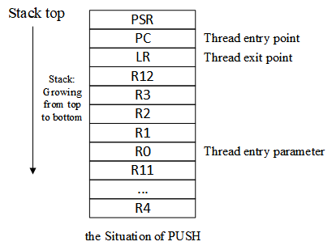
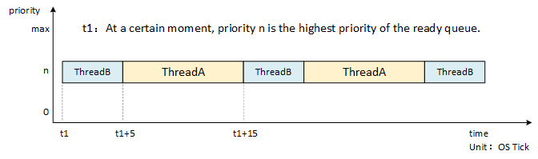

Thread Management
========================

When we are facing a big task in our daily life, we usually break it down into a number of simple, easy-to-manage smaller tasks. Then, we would deal with these smaller tasks one by one, gradually, the big task is worked out. In a multi-threaded operating system, developers also need to break down a complex application into multiple small, schedulable, and serialized program units. When tasks are reasonably divided and properly executed, this design allows the system to meet the capacity and time requirements of the real-time system. For example, to have the embedded system to perform such tasks, the system would collect data through sensors and display the data on the screen. In a multi-threaded real-time system, the task can be decomposed into two subtasks. The subtask, as shown in the following figure, reads the sensor data continuously and writes the data into the shared memory. The other subtask periodically reads the data from the shared memory and outputs the sensor data onto the screen.


In RT-Thread, the application entity corresponding to the above subtask is the thread. The thread is the carrier of the task. It is the most basic scheduling unit in RT-Thread. It describes the running environment of a task execution. It also describes the priority level of the task - an important task can be set a relatively high priority, while a non-important task can be set a lower priority, and different tasks can also be set to the same priority and take turns while running.

When a thread runs, it thinks it is has sole access to the CPU as it is running. The runtime environment when the thread executes is called the context, specifically each variables and data, including all register variables, stacks, memory information, and so on.

This chapter will be divided into five sections to introduce thread management in RT-Thread. After reading this chapter, readers will have a deeper understanding of the thread management mechanism of RT-Thread. They will have clear answers to questions like what states does a thread have, how to create a thread, why do idle threads exist, etc.

Thread Management Features
------------------

The main function of RT-Thread's thread management is to manage and schedule threads. There are two types of threads in the system, namely system threads and user threads. System threads are threads created by the RT-Thread kernel. User threads are the thread created by the application. Both types of threads will allocate thread objects from the kernel object container. When a thread is deleted, it will also be deleted from the object container. As shown in the following figure, each thread has important attributes, such as a thread control block, thread stack, entry function, and so on.


The thread scheduler of RT-Thread is preemptive and its main job is to find the highest priority thread from the list of ready threads so as to ensure that the highest priority thread can be run. Once the highest priority task is ready, it can always get the CPU usage it needs.

When a running thread makes the running condition ready for another thread with a higher priority, then the current running thread's CPU usage right is deprived, or in other words, released, and the high-priority thread immediately gets CPU access.

If it is the interrupt service routine that makes the running condition ready for the thread with a higher priority, when the interrupt is completed, the interrupted thread is suspended, the thread with the higher priority starts running.

When the scheduler schedules threads and switches them, the current thread context is first saved. When it is switched back to this thread, the scheduler restores the context information of the thread.

Working Mechanism of Thread
--------------

### Thread Control Block

In RT-Thread, the thread control block is represented by structure `struct rt_thread`, which is a data structure used by the operating system to manage threads. It stores information about the thread, such as priority, thread name, thread status, etc. It also includes a linked list structure for connecting threads, event collection of thread waiting, etc., which is defined as follows:

```c
/* Thread Control Block */
struct rt_thread
{
    /* rt Object */
    char        name[RT_NAME_MAX];      /* Thread Name */
    rt_uint8_t  type;                   /* Object Type */
    rt_uint8_t  flags;                  /* Flag Position */

    rt_list_t   list;                   /* Object List */
    rt_list_t   tlist;                  /* Thread List */

    /* Stack Pointer and Entry pointer */
    void       *sp;                      /* Stack Pointer */
    void       *entry;                   /* Entry Function Pointer */
    void       *parameter;               /* Parameter */
    void       *stack_addr;              /* Stack Address Pointer */
    rt_uint32_t stack_size;              /* Stack Size */

    /* Error Code */
    rt_err_t    error;                   /* Thread Error Code */
    rt_uint8_t  stat;                    /* Thread State */

    /* Priority */
    rt_uint8_t  current_priority;        /* Current Priority */
    rt_uint8_t  init_priority;           /* Initial Priority */
    rt_uint32_t number_mask;

    ......

    rt_ubase_t  init_tick;                /* Thread Initialization Count Value */
    rt_ubase_t  remaining_tick;           /* Thread Remaining Count Value */

    struct rt_timer thread_timer;               /* Built-in Thread Timer */

    void (*cleanup)(struct rt_thread *tid);     /* Thread Exit Clear Function */
    rt_uint32_t user_data;                      /* User Data */
};
```

`init_priority` is the thread priority specified when the thread was created, and will not be changed while the thread is running (unless the user executes the thread control function to manually adjust the thread priority). `cleanup` will be called back by the idle thread when the thread exits to perform the user-setup cleanup site and so on. The last member, `user_data`, can be used by the user to send some data into the thread control block to provide an implementation similar to thread private data.

### Thread Important Attributes

#### Thread Stack

RT-Thread's threads have a dependent stack. When the thread is switched, the context of the current thread is stored in the stack. When the thread is about to resume operation, the context information is read from the stack and recovered.

The thread stack is also used to store local variables in functions: local variables in functions are applied from the thread stack space; local variables in functions are initially allocated from registers (ARM architecture), when this function calls another function, these local variables will be placed on the stack.

For the first run of thread, the context can be constructed manually to set initial environment like: entry function (PC register), entry parameter (R0 register), return position (LR register), current machine operating status (CPSR register).

The growth direction of the thread stack is closely related to the CPU architecture. Versions before RT-Thread 3.1.0 only allow the stack to grow from high address to low address. For the ARM Cortex-M architecture, the thread stack can be constructed as shown below.



When setting the size for thread stack, a larger thread stack can be designed for an MCU with a relatively large resource pool; or a larger stack can be set initially, for example, a size of 1K or 2K bytes, then in FinSH, use `list_thread` command to check the size of the stack used by the thread during the running of the thread. With this command, you can see the maximum stack depth used by the thread from the start of the thread to the current point in time, and then add the appropriate margin to form the final thread stack size, and finally modify the size of the stack space.

#### Thread State

Only one thread is allowed to run on a processor at any time. Apart from the running process, threads have various different operating states, such as initial state, suspended state, ready state, etc. In RT-Thread, a thread can have five states, and the operating system would automatically adjust its state based on its running condition.

The five states of a thread in RT-Thread are shown in the following table:

| **States**      | **Description**                                              |
| --------------- | ------------------------------------------------------------ |
| Initial State   | Thread is in initial state when it has just been created but has not started running; in initial state, the thread does not participate in scheduling. In RT-Thread, the macro definition of this state is RT_THREAD_INIT |
| Ready State     | In ready state, the thread is queued according to priority, waiting to be executed; the processor is available again once the current thread is finished, and the operating system will then immediately find the ready thread with the highest priority to run. In RT-Thread, the macro definition of this state is RT_THREAD_READY |
| Running State   | Thread is currently running. In a single-core system, only the thread returned from the rt_thread_self() function is running; in a multi-core system, more than one thread may be running. In RT-Thread, the macro definition of this state is RT_THREAD_RUNNING |
| Suspended State | Also known as the blocking state. It may be suspended and paused because the resource is unavailable, or the thread is suspended because it is voluntarily delayed. In suspended state, threads do not participate in scheduling. In RT-Thread, the macro definition of this state is RT_THREAD_SUSPEND |
| Closed State    | It will be turned to closed state when the thread finishes running. The thread in closed state does not participate in the thread's scheduling. In RT-Thread, the macro definition of this state is RT_THREAD_CLOSE |

#### Thread Priority

The priority of the RT-Thread thread indicates the thread's priority of being scheduled. Each thread has its priority. The more important the thread, the higher priority it should be given, resulting in a higher chance of being scheduled.

RT-Thread supports a maximum of 256 thread priorities (0~255). The lower the number, the higher the priority, with 0 being the highest priority. In some systems with tight resources, you can choose system configurations that only support 8 or 32 priorities according to the actual situation; for the ARM Cortex-M series, 32 priorities are commonly used. The lowest priority is assigned to idle threads by default and is not used by users. In the system, when a thread with a higher priority is ready, the current thread with the lower priority will be swapped out immediately, and the high-priority thread will preempt the processor.

#### Time Slice

Each thread has a time slice parameter, but time slice is only valid for ready-state threads of the same priority. The system schedules the ready-state threads with the same priority using time slice rotation scheduling method. In this case, time slice plays the role of constraining thread's single running time and the unit is a system tick (OS Tick). Suppose there are 2 ready-state threads, A and B with the same priority. Time slice of A thread is set to 10, and time slice of B thread is set to 5. When there is no ready-state thread with higher priority than A in the system, the system will switch back and forth between thread A and B. Each time the system performs 10 OS Ticks on thread A, and 5 OS Ticks on thread B, as shown below.



#### Thread Entry Function

"Entry" in Thread Control Block is the thread's entry function, which is the thread's main function. The thread's entry function is created by the user. There are generally two forms of code:

**Infinite Loop Mode**：

In real-time systems, threads are usually passive: this is determined by the characteristics of real-time systems, which usually wait for external events to occur, and then perform the appropriate services:

```c
void thread_entry(void* parameter)
{
    while (1)
    {
    /* Wait for an event to occur */

    /* Serve and process events */
    }
}
```

It may seem that threads have no restrictions on program execution and that all operations can be performed. But as a real-time system, with clear priorities, if a program in a thread is stuck in an infinite loop, then threads with a lower priorities will not be executed. Therefore, one thing that must be noted in the real-time operating system is that the thread cannot be stuck in an infinite loop operation, and there must be an action to relinquish the use of the CPU, such as calling a delay function in the loop or actively suspending. The purpose of user designing a infinite loop thread is to let this thread be continuously scheduled and run by the system and never be deleted.

**Sequential Execution or Finite-Cycle Mode**:

With simple sequential statements, such as `while()` or `for()` loop, etc., these threads will not cycle or permanently loop. They can be described as a "one-off" threads and will surely be executed. After it finished executing, the thread will be automatically deleted by the system.

```c
static void thread_entry(void* parameter)
{
    /* Processing Transaction #1 */
    …
    /* Processing Transaction #2 */
    …
    /* Processing Transaction #3 */
}
```

#### Thread Error Code

Each thread is one execution scenario. Error codes are closely related to the execution environment, so each thread is equipped with a variable to store the error code. These error codes are as follows:

```c
#define RT_EOK           0 /* No error     */
#define RT_ERROR         1 /* Regular error     */
#define RT_ETIMEOUT      2 /* Timeout error     */
#define RT_EFULL         3 /* Resource is full     */
#define RT_EEMPTY        4 /* No resource     */
#define RT_ENOMEM        5 /* No memory     */
#define RT_ENOSYS        6 /* System does not support     */
#define RT_EBUSY         7 /* System busy     */
#define RT_EIO           8 /* IO error       */
#define RT_EINTR         9 /* Interrupt system call   */
#define RT_EINVAL       10 /* Invalid Parameter      */
```

### Switching Thread State

RT-Thread provides a set of operating system call interfaces that make the state of a thread to switch back and forth between these five states. The conversion relationship between these states is shown in the following figure:


Threads enter the initial state (RT_THREAD_INIT) by calling the functions `rt_thread_create()` or `rt_thread_init()`; threads in the initial state enter the ready state (RT_THREAD_READY) by calling the function `rt_thread_startup()`; threads in the ready state are scheduled by the scheduler and enter the running state (RT_THREAD_RUNNING). When a running thread calls a function such as `rt_thread_delay()`, `rt_sem_take()`, `rt_mutex_take()`, `rt_mb_recv()` or fails to get resources, it will enter the suspended state (RT_THREAD_SUSPEND); if a thread in suspended state waits until timeout and still doesn't acquire the resources, or other threads release the resources, it will return to the ready state.

If a thread in suspended state calls the functions `rt_thread_delete()` or `rt_thread_detach()`, it will switch to the closed state (RT_THREAD_CLOSE); as for thread in the running state, if the operation is completed, the function `rt_thread_exit()` will be executed at the last part of the thread to change its state into the closed state.

>In RT-Thread, a thread does not actually have a running state; the ready state and the running state are equivalent.

### System thread

As mentioned previously, system threads refers to threads created by the system and user threads are threads created by the user program calling the thread management interface. System threads In RT-Thread kernel include the idle thread and the main thread.

#### Idle Thread

An idle thread is the lowest priority thread created by the system, and its thread state is always ready. When no other ready thread exists in the system, the scheduler will schedule the idle thread, which is usually an infinite loop and can never be suspended. In addition, idle threads have special functions in RT-Thread:

If a thread finishes running, the system will automatically delete the thread by executing the function `rt_thread_exit()`, first removing the thread from the system ready queue, then changing the state of the thread to the closed state which means it no longer participates in system scheduling, and then suspend it into the `rt_thread_defunct` queue (a thread queue that is not reclaimed and in a closed state). Lastly, the idle thread reclaims the resources of the deleted thread.

The idle thread also provides an interface to run a hook function set by the user. The hook function is called when idle thread is running, which is suitable for operations like hooking into power management, watchdog feeding, etc.

#### Main Thread

When the system starts, it will create the main thread. Its entry function is `main_thread_entry()`. User's application entry function `main()` starts from here. After the system scheduler starts, the main thread starts running. The process is as follows. Users can add their own application initialization code to the `main()` function.


Thread Management
--------------

The first two sections of this chapter conceptually explain the function and working mechanism of threads. This section will delve into the various interfaces of threads and give some source code to help the reader understand threads.

The following figure depicts related operations to threads, including creating / initializing threads, starting threads, running threads, deleting / detaching threads. You can use `rt_thread_create()` to create a dynamic thread and `rt_thread_init()` to initialize a static thread. The difference between a dynamic thread and a static thread is that for a dynamic thread, the system automatically allocates stack space and thread handles from the dynamic memory heap (only after initializing the heap can the system create a dynamic thread). As for static threads, it is the user that allocates the stack space and the thread handle.


### Create and Delete Thread

To become an executable object, a thread must be created by the kernel of the operating system. You can create a dynamic thread through the following interface:

```c
rt_thread_t rt_thread_create(const char* name,
                            void (*entry)(void* parameter),
                            void* parameter,
                            rt_uint32_t stack_size,
                            rt_uint8_t priority,
                            rt_uint32_t tick);
```

When this function is called, the system will allocate a thread handle from the dynamic heap memory and allocate the corresponding space from the dynamic heap memory according to the stack size specified in the parameter. The allocated stack space is aligned in RT_ALIGN_SIZE mode configured in rtconfig.h. The parameters and return values of the thread creation `rt_thread_create()` are as follows:

|Parameters  |Description                             |
|------------|----------------------------------------------------------------------------------------|
| name       | The name of the thread; the maximum length of the thread name is specified by macro RT_NAME_MAX in rtconfig.h, and the extra part is automatically truncated. |
| entry      | Thread entry function. |
| parameter  | Thread entry function's parameter.           |
| stack_size | Thread stack size in bytes.                       |
| priority   | Priority of the thread. The priority range is based on the system configuration (macro definition RT_THREAD_PRIORITY_MAX in rtconfig.h). If 256-level priority is supported, then the range is from 0 to 255. The smaller the value, the higher the priority, and 0 is the highest priority. |
| tick       | The time slice size of the thread. The unit of the time slice (tick) is the tick of the operating system. When there are threads with the same priority in the system, this parameter specifies the maximum length of time of a thread for one schedule. At the end of this time slice run, the scheduler automatically selects the next ready state of the same priority thread to run. |
|**Return**  | ——                                                                                           |
| thread     | Thread creation succeeds, return thread handle.                   |
| RT_NULL    | Failed to create thread.                                    |

For some threads created with `rt_thread_create()`, when not needed or when an error occurs, one can use the following function interface to completely remove the thread from the system:

```c
rt_err_t rt_thread_delete(rt_thread_t thread);
```

After calling this function, the thread object will be moved out of the thread list and removed from the kernel object manager. Consequently, the stack space occupied by the thread will also be freed, and the reclaimed space will be reused for other memory allocations. In fact, using the `rt_thread_delete()` function to delete the thread interface is just changing the corresponding thread state to RT_THREAD_CLOSE state and then putting it into rt_thread_defunct queue; the actual delete action (releasing the thread control block and releasing the thread stack) needs to be completed later by an idle thread when it is being executed. 

### Thread deletion 

The parameters and return values of thread deleting `rt_thread_delete()` interface are shown in the following table:

|**Parameter**  |**Description**        |
|------------|------------------|
| thread     | Thread handles to delete |
|**Return**  | ——               |
| RT_EOK     | Delete thread successfully. |
| \-RT_ERROR | Failed to delete thread. |

This function is only valid when the system dynamic heap is enabled (meaning RT_USING_HEAP macro definition is already defined).

### Initialize and Detach Thread

The initialization of a thread can be done using the following function interface, to initialize a static thread object:

```c
rt_err_t rt_thread_init(struct rt_thread* thread,
                        const char* name,
                        void (*entry)(void* parameter), void* parameter,
                        void* stack_start, rt_uint32_t stack_size,
                        rt_uint8_t priority, rt_uint32_t tick);
```

The thread handle of the static thread (in other words, the thread control block pointer) and the thread stack are provided by the user. A static thread means that the thread control block and the thread running stack are generally set to global variables, which are determined and allocated when compiling. The kernel is not responsible for dynamically allocating memory space. It should be noted that the user-provided stack starting address needs to be system aligned (for example, 4-byte alignment is required on ARM). The parameters and return values of the thread initialization interface `rt_thread_init()` are as follows:

|**Parameter**   |**Description**                                                                                                                                                                                                        |
|-----------------|---------------------------------------------------------------------------|
| thread      | Thread handle. Thread handle is provided by the user and points to the corresponding thread control block memory address.                    |
| name        | Name of the thread; the maximum length of the thread name is specified by the RT_NAME_MAX macro defined in rtconfig.h, and the extra part is automatically truncated. |
| entry       | Thread entry function.                                                                                                                                                                              |
| parameter   | Thread entry function parameter.                                                                                                                                                                |
| stack_start | Thread stack start address                                                                                                                                                                     |
| stack_size  | Thread stack size in bytes. Stack space address alignment is required in most systems (for example, alignment to 4-byte addresses in the ARM architecture) |
| priority    | The priority of the thread. The priority range is based on the system configuration (macro definition RT_THREAD_PRIORITY_MAX in rtconfig.h). If 256 levels of priority are supported, the range is from 0 to 255. The smaller the value, the higher the priority, and 0 is the highest priority. |
| tick        | The time slice size of the thread. The unit of the time slice (tick) is the tick of the operating system. The unit of the time slice (tick) is the tick of the operating system. When there are threads with the same priority in the system, this parameter specifies the maximum length of time of a thread for one schedule. At the end of this time slice run, the scheduler automatically selects the next ready state of the same priority thread to run. |
|**Return**   | ——      |
| RT_EOK      | Thread creation succeeds. |
| \-RT_ERROR  | Failed to create thread. |

For threads initialized with `rt_thread_init()`, using `rt_thread_detach()` will cause the thread object to be detached from the thread queue and kernel object manager. The detach thread function is as follows:

```c
rt_err_t rt_thread_detach (rt_thread_t thread);
```

Parameters and return values of the thread detached from the interface `rt_thread_detach()` are as follows:

|**Parameters**  |**Description**                                                  |
|------------|------------------------------------------------------------|
| thread     | Thread handle, which should be the thread handle initialized by rt_thread_init. |
|**Return**  | ——                                                         |
| RT_EOK     | Thread detached successfully.                  |
| \-RT_ERROR | Thread detachment failed.                      |

This function interface corresponds to the `rt_thread_delete()` function. The object operated by the rt_thread_delete() function is the handle created by rt_thread_create(), and the object operated by the rt_thread_detach() function is the thread control block initialized with the rt_thread_init() function. Again, the thread itself should not call this interface to detach thread itself.

### Start Thread

The thread created (initialized) is in initial state and does not enter the scheduling queue of the ready thread. We can call the following function interface to make the thread enter the ready state after the thread is initialized/created successfully:

```c
rt_err_t rt_thread_startup(rt_thread_t thread);
```

When this function is called, the state of the thread is changed to the ready state and placed in the corresponding priority queue for scheduling. If the newly started thread has a higher priority than the current thread, it will immediately switch to the new thread. The parameters and return values of the thread start interface `rt_thread_startup()` are as follows:

|**Parameter**  |**Description**    |
|------------|--------------|
| thread     | Thread handle. |
|**Return**  | ——           |
| RT_EOK     | Thread started successfully. |
| \-RT_ERROR | Thread start failed. |

### Obtaining Current Thread

During the running of the program, the same piece of code may be executed by multiple threads. At the time of execution, the currently executed thread handle can be obtained through the following function interface:

```c
rt_thread_t rt_thread_self(void);
```

The return value of this interface is shown in the following table:

|**Return**|**Description**            |
|----------|----------------------|
| thread   | The currently running thread handle. |
| RT_NULL  | Failed, the scheduler has not started yet. |

### Making Thread Release Processor Resources

When the current thread's time slice runs out or the thread actively requests to release the processor resource, it will no longer occupy the processor, and the scheduler will select the next thread of the same priority to execute. After the thread calls this interface, the thread is still in the ready queue. The thread gives up the processor using the following function interface:

```c
rt_err_t rt_thread_yield(void);
```

After calling this function, the current thread first removes itself from its ready priority thread queue, then suspends itself to the end of the priority queue list, and then activates the scheduler for thread context switching (if there is no other thread with the same priority, then this thread continues to execute without context switching action).

The `rt_thread_yield()` function is similar to the `rt_schedule()` function, but the behavior of the system is completely different when other ready-state threads of the same priority exist. After executing the `rt_thread_yield()` function, the current thread is swapped out and the next ready thread of the same priority will be executed. After the `rt_schedule()` function is executed, the current thread is not necessarily swapped out. Even if it is swapped out, it will not be placed at the end of the ready thread list. Instead, the thread with the highest priority is selected in the system and executed. If there is no thread in the system with a higher priority than the current thread, the system will continue to execute the current thread after the `rt_schedule()` function is executed.

### Thread Sleep

In practical applications, we sometimes need to delay the current thread running for a period of time and re-run at a specified time. This is called "thread sleep". Thread sleep can use the following three function interfaces:

```c
rt_err_t rt_thread_sleep(rt_tick_t tick);
rt_err_t rt_thread_delay(rt_tick_t tick);
rt_err_t rt_thread_mdelay(rt_int32_t ms);
```

These three function interfaces have the same effect. Calling them can cause the current thread to suspend for a specified period of time. After, the thread will wake up and enter the ready state again. This function accepts a parameter that specifies the sleep time of the thread. The parameters and return values of the thread sleep interface rt_thread_sleep/delay/mdelay() are as follows:

|**Parameters**|Description                                                    |
| -------- | ------------------------------------------------------------ |
| tick/ms  | Thread sleep time：<br>The input parameter tick of rt_thread_sleep/rt_thread_delay is in units of 1 OS Tick; <br>The input parameter ms of rt_thread_mdelay is in units of 1ms; |
|**Return**| ——                                                           |
| RT_EOK   | Successful operation.                                |

### Suspend and Resume Thread

When a thread calls `rt_thread_delay()`, the thread will voluntarily suspend; when a function such as `rt_sem_take()`, `rt_mb_recv()` is called, the resource is not available for use and will cause the thread to suspend. A thread in a suspended state, if it waits for resources longer than the set time, then the thread will no longer wait for these resources and will return to the ready state; or, when other threads release the resource the thread is waiting for, the thread will also return to the ready state.

The thread suspends using the following function interface:

```c
rt_err_t rt_thread_suspend (rt_thread_t thread);
```

The parameters and return values of the thread suspend interface `rt_thread_suspend()` are shown in the following table:

|**Parameters**  |Description                                    |
|------------|----------------------------------------------|
| thread     | Thread handle.                       |
|**Return**  | ——                                           |
| RT_EOK     | Thread suspends successfully  |
| \-RT_ERROR | Thread suspension failed because the thread is not in ready state. |

>Generally, you should not use this function to suspend the thread itself, if you really need to use rt_thread_suspend() to suspend the current task, immediately after calling function rt_thread_suspend(),  rt_schedule() needs to be called.

   Functions' context switch is achieved manually. User only needs to understand the role of the interface, which is not recommended.

To resume a thread is to let the suspended thread re-enter the ready state and put the thread into the system's ready queue. Thread resuming uses the following function interface:

```c
rt_err_t rt_thread_resume (rt_thread_t thread);
```

The parameters and return values of the thread recovery interface `rt_thread_resume()` are as follows:

|Parameter  |**Description**                                                     |
|------------|---------------------------------------------------------------|
| thread     | Thread handle.                                        |
|**Return**  | ——                                                            |
| RT_EOK     | Thread resumed successfully.                  |
| \-RT_ERROR | Thread recovery failed because the state of the thread is not RT_THREAD_SUSPEND state |

### Control Thread

When you need other control over a thread, such as dynamically changing the priority of a thread, you can call the following function interface:

```c
rt_err_t rt_thread_control(rt_thread_t thread, rt_uint8_t cmd, void* arg);
```

The parameters and return values of the thread control interface rt_thread_control() are as follows:

|Function Parameters|**Description**    |
|--------------|--------------|
| thread       | Thread handle. |
| cmd          | Control command demand. |
| arg          | Control parameter. |
|**Return**    | ——           |
| RT_EOK       | Control execution is correct. |
| \-RT_ERROR   | Failure. |

Demands supported by control command demand cmd include:

•RT_THREAD_CTRL_CHANGE_PRIORITY：dynamically change the priority of a thread;

•RT_THREAD_CTRL_STARTUP：Start running a thread, equivalent to the `rt_thread_startup()` function call;

•RT_THREAD_CTRL_CLOSE：Close a thread, equivalent to the `rt_thread_delete()` function call.

### Set and Delete Idle Hooks

The idle hook function is a hook function of the idle thread. If the idle hook function is set, the idle hook function can be automatically executed to perform other things, such as the LED of system indicator , when the system executes the idle thread. The interface for setting/deleting idle hooks is as follows:

```c
rt_err_t rt_thread_idle_sethook(void (*hook)(void));
rt_err_t rt_thread_idle_delhook(void (*hook)(void));
```

Input parameters and return values of setting idle hook function `rt_thread_idle_sethook()` are as shown in the following table:

|**Function Parameters**|Description      |
|--------------|----------------|
| hook         | Set hook function. |
|**Return**    | ——             |
| RT_EOK       | Set Successfully. |
| \-RT_EFULL   | Set fail. |

Input parameters and return values of deleting the idle hook function `rt_thread_idle_delhook()` are as shown in the following table:

|Function Parameters|Description      |
|--------------|----------------|
| hook         | Deleted hook function. |
|**Return**    | ——             |
| RT_EOK       | Successfully deleted. |
| \-RT_ENOSYS  | Failed to delete. |

>An idle thread is a thread whose state is always ready. Therefore, hook function must ensure that idle threads will not be suspended at any time. Functions like rt_thread_delay(), rt_sem_take(), etc can't be used because they may cause the thread to suspend.

### Set the Scheduler Hook

During the time when the system is running, it is in the process of thread running, interrupt triggering, responding to interrupts, switching to other threads, and switching between threads. In other words, context switching is the most common event in the system. Sometimes the user may want to know what kind of thread switch has occurred at times, you can set a corresponding hook function by calling the following function interface. This hook function will be called when the system thread switches:

```c
void rt_scheduler_sethook(void (*hook)(struct rt_thread* from, struct rt_thread* to));
```

Input parameters for setting the scheduler hook function are shown in the following table:

|**Function Parameters**|Description                  |
|--------------|----------------------------|
| hook         | Represents a user-defined hook function pointer |

Hook function `hook()` is declared as follows:

```c
void hook(struct rt_thread* from, struct rt_thread* to);
```

Input parameters for the scheduler hook function hook() are shown in the following table:

|Function Parameters|**Description**                          |
|--------------|------------------------------------|
| from         | Indicates the thread control block pointer that the system wants to switch out |
| to           | Indicates the thread control block pointer that the system wants to switch out |

>Please carefully compile your hook function, any carelessness is likely to cause the entire system to run abnormally (in this hook function, it is basically not allowed to call the system API, and should not cause the current running context to suspend).

Thread Application Sample
------------

An application example in Keil simulator environment is given below.

### Create Thread Sample

This sample is creating a dynamic thread and initializing a static thread. A thread is automatically deleted by the system after it has finished running. The other thread is always printing the counts, as follows:

```c
#include <rtthread.h>

#define THREAD_PRIORITY         25
#define THREAD_STACK_SIZE       512
#define THREAD_TIMESLICE        5

static rt_thread_t tid1 = RT_NULL;

/* Entry Function for Thread 1 */
static void thread1_entry(void *parameter)
{
    rt_uint32_t count = 0;

    while (1)
    {
        /* Thread 1 runs with low priority and prints the count value all the time */
        rt_kprintf("thread1 count: %d\n", count ++);
        rt_thread_mdelay(500);
    }
}

ALIGN(RT_ALIGN_SIZE)
static char thread2_stack[1024];
static struct rt_thread thread2;
/* Entry for Thread 2 */
static void thread2_entry(void *param)
{
    rt_uint32_t count = 0;

    /* Thread 2 has a higher priority to preempt thread 1 and get executed */
    for (count = 0; count < 10 ; count++)
    {
        /* Thread 2 prints count value */
        rt_kprintf("thread2 count: %d\n", count);
    }
    rt_kprintf("thread2 exit\n");
    /* Thread 2 will also be automatically detached from the system after it finishes running. */
}

/* Thread Sample */
int thread_sample(void)
{
    /* Creat thread 1, Name is thread1，Entry is thread1_entry */
    tid1 = rt_thread_create("thread1",
                            thread1_entry, RT_NULL,
                            THREAD_STACK_SIZE,
                            THREAD_PRIORITY, THREAD_TIMESLICE);

    /* Start this thread if you get the thread control block */
    if (tid1 != RT_NULL)
        rt_thread_startup(tid1);

    /* Creat thread 2, Name is thread2，Entry is thread2_entry */
    rt_thread_init(&thread2,
                   "thread2",
                   thread2_entry,
                   RT_NULL,
                   &thread2_stack[0],
                   sizeof(thread2_stack),
                   THREAD_PRIORITY - 1, THREAD_TIMESLICE);
    rt_thread_startup(&thread2);

    return 0;
}

/* Export to msh command list */
MSH_CMD_EXPORT(thread_sample, thread sample);
```

The simulation results are as follows:

```
\ | /
- RT -     Thread Operating System
 / | \     3.1.0 build Aug 24 2018
 2006 - 2018 Copyright by rt-thread team
msh >thread_sample
msh >thread2 count: 0
thread2 count: 1
thread2 count: 2
thread2 count: 3
thread2 count: 4
thread2 count: 5
thread2 count: 6
thread2 count: 7
thread2 count: 8
thread2 count: 9
thread2 exit
thread1 count: 0
thread1 count: 1
thread1 count: 2
thread1 count: 3
…
```

When thread 2 counts to a certain value, it will stop running. Then thread 2 is automatically deleted by the system, and therefore the counting stops. Thread 1 prints the count all the time.

>About deleting threads: Most threads are executed cyclically without needing to be deleted. For thread that can finish running, RT-Thread automatically deletes the thread after the thread finishes running, and deletes it in rt_thread_exit(). User only needs to understand the role of the interface. It is not recommended to use this interface (this interface can be called by other threads or call this interface in the timer timeout function to delete a thread which is not used very often).

### Thread Time Slice Round-Robin Scheduling Sample

This sample is creating two threads that will always print counts when executing, as follows:

```c
#include <rtthread.h>

#define THREAD_STACK_SIZE   1024
#define THREAD_PRIORITY     20
#define THREAD_TIMESLICE    10

/* Thread Entry */
static void thread_entry(void* parameter)
{
    rt_uint32_t value;
    rt_uint32_t count = 0;

    value = (rt_uint32_t)parameter;
    while (1)
    {
        if(0 == (count % 5))
        {
            rt_kprintf("thread %d is running ,thread %d count = %d\n", value , value , count);

            if(count> 200)
                return;
        }
         count++;
     }
}

int timeslice_sample(void)
{
    rt_thread_t tid = RT_NULL;
    /* Create Thread 1 */
    tid = rt_thread_create("thread1",
                            thread_entry, (void*)1,
                            THREAD_STACK_SIZE,
                            THREAD_PRIORITY, THREAD_TIMESLICE);
    if (tid != RT_NULL)
        rt_thread_startup(tid);


    /* Create Thread 2 */
    tid = rt_thread_create("thread2",
                            thread_entry, (void*)2,
                            THREAD_STACK_SIZE,
                            THREAD_PRIORITY, THREAD_TIMESLICE-5);
    if (tid != RT_NULL)
        rt_thread_startup(tid);
    return 0;
}

/* Export to msh command list */
MSH_CMD_EXPORT(timeslice_sample, timeslice sample);
```

The simulation results are as follows:

```
 \ | /
- RT -     Thread Operating System
 / | \     3.1.0 build Aug 27 2018
 2006 - 2018 Copyright by rt-thread team
msh >timeslice_sample
msh >thread 1 is running ,thread 1 count = 0
thread 1 is running ,thread 1 count = 5
thread 1 is running ,thread 1 count = 10
thread 1 is running ,thread 1 count = 15
…
thread 1 is running ,thread 1 count = 125
thread 1 is rthread 2 is running ,thread 2 count = 0
thread 2 is running ,thread 2 count = 5
thread 2 is running ,thread 2 count = 10
thread 2 is running ,thread 2 count = 15
thread 2 is running ,thread 2 count = 20
thread 2 is running ,thread 2 count = 25
thread 2 is running ,thread 2 count = 30
thread 2 is running ,thread 2 count = 35
thread 2 is running ,thread 2 count = 40
thread 2 is running ,thread 2 count = 45
thread 2 is running ,thread 2 count = 50
thread 2 is running ,thread 2 count = 55
thread 2 is running ,thread 2 count = 60
thread 2 is running ,thread 2 cunning ,thread 2 count = 65
thread 1 is running ,thread 1 count = 135
…
thread 2 is running ,thread 2 count = 205
```

As can be seen from the running count results, thread 2 runs half the time of thread 1.

### Thread Scheduler Hook Sample

When thread is scheduling switch, it executes the schedule. We can set a scheduler hook so that we can do other things when the thread is being switched. This sample is printing switch information between the threads in the scheduler hook function, as shown in the following code.

```c
#include <rtthread.h>

#define THREAD_STACK_SIZE   1024
#define THREAD_PRIORITY     20
#define THREAD_TIMESLICE    10

/* Counter for each thread */
volatile rt_uint32_t count[2];

/* Threads 1, 2 share an entry, but the entry parameters are different */
static void thread_entry(void* parameter)
{
    rt_uint32_t value;

    value = (rt_uint32_t)parameter;
    while (1)
    {
        rt_kprintf("thread %d is running\n", value);
        rt_thread_mdelay(1000); // Delay for a while
    }
}

static rt_thread_t tid1 = RT_NULL;
static rt_thread_t tid2 = RT_NULL;

static void hook_of_scheduler(struct rt_thread* from, struct rt_thread* to)
{
    rt_kprintf("from: %s -->  to: %s \n", from->name , to->name);
}

int scheduler_hook(void)
{
    /* Set the scheduler hook */
    rt_scheduler_sethook(hook_of_scheduler);

    /* Create Thread 1 */
    tid1 = rt_thread_create("thread1",
                            thread_entry, (void*)1,
                            THREAD_STACK_SIZE,
                            THREAD_PRIORITY, THREAD_TIMESLICE);
    if (tid1 != RT_NULL)
        rt_thread_startup(tid1);

    /* Create Thread 2 */
    tid2 = rt_thread_create("thread2",
                            thread_entry, (void*)2,
                            THREAD_STACK_SIZE,
                            THREAD_PRIORITY,THREAD_TIMESLICE - 5);
    if (tid2 != RT_NULL)
        rt_thread_startup(tid2);
    return 0;
}

/* Export to msh command list */
MSH_CMD_EXPORT(scheduler_hook, scheduler_hook sample);
```

The simulation results are as follows:

```
 \ | /
- RT -     Thread Operating System
 / | \     3.1.0 build Aug 27 2018
 2006 - 2018 Copyright by rt-thread team
msh > scheduler_hook
msh >from: tshell -->  to: thread1
thread 1 is running
from: thread1 -->  to: thread2
thread 2 is running
from: thread2 -->  to: tidle
from: tidle -->  to: thread1
thread 1 is running
from: thread1 -->  to: tidle
from: tidle -->  to: thread2
thread 2 is running
from: thread2 -->  to: tidle
…
```

It can be seen from the simulation results that when the threads are being switched, the set scheduler hook function is working normally and printing the information of the thread switching, including switching to the idle thread.
