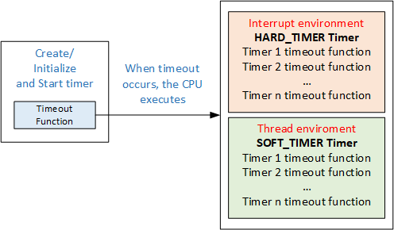
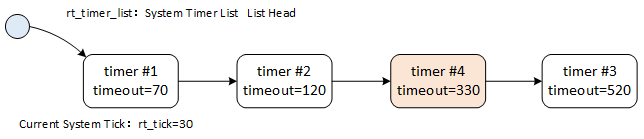

Clock Management
========

The concept of time is very important. You need to set a time to go out with friends and it takes time to complete tasks. Life is inseparable from time. The same is true for operating systems, which require time to regulate the execution of their tasks. The smallest time unit in operating system is clock tick (OS Tick). This chapter focuses on introduction of clock ticks and clock-based timers. After reading this chapter, we will learn how clock ticks are generated and how to use RT-Thread timers.

Clock Tick(OS Tick)
--------

Any operating system needs to provide a clock tick for the system to handle all time-related events, such as thread latency, thread time slice rotation scheduling, timer timeout, etc. Clock tick is a specific periodic interrupt. This interrupt can be regarded as the system heartbeat. The time interval between interrupts depends on different applications, generally it is 1ms–100ms. The faster the clock tick rate, the greater the overhead of the system. The number of clock ticks counted from the start of the system is called the system time.

In RT-Thread, the length of clock tick can be adjusted according to the value of RT_TICK_PER_SECOND, which is equal to 1/RT_TICK_PER_SECOND second.

### Clock Tick Implementation

Clock tick is generated by a hardware timer configured in interrupt trigger mode.  `void rt_tick_increase(void)` will be called when an interrupt occurs,notifying the operating system that a system clock has passed; different hardware driver have different timer interrupt implementations. Here is an example of using STM32 `SysTick_Handler` to achieve clock Tick.

```c
void SysTick_Handler(void)
{
    /* Entry Interrupt*/
    rt_interrupt_enter();
    ……
    rt_tick_increase();
    /* Leave Interrupt */
    rt_interrupt_leave();
}
```

Call `rt_tick_increase()` in interrupt function to self-add global variable rt_tick. The code is as follows:

```c
void rt_tick_increase(void)
{
    struct rt_thread *thread;

    /* Global variable rt_tick self-add */
    ++ rt_tick;

    /* Check time slice */
    thread = rt_thread_self();

    -- thread->remaining_tick;
    if (thread->remaining_tick == 0)
    {
        /* Re-assign initial value */
        thread->remaining_tick = thread->init_tick;

        /* Thread suspends */
        rt_thread_yield();
    }

    /* Check time slice */
    rt_timer_check();
}
```

You can see that global variable rt_tick is incremented by one on every clock tick.  The value of rt_tick indicates the total number of clock ticks that the system has elapsed since it started, that is, system time. In addition, on every clock tick, whether the current thread's time slice is exhausted and whether there is a timer timeout will be checked.

>In interrupt, rt_timer_check()  is used to check the system hardware timer linked list. If there is a timer timeout, the corresponding timeout function will be called. All timers are removed from the timer linked list if it timed out, and periodic timer is added to the timer linked list when it is started again.

### Obtain Clock Tick

Since global variable rt_tick is incremented by one on every clock tick, the value of the current rt_tick will be returned by calling `rt_tick_get`, which is the current clock tick value. This interface can be used to record the length of time a system is running, or to measure the time it takes for a task to run. The interface function is as follows:

```c
rt_tick_t rt_tick_get(void);
```

The following table describes the return values of `rt_tick_get()` function:

|**R**eturn|Description      |
|----------|----------------|
| rt_tick  | Current clock tick value |

Timer Management
----------

Timer refers to triggering an event after a certain specified time from a specified moment, for example, setting a timer to wake up yourself the next morning. Timer includes hardware timer and software timer:

1) **Hardware timer** is the timing function provided by the chip itself. The hardware timer can be used by configuring the timer module into a timer mode and setting the time. Hardware timer is accurate to nanosecond precision, and is interrupt trigger mode.

2) **Software timer** is a type of system interface provided by the operating system. It is built on the basis of the hardware timer to enable the system to provide a timer service with no constraint on numbers.

RT-Thread operating system provides software-implemented timers in units of clock tick (OS Tick), that is, the timing value must be an integer multiple of OS Tick. For example, an OS Tick is 10ms, then the software timer can only be timed 10ms, 20ms, 100ms, etc., but not 15ms. RT-Thread timer is also based on the clock tick, providing timing capabilities based on integral multiples of the clock tick.

### RT-Thread Timer Introduction

RT-Thread timer provides two types of timer mechanisms: the first type is a one-shot timer, which only triggers a timer event for onetime after startup, and then the timer stops automatically. The second type is a periodic trigger timer, which periodically triggers a timer event until the user manually stops it, otherwise it will continue to execute forever.

In addition, according to the context in which the timeout function is executed, RT-Thread timer can be divided into HARD_TIMER mode and SOFT_TIMER mode, as shown in the following figure.



#### HARD_TIMER Mode

The timer timeout function of HARD_TIMER mode is executed in the interrupt context and can be specified with the parameter RT_TIMER_FLAG_HARD_TIMER when initializing/creating the timer.

When executed in interrupt context, the requirements for timeout function are the same as those for the interrupt service routine: execution time should be as short as possible, and the execution should not cause the current context to suspend and wait. For example, a timeout function executed in an interrupt context should not attempt to apply for dynamic memory, free dynamic memory, etc.

The default mode of RT-Thread timer is HARD_TIMER mode which means after the timer timeout, the timeout function runs in the context of the system clock interrupt. The execution mode in the interrupt context determines that the timer's timeout function should not call any system function that will cause the current context to suspend; nor can it be executing for a very long time, otherwise the response time of other interrupts will be lengthened or the running time of other threads will be preempted.

#### SOFT_TIMER Mode

The SOFT_TIMER mode is configurable and macro definition RT_USING_TIMER_SOFT is used to determine whether the mode should be enabled. When this mode is enabled, the system will create a timer thread at initialization, and then the timer timeout function of SOFT_TIMER mode will be executed in the context of the timer thread. SOFT_TIMER mode can be specified using the parameter RT_TIMER_FLAG_SOFT_TIMER when initializing/creating the timer.

### Timer Working Mechanism

The following is an example to illustrate the working mechanism of RT-Thread timer. Two important global variables are maintained in the RT-Thread timer module:

 (1)  Elapsed tick time of the current system rt_tick (when hardware timer interrupt comes, it will add 1);

 (2)  Timer linked list `rt_timer_list`. Newly created and activated timers of the system are inputted into the `rt_timer_list` linked list in a timeout-ordered manner.

As shown in the figure below, the current tick value of the system is 20. In the current system, three timers have been created and started, which are Timer1 with 50 ticks set time, Timer2 with 100 ticks, and Timer3 with 500 ticks. Current time of the system rt_tick=20 is added respectively on these three timers and they are linked from small to large in the rt_timer_list linked list, forming a timer linked list structure as shown in the figure.


Along with the trigger of the hardware timer, `rt_tick` has been increasing (rt_tick variable is incremented by 1 every time the hardware timer is interrupted). After 50 tick, rt_tick is increased from 20 to 70, which is equal to the timeout value of Timer1. Then, timeout functions associated with the Timer1 timer will be triggered and Timer1 from the rt_timer_list linked list will be removed. Similarly, after 100 ticks and 500 ticks, timeout functions associated with Timer2 and Timer3 are triggered, and  timers of Time2 and Timer3 will be removed from the rt_timer_list linked list.

If after system's 10 ticks (current rt_tick=30),  a new task has created Timer4 with 300 ticks, so the Timer4's timeout is equal to rt_tick add 300, that is 330. Timer4 will be inserted in between Timer2 and Timer3, forming a linked list structure shown below:



#### Timer Control Block

In RT-Thread operating system, timer control block is defined by structure `struct rt_timer` and forms a timer kernel object, which is then linked to the kernel object container for management. It is a data structure used by the operating system to manage timers. It stores information about timers, such as the initial number of ticks, the number of timeout ticks, the linked list structure used to connect timers, timeout callback functions, etc.

```c
struct rt_timer
{
    struct rt_object parent;
    rt_list_t row[RT_TIMER_SKIP_LIST_LEVEL];  /* Timer Linked List Node */

    void (*timeout_func)(void *parameter);     /* Timeout Function */
    void      *parameter;                      /* Parameters of Timeout Function  */
    rt_tick_t init_tick;                       /* Timer Initial Timeout Ticks */
    rt_tick_t timeout_tick;                    /* Number of ticks when the timer actually times out */
};
typedef struct rt_timer *rt_timer_t;
```

Timer control block is defined by  structure `struct rt_timer` and forms a timer kernel object, which is then linked to the kernel object container for management. The `list` member is used to link an active (already started) timer to the `rt_timer_list` linked list.

#### Timer Skip List Algorithm

In the introduction of working mechanics of the timer above, we have talked about that the newly created and activated timers are inserted into the rt_timer_list linked list in the order of the timeout, that is, rt_timer_list linked list is an ordered list. RT-Thread uses a skip list algorithm to speed up the search for linked list elements.

Skip list is a data structure based on a parallel linked list, which is simple to implement, and the time complexity of insertion, deletion, and search is O(log n). Skip list is a kind of linked list, but it adds a "skip" function to the linked list. It is this function that enables the skip list to have the time complexity of O(log n) when looking for elements, for example:

An ordered list, as shown in the following figure, searches for elements {13, 39} from the ordered list. The number of comparisons is {3, 5} and the total number of comparisons is 3 + 5 = 8 times.


After using the skip list algorithm, a method similar to binary search tree can be used to extract some nodes as indexes, and then the structure shown in the following figure is obtained:


In this structure, {3, 18, 77} is extracted as first-level index, so that the number of comparisons can be reduced when searching. For example, there are only 3 times of comparisons when searching 39 (by comparing 3, 18, 39). Of course, we can also extract some elements from the first-level index, as a secondary index, which can speed up the element search.


Therefore, the timer skip list can pass the index of the upper layer, reducing the number of comparisons during the search and improving the efficiency of the search. This is an algorithm of "space in exchange of time", macro definition RT_TIMER_SKIP_LIST_LEVEL is used to configure the number of layers in skip list. The default value is 1, which means that ordered linked list algorithm for first-order ordered list graph is used. Each additional one means that another level of index is added to the original list.

### Timer Management

RT-Thread timer is introduced in the previous sections and the working mechanism of the timer is conceptually explained. This section will go deep into the various interfaces of the timer to help the reader understand the RT-Thread timer at the code level.

Timer management system needs to be initialized at system startup. This can be done through the following function interface:

```c
void rt_system_timer_init(void);
```

If you need to use SOFT_TIMER, the following function interface should be called when the system is initialized:

```c
void rt_system_timer_thread_init(void);
```

Timer control block contains important parameters related to the timer and acts as a link between various states of the timer. Relevant operations of the timer are as shown in the following figure. Relevant operations of the timer includes: creating/initializing the timer, starting the timer, running the timer, and deleting/detaching the timer. All the timers will be moved from the timer linked list after their timings expire. However, periodic timer is added back to the timer linked list when it is started again, which is related to timer parameter settings. Each time an operating system clock interrupt occurs, a change is made to the timer status parameter that has timed out.


#### Create and Delete Timer

When dynamically creating a timer, the following function interface can be used:

```c
rt_timer_t rt_timer_create(const char* name,
                           void (*timeout)(void* parameter),
                           void* parameter,
                           rt_tick_t time,
                           rt_uint8_t flag);
```

After calling the function interface, kernel first allocates a timer control block from the dynamic memory heap and then performs basic initialization on the control block. The description of each parameter and return value is detailed in the following table:

  Input parameters and return values of `rt_timer_create()`

|**Parameters**                       |**Description**                                                                                                |
|---------------------------------|--------------------------------------------------------------------------|
| name                            | Name of the timer                                                                            |
| void (timeout) (void parameter) | Timer timeout function pointer (this function is called when the timer expires) |
| parameter                       | Entry parameter of the timer timeout function (when the timer expires, calling timeout callback function will pass this parameters as the entry parameter to the timeout function) |
| time                            | Timeout of the timer, the unit is the clock tick                         |
| flag                            | Parameters when the timer is created. The supported values include one-shot timing,  periodic timing, hardware timer, software timer, etc. (You can use multiple values with "OR") |
|**Return**                       | ——                                                                                                       |
| RT_NULL                         | Creation failed (usually returning RT_NULL due to insufficient system memory) |
| Timer Handle       | Timer was created successfully.                                                        |

In include/rtdef.h, some timer related macros are defined, as follows:

```c
#define RT_TIMER_FLAG_ONE_SHOT      0x0     /* One shot timing     */
#define RT_TIMER_FLAG_PERIODIC      0x2     /* Periodic timing     */

#define RT_TIMER_FLAG_HARD_TIMER    0x0     /* Hardware timer   */
#define RT_TIMER_FLAG_SOFT_TIMER    0x4     /* Software timer  */
```

The above two sets of values can be assigned to the flag in an "or" logical manner. When the specified flag is RT_TIMER_FLAG_HARD_TIMER, if the timer expires, the timer's callback function will be called in the context of the service routine of the clock interrupt; when the specified flag is RT_TIMER_FLAG_SOFT_TIMER, if the timer expires, the timer's callback function will be called in the context of the system clock timer thread.

When the system no longer uses dynamic timers, the following function interface can be used:

```c
rt_err_t rt_timer_delete(rt_timer_t timer);
```

After calling this function interface, the system will remove this timer from the rt_timer_list linked list, and then release the memory occupied by the corresponding timer control block. The parameters and return values are detailed in the following table:

Input parameters and return values of rt_timer_delete()

|**Parameters**|**Description**                                                               |
|----------|-------------------------------------------------------------------------|
| timer    | Timer handle, pointing at timer needs to be deleted |
|**Return**| ——                                                                      |
| RT_EOK   | Deletion is successful (if the parameter timer handle is RT_NULL, it will result in an ASSERT assertion) |

#### Initialize and Detach Timer

When creating a timer statically , the timer can be initialized by using `rt_timer_init` interface. The function interface is as follows:

```c
void rt_timer_init(rt_timer_t timer,
                   const char* name,
                   void (*timeout)(void* parameter),
                   void* parameter,
                   rt_tick_t time, rt_uint8_t flag);
```

When using this function interface, the corresponding timer control block, the corresponding timer name, timer timeout function, etc will be initialized. The description of each parameter and return value is shown in the following table:

Input parameters and return values of `rt_timer_init()`

|Parameters                       |**Description**                                                                                                                  |
|---------------------------------|-------------------------------------------------------------------------------------|
| timer                           | Timer handle, pointing to the to-be-initialized timer control block |
| name                            | Name of the timer                                                                                             |
| void (timeout) (void parameter) | Timer timeout function pointer (this function is called when the timer expires) |
| parameter                       | Entry parameter of the timer timeout function (when the timer expires, the call timeout callback function will pass this parameter as the entry parameter to the timeout function) |
| time                            | Timeout of the timer, the unit is clock tick                                  |
| flag                            | Parameters of when the timer is created. The supported values include one shot timing, periodic timing, hardware timer, and software timer (multiple values can be taken with OR). For details, see Creating a Timer. |

When a static timer does not need to be used again, you can use the following function interface:

```c
rt_err_t rt_timer_detach(rt_timer_t timer);
```

When detaching a timer, the system will detach the timer object from the kernel object container, but the memory occupied by the timer object will not be released. The parameters and return values are detailed in the following table:

Input parameters and return values for `rt_timer_detach()`

|**Parameters**|Description                            |
|----------|--------------------------------------|
| timer    | Timer handle, pointing to the to-be-detached timer control block |
|**Return **| ——                                   |
| RT_EOK   | Successfully detached     |

#### Start and Stop Timer

When the timer is created or initialized, it will not be started immediately. It will start after timer function interface is called. The timer function interface is started as follows:

```c
rt_err_t rt_timer_start(rt_timer_t timer);
```

After the timer start function interface is called, the state of the timer is changed to activated state (RT_TIMER_FLAG_ACTIVATED) and inserted into rt_timer_list queue linked list, the parameters and return values are detailed in the following table:

  Input parameters and return values of rt_timer_start()

|Parameters|Description                            |
|----------|--------------------------------------|
| timer    | Timer handle, pointing to the to-be-initialized timer control block |
|**Return**| ——                                   |
| RT_EOK   | Successful startup           |

For an example of starting the timer, please refer to the sample code below.

After starting the timer, if you want to stop it, you can use the following function interface:

```c
rt_err_t rt_timer_stop(rt_timer_t timer);
```

After the timer stop function interface is called, the timer state will change to the stop state and will be detached from the rt_timer_list linked list without participating in the timer timeout check. When a (periodic) timer expires, this function interface can also be called to stop the (periodic) timer itself. The parameters and return values are detailed in the following table:

  Input parameters and return values of rt_timer_stop()

|**Parameters**   |Description                            |
|-------------|--------------------------------------|
| timer       | Timer handle, pointing to the to-be-stopped timer control block |
|**Return**   | ——                                   |
| RT_EOK      | Timer successfully stopped |
| \- RT_ERROR | timer is in stopped state |

#### Control Timer

In addition to some of the programming interfaces provided above, RT-Thread additionally provides a timer control function interface to obtain or set more timer information. The control timer function interface is as follows:

```c
rt_err_t rt_timer_control(rt_timer_t timer, rt_uint8_t cmd, void* arg);
```

The control timer function interface can view or change the setting of the timer according to the parameters of the command type. The description of each parameter and return value is as follows:

Input parameters and return values of rt_timer_control()

|Parameters|**Description**                                                                                                |
|----------|----------------------------------------------------------------------------------------------------------|
| timer    | Timer handle, pointing to the to-be-stopped timer control block      |
| cmd      | The command for controlling the timer currently supports four command interfaces, which are setting timing, viewing the timing time, setting a one shot trigger, and setting the periodic trigger. |
| arg      | Control command parameters corresponding to cmd. For example, when cmd is the set timeout time, the timeout time parameter can be set by arg. |
|**Return**| ——                                                                                                       |
| RT_EOK   | Successful                                                                                            |

Commands supported by function parameters cmd:

```c
#define RT_TIMER_CTRL_SET_TIME      0x0     /* Set Timeout value      */
#define RT_TIMER_CTRL_GET_TIME      0x1     /* Obtain Timer Timeout Time      */
#define RT_TIMER_CTRL_SET_ONESHOT   0x2     /* Set the timer as a oneshot timer.   */
#define RT_TIMER_CTRL_SET_PERIODIC  0x3     /* Set the timer as a periodic timer */
```

See "dynamic timer routine" for code that uses the timer control interface.

Timer Application Sample
--------------

This is an example of creating a timer that creates two dynamic timers, one for one shot timing, another one for periodic timing and for the periodic timer to run for a while and then stop running, as shown below:

```c
#include <rtthread.h>

/* Timer Control Block */
static rt_timer_t timer1;
static rt_timer_t timer2;
static int cnt = 0;

/* Timer 1 Timeout Function */
static void timeout1(void *parameter)
{
    rt_kprintf("periodic timer is timeout %d\n", cnt);

    /* On the 10th time, stops perodic timer */
    if (cnt++>= 9)
    {
        rt_timer_stop(timer1);
        rt_kprintf("periodic timer was stopped! \n");
    }
}

/* Timer 2 Timeout Function */
static void timeout2(void *parameter)
{
    rt_kprintf("one shot timer is timeout\n");
}

int timer_sample(void)
{
    /* Create Timer 1 Periodic Timer */
    timer1 = rt_timer_create("timer1", timeout1,
                             RT_NULL, 10,
                             RT_TIMER_FLAG_PERIODIC);

    /* Start Timer 1*/
    if (timer1 != RT_NULL) rt_timer_start(timer1);

    /* Create Timer 2 One Shot Timer */
    timer2 = rt_timer_create("timer2", timeout2,
                             RT_NULL,  30,
                             RT_TIMER_FLAG_ONE_SHOT);

    /* Start Timer 2 */
    if (timer2 != RT_NULL) rt_timer_start(timer2);
    return 0;
}

/* Export to msh command list */
MSH_CMD_EXPORT(timer_sample, timer sample);
```

The simulation results are as follows:

```
 \ | /
- RT -     Thread Operating System
 / | \     3.1.0 build Aug 24 2018
 2006 - 2018 Copyright by rt-thread team
msh >timer_sample
msh >periodic timer is timeout 0
periodic timer is timeout 1
one shot timer is timeout
periodic timer is timeout 2
periodic timer is timeout 3
periodic timer is timeout 4
periodic timer is timeout 5
periodic timer is timeout 6
periodic timer is timeout 7
periodic timer is timeout 8
periodic timer is timeout 9
periodic timer was stopped!
```

Timeout function of periodic timer 1 runs once every 10 OS Ticks for 10 times (after 10 times, rt_timer_stop is called to stop timer 1); timeout function of one-shot timer 2 runs once on the 30th OS Tick.

The example of initializing timer is similar to the example of creating a timer. This program initializes two static timers, one is one-shot timing and one is periodic timing, as shown in the following code:

```c
#include <rtthread.h>

/* Timer Control Block */
static struct rt_timer timer1;
static struct rt_timer timer2;
static int cnt = 0;

/* Timer 1 Timeout Function */
static void timeout1(void* parameter)
{
    rt_kprintf("periodic timer is timeout\n");
    /* Run for 10 times */
    if (cnt++>= 9)
    {
        rt_timer_stop(&timer1);
    }
}

/* Timer 2 Timeout Function */
static void timeout2(void* parameter)
{
    rt_kprintf("one shot timer is timeout\n");
}

int timer_static_sample(void)
{
    /* Initialize Timer */
    rt_timer_init(&timer1, "timer1",  /* Timer name is timer1 */
                    timeout1, /* Callback handler for timeout */
                    RT_NULL, /* Entry parameter of the timeout function */
                    10, /* Timing length in OS Tick, 10 OS Tick */
                    RT_TIMER_FLAG_PERIODIC); /* Periodic timer */
    rt_timer_init(&timer2, "timer2",   /* Timer name is timer2 */
                    timeout2, /* Callback handler for timeout */
                      RT_NULL, /* Entry parameter of the timeout function */
                      30, /* Timing length is 30 OS Tick */
                    RT_TIMER_FLAG_ONE_SHOT); /* One-shot timer */

    /* Start Timer */
    rt_timer_start(&timer1);
    rt_timer_start(&timer2);
    return 0;
}
/* Export to msh command list */
MSH_CMD_EXPORT(timer_static_sample, timer_static sample);
```

The simulation results are as follows:

```
\ | /
- RT -     Thread Operating System
 / | \     3.1.0 build Aug 24 2018
 2006 - 2018 Copyright by rt-thread team
msh >timer_static_sample
msh >periodic timer is timeout
periodic timer is timeout
one shot timer is timeout
periodic timer is timeout
periodic timer is timeout
periodic timer is timeout
periodic timer is timeout
periodic timer is timeout
periodic timer is timeout
periodic timer is timeout
periodic timer is timeout
```

The timeout function of periodic timer1 runs once every 10 OS Ticks for 10 times (After 10 times rt_timer_stop is called to stop timer1); the timeout function of one-shot timer2 runs once on the 30th OS Tick.

High Precision Delay
----------

The minimum precision of the RT-Thread timer is determined by the system clock tick (1 OS Tick = 1/RT_TICK_PER_SECOND second, RT_TICK_PER_SECOND value is defined in the rtconfig.h file), and the timer must be set to an integer multiple of the OS Tick. When it is necessary to implement system timing for a shorter time length. For example, the OS Tick is 10ms but the program needs to implement a timing or delay of 1ms. In this case, the operating system timer can't meet the requirements. This problem can be solved by reading the counter of a hardware timer of the system or using hardware timer directly.

In Cortex-M series, SysTick has been used by RT-Thread as an OS Tick. It is configured to trigger an interrupt after 1/RT_TICK_PER_SECOND seconds. The interrupt handler uses the Cortex-M3 default name `SysTick_Handler`. In Cortex-M3 CMSIS (Cortex Microcontroller Software Interface Standard) specification, SystemCoreClock represents the dominant frequency of the chip, so based on SysTick and SystemCoreClock, we can use SysTick to obtain an accurate delay function, as shown in the following example, Cortex-M3 SysTick-based precision delay (requires the system to enable SysTick):

The high-precision delay routine is as follows:

```c
#include <board.h>
void rt_hw_us_delay(rt_uint32_t us)
{
    rt_uint32_t delta;
    /* Obtain the number of ticks of the delay */
    us = us * (SysTick->LOAD/(1000000/RT_TICK_PER_SECOND));
    /* Obtain current time */
    delta = SysTick->VAL;
    /* Loop to obtain the current time until the specified time elapses and exits the loop */
    while (delta - SysTick->VAL< us);
}
```

The entry parameter us indicates the number of microseconds that need to be delayed. This function can only support delays shorter than 1 OS Tick, otherwise the SysTick will overflow and not be able to obtain the specified delay time.

