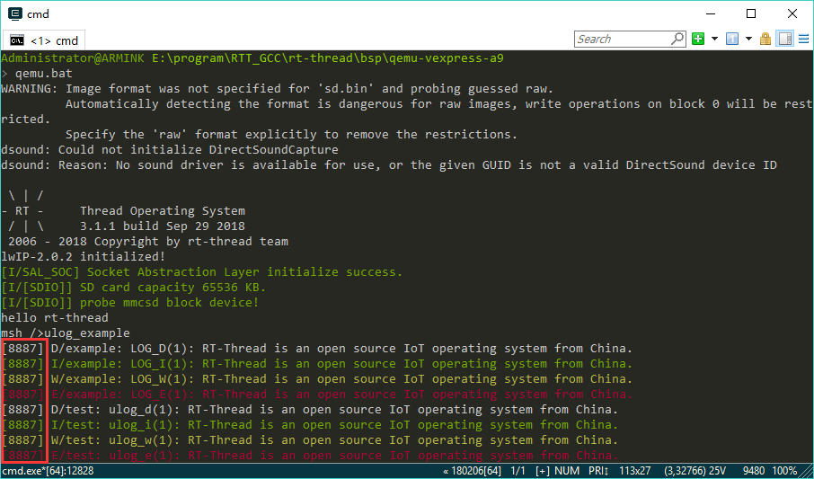
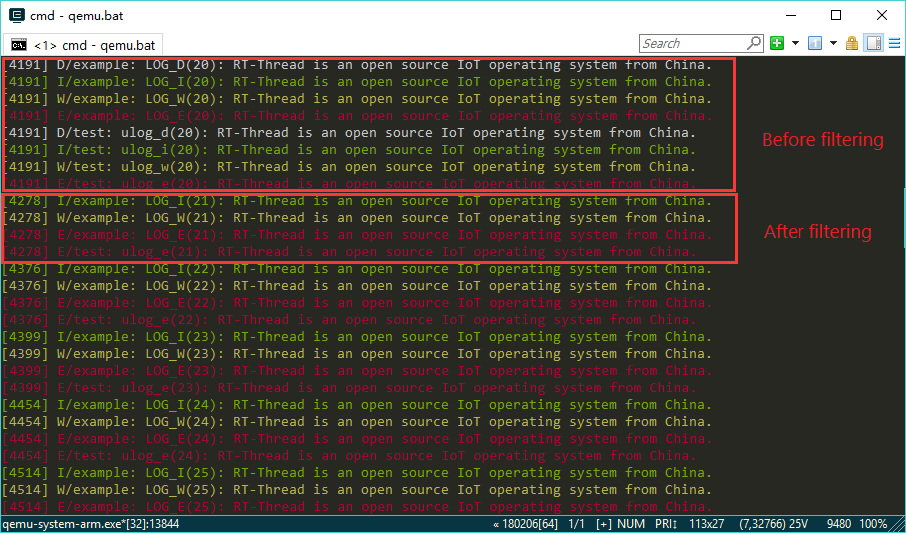
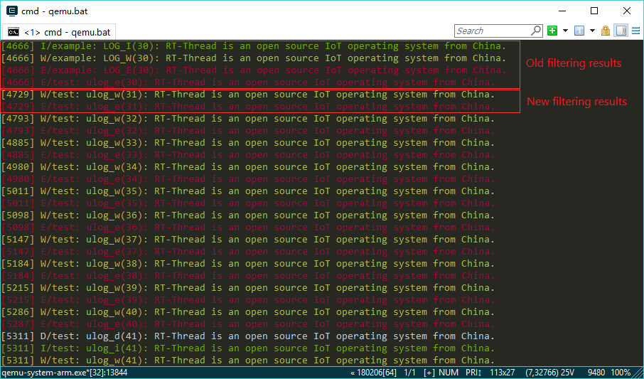

# Ulog Log

## Ulog Introduction

**Log definition**：The log is to output the status, process and other information of the software to different media (for example: file, console, display, etc.), display and save. Provide reference for software traceability, performance analysis, system monitoring, fault warning and other functions during software debugging and maintenance. It can be said that the use of logs consumes at least 80% of the software life cycle.

**The importance of the log**：For the operating system, because the complexity of the software is very large, single-step debugging is not suitable in some scenarios, the log component is almost standard part on the operating system. A sophisticated logging system can also make the debugging of the operating system more effective.

**The origin of ulog**: RT-Thread has always lacked a small, useful log component, and the birth of ulog complements this short board. It will be open sourced as a basic component of RT-Thread, allowing our developers to use a simple and easy-to-use logging system to improve development efficiency.

Ulog is a very simple and easy to use C/C++ log component. The first letter u stands for μ, which means micro. It can achieve the lowest **ROM<1K, RAM<0.2K** resource usage. Ulog is not only small in size, but also has very comprehensive functions. Its design concept refers to another C/C++ open source log library: EasyLogger (referred to as elog), and has made many improvements in terms of functions and performance. The main features are as follows:

* The backend of the log output is diversified and can support, for example, serial port, network, file, flash memory and other backend forms.

* The log output is designed to be thread-safe and supports asynchronous output mode.

* The logging system is highly reliable and is still available in complex environments such as interrupted ISRs and Hardfault.

* The log supports runtime/compilation time to set the output level.

* The log content supports global filtering by keyword and label.

* The APIs and log formats are compatible with linux syslog.

* Support for dumping debug data to the log in hex format.

* Compatible with `rtdbg` (RTT's early log header file) and EasyLogger's log output API.

### Ulog Architecture

The following figure shows the ulog log component architecture diagram:


* **Front end**：This layer is the closest layer to the application, and provides users with two types of API interfaces, `syslog` and `LOG_X`, which are convenient for users to use in different scenarios.

* **Core**：The main work of the middle core layer is to format and filter the logs passed by the upper layer, and then generate log frames, and finally output them to the lowest-end back-end devices through different output modules.

* **Back end**：After receiving the log frames sent from the core layer, the logs are output to the registered log backend devices, such as files, consoles, log servers, and so on.

### Configuration Options ###

The path to configure ulog using menuconfig in the ENV tool is as follows:

```c
 RT-Thread Components → Utilities → Enable ulog
```

 The ulog configuration options are described below. In general, the default configuration is used:

```c
[*] Enable ulog                   /* Enable ulog */
      The static output log level./* Select a static log output level. After the selection is completed, the log level lower than the set level (here specifically the log using the LOG_X API) will not be compiled into the ROM. */
[ ]   Enable ISR log.             /* Enable interrupted ISR log, ie log output API can also be used in ISR */
[*]   Enable assert check.        /* Enable assertion checks. If fter disabled, the asserted log will not be compiled into ROM */
(128) The log's max width.        /* The maximum length of the log. Since ulog's logging API is in units of rows, this length also represents the maximum length of a row of logs. */
[ ]   Enable async output mode.   /* Enable asynchronous log output mode. When this mode is turned on, the log will not be output to the backend immediately, but will be cached first, and then handed to the log output thread (for example: idle thread) to output. */
      log format  --->            /* Configure the format of the log, such as time information, color information, thread information, whether to support floating point, etc. */
[*]   Enable console backend.     /* Enable the console as a backend. After enabling, the log can be output to the console serial port. It is recommended to keep it on. */
[ ]   Enable runtime log filter.  /* Enable the runtime log filter, which is dynamic filtering. After enabling, the log will support dynamic filtering when the system is running, by means of tags, keywords, and so on. */
```

**The configuration log format option description is as follows:**

```c
[ ] Enable float number support. It will using more thread stack.   /* Supporting floating-point variables (traditional rtdbg/rt_kprintf does not support floating-point logs) */
    [*] Enable color log.                   /* Colored log */
    [*] Enable time information.            /* Time information */
    [ ]   Enable timestamp format for time. /* Including timestamp */
    [*] Enable level information.           /* Level information */
    [*] Enable tag information.             /* Label Information */
    [ ] Enable thread information.          /* Thread information */
```

### Log Level

The log level represents the importance of the log, from high to low in ulog, with the following log levels:

| Level    | Name | Description |
| ------------ | ---- | ----------------------- |
| LOG_LVL_ASSERT  | assertion | Unhandled and fatal errors occurred, so that the system could not continue to run. These are assertion logs. |
| LOG_LVL_ERROR   | error | The log that is output when a serious, **unrepairable** error occurs is an error level log. |
| LOG_LVL_WARNING | warning | These warning logs are output when there are some less important errors with **repairability**. |
| LOG_LVL_INFO    | information | A log of important prompt information that is viewed by the upper-level user of the module, for example, initialization success, current working status, and so on. This level of log is generally **retained** during mass production. |
| LOG_LVL_DBG     | debug | The debug log that is viewed by the developer of this module. This level of log is generally **closed** during mass production. |

The log level in ulog also has the following classification:

* **Static and dynamic levels**：Classify according to whether the log can be modified during the run phase. The dynamic level that can be modified during the run phase can only be called static level in the **compilation phase**. Logs that are lower than the static level (here specifically the logs using the `LOG_X` API) will not be compiled into the ROM and will not be output or displayed. The dynamic level can control logs that their level are higher than or equal to the static level. Logs that are lower than the dynamic level are filtered out when ulog is running.

* **Global level and module level**：Classification by scope. Each file (module) can also be set to a separate log level in ulog. The global level scope is larger than the module level, that is, the module level can only control module logs higher than or equal to the global level.

As can be seen from the above classification, the output level of the log can be set in the following four aspects of ulog:

* **Global static **log level：Configured in menuconfig, corresponding to the `ULOG_OUTPUT_LVL` macro.

* **Global Dynamics** log level：Use the `void ulog_global_filter_lvl_set(rt_uint32_t level)` function to set it.

* **Module static** log level：The `LOG_LVL` macro is defined in the module (file), similar to the way the log tag macro `LOG_TAG` is defined.

* **Module dynamics** log level：Use the `int ulog_tag_lvl_filter_set(const char *tag, rt_uint32_t level)` function to set it.

Their scope of action is：**Global Static**>**Global Dynamics**>**Module Static**>**Module Dynamic**.

### Log Label

Due to the increasing log output, in order to avoid the log being outputted indiscriminately, it is necessary to use a tag to classify each log. The definition of the label is in the form of **modular**, for example: Wi-Fi components include device driver (wifi_driver), device management (wifi_mgnt) and other modules, Wi-Fi component internal module can use `wifi.driver`, `wifi.mgnt` is used as a label to perform classified output of logs.

The tag attribute of each log can also be output and displayed. At the same time, ulog can also set the output level of each tag (module) corresponding to the log. The log of the current unimportant module can be selectively closed, which not only reduces ROM resources, but also helps developers filter irrelevant logs.

See the `rt-thread\examples\ulog_example.c` ulog routine file with the `LOG_TAG` macro defined at the top of the file:

```c
#define LOG_TAG     "example"     // The label corresponding to this module. When not defined, default: NO_TAG
#define LOG_LVL     LOG_LVL_DBG   // The log output level corresponding to this module. When not defined, default: debug level
#include <ulog.h>                 // this header file Must be under LOG_TAG and LOG_LVL
```

Note that the definition log tag must be above `#include <ulog.h>`, otherwise the default `NO_TAG` will be used (not recommended to define these macros in the header file).

The scope of the log tag is the current source file, and the project source code will usually be classified according to the module. Therefore, when defining a label, you can specify the module name and sub-module name as the label name. This is not only clear and intuitive when the log output is displayed, but also facilitates subsequent dynamic adjustment of the level or filtering by label.

## Log Initialization

### Initialization

```c
int ulog_init(void)
```

| **Return** | **Description** |
| :-----   | :-----                        |
|>=0     | Succeeded              |
|-5        | Failed, insufficient memory |

This function must be called to complete ulog initialization before using ulog. This function will also be called automatically if component auto-initialization is turned on.

### Deinitialization

```c
void ulog_deinit(void)
```

This deinit release resource can be executed when ulog is no longer used.

## Log Output API

Ulog mainly has two log output macro APIs, which are defined in the source code as follows:

```c
#define LOG_E(...)                           ulog_e(LOG_TAG, __VA_ARGS__)
#define LOG_W(...)                           ulog_w(LOG_TAG, __VA_ARGS__)
#define LOG_I(...)                           ulog_i(LOG_TAG, __VA_ARGS__)
#define LOG_D(...)                           ulog_d(LOG_TAG, __VA_ARGS__)
#define LOG_RAW(...)                         ulog_raw(__VA_ARGS__)
#define LOG_HEX(name, width, buf, size)      ulog_hex(name, width, buf, size)
```

* The macro `LOG_X(...)`:`X` corresponds to the first letter of the different levels. The parameter `...` is the log content, and the format is the same as printf. This method is preferred because on the one hand, because its API format is simple, only one log information is entered, and the static log level filtering by module is also supported.

* The macro `ulog_x(LOG_TAG, __VA_ARGS__)`:  `x ` corresponds to a different level of shorthand. The parameter `LOG_TAG` is the log label, the parameter `...` is the log content, and the format is the same as printf. This API is useful when you use different tag output logs in one file.

|  **API**  |**Description**                                |
|-------------------------|--------------------------|
| LOG_E(...)| Error level log          |
| LOG_W(...) | Error level log |
| LOG_I(...) | Prompt level log |
| LOG_D(...)| Debug level log |
| LOG_RAW(...) | Output raw log |
| LOG_HEX(name, width, buf, size)| Output hexadecimal format data to the log |

API such as ` LOG_X` and `ulog_x` , the output are formatted logs. When you need to output logs without any format, you can use `LOG_RAW` or `ulog_raw()`. E.g:

```c
LOG_RAW("\r");
ulog_raw("\033[2A");
```

You can use `LOG_HEX()` or `ulog_hex` to dump data into the log in hexadecimal hex format. The function parameters and descriptions are as follows:

| **Parameter** | **Description**             |
| ---- | -------------------------- |
| tag   | Log label           |
| width | The width (number) of a line of hex content |
| buf   | Data content to be output |
| size  | Data size           |

The `hexdump` log is DEBUG level, supports runtime level filtering. The tag corresponding to the hexdump log supports tag filtering during runtime.

Ulog also provides the assertion API: `ASSERT(expression)`. When the assertion is triggered, the system will stop running, and `ulog_flush()` will be executed internally, and all log backends will execute flush. If asynchronous mode is turned on, all logs in the buffer will also be flushed. An example of the use of assertions is as follows:

```c
void show_string(const char *str)
{
    ASSERT(str);
    ...
}
```

## ULog Usage Example

### Example

The following is a description of the ulog routine. Open `rt-thread\examples\ulog_example.c` and you can see that there are labels and static priorities defined at the top.

```c
#define LOG_TAG              "example"
#define LOG_LVL              LOG_LVL_DBG
#include <ulog.h>
```

The `LOG_X` API is used in the `void ulog_example(void)` function, which is roughly as follows:

```c
/* output different level log by LOG_X API */
LOG_D("LOG_D(%d): RT-Thread is an open source IoT operating system from China.", count);
LOG_I("LOG_I(%d): RT-Thread is an open source IoT operating system from China.", count);
LOG_W("LOG_W(%d): RT-Thread is an open source IoT operating system from China.", count);
LOG_E("LOG_E(%d): RT-Thread is an open source IoT operating system from China.", count);
```

These log output APIs support the printf format and will automatically wrap lines at the end of the log.

The following will show the effect of the ulog routine on qemu:

- Copy `rt-thread\examples\ulog_example.c` to the `rt-thread\bsp\qemu-vexpress-a9\applications` folder.
- Go to the `rt-thread\bsp\qemu-vexpress-a9` directory in Env
- After determining that the configuration of ulog has been executed before, execute the `scons` command and wait for the compilation to complete.
- Run `qemu.bat` to open RT-Thread's qemu simulator
- Enter the `ulog_example` command to see the results of the ulog routine. The effect is as follows.


You can see that each log is displayed in rows, and different levels of logs have different colors. At the top of the log is the tick of the current system, with the log level and label displayed in the middle, and the specific log content at the end. These log formats and configuration instructions are also highlighted later in this article.

### Used in Interrupt ISR

Many times you need to output a log in the interrupt ISR, but the ISR may interrupt the thread that is doing the log output. To ensure that the interrupt log and the thread log do not interfere with each other, special handling must be performed for the interrupt condition.

Ulog has integrated interrupt log function, but it is not enabled by default. Open the `Enable ISR log` option when using it. The API of the log is the same as that used in the thread, for example:

```c
#define LOG_TAG              "driver.timer"
#define LOG_LVL              LOG_LVL_DBG
#include <ulog.h>

void Timer2_Handler(void)
{
    /* enter interrupt */
    rt_interrupt_enter();

    LOG_D("I'm in timer2 ISR");

    /* leave interrupt */
    rt_interrupt_leave();
}

```

Here are the different strategies for interrupt logging in ulog in synchronous mode and asynchronous mode:

**In synchronous mode**：If the thread is interrupted when the log is being output at this time, and there is a log to be output in the interrupt, it will be directly output to the console, and output to other backends is not supported;

**In asynchronous mode**：If the above situation occurs, the log in the interrupt will be put into the buffer first, and finally sent to the log output thread for processing together with the thread log.

### Set the Log Format

The log format supported by ulog can be configured in menuconfig, located in `RT-Thread Components` → `Utilities` → `ulog` → `log format`. The specific configuration is as follows:


They can be configured separately: floating-point number support (traditional rtdbg/rt_kprintf does not support floating-point logs), colored logs, time information (including timestamps), level information, tag information, thread information. Below we will **select all of these options**, save and recompile and run the ulog routine again in qemu to see the actual effect:


It can be seen that the time information has been changed from the tick value of the system to the timestamp information compared to the first run routine, and the thread information has also been output.

### Hexdump Output Using

Hexdump is also a more common function when logging output. hexdump can output a piece of data in hex format. The corresponding API is: `void ulog_hexdump(const char *tag, rt_size_t width, rt_uint8_t *buf, rt_size_t size)` , see below the specific use method and operation effect:

```c
/* Define an array of 128 bytes in length */
uint8_t i, buf[128];
/* Fill the array with numbers */
for (i = 0; i < sizeof(buf); i++)
{
    buf[i] = i;
}
/* Dumps the data in the array in hex format with a width of 16 */
ulog_hexdump("buf_dump_test", 16, buf, sizeof(buf));
```

You can copy the above code into the ulog routine, and then look at the actual running results:


It can be seen that the middle is the hexadecimal information of the buf data, and the rightmost is the character information corresponding to each data.

## Log Advanced Features

After understanding the introduction of the log in the previous section, the basic functions of ulog can be mastered. In order to let everyone better use ulog, this application note will focus on the advanced features of ulog and some experience and skills in log debugging. After learning these advanced uses, developers can also greatly improve the efficiency of log debugging.

It also introduces the advanced mode of ulog: syslog mode, which is fully compatible with the Linux syslog from the front-end API to the log format, greatly facilitating the migration of software from Linux.

### Log Backend


Speaking of the backend, let's review the ulog's framework. As can be seen from the above figure, ulog is a design with front and back ends separated, and there is no dependence on the front and back ends. And the backends that are supported are diversified, no matter what kind of backends, as long as they are implemented, they can be registered.

Currently ulog has integrated the console backend, the traditional device that outputs `rt_kprintf` print logs. Ulog also supports the Flash backend, which seamlessly integrates with EasyFlash. See its package for details.（[Click to view](https://github.com/armink-rtt-pkgs/ulog_easyflash_be)）。Later ulog will also increase the implementation of backends such as file backends and network backends. Of course, if there are special needs, users can also implement the backend themselves.

#### Register Backend Device

```c
rt_err_t ulog_backend_register(ulog_backend_t backend, const char *name, rt_bool_t support_color)
```

| **Parameter** | **Description**                |
| :-----   | :-----                        |
|backend  | Backend device handle |
|name| Backend device name |
|support_color| Whether it supports color logs |
|**return**|--                     |
|>=0     | Succeeded                  |

This function is used to register the backend device into the ulog, ensuring that the function members in the backend device structure are set before registration.

#### Logout Backend Device

```c
rt_err_t ulog_backend_unregister(ulog_backend_t backend);
```

| **Parameter** | **Description**                |
| :-----   | :-----                        |
|backend  | Backend device handle |
|**return**|--                      |
|>=0     | Succeeded                  |

This function is used to unregister a backend device that has already been registered.

#### Backend Implementation and Registration Examples

The console backend is taken as an example to briefly introduce the implementation method and registration method of the backend.

Open the `rt-thread/components/utilities/ulog/backend/console_be.c` file and you can see the following:

```c
#include <rthw.h>
#include <ulog.h>

/* Defining console backend devices */
static struct ulog_backend console;
/* Console backend output function */
void ulog_console_backend_output(struct ulog_backend *backend, rt_uint32_t level, const char *tag, rt_bool_t is_raw, const char *log, size_t len)
{
    ...
    /* Output log to the console */
    ...
}
/* Console backend initialization */
int ulog_console_backend_init(void)
{
    /* Set output function */
    console.output = ulog_console_backend_output;
    /* Registration backend */
    ulog_backend_register(&console, "console", RT_TRUE);

    return 0;
}
INIT_COMPONENT_EXPORT(ulog_console_backend_init);
```

Through the above code, it can be seen that the implementation of the console backend is very simple. Here, the `output` function of the backend device is implemented, and the backend is registered in the ulog, and then the log of ulog is output to the console.

If you want to implement a more complex back-end device, you need to understand the back-end device structure, as follows:

```c
struct ulog_backend
{
    char name[RT_NAME_MAX];
    rt_bool_t support_color;
    void (*init)  (struct ulog_backend *backend);
    void (*output)(struct ulog_backend *backend, rt_uint32_t level, const char *tag, rt_bool_t is_raw, const char *log, size_t len);
    void (*flush) (struct ulog_backend *backend);
    void (*deinit)(struct ulog_backend *backend);
    rt_slist_t list;
};
```

From the perspective of this structure, the requirements for implementing the backend device are as follows:

* `The name` and `support_color` properties can be passed in through the `ulog_backend_register()` function.

* `output` is the back-end specific output function, and all backends must implement the interface.

* `init`/`deinit` is optional, `init` is called at `register`, and `deinit` is called at `ulog_deinit`.

* `flush` is also optional, and some internal output cached backends need to implement this interface. For example, some file systems with RAM cache. The flush of the backend is usually called by `ulog_flush` in the case of an exception such as assertion or hardfault.

### Asynchronous Log

In ulog, the default output mode is synchronous mode, and in many scenarios users may also need asynchronous mode. When the user calls the log output API, the log is cached in the buffer, and the thread dedicated to the log output takes out the log and outputs it to the back end.

Asynchronous mode and synchronous mode are the same for the user, there is no difference in the use of the log API, because ulog will distinguish between the underlying processing. The difference between the two works is as follows:


The advantages and disadvantages of asynchronous mode are as follows:

**Advantage**：

* First, the log output will not block the current thread, and some backend output rates are low, so using the synchronous output mode may affect the timing of the current thread. The asynchronous mode does not have this problem.

* Secondly, since each thread that uses the log omits the action of the backend output, the stack overhead of these threads may also be reduced, and from this perspective, the resource consumption of the entire system can also be reduced.

* Interrupt logs in synchronous mode can only be output to the console backend, while in asynchronous mode interrupt logs can be output to all backends.

**Disadvantage**：First, the asynchronous mode requires a log buffer. Furthermore, the output of the asynchronous log needs to be completed by a special thread, such as an idle thread or a user-defined thread, which is slightly more complicated to use. The overall sense of asynchronous mode resource occupancy will be higher than the synchronous mode.

#### Configuration Option

Use menuconfig in the Env tool to enter the ulog configuration options:

```c
 RT-Thread Components → Utilities → Enable ulog
```

The asynchronous mode related configuration options are described as follows:

```c
[*]   Enable async output mode.                 /* Enable asynchronous mode */
(2048)  The async output buffer size.           /* Asynchronous buffer size, default is 2048*/
[*]     Enable async output by thread.          /* Whether to enable the asynchronous log output thread in ulog, the thread will wait for log notification when it runs, and then output the log to all backends. This option is turned on by default, and can be turned off if you want to modify it to another thread, such as an idle thread. */
(1024)    The async output thread stack size.   /* Asynchronous output thread stack size, default is 1024 */
(30)      The async output thread stack priority./* The priority of the asynchronous output thread, the default is 30*/
```

When using the idle thread output, the implementation is simple, just call `rt_thread_idle_sethook(ulog_async_output)` at the application layer, but there are some limitations.

* The idle thread stack size needs to be adjusted based on actual backend usage.

* Because thread suspend operations are not allowed inside idle threads, backends such as Flash and networking may not be available based on idle threads.

#### Use Example

Save the asynchronous output option configuration and copy `rt-thread\examples\ulog_example.c` to the `rt-thread\bsp\qemu-vexpress-a9\applications` folder.

Execute the `scons` command and wait for the compilation to complete. Run `qemu.bat` to open the qemu emulator for RT-Thread.
Enter the `ulog_example` command to see the results of the ulog routine. The approximate effect is as follows:



If you look carefully, you can see that after the asynchronous mode is turned on, the time information of these logs that are very close in code is almost the same. However, in synchronous mode, the log is output using the user thread. Since the log output takes a certain amount of time, there is a certain interval between each log. It also fully shows that the asynchronous log output is very efficient, and it takes almost no time for the caller.

### Log Dynamic Filter

In the previous section, some static filtering functions have been introduced. Static filtering has its advantages such as saving resources, but in many cases, users need to dynamically adjust the filtering mode of the log while the software is running. This allows the dynamic filter function of ulog to be used. To use the dynamic filter feature, turn on the `Enable runtime log filter.` option in menuconfig, which is **turned off by default**.

There are four types of dynamic filtering supported by ulog, and there are corresponding API functions and Finsh/MSH commands, which will be introduced one by one.

#### Filter by Module Level

```c
int ulog_tag_lvl_filter_set(const char *tag, rt_uint32_t level)
```

| **Parameter** | **Description**                 |
| ------- | ------------------------------ |
| tag      | Log label             |
| level    | Set log level |
|**return**|--                       |
| >=0    | Succeeded                   |
| -5     | Failed, not enough memory |

* Command format： `ulog_tag_lvl <tag> <level>`

The **module** referred to here represents a class of log code with the same tag attributes. Sometimes it is necessary to dynamically modify the log output level of a module at runtime.

The parameter log `level` can take the following values:

|**Level**             |**Name**            |
| --------------------- | ---------------- |
| LOG_LVL_ASSERT        | Assertion |
| LOG_LVL_ERROR         | Error      |
| LOG_LVL_WARNING       | Warning     |
| LOG_LVL_INFO          | Information |
| LOG_LVL_DBG           | Debug   |
| LOG_FILTER_LVL_SILENT | Silent (stop output) |
| LOG_FILTER_LVL_ALL    | All          |

An example of a function call and command is as follows:

| Function | Function Call | Execute an order |
| ---------------- | ------------------------------ | ------------------ |
| Close all logs of `wifi` module | `ulog_tag_lvl_filter_set("wifi", LOG_FILTER_LVL_SILENT);` | `ulog_tag_lvl wifi 0` |
| Open all logs of `wifi` module | `ulog_tag_lvl_filter_set("wifi", LOG_FILTER_LVL_ALL);`    | `ulog_tag_lvl wifi 7` |
| Set the `wifi` module log level to warning | `ulog_tag_lvl_filter_set("wifi", LOG_LVL_WARNING);`       | `ulog_tag_lvl wifi 4` |

#### Global Filtering by Label

```c
void ulog_global_filter_tag_set(const char *tag)
```

| **Parameter** | **Description** |
| :--- | :------------- |
| tag  | Set filter label |

* The command format: `ulog_tag [tag]`, when the tag is empty, the label filtering is canceled.

This filtering method can perform label filtering on all logs, and only the **log containing the label information** is allowed to output.

For example: there are 3 kinds of tags for `wifi.driver`, `wifi.mgnt`, `audio.driver`. When setting the filter tag to `wifi`, only the tags are `wifi.driver` and `wifi.mgnt. The log of ` will be output. Similarly, when the filter tag is set to `driver`, only logs with tags `wifi.driver` and `audio.driver` will be output. Examples of function calls and commands for common functions are as follows:

| Function | Function Call | Execute an Order |
| -------------| -------------------- | ---------- |
| Set the filter tag to `wifi` | `ulog_global_filter_tag_set("wifi");`   | `ulog_tag wifi`   |
| Set the filter tag to `driver` | `ulog_global_filter_tag_set("driver");` | `ulog_tag driver` |
| Cancel label filtering | `ulog_global_filter_tag_set("");` | `ulog_tag`    |

#### Global Filtering by Level

```c
void ulog_global_filter_lvl_set(rt_uint32_t level)
```

| **Parameter** | **Description**    |
| ---- | -------------------|
| level | Set log level |

* Command format: `ulog_lvl <level>` , level Refer to the following table:

| **Value** | **Description** |
| :------------ | :--------------- |
| 0  | assertion |
| 3  | error |
| 4  | warning |
| 6  | information |
| 7  | debug |

After setting the global filter level by function or command, the log below **setting level** will stop output. Examples of function calls and commands for common functions are as follows:

| Function | Function Call | Execute an order |
| ----------| ------------------------------ | ------- |
| Close all logs | `ulog_global_filter_lvl_set(LOG_FILTER_LVL_SILENT);` | `ulog_lvl 0` |
| Open all logs | `ulog_global_filter_lvl_set(LOG_FILTER_LVL_ALL);`    | `ulog_lvl 7` |
| Set the log level to warning | `ulog_global_filter_lvl_set(LOG_LVL_WARNING);`       | `ulog_lvl 4` |

#### Global Filtering by Keyword

```c
void ulog_global_filter_kw_set(const char *keyword)
```

| **Parameter** | **Description**  |
| :------ | :--------------- |
| keyword | Set filter keywords |

* The command format: `ulog_kw [keyword]`, when the keyword is empty, the keyword filtering is canceled.

This filtering method can filter all the logs by keyword, and the log **containing the keyword information** is allowed to output. Examples of function calls and commands for common functions are as follows:

| Function | Function Call | Execute an order |
| -------------- | ------------------- | --------- |
| Set the filter keyword to `wifi` | `ulog_global_filter_kw_set("wifi");` | `ulog_kw wifi` |
| Clear filter keywords | `ulog_global_filter_kw_set("");`     | `ulog_kw`      |

#### View Filter Information

After setting the filter parameters, if you want to view the current filter information, you can enter the `ulog_filter` command. The approximate effect is as follows:

```c
msh />ulog_filter
--------------------------------------
ulog global filter:
level   : Debug
tag     : NULL
keyword : NULL
--------------------------------------
ulog tag's level filter:
wifi                   : Warning
audio.driver           : Error
msh />
```

> Filter parameters are also supported storing in Flash and also support boot autoload configuration. If you need this feature, please see the instructions for the **ulog_easyflash** package.（[Click to check](https://github.com/armink-rtt-pkgs/ulog_easyflash_be)）

#### Use Example

Still executing in qemu BSP, first open dynamic filter in menuconfig, then save the configuration and compile and run the routine. After the log output is about **20** times, the corresponding filter code in ulog_example.c will be executed:

```c
if (count == 20)
{
    /* Set the global filer level is INFO. All of DEBUG log will stop output */
    ulog_global_filter_lvl_set(LOG_LVL_INFO);
    /* Set the test tag's level filter's level is ERROR. The DEBUG, INFO, WARNING log will stop output. */
    ulog_tag_lvl_filter_set("test", LOG_LVL_ERROR);
}
...
```

At this point, the global filter level is set to the INFO level, so you can no longer see logs lower than the INFO level. At the same time, the log output level of the `test` tag is set to ERROR, and the log lower than ERROR in the `test` tag is also stopped. In each log, there is a count value of the current log output count. The effect of the comparison is as follows:



After the log output is about **30** times, the following filter code corresponding to ulog_example.c is executed:

```c
...
else if (count == 30)
{
    /* Set the example tag's level filter's level is LOG_FILTER_LVL_SILENT, the log enter silent mode. */
    ulog_tag_lvl_filter_set("example", LOG_FILTER_LVL_SILENT);
    /* Set the test tag's level filter's level is WARNING. The DEBUG, INFO log will stop output. */
    ulog_tag_lvl_filter_set("test", LOG_LVL_WARNING);
}
...
```

At this point, the filter of the `example` module has been added, and all the logs of this module are stopped, so the module log will not be visible next. At the same time, reduce the log output level of the `test` tag to WARING. At this point, you can only see the WARING and ERROR level logs of the `test` tag. The effect is as follows:



After the log output is about **40** times, the following filter code corresponding to ulog_example.c is executed:

```c
...
else if (count == 40)
{
    /* Set the test tag's level filter's level is LOG_FILTER_LVL_ALL. All level log will resume output. */
    ulog_tag_lvl_filter_set("test", LOG_FILTER_LVL_ALL);
    /* Set the global filer level is LOG_FILTER_LVL_ALL. All level log will resume output */
    ulog_global_filter_lvl_set(LOG_FILTER_LVL_ALL);
}
```

At this time, the log output level of the `test` module is adjusted to `LOG_FILTER_LVL_ALL`, that is, the log of any level of the module is no longer filtered. At the same time, the global filter level is set to `LOG_FILTER_LVL_ALL`, so all the logs of the `test` module will resume output. The effect is as follows:


### Usage when the System is Abnormal

Since the asynchronous mode of ulog has a caching mechanism, the registered backend may also have a cache inside. If there are error conditions such as hardfault and assertion in the system, but there are still logs in the cache that are not output, which may cause the log to be lost. It is impossible to find the cause of the exception.

For this scenario, ulog provides a unified log flush function: `void ulog_flush(void)`. When an exception occurs, when the exception information log is output, the function is called at the same time to ensure that the remaining logs in the cache can also be output to the back end.

The following is an example of RT-Thread assertion and CmBacktrace:

#### Assertion

RT-Thread assertions support assertion callbacks. We define an assertion hook function similar to the following, and then set it to the system via the `rt_assert_set_hook(rtt_user_assert_hook);` function.

```c
static void rtt_user_assert_hook(const char* ex, const char* func, rt_size_t line)
{
    rt_enter_critical();

    ulog_output(LOG_LVL_ASSERT, "rtt", RT_TRUE, "(%s) has assert failed at %s:%ld.", ex, func, line);
    /* flush all log */
    ulog_flush();
    while(1);
}
```

#### CmBacktrace

CmBacktrace is a fault diagnosis library for ARM Cortex-M series MCUs. It also has a corresponding RT-Thread package, and the latest version of the package has been adapted for ulog. The adaptation code is located in `cmb_cfg.h` :

```c
...
/* print line, must config by user */
#include <rtthread.h>
#ifndef RT_USING_ULOG
#define cmb_println(...)               rt_kprintf(__VA_ARGS__);rt_kprintf("\r\n")
#else
#include <ulog.h>
#define cmb_println(...)               ulog_e("cmb", __VA_ARGS__);ulog_flush()
#endif /* RT_USING_ULOG */
...
```

It can be seen that when ulog is enabled, each log output of CmBacktrace will use the error level, and `ulog_flush` will be executed at the same time, and the user does not need to make any modifications.

### Syslog Mode

On Unix-like operating systems, syslog is widely used in system logs. The common backends of syslog are files and networks. The syslog logs can be recorded in local files or sent over the network to the server that receives the syslog.

Ulog provides support for the syslog mode, not only the front-end API is exactly the same as the syslog API, but the log format is also RFC compliant. However, it should be noted that after the syslog mode is enabled, the log output format of the entire ulog will be in syslog format regardless of which log output API is used.

To use the syslog configuration you need to enable the `Enable syslog format log and API.` option.

#### Log Format


As shown in the figure above, the ulog syslog log format is divided into the following four parts:

| Format | **Description**  |
| ---- | --------------------- |
| PRI | The PRI part consists of a number enclosed in angle brackets. This number contains the Facility and Severity information, which is made by Facility multiplying 8 and then adding Severity. Facility and Severity are passed in by the syslog function. For details, see syslog.h. |
| Header | The Header part is mainly a timestamp indicating the time of the current log; |
| TAG | The current log label can be passed in via the `openlog` function. If not specified, `rtt` will be used as the default label. |
| Content | The specific content of the log |

#### Instruction

The syslog option needs to be enabled in menuconfig before use. The main commonly used APIs are:

* Open syslog：`void openlog(const char *ident, int option, int facility)`

* Output syslog log：`void syslog(int priority, const char *format, ...)`

> Hint: Calling `openlog` is optional. If you do not call `openlog`, the openlog is automatically called when syslog is called for the first time.


syslog() is very simple to use. The input format is the same as the printf function. There are also syslog routines in ulog_example.c that work as follows in qemu:


### Migrate from *rt_dbg.h* or elog to ulog

If the two types of log components were used in the project before, when ulog is to be used, it will involve how to make the previous code also support ulog. The following will focus on the migration process.

#### Migrate from rt_dbg.h

Currently rtdbg has completed **seamless docking** ulog. After ulog is turned on, the code of rtdbg in the old project can be used to complete the log output without any modification.

#### Migrate from Elog(EasyLogger)

If you are not sure that a source code file is running on a target platform that will use ulog, then it is recommended to add the following changes to the file:

```c
#ifdef RT_USING_ULOG
#include <ulog.h>
#else
#include <elog.h>
#endif /* RT_USING_ULOG */
```

If you explicitly only use the ulog component, then simply change the header file reference from `elog.h` to `ulog .h`, and no other code needs to be changed.

### Log Usage Tip

With the logging tool, if it is used improperly, it will also cause the log to be abused, and the log information cannot be highlighted. Here we will focus on sharing some tips on the use of the log component to make the log information more intuitive. The main concerns are:

#### Rational Use of Label Classification

Reasonably use the label function. For each module code before the use of the log, first clear the module, sub-module name. This also allows the logs to be categorized at the very beginning and ready for later log filtering.

#### Rational Use of Log Levels

When you first use the log library, you will often encounter warnings and errors. The logs cannot be distinguished. The information cannot be distinguished from the debug logs, which makes the log level selection inappropriate. Some important logs may not be visible, and unimportant logs are full of problems. Therefore, be sure to read the log level section carefully before using it. For each level, there are clear standards.

#### Avoid Repetitive and Redundant Logs

In some cases, repeated or cyclic execution of code occurs, and the same, similar log problems are output multiple times. Such a log not only takes up a lot of system resources, but also affects the developer's positioning of the problem. Therefore, in this case, it is recommended to add special processing for repetitive logs, such as: let the upper layer output some business-related logs, the bottom layer only returns the specific result status; the same log at the same time point, can increase to deal with the re-processing, only output once and so on when the error state has not changed.

#### Open More Log Formats

The timestamp and thread information are not turned on in the default log format of ulog. These two log messages are useful on RTOS. They can help developers to understand the running time and time difference of each log, and clearly see which thread is executing the current code. So if conditions permit, it is still recommended to open.

#### Close Unimportant Logs

Ulog provides log switch and filtering functions in various dimensions, which can completely control the refinement. Therefore, if you debug a function module, you can properly close the log output of other unrelated modules, so that you can focus on the current debugging on the module.

## Common Problems

### Q: The log code has been executed, but there is no output.

 **A:** Refer to the Log Levels section for the log level classification and check the log filtering parameters. There is also the possibility of accidentally closing the console backend and re-opening `Enable console backend`.

### Q: After ulog is turned on, the system crashes, for example: thread stack overflow.

 **A:** Ulog will occupy more part of the thread stack space than the previous rtdbg or `rt_kprintf` printout function. If floating-point printing support is enabled, it is recommended because it uses the internal memory of libc with a large amount of `vsnprintf`. Reserve more than 250 bytes. If the timestamp function is turned on, the stack recommends a reserve of 100 bytes.

### Q: The end of the log content is missing.

 **A:** This is because the log content exceeds the maximum width of the set log. Check the `The log's max width` option and increase it to the appropriate size.

### Q: After turning on the timestamp, why can't I see the millisecond time?

 **A:** This is because ulog currently only supports millisecond timestamps when the software emulation RTC state is turned on. To display, just turn on the RT-Thread software to simulate the RTC function.

### Q: Define LOG_TAG and LOG_LVL before each include ulog header file, can it be simplified?

**A:** If `LOG_TAG` is not defined, the `NO_TAG` tag will be used by default, so the output log will be easily misunderstood. Therefore the tag macro is not recommended to be omitted.

If `LOG_LVL` is not defined, the debug level is used by default. If the module is in the development stage, this process can be omitted, but if the module code is stable, it is recommended to define the macro and modify the level to information level.

### Q: Warning when running：Warning: There is no enough buffer for saving async log, please increase the ULOG_ASYNC_OUTPUT_BUF_SIZE option。

**A:** When this prompt is encountered, it indicates that the buffer in the asynchronous mode has overflowed, which will cause some of the log to be lost. Increasing the ULOG_ASYNC_OUTPUT_BUF_SIZE option can solve the problem.

### Q: Compile time prompt：The idle thread stack size must more than 384 when using async output by idle (ULOG_ASYNC_OUTPUT_BY_IDLE)。

**A:** When using an idle thread as the output thread, the stack size of the idle thread needs to be increased, depending on the specific backend device. For example, when the console being a backend, the idle thread must be at least 384 bytes.
