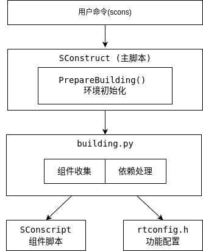
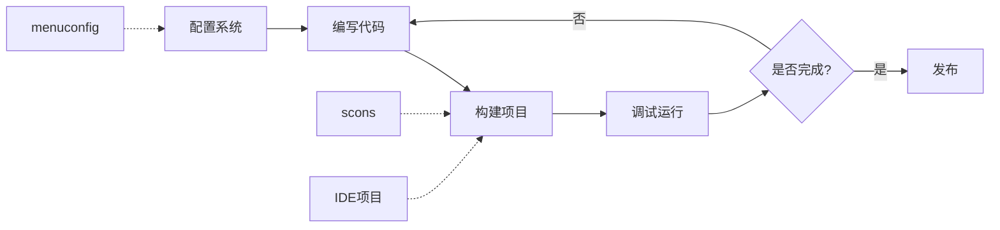

# RT-Thread 构建系统文档

欢迎使用RT-Thread构建系统文档。本文档集详细介绍了RT-Thread基于SCons的构建系统的使用方法和技术原理。

## 文档目录

### 📚 用户指南

1. **[构建系统使用指南](构建系统使用指南.md)**
   - 快速开始
   - 命令行选项详解
   - 工具链配置
   - 项目生成
   - 软件包管理
   - 高级功能
   - 常见问题解答

2. **[SConscript编写指南](SConscript编写指南.md)**
   - 基础语法
   - 常用模式
   - 高级技巧
   - 最佳实践
   - 示例集合

### 🔧 技术文档

3. **[构建系统技术原理](构建系统技术原理.md)**
   - 系统架构设计
   - 核心模块分析
   - 构建流程详解
   - 依赖管理机制
   - 工具链适配层
   - 项目生成器架构
   - 扩展机制

## 快速导航

### 常用命令

```bash
# 基础编译
scons                    # 默认编译
scons -j8               # 8线程并行编译
scons -c                # 清理编译产物

# 配置管理
menuconfig              # 图形化配置
scons --pyconfig       # Python脚本配置

# 项目生成
scons --target=mdk5    # 生成Keil MDK5项目
scons --target=iar     # 生成IAR项目
scons --target=vsc     # 生成VS Code项目
scons --target=cmake   # 生成CMake项目

# 软件包管理
pkgs --update          # 更新软件包
pkgs --list           # 列出已安装包
```

### 核心概念

- **SConstruct**: BSP根目录的主构建脚本
- **SConscript**: 各个组件/目录的构建脚本
- **rtconfig.py**: 工具链和平台配置
- **rtconfig.h**: RT-Thread功能配置
- **DefineGroup**: 定义组件的核心函数
- **GetDepend**: 检查依赖的核心函数

## 构建系统架构图



## 主要特性

✅ **多工具链支持**
- GCC (ARM/RISC-V/x86)
- Keil MDK (ARMCC/ARMClang)
- IAR
- Visual Studio

✅ **灵活的配置系统**
- Kconfig图形配置
- 条件编译支持
- 本地编译选项

✅ **丰富的项目生成器**
- IDE项目文件生成
- CMake支持
- Makefile生成
- VS Code配置

✅ **模块化设计**
- 组件独立构建
- 清晰的依赖管理
- 可扩展架构

## 开发工作流



## 相关链接

- [RT-Thread官网](https://www.rt-thread.org)
- [RT-Thread GitHub](https://github.com/RT-Thread/rt-thread)
- [SCons官方文档](https://scons.org/documentation.html)

## 贡献指南

如果您发现文档中的错误或有改进建议，欢迎：

1. 在GitHub上提交Issue
2. 提交Pull Request
3. 在RT-Thread社区论坛反馈

## 版本信息

- 文档版本：1.0.0
- 更新日期：2024-01
- 适用版本：RT-Thread 4.1.0+

---

**注意**：本文档基于RT-Thread最新版本编写，部分功能可能需要特定版本支持。使用前请确认您的RT-Thread版本。