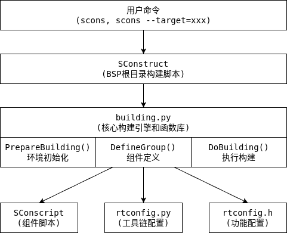

# RT-Thread 构建系统使用指南

## 目录

1. [概述](#概述)
2. [快速开始](#快速开始)
3. [命令行选项详解](#命令行选项详解)
4. [工具链配置](#工具链配置)
5. [项目生成](#项目生成)
6. [软件包管理](#软件包管理)
7. [高级功能](#高级功能)
8. [常见问题](#常见问题)

## 概述

RT-Thread使用基于SCons的构建系统，提供了统一的跨平台构建体验。构建系统支持：

- 多种编译器和IDE（GCC、Keil、IAR、VS Code等）
- 模块化的组件管理
- 灵活的配置系统
- 自动化的依赖处理
- 软件包管理功能

### 系统架构图



## 快速开始

### 基本编译流程

1. **进入BSP目录**
   ```bash
   cd bsp/stm32/stm32f103-blue-pill
   ```

2. **配置系统**（可选）
   ```bash
   menuconfig        # 图形化配置
   ```

3. **编译项目**
   ```bash
   scons            # 默认编译
   scons -j8        # 多线程编译
   ```

4. **生成IDE项目**
   ```bash
   scons --target=mdk5     # 生成Keil MDK5项目
   scons --target=iar      # 生成IAR项目
   scons --target=vsc      # 生成VS Code项目
   ```

### 清理和重建

```bash
scons -c                    # 清理编译产物
scons -c --target=mdk5      # 清理MDK5项目文件
scons --dist                # 生成分发包
```

## 命令行选项详解

### 基础编译选项

| 选项 | 说明 | 示例 |
|------|------|------|
| `-j N` | 多线程编译，N为线程数 | `scons -j8` |
| `-c` | 清理编译产物 | `scons -c` |
| `-s` | 静默模式，不显示命令 | `scons -s` |
| `--verbose` | 详细输出模式 | `scons --verbose` |

### 项目生成选项

| 选项 | 说明 | 生成的文件 |
|------|------|------------|
| `--target=mdk4` | Keil MDK4项目 | project.uvproj |
| `--target=mdk5` | Keil MDK5项目 | project.uvprojx |
| `--target=iar` | IAR工作区 | project.eww |
| `--target=vs2012` | Visual Studio项目 | project.vcxproj |
| `--target=vsc` | VS Code配置 | .vscode/目录 |
| `--target=eclipse` | Eclipse CDT项目 | .project, .cproject |
| `--target=cmake` | CMake项目 | CMakeLists.txt |
| `--target=makefile` | 通用Makefile | Makefile |

### 配置管理选项

| 选项 | 说明 | 使用场景 |
|------|------|----------|
| `--menuconfig` | 启动图形配置界面 | 修改功能配置 |
| `--pyconfig` | 通过Python脚本配置 | 自动化配置 |
| `--pyconfig-silent` | 静默Python配置 | CI/CD环境 |
| `--genconfig` | 从rtconfig.h生成.config | 配置迁移 |
| `--useconfig=xxx` | 使用指定配置文件 | 切换配置 |

### 工具链选项

| 选项 | 说明 | 示例 |
|------|------|------|
| `--exec-path=PATH` | 指定工具链路径 | `--exec-path=/opt/gcc-arm/bin` |
| `--exec-prefix=PREFIX` | 指定工具链前缀 | `--exec-prefix=arm-none-eabi-` |
| `--strict` | 严格编译模式 | 开启-Werror |

### 分发和调试选项

| 选项 | 说明 | 用途 |
|------|------|------|
| `--dist` | 生成分发包 | 项目发布 |
| `--dist-strip` | 生成精简分发包 | 最小化项目 |
| `--dist-ide` | 生成RT-Thread Studio项目 | Studio开发 |
| `--cscope` | 生成cscope数据库 | 代码导航 |
| `--clang-analyzer` | 运行Clang静态分析 | 代码质量检查 |

## 工具链配置

### rtconfig.py配置文件

每个BSP都有一个`rtconfig.py`文件，定义了工具链配置：

```python
import os

# 工具链定义
CROSS_TOOL = 'gcc'              # 工具链类型: gcc/keil/iar
PLATFORM   = 'armcc'            # 平台标识

# 编译器路径
if os.getenv('RTT_EXEC_PATH'):
    EXEC_PATH = os.getenv('RTT_EXEC_PATH')
else:
    EXEC_PATH = r'C:/Keil_v5/ARM/ARMCC/bin'

# 编译器前缀（GCC工具链）
PREFIX = 'arm-none-eabi-'

# 编译器定义
CC = PREFIX + 'gcc'
CXX = PREFIX + 'g++'
AS = PREFIX + 'gcc'
AR = PREFIX + 'ar'
LINK = PREFIX + 'gcc'
SIZE = PREFIX + 'size'
OBJDUMP = PREFIX + 'objdump'
OBJCPY = PREFIX + 'objcopy'

# 设备相关参数
DEVICE = ' -mcpu=cortex-m3 -mthumb -ffunction-sections -fdata-sections'

# 编译标志
CFLAGS = DEVICE + ' -Dgcc'
AFLAGS = ' -c' + DEVICE + ' -x assembler-with-cpp -Wa,-mimplicit-it=thumb '
LFLAGS = DEVICE + ' -Wl,--gc-sections,-Map=rtthread.map,-cref,-u,Reset_Handler -T link.lds'

# 路径定义
CPATH = ''
LPATH = ''

# 链接脚本
LINK_SCRIPT = 'link.lds'

# 后处理命令
POST_ACTION = OBJCPY + ' -O binary $TARGET rtthread.bin\n' + SIZE + ' $TARGET \n'
```

### 支持的工具链

1. **GCC工具链**
   ```python
   CROSS_TOOL = 'gcc'
   PREFIX = 'arm-none-eabi-'
   ```

2. **Keil MDK**
   ```python
   CROSS_TOOL = 'keil'
   PLATFORM = 'armcc'      # ARM Compiler 5
   # 或
   PLATFORM = 'armclang'   # ARM Compiler 6
   ```

3. **IAR**
   ```python
   CROSS_TOOL = 'iar'
   PLATFORM = 'iccarm'
   ```

4. **RISC-V GCC**
   ```python
   CROSS_TOOL = 'gcc'
   PREFIX = 'riscv64-unknown-elf-'
   ```

### 环境变量支持

构建系统支持通过环境变量覆盖配置：

```bash
# 设置工具链路径
export RTT_EXEC_PATH=/opt/gcc-arm-none-eabi-10-2020-q4-major/bin

# 设置工具链前缀
export RTT_CC_PREFIX=arm-none-eabi-

# 设置工具链类型
export RTT_CC=gcc
```

## 项目生成

### VS Code项目配置

使用`scons --target=vsc`生成VS Code项目，会创建以下配置文件：

**.vscode/c_cpp_properties.json** - IntelliSense配置
```json
{
    "configurations": [
        {
            "name": "RT-Thread",
            "includePath": [
                "${workspaceFolder}/**",
                "${workspaceFolder}/../../components/finsh",
                "${workspaceFolder}/../../include"
            ],
            "defines": [
                "RT_USING_FINSH",
                "RT_USING_SERIAL",
                "__GNUC__"
            ],
            "compilerPath": "/opt/gcc-arm/bin/arm-none-eabi-gcc",
            "cStandard": "c99",
            "cppStandard": "c++11"
        }
    ]
}
```

**.vscode/tasks.json** - 构建任务配置
```json
{
    "version": "2.0.0",
    "tasks": [
        {
            "label": "build",
            "type": "shell",
            "command": "scons",
            "problemMatcher": "$gcc",
            "group": {
                "kind": "build",
                "isDefault": true
            }
        }
    ]
}
```

### CMake项目生成

使用`scons --target=cmake`生成CMakeLists.txt：

```cmake
cmake_minimum_required(VERSION 3.10)

# 工具链设置
set(CMAKE_SYSTEM_NAME Generic)
set(CMAKE_SYSTEM_PROCESSOR cortex-m3)
set(CMAKE_C_COMPILER arm-none-eabi-gcc)
set(CMAKE_ASM_COMPILER arm-none-eabi-gcc)

project(rtthread C ASM)

# 编译选项
add_compile_options(
    -mcpu=cortex-m3
    -mthumb
    -ffunction-sections
    -fdata-sections
    -Wall
    -O0
    -g
)

# 头文件路径
include_directories(
    ${CMAKE_CURRENT_SOURCE_DIR}
    ${CMAKE_CURRENT_SOURCE_DIR}/../../include
)

# 源文件
set(SOURCES
    applications/main.c
    ../../src/clock.c
    ../../src/components.c
)

# 生成可执行文件
add_executable(${PROJECT_NAME}.elf ${SOURCES})

# 链接选项
target_link_options(${PROJECT_NAME}.elf PRIVATE
    -T${CMAKE_CURRENT_SOURCE_DIR}/link.lds
    -Wl,-Map=${PROJECT_NAME}.map,--cref
    -Wl,--gc-sections
)
```

## 软件包管理

### 使用package.json定义组件

RT-Thread支持使用`package.json`文件定义软件包：

```json
{
    "name": "my-driver",
    "version": "1.0.0",
    "type": "rt-thread-component",
    "license": "Apache-2.0",
    "dependencies": {
        "RT_USING_DEVICE": "latest"
    },
    "sources": {
        "common": {
            "source_files": ["src/*.c"],
            "header_files": ["inc/*.h"],
            "header_path": ["inc"]
        },
        "cortex-m": {
            "condition": "defined(ARCH_ARM_CORTEX_M)",
            "source_files": ["port/cortex-m/*.c"]
        }
    }
}
```

### 在SConscript中使用BuildPackage

```python
from building import *
import os

# 使用package.json构建
objs = BuildPackage('package.json')

# 或者手动指定包路径
pkg_path = os.path.join(GetCurrentDir(), 'package.json')
objs = BuildPackage(pkg_path)

Return('objs')
```

## 高级功能

### 1. 条件编译和依赖管理

**基于宏定义的条件编译**
```python
src = ['common.c']

if GetDepend('RT_USING_SERIAL'):
    src += ['serial.c']

if GetDepend(['RT_USING_SPI', 'RT_USING_SFUD']):
    src += ['spi_flash.c']

group = DefineGroup('Drivers', src, depend = ['RT_USING_DEVICE'])
```

**复杂依赖表达式**
```python
# 依赖可以是列表（AND关系）
depend = ['RT_USING_LWIP', 'RT_USING_NETDEV']

# 或者使用GetDepend进行复杂判断
if GetDepend('RT_USING_LWIP') and not GetDepend('RT_USING_SAL'):
    print('配置错误：LWIP需要SAL支持')
```

### 2. 本地编译选项

为特定模块设置独立的编译选项：

```python
# 全局编译选项
CPPPATH = [GetCurrentDir()]
CPPDEFINES = ['MODULE_VERSION=1']

# 本地编译选项（仅对当前group有效）
LOCAL_CFLAGS = '-O3 -funroll-loops'
LOCAL_CPPPATH = ['./private']
LOCAL_CPPDEFINES = {'BUFFER_SIZE': 1024}

group = DefineGroup('Module', src, depend = [''],
    CPPPATH = CPPPATH,
    CPPDEFINES = CPPDEFINES,
    LOCAL_CFLAGS = LOCAL_CFLAGS,
    LOCAL_CPPPATH = LOCAL_CPPPATH,
    LOCAL_CPPDEFINES = LOCAL_CPPDEFINES
)
```

### 3. 递归构建子目录

自动扫描并构建子目录：

```python
import os
from building import *

objs = []
cwd = GetCurrentDir()
dirs = os.listdir(cwd)

# 黑名单目录
skip_dirs = ['test', 'doc', 'example']

for d in dirs:
    if d in skip_dirs:
        continue
    
    path = os.path.join(cwd, d)
    if os.path.isdir(path):
        sconscript = os.path.join(path, 'SConscript')
        if os.path.isfile(sconscript):
            objs += SConscript(sconscript)

Return('objs')
```

### 4. 自定义构建动作

添加构建前后的自定义动作：

```python
from building import *

def pre_build_action(target, source, env):
    print('开始构建:', target[0])
    # 执行预处理操作
    
def post_build_action(target, source, env):
    print('构建完成:', target[0])
    # 生成额外文件，如hex文件
    import subprocess
    subprocess.call(['arm-none-eabi-objcopy', '-O', 'ihex', 
                     str(target[0]), str(target[0]) + '.hex'])

# 注册构建动作
if GetOption('target') == None:
    rtconfig.POST_ACTION = post_build_action
```

### 5. 分发包定制

创建自定义分发包：

```python
# 在BSP的SConstruct中添加
def dist_handle(BSP_ROOT, dist_dir):
    import shutil
    
    # 复制必要文件
    src_files = ['applications', 'board', 'rtconfig.py', 'SConstruct']
    for src in src_files:
        src_path = os.path.join(BSP_ROOT, src)
        dst_path = os.path.join(dist_dir, src)
        if os.path.isdir(src_path):
            shutil.copytree(src_path, dst_path)
        else:
            shutil.copy2(src_path, dst_path)
    
    # 创建README
    with open(os.path.join(dist_dir, 'README.md'), 'w') as f:
        f.write('# RT-Thread BSP 分发包\n')
        f.write('构建时间: ' + time.strftime('%Y-%m-%d %H:%M:%S\n'))

# 注册分发处理函数
AddOption('--dist-handle',
          dest = 'dist-handle',
          action = 'store_true',
          default = False,
          help = 'Enable dist handle')

if GetOption('dist-handle'):
    dist_handle(BSP_ROOT, dist_dir)
```

### 6. 代码分析集成

**Clang静态分析**
```bash
scons --clang-analyzer
```

**生成compile_commands.json**
```bash
scons --target=cmake  # CMake项目会包含compile_commands.json
# 或使用
scons --compile-commands
```

**生成Cscope数据库**
```bash
scons --cscope
```

## 常见问题

### Q1: 如何添加新的源文件？

在相应目录的SConscript中添加：
```python
src = Glob('*.c')  # 自动包含所有.c文件
# 或
src = ['file1.c', 'file2.c']  # 手动指定
```

### Q2: 如何排除特定文件？

```python
src = Glob('*.c')
SrcRemove(src, ['test.c', 'debug.c'])
```

### Q3: 如何处理不同配置下的源文件？

```python
src = ['common.c']

if rtconfig.PLATFORM == 'gcc':
    src += ['gcc_specific.c']
elif rtconfig.PLATFORM == 'armcc':
    src += ['keil_specific.c']
```

### Q4: 如何调试构建问题？

1. 使用详细输出模式：
   ```bash
   scons --verbose
   ```

2. 查看预处理结果：
   ```bash
   scons --target=mdk5 --verbose  # 查看生成的项目配置
   ```

3. 检查依赖关系：
   ```python
   # 在SConscript中添加调试输出
   print('GetDepend result:', GetDepend('RT_USING_XXX'))
   ```

### Q5: 如何加快编译速度？

1. 使用多线程编译：
   ```bash
   scons -j$(nproc)  # Linux/macOS
   scons -j8         # Windows
   ```

2. 使用ccache（GCC）：
   ```python
   # 在rtconfig.py中
   CC = 'ccache ' + PREFIX + 'gcc'
   ```

3. 优化依赖关系，避免不必要的重编译

### Q6: 如何处理第三方库？

1. **作为源码包含**
   ```python
   # libraries/foo/SConscript
   src = Glob('src/*.c')
   CPPPATH = [GetCurrentDir() + '/include']
   
   group = DefineGroup('foo', src, depend = ['RT_USING_FOO'], 
                       CPPPATH = CPPPATH)
   ```

2. **作为预编译库**
   ```python
   # 添加库文件
   LIBS = ['foo']
   LIBPATH = [GetCurrentDir() + '/lib']
   
   group = DefineGroup('foo', [], depend = ['RT_USING_FOO'],
                       LIBS = LIBS, LIBPATH = LIBPATH)
   ```

### Q7: 如何自定义链接脚本？

在rtconfig.py中指定：
```python
# GCC工具链
LINK_SCRIPT = 'board/link.lds'

# Keil MDK
LINK_SCRIPT = 'board/link.sct'

# IAR
LINK_SCRIPT = 'board/link.icf'
```

## 最佳实践

1. **模块化设计**：每个功能模块使用独立的SConscript
2. **依赖管理**：正确设置depend参数，避免编译不需要的代码
3. **路径处理**：使用GetCurrentDir()获取当前路径，避免硬编码
4. **条件编译**：合理使用GetDepend进行条件判断
5. **编译选项**：全局选项放在rtconfig.py，局部选项使用LOCAL_xxx
6. **文档维护**：在SConscript中添加必要的注释说明

## 总结

RT-Thread的构建系统提供了强大而灵活的项目管理能力。通过合理使用各种构建选项和功能，可以高效地进行嵌入式软件开发。建议开发者深入理解构建系统的工作原理，以便更好地利用其功能。