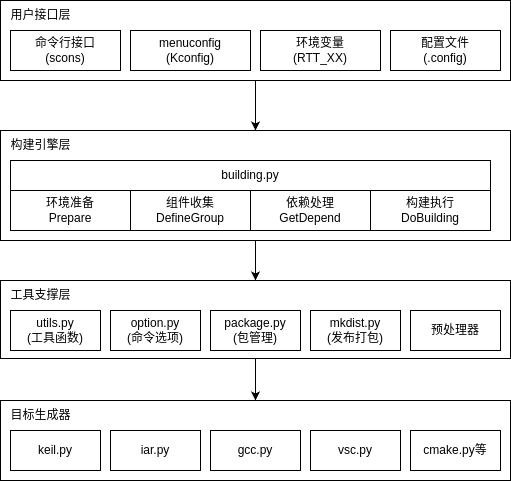
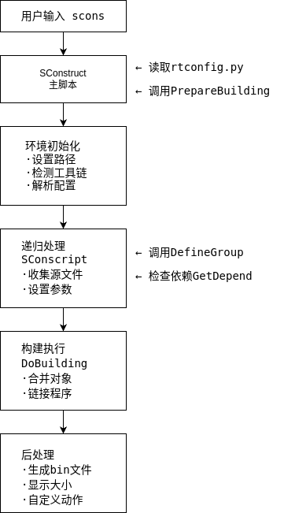

# RT-Thread 构建系统技术原理

## 目录

1. [系统架构设计](#系统架构设计)
2. [核心模块分析](#核心模块分析)
3. [构建流程详解](#构建流程详解)
4. [依赖管理机制](#依赖管理机制)
5. [工具链适配层](#工具链适配层)
6. [项目生成器架构](#项目生成器架构)
7. [配置系统实现](#配置系统实现)
8. [扩展机制](#扩展机制)

## 系统架构设计

### 整体架构图



### 设计原则

1. **模块化设计**：每个功能模块独立，通过明确的接口交互
2. **可扩展性**：易于添加新的工具链支持和目标生成器
3. **跨平台兼容**：统一的抽象层处理平台差异
4. **配置驱动**：通过配置文件控制构建行为

## 核心模块分析

### 1. building.py - 构建引擎核心

#### 1.1 全局变量管理

```python
BuildOptions = {}  # 存储从rtconfig.h解析的宏定义
Projects = []      # 存储所有的组件对象
Rtt_Root = ''      # RT-Thread根目录
Env = None         # SCons环境对象
```

#### 1.2 PrepareBuilding 函数实现

```python
def PrepareBuilding(env, root_directory, has_libcpu=False, remove_components = []):
    """
    准备构建环境
    
    参数:
        env: SCons环境对象
        root_directory: RT-Thread根目录
        has_libcpu: 是否包含libcpu
        remove_components: 需要移除的组件列表
    """
    # 1. 添加命令行选项
    AddOptions()
    
    # 2. 设置全局环境变量
    global Env, Rtt_Root
    Env = env
    Rtt_Root = os.path.abspath(root_directory)
    
    # 3. 配置日志系统
    logging.basicConfig(level=logging.INFO)
    logger = logging.getLogger('rt-scons')
    Env['log'] = logger
    
    # 4. 工具链检测和配置
    if not utils.CmdExists(os.path.join(rtconfig.EXEC_PATH, rtconfig.CC)):
        # 尝试自动检测工具链
        try:
            envm = utils.ImportModule('env_utility')
            exec_path = envm.GetSDKPath(rtconfig.CC)
            if exec_path:
                rtconfig.EXEC_PATH = exec_path
        except:
            pass
    
    # 5. 解析rtconfig.h配置
    PreProcessor = create_preprocessor_instance()
    with open('rtconfig.h', 'r') as f:
        PreProcessor.process_contents(f.read())
    BuildOptions = PreProcessor.cpp_namespace
    
    # 6. 处理目标平台
    if GetOption('target'):
        # 根据目标设置工具链
        rtconfig.CROSS_TOOL, rtconfig.PLATFORM = tgt_dict[tgt_name]
    
    return objs
```

#### 1.3 DefineGroup 函数实现

```python
def DefineGroup(name, src, depend, **parameters):
    """
    定义一个组件组
    
    参数:
        name: 组名称
        src: 源文件列表
        depend: 依赖条件
        **parameters: 编译参数(CPPPATH, CPPDEFINES, LIBS等)
    
    返回:
        组对象列表
    """
    # 1. 检查依赖条件
    if not GetDepend(depend):
        return []
    
    # 2. 处理源文件
    if isinstance(src, list):
        # 过滤掉被移除的文件
        src = [s for s in src if s not in removed_src]
    
    # 3. 创建组对象
    group = {}
    group['name'] = name
    group['src'] = src
    
    # 4. 处理编译参数
    # 全局参数
    if 'CPPPATH' in parameters:
        group['CPPPATH'] = parameters['CPPPATH']
    
    # 本地参数(仅对当前组有效)
    if 'LOCAL_CPPPATH' in parameters:
        paths = parameters['LOCAL_CPPPATH']
        group['LOCAL_CPPPATH'] = [os.path.abspath(p) for p in paths]
    
    # 5. 注册到全局项目列表
    Projects.append(group)
    
    # 6. 返回SCons对象
    if src:
        objs = Env.Object(src)
    else:
        objs = []
    
    return objs
```

### 2. 依赖管理机制

#### 2.1 GetDepend 实现

```python
def GetDepend(depend):
    """
    检查依赖条件是否满足
    
    参数:
        depend: 字符串或字符串列表
    
    返回:
        True: 依赖满足
        False: 依赖不满足
    """
    # 1. 处理空依赖
    if not depend:
        return True
    
    # 2. 处理字符串依赖
    if isinstance(depend, str):
        return _CheckSingleDepend(depend)
    
    # 3. 处理列表依赖(AND关系)
    if isinstance(depend, list):
        for d in depend:
            if not _CheckSingleDepend(d):
                return False
        return True
    
    return False

def _CheckSingleDepend(depend):
    """检查单个依赖"""
    # 1. 检查是否在BuildOptions中定义
    if depend in BuildOptions:
        # 2. 检查值是否为真
        return BuildOptions[depend] != '0'
    return False
```

#### 2.2 依赖表达式支持

```python
# 支持的依赖表达式
depend = 'RT_USING_SERIAL'           # 单个依赖
depend = ['RT_USING_LWIP', 'SAL']    # AND关系
depend = ''                          # 无条件包含

# 高级用法 - 在SConscript中
if GetDepend('RT_USING_LWIP'):
    if GetDepend('RT_USING_LWIP_TCP'):
        src += ['tcp.c']
    if GetDepend('RT_USING_LWIP_UDP'):
        src += ['udp.c']
```

### 3. 配置解析系统

#### 3.1 预处理器实现

```python
class PreProcessor:
    """
    C预处理器实现，用于解析rtconfig.h
    """
    def __init__(self):
        self.cpp_namespace = {}
        self.defines = {}
    
    def process_contents(self, contents):
        """处理文件内容"""
        lines = contents.split('\n')
        
        for line in lines:
            # 处理 #define 指令
            if line.startswith('#define'):
                self._process_define(line)
            # 处理 #ifdef 等条件编译
            elif line.startswith('#ifdef'):
                self._process_ifdef(line)
    
    def _process_define(self, line):
        """处理宏定义"""
        # #define RT_NAME_MAX 12
        parts = line.split(None, 2)
        if len(parts) >= 2:
            name = parts[1]
            value = parts[2] if len(parts) > 2 else '1'
            self.cpp_namespace[name] = value
```

#### 3.2 配置文件格式

**rtconfig.h 示例**
```c
/* RT-Thread 配置文件 */
#ifndef RT_CONFIG_H__
#define RT_CONFIG_H__

/* 内核配置 */
#define RT_THREAD_PRIORITY_32
#define RT_THREAD_PRIORITY_MAX 32
#define RT_TICK_PER_SECOND 100
#define RT_USING_TIMER_SOFT

/* 组件配置 */
#define RT_USING_DEVICE
#define RT_USING_SERIAL
#define RT_SERIAL_RB_BUFSZ 64

/* 条件配置 */
#ifdef RT_USING_SERIAL
    #define RT_SERIAL_USING_DMA
#endif

#endif /* RT_CONFIG_H__ */
```

### 4. 工具链适配层

#### 4.1 工具链抽象接口

```python
class ToolchainBase:
    """工具链基类"""
    def __init__(self):
        self.name = ''
        self.prefix = ''
        self.suffix = ''
    
    def get_cc(self):
        """获取C编译器"""
        raise NotImplementedError
    
    def get_cflags(self):
        """获取C编译选项"""
        raise NotImplementedError
    
    def get_linkflags(self):
        """获取链接选项"""
        raise NotImplementedError
```

#### 4.2 GCC工具链实现

```python
class GccToolchain(ToolchainBase):
    def __init__(self, prefix=''):
        self.name = 'gcc'
        self.prefix = prefix
        self.suffix = ''
    
    def get_cc(self):
        return self.prefix + 'gcc'
    
    def get_cflags(self):
        flags = []
        # 基础选项
        flags += ['-Wall', '-g']
        # 优化选项
        if GetOption('optimization') == 'size':
            flags += ['-Os']
        else:
            flags += ['-O0']
        # 架构选项
        flags += ['-mcpu=cortex-m3', '-mthumb']
        return ' '.join(flags)
```

#### 4.3 Keil MDK适配

```python
class KeilToolchain(ToolchainBase):
    def __init__(self):
        self.name = 'keil'
        
    def setup_environment(self, env):
        """设置Keil特定的环境变量"""
        # 修改文件扩展名
        env['OBJSUFFIX'] = '.o'
        env['LIBPREFIX'] = ''
        env['LIBSUFFIX'] = '.lib'
        
        # 设置编译命令
        env['CC'] = 'armcc'
        env['AS'] = 'armasm'
        env['AR'] = 'armar'
        env['LINK'] = 'armlink'
        
        # 设置命令格式
        env['ARCOM'] = '$AR --create $TARGET $SOURCES'
```

### 5. 项目生成器架构

#### 5.1 生成器基类

```python
class ProjectGenerator:
    """项目生成器基类"""
    def __init__(self, env, project):
        self.env = env
        self.project = project
        self.template_dir = ''
    
    def generate(self):
        """生成项目文件"""
        self._prepare()
        self._generate_project_file()
        self._generate_workspace_file()
        self._copy_template_files()
        self._post_process()
    
    def _collect_source_files(self):
        """收集源文件"""
        sources = []
        for group in self.project:
            sources.extend(group['src'])
        return sources
    
    def _collect_include_paths(self):
        """收集头文件路径"""
        paths = []
        for group in self.project:
            if 'CPPPATH' in group:
                paths.extend(group['CPPPATH'])
        return list(set(paths))  # 去重
```

#### 5.2 VS Code生成器实现

```python
class VSCodeGenerator(ProjectGenerator):
    """VS Code项目生成器"""
    
    def _generate_project_file(self):
        """生成VS Code配置文件"""
        # 创建.vscode目录
        vscode_dir = os.path.join(self.env['BSP_ROOT'], '.vscode')
        if not os.path.exists(vscode_dir):
            os.makedirs(vscode_dir)
        
        # 生成c_cpp_properties.json
        self._generate_cpp_properties()
        
        # 生成tasks.json
        self._generate_tasks()
        
        # 生成launch.json
        self._generate_launch()
    
    def _generate_cpp_properties(self):
        """生成IntelliSense配置"""
        config = {
            "configurations": [{
                "name": "RT-Thread",
                "includePath": self._collect_include_paths(),
                "defines": self._collect_defines(),
                "compilerPath": self._get_compiler_path(),
                "cStandard": "c99",
                "cppStandard": "c++11",
                "intelliSenseMode": "gcc-arm"
            }],
            "version": 4
        }
        
        # 写入文件
        file_path = os.path.join('.vscode', 'c_cpp_properties.json')
        with open(file_path, 'w') as f:
            json.dump(config, f, indent=4)
```

#### 5.3 Keil MDK5生成器

```python
class MDK5Generator(ProjectGenerator):
    """Keil MDK5项目生成器"""
    
    def _generate_project_file(self):
        """生成uvprojx文件"""
        # 加载XML模板
        tree = etree.parse(self.template_file)
        root = tree.getroot()
        
        # 更新目标配置
        self._update_target_options(root)
        
        # 添加文件组
        groups_node = root.find('.//Groups')
        for group in self.project:
            self._add_file_group(groups_node, group)
        
        # 保存项目文件
        tree.write('project.uvprojx', encoding='utf-8', 
                   xml_declaration=True)
    
    def _add_file_group(self, parent, group):
        """添加文件组"""
        group_elem = etree.SubElement(parent, 'Group')
        
        # 组名
        name_elem = etree.SubElement(group_elem, 'GroupName')
        name_elem.text = group['name']
        
        # 文件列表
        files_elem = etree.SubElement(group_elem, 'Files')
        for src in group['src']:
            self._add_file(files_elem, src)
```

### 6. 编译数据库生成

#### 6.1 compile_commands.json生成

```python
def generate_compile_commands(env, project):
    """
    生成compile_commands.json用于代码分析工具
    """
    commands = []
    
    for group in project:
        for src in group['src']:
            if src.endswith('.c') or src.endswith('.cpp'):
                cmd = {
                    "directory": env['BSP_ROOT'],
                    "file": os.path.abspath(src),
                    "command": _generate_compile_command(env, src, group)
                }
                commands.append(cmd)
    
    # 写入文件
    with open('compile_commands.json', 'w') as f:
        json.dump(commands, f, indent=2)

def _generate_compile_command(env, src, group):
    """生成单个文件的编译命令"""
    cmd = []
    
    # 编译器
    cmd.append(env['CC'])
    
    # 编译选项
    cmd.extend(env['CFLAGS'].split())
    
    # 头文件路径
    for path in group.get('CPPPATH', []):
        cmd.append('-I' + path)
    
    # 宏定义
    for define in group.get('CPPDEFINES', []):
        if isinstance(define, tuple):
            cmd.append('-D{}={}'.format(define[0], define[1]))
        else:
            cmd.append('-D' + define)
    
    # 源文件
    cmd.append(src)
    
    return ' '.join(cmd)
```

### 7. 分发系统实现

#### 7.1 分发包生成流程

```python
def MkDist(program, BSP_ROOT, RTT_ROOT, Env, project):
    """生成分发包"""
    # 1. 创建分发目录
    dist_name = os.path.basename(BSP_ROOT)
    dist_dir = os.path.join(BSP_ROOT, 'dist', dist_name)
    
    # 2. 复制RT-Thread内核
    print('=> copy RT-Thread kernel')
    copytree(os.path.join(RTT_ROOT, 'src'), 
             os.path.join(dist_dir, 'rt-thread', 'src'))
    copytree(os.path.join(RTT_ROOT, 'include'),
             os.path.join(dist_dir, 'rt-thread', 'include'))
    
    # 3. 复制使用的组件
    print('=> copy components')
    for group in project:
        _copy_group_files(group, dist_dir)
    
    # 4. 生成Kconfig文件
    _generate_kconfig(dist_dir, project)
    
    # 5. 打包
    make_zip(dist_dir, dist_name + '.zip')
```

#### 7.2 精简分发包生成

```python
def MkDist_Strip(program, BSP_ROOT, RTT_ROOT, Env):
    """
    基于compile_commands.json生成精简分发包
    只包含实际使用的文件
    """
    # 1. 解析compile_commands.json
    with open('compile_commands.json', 'r') as f:
        commands = json.load(f)
    
    # 2. 提取使用的文件
    used_files = set()
    for cmd in commands:
        # 源文件
        used_files.add(cmd['file'])
        
        # 解析包含的头文件
        includes = _parse_includes(cmd['file'], cmd['command'])
        used_files.update(includes)
    
    # 3. 复制文件
    for file in used_files:
        _copy_with_structure(file, dist_dir)
```

## 构建流程详解

### 完整构建流程图



### 依赖解析流程

```python
def dependency_resolution_flow():
    """
    依赖解析流程示例
    """
    # 1. 从rtconfig.h读取所有宏定义
    macros = parse_rtconfig_h()
    # 例: {'RT_USING_SERIAL': '1', 'RT_USING_PIN': '1'}
    
    # 2. 处理单个组件
    for component in components:
        # 3. 检查依赖条件
        if check_dependencies(component.depends, macros):
            # 4. 包含组件
            include_component(component)
        else:
            # 5. 跳过组件
            skip_component(component)
    
    # 6. 递归处理子依赖
    resolve_sub_dependencies()
```

## 扩展机制

### 1. 添加新的工具链支持

```python
# 1. 在tgt_dict中添加映射
tgt_dict['mycc'] = ('mycc', 'mycc')

# 2. 创建tools/mycc.py
import os
from building import *

def generate_project(env, project):
    """生成项目文件"""
    print("Generating MyCC project...")
    
    # 收集信息
    info = ProjectInfo(env, project)
    
    # 生成项目文件
    # ...

# 3. 在rtconfig.py中配置
CROSS_TOOL = 'mycc'
PLATFORM = 'mycc'
```

### 2. 添加自定义构建步骤

```python
# 在SConstruct或SConscript中
def custom_builder(target, source, env):
    """自定义构建器"""
    # 执行自定义操作
    cmd = 'custom_tool -o {} {}'.format(target[0], source[0])
    os.system(cmd)

# 注册构建器
env['BUILDERS']['CustomBuild'] = Builder(action=custom_builder,
                                         suffix='.out',
                                         src_suffix='.in')

# 使用构建器
custom_out = env.CustomBuild('output.out', 'input.in')
```

### 3. 扩展配置解析器

```python
class ExtendedPreProcessor(PreProcessor):
    """扩展的预处理器"""
    
    def __init__(self):
        super().__init__()
        self.custom_handlers = {}
    
    def register_handler(self, directive, handler):
        """注册自定义指令处理器"""
        self.custom_handlers[directive] = handler
    
    def process_line(self, line):
        """处理单行"""
        # 检查自定义指令
        for directive, handler in self.custom_handlers.items():
            if line.startswith(directive):
                return handler(line)
        
        # 默认处理
        return super().process_line(line)
```

### 4. 插件系统实现

```python
class BuildPlugin:
    """构建插件基类"""
    
    def __init__(self, name):
        self.name = name
    
    def pre_build(self, env, project):
        """构建前钩子"""
        pass
    
    def post_build(self, env, project):
        """构建后钩子"""
        pass
    
    def configure(self, env):
        """配置环境"""
        pass

# 插件管理器
class PluginManager:
    def __init__(self):
        self.plugins = []
    
    def register(self, plugin):
        self.plugins.append(plugin)
    
    def run_pre_build(self, env, project):
        for plugin in self.plugins:
            plugin.pre_build(env, project)
```

## 性能优化

### 1. 构建缓存机制

```python
class BuildCache:
    """构建缓存"""
    
    def __init__(self, cache_dir='.scache'):
        self.cache_dir = cache_dir
        self.cache_db = os.path.join(cache_dir, 'cache.db')
    
    def get_hash(self, file):
        """计算文件哈希"""
        import hashlib
        with open(file, 'rb') as f:
            return hashlib.md5(f.read()).hexdigest()
    
    def is_cached(self, source, target):
        """检查是否已缓存"""
        # 检查目标文件是否存在
        if not os.path.exists(target):
            return False
        
        # 检查源文件是否更新
        source_hash = self.get_hash(source)
        cached_hash = self.load_hash(source)
        
        return source_hash == cached_hash
```

### 2. 并行构建优化

```python
def optimize_parallel_build(env, project):
    """优化并行构建"""
    # 1. 分析依赖关系
    dep_graph = analyze_dependencies(project)
    
    # 2. 计算最优构建顺序
    build_order = topological_sort(dep_graph)
    
    # 3. 分组独立任务
    parallel_groups = []
    for level in build_order:
        # 同一层级可以并行
        parallel_groups.append(level)
    
    # 4. 设置并行度
    import multiprocessing
    num_jobs = multiprocessing.cpu_count()
    env.SetOption('num_jobs', num_jobs)
    
    return parallel_groups
```

## 调试技巧

### 1. 构建日志分析

```python
# 启用详细日志
def enable_build_logging():
    # 设置SCons日志
    env.SetOption('debug', 'explain')
    
    # 自定义日志
    class BuildLogger:
        def __init__(self, logfile):
            self.logfile = logfile
        
        def __call__(self, msg, *args):
            with open(self.logfile, 'a') as f:
                f.write(msg % args + '\n')
    
    logger = BuildLogger('build.log')
    env['PRINT_CMD_LINE_FUNC'] = logger
```

### 2. 依赖关系可视化

```python
def visualize_dependencies(project):
    """生成依赖关系图"""
    import graphviz
    
    dot = graphviz.Digraph(comment='Dependencies')
    
    # 添加节点
    for group in project:
        dot.node(group['name'])
    
    # 添加边
    for group in project:
        for dep in group.get('depends', []):
            if find_group(dep):
                dot.edge(dep, group['name'])
    
    # 渲染
    dot.render('dependencies', format='png')
```

## 最佳实践

### 1. 模块化设计原则

- 每个功能模块独立的SConscript
- 明确的依赖关系声明
- 避免循环依赖
- 使用统一的命名规范

### 2. 性能优化建议

- 使用Glob谨慎，大目录下性能差
- 合理设置并行编译数
- 使用增量编译
- 避免重复的文件扫描

### 3. 可维护性建议

- 添加充分的注释
- 使用有意义的变量名
- 遵循Python PEP8规范
- 定期清理无用代码

### 4. 跨平台兼容性

- 使用os.path处理路径
- 避免平台特定的命令
- 测试多平台构建
- 处理路径分隔符差异

## 总结

RT-Thread的构建系统是一个精心设计的模块化系统，通过清晰的架构和灵活的扩展机制，为嵌入式开发提供了强大的构建能力。理解其内部原理有助于：

1. 更好地使用和优化构建流程
2. 快速定位和解决构建问题
3. 扩展支持新的工具链和平台
4. 为项目定制构建流程

构建系统的核心价值在于将复杂的嵌入式构建过程标准化和自动化，让开发者能够专注于功能开发而不是构建配置。