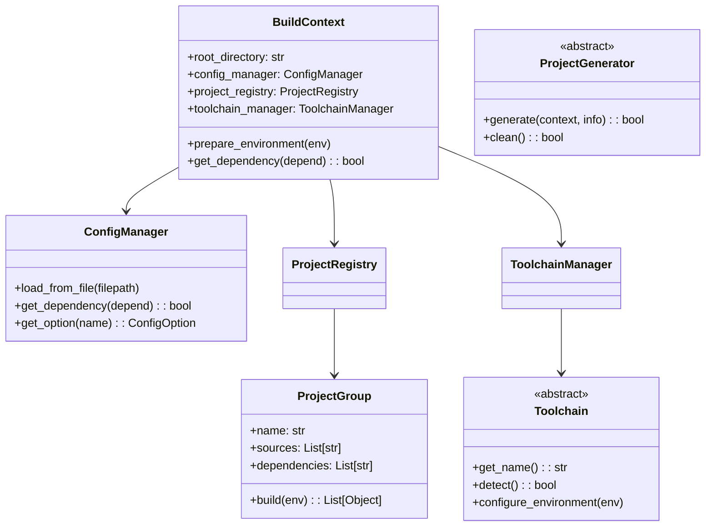

# RT-Thread Next Generation Build System

## 概述

RT-Thread NG（Next Generation）构建系统是对现有构建系统的面向对象重构，在保持完全向后兼容的同时，提供了更清晰的架构和更强的可扩展性。

## 特性

- ✅ **完全向后兼容**：现有的SConscript无需修改
- ✅ **面向对象设计**：清晰的类层次结构和职责分离
- ✅ **SCons最佳实践**：充分利用SCons的Environment对象
- ✅ **可扩展架构**：易于添加新的工具链和项目生成器
- ✅ **类型安全**：更好的类型提示和错误处理

## 架构设计

### 核心模块

```
ng/
├── __init__.py          # 包初始化
├── core.py              # 核心类：BuildContext
├── environment.py       # 环境扩展：RTEnv类，注入到SCons Environment
├── config.py            # 配置管理：解析rtconfig.h
├── project.py           # 项目管理：ProjectGroup和Registry
├── toolchain.py         # 工具链抽象：GCC、Keil、IAR等
├── generator.py         # 项目生成器：VS Code、CMake等
├── utils.py             # 工具函数：路径、版本等
├── adapter.py           # 适配器：与building.py集成
└── building_ng.py       # 示例：最小化修改的building.py
```

### 类图



## 使用方法

### 1. 最小化集成（推荐）

在building.py中添加少量代码即可集成新系统：

```python
# 在building.py的开头添加
try:
    from ng.adapter import (
        init_build_context,
        inject_environment_methods,
        load_rtconfig as ng_load_rtconfig
    )
    USE_NG = True
except ImportError:
    USE_NG = False

# 在PrepareBuilding函数中添加
def PrepareBuilding(env, root_directory, has_libcpu=False, remove_components=[]):
    # ... 原有代码 ...
    
    # 集成新系统
    if USE_NG:
        context = init_build_context(root_directory)
        inject_environment_methods(env)
        ng_load_rtconfig('rtconfig.h')
    
    # ... 继续原有代码 ...
```

### 2. 使用新的环境方法

集成后，SCons Environment对象会自动获得新方法：

```python
# 在SConscript中使用新方法
Import('env')

# 使用环境方法（推荐）
src = env.GlobFiles('*.c')
group = env.DefineGroup('MyComponent', src, depend=['RT_USING_XXX'])

# 也可以使用传统方式（保持兼容）
from building import *
group = DefineGroup('MyComponent', src, depend=['RT_USING_XXX'])
```

### 3. 新的项目生成器

新系统提供了改进的项目生成器：

```bash
# 生成VS Code项目
scons --target=vscode

# 生成CMake项目
scons --target=cmake
```

## API参考

### 环境方法

所有方法都被注入到SCons Environment对象中：

#### env.DefineGroup(name, src, depend, **kwargs)
定义一个组件组。

**参数：**
- `name`: 组名称
- `src`: 源文件列表
- `depend`: 依赖条件（字符串或列表）
- `**kwargs`: 额外参数
  - `CPPPATH`: 头文件路径
  - `CPPDEFINES`: 宏定义
  - `CFLAGS`/`CXXFLAGS`: 编译选项
  - `LOCAL_CFLAGS`/`LOCAL_CPPPATH`: 仅对当前组有效的选项
  - `LIBS`/`LIBPATH`: 库配置

**返回：** 构建对象列表

**示例：**
```python
src = ['driver.c', 'hal.c']
group = env.DefineGroup('Driver', 
    src, 
    depend=['RT_USING_DEVICE'],
    CPPPATH=[env.GetCurrentDir()],
    LOCAL_CFLAGS='-O3'
)
```

#### env.GetDepend(depend)
检查依赖是否满足。

**参数：**
- `depend`: 依赖名称或列表

**返回：** True如果依赖满足

**示例：**
```python
if env.GetDepend('RT_USING_SERIAL'):
    src += ['serial.c']

if env.GetDepend(['RT_USING_SERIAL', 'RT_SERIAL_USING_DMA']):
    src += ['serial_dma.c']
```

#### env.SrcRemove(src, remove)
从源文件列表中移除文件。

**参数：**
- `src`: 源文件列表（就地修改）
- `remove`: 要移除的文件

**示例：**
```python
src = env.GlobFiles('*.c')
env.SrcRemove(src, ['test.c', 'debug.c'])
```

#### env.BuildPackage(package_path)
从package.json构建软件包。

**参数：**
- `package_path`: package.json路径

**返回：** 构建对象列表

**示例：**
```python
objs = env.BuildPackage('package.json')
```

#### env.GetContext()
获取当前构建上下文。

**返回：** BuildContext实例

**示例：**
```python
context = env.GetContext()
if context:
    context.logger.info("Building component...")
```

## 高级特性

### 1. 自定义工具链

创建自定义工具链：

```python
from ng.toolchain import Toolchain

class MyToolchain(Toolchain):
    def get_name(self):
        return "mycc"
        
    def detect(self):
        # 检测工具链
        return shutil.which("mycc") is not None
        
    def configure_environment(self, env):
        env['CC'] = 'mycc'
        env['CFLAGS'] = '-O2 -Wall'
        
# 注册工具链
context = env.GetContext()
context.toolchain_manager.register_toolchain('mycc', MyToolchain())
```

### 2. 自定义项目生成器

创建自定义项目生成器：

```python
from ng.generator import ProjectGenerator

class MyGenerator(ProjectGenerator):
    def get_name(self):
        return "myide"
        
    def generate(self, context, project_info):
        # 生成项目文件
        self._ensure_output_dir()
        # ... 生成逻辑 ...
        return True
        
# 注册生成器
context.generator_registry.register('myide', MyGenerator)
```

### 3. 构建钩子

使用构建上下文添加钩子：

```python
context = env.GetContext()

# 添加日志
context.logger.info("Starting build...")

# 访问配置
if context.config_manager.get_option('RT_THREAD_PRIORITY_MAX'):
    print("Max priority:", context.config_manager.get_value('RT_THREAD_PRIORITY_MAX'))

# 获取项目信息
info = context.project_registry.get_project_info()
print(f"Total sources: {len(info['all_sources'])}")
```

## 迁移指南

### 从旧版本迁移

1. **无需修改**：现有的SConscript文件无需任何修改即可工作
2. **可选升级**：可以逐步将`DefineGroup`调用改为`env.DefineGroup`
3. **新功能**：可以开始使用新的特性如`env.BuildPackage`

### 最佳实践

1. **使用环境方法**：优先使用`env.DefineGroup`而不是全局函数
2. **类型提示**：在Python 3.5+中使用类型提示
3. **错误处理**：使用context.logger记录错误和警告
4. **路径处理**：使用PathService处理跨平台路径

## 性能优化

新系统包含多项性能优化：

1. **配置缓存**：依赖检查结果会被缓存
2. **延迟加载**：工具链和生成器按需加载
3. **并行支持**：项目生成可以并行执行

## 测试

运行测试套件：

```bash
cd tools/ng
python -m pytest tests/
```

## 贡献

欢迎贡献代码！请遵循以下准则：

1. 保持向后兼容性
2. 添加类型提示
3. 编写单元测试
4. 更新文档

## 路线图

- [ ] 完整的测试覆盖
- [ ] 性能基准测试
- [ ] 插件系统
- [ ] 更多项目生成器（Eclipse、Qt Creator等）
- [ ] 构建缓存系统
- [ ] 分布式构建支持

## 许可证

本项目遵循RT-Thread的Apache License 2.0许可证。